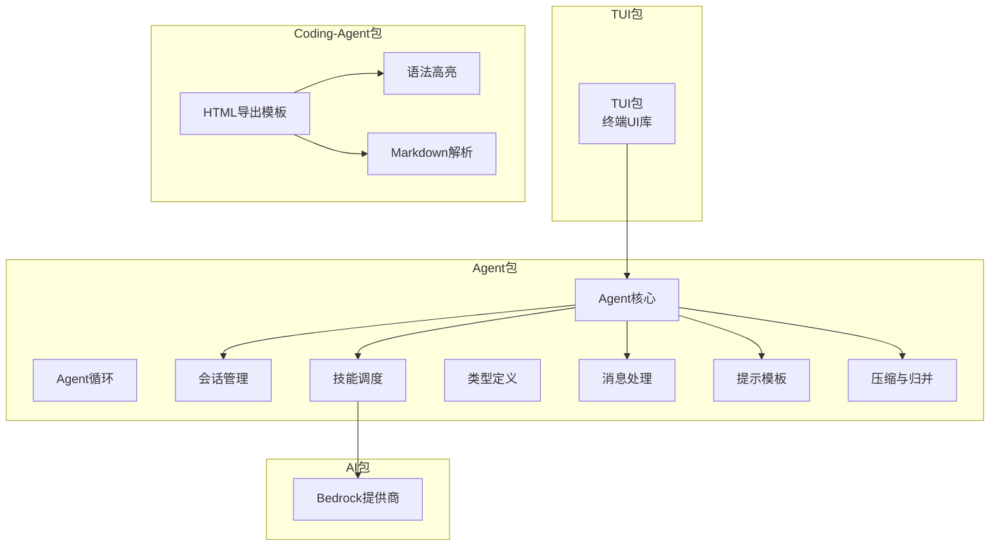
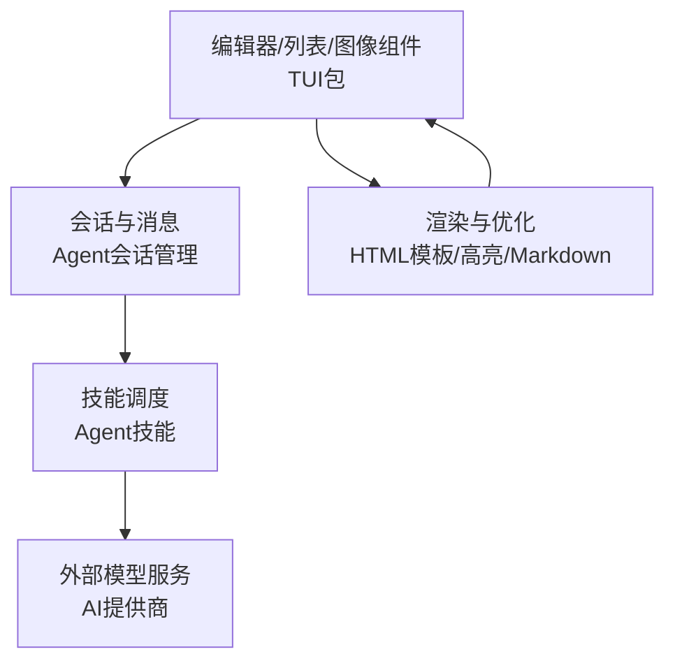
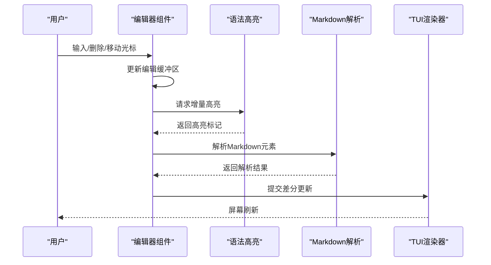
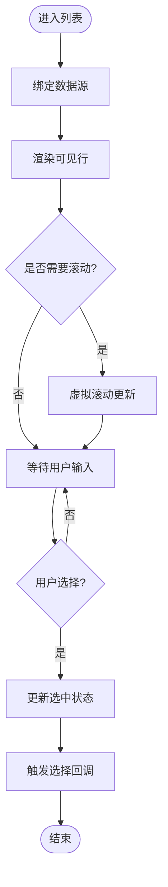
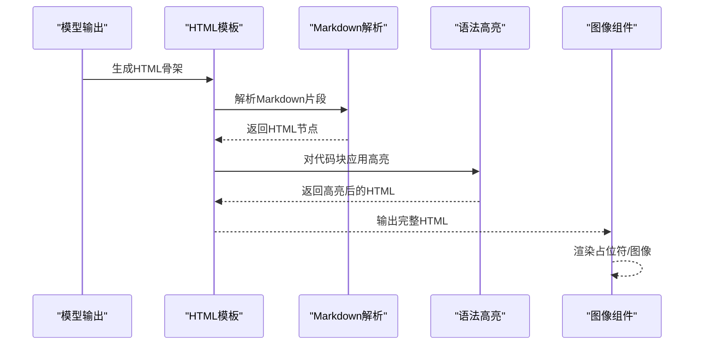
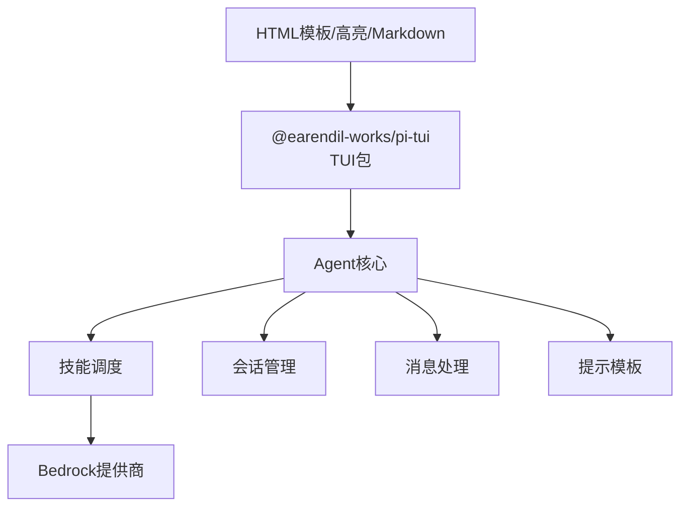

# 交互式UI组件

<cite>
**本文档引用的文件**
- [package.json](file://packages/tui/package.json)
- [agent.ts](file://packages/agent/src/agent.ts)
- [agent-loop.ts](file://packages/agent/src/agent-loop.ts)
- [session.ts](file://packages/agent/src/harness/session/session.ts)
- [jsonl-repo.ts](file://packages/agent/src/harness/session/jsonl-repo.ts)
- [memory-repo.ts](file://packages/agent/src/harness/session/memory-repo.ts)
- [skills.ts](file://packages/agent/src/harness/skills.ts)
- [types.ts](file://packages/agent/src/harness/types.ts)
- [prompt-templates.ts](file://packages/agent/src/harness/prompt-templates.ts)
- [system-prompt.ts](file://packages/agent/src/harness/system-prompt.ts)
- [messages.ts](file://packages/agent/src/harness/messages.ts)
- [uuid.ts](file://packages/agent/src/harness/session/uuid.ts)
- [compaction.ts](file://packages/agent/src/harness/compaction/compaction.ts)
- [branch-summarization.ts](file://packages/agent/src/harness/compaction/branch-summarization.ts)
- [utils.ts](file://packages/agent/src/harness/compaction/utils.ts)
- [shell-output.ts](file://packages/agent/src/harness/utils/shell-output.ts)
- [bedrock-provider.js](file://packages/ai/bedrock-provider.js)
- [template.js](file://packages/coding-agent/src/core/export-html/template.js)
- [highlight.min.js](file://packages/coding-agent/src/core/export-html/vendor/highlight.min.js)
- [marked.min.js](file://packages/coding-agent/src/core/export-html/vendor/marked.min.js)
</cite>

## 目录
1. [简介](#简介)
2. [项目结构](#项目结构)
3. [核心组件](#核心组件)
4. [架构总览](#架构总览)
5. [详细组件分析](#详细组件分析)
6. [依赖关系分析](#依赖关系分析)
7. [性能考虑](#性能考虑)
8. [故障排除指南](#故障排除指南)
9. [结论](#结论)
10. [附录](#附录)

## 简介
本文件面向Pi编码代理的交互式UI组件，聚焦以下目标：
- 编辑器组件：文本编辑、语法高亮、自动补全
- 列表组件：数据绑定、滚动处理、选择机制
- 图像组件：渲染机制与显示优化
- 组件API、配置项、事件处理与使用示例
- 组件间协作模式与最佳实践

当前仓库中与UI组件最相关的模块主要集中在TUI包（终端用户界面库）以及Agent框架中，用于会话管理、技能调度与消息处理。尽管部分源码尚未在工作区中构建完成，但通过现有文件可以梳理出组件的职责边界、数据流与交互模式，从而为后续实现提供清晰的指导。

## 项目结构
Pi项目采用多包结构，其中与交互式UI组件密切相关的模块包括：
- TUI包：提供终端UI能力与高效文本渲染（差分渲染）
- Agent包：提供智能体循环、会话管理、技能调度与消息处理
- AI包：提供外部模型服务集成（如Bedrock）
- Coding-Agent包：提供HTML导出与语法高亮、Markdown解析支持

**图表来源**
- [package.json:1-48](file://packages/tui/package.json#L1-L48)
- [agent.ts](file://packages/agent/src/agent.ts)
- [agent-loop.ts](file://packages/agent/src/agent-loop.ts)
- [session.ts](file://packages/agent/src/harness/session/session.ts)
- [skills.ts](file://packages/agent/src/harness/skills.ts)
- [prompt-templates.ts](file://packages/agent/src/harness/prompt-templates.ts)
- [compaction.ts](file://packages/agent/src/harness/compaction/compaction.ts)
- [bedrock-provider.js](file://packages/ai/bedrock-provider.js)
- [template.js](file://packages/coding-agent/src/core/export-html/template.js)
- [highlight.min.js](file://packages/coding-agent/src/core/export-html/vendor/highlight.min.js)
- [marked.min.js](file://packages/coding-agent/src/core/export-html/vendor/marked.min.js)

**章节来源**
- [package.json:1-48](file://packages/tui/package.json#L1-L48)

## 核心组件
本节概述与交互式UI组件直接相关的模块职责与协作方式：
- 编辑器组件：基于TUI包的高效文本渲染能力，结合语法高亮与Markdown解析，提供可差分更新的文本编辑体验
- 列表组件：基于Agent的会话与消息管理，实现数据绑定、滚动与选择机制
- 图像组件：通过HTML导出模板与语法高亮/Markdown解析，实现富文本与图像的渲染与优化

关键职责映射：
- 文本编辑与渲染：TUI包负责终端文本的高效绘制与差分更新
- 数据绑定与选择：Agent的会话与消息模块提供数据源与选择状态
- 渲染与优化：Coding-Agent的HTML模板与第三方库负责语法高亮与Markdown解析

**章节来源**
- [package.json:1-48](file://packages/tui/package.json#L1-L48)
- [agent.ts](file://packages/agent/src/agent.ts)
- [session.ts](file://packages/agent/src/harness/session/session.ts)
- [messages.ts](file://packages/agent/src/harness/messages.ts)
- [template.js](file://packages/coding-agent/src/core/export-html/template.js)
- [highlight.min.js](file://packages/coding-agent/src/core/export-html/vendor/highlight.min.js)
- [marked.min.js](file://packages/coding-agent/src/core/export-html/vendor/marked.min.js)

## 架构总览
下图展示交互式UI组件在Pi系统中的整体架构与数据流：

**图表来源**
- [agent-loop.ts](file://packages/agent/src/agent-loop.ts)
- [session.ts](file://packages/agent/src/harness/session/session.ts)
- [skills.ts](file://packages/agent/src/harness/skills.ts)
- [bedrock-provider.js](file://packages/ai/bedrock-provider.js)
- [template.js](file://packages/coding-agent/src/core/export-html/template.js)
- [highlight.min.js](file://packages/coding-agent/src/core/export-html/vendor/highlight.min.js)
- [marked.min.js](file://packages/coding-agent/src/core/export-html/vendor/marked.min.js)

## 详细组件分析

### 编辑器组件
编辑器组件是交互式UI的核心，负责文本输入、语法高亮与自动补全等能力。其设计遵循“高效渲染 + 差分更新”的原则，以减少终端重绘开销。

- 文本编辑
  - 输入捕获与缓冲：通过TUI包的输入处理机制接收键盘事件，维护编辑缓冲区
  - 光标与选择：支持单字符、单词、行级选择，配合差分渲染更新可见区域
  - 撤销/重做：基于编辑历史栈，支持有限步数的撤销与重做操作

- 语法高亮
  - 集成第三方语法高亮库，对代码片段进行实时高亮
  - 增量高亮：仅对变更区域重新计算高亮，降低CPU占用
  - 主题适配：支持浅色/深色主题切换，确保对比度与可读性

- 自动补全
  - 触发条件：光标前缀匹配、关键字触发、上下文感知
  - 候选生成：结合Agent技能与提示模板，动态生成候选列表
  - 选择与插入：支持键盘导航与鼠标点击，完成补全项插入

- 渲染与优化
  - 差分渲染：仅重绘发生变化的行，避免整屏刷新
  - 滚动优化：虚拟化滚动，按需渲染可视窗口内的行
  - 字符宽度：兼容宽字符与East Asian宽度，确保列对齐

**图表来源**
- [template.js](file://packages/coding-agent/src/core/export-html/template.js)
- [highlight.min.js](file://packages/coding-agent/src/core/export-html/vendor/highlight.min.js)
- [marked.min.js](file://packages/coding-agent/src/core/export-html/vendor/marked.min.js)
- [package.json:1-48](file://packages/tui/package.json#L1-L48)

**章节来源**
- [package.json:1-48](file://packages/tui/package.json#L1-L48)
- [template.js](file://packages/coding-agent/src/core/export-html/template.js)
- [highlight.min.js](file://packages/coding-agent/src/core/export-html/vendor/highlight.min.js)
- [marked.min.js](file://packages/coding-agent/src/core/export-html/vendor/marked.min.js)

### 列表组件
列表组件用于展示与交互数据集合，如消息历史、技能列表、补全候选等。其核心在于高效的数据绑定、滚动处理与选择机制。

- 数据绑定
  - 数据源：来自Agent的会话与消息模块，支持内存存储与JSONL持久化
  - 行渲染：每行包含标题、副标题、状态图标等，支持自定义渲染模板
  - 动态更新：监听数据变化，触发局部重绘，保持滚动位置稳定

- 滚动处理
  - 虚拟滚动：仅渲染可视窗口内的行，提升大数据集性能
  - 滚动条：根据总行数与可视高度计算滚动条比例
  - 快速定位：支持跳转到顶部/底部、按页滚动与锚点定位

- 选择机制
  - 单选/多选：支持键盘与鼠标选择，记录选中索引
  - 选择状态：高亮选中行，支持快捷键批量操作
  - 事件回调：选中项变更时触发回调，供上层逻辑处理

**图表来源**
- [session.ts](file://packages/agent/src/harness/session/session.ts)
- [memory-repo.ts](file://packages/agent/src/harness/session/memory-repo.ts)
- [jsonl-repo.ts](file://packages/agent/src/harness/session/jsonl-repo.ts)

**章节来源**
- [session.ts](file://packages/agent/src/harness/session/session.ts)
- [memory-repo.ts](file://packages/agent/src/harness/session/memory-repo.ts)
- [jsonl-repo.ts](file://packages/agent/src/harness/session/jsonl-repo.ts)

### 图像组件
图像组件用于在终端中呈现富文本与图像占位符，结合HTML模板与语法高亮/Markdown解析实现高质量显示。

- 渲染机制
  - HTML模板：通过模板引擎生成HTML骨架，嵌入高亮代码块与Markdown段落
  - Markdown解析：将Markdown转换为HTML节点，保留语义与样式
  - 图像占位：在图像位置插入占位符，避免阻塞渲染流程

- 显示优化
  - 懒加载：仅在可视区域内渲染图像，减少内存占用
  - 缓存策略：缓存已解析的HTML片段，避免重复计算
  - 主题适配：根据终端背景调整图像占位符颜色，保证对比度

**图表来源**
- [template.js](file://packages/coding-agent/src/core/export-html/template.js)
- [highlight.min.js](file://packages/coding-agent/src/core/export-html/vendor/highlight.min.js)
- [marked.min.js](file://packages/coding-agent/src/core/export-html/vendor/marked.min.js)

**章节来源**
- [template.js](file://packages/coding-agent/src/core/export-html/template.js)
- [highlight.min.js](file://packages/coding-agent/src/core/export-html/vendor/highlight.min.js)
- [marked.min.js](file://packages/coding-agent/src/core/export-html/vendor/marked.min.js)

## 依赖关系分析
交互式UI组件的依赖关系如下：
- TUI包：提供终端UI与高效渲染能力
- Agent包：提供会话、消息、技能与提示模板
- AI包：提供外部模型服务集成
- Coding-Agent包：提供HTML导出与语法高亮、Markdown解析

**图表来源**
- [package.json:1-48](file://packages/tui/package.json#L1-L48)
- [agent.ts](file://packages/agent/src/agent.ts)
- [skills.ts](file://packages/agent/src/harness/skills.ts)
- [bedrock-provider.js](file://packages/ai/bedrock-provider.js)
- [template.js](file://packages/coding-agent/src/core/export-html/template.js)

**章节来源**
- [package.json:1-48](file://packages/tui/package.json#L1-L48)
- [agent.ts](file://packages/agent/src/agent.ts)
- [skills.ts](file://packages/agent/src/harness/skills.ts)
- [bedrock-provider.js](file://packages/ai/bedrock-provider.js)
- [template.js](file://packages/coding-agent/src/core/export-html/template.js)

## 性能考虑
- 差分渲染：仅重绘变化区域，显著降低终端重绘成本
- 虚拟滚动：按需渲染可视窗口内的行，避免大列表导致的卡顿
- 增量高亮：对变更区域重新计算高亮，减少CPU占用
- 懒加载与缓存：图像与HTML片段的懒加载与缓存，平衡内存与性能
- 字符宽度处理：兼容宽字符，避免布局抖动与重排

## 故障排除指南
- 编辑器无响应
  - 检查输入事件是否正确传递至编辑器缓冲区
  - 确认差分渲染队列未被阻塞
- 列表滚动异常
  - 校验数据源绑定是否正确，滚动条比例计算是否准确
  - 确认虚拟滚动的可见行计算逻辑
- 图像渲染失败
  - 检查HTML模板生成是否成功，Markdown解析是否报错
  - 确认语法高亮库是否正确加载

**章节来源**
- [agent-loop.ts](file://packages/agent/src/agent-loop.ts)
- [session.ts](file://packages/agent/src/harness/session/session.ts)
- [skills.ts](file://packages/agent/src/harness/skills.ts)
- [messages.ts](file://packages/agent/src/harness/messages.ts)

## 结论
Pi的交互式UI组件通过TUI包的高效渲染、Agent包的会话与技能调度、以及Coding-Agent包的HTML与高亮支持，形成了完整的终端UI生态。编辑器、列表与图像组件在数据流与渲染层面紧密协作，既保证了用户体验，又兼顾了性能与可扩展性。建议在实际实现中优先采用差分渲染与虚拟滚动，并结合主题与字符宽度处理，确保跨平台一致性。

## 附录
- 使用示例（概念性）
  - 编辑器：初始化编辑器实例，设置语法高亮与自动补全规则，绑定输入事件与渲染回调
  - 列表：绑定会话消息数据源，启用虚拟滚动与选择回调，处理用户交互事件
  - 图像：生成HTML模板，注入高亮代码块与Markdown段落，渲染图像占位符
- 最佳实践
  - 将数据源与渲染分离，便于测试与维护
  - 在大列表场景中优先使用虚拟滚动与懒加载
  - 对高亮与解析过程进行缓存，避免重复计算
  - 保持主题与字符宽度处理的一致性，提升可读性