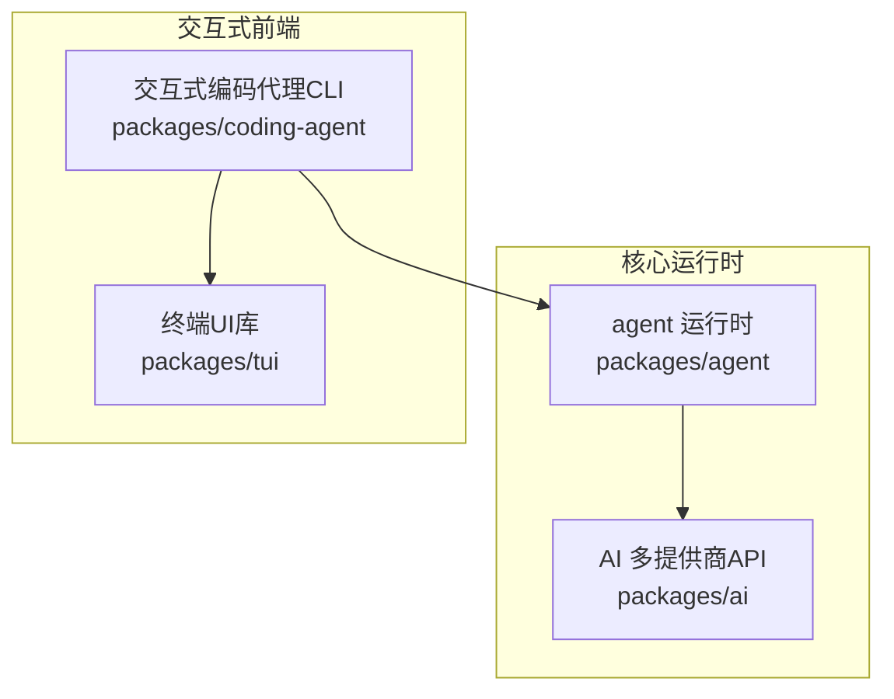
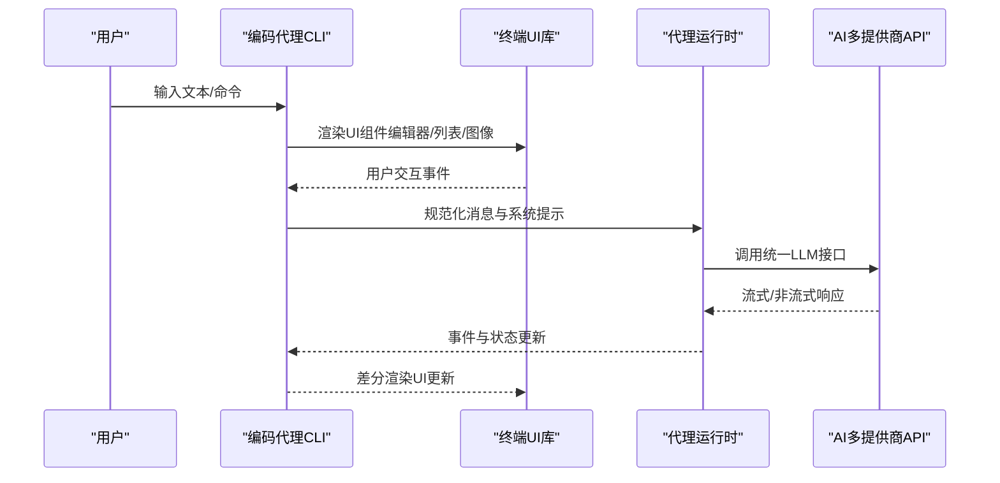
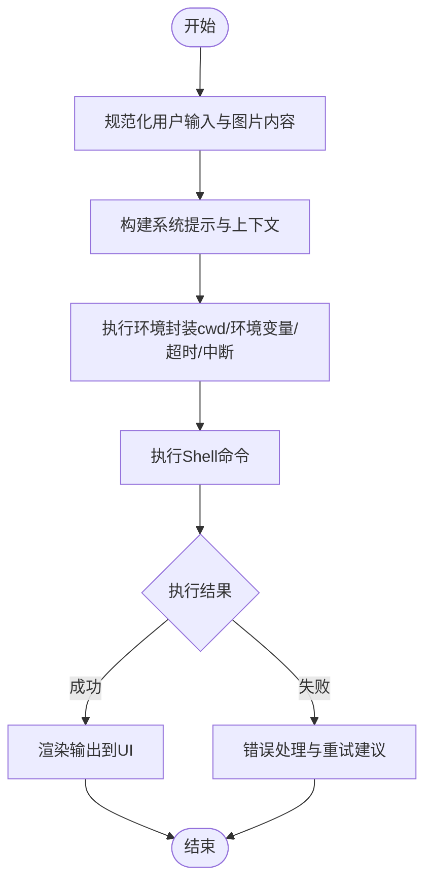
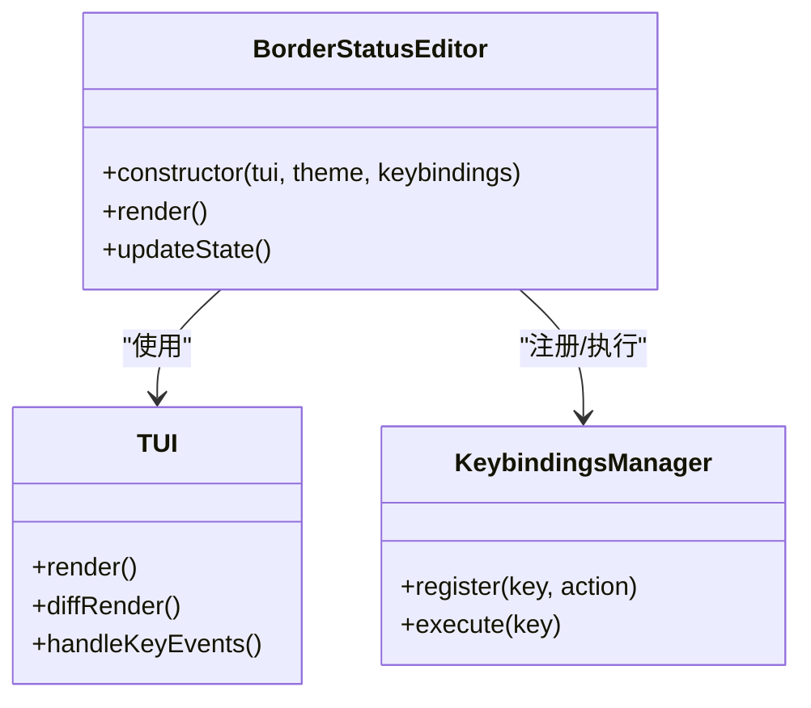
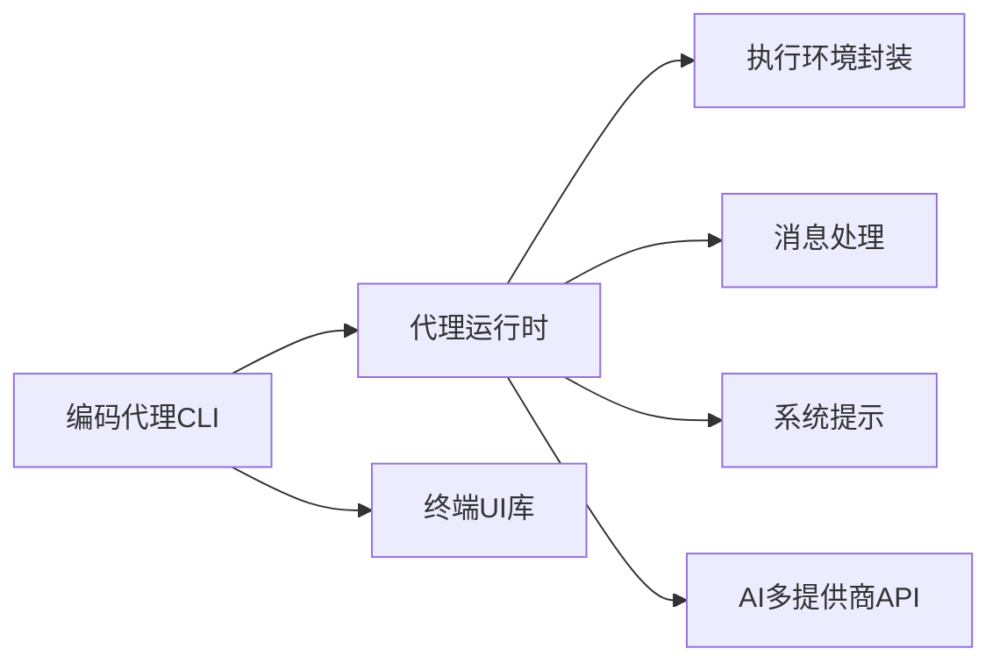

# 交互式模式

<cite>
**本文引用的文件**
- [README.md](file://README.md)
- [package.json](file://package.json)
- [packages/agent/src/agent.ts](file://packages/agent/src/agent.ts)
- [packages/agent/src/harness/agent-harness.ts](file://packages/agent/src/harness/agent-harness.ts)
- [packages/agent/src/harness/messages.ts](file://packages/agent/src/harness/messages.ts)
- [packages/agent/src/harness/system-prompt.ts](file://packages/agent/src/harness/system-prompt.ts)
- [packages/agent/src/harness/types.ts](file://packages/agent/src/harness/types.ts)
- [packages/agent/src/harness/env/nodejs.ts](file://packages/agent/src/harness/env/nodejs.ts)
- [packages/ai/src/cli.ts](file://packages/ai/src/cli.ts)
- [packages/coding-agent/examples/extensions/border-status-editor.ts](file://packages/coding-agent/examples/extensions/border-status-editor.ts)
- [packages/coding-agent/examples/extensions/doom-overlay/doom-component.ts](file://packages/coding-agent/examples/extensions/doom-overlay/doom-component.ts)
</cite>

## 目录
1. [简介](#简介)
2. [项目结构](#项目结构)
3. [核心组件](#核心组件)
4. [架构总览](#架构总览)
5. [详细组件分析](#详细组件分析)
6. [依赖关系分析](#依赖关系分析)
7. [性能考量](#性能考量)
8. [故障排查指南](#故障排查指南)
9. [结论](#结论)
10. [附录](#附录)

## 简介
本文件面向Pi编码代理的“交互式模式”，聚焦于交互式界面的使用方法、UI组件系统（编辑器、列表、图像等）、主题与自定义配置、以及实际交互示例与最佳实践。交互式模式通过终端UI库与编码代理运行时结合，提供可扩展的交互体验，并支持多提供商的大模型统一接入。

## 项目结构
该仓库采用Monorepo组织方式，核心与交互式能力分布在多个包中：
- packages/agent：代理运行时、工具调用、状态管理与会话处理
- packages/ai：多提供商大模型统一API（OpenAI、Anthropic、Google等）
- packages/coding-agent：交互式编码代理CLI与示例扩展
- packages/tui：终端UI库（差分渲染等）

图表来源
- [package.json:12-14](file://package.json#L12-L14)
- [README.md:48-56](file://README.md#L48-L56)

章节来源
- [README.md:19-56](file://README.md#L19-L56)
- [package.json:1-60](file://package.json#L1-60)

## 核心组件
- 代理运行时（agent）：负责事件订阅、消息规范化、提示词构建与系统提示注入、执行环境（如Shell命令）封装
- 编码代理（coding-agent）：交互式CLI入口与示例扩展，展示如何在TUI中集成编辑器、列表、图像等组件
- 终端UI库（tui）：提供基础UI能力（如差分渲染），并与编码代理示例配合实现主题与交互
- AI多提供商API（ai）：统一LLM接入，支持交互式登录选择与认证流程

章节来源
- [packages/agent/src/agent.ts:167-380](file://packages/agent/src/agent.ts#L167-L380)
- [packages/agent/src/harness/agent-harness.ts:42-241](file://packages/agent/src/harness/agent-harness.ts#L42-L241)
- [packages/ai/src/cli.ts:90](file://packages/ai/src/cli.ts#L90)
- [packages/coding-agent/examples/extensions/border-status-editor.ts:6](file://packages/coding-agent/examples/extensions/border-status-editor.ts#L6)

## 架构总览
交互式模式的整体数据流与控制流如下：

图表来源
- [packages/agent/src/agent.ts:325-380](file://packages/agent/src/agent.ts#L325-L380)
- [packages/agent/src/harness/agent-harness.ts:42-241](file://packages/agent/src/harness/agent-harness.ts#L42-L241)
- [packages/ai/src/cli.ts:90](file://packages/ai/src/cli.ts#L90)

## 详细组件分析

### 交互式界面与键盘快捷键
- 交互式CLI通过终端UI库进行渲染与事件处理，示例扩展展示了如何在TUI上下文中集成编辑器与状态显示组件
- 键盘事件处理由TUI负责，示例中包含按键释放检测逻辑，用于控制覆盖层或状态切换
- 建议在交互式模式下遵循以下快捷键约定（以示例扩展为参考）：
  - 使用方向键/Tab键在组件间导航
  - 回车确认选择或提交输入
  - ESC取消当前操作或关闭覆盖层
  - F1/F2等功能键触发特定行为（如切换主题、打开帮助）

章节来源
- [packages/coding-agent/examples/extensions/doom-overlay/doom-component.ts:8](file://packages/coding-agent/examples/extensions/doom-overlay/doom-component.ts#L8)

### 命令输入与文件浏览
- 代理运行时支持将用户输入与图片内容合并为消息，统一进入代理循环
- 执行环境封装了Shell命令执行，支持工作目录、环境变量覆盖、超时与中断信号
- 文件浏览可通过命令工具链实现（例如列出目录、打开文件），并在交互式模式中以列表组件呈现

图表来源
- [packages/agent/src/agent.ts:325-380](file://packages/agent/src/agent.ts#L325-L380)
- [packages/agent/src/harness/env/nodejs.ts:102-276](file://packages/agent/src/harness/env/nodejs.ts#L102-L276)

章节来源
- [packages/agent/src/agent.ts:325-380](file://packages/agent/src/agent.ts#L325-L380)
- [packages/agent/src/harness/env/nodejs.ts:102-276](file://packages/agent/src/harness/env/nodejs.ts#L102-L276)

### UI组件系统
- 编辑器组件：示例扩展展示了如何在TUI上下文中集成编辑器主题与键绑定管理器，支持边框状态与脏状态提示
- 列表组件：用于展示命令/文件/任务列表，支持高亮与选择反馈
- 图像组件：支持在消息中嵌入图片内容，便于视觉化提示与结果展示
- 主题系统：通过编辑器主题类型与键绑定管理器实现主题切换与交互风格定制

图表来源
- [packages/coding-agent/examples/extensions/border-status-editor.ts:6](file://packages/coding-agent/examples/extensions/border-status-editor.ts#L6)
- [packages/coding-agent/examples/extensions/border-status-editor.ts:120](file://packages/coding-agent/examples/extensions/border-status-editor.ts#L120)

章节来源
- [packages/coding-agent/examples/extensions/border-status-editor.ts:6](file://packages/coding-agent/examples/extensions/border-status-editor.ts#L6)
- [packages/coding-agent/examples/extensions/border-status-editor.ts:120](file://packages/coding-agent/examples/extensions/border-status-editor.ts#L120)

### 主题系统与自定义配置
- 主题通过编辑器主题类型传递给组件，允许在交互式模式中快速切换外观风格
- 键绑定管理器支持注册与执行自定义快捷键，便于根据个人习惯调整交互方式
- 配置项建议：
  - 主题名称：浅色/深色/高对比度
  - 键位映射：方向键/Tab/回车/ESC等
  - 组件样式：边框、选中高亮、字体大小
  - 功能开关：自动补全、语法高亮、状态栏显示

章节来源
- [packages/coding-agent/examples/extensions/border-status-editor.ts:120](file://packages/coding-agent/examples/extensions/border-status-editor.ts#L120)

### 实际交互示例与最佳实践
- 示例一：在交互式CLI中输入自然语言描述需求，代理运行时将其规范化为消息并调用AI多提供商API，最终通过TUI差分渲染返回结果
- 示例二：使用覆盖层组件（如Doom风格覆盖）在关键操作前进行确认或警告，避免误操作
- 最佳实践：
  - 将复杂命令拆分为可读性强的步骤，利用列表组件逐步展示
  - 在需要用户确认的关键路径上添加覆盖层与二次确认
  - 合理使用图片内容辅助说明，提升理解效率
  - 保持键位映射一致性，减少学习成本

章节来源
- [packages/agent/src/agent.ts:325-380](file://packages/agent/src/agent.ts#L325-L380)
- [packages/ai/src/cli.ts:90](file://packages/ai/src/cli.ts#L90)
- [packages/coding-agent/examples/extensions/doom-overlay/doom-component.ts:8](file://packages/coding-agent/examples/extensions/doom-overlay/doom-component.ts#L8)

## 依赖关系分析
- 编码代理CLI依赖代理运行时与终端UI库，同时通过系统提示与消息规范确保上下文一致
- 代理运行时依赖执行环境封装与消息处理模块，保证命令执行与事件分发的稳定性
- AI多提供商API为交互式模式提供统一的推理能力入口

图表来源
- [package.json:12-14](file://package.json#L12-L14)
- [packages/agent/src/harness/agent-harness.ts:42-241](file://packages/agent/src/harness/agent-harness.ts#L42-L241)
- [packages/agent/src/harness/system-prompt.ts:1-20](file://packages/agent/src/harness/system-prompt.ts#L1-L20)
- [packages/agent/src/harness/messages.ts:20-70](file://packages/agent/src/harness/messages.ts#L20-L70)

章节来源
- [package.json:12-14](file://package.json#L12-L14)
- [packages/agent/src/harness/agent-harness.ts:42-241](file://packages/agent/src/harness/agent-harness.ts#L42-L241)

## 性能考量
- 差分渲染：终端UI库采用差分渲染策略，仅更新变化区域，降低频繁刷新带来的开销
- 事件驱动：代理运行时通过事件订阅与异步监听机制，避免阻塞主线程
- 命令执行：执行环境封装支持超时与中断信号，防止长时间阻塞影响交互体验
- 图片传输：在消息中嵌入图片需注意带宽与渲染时间，建议按需加载与懒渲染

## 故障排查指南
- 交互无响应：检查事件监听是否在活跃运行周期内，确认代理运行时未处于空闲状态
- 命令执行失败：查看执行环境封装中的工作目录、环境变量与超时设置，必要时启用调试日志
- UI渲染异常：确认TUI库版本与组件主题配置一致，避免样式冲突导致的渲染问题
- LLM接入问题：通过AI多提供商CLI进行交互式登录与认证，确保凭据有效

章节来源
- [packages/agent/src/agent.ts:502-553](file://packages/agent/src/agent.ts#L502-L553)
- [packages/agent/src/harness/env/nodejs.ts:102-276](file://packages/agent/src/harness/env/nodejs.ts#L102-L276)
- [packages/ai/src/cli.ts:90](file://packages/ai/src/cli.ts#L90)

## 结论
交互式模式通过终端UI库与代理运行时的协同，提供了可扩展、可定制的交互式编程环境。借助统一的AI多提供商API与完善的执行环境封装，用户可以在CLI中高效完成从命令输入到结果渲染的全流程操作。通过主题与键绑定的灵活配置，以及覆盖层与列表等UI组件的组合使用，可以进一步提升交互效率与用户体验。

## 附录
- 快捷键建议清单
  - 导航：方向键/Tab
  - 确认：回车
  - 取消：ESC
  - 功能：F1-F12
- 配置项清单
  - 主题：浅色/深色/高对比度
  - 键位映射：方向键/Tab/回车/ESC
  - 组件样式：边框、选中高亮、字体大小
  - 功能开关：自动补全、语法高亮、状态栏显示