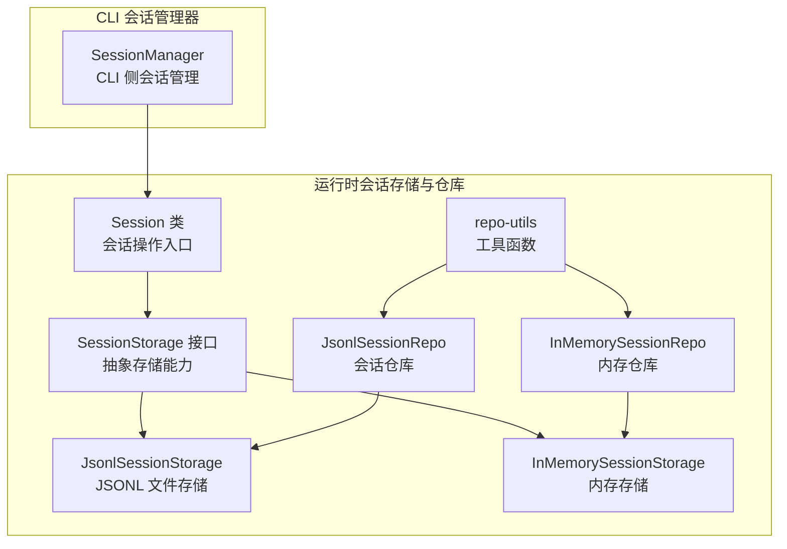
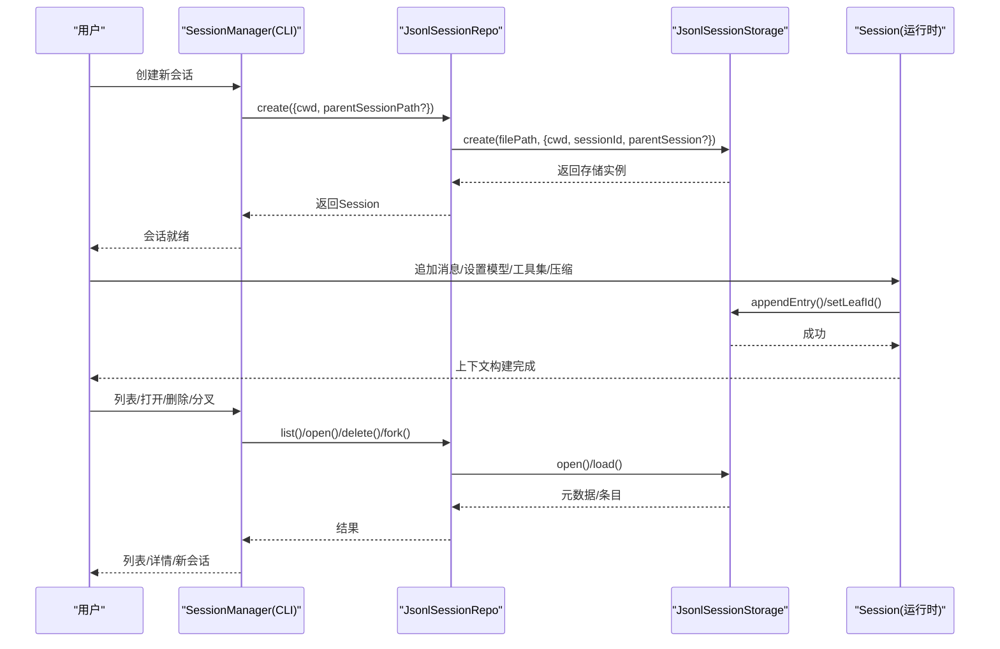
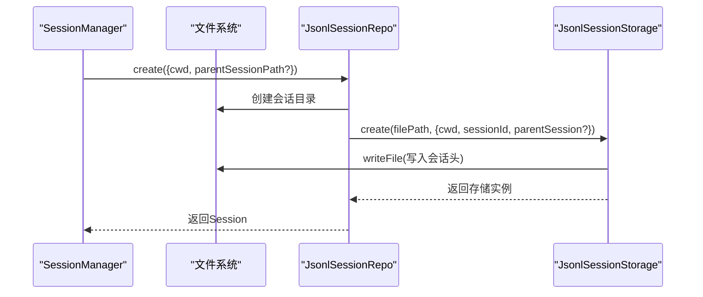
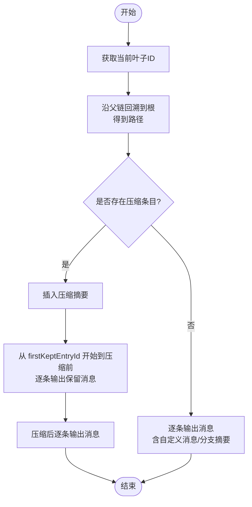
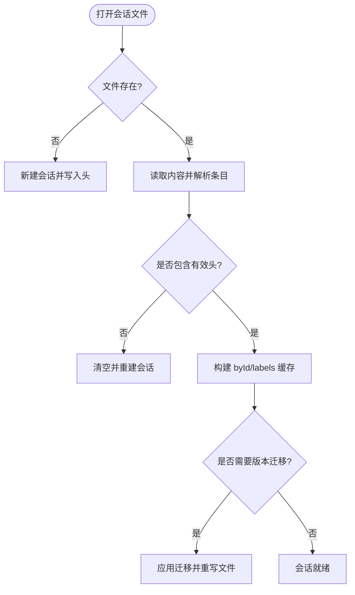
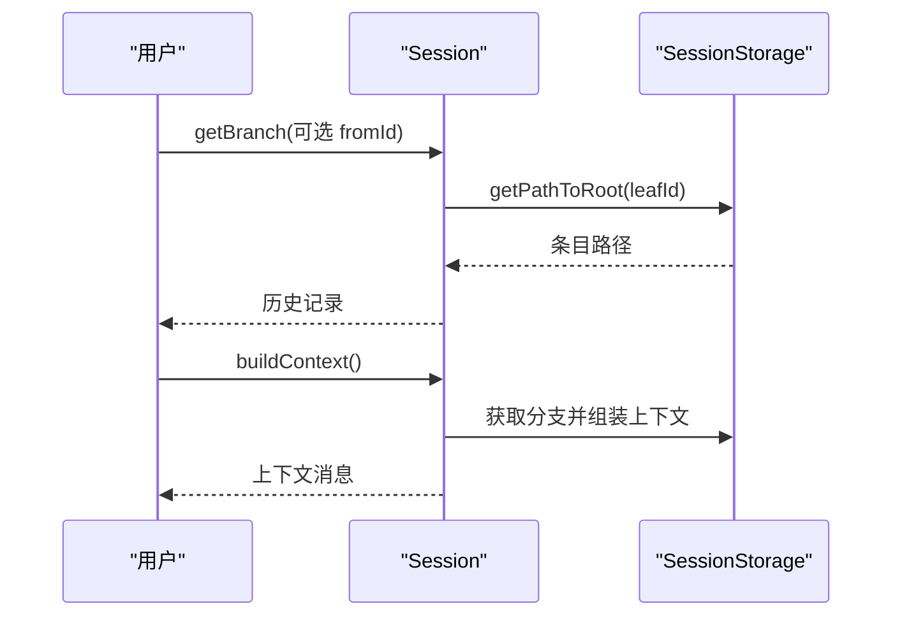
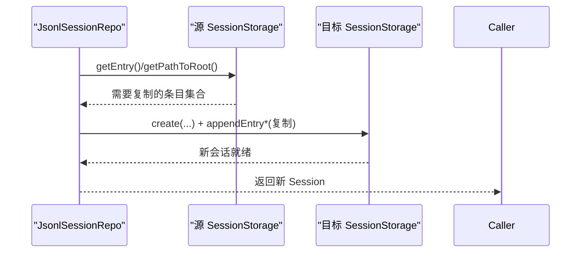
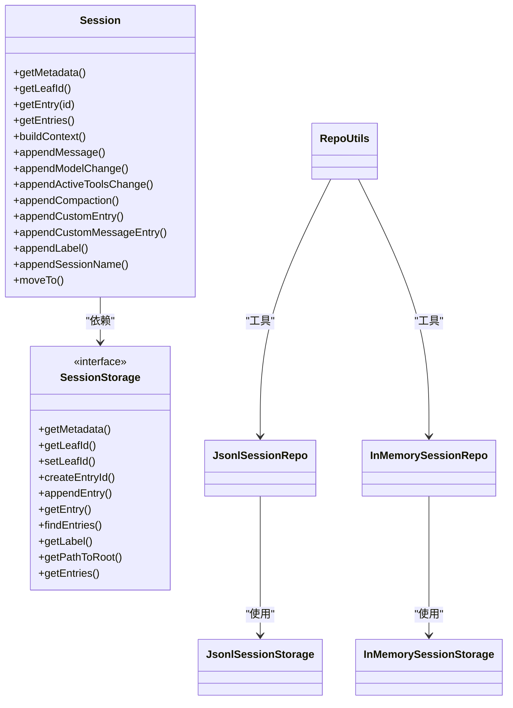

# 会话管理

<cite>
**本文引用的文件**
- [session.ts](file://packages/agent/src/harness/session/session.ts)
- [jsonl-storage.ts](file://packages/agent/src/harness/session/jsonl-storage.ts)
- [memory-storage.ts](file://packages/agent/src/harness/session/memory-storage.ts)
- [jsonl-repo.ts](file://packages/agent/src/harness/session/jsonl-repo.ts)
- [memory-repo.ts](file://packages/agent/src/harness/session/memory-repo.ts)
- [repo-utils.ts](file://packages/agent/src/harness/session/repo-utils.ts)
- [types.ts](file://packages/agent/src/harness/types.ts)
- [session-manager.ts](file://packages/coding-agent/src/core/session-manager.ts)
- [session-transcripts.ts](file://scripts/session-transcripts.ts)
- [session-context-stats.mjs](file://scripts/session-context-stats.mjs)
</cite>

## 目录
1. [简介](#简介)
2. [项目结构](#项目结构)
3. [核心组件](#核心组件)
4. [架构总览](#架构总览)
5. [详细组件分析](#详细组件分析)
6. [依赖关系分析](#依赖关系分析)
7. [性能考量](#性能考量)
8. [故障排查指南](#故障排查指南)
9. [结论](#结论)
10. [附录](#附录)

## 简介
本文件面向Pi编码代理交互式模式的会话管理系统，系统性阐述会话的创建、维护与销毁流程；解释会话状态的保存与恢复（含临时文件与持久化策略）；介绍会话历史记录的管理与回放能力；提供配置项与性能调优建议；并给出异常处理与错误恢复的实现要点及会话迁移与备份实践指南。文档同时覆盖CLI侧会话管理器与运行时会话存储抽象之间的协同关系，帮助读者从代码到实践全面掌握会话生命周期。

## 项目结构
会话管理由两套互补实现构成：
- 运行时会话存储与仓库（packages/agent/src/harness/session）
  - 抽象层：Session类与SessionStorage接口
  - 持久化实现：JsonlSessionStorage（基于JSONL文件）
  - 内存实现：InMemorySessionStorage（用于测试或临时场景）
  - 仓库层：JsonlSessionRepo与InMemorySessionRepo，负责会话的创建、打开、列表、删除与分叉
  - 工具：repo-utils提供通用工具函数（如fork路径计算、结果包装等）
- CLI侧会话管理器（packages/coding-agent/src/core/session-manager.ts）
  - 提供与用户工作目录绑定的默认会话目录、会话文件命名、版本迁移、上下文构建、会话信息聚合等能力
  - 与运行时存储通过统一的Session接口对接

图表来源
- [session.ts:82-266](file://packages/agent/src/harness/session/session.ts#L82-L266)
- [jsonl-storage.ts:161-293](file://packages/agent/src/harness/session/jsonl-storage.ts#L161-L293)
- [memory-storage.ts:40-131](file://packages/agent/src/harness/session/memory-storage.ts#L40-L131)
- [jsonl-repo.ts:38-177](file://packages/agent/src/harness/session/jsonl-repo.ts#L38-L177)
- [memory-repo.ts:5-50](file://packages/agent/src/harness/session/memory-repo.ts#L5-L50)
- [repo-utils.ts:12-51](file://packages/agent/src/harness/session/repo-utils.ts#L12-L51)
- [session-manager.ts:741-900](file://packages/coding-agent/src/core/session-manager.ts#L741-L900)

章节来源
- [session.ts:82-266](file://packages/agent/src/harness/session/session.ts#L82-L266)
- [jsonl-storage.ts:161-293](file://packages/agent/src/harness/session/jsonl-storage.ts#L161-L293)
- [memory-storage.ts:40-131](file://packages/agent/src/harness/session/memory-storage.ts#L40-L131)
- [jsonl-repo.ts:38-177](file://packages/agent/src/harness/session/jsonl-repo.ts#L38-L177)
- [memory-repo.ts:5-50](file://packages/agent/src/harness/session/memory-repo.ts#L5-L50)
- [repo-utils.ts:12-51](file://packages/agent/src/harness/session/repo-utils.ts#L12-L51)
- [session-manager.ts:741-900](file://packages/coding-agent/src/core/session-manager.ts#L741-L900)

## 核心组件
- Session类
  - 对外暴露会话操作：追加消息、变更思维级别/模型/工具集、压缩摘要、自定义条目、标签、分支摘要、移动到指定节点等
  - 基于SessionStorage抽象进行读写，不关心具体存储介质
- SessionStorage接口
  - 统一的会话树读写契约：获取元数据、当前叶子、设置叶子、生成条目ID、追加条目、查询条目、查找某类型条目、按ID路径回溯到根、列出所有条目
- JsonlSessionStorage
  - 将会话以JSONL格式持久化到文件，首行是会话头，后续每行一个条目
  - 维护内存索引（byId）、标签缓存（labelsById）、当前叶子ID，支持追加与路径回溯
- InMemorySessionStorage
  - 完全在内存中维护会话树，适合测试或临时场景
- JsonlSessionRepo/InMemorySessionRepo
  - 负责会话的创建、打开、列表、删除、分叉（fork），分叉时根据目标条目与位置计算需要复制的条目集合
- repo-utils
  - 提供会话ID生成、时间戳生成、SessionStorage到Session的适配、文件系统结果包装、fork路径计算等
- SessionManager（CLI侧）
  - 负责默认会话目录、文件命名、版本迁移、上下文构建、会话信息聚合、并发加载统计等

章节来源
- [session.ts:82-266](file://packages/agent/src/harness/session/session.ts#L82-L266)
- [types.ts:440-454](file://packages/agent/src/harness/types.ts#L440-L454)
- [jsonl-storage.ts:161-293](file://packages/agent/src/harness/session/jsonl-storage.ts#L161-L293)
- [memory-storage.ts:40-131](file://packages/agent/src/harness/session/memory-storage.ts#L40-L131)
- [jsonl-repo.ts:38-177](file://packages/agent/src/harness/session/jsonl-repo.ts#L38-L177)
- [memory-repo.ts:5-50](file://packages/agent/src/harness/session/memory-repo.ts#L5-L50)
- [repo-utils.ts:12-51](file://packages/agent/src/harness/session/repo-utils.ts#L12-L51)
- [session-manager.ts:741-900](file://packages/coding-agent/src/core/session-manager.ts#L741-L900)

## 架构总览
下图展示会话从创建到使用的端到端流程，以及运行时存储与CLI管理器的关系：

图表来源
- [session-manager.ts:741-900](file://packages/coding-agent/src/core/session-manager.ts#L741-L900)
- [jsonl-repo.ts:75-100](file://packages/agent/src/harness/session/jsonl-repo.ts#L75-L100)
- [jsonl-storage.ts:191-213](file://packages/agent/src/harness/session/jsonl-storage.ts#L191-L213)
- [session.ts:127-266](file://packages/agent/src/harness/session/session.ts#L127-L266)

## 详细组件分析

### 会话创建与初始化
- CLI侧
  - 默认会话目录按工作目录编码生成，确保不同项目隔离
  - 新建会话时生成sessionId与时间戳，创建目录与文件，写入会话头
- 运行时侧
  - 仓库创建后返回Session对象，Session内部持有SessionStorage
  - 存储层负责将会话头写入文件，建立初始叶子指针

图表来源
- [session-manager.ts:436-449](file://packages/coding-agent/src/core/session-manager.ts#L436-L449)
- [jsonl-repo.ts:75-90](file://packages/agent/src/harness/session/jsonl-repo.ts#L75-L90)
- [jsonl-storage.ts:191-213](file://packages/agent/src/harness/session/jsonl-storage.ts#L191-L213)

章节来源
- [session-manager.ts:436-449](file://packages/coding-agent/src/core/session-manager.ts#L436-L449)
- [jsonl-repo.ts:75-90](file://packages/agent/src/harness/session/jsonl-repo.ts#L75-L90)
- [jsonl-storage.ts:191-213](file://packages/agent/src/harness/session/jsonl-storage.ts#L191-L213)

### 会话维护与上下文构建
- Session类提供丰富的追加与变更接口，所有变更均以条目形式追加至当前叶子
- buildSessionContext会从当前叶子沿父链回溯到根，按规则组装消息序列
  - 若存在压缩条目，则先插入压缩摘要，再按firstKeptEntryId划分区间输出保留的消息
  - 支持自定义消息与分支摘要参与上下文

图表来源
- [session.ts:22-80](file://packages/agent/src/harness/session/session.ts#L22-L80)
- [session-manager.ts:323-430](file://packages/coding-agent/src/core/session-manager.ts#L323-L430)

章节来源
- [session.ts:22-80](file://packages/agent/src/harness/session/session.ts#L22-L80)
- [session-manager.ts:323-430](file://packages/coding-agent/src/core/session-manager.ts#L323-L430)

### 会话状态保存与恢复（临时文件与持久化）
- 持久化策略
  - JSONL文件首行为会话头，后续每行一个条目，追加即appendFile
  - 存储层维护内存索引与标签缓存，保证O(1)查询与路径回溯
- 临时文件与恢复
  - CLI侧SessionManager在切换会话文件时，若检测到空文件或损坏（无有效头），会新建会话并重写文件，避免历史被破坏
  - 通过版本迁移函数对旧版本会话进行结构升级，确保兼容性

图表来源
- [session-manager.ts:776-800](file://packages/coding-agent/src/core/session-manager.ts#L776-L800)
- [session-manager.ts:274-284](file://packages/coding-agent/src/core/session-manager.ts#L274-L284)
- [jsonl-storage.ts:136-159](file://packages/agent/src/harness/session/jsonl-storage.ts#L136-L159)

章节来源
- [session-manager.ts:776-800](file://packages/coding-agent/src/core/session-manager.ts#L776-L800)
- [session-manager.ts:274-284](file://packages/coding-agent/src/core/session-manager.ts#L274-L284)
- [jsonl-storage.ts:136-159](file://packages/agent/src/harness/session/jsonl-storage.ts#L136-L159)

### 会话历史记录管理与回放
- 历史记录
  - 会话树以条目形式保存，每个条目包含类型、ID、父ID、时间戳
  - 可通过getEntries/getPathToRoot获取完整历史
- 回放
  - 使用buildSessionContext可按任意叶子回溯到根，生成LLM上下文
  - 自定义消息与分支摘要可参与回放，便于扩展可视化或分析

图表来源
- [session.ts:109-116](file://packages/agent/src/harness/session/session.ts#L109-L116)
- [session.ts:22-80](file://packages/agent/src/harness/session/session.ts#L22-L80)

章节来源
- [session.ts:109-116](file://packages/agent/src/harness/session/session.ts#L109-L116)
- [session.ts:22-80](file://packages/agent/src/harness/session/session.ts#L22-L80)

### 会话分叉与分支摘要
- 分叉
  - 通过fork(source, {entryId, position})选择目标条目与插入位置，计算需要复制的条目集合
  - position为"at"或"before"，"before"仅允许用户消息作为目标
- 分支摘要
  - 移动到目标节点时可自动追加分支摘要条目，便于后续导航与检索

图表来源
- [jsonl-repo.ts:133-159](file://packages/agent/src/harness/session/jsonl-repo.ts#L133-L159)
- [repo-utils.ts:32-51](file://packages/agent/src/harness/session/repo-utils.ts#L32-L51)

章节来源
- [jsonl-repo.ts:133-159](file://packages/agent/src/harness/session/jsonl-repo.ts#L133-L159)
- [repo-utils.ts:32-51](file://packages/agent/src/harness/session/repo-utils.ts#L32-L51)

### 会话配置选项与性能调优
- 配置项
  - 会话头包含会话ID、创建时间、工作目录、父会话路径
  - CLI侧可通过cwd参数控制会话目录编码，支持parentSessionPath关联父子会话
- 性能优化
  - 存储层使用内存索引与标签缓存，减少重复扫描
  - 上下文构建时按需遍历路径，避免全量扫描
  - CLI侧会话信息聚合采用并发限制（MAX_CONCURRENT_SESSION_INFO_LOADS），平衡吞吐与资源占用

章节来源
- [types.ts:434-438](file://packages/agent/src/harness/types.ts#L434-L438)
- [session-manager.ts:655-695](file://packages/coding-agent/src/core/session-manager.ts#L655-L695)

### 异常处理与错误恢复
- 错误类型
  - SessionError：会话子系统错误码（not_found、invalid_session、invalid_entry、invalid_fork_target、storage、unknown）
  - FileError：文件系统错误码（aborted、not_found、permission_denied、not_directory、is_directory、invalid、not_supported、unknown）
- 恢复策略
  - 打开会话文件失败或损坏时，CLI侧会新建会话并重写文件，避免历史丢失
  - 存储层在setLeafId/appendEntry时进行存在性校验，防止悬挂引用
  - fork目标校验确保只能在合法位置插入

章节来源
- [types.ts:196-205](file://packages/agent/src/harness/types.ts#L196-L205)
- [types.ts:122-134](file://packages/agent/src/harness/types.ts#L122-L134)
- [session-manager.ts:776-800](file://packages/coding-agent/src/core/session-manager.ts#L776-L800)
- [jsonl-storage.ts:226-244](file://packages/agent/src/harness/session/jsonl-storage.ts#L226-L244)
- [repo-utils.ts:32-51](file://packages/agent/src/harness/session/repo-utils.ts#L32-L51)

### 会话迁移与备份实用指南
- 迁移
  - CLI侧提供版本迁移函数，支持从v1/v2到v3的结构升级（如压缩条目字段、消息角色更新）
  - 迁移后会重写文件，确保后续兼容
- 备份
  - JSONL文件即备份介质，可直接复制会话目录进行备份
  - 使用脚本导出转录与上下文统计，辅助归档与分析

章节来源
- [session-manager.ts:274-289](file://packages/coding-agent/src/core/session-manager.ts#L274-L289)
- [session-transcripts.ts:1-407](file://scripts/session-transcripts.ts#L1-L407)
- [session-context-stats.mjs:1-406](file://scripts/session-context-stats.mjs#L1-L406)

## 依赖关系分析
- Session依赖SessionStorage接口，解耦存储实现
- JsonlSessionRepo与InMemorySessionRepo分别依赖对应存储实现
- repo-utils为仓库与存储提供通用工具
- SessionManager与运行时Session通过统一接口协作

图表来源
- [session.ts:82-266](file://packages/agent/src/harness/session/session.ts#L82-L266)
- [types.ts:440-454](file://packages/agent/src/harness/types.ts#L440-L454)
- [jsonl-storage.ts:161-293](file://packages/agent/src/harness/session/jsonl-storage.ts#L161-L293)
- [memory-storage.ts:40-131](file://packages/agent/src/harness/session/memory-storage.ts#L40-L131)
- [jsonl-repo.ts:38-177](file://packages/agent/src/harness/session/jsonl-repo.ts#L38-L177)
- [memory-repo.ts:5-50](file://packages/agent/src/harness/session/memory-repo.ts#L5-L50)
- [repo-utils.ts:12-51](file://packages/agent/src/harness/session/repo-utils.ts#L12-L51)

章节来源
- [session.ts:82-266](file://packages/agent/src/harness/session/session.ts#L82-L266)
- [types.ts:440-454](file://packages/agent/src/harness/types.ts#L440-L454)
- [jsonl-storage.ts:161-293](file://packages/agent/src/harness/session/jsonl-storage.ts#L161-L293)
- [memory-storage.ts:40-131](file://packages/agent/src/harness/session/memory-storage.ts#L40-L131)
- [jsonl-repo.ts:38-177](file://packages/agent/src/harness/session/jsonl-repo.ts#L38-L177)
- [memory-repo.ts:5-50](file://packages/agent/src/harness/session/memory-repo.ts#L5-L50)
- [repo-utils.ts:12-51](file://packages/agent/src/harness/session/repo-utils.ts#L12-L51)

## 性能考量
- I/O模型
  - JSONL追加写入，顺序写有利于磁盘性能
  - 会话头只读，条目按需解析，避免全量加载
- 内存占用
  - 存储层维护byId与labelsById映射，适合频繁查询
  - 上下文构建按路径遍历，复杂度与路径长度线性相关
- 并发与吞吐
  - CLI侧会话信息聚合限制并发数，避免过多文件同时读取导致抖动
- 压缩与上下文窗口
  - 通过压缩摘要减少上下文长度，结合模型上下文窗口进行调优

章节来源
- [jsonl-storage.ts:161-293](file://packages/agent/src/harness/session/jsonl-storage.ts#L161-L293)
- [session-manager.ts:655-695](file://packages/coding-agent/src/core/session-manager.ts#L655-L695)

## 故障排查指南
- 常见问题
  - 会话文件损坏或为空：CLI侧会自动重建，但会丢失历史，请优先检查文件权限与磁盘空间
  - 分叉目标无效：确保目标条目存在且位置合法（"before"仅允许用户消息）
  - 叶子ID不存在：检查叶子指针是否被外部修改或并发冲突
- 定位手段
  - 使用脚本导出会话转录与上下文统计，定位异常会话与模型使用情况
  - 通过Session.getEntries/getPathToRoot快速查看历史结构
- 恢复建议
  - 备份JSONL文件后尝试重写重建
  - 如涉及压缩摘要，确认firstKeptEntryId指向有效条目

章节来源
- [session-manager.ts:776-800](file://packages/coding-agent/src/core/session-manager.ts#L776-L800)
- [jsonl-storage.ts:226-244](file://packages/agent/src/harness/session/jsonl-storage.ts#L226-L244)
- [repo-utils.ts:32-51](file://packages/agent/src/harness/session/repo-utils.ts#L32-L51)
- [session-transcripts.ts:1-407](file://scripts/session-transcripts.ts#L1-L407)
- [session-context-stats.mjs:1-406](file://scripts/session-context-stats.mjs#L1-L406)

## 结论
Pi的会话管理系统通过“运行时Session + 抽象存储 + 仓库层”的分层设计，实现了会话的可移植、可扩展与高可用。JSONL持久化提供了简单可靠的备份介质，内存存储满足了测试与临时场景需求。CLI侧SessionManager进一步完善了工作目录绑定、版本迁移与上下文构建等能力。配合脚本化的转录与统计工具，用户可以高效地进行会话归档、分析与迁移。

## 附录
- 术语
  - 会话头：JSONL首行，包含会话ID、创建时间、工作目录、父会话路径
  - 条目：会话树中的节点，包含类型、ID、父ID、时间戳
  - 叶子：当前会话树的活动末端，新条目将作为叶子的子节点追加
- 最佳实践
  - 定期备份JSONL文件
  - 使用分叉功能进行实验性分支，避免破坏主线历史
  - 合理使用压缩摘要，保持上下文长度在模型窗口内
  - 使用脚本定期导出转录与统计，形成知识沉淀