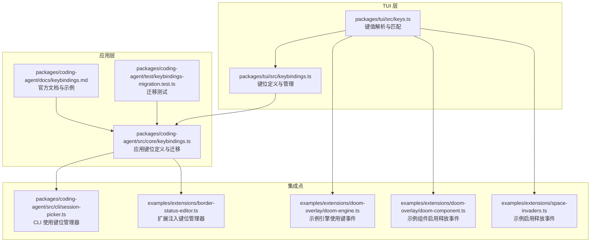
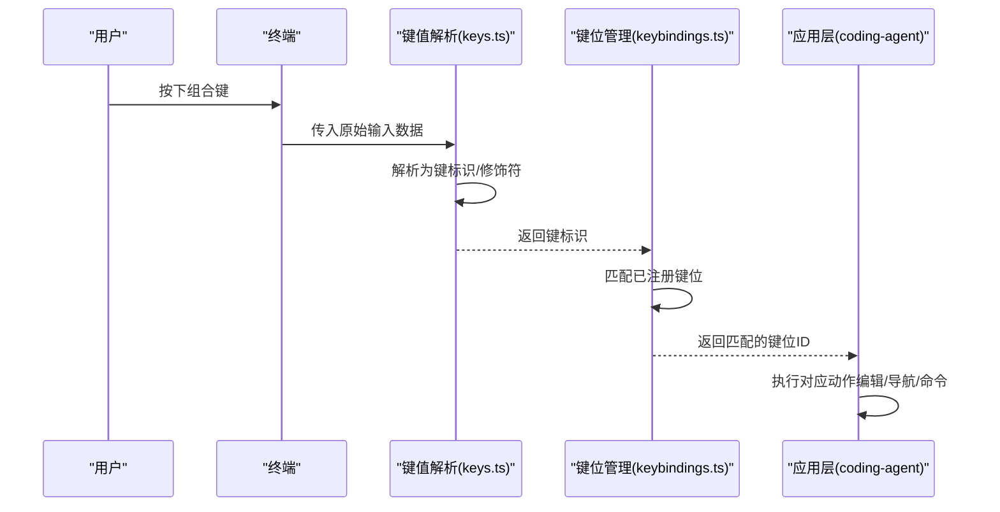
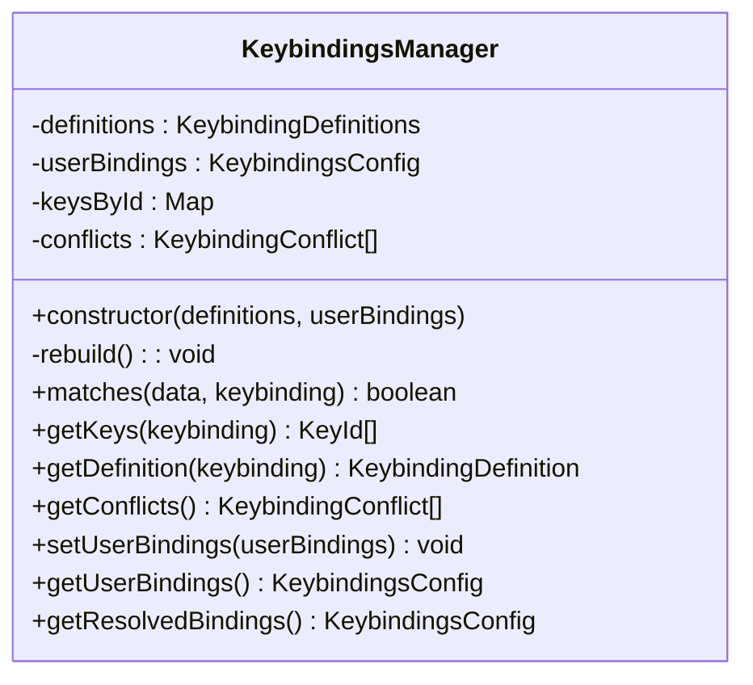
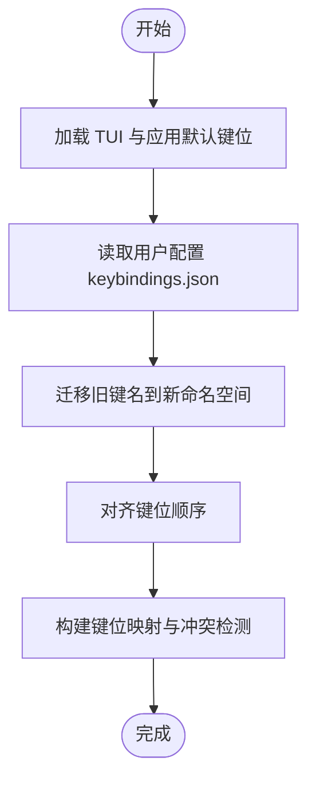
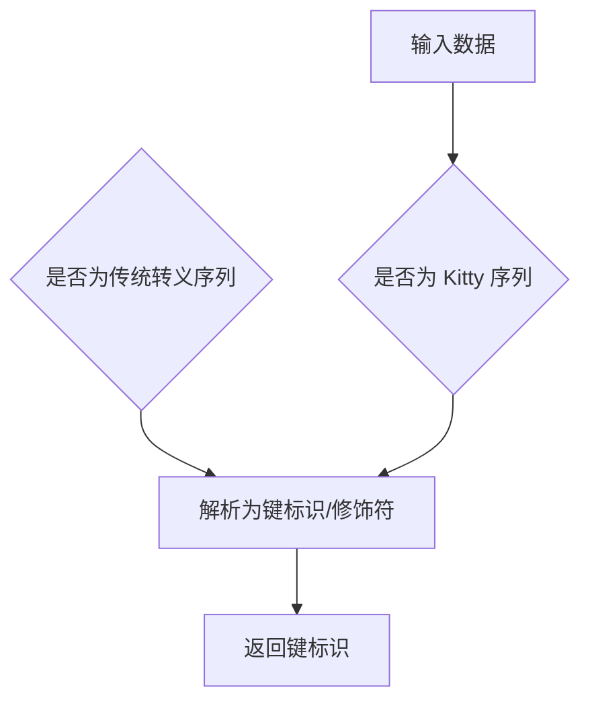
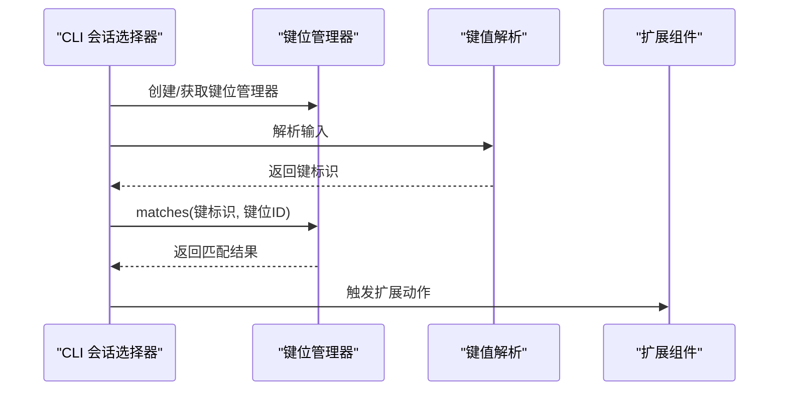
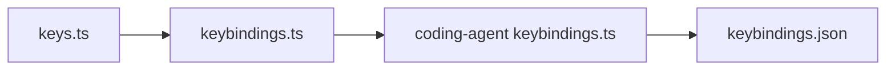

# 键盘快捷键

<cite>
**本文引用的文件**
- [packages/coding-agent/src/core/keybindings.ts](file://packages/coding-agent/src/core/keybindings.ts)
- [packages/tui/src/keybindings.ts](file://packages/tui/src/keybindings.ts)
- [packages/tui/src/keys.ts](file://packages/tui/src/keys.ts)
- [packages/coding-agent/docs/keybindings.md](file://packages/coding-agent/docs/keybindings.md)
- [packages/coding-agent/test/keybindings-migration.test.ts](file://packages/coding-agent/test/keybindings-migration.test.ts)
- [packages/coding-agent/src/cli/session-picker.ts](file://packages/coding-agent/src/cli/session-picker.ts)
- [packages/coding-agent/examples/extensions/border-status-editor.ts](file://packages/coding-agent/examples/extensions/border-status-editor.ts)
- [packages/coding-agent/examples/extensions/doom-overlay/doom-engine.ts](file://packages/coding-agent/examples/extensions/doom-overlay/doom-engine.ts)
- [packages/coding-agent/examples/extensions/doom-overlay/doom-component.ts](file://packages/coding-agent/examples/extensions/doom-overlay/doom-component.ts)
- [packages/coding-agent/examples/extensions/space-invaders.ts](file://packages/coding-agent/examples/extensions/space-invaders.ts)
</cite>

## 目录
1. [简介](#简介)
2. [项目结构](#项目结构)
3. [核心组件](#核心组件)
4. [架构总览](#架构总览)
5. [详细组件分析](#详细组件分析)
6. [依赖关系分析](#依赖关系分析)
7. [性能考量](#性能考量)
8. [故障排查指南](#故障排查指南)
9. [结论](#结论)
10. [附录](#附录)

## 简介
本文件系统性地梳理 Pi 编码代理在交互式模式下的键盘快捷键体系，覆盖默认快捷键、可定制化配置、事件匹配与处理流程、冲突检测与解决、以及扩展开发实践。目标是帮助用户快速掌握高效操作方式，并为扩展作者提供清晰的集成与扩展路径。

## 项目结构
快捷键系统由两层组成：
- TUI 层：提供通用键位定义、键值解析与匹配、冲突检测与全局注册。
- 应用层：在 TUI 定义之上扩展应用级快捷键（如会话管理、模型选择、树导航等），并支持用户配置文件覆盖默认绑定。

图表来源
- [packages/tui/src/keybindings.ts:155-231](file://packages/tui/src/keybindings.ts#L155-L231)
- [packages/tui/src/keys.ts:1-120](file://packages/tui/src/keys.ts#L1-L120)
- [packages/coding-agent/src/core/keybindings.ts:340-371](file://packages/coding-agent/src/core/keybindings.ts#L340-L371)
- [packages/coding-agent/docs/keybindings.md:1-198](file://packages/coding-agent/docs/keybindings.md#L1-L198)
- [packages/coding-agent/test/keybindings-migration.test.ts:1-89](file://packages/coding-agent/test/keybindings-migration.test.ts#L1-L89)
- [packages/coding-agent/src/cli/session-picker.ts:1-44](file://packages/coding-agent/src/cli/session-picker.ts#L1-L44)
- [packages/coding-agent/examples/extensions/border-status-editor.ts:120-147](file://packages/coding-agent/examples/extensions/border-status-editor.ts#L120-L147)
- [packages/coding-agent/examples/extensions/doom-overlay/doom-engine.ts:162-162](file://packages/coding-agent/examples/extensions/doom-overlay/doom-engine.ts#L162-L162)
- [packages/coding-agent/examples/extensions/doom-overlay/doom-component.ts:52-52](file://packages/coding-agent/examples/extensions/doom-overlay/doom-component.ts#L52-L52)
- [packages/coding-agent/examples/extensions/space-invaders.ts:2-2](file://packages/coding-agent/examples/extensions/space-invaders.ts#L2-L2)

章节来源
- [packages/coding-agent/src/core/keybindings.ts:1-371](file://packages/coding-agent/src/core/keybindings.ts#L1-L371)
- [packages/tui/src/keybindings.ts:1-245](file://packages/tui/src/keybindings.ts#L1-L245)
- [packages/tui/src/keys.ts:1-800](file://packages/tui/src/keys.ts#L1-L800)
- [packages/coding-agent/docs/keybindings.md:1-198](file://packages/coding-agent/docs/keybindings.md#L1-L198)

## 核心组件
- 键位定义与管理（TUI）
  - 提供键位 ID、默认键值、描述、冲突检测与解析。
  - 支持用户配置覆盖默认键位，按需重建映射。
- 应用键位定义与迁移（Coding Agent）
  - 在 TUI 基础上扩展应用级键位（会话、模型、树导航等）。
  - 自动迁移旧版键位名称到新命名空间，保证向后兼容。
- 键值解析与匹配（Keys）
  - 支持 Kitty 键盘协议、modifyOtherKeys、传统转义序列。
  - 提供键事件类型判断（按下/重复/释放），用于平滑移动等场景。
- 配置与加载
  - 默认从用户目录加载 keybindings.json，支持数组多键绑定。
  - 提供重载命令无需重启会话即可生效。

章节来源
- [packages/tui/src/keybindings.ts:155-231](file://packages/tui/src/keybindings.ts#L155-L231)
- [packages/coding-agent/src/core/keybindings.ts:340-371](file://packages/coding-agent/src/core/keybindings.ts#L340-L371)
- [packages/tui/src/keys.ts:500-786](file://packages/tui/src/keys.ts#L500-L786)
- [packages/coding-agent/docs/keybindings.md:1-198](file://packages/coding-agent/docs/keybindings.md#L1-L198)

## 架构总览
快捷键系统采用“定义-解析-匹配-执行”的分层架构。终端输入经由键值解析模块识别为标准键标识，再由键位管理器进行匹配，最终驱动具体动作。

图表来源
- [packages/tui/src/keys.ts:587-651](file://packages/tui/src/keys.ts#L587-L651)
- [packages/tui/src/keybindings.ts:194-200](file://packages/tui/src/keybindings.ts#L194-L200)
- [packages/coding-agent/src/core/keybindings.ts:340-371](file://packages/coding-agent/src/core/keybindings.ts#L340-L371)

## 详细组件分析

### 组件A：键位定义与管理（TUI）
- 职责
  - 维护键位定义表与默认键值。
  - 接收用户配置，合并默认与用户设置，生成有效映射。
  - 检测同一键被多个键位占用的冲突。
- 关键接口
  - matches(data, keybinding)：判断输入是否匹配指定键位。
  - getKeys(keybinding)：查询该键位绑定的键列表。
  - getConflicts()：返回冲突列表。
  - setUserBindings()/getResolvedBindings()：更新与导出当前生效配置。
- 数据结构
  - KeybindingDefinitions：键位ID到默认键值与描述。
  - KeybindingsConfig：键位ID到单键或键数组的用户配置。
  - 内部缓存：键位ID到键列表的映射，冲突集合。

图表来源
- [packages/tui/src/keybindings.ts:155-231](file://packages/tui/src/keybindings.ts#L155-L231)

章节来源
- [packages/tui/src/keybindings.ts:1-245](file://packages/tui/src/keybindings.ts#L1-L245)

### 组件B：应用键位定义与迁移（Coding Agent）
- 职责
  - 在 TUI 定义基础上扩展应用级键位（如会话、模型、树导航等）。
  - 提供默认键位与描述；支持平台差异（如 suspend 在 Windows 的默认缺失）。
  - 迁移旧版键位名称到新命名空间，避免破坏用户配置。
- 关键流程
  - 合并 TUI 默认键位与应用默认键位。
  - 加载用户配置（keybindings.json），迁移旧键名，排序输出。
  - 提供静态工厂方法创建键位管理器并自动加载配置。

图表来源
- [packages/coding-agent/src/core/keybindings.ts:204-328](file://packages/coding-agent/src/core/keybindings.ts#L204-L328)

章节来源
- [packages/coding-agent/src/core/keybindings.ts:1-371](file://packages/coding-agent/src/core/keybindings.ts#L1-L371)
- [packages/coding-agent/test/keybindings-migration.test.ts:1-89](file://packages/coding-agent/test/keybindings-migration.test.ts#L1-L89)

### 组件C：键值解析与匹配（Keys）
- 职责
  - 将终端输入解析为标准化键标识，支持 Kitty 协议、modifyOtherKeys、传统转义序列。
  - 提供键事件类型判断（按下/重复/释放），便于实现平滑移动等交互。
- 关键能力
  - matchesKey(data, keyId)：判断输入是否匹配给定键标识。
  - setKittyProtocolActive()/isKittyProtocolActive()：控制协议状态。
  - isKeyRelease()/isKeyRepeat()：在启用协议时区分事件类型。
- 平台差异
  - Windows 终端对 Ctrl+Backspace 的处理有特殊启发式，避免与普通 Backspace 混淆。

图表来源
- [packages/tui/src/keys.ts:587-651](file://packages/tui/src/keys.ts#L587-L651)
- [packages/tui/src/keys.ts:721-734](file://packages/tui/src/keys.ts#L721-L734)

章节来源
- [packages/tui/src/keys.ts:1-800](file://packages/tui/src/keys.ts#L1-L800)

### 组件D：事件处理与集成点
- CLI 与扩展中的使用
  - CLI 通过键位管理器统一处理输入，支持重载配置。
  - 扩展可通过注入的键位管理器声明提示与绑定，或直接使用键值解析模块。
- 示例
  - Doom/Space Invaders 示例启用键释放事件以实现平滑移动。
  - 边框状态编辑器示例注入键位管理器以提供键提示。

图表来源
- [packages/coding-agent/src/cli/session-picker.ts:18-19](file://packages/coding-agent/src/cli/session-picker.ts#L18-L19)
- [packages/coding-agent/examples/extensions/border-status-editor.ts:120-147](file://packages/coding-agent/examples/extensions/border-status-editor.ts#L120-L147)
- [packages/coding-agent/examples/extensions/doom-overlay/doom-engine.ts:162-162](file://packages/coding-agent/examples/extensions/doom-overlay/doom-engine.ts#L162-L162)
- [packages/coding-agent/examples/extensions/doom-overlay/doom-component.ts:52-52](file://packages/coding-agent/examples/extensions/doom-overlay/doom-component.ts#L52-L52)
- [packages/coding-agent/examples/extensions/space-invaders.ts:2-2](file://packages/coding-agent/examples/extensions/space-invaders.ts#L2-L2)

章节来源
- [packages/coding-agent/src/cli/session-picker.ts:1-44](file://packages/coding-agent/src/cli/session-picker.ts#L1-L44)
- [packages/coding-agent/examples/extensions/border-status-editor.ts:120-147](file://packages/coding-agent/examples/extensions/border-status-editor.ts#L120-L147)
- [packages/coding-agent/examples/extensions/doom-overlay/doom-engine.ts:162-162](file://packages/coding-agent/examples/extensions/doom-overlay/doom-engine.ts#L162-L162)
- [packages/coding-agent/examples/extensions/doom-overlay/doom-component.ts:52-52](file://packages/coding-agent/examples/extensions/doom-overlay/doom-component.ts#L52-L52)
- [packages/coding-agent/examples/extensions/space-invaders.ts:2-2](file://packages/coding-agent/examples/extensions/space-invaders.ts#L2-L2)

## 依赖关系分析
- 组件耦合
  - TUI 的键位管理器是应用层键位定义的基础，应用层仅扩展键位 ID 与默认值。
  - 键值解析模块独立于键位管理器，但被其调用以进行匹配。
- 外部依赖
  - 用户配置文件 keybindings.json 位于用户目录，应用层负责加载与迁移。
  - 平台差异（如 Windows 的 suspend）在应用层定义中体现。

图表来源
- [packages/tui/src/keys.ts:1-120](file://packages/tui/src/keys.ts#L1-L120)
- [packages/tui/src/keybindings.ts:155-231](file://packages/tui/src/keybindings.ts#L155-L231)
- [packages/coding-agent/src/core/keybindings.ts:340-371](file://packages/coding-agent/src/core/keybindings.ts#L340-L371)

章节来源
- [packages/tui/src/keybindings.ts:1-245](file://packages/tui/src/keybindings.ts#L1-L245)
- [packages/coding-agent/src/core/keybindings.ts:1-371](file://packages/coding-agent/src/core/keybindings.ts#L1-L371)

## 性能考量
- 键位匹配复杂度
  - 匹配过程为线性扫描键位列表，时间复杂度 O(N)，N 为已注册键位数。
  - 用户配置覆盖默认键位后，内部映射一次性重建，后续匹配为常数时间查找。
- 键值解析
  - Kitty 协议解析与传统序列匹配均采用常量时间前缀检查，整体开销较小。
- 冲突检测
  - 通过键到键位的映射统计冲突，时间复杂度 O(M)，M 为用户绑定数量。

[本节为通用性能讨论，不直接分析具体文件]

## 故障排查指南
- 常见问题
  - 快捷键无效：确认是否正确加载用户配置；在交互式环境中执行重载命令以应用变更。
  - 冲突告警：当同一键被多个键位绑定时，系统会记录冲突，需调整用户配置。
  - 平台差异：Windows 终端不支持 suspend 的默认绑定，手动绑定可能不会产生挂起行为。
- 调试步骤
  - 查看当前生效配置：导出键位映射，核对键位 ID 与绑定。
  - 检查冲突：获取冲突列表，逐一解除重复绑定。
  - 验证键值解析：在支持 Kitty 协议的终端中启用协议，观察事件类型（按下/重复/释放）是否符合预期。
- 相关入口
  - 获取冲突列表与键位映射的方法位于键位管理器。
  - 键值解析模块提供事件类型判断与协议状态控制。

章节来源
- [packages/tui/src/keybindings.ts:210-231](file://packages/tui/src/keybindings.ts#L210-L231)
- [packages/tui/src/keys.ts:527-577](file://packages/tui/src/keys.ts#L527-L577)
- [packages/coding-agent/docs/keybindings.md:1-198](file://packages/coding-agent/docs/keybindings.md#L1-L198)

## 结论
Pi 的键盘快捷键系统以 TUI 为核心，提供跨平台、可扩展、可配置的键位管理能力。应用层在此基础上补充丰富的交互式操作，并通过用户配置文件实现个性化定制。借助冲突检测与迁移机制，系统在兼容历史配置的同时保持良好的可维护性。对于扩展作者，建议遵循命名空间键位 ID、合理声明冲突、并在需要时启用 Kitty 协议以获得更流畅的输入体验。

[本节为总结性内容，不直接分析具体文件]

## 附录

### 快捷键总览与分类
- TUI 编辑器与输入
  - 光标移动、单词/行级移动、删除、复制、撤销、换行、提交、制表补全等。
- 应用级操作
  - 中断/清屏/退出、外部编辑器、剪贴板粘贴图片、消息队列操作、模型循环与选择、思考层级切换、会话管理、树导航与过滤、模型选择器等。
- 平台差异
  - Windows 默认不提供 suspend 绑定；部分键位在不同平台有不同默认值。

章节来源
- [packages/coding-agent/docs/keybindings.md:23-198](file://packages/coding-agent/docs/keybindings.md#L23-L198)

### 快捷键触发机制与事件处理流程
- 输入捕获
  - 终端输入经键值解析模块识别为键标识（含修饰符）。
- 键位匹配
  - 键位管理器根据当前生效配置匹配键位 ID。
- 动作执行
  - 应用层根据键位 ID 执行相应逻辑（编辑、导航、命令等）。
- 事件类型
  - 在启用 Kitty 协议时，可区分按下/重复/释放事件，用于平滑移动等场景。

章节来源
- [packages/tui/src/keys.ts:500-786](file://packages/tui/src/keys.ts#L500-L786)
- [packages/tui/src/keybindings.ts:194-200](file://packages/tui/src/keybindings.ts#L194-L200)

### 常用快捷键使用场景与效率提升技巧
- 编辑效率
  - 使用单词级移动与删除键快速修正拼写错误。
  - 利用撤销与 kill ring 实现安全编辑与文本复用。
- 导航效率
  - 使用树导航键在复杂结构间快速跳转。
  - 使用会话过滤键快速聚焦目标内容。
- 命令效率
  - 使用消息队列快捷键批量管理后续任务。
  - 使用模型循环键在多个模型间快速切换。

章节来源
- [packages/coding-agent/docs/keybindings.md:23-198](file://packages/coding-agent/docs/keybindings.md#L23-L198)

### 自定义快捷键配置方法与扩展指南
- 配置文件位置
  - 在用户目录创建 keybindings.json，键位 ID 与内部一致。
- 配置格式
  - 每个键位 ID 可绑定单个键或数组；用户配置覆盖默认值。
- 重载生效
  - 在交互式环境中执行重载命令以应用变更。
- 扩展开发
  - 扩展可通过注入的键位管理器声明提示与绑定。
  - 在需要平滑移动的场景启用键释放事件。

章节来源
- [packages/coding-agent/docs/keybindings.md:1-198](file://packages/coding-agent/docs/keybindings.md#L1-L198)
- [packages/coding-agent/src/core/keybindings.ts:340-371](file://packages/coding-agent/src/core/keybindings.ts#L340-L371)
- [packages/coding-agent/examples/extensions/border-status-editor.ts:120-147](file://packages/coding-agent/examples/extensions/border-status-editor.ts#L120-L147)
- [packages/coding-agent/examples/extensions/doom-overlay/doom-component.ts:52-52](file://packages/coding-agent/examples/extensions/doom-overlay/doom-component.ts#L52-L52)
- [packages/coding-agent/examples/extensions/space-invaders.ts:2-2](file://packages/coding-agent/examples/extensions/space-invaders.ts#L2-L2)

### 快捷键冲突解决方案与调试技巧
- 冲突检测
  - 通过键位管理器获取冲突列表，定位重复绑定的键位。
- 解决方案
  - 调整用户配置，为冲突键位分配唯一键。
  - 在扩展中避免与内置键位冲突，必要时提供迁移策略。
- 调试技巧
  - 启用 Kitty 协议以获得更准确的事件类型判断。
  - 在 Windows 终端中注意 Ctrl+Backspace 的特殊处理。

章节来源
- [packages/tui/src/keybindings.ts:136-231](file://packages/tui/src/keybindings.ts#L136-L231)
- [packages/tui/src/keys.ts:527-577](file://packages/tui/src/keys.ts#L527-L577)
- [packages/coding-agent/docs/keybindings.md:1-198](file://packages/coding-agent/docs/keybindings.md#L1-L198)