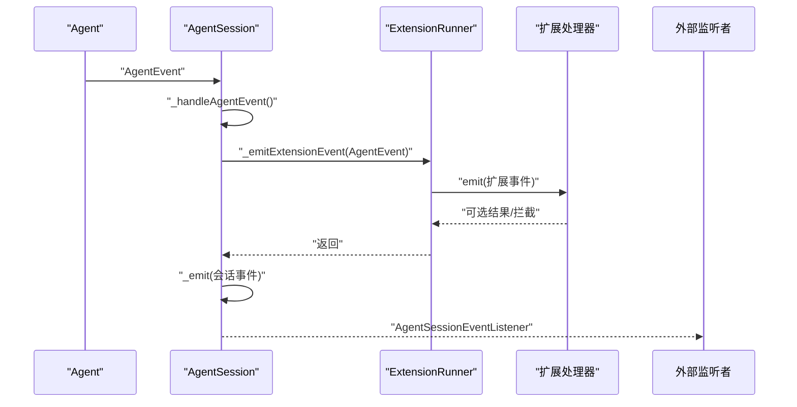
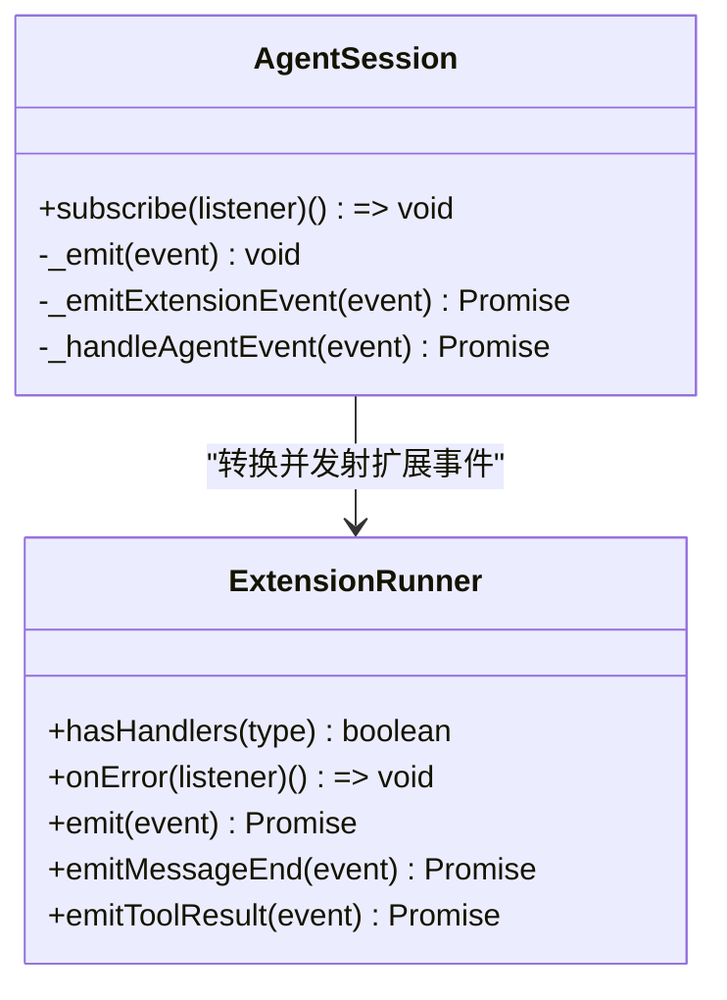
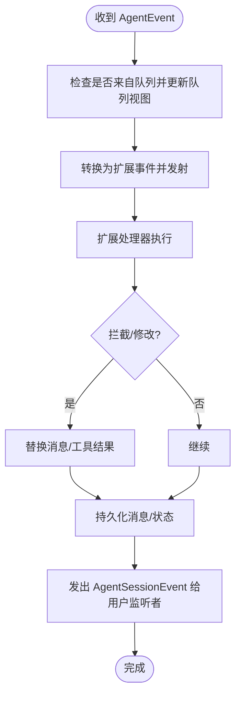
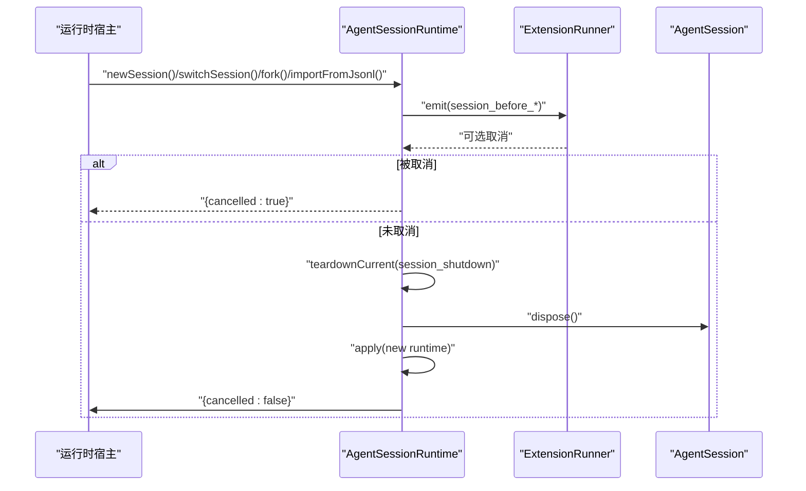
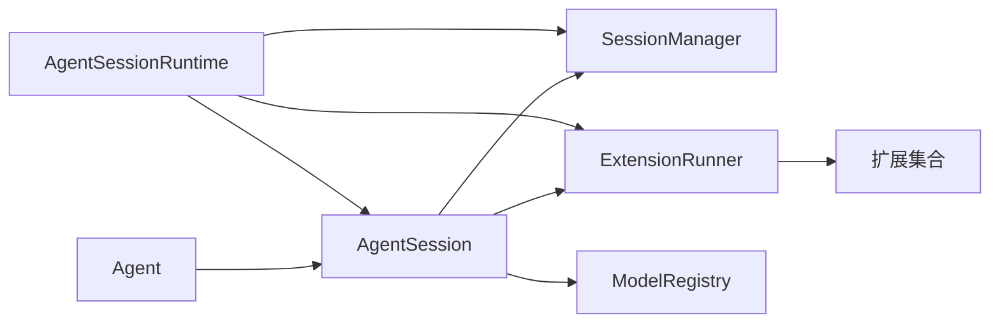

# 会话事件系统

<cite>
**本文档引用的文件**
- [agent-session.ts](file://packages/coding-agent/src/core/agent-session.ts)
- [agent-session-runtime.ts](file://packages/coding-agent/src/core/agent-session-runtime.ts)
- [extensions/index.ts](file://packages/coding-agent/src/core/extensions/index.ts)
- [extensions/runner.ts](file://packages/coding-agent/src/core/extensions/runner.ts)
- [extensions/types.ts](file://packages/coding-agent/src/core/extensions/types.ts)
- [sdk.ts](file://packages/coding-agent/src/core/sdk.ts)
- [agent-session-runtime-events.test.ts](file://packages/coding-agent/test/agent-session-runtime-events.test.ts)
</cite>

## 目录
1. [简介](#简介)
2. [项目结构](#项目结构)
3. [核心组件](#核心组件)
4. [架构总览](#架构总览)
5. [详细组件分析](#详细组件分析)
6. [依赖关系分析](#依赖关系分析)
7. [性能考量](#性能考量)
8. [故障排查指南](#故障排查指南)
9. [结论](#结论)
10. [附录](#附录)

## 简介
本文件系统性阐述 Pi 编码代理的会话事件系统，重点覆盖以下方面：
- AgentSessionEvent 事件类型定义与扩展事件集成
- 事件监听机制与事件传播流程
- 事件发射机制与生命周期管理
- 事件订阅方法、事件处理策略与最佳实践
- 错误处理策略与性能优化建议

该系统围绕 AgentSession 核心类构建，通过内部事件分发器将 Agent 生命周期事件转换为扩展友好的会话事件，并在会话切换、分支、压缩等关键操作中发出会话级事件，供扩展进行拦截、修改或响应。

## 项目结构
与会话事件系统直接相关的模块主要位于 coding-agent 包的核心目录中：
- 会话核心：agent-session.ts
- 运行时与会话生命周期：agent-session-runtime.ts
- 扩展系统入口与类型：extensions/index.ts、extensions/types.ts、extensions/runner.ts
- SDK 入口：sdk.ts
- 运行时事件测试：agent-session-runtime-events.test.ts

```mermaid
graph TB
subgraph "核心"
AS["AgentSession<br/>会话事件与状态"]
AR["AgentSessionRuntime<br/>会话切换/分支/导入"]
ER["ExtensionRunner<br/>扩展运行时与事件发射"]
end
subgraph "扩展系统"
ET["extensions/types.ts<br/>事件类型定义"]
EI["extensions/index.ts<br/>导出入口"]
ERUN["extensions/runner.ts<br/>事件发射与拦截"]
end
subgraph "SDK"
SDK["sdk.ts<br/>创建会话与绑定扩展"]
end
AS --> ER
AR --> ER
SDK --> AS
SDK --> ER
ER --> ERUN
EI --> ET
```

图表来源
- [agent-session.ts:254-347](file://packages/coding-agent/src/core/agent-session.ts#L254-L347)
- [agent-session-runtime.ts:68-110](file://packages/coding-agent/src/core/agent-session-runtime.ts#L68-L110)
- [extensions/runner.ts:224-264](file://packages/coding-agent/src/core/extensions/runner.ts#L224-L264)
- [extensions/types.ts:512-599](file://packages/coding-agent/src/core/extensions/types.ts#L512-L599)
- [sdk.ts:410-432](file://packages/coding-agent/src/core/sdk.ts#L410-L432)

章节来源
- [agent-session.ts:122-147](file://packages/coding-agent/src/core/agent-session.ts#L122-L147)
- [agent-session-runtime.ts:68-110](file://packages/coding-agent/src/core/agent-session-runtime.ts#L68-L110)
- [extensions/index.ts:1-173](file://packages/coding-agent/src/core/extensions/index.ts#L1-L173)
- [extensions/types.ts:512-599](file://packages/coding-agent/src/core/extensions/types.ts#L512-L599)
- [sdk.ts:410-432](file://packages/coding-agent/src/core/sdk.ts#L410-L432)

## 核心组件
- AgentSessionEvent：会话事件联合类型，扩展自 AgentEvent 并新增队列更新、压缩、思考级别变更、自动重试等事件。
- AgentSessionEventListener：事件监听器函数签名。
- AgentSession：会话核心类，负责：
  - 订阅 Agent 事件并转换为会话事件
  - 内部事件分发（_emit）
  - 与扩展系统交互（_emitExtensionEvent）
  - 自动压缩、重试、Bash 执行等状态管理
- AgentSessionRuntime：会话生命周期运行时，负责 new、switch、fork、import 等操作，期间发出 session_before_* 与 session_shutdown 等事件。
- ExtensionRunner：扩展运行时，统一管理扩展注册、上下文、事件发射与拦截（如 message_end、tool_result）。

章节来源
- [agent-session.ts:122-150](file://packages/coding-agent/src/core/agent-session.ts#L122-L150)
- [agent-session.ts:254-347](file://packages/coding-agent/src/core/agent-session.ts#L254-L347)
- [agent-session.ts:454-501](file://packages/coding-agent/src/core/agent-session.ts#L454-L501)
- [agent-session.ts:598-670](file://packages/coding-agent/src/core/agent-session.ts#L598-L670)
- [agent-session-runtime.ts:68-110](file://packages/coding-agent/src/core/agent-session-runtime.ts#L68-L110)
- [extensions/runner.ts:224-264](file://packages/coding-agent/src/core/extensions/runner.ts#L224-L264)

## 架构总览
下图展示从 Agent 事件到扩展事件再到会话事件的转换路径，以及运行时事件的触发点。



图表来源
- [agent-session.ts:473-544](file://packages/coding-agent/src/core/agent-session.ts#L473-L544)
- [agent-session.ts:598-670](file://packages/coding-agent/src/core/agent-session.ts#L598-L670)
- [extensions/runner.ts:680-712](file://packages/coding-agent/src/core/extensions/runner.ts#L680-L712)

## 详细组件分析

### 事件类型定义与扩展事件集成
- AgentSessionEvent 覆盖 AgentEvent 的所有类型，并新增：
  - 队列更新："queue_update"
  - 压缩开始/结束："compaction_start"/"compaction_end"
  - 会话信息变化："session_info_changed"
  - 思考级别变化："thinking_level_changed"
  - 自动重试开始/结束："auto_retry_start"/"auto_retry_end"
  - Agent 结束事件增强："agent_end" 增加 willRetry 字段
- 扩展事件类型由 extensions/types.ts 定义，包括：
  - 会话事件："session_start"/"session_before_switch"/"session_before_fork"/"session_shutdown"/"session_compact"/"session_tree"
  - Agent 事件："agent_start"/"agent_end"/"turn_start"/"turn_end"/"message_start"/"message_update"/"message_end"
  - 工具执行事件："tool_execution_start"/"tool_execution_update"/"tool_execution_end"
  - 模型与思考级别事件："model_select"/"thinking_level_select"
  - 输入事件："input"
  - 资源发现事件："resources_discover"
- AgentSession 将 AgentEvent 转换为扩展事件并调用 ExtensionRunner.emit；同时将 AgentEvent 转换为 AgentSessionEvent 并通知用户订阅者。

章节来源
- [agent-session.ts:122-147](file://packages/coding-agent/src/core/agent-session.ts#L122-L147)
- [extensions/types.ts:512-599](file://packages/coding-agent/src/core/extensions/types.ts#L512-L599)
- [extensions/types.ts:601-706](file://packages/coding-agent/src/core/extensions/types.ts#L601-L706)
- [agent-session.ts:598-670](file://packages/coding-agent/src/core/agent-session.ts#L598-L670)

### 事件监听机制与订阅方法
- 用户侧订阅：
  - AgentSession.subscribe(listener)：添加监听器，返回取消订阅函数
  - 内部断连/重连：
    - _disconnectFromAgent()：临时断开 Agent 事件订阅
    - _reconnectToAgent()：恢复订阅
- 扩展侧订阅：
  - ExtensionRunner.hasHandlers(type)：检查是否存在某事件处理器
  - ExtensionRunner.onError(listener)：注册扩展错误监听
  - ExtensionRunner.emit(event)：通用事件发射（支持 session_before_* 类事件的取消）
  - ExtensionRunner.emitMessageEnd(event)：拦截 message_end 并允许替换消息
  - ExtensionRunner.emitToolResult(event)：拦截 tool_result 并允许修改内容/细节/错误标记



图表来源
- [agent-session.ts:677-710](file://packages/coding-agent/src/core/agent-session.ts#L677-L710)
- [agent-session.ts:454-501](file://packages/coding-agent/src/core/agent-session.ts#L454-L501)
- [extensions/runner.ts:492-500](file://packages/coding-agent/src/core/extensions/runner.ts#L492-L500)
- [extensions/runner.ts:481-490](file://packages/coding-agent/src/core/extensions/runner.ts#L481-L490)
- [extensions/runner.ts:680-712](file://packages/coding-agent/src/core/extensions/runner.ts#L680-L712)
- [extensions/runner.ts:714-754](file://packages/coding-agent/src/core/extensions/runner.ts#L714-L754)
- [extensions/runner.ts:756-800](file://packages/coding-agent/src/core/extensions/runner.ts#L756-L800)

章节来源
- [agent-session.ts:677-710](file://packages/coding-agent/src/core/agent-session.ts#L677-L710)
- [extensions/runner.ts:492-500](file://packages/coding-agent/src/core/extensions/runner.ts#L492-L500)
- [extensions/runner.ts:481-490](file://packages/coding-agent/src/core/extensions/runner.ts#L481-L490)
- [extensions/runner.ts:680-712](file://packages/coding-agent/src/core/extensions/runner.ts#L680-L712)
- [extensions/runner.ts:714-754](file://packages/coding-agent/src/core/extensions/runner.ts#L714-L754)
- [extensions/runner.ts:756-800](file://packages/coding-agent/src/core/extensions/runner.ts#L756-L800)

### 事件传播流程与处理策略
- 传播路径：
  - Agent 发出 AgentEvent → AgentSession 内部处理（持久化、状态更新、队列维护）→ 转换为扩展事件 → ExtensionRunner.emit → 扩展处理器执行 → 可能产生取消/拦截结果 → 最终以 AgentSessionEvent 通知用户监听者
- 处理策略：
  - 队列更新：当用户消息从队列中移除后，立即发出 "queue_update" 以同步 UI
  - 消息持久化：message_end 时根据消息类型写入 SessionManager
  - 自动重试：在 agent_end 时判断是否可重试并发出 "auto_retry_start/end"
  - 扩展拦截：message_end 支持替换消息对象；tool_result 支持修改内容/细节/错误标记
  - 会话事件：session_before_switch/fork/shutdown/start 在运行时关键节点发出，支持取消



图表来源
- [agent-session.ts:473-544](file://packages/coding-agent/src/core/agent-session.ts#L473-L544)
- [agent-session.ts:598-670](file://packages/coding-agent/src/core/agent-session.ts#L598-L670)
- [extensions/runner.ts:714-754](file://packages/coding-agent/src/core/extensions/runner.ts#L714-L754)
- [extensions/runner.ts:756-800](file://packages/coding-agent/src/core/extensions/runner.ts#L756-L800)

章节来源
- [agent-session.ts:473-544](file://packages/coding-agent/src/core/agent-session.ts#L473-L544)
- [agent-session.ts:598-670](file://packages/coding-agent/src/core/agent-session.ts#L598-L670)
- [extensions/runner.ts:714-754](file://packages/coding-agent/src/core/extensions/runner.ts#L714-L754)
- [extensions/runner.ts:756-800](file://packages/coding-agent/src/core/extensions/runner.ts#L756-L800)

### 事件发射机制与生命周期管理
- 运行时事件：
  - newSession/switchSession/fork/importFromJsonl 等操作前发出 "session_before_switch"/"session_before_fork"
  - teardownCurrent 时发出 "session_shutdown"，随后释放资源与监听
  - 会话启动时发出 "session_start"（包含 reason 与 previousSessionFile）
- 生命周期阶段：
  - startup/new/resume/fork/reload/quit 等不同原因触发 "session_start"
  - session_before_* 可被扩展处理器取消，从而阻止会话替换
  - beforeSessionInvalidate 在 session_shutdown 后、rebindSession 前调用，用于 UI 清理



图表来源
- [agent-session-runtime.ts:127-142](file://packages/coding-agent/src/core/agent-session-runtime.ts#L127-L142)
- [agent-session-runtime.ts:161-169](file://packages/coding-agent/src/core/agent-session-runtime.ts#L161-L169)
- [agent-session-runtime.ts:178-186](file://packages/coding-agent/src/core/agent-session-runtime.ts#L178-L186)
- [agent-session-runtime.ts:187-244](file://packages/coding-agent/src/core/agent-session-runtime.ts#L187-L244)
- [agent-session-runtime.ts:340-375](file://packages/coding-agent/src/core/agent-session-runtime.ts#L340-L375)

章节来源
- [agent-session-runtime.ts:127-142](file://packages/coding-agent/src/core/agent-session-runtime.ts#L127-L142)
- [agent-session-runtime.ts:161-169](file://packages/coding-agent/src/core/agent-session-runtime.ts#L161-L169)
- [agent-session-runtime.ts:178-186](file://packages/coding-agent/src/core/agent-session-runtime.ts#L178-L186)
- [agent-session-runtime.ts:187-244](file://packages/coding-agent/src/core/agent-session-runtime.ts#L187-L244)
- [agent-session-runtime.ts:340-375](file://packages/coding-agent/src/core/agent-session-runtime.ts#L340-L375)

### 事件订阅方法与使用示例
- 订阅会话事件：
  - const unsubscribe = session.subscribe((event) => { ... })
  - 通过返回的函数解除订阅
- 订阅扩展事件：
  - 通过扩展工厂注册事件处理器（如 on("session_before_switch", ...)）
  - 使用 ExtensionRunner.onError 订阅扩展错误
- 运行时事件验证：
  - 测试覆盖了 new/resume/fork 场景下的 session_before_switch、session_shutdown、session_start 顺序与取消行为

章节来源
- [agent-session.ts:677-710](file://packages/coding-agent/src/core/agent-session.ts#L677-L710)
- [extensions/runner.ts:481-490](file://packages/coding-agent/src/core/extensions/runner.ts#L481-L490)
- [agent-session-runtime-events.test.ts:92-134](file://packages/coding-agent/test/agent-session-runtime-events.test.ts#L92-L134)
- [agent-session-runtime-events.test.ts:136-158](file://packages/coding-agent/test/agent-session-runtime-events.test.ts#L136-L158)
- [agent-session-runtime-events.test.ts:160-184](file://packages/coding-agent/test/agent-session-runtime-events.test.ts#L160-L184)
- [agent-session-runtime-events.test.ts:186-233](file://packages/coding-agent/test/agent-session-runtime-events.test.ts#L186-L233)

## 依赖关系分析
- AgentSession 依赖：
  - Agent（事件源）、SessionManager（持久化）、SettingsManager（重试/流式配置）、ModelRegistry（鉴权与模型解析）
  - ExtensionRunner（事件发射与拦截）
- ExtensionRunner 依赖：
  - 扩展集合、ExtensionRuntime、UI 上下文、SessionManager、ModelRegistry
- AgentSessionRuntime 依赖：
  - SessionManager（会话文件管理）、ExtensionRunner（会话级事件）、AgentSession（会话实例）



图表来源
- [agent-session.ts:254-347](file://packages/coding-agent/src/core/agent-session.ts#L254-L347)
- [agent-session-runtime.ts:68-110](file://packages/coding-agent/src/core/agent-session-runtime.ts#L68-L110)
- [extensions/runner.ts:224-264](file://packages/coding-agent/src/core/extensions/runner.ts#L224-L264)

章节来源
- [agent-session.ts:254-347](file://packages/coding-agent/src/core/agent-session.ts#L254-L347)
- [agent-session-runtime.ts:68-110](file://packages/coding-agent/src/core/agent-session-runtime.ts#L68-L110)
- [extensions/runner.ts:224-264](file://packages/coding-agent/src/core/extensions/runner.ts#L224-L264)

## 性能考量
- 事件分发成本控制：
  - 仅在必要时复制/替换消息对象（如队列更新、消息拦截），避免不必要的深拷贝
  - 队列更新采用浅拷贝数组快照，减少内存抖动
- 扩展事件发射：
  - hasHandlers 快速短路，避免无处理器时的发射开销
  - session_before_* 事件支持取消，可在早期阻断昂贵操作
- 流式处理：
  - message_update 与 tool_execution_update 为增量事件，避免一次性大对象传输
- 资源清理：
  - dispose 中按序中断重试/压缩/分支/脚本执行，确保资源及时回收

[本节为通用性能建议，不直接分析具体文件]

## 故障排查指南
- 扩展错误监听：
  - 使用 ExtensionRunner.onError 注册错误监听器，捕获扩展事件/工具执行中的异常
- 事件取消：
  - session_before_switch/fork 支持取消，若扩展返回 { cancel: true }，会话替换将被阻止
- 上下文失效：
  - 会话替换后，旧 ExtensionContext 会被标记为失效，访问将抛错；需在 withSession 回调中使用新上下文
- 重试与溢出：
  - auto_retry_start/end 事件可用于 UI 展示与统计；溢出恢复尝试受 overflowRecoveryAttempted 控制
- 持久化问题：
  - message_end 时根据消息角色选择写入 SessionManager 或自定义条目；确认消息类型正确

章节来源
- [extensions/runner.ts:481-490](file://packages/coding-agent/src/core/extensions/runner.ts#L481-L490)
- [agent-session-runtime.ts:127-142](file://packages/coding-agent/src/core/agent-session-runtime.ts#L127-L142)
- [agent-session-runtime.ts:161-169](file://packages/coding-agent/src/core/agent-session-runtime.ts#L161-L169)
- [agent-session.ts:714-731](file://packages/coding-agent/src/core/agent-session.ts#L714-L731)
- [agent-session.ts:535-542](file://packages/coding-agent/src/core/agent-session.ts#L535-L542)

## 结论
Pi 编码代理的会话事件系统通过 AgentSession 将底层 Agent 事件转换为统一的会话事件，并借助 ExtensionRunner 提供强大的扩展事件发射与拦截能力。运行时事件贯穿会话的创建、切换、分支与导入过程，既保证了扩展的可控性，又维持了会话状态的一致性与可观测性。遵循本文的最佳实践与故障排查建议，可有效提升事件系统的稳定性与性能表现。

[本节为总结性内容，不直接分析具体文件]

## 附录
- 事件类型参考：
  - AgentSessionEvent：见 [agent-session.ts:122-147](file://packages/coding-agent/src/core/agent-session.ts#L122-L147)
  - 扩展事件类型：见 [extensions/types.ts:512-599](file://packages/coding-agent/src/core/extensions/types.ts#L512-L599)、[extensions/types.ts:601-706](file://packages/coding-agent/src/core/extensions/types.ts#L601-L706)
- 创建与绑定：
  - 会话创建与扩展绑定：见 [sdk.ts:410-432](file://packages/coding-agent/src/core/sdk.ts#L410-L432)
- 运行时事件测试：
  - 见 [agent-session-runtime-events.test.ts:92-134](file://packages/coding-agent/test/agent-session-runtime-events.test.ts#L92-L134)、[agent-session-runtime-events.test.ts:136-158](file://packages/coding-agent/test/agent-session-runtime-events.test.ts#L136-L158)、[agent-session-runtime-events.test.ts:160-184](file://packages/coding-agent/test/agent-session-runtime-events.test.ts#L160-L184)、[agent-session-runtime-events.test.ts:186-233](file://packages/coding-agent/test/agent-session-runtime-events.test.ts#L186-L233)