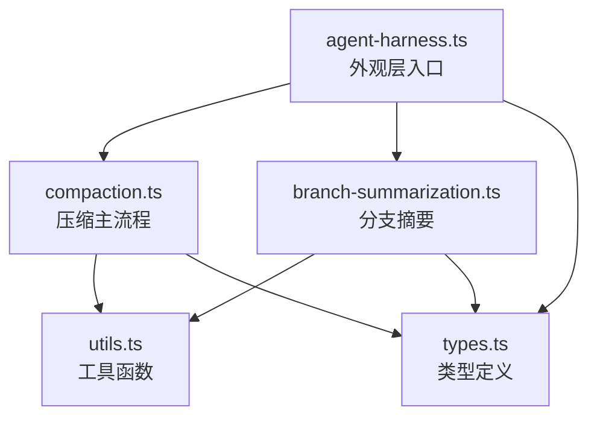
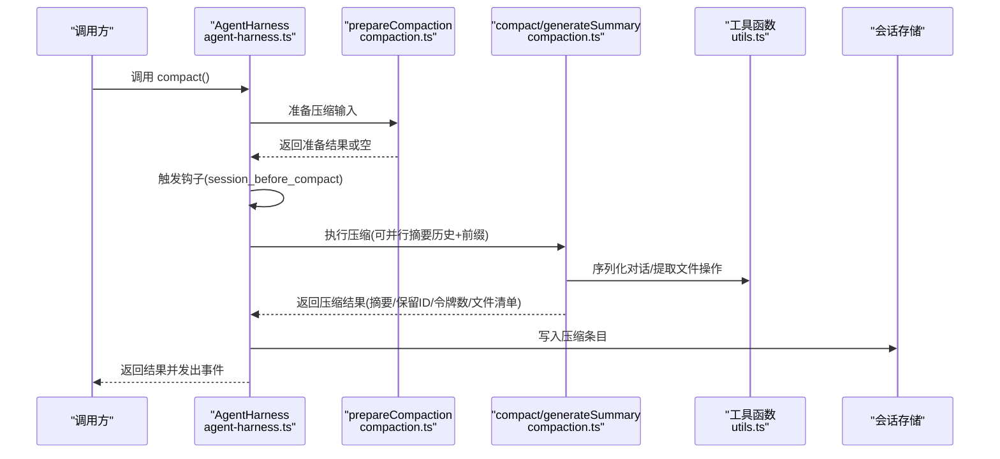
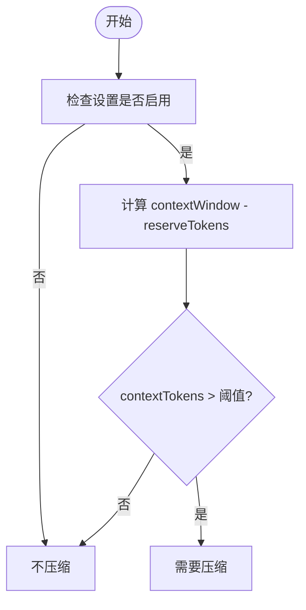
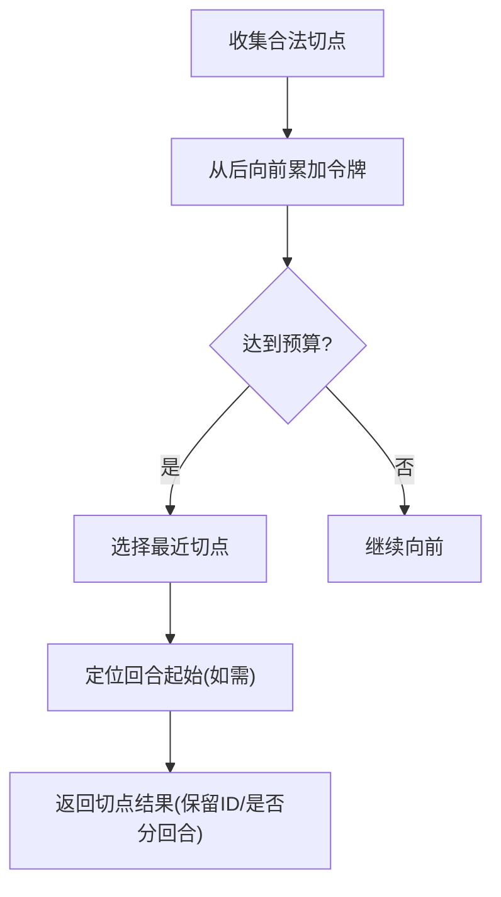
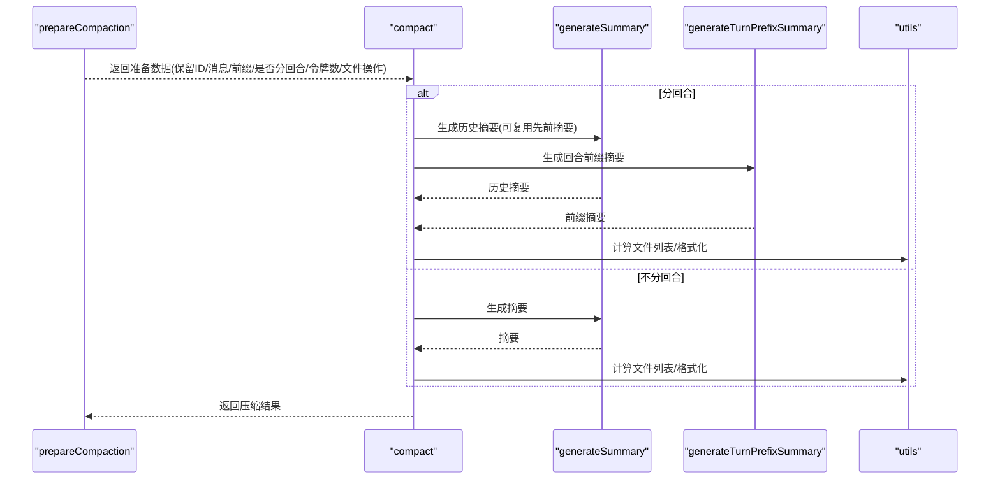
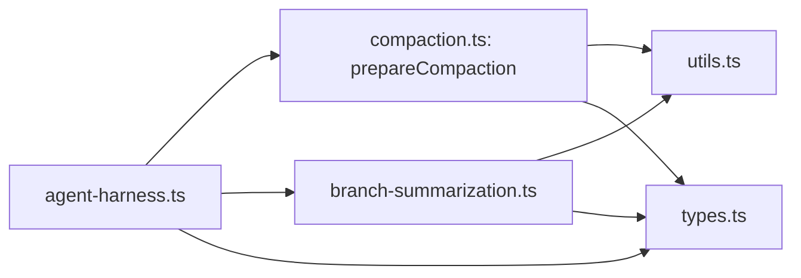

# 会话压缩

<cite>
**本文引用的文件**
- [packages/agent/src/harness/compaction/compaction.ts](file://packages/agent/src/harness/compaction/compaction.ts)
- [packages/agent/src/harness/compaction/branch-summarization.ts](file://packages/agent/src/harness/compaction/branch-summarization.ts)
- [packages/agent/src/harness/compaction/utils.ts](file://packages/agent/src/harness/compaction/utils.ts)
- [packages/agent/src/harness/agent-harness.ts](file://packages/agent/src/harness/agent-harness.ts)
- [packages/agent/src/harness/types.ts](file://packages/agent/src/harness/types.ts)
</cite>

## 目录
1. [引言](#引言)
2. [项目结构](#项目结构)
3. [核心组件](#核心组件)
4. [架构总览](#架构总览)
5. [详细组件分析](#详细组件分析)
6. [依赖关系分析](#依赖关系分析)
7. [性能考量](#性能考量)
8. [故障排查指南](#故障排查指南)
9. [结论](#结论)
10. [附录](#附录)

## 引言
本文件系统性阐述 Pi 编码代理的“会话压缩”机制，覆盖以下关键主题：
- 触发条件：何时应进行压缩（shouldCompact）与如何准备压缩（prepareCompaction）
- 令牌计算：上下文令牌估算与使用量统计（estimateContextTokens、estimateTokens、getLastAssistantUsage）
- 分支摘要：跨分支导航时的摘要生成（collectEntriesForBranchSummary、generateBranchSummary）
- 压缩策略：摘要生成、切点选择、分_turn_前缀摘要与最终写入（findCutPoint、compact、generateSummary）
- 效果评估与性能影响：保留最近上下文、预算控制、文件操作汇总
- 使用场景：自动压缩与手动压缩的适用时机与边界

## 项目结构
本次文档聚焦于会话压缩相关模块，主要涉及以下文件：
- 会话压缩主流程与工具：compaction.ts
- 分支摘要：branch-summarization.ts
- 通用工具：utils.ts（文件操作提取、序列化、格式化）
- 外观层入口：agent-harness.ts（对外暴露 compact 与分支摘要接口）
- 类型定义：types.ts（会话树条目、压缩设置、结果类型等）

图表来源
- [packages/agent/src/harness/agent-harness.ts](file://packages/agent/src/harness/agent-harness.ts)
- [packages/agent/src/harness/compaction/compaction.ts](file://packages/agent/src/harness/compaction/compaction.ts)
- [packages/agent/src/harness/compaction/branch-summarization.ts](file://packages/agent/src/harness/compaction/branch-summarization.ts)
- [packages/agent/src/harness/compaction/utils.ts](file://packages/agent/src/harness/compaction/utils.ts)
- [packages/agent/src/harness/types.ts](file://packages/agent/src/harness/types.ts)

章节来源
- [packages/agent/src/harness/agent-harness.ts](file://packages/agent/src/harness/agent-harness.ts)
- [packages/agent/src/harness/compaction/compaction.ts](file://packages/agent/src/harness/compaction/compaction.ts)
- [packages/agent/src/harness/compaction/branch-summarization.ts](file://packages/agent/src/harness/compaction/branch-summarization.ts)
- [packages/agent/src/harness/compaction/utils.ts](file://packages/agent/src/harness/compaction/utils.ts)
- [packages/agent/src/harness/types.ts](file://packages/agent/src/harness/types.ts)

## 核心组件
- 会话压缩设置与阈值判定
  - 设置项：是否启用、保留令牌数、近期保留令牌预算
  - 判定逻辑：当前上下文令牌是否超过窗口-保留
- 上下文令牌估算
  - 使用最近一次成功助手消息的用量作为锚点，结合后续消息的保守字符估算
- 切点选择
  - 在可切点集合中从后向前累加，达到预算即选该切点；避免在中途截断工具结果等不可切点
- 摘要生成
  - 结构化提示词驱动的摘要，支持增量更新与分_turn_前缀摘要
- 文件操作汇总
  - 从工具调用中抽取读/写/编辑文件，形成只读与修改列表并格式化到摘要末尾
- 外观层编排
  - compact 方法负责准备、钩子、调用压缩、写入会话并发出事件

章节来源
- [packages/agent/src/harness/compaction/compaction.ts](file://packages/agent/src/harness/compaction/compaction.ts)
- [packages/agent/src/harness/compaction/utils.ts](file://packages/agent/src/harness/compaction/utils.ts)
- [packages/agent/src/harness/agent-harness.ts](file://packages/agent/src/harness/agent-harness.ts)

## 架构总览
下图展示从外观层到压缩主流程、再到摘要生成与文件操作汇总的整体交互。

图表来源
- [packages/agent/src/harness/agent-harness.ts](file://packages/agent/src/harness/agent-harness.ts)
- [packages/agent/src/harness/compaction/compaction.ts](file://packages/agent/src/harness/compaction/compaction.ts)
- [packages/agent/src/harness/compaction/utils.ts](file://packages/agent/src/harness/compaction/utils.ts)

## 详细组件分析

### shouldCompact 判断逻辑
- 输入：当前上下文令牌、模型上下文窗口、压缩设置
- 策略：仅当设置启用且当前令牌数超过“窗口-保留”阈值时才触发
- 作用：决定是否需要进行压缩

图表来源
- [packages/agent/src/harness/compaction/compaction.ts](file://packages/agent/src/harness/compaction/compaction.ts)

章节来源
- [packages/agent/src/harness/compaction/compaction.ts](file://packages/agent/src/harness/compaction/compaction.ts)

### calculateContextTokens 计算方法
- 依据最近一次有效助手消息的用量（input/output/cache 读写）估算总上下文令牌
- 若无可用用量，则回退到逐消息保守估算

章节来源
- [packages/agent/src/harness/compaction/compaction.ts](file://packages/agent/src/harness/compaction/compaction.ts)

### estimateContextTokens 估算流程
- 从末尾向前寻找第一个有效助手用量，若存在则以该用量为基准，加上其之后消息的估算值
- 若不存在，则对所有消息进行字符级估算

章节来源
- [packages/agent/src/harness/compaction/compaction.ts](file://packages/agent/src/harness/compaction/compaction.ts)

### estimateTokens 令牌估算算法
- 针对不同角色的消息采用不同的字符估算规则：
  - 用户：按内容长度估算
  - 助手：文本、思考、工具调用参数分别计长，再统一除以常数并上取整
  - 其他：自定义消息、bash 执行、摘要消息等有各自估算方式
- 用于切点选择与预算控制

章节来源
- [packages/agent/src/harness/compaction/compaction.ts](file://packages/agent/src/harness/compaction/compaction.ts)

### findCutPoint 切点选择策略
- 收集合法切点（用户/助手/自定义/分支摘要等），从后向前累加令牌，达到预算即选该切点
- 避免在工具结果中间切分，必要时回退到可切点位置
- 若截断了正在进行的回合，需同时确定回合起始位置并生成“前缀摘要”

图表来源
- [packages/agent/src/harness/compaction/compaction.ts](file://packages/agent/src/harness/compaction/compaction.ts)

章节来源
- [packages/agent/src/harness/compaction/compaction.ts](file://packages/agent/src/harness/compaction/compaction.ts)

### generateSummary 摘要生成过程
- 依据是否已有先前摘要选择初始或更新提示词
- 将对话序列化为纯文本，拼接系统提示与用户提示，调用完成接口生成摘要
- 对中断与错误进行归一化处理，返回结构化摘要文本

章节来源
- [packages/agent/src/harness/compaction/compaction.ts](file://packages/agent/src/harness/compaction/compaction.ts)

### generateBranchSummary 分支摘要生成
- 收集从旧叶到目标路径的公共祖先之间的条目，按令牌预算裁剪
- 通过 prepareBranchEntries 提取消息与文件操作，生成结构化摘要
- 支持替换或追加自定义指令，最终将读/写文件清单格式化附加到摘要末尾

章节来源
- [packages/agent/src/harness/compaction/branch-summarization.ts](file://packages/agent/src/harness/compaction/branch-summarization.ts)
- [packages/agent/src/harness/compaction/utils.ts](file://packages/agent/src/harness/compaction/utils.ts)

### compact 压缩执行流程
- 若发生“分回合”截断，先并行生成历史摘要与回合前缀摘要，再合并
- 合并完成后抽取文件操作，计算只读与修改清单，并格式化附加到摘要
- 返回压缩结果（摘要、保留首条目 ID、压缩前令牌数、文件详情）

图表来源
- [packages/agent/src/harness/compaction/compaction.ts](file://packages/agent/src/harness/compaction/compaction.ts)
- [packages/agent/src/harness/compaction/utils.ts](file://packages/agent/src/harness/compaction/utils.ts)

章节来源
- [packages/agent/src/harness/compaction/compaction.ts](file://packages/agent/src/harness/compaction/compaction.ts)

### 文件操作提取与汇总
- 从助手消息的内容块中识别工具调用，抽取读/写/编辑文件路径
- 合并编辑与写入得到修改集合，只读集合为仅读取且未修改的文件
- 将两类清单格式化为标签附加到摘要末尾，便于后续检索

章节来源
- [packages/agent/src/harness/compaction/utils.ts](file://packages/agent/src/harness/compaction/utils.ts)

### 外观层编排与事件
- compact 方法在执行前后进行状态切换与钩子触发
- 支持外部提供压缩结果（fromHook），否则调用内部压缩流程
- 成功后写入压缩条目并发出会话压缩事件

章节来源
- [packages/agent/src/harness/agent-harness.ts](file://packages/agent/src/harness/agent-harness.ts)

## 依赖关系分析
- 组件耦合
  - compaction.ts 依赖 utils.ts 的序列化与文件操作工具
  - agent-harness.ts 依赖 compaction.ts 与 branch-summarization.ts 的导出
  - types.ts 定义了会话树条目、压缩设置、结果类型等契约
- 关键依赖链
  - 外观层 → prepareCompaction → generateSummary/generateTurnPrefixSummary → utils
  - 分支摘要 → utils → 摘要生成

图表来源
- [packages/agent/src/harness/agent-harness.ts](file://packages/agent/src/harness/agent-harness.ts)
- [packages/agent/src/harness/compaction/compaction.ts](file://packages/agent/src/harness/compaction/compaction.ts)
- [packages/agent/src/harness/compaction/branch-summarization.ts](file://packages/agent/src/harness/compaction/branch-summarization.ts)
- [packages/agent/src/harness/compaction/utils.ts](file://packages/agent/src/harness/compaction/utils.ts)
- [packages/agent/src/harness/types.ts](file://packages/agent/src/harness/types.ts)

章节来源
- [packages/agent/src/harness/agent-harness.ts](file://packages/agent/src/harness/agent-harness.ts)
- [packages/agent/src/harness/compaction/compaction.ts](file://packages/agent/src/harness/compaction/compaction.ts)
- [packages/agent/src/harness/compaction/branch-summarization.ts](file://packages/agent/src/harness/compaction/branch-summarization.ts)
- [packages/agent/src/harness/compaction/utils.ts](file://packages/agent/src/harness/compaction/utils.ts)
- [packages/agent/src/harness/types.ts](file://packages/agent/src/harness/types.ts)

## 性能考量
- 令牌估算的保守性
  - 通过字符级估算与固定系数，避免高估导致过早压缩或低估导致溢出
- 并行摘要
  - 分回合场景下历史摘要与前缀摘要并行生成，缩短等待时间
- 预算控制
  - reserveTokens 与 keepRecentTokens 双重预算，确保摘要与近期上下文共存
- 文件操作开销
  - 工具调用解析与集合去重为 O(n) 级别，整体开销与消息数量线性相关

[本节为通用性能讨论，无需列出章节来源]

## 故障排查指南
- 常见错误类型
  - 压缩失败：摘要生成被中断或模型报错，返回归一化错误
  - 无效会话：保留条目缺少 UUID，提示需要迁移
  - 权限/鉴权：无可用 API Key 或请求头
- 排查步骤
  - 检查模型上下文窗口与 reserveTokens 设置
  - 确认会话树末端不是压缩条目（避免重复压缩）
  - 查看摘要生成阶段的停止原因与错误信息
  - 核对钩子是否取消或提供了外部压缩结果

章节来源
- [packages/agent/src/harness/compaction/compaction.ts](file://packages/agent/src/harness/compaction/compaction.ts)
- [packages/agent/src/harness/agent-harness.ts](file://packages/agent/src/harness/agent-harness.ts)

## 结论
Pi 编码代理的会话压缩机制通过“阈值判定 + 令牌估算 + 切点选择 + 结构化摘要 + 文件操作汇总”的闭环，实现了在不丢失关键上下文的前提下显著降低上下文长度的目标。其设计兼顾自动化与可控性：默认启用的阈值触发与可配置的预算参数满足大多数自动场景；同时，外观层提供的手动压缩接口与钩子扩展，使得高级用户可在合适时机介入或定制压缩行为。

[本节为总结性内容，无需列出章节来源]

## 附录

### 使用场景建议
- 自动压缩
  - 场景：长时间编码会话、频繁工具调用导致上下文增长
  - 建议：保持默认设置，关注 reserveTokens 与 keepRecentTokens 的平衡
- 手动压缩
  - 场景：即将进行大体量变更、需要立即释放上下文空间
  - 建议：在外观层调用 compact，必要时提供自定义指令增强摘要聚焦度

[本节为概念性建议，无需列出章节来源]