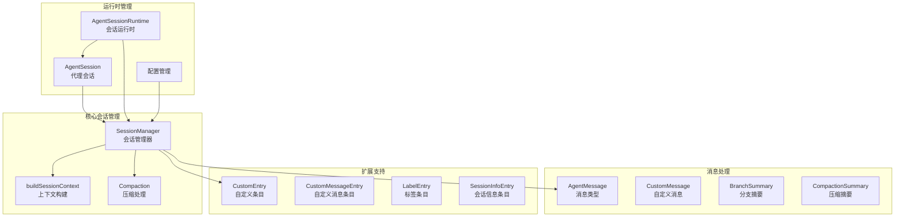
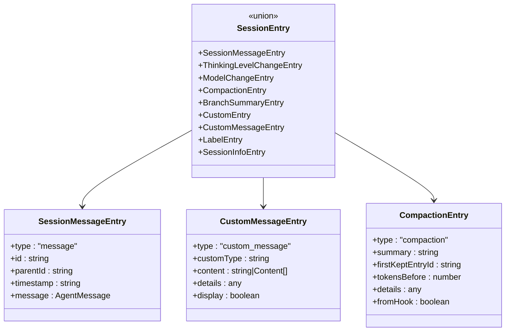
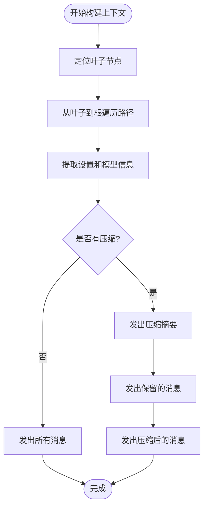
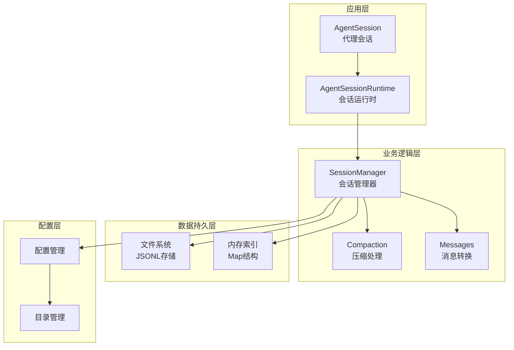
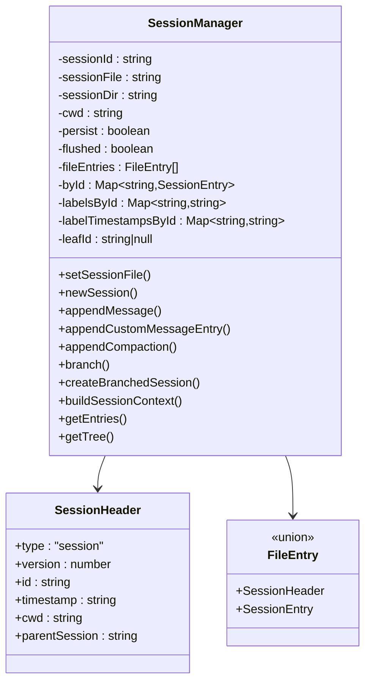
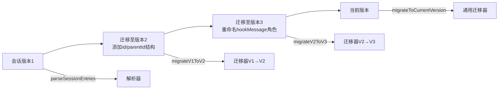
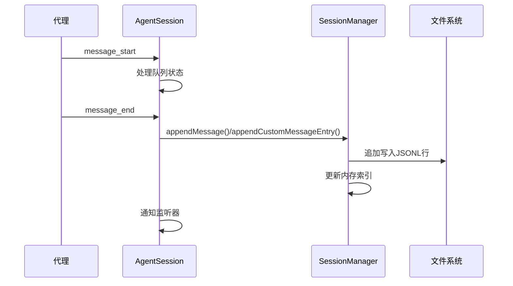
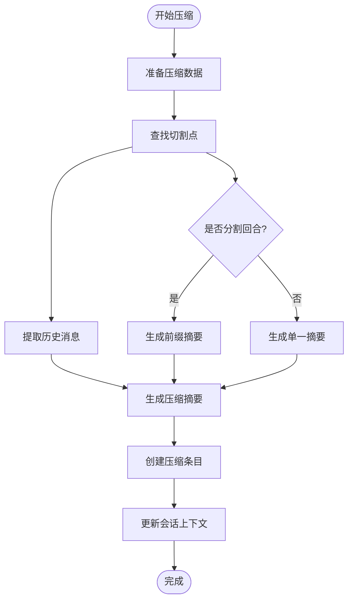

# 会话数据管理

<cite>
**本文档引用的文件**
- [session-manager.ts](file://packages/coding-agent/src/core/session-manager.ts)
- [agent-session.ts](file://packages/coding-agent/src/core/agent-session.ts)
- [agent-session-runtime.ts](file://packages/coding-agent/src/core/agent-session-runtime.ts)
- [messages.ts](file://packages/coding-agent/src/core/messages.ts)
- [compaction.ts](file://packages/coding-agent/src/core/compaction/compaction.ts)
- [config.ts](file://packages/coding-agent/src/config.ts)
- [11-sessions.ts](file://packages/coding-agent/examples/sdk/11-sessions.ts)
- [13-session-runtime.ts](file://packages/coding-agent/examples/sdk/13-session-runtime.ts)
- [session.test.ts](file://packages/agent/test/harness/session.test.ts)
</cite>

## 目录
1. [简介](#简介)
2. [项目结构](#项目结构)
3. [核心组件](#核心组件)
4. [架构概览](#架构概览)
5. [详细组件分析](#详细组件分析)
6. [依赖关系分析](#依赖关系分析)
7. [性能考虑](#性能考虑)
8. [故障排除指南](#故障排除指南)
9. [结论](#结论)

## 简介

Pi编码代理会话数据管理系统是一个基于JSONL格式的会话存储和管理框架，专为编码代理设计。该系统采用追加式树形结构存储会话历史，支持消息历史记录、上下文数据、工具调用结果和扩展信息的完整存储。

系统的核心特性包括：
- **追加式树形存储**：所有会话数据以JSONL格式追加存储，形成不可变的历史记录
- **多类型会话条目**：支持消息、思考级别变更、模型切换、压缩摘要、分支摘要等
- **智能压缩机制**：自动检测上下文窗口压力并生成压缩摘要
- **分支和标签系统**：支持会话分支和用户标记功能
- **扩展点支持**：为第三方扩展提供自定义数据存储能力

## 项目结构

会话数据管理系统主要分布在以下模块中：



**图表来源**
- [session-manager.ts:741-1546](file://packages/coding-agent/src/core/session-manager.ts#L741-L1546)
- [agent-session.ts:254-800](file://packages/coding-agent/src/core/agent-session.ts#L254-L800)
- [agent-session-runtime.ts:68-421](file://packages/coding-agent/src/core/agent-session-runtime.ts#L68-L421)

**章节来源**
- [session-manager.ts:1-1546](file://packages/coding-agent/src/core/session-manager.ts#L1-L1546)
- [agent-session.ts:1-800](file://packages/coding-agent/src/core/agent-session.ts#L1-L800)
- [agent-session-runtime.ts:1-421](file://packages/coding-agent/src/core/agent-session-runtime.ts#L1-L421)

## 核心组件

### SessionManager - 会话管理器

SessionManager是会话数据管理的核心组件，负责：
- **会话生命周期管理**：创建、打开、继续和分支会话
- **数据持久化**：将会话数据以JSONL格式写入文件系统
- **索引构建**：维护会话条目的内存索引以便快速查询
- **版本迁移**：自动处理不同版本会话文件的迁移

### 会话条目类型

系统支持多种会话条目类型：



**图表来源**
- [session-manager.ts:44-147](file://packages/coding-agent/src/core/session-manager.ts#L44-L147)

### 上下文构建系统

buildSessionContext函数负责从会话树中提取有效的LLM上下文：



**图表来源**
- [session-manager.ts:323-430](file://packages/coding-agent/src/core/session-manager.ts#L323-L430)

**章节来源**
- [session-manager.ts:741-1546](file://packages/coding-agent/src/core/session-manager.ts#L741-L1546)
- [messages.ts:1-196](file://packages/coding-agent/src/core/messages.ts#L1-L196)

## 架构概览

Pi编码代理会话数据管理采用分层架构设计：



**图表来源**
- [agent-session.ts:254-800](file://packages/coding-agent/src/core/agent-session.ts#L254-L800)
- [agent-session-runtime.ts:68-421](file://packages/coding-agent/src/core/agent-session-runtime.ts#L68-L421)
- [config.ts:485-537](file://packages/coding-agent/src/config.ts#L485-L537)

## 详细组件分析

### SessionManager 类深度分析

SessionManager实现了完整的会话数据管理功能：

#### 数据结构设计



**图表来源**
- [session-manager.ts:741-806](file://packages/coding-agent/src/core/session-manager.ts#L741-L806)
- [session-manager.ts:30-37](file://packages/coding-agent/src/core/session-manager.ts#L30-L37)
- [session-manager.ts:149-150](file://packages/coding-agent/src/core/session-manager.ts#L149-L150)

#### 数据持久化机制

SessionManager采用追加式写入策略：

1. **首次助手响应延迟写入**：在收到第一个助手消息之前，会话数据不会写入文件，避免产生重复头部的问题
2. **批量写入优化**：当存在助手消息时，使用一次性写入整个文件的方式，提高性能
3. **文件锁定机制**：使用文件描述符确保写入操作的原子性

#### 版本兼容性处理

系统支持多版本会话文件的自动迁移：



**图表来源**
- [session-manager.ts:274-289](file://packages/coding-agent/src/core/session-manager.ts#L274-L289)
- [session-manager.ts:223-268](file://packages/coding-agent/src/core/session-manager.ts#L223-L268)

**章节来源**
- [session-manager.ts:886-913](file://packages/coding-agent/src/core/session-manager.ts#L886-L913)
- [session-manager.ts:274-289](file://packages/coding-agent/src/core/session-manager.ts#L274-L289)

### AgentSession 类分析

AgentSession作为会话的高级抽象，封装了完整的代理生命周期：

#### 事件驱动的数据持久化



**图表来源**
- [agent-session.ts:472-544](file://packages/coding-agent/src/core/agent-session.ts#L472-L544)
- [session-manager.ts:928-938](file://packages/coding-agent/src/core/session-manager.ts#L928-L938)

#### 自动压缩机制

AgentSession集成了智能压缩功能：

1. **上下文使用量监控**：跟踪最近助手消息的令牌使用情况
2. **触发条件检测**：当上下文接近模型限制时自动触发压缩
3. **压缩结果处理**：将压缩摘要注入到会话上下文中

**章节来源**
- [agent-session.ts:472-544](file://packages/coding-agent/src/core/agent-session.ts#L472-L544)
- [compaction.ts:219-222](file://packages/coding-agent/src/core/compaction/compaction.ts#L219-L222)

### 会话压缩系统

压缩系统通过生成结构化摘要来控制上下文大小：

#### 压缩算法流程



**图表来源**
- [compaction.ts:644-719](file://packages/coding-agent/src/core/compaction/compaction.ts#L644-L719)
- [compaction.ts:747-800](file://packages/coding-agent/src/core/compaction/compaction.ts#L747-L800)

#### 压缩摘要格式

压缩摘要采用结构化格式，包含：
- **目标**：用户要完成的任务列表
- **约束与偏好**：任务约束和用户偏好
- **进度**：已完成、进行中和阻塞的任务
- **关键决策**：重要决策及其理由
- **下一步**：后续行动清单
- **关键上下文**：继续工作所需的重要信息

**章节来源**
- [compaction.ts:454-524](file://packages/coding-agent/src/core/compaction/compaction.ts#L454-L524)
- [messages.ts:11-24](file://packages/coding-agent/src/core/messages.ts#L11-L24)

## 依赖关系分析

会话数据管理系统的关键依赖关系：

```mermaid
graph TB
subgraph "外部依赖"
AC[Agent Core<br/>@earendil-works/pi-agent-core]
AI[AI库<br/>@earendil-works/pi-ai]
FS[Node FS<br/>文件系统]
PATH[Node Path<br/>路径处理]
end
subgraph "内部模块"
SM[SessionManager]
AS[AgentSession]
ASR[AgentSessionRuntime]
MSG[Messages]
CMP[Compaction]
CFG[Config]
end
AC --> SM
AI --> AS
FS --> SM
PATH --> SM
SM --> AS
SM --> ASR
MSG --> AS
MSG --> SM
CMP --> AS
CFG --> SM
CFG --> ASR
```

**图表来源**
- [session-manager.ts:1-27](file://packages/coding-agent/src/core/session-manager.ts#L1-L27)
- [agent-session.ts:16-89](file://packages/coding-agent/src/core/agent-session.ts#L16-L89)

### 数据访问模式

系统采用多种数据访问模式：

1. **只读访问**：通过SessionManager的只读方法获取会话信息
2. **树遍历**：使用getBranch()方法沿父链向上遍历
3. **索引查询**：通过byId映射快速定位特定条目
4. **批量操作**：支持并发加载多个会话信息

### 缓存策略

系统实现了多层次的缓存机制：

- **内存索引缓存**：byId映射缓存所有会话条目
- **标签缓存**：labelsById和labelTimestampsById缓存标签信息
- **文件内容缓存**：已加载的会话文件内容缓存在内存中
- **并发控制**：MAX_CONCURRENT_SESSION_INFO_LOADS限制并发加载数量

**章节来源**
- [session-manager.ts:835-854](file://packages/coding-agent/src/core/session-manager.ts#L835-L854)
- [session-manager.ts:655-695](file://packages/coding-agent/src/core/session-manager.ts#L655-L695)

## 性能考虑

### 写入性能优化

1. **延迟写入策略**：在第一个助手响应之前不写入文件，避免空文件和重复头部
2. **批量写入**：存在助手消息时一次性写入整个文件，减少磁盘I/O操作
3. **文件描述符复用**：使用openSync/writeSync确保写入操作的原子性

### 查询性能优化

1. **内存索引**：通过Map结构实现O(1)的条目查找
2. **树遍历优化**：使用迭代而非递归避免栈溢出
3. **并发加载**：限制同时加载的会话数量，避免内存峰值

### 存储空间优化

1. **压缩机制**：定期生成压缩摘要减少存储空间
2. **版本迁移**：清理过时的数据结构和冗余信息
3. **标签管理**：支持删除标签而不影响核心会话数据

## 故障排除指南

### 常见问题及解决方案

#### 会话文件损坏

**症状**：会话无法正常加载或显示为空

**诊断步骤**：
1. 检查会话文件头部是否正确
2. 验证JSONL格式的有效性
3. 确认会话版本兼容性

**解决方法**：
- 使用SessionManager的setSessionFile()方法重新初始化
- 手动修复JSONL格式错误
- 应用版本迁移脚本

#### 内存使用过高

**症状**：长时间运行后内存占用持续增长

**诊断步骤**：
1. 检查会话条目数量
2. 监控byId映射大小
3. 分析标签缓存使用情况

**解决方法**：
- 定期执行会话压缩
- 清理不必要的标签
- 实施会话生命周期管理

#### 并发加载问题

**症状**：大量会话同时加载导致性能下降

**诊断步骤**：
1. 检查MAX_CONCURRENT_SESSION_INFO_LOADS设置
2. 监控并发任务数量
3. 分析I/O等待时间

**解决方法**：
- 调整并发加载限制
- 实现优先级队列
- 增加重试机制

**章节来源**
- [session-manager.ts:776-806](file://packages/coding-agent/src/core/session-manager.ts#L776-L806)
- [session-manager.ts:508-528](file://packages/coding-agent/src/core/session-manager.ts#L508-L528)

## 结论

Pi编码代理会话数据管理系统通过精心设计的架构实现了高效、可靠的会话管理。系统的主要优势包括：

1. **可靠性**：采用追加式存储和版本迁移确保数据完整性
2. **可扩展性**：支持多种会话条目类型和扩展点
3. **性能优化**：多层缓存和并发控制机制
4. **易用性**：简洁的API和丰富的示例代码

该系统为Pi编码代理提供了坚实的数据基础，支持复杂的会话场景，包括长对话管理、分支处理和智能压缩等功能。通过合理的架构设计和性能优化，系统能够在保证数据安全的同时提供优秀的用户体验。

未来可以考虑的改进方向：
- 实现增量压缩算法以进一步减少存储开销
- 添加数据备份和恢复机制
- 优化大文件会话的加载性能
- 增强跨平台兼容性