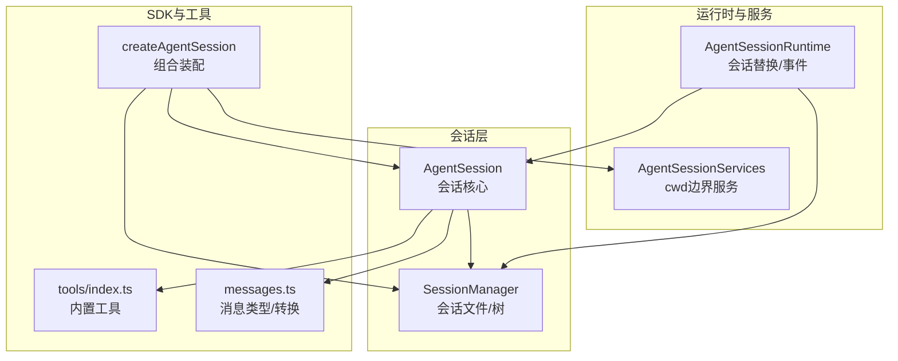
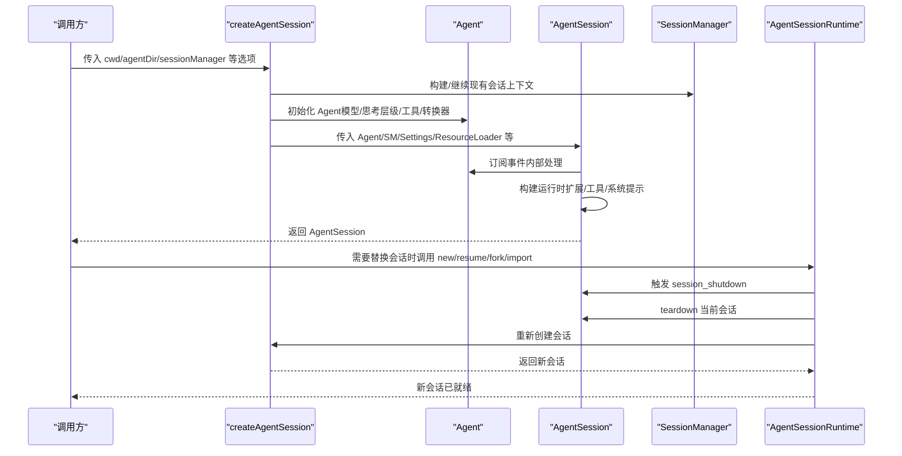
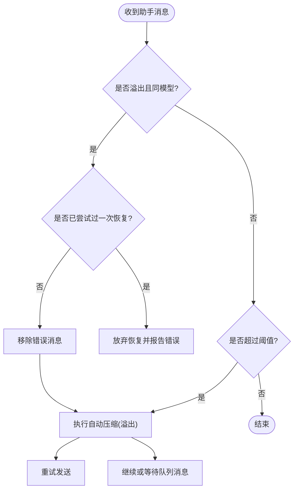
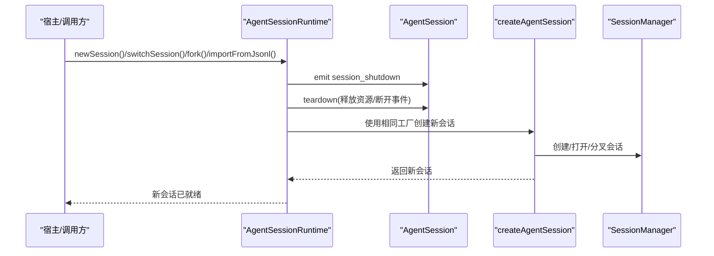
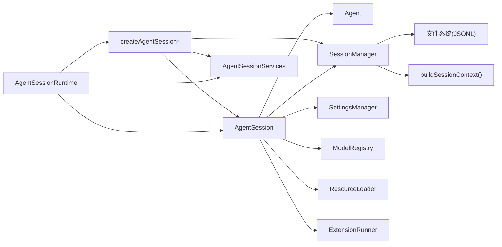

# 会话生命周期

<cite>
**本文引用的文件**
- [agent-session.ts](file://packages/coding-agent/src/core/agent-session.ts)
- [session-manager.ts](file://packages/coding-agent/src/core/session-manager.ts)
- [agent-session-runtime.ts](file://packages/coding-agent/src/core/agent-session-runtime.ts)
- [agent-session-services.ts](file://packages/coding-agent/src/core/agent-session-services.ts)
- [sdk.ts](file://packages/coding-agent/src/core/sdk.ts)
- [messages.ts](file://packages/coding-agent/src/core/messages.ts)
- [tools/index.ts](file://packages/coding-agent/src/core/tools/index.ts)
- [11-sessions.ts](file://packages/coding-agent/examples/sdk/11-sessions.ts)
- [13-session-runtime.ts](file://packages/coding-agent/examples/sdk/13-session-runtime.ts)
</cite>

## 目录
1. [简介](#简介)
2. [项目结构](#项目结构)
3. [核心组件](#核心组件)
4. [架构总览](#架构总览)
5. [详细组件分析](#详细组件分析)
6. [依赖关系分析](#依赖关系分析)
7. [性能考量](#性能考量)
8. [故障排查指南](#故障排查指南)
9. [结论](#结论)
10. [附录](#附录)

## 简介
本文件系统性阐述 Pi 编码代理的会话生命周期管理，围绕 AgentSession 类展开，覆盖从初始化、配置参数设置、资源加载与事件订阅，到状态管理、事件处理机制、自动重连与自动压缩、分支摘要、资源清理与销毁等全链路流程。同时给出会话启动、运行、暂停（中断）、恢复（切换/分叉/导入）、关闭（dispose）的具体实现要点与最佳实践。

## 项目结构
围绕会话生命周期的关键模块如下：
- 核心会话：AgentSession 负责会话状态、事件、工具、模型、思考层级、队列、自动重试、自动压缩、分支摘要、Bash 执行、树导航、统计导出等。
- 会话管理器：SessionManager 负责会话文件的持久化、版本迁移、上下文构建、树结构维护、标签与信息条目、分支摘要与压缩记录等。
- 运行时：AgentSessionRuntime 提供会话替换能力（new/resume/fork/import），在替换前后触发扩展事件，确保 UI/绑定正确重建。
- 服务层：AgentSessionServices 负责按 cwd 边界创建认证存储、设置管理、模型注册表、资源加载器等。
- SDK：createAgentSession 组合上述组件，完成会话创建、模型与思考层级恢复、初始消息注入、Agent 初始化与转换器注入等。
- 工具与消息：tools/index.ts 定义内置工具；messages.ts 定义自定义消息类型及转换器。

图示来源
- [agent-session.ts](file://packages/coding-agent/src/core/agent-session.ts)
- [session-manager.ts](file://packages/coding-agent/src/core/session-manager.ts)
- [agent-session-runtime.ts](file://packages/coding-agent/src/core/agent-session-runtime.ts)
- [agent-session-services.ts](file://packages/coding-agent/src/core/agent-session-services.ts)
- [sdk.ts](file://packages/coding-agent/src/core/sdk.ts)
- [tools/index.ts](file://packages/coding-agent/src/core/tools/index.ts)
- [messages.ts](file://packages/coding-agent/src/core/messages.ts)

章节来源
- [agent-session.ts](file://packages/coding-agent/src/core/agent-session.ts)
- [session-manager.ts](file://packages/coding-agent/src/core/session-manager.ts)
- [agent-session-runtime.ts](file://packages/coding-agent/src/core/agent-session-runtime.ts)
- [agent-session-services.ts](file://packages/coding-agent/src/core/agent-session-services.ts)
- [sdk.ts](file://packages/coding-agent/src/core/sdk.ts)
- [tools/index.ts](file://packages/coding-agent/src/core/tools/index.ts)
- [messages.ts](file://packages/coding-agent/src/core/messages.ts)

## 核心组件
- AgentSession：会话生命周期的核心，负责事件订阅与转发、扩展绑定、工具注册、模型与思考层级管理、消息队列（steer/followUp）、自动重试、自动压缩、分支摘要、Bash 执行、树导航、统计导出等。
- SessionManager：会话文件的读写、版本迁移、上下文构建（含压缩摘要与分支摘要）、树节点索引、标签与会话信息、消息与自定义条目持久化。
- AgentSessionRuntime：封装会话替换流程（new/resume/fork/import），在替换前后发出 session_shutdown 与 session_start 事件，确保扩展与 UI 正确重建。
- AgentSessionServices：按 cwd 边界创建认证存储、设置管理、模型注册表、资源加载器，并加载扩展与应用扩展标志值。
- SDK：createAgentSession 将以上组件组装，完成模型/思考层级恢复、初始消息注入、Agent 初始化与转换器注入、会话创建结果返回。

章节来源
- [agent-session.ts](file://packages/coding-agent/src/core/agent-session.ts)
- [session-manager.ts](file://packages/coding-agent/src/core/session-manager.ts)
- [agent-session-runtime.ts](file://packages/coding-agent/src/core/agent-session-runtime.ts)
- [agent-session-services.ts](file://packages/coding-agent/src/core/agent-session-services.ts)
- [sdk.ts](file://packages/coding-agent/src/core/sdk.ts)

## 架构总览
下图展示从 SDK 创建会话到 AgentSession 运行期间的交互关系与数据流：

图示来源
- [sdk.ts](file://packages/coding-agent/src/core/sdk.ts)
- [agent-session.ts](file://packages/coding-agent/src/core/agent-session.ts)
- [agent-session-runtime.ts](file://packages/coding-agent/src/core/agent-session-runtime.ts)

## 详细组件分析

### AgentSession 初始化与配置
- 初始化阶段
  - 接收 Agent、SessionManager、SettingsManager、cwd、资源加载器、模型注册表、扩展运行时引用、会话开始事件等配置。
  - 内部订阅 Agent 事件，安装工具钩子（beforeToolCall/afterToolCall），构建运行时（扩展、工具、系统提示）。
- 配置参数
  - scopedModels：用于 Ctrl+P 模型循环的限定集合。
  - customTools：SDK 注册的自定义工具。
  - initialActiveToolNames/allowedToolNames/excludedToolNames/baseToolsOverride：控制工具集与白/黑名单、覆盖内置工具。
  - modelRegistry：模型鉴权与发现。
  - resourceLoader：技能、提示、主题、上下文文件、系统提示等资源加载。
  - sessionStartEvent：扩展绑定时的会话开始事件元数据。

章节来源
- [agent-session.ts](file://packages/coding-agent/src/core/agent-session.ts)

### 事件订阅与转发机制
- 内部事件处理
  - _handleAgentEvent：统一处理 Agent 事件，先转发给扩展，再通知外部监听器；在 message_end 时持久化消息或自定义消息；跟踪最后一条助手消息用于自动压缩检查；在 agent_end 后根据错误类型决定是否自动重试。
  - _emitExtensionEvent：将 Agent 事件映射为扩展事件（agent_start/end、turn_start/end、message_*、tool_execution_*、before_agent_start 等）。
  - _emit/_emitQueueUpdate：向外部监听器广播事件，如队列更新、思考层级变更、会话信息变更等。
- 外部订阅
  - subscribe：添加监听器；返回取消订阅函数。
  - clearQueue/get pendingMessageCount：管理队列（steer/followUp）。
- 断连与重连
  - _disconnectFromAgent/_reconnectToAgent：内部断开/重连以支持长时间操作（如压缩、分叉摘要）不被打扰。

章节来源
- [agent-session.ts](file://packages/coding-agent/src/core/agent-session.ts)

### 自动重连与自动压缩
- 自动重连（自动重试）
  - _isRetryableError：判断错误是否可重试（排除上下文溢出、部分配额限制等）。
  - _prepareRetry：指数退避等待，移除错误消息后继续；支持 _retryAbortController 可中止。
  - _willRetryAfterAgentEnd：在 agent_end 时计算是否应重试。
  - 事件：auto_retry_start/auto_retry_end。
- 自动压缩
  - _checkCompaction：在 agent_end 或 prompt 前检查是否需要压缩（溢出或阈值）。
  - _runAutoCompaction：生成摘要、写入压缩条目、重建上下文、触发扩展事件；支持手动取消与扩展提供的压缩结果。
  - 事件：compaction_start/end（包含 reason、willRetry、errorMessage 等）。

图示来源
- [agent-session.ts](file://packages/coding-agent/src/core/agent-session.ts)

章节来源
- [agent-session.ts](file://packages/coding-agent/src/core/agent-session.ts)

### 分支摘要与树导航
- 分支摘要
  - generateBranchSummary：在导航到新叶子前，对废弃分支进行摘要生成与持久化。
  - 支持扩展提供摘要或默认摘要器；可附加标签。
- 树导航
  - navigateTree：在会话树上移动叶子位置，必要时插入摘要；更新 Agent 上下文消息列表；触发扩展事件。

章节来源
- [agent-session.ts](file://packages/coding-agent/src/core/agent-session.ts)

### Bash 执行与消息注入
- executeBash：执行命令，记录结果为 BashExecutionMessage；若正在流式输出则延迟注入，保证顺序正确。
- recordBashResult：将 Bash 结果注入 Agent 状态与 SessionManager；支持排除上下文（!! 前缀）。
- hasPendingBashMessages/_flushPendingBashMessages：保持消息顺序一致性。

章节来源
- [agent-session.ts](file://packages/coding-agent/src/core/agent-session.ts)
- [messages.ts](file://packages/coding-agent/src/core/messages.ts)

### 模型与思考层级管理
- setModel/cycleModel：设置/循环模型，保存到会话与设置，必要时调整思考层级。
- setThinkingLevel/cycleThinkingLevel/getAvailableThinkingLevels/supportsThinking：管理思考层级，基于模型能力进行钳制。
- _getThinkingLevelForModelSwitch：在模型切换时选择合适的思考层级。

章节来源
- [agent-session.ts](file://packages/coding-agent/src/core/agent-session.ts)

### 工具注册与系统提示
- _refreshToolRegistry：根据允许/排除规则与扩展/自定义工具，构建工具注册表与提示片段/指导。
- _rebuildSystemPrompt：基于当前工具集与资源加载器重建系统提示。
- setActiveToolsByName/getAllTools/getToolDefinition：动态启用/查询工具。

章节来源
- [agent-session.ts](file://packages/coding-agent/src/core/agent-session.ts)
- [tools/index.ts](file://packages/coding-agent/src/core/tools/index.ts)

### 会话状态与统计
- sessionId/sessionFile/sessionName：获取会话标识、文件路径与显示名。
- messages/state/isStreaming/pendingMessageCount：读取会话状态。
- getSessionStats/getContextUsage：统计消息数、令牌用量、费用与上下文占用率。

章节来源
- [agent-session.ts](file://packages/coding-agent/src/core/agent-session.ts)

### 资源加载与扩展绑定
- AgentSessionServices：按 cwd 边界创建认证存储、设置管理、模型注册表、资源加载器；加载扩展并应用扩展标志值。
- AgentSession.bindExtensions/createReplacedSessionContext：绑定 UI/命令上下文、错误处理器、重启/关闭回调；在替换后重建上下文。
- extendResourcesFromExtensions：扩展发现资源（技能/提示/主题），并重建系统提示。

章节来源
- [agent-session-services.ts](file://packages/coding-agent/src/core/agent-session-services.ts)
- [agent-session.ts](file://packages/coding-agent/src/core/agent-session.ts)

### 会话替换与运行时管理
- AgentSessionRuntime：封装 new/resume/fork/import 流程；在替换前后发出 session_shutdown 与 session_start；teardown 当前会话并应用新会话；支持 withSession 回调。
- createAgentSessionRuntime：从工厂创建初始运行时；assertSessionCwdExists 确保 cwd 可用。

图示来源
- [agent-session-runtime.ts](file://packages/coding-agent/src/core/agent-session-runtime.ts)
- [sdk.ts](file://packages/coding-agent/src/core/sdk.ts)

章节来源
- [agent-session-runtime.ts](file://packages/coding-agent/src/core/agent-session-runtime.ts)
- [sdk.ts](file://packages/coding-agent/src/core/sdk.ts)

### 会话启动、运行、暂停、恢复与关闭
- 启动
  - createAgentSession：解析 cwd/agentDir，创建/继续 SessionManager，恢复模型与思考层级，初始化 Agent，注入转换器与流式函数，创建 AgentSession 并绑定扩展。
- 运行
  - prompt/sendUserMessage/steer/followUp：发送用户消息、排队消息；扩展命令优先处理；模板与技能块展开；流式时按 steer/followUp 策略排队。
- 暂停
  - abort/abortRetry/abortCompaction/abortBranchSummary/abortBash：中止当前操作；_disconnectFromAgent/_reconnectToAgent：临时断连以避免事件干扰。
- 恢复
  - AgentSessionRuntime.switchSession/newSession/fork/importFromJsonl：通过扩展事件与 teardown 机制安全切换会话；恢复后重建扩展与 UI 绑定。
- 关闭
  - dispose：中止重试/压缩/分支摘要/Bash，调用 agent.abort，使扩展上下文失效，断开事件，清理会话资源。

章节来源
- [sdk.ts](file://packages/coding-agent/src/core/sdk.ts)
- [agent-session.ts](file://packages/coding-agent/src/core/agent-session.ts)
- [agent-session-runtime.ts](file://packages/coding-agent/src/core/agent-session-runtime.ts)

## 依赖关系分析
- AgentSession 依赖
  - Agent：事件驱动的核心推理引擎。
  - SessionManager：会话文件与上下文构建。
  - SettingsManager/ModelRegistry/ResourceLoader：设置、鉴权、资源。
  - ExtensionRunner：扩展事件与工具包装。
- SessionManager 依赖
  - 文件系统：读写 JSONL 会话文件，版本迁移。
  - 构建会话上下文：考虑压缩摘要、分支摘要、自定义消息。
- AgentSessionRuntime 依赖
  - AgentSessionServices：按 cwd 边界创建服务。
  - SDK：createAgentSessionFromServices/createAgentSession。

图示来源
- [agent-session.ts](file://packages/coding-agent/src/core/agent-session.ts)
- [session-manager.ts](file://packages/coding-agent/src/core/session-manager.ts)
- [agent-session-runtime.ts](file://packages/coding-agent/src/core/agent-session-runtime.ts)
- [agent-session-services.ts](file://packages/coding-agent/src/core/agent-session-services.ts)
- [sdk.ts](file://packages/coding-agent/src/core/sdk.ts)

章节来源
- [agent-session.ts](file://packages/coding-agent/src/core/agent-session.ts)
- [session-manager.ts](file://packages/coding-agent/src/core/session-manager.ts)
- [agent-session-runtime.ts](file://packages/coding-agent/src/core/agent-session-runtime.ts)
- [agent-session-services.ts](file://packages/coding-agent/src/core/agent-session-services.ts)
- [sdk.ts](file://packages/coding-agent/src/core/sdk.ts)

## 性能考量
- 自动压缩阈值与频率：合理设置压缩阈值与启用状态，避免频繁压缩带来的额外 API 开销与延迟。
- 图像过滤：当启用图像屏蔽时，convertToLlm 会过滤图片内容，减少上下文大小与带宽消耗。
- 流式传输与队列：在流式场景下使用 steer/followUp 策略，避免阻塞主线程；及时刷新 Bash 结果以维持消息顺序。
- 会话树导航：分支摘要仅在必要时生成，避免对大分支重复摘要；标签与摘要条目持久化减少后续扫描成本。
- 重试退避：指数退避可缓解瞬时错误，但需设置最大重试次数与最大延迟，防止雪崩。

## 故障排查指南
- 无模型或无 API Key
  - 现象：prompt 抛出“未选择模型”或“缺少 API Key”错误。
  - 处理：通过 setModel/cycleModel 设置有效模型；使用 ModelRegistry 验证鉴权；OAuth 失败时提示重新登录。
- 上下文溢出
  - 现象：助手消息 stopReason 为 error 且提示溢出。
  - 处理：自动压缩（溢出）后重试；若多次失败，建议降低上下文或切换更大上下文模型。
- 重试无效
  - 现象：多次重试仍失败。
  - 处理：确认错误类型是否可重试；检查配额/预算限制；适当增加最大重试次数与延迟上限。
- 事件未到达 UI
  - 现象：队列更新/思考层级变更等事件未显示。
  - 处理：确保订阅者未被意外断开；在长操作前使用 _disconnectFromAgent/_reconnectToAgent；检查 clearQueue 是否清空了队列。
- 会话替换后 UI 不更新
  - 现象：切换会话后 UI 未反映新会话状态。
  - 处理：使用 AgentSessionRuntime 的 new/resume/fork/import；在回调中重新绑定扩展与 UI；确保 extensionRunner 引用已更新。

章节来源
- [agent-session.ts](file://packages/coding-agent/src/core/agent-session.ts)
- [agent-session-runtime.ts](file://packages/coding-agent/src/core/agent-session-runtime.ts)

## 结论
AgentSession 将会话状态、事件、工具、模型与思考层级、消息队列、自动重试与压缩、分支摘要、Bash 执行、树导航与统计导出整合为一体，配合 SessionManager 的文件持久化与上下文构建、AgentSessionRuntime 的会话替换与扩展事件、AgentSessionServices 的 cwd 边界服务，形成完整的会话生命周期管理体系。遵循本文的最佳实践，可在复杂交互场景中保持稳定性与可观测性。

## 附录
- 示例参考
  - 会话管理示例：展示了 in-memory、新建、继续最近、打开指定会话等模式。
  - 会话运行时示例：演示了 new/resume/fork/import 的替换流程与订阅重建。

章节来源
- [11-sessions.ts](file://packages/coding-agent/examples/sdk/11-sessions.ts)
- [13-session-runtime.ts](file://packages/coding-agent/examples/sdk/13-session-runtime.ts)