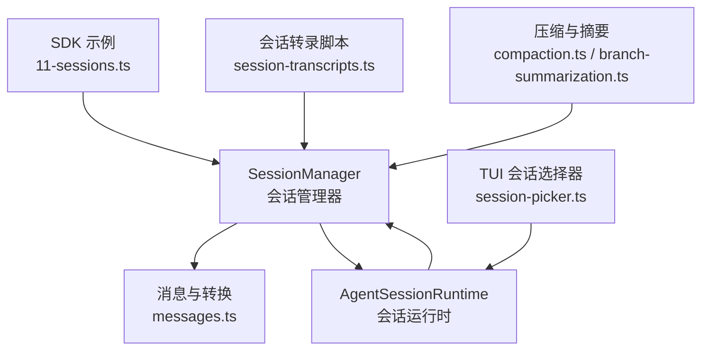
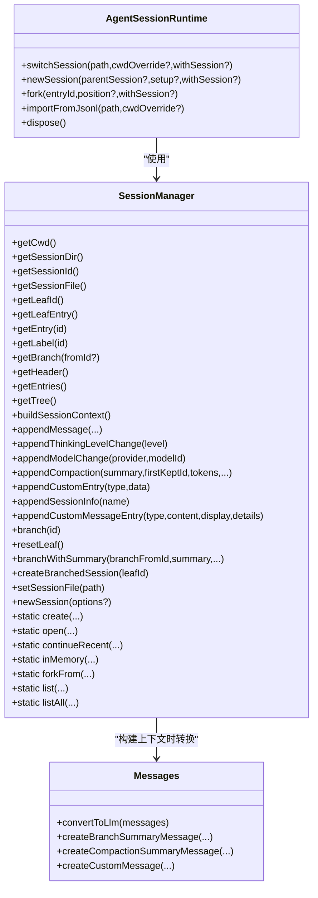
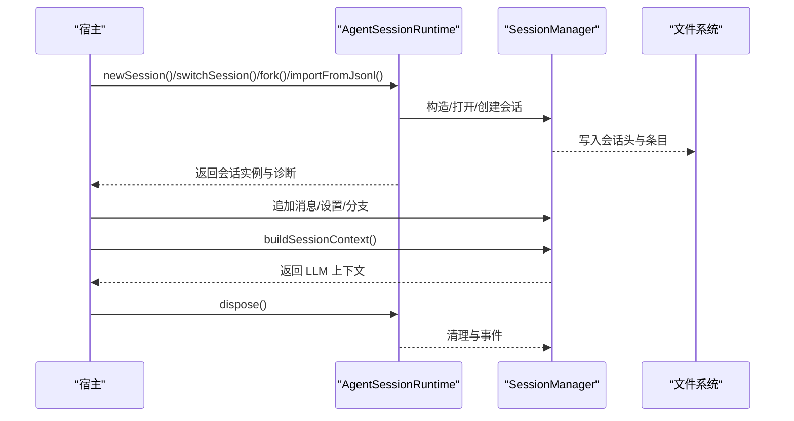
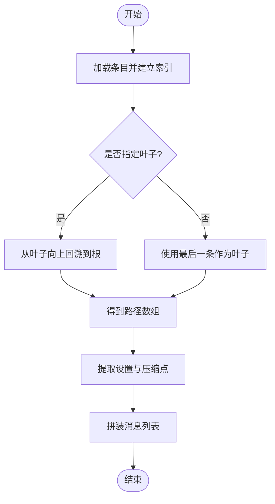
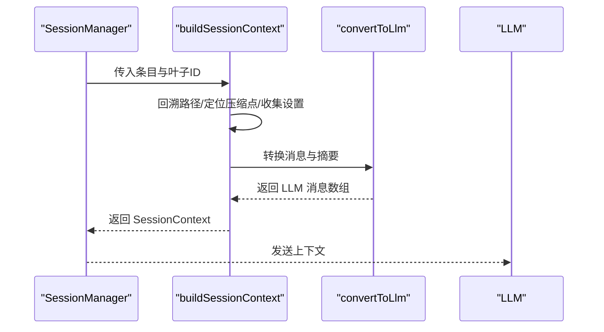
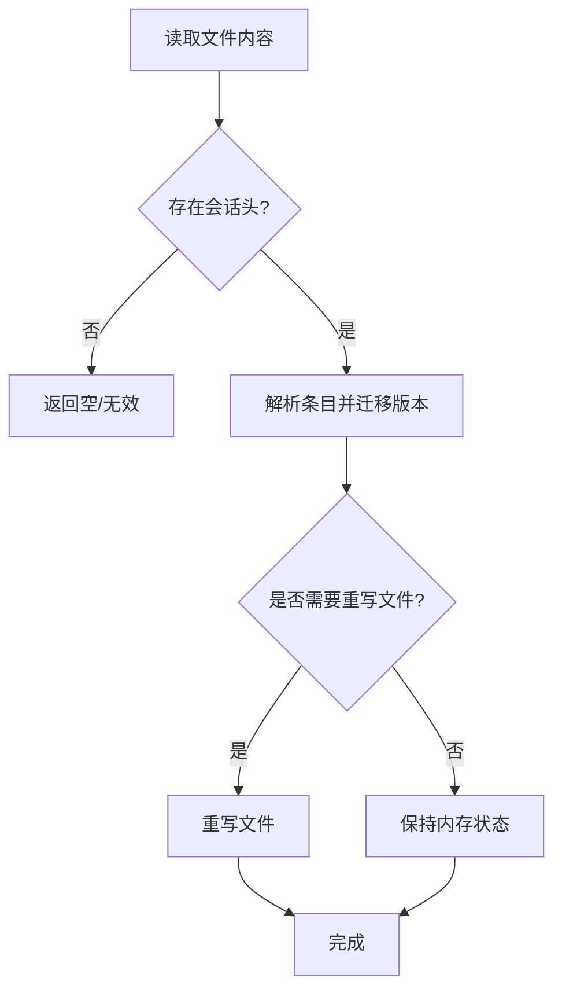
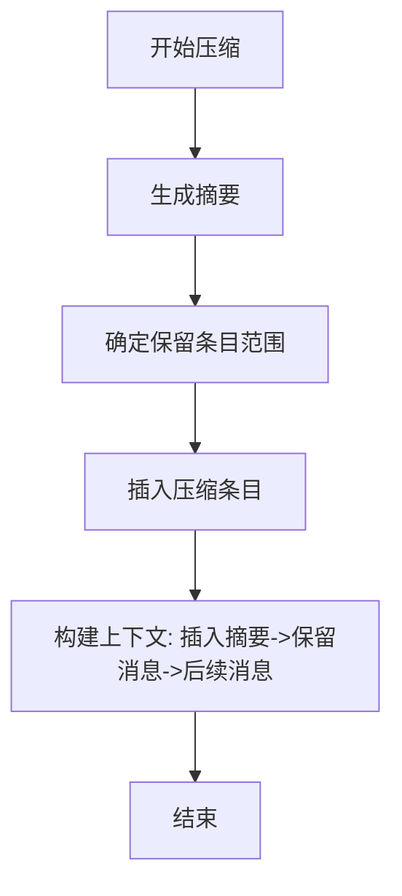
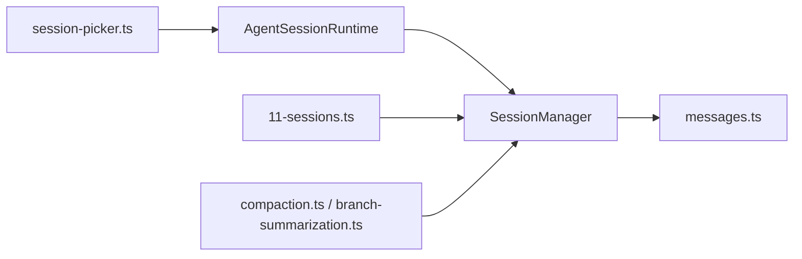

# 会话管理

<cite>
**本文引用的文件**
- [packages/coding-agent/src/core/session-manager.ts](file://packages/coding-agent/src/core/session-manager.ts)
- [packages/coding-agent/src/core/messages.ts](file://packages/coding-agent/src/core/messages.ts)
- [packages/coding-agent/src/core/agent-session-runtime.ts](file://packages/coding-agent/src/core/agent-session-runtime.ts)
- [packages/coding-agent/examples/sdk/11-sessions.ts](file://packages/coding-agent/examples/sdk/11-sessions.ts)
- [packages/coding-agent/src/cli/session-picker.ts](file://packages/coding-agent/src/cli/session-picker.ts)
- [scripts/session-transcripts.ts](file://scripts/session-transcripts.ts)
- [packages/coding-agent/src/core/compaction/compaction.ts](file://packages/coding-agent/src/core/compaction/compaction.ts)
- [packages/coding-agent/src/core/compaction/branch-summarization.ts](file://packages/coding-agent/src/core/compaction/branch-summarization.ts)
- [packages/coding-agent/docs/compaction.md](file://packages/coding-agent/docs/compaction.md)
</cite>

## 目录
1. [简介](#简介)
2. [项目结构](#项目结构)
3. [核心组件](#核心组件)
4. [架构总览](#架构总览)
5. [详细组件分析](#详细组件分析)
6. [依赖关系分析](#依赖关系分析)
7. [性能考量](#性能考量)
8. [故障排查指南](#故障排查指南)
9. [结论](#结论)
10. [附录](#附录)

## 简介
本文件系统性阐述 Pi 编码代理会话管理系统的设计与实现，覆盖会话生命周期（创建、配置、启动、运行、关闭）、会话数据结构与消息历史、上下文构建与会话迁移（分叉、分支、导入）、以及会话压缩机制（令牌估算、分支摘要生成、优化策略）。文档同时提供最佳实践与性能调优建议，帮助开发者在复杂交互场景中高效使用与扩展会话能力。

## 项目结构
围绕会话管理的关键模块与文件如下：
- 会话核心：SessionManager 提供会话的持久化、树形结构维护、上下文构建、分支与分叉导出等能力
- 消息与转换：消息类型扩展与 LLM 转换器，支持自定义消息、分支/压缩摘要注入
- 运行时与生命周期：AgentSessionRuntime 将会话与 cwd 绑定的服务整合，负责切换、新建、分叉、导入等运行时操作
- 示例与工具：SDK 示例展示不同会话模式；脚本用于转录提取与分析；CLI 提供 TUI 选择器
- 压缩与摘要：核心压缩与分支摘要模块，支撑会话优化与可读性提升

**图表来源**
- [packages/coding-agent/src/core/session-manager.ts:741-1546](file://packages/coding-agent/src/core/session-manager.ts#L741-L1546)
- [packages/coding-agent/src/core/messages.ts:1-196](file://packages/coding-agent/src/core/messages.ts#L1-L196)
- [packages/coding-agent/src/core/agent-session-runtime.ts:68-421](file://packages/coding-agent/src/core/agent-session-runtime.ts#L68-L421)
- [packages/coding-agent/src/cli/session-picker.ts:13-53](file://packages/coding-agent/src/cli/session-picker.ts#L13-L53)
- [packages/coding-agent/examples/sdk/11-sessions.ts:1-53](file://packages/coding-agent/examples/sdk/11-sessions.ts#L1-L53)
- [scripts/session-transcripts.ts:1-407](file://scripts/session-transcripts.ts#L1-L407)
- [packages/coding-agent/src/core/compaction/compaction.ts](file://packages/coding-agent/src/core/compaction/compaction.ts)
- [packages/coding-agent/src/core/compaction/branch-summarization.ts](file://packages/coding-agent/src/core/compaction/branch-summarization.ts)

**章节来源**
- [packages/coding-agent/src/core/session-manager.ts:741-1546](file://packages/coding-agent/src/core/session-manager.ts#L741-L1546)
- [packages/coding-agent/src/core/messages.ts:1-196](file://packages/coding-agent/src/core/messages.ts#L1-L196)
- [packages/coding-agent/src/core/agent-session-runtime.ts:68-421](file://packages/coding-agent/src/core/agent-session-runtime.ts#L68-L421)
- [packages/coding-agent/src/cli/session-picker.ts:13-53](file://packages/coding-agent/src/cli/session-picker.ts#L13-L53)
- [packages/coding-agent/examples/sdk/11-sessions.ts:1-53](file://packages/coding-agent/examples/sdk/11-sessions.ts#L1-L53)
- [scripts/session-transcripts.ts:1-407](file://scripts/session-transcripts.ts#L1-L407)

## 核心组件
- 会话头与版本：会话以 JSONL 文件存储，首行包含会话头，包含版本号、会话 ID、时间戳、工作目录、父会话等信息
- 会话条目：树形结构的条目集合，支持消息、思维级别变更、模型变更、压缩摘要、分支摘要、自定义扩展条目、标签、会话信息等
- 上下文构建：根据当前叶子节点向上回溯至根，按规则合并消息、插入压缩/分支摘要，形成发送给 LLM 的上下文
- 分支与分叉：通过移动叶子指针或复制路径创建新分支；支持带摘要的分支，便于导航与复用
- 迁移与兼容：自动对旧版本会话进行迁移，保证向后兼容
- 运行时集成：与 AgentSessionRuntime 协作，完成切换、新建、分叉、导入等生命周期操作

**章节来源**
- [packages/coding-agent/src/core/session-manager.ts:30-182](file://packages/coding-agent/src/core/session-manager.ts#L30-L182)
- [packages/coding-agent/src/core/session-manager.ts:323-430](file://packages/coding-agent/src/core/session-manager.ts#L323-L430)
- [packages/coding-agent/src/core/session-manager.ts:1219-1257](file://packages/coding-agent/src/core/session-manager.ts#L1219-L1257)
- [packages/coding-agent/src/core/session-manager.ts:274-289](file://packages/coding-agent/src/core/session-manager.ts#L274-L289)

## 架构总览
会话管理采用“树形追加只写”设计，所有操作均在当前叶子节点基础上追加子节点，不修改既有历史。运行时负责将会话与 cwd 绑定的服务整合，提供统一的会话生命周期管理入口。

**图表来源**
- [packages/coding-agent/src/core/session-manager.ts:741-1546](file://packages/coding-agent/src/core/session-manager.ts#L741-L1546)
- [packages/coding-agent/src/core/agent-session-runtime.ts:68-421](file://packages/coding-agent/src/core/agent-session-runtime.ts#L68-L421)
- [packages/coding-agent/src/core/messages.ts:148-196](file://packages/coding-agent/src/core/messages.ts#L148-L196)

## 详细组件分析

### 会话生命周期管理
- 创建：SessionManager.create 或 inMemory/newSession 生成新的会话头与文件（持久化）或内存态
- 配置：可通过 options 指定父会话、工作目录、会话目录等
- 启动：AgentSessionRuntime.newSession/switchSession/fork/importFromJsonl 完成运行时绑定与服务初始化
- 运行：通过 appendMessage/appendThinkingLevelChange/appendModelChange 等方法追加条目；buildSessionContext 获取上下文
- 关闭：runtime.dispose 触发扩展事件与资源释放

**图表来源**
- [packages/coding-agent/src/core/agent-session-runtime.ts:187-375](file://packages/coding-agent/src/core/agent-session-runtime.ts#L187-L375)
- [packages/coding-agent/src/core/session-manager.ts:808-913](file://packages/coding-agent/src/core/session-manager.ts#L808-L913)
- [packages/coding-agent/src/core/session-manager.ts:1143-1145](file://packages/coding-agent/src/core/session-manager.ts#L1143-L1145)

**章节来源**
- [packages/coding-agent/src/core/agent-session-runtime.ts:187-375](file://packages/coding-agent/src/core/agent-session-runtime.ts#L187-L375)
- [packages/coding-agent/src/core/session-manager.ts:808-913](file://packages/coding-agent/src/core/session-manager.ts#L808-L913)
- [packages/coding-agent/src/core/session-manager.ts:1143-1145](file://packages/coding-agent/src/core/session-manager.ts#L1143-L1145)

### 会话数据结构与消息历史
- 会话头：包含版本、会话 ID、时间戳、工作目录、父会话等
- 条目类型：消息、思维级别变更、模型变更、压缩、分支摘要、自定义扩展、标签、会话信息
- 树形索引：通过 id/parentId 构建 Map，支持快速定位与回溯
- 历史遍历：从叶子向上回溯，收集路径上的条目，处理压缩与摘要

**图表来源**
- [packages/coding-agent/src/core/session-manager.ts:323-430](file://packages/coding-agent/src/core/session-manager.ts#L323-L430)

**章节来源**
- [packages/coding-agent/src/core/session-manager.ts:30-182](file://packages/coding-agent/src/core/session-manager.ts#L30-L182)
- [packages/coding-agent/src/core/session-manager.ts:835-854](file://packages/coding-agent/src/core/session-manager.ts#L835-L854)
- [packages/coding-agent/src/core/session-manager.ts:1128-1162](file://packages/coding-agent/src/core/session-manager.ts#L1128-L1162)

### 上下文管理与消息转换
- 上下文构建：根据叶子节点回溯路径，合并消息，优先处理压缩摘要与分支摘要
- 消息转换：将自定义消息、分支/压缩摘要转换为 LLM 可理解的消息格式
- 兼容性：支持旧版钩子消息角色重命名，确保向后兼容

**图表来源**
- [packages/coding-agent/src/core/session-manager.ts:323-430](file://packages/coding-agent/src/core/session-manager.ts#L323-L430)
- [packages/coding-agent/src/core/messages.ts:148-196](file://packages/coding-agent/src/core/messages.ts#L148-L196)
- [packages/coding-agent/src/core/messages.ts:100-138](file://packages/coding-agent/src/core/messages.ts#L100-L138)

**章节来源**
- [packages/coding-agent/src/core/session-manager.ts:323-430](file://packages/coding-agent/src/core/session-manager.ts#L323-L430)
- [packages/coding-agent/src/core/messages.ts:148-196](file://packages/coding-agent/src/core/messages.ts#L148-L196)

### 会话迁移与兼容
- 版本迁移：自动将 v1/v2 会话迁移到当前版本，修正树结构与角色名
- 头部校验：加载文件时验证头部合法性，避免损坏会话导致异常
- 并发加载：批量列出会话时限制并发度，提高大目录下的稳定性

**图表来源**
- [packages/coding-agent/src/core/session-manager.ts:452-478](file://packages/coding-agent/src/core/session-manager.ts#L452-L478)
- [packages/coding-agent/src/core/session-manager.ts:274-289](file://packages/coding-agent/src/core/session-manager.ts#L274-L289)
- [packages/coding-agent/src/core/session-manager.ts:657-695](file://packages/coding-agent/src/core/session-manager.ts#L657-L695)

**章节来源**
- [packages/coding-agent/src/core/session-manager.ts:274-289](file://packages/coding-agent/src/core/session-manager.ts#L274-L289)
- [packages/coding-agent/src/core/session-manager.ts:452-478](file://packages/coding-agent/src/core/session-manager.ts#L452-L478)
- [packages/coding-agent/src/core/session-manager.ts:657-695](file://packages/coding-agent/src/core/session-manager.ts#L657-L695)

### 会话压缩机制
- 压缩摘要：在压缩点插入摘要条目，随后仅保留被保留条目的消息，减少上下文长度
- 令牌估算：压缩前记录压缩前的令牌数，便于评估压缩效果
- 分支摘要：在分支时插入摘要条目，帮助后续导航与理解上下文来源
- 压缩流程：由压缩模块生成摘要与保留范围，SessionManager 记录压缩条目并参与上下文构建

**图表来源**
- [packages/coding-agent/src/core/session-manager.ts:968-988](file://packages/coding-agent/src/core/session-manager.ts#L968-L988)
- [packages/coding-agent/src/core/session-manager.ts:398-427](file://packages/coding-agent/src/core/session-manager.ts#L398-L427)
- [packages/coding-agent/src/core/messages.ts:109-120](file://packages/coding-agent/src/core/messages.ts#L109-L120)
- [packages/coding-agent/src/core/compaction/compaction.ts](file://packages/coding-agent/src/core/compaction/compaction.ts)
- [packages/coding-agent/src/core/compaction/branch-summarization.ts](file://packages/coding-agent/src/core/compaction/branch-summarization.ts)

**章节来源**
- [packages/coding-agent/src/core/session-manager.ts:968-988](file://packages/coding-agent/src/core/session-manager.ts#L968-L988)
- [packages/coding-agent/src/core/session-manager.ts:398-427](file://packages/coding-agent/src/core/session-manager.ts#L398-L427)
- [packages/coding-agent/src/core/messages.ts:109-120](file://packages/coding-agent/src/core/messages.ts#L109-L120)

### 会话管理最佳实践
- 使用 SessionManager.list/listAll 列举会话，结合 TUI 选择器进行交互式恢复
- 在运行时通过 AgentSessionRuntime.newSession/switchSession/fork/importFromJsonl 统一管理生命周期
- 通过 appendThinkingLevelChange/appendModelChange 精细化控制上下文设置
- 使用 createBranchedSession 导出单一分支路径，便于归档与复用
- 对于大目录，合理设置并发加载参数，避免阻塞

**章节来源**
- [packages/coding-agent/src/cli/session-picker.ts:13-53](file://packages/coding-agent/src/cli/session-picker.ts#L13-L53)
- [packages/coding-agent/src/core/agent-session-runtime.ts:187-375](file://packages/coding-agent/src/core/agent-session-runtime.ts#L187-L375)
- [packages/coding-agent/src/core/session-manager.ts:1264-1356](file://packages/coding-agent/src/core/session-manager.ts#L1264-L1356)

## 依赖关系分析
- SessionManager 依赖消息转换模块以生成 LLM 可用的上下文
- AgentSessionRuntime 依赖 SessionManager 完成会话切换与生命周期管理
- CLI 会话选择器与 SDK 示例为用户提供了便捷入口
- 压缩与分支摘要模块为 SessionManager 提供优化与导航能力

**图表来源**
- [packages/coding-agent/src/core/session-manager.ts:741-1546](file://packages/coding-agent/src/core/session-manager.ts#L741-L1546)
- [packages/coding-agent/src/core/messages.ts:148-196](file://packages/coding-agent/src/core/messages.ts#L148-L196)
- [packages/coding-agent/src/core/agent-session-runtime.ts:68-421](file://packages/coding-agent/src/core/agent-session-runtime.ts#L68-L421)
- [packages/coding-agent/src/cli/session-picker.ts:13-53](file://packages/coding-agent/src/cli/session-picker.ts#L13-L53)
- [packages/coding-agent/examples/sdk/11-sessions.ts:1-53](file://packages/coding-agent/examples/sdk/11-sessions.ts#L1-L53)
- [packages/coding-agent/src/core/compaction/compaction.ts](file://packages/coding-agent/src/core/compaction/compaction.ts)
- [packages/coding-agent/src/core/compaction/branch-summarization.ts](file://packages/coding-agent/src/core/compaction/branch-summarization.ts)

**章节来源**
- [packages/coding-agent/src/core/session-manager.ts:741-1546](file://packages/coding-agent/src/core/session-manager.ts#L741-L1546)
- [packages/coding-agent/src/core/messages.ts:148-196](file://packages/coding-agent/src/core/messages.ts#L148-L196)
- [packages/coding-agent/src/core/agent-session-runtime.ts:68-421](file://packages/coding-agent/src/core/agent-session-runtime.ts#L68-L421)

## 性能考量
- 文件写入策略：首次出现助手消息时才完整写入，避免重复头写入与空文件问题
- 并发加载：批量列出会话时限制并发数量，降低 I/O 压力
- 上下文构建：通过 Map 快速索引条目，回溯路径时避免重复扫描
- 压缩优化：仅保留必要消息，显著降低上下文长度与推理成本

**章节来源**
- [packages/coding-agent/src/core/session-manager.ts:886-913](file://packages/coding-agent/src/core/session-manager.ts#L886-L913)
- [packages/coding-agent/src/core/session-manager.ts:657-695](file://packages/coding-agent/src/core/session-manager.ts#L657-L695)
- [packages/coding-agent/src/core/session-manager.ts:323-430](file://packages/coding-agent/src/core/session-manager.ts#L323-L430)

## 故障排查指南
- 会话头缺失或损坏：加载失败时返回空结果，需重建会话或修复文件
- 无效会话 ID：创建/恢复时校验 ID 格式，不符合规范会抛出错误
- 分支目标不存在：分支/分叉时若目标条目不存在，会抛出错误
- 导入文件不存在：importFromJsonl 会在文件不存在时抛出自定义异常
- 并发加载卡顿：适当降低并发度或分批处理

**章节来源**
- [packages/coding-agent/src/core/session-manager.ts:452-478](file://packages/coding-agent/src/core/session-manager.ts#L452-L478)
- [packages/coding-agent/src/core/session-manager.ts:205-211](file://packages/coding-agent/src/core/session-manager.ts#L205-L211)
- [packages/coding-agent/src/core/session-manager.ts:1219-1224](file://packages/coding-agent/src/core/session-manager.ts#L1219-L1224)
- [packages/coding-agent/src/core/agent-session-runtime.ts:340-344](file://packages/coding-agent/src/core/agent-session-runtime.ts#L340-L344)

## 结论
Pi 编码代理会话管理系统通过树形追加、上下文转换与压缩摘要等机制，实现了高可读性与高性能的对话历史管理。配合 AgentSessionRuntime 的生命周期管理与 CLI/TUI 工具，开发者可以轻松完成会话的创建、恢复、分叉与导出，并在复杂任务中保持上下文的有效性与可控性。建议在生产环境中遵循最佳实践，结合压缩与摘要策略，持续优化性能与可维护性。

## 附录
- 会话转录与分析脚本可用于批量提取与聚合会话内容，辅助自动化规则发现与知识沉淀
- 压缩与分支摘要文档提供了更深入的算法细节与使用建议

**章节来源**
- [scripts/session-transcripts.ts:1-407](file://scripts/session-transcripts.ts#L1-L407)
- [packages/coding-agent/docs/compaction.md](file://packages/coding-agent/docs/compaction.md)