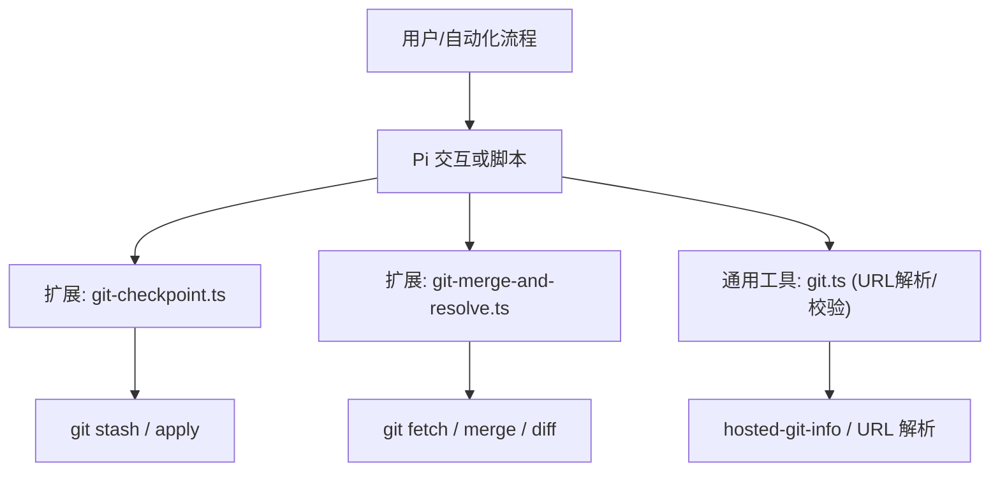
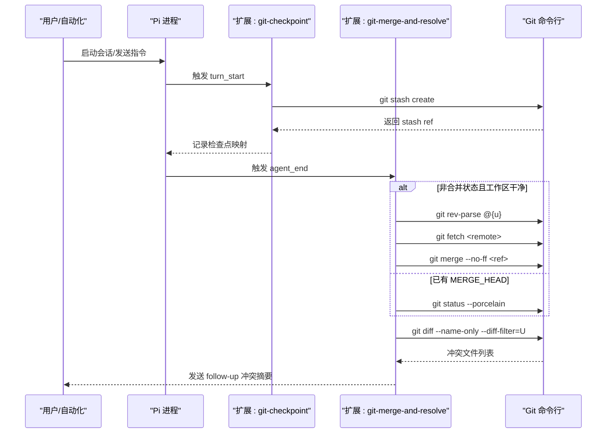
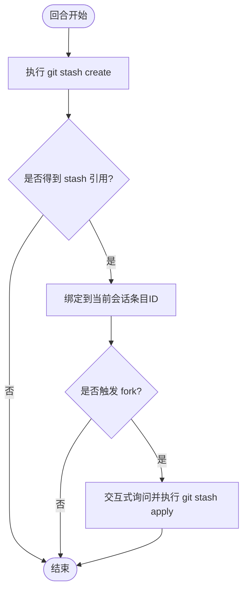
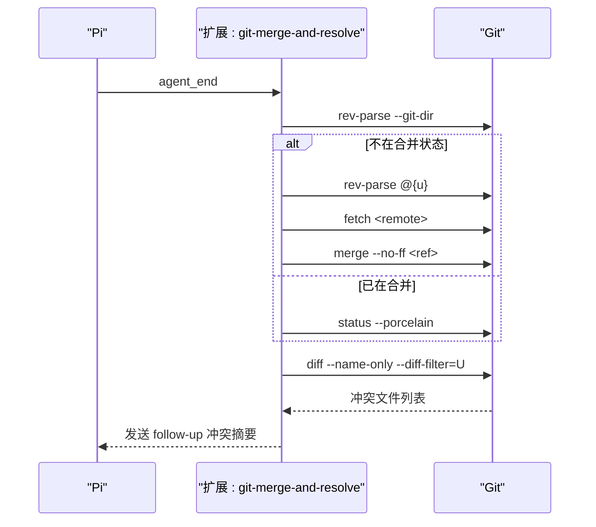
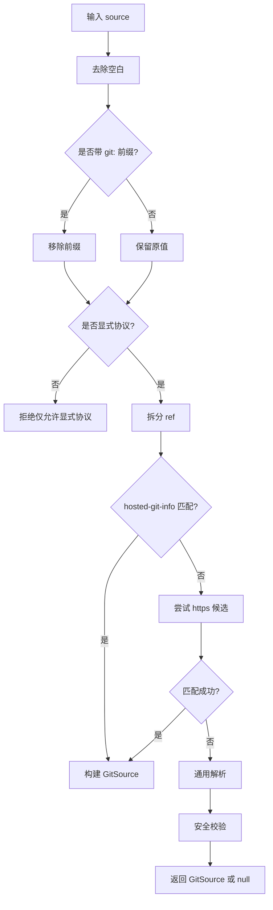
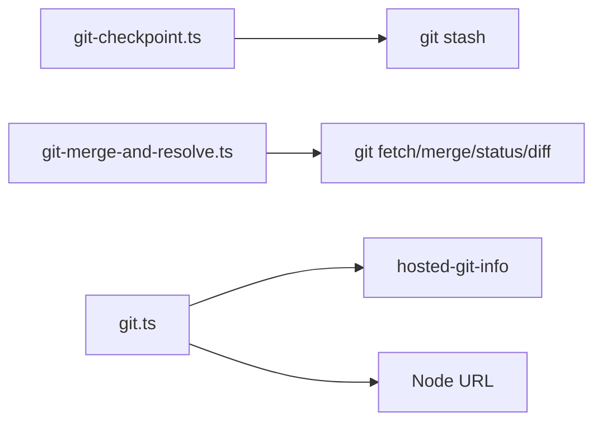

# Git 操作工具

<cite>
**本文引用的文件**
- [AGENTS.md](file://AGENTS.md)
- [CONTRIBUTING.md](file://CONTRIBUTING.md)
- [README.md](file://README.md)
- [git.ts](file://packages/coding-agent/src/utils/git.ts)
- [git-checkpoint.ts](file://packages/coding-agent/examples/extensions/git-checkpoint.ts)
- [git-merge-and-resolve.ts](file://packages/coding-agent/examples/extensions/git-merge-and-resolve.ts)
</cite>

## 目录
1. [简介](#简介)
2. [项目结构](#项目结构)
3. [核心组件](#核心组件)
4. [架构总览](#架构总览)
5. [详细组件分析](#详细组件分析)
6. [依赖关系分析](#依赖关系分析)
7. [性能考虑](#性能考虑)
8. [故障排查指南](#故障排查指南)
9. [结论](#结论)
10. [附录](#附录)

## 简介
本文件面向在 Pi 编码代理工作流中使用版本控制（Git）的开发者与自动化流程，聚焦以下目标：
- 说明如何在 Pi 中安全、可审计地执行 Git 操作（状态查看、差异对比、提交、分支管理、合并冲突解决等）。
- 解释仓库初始化、分支管理、提交历史查看等常见操作的推荐实践。
- 提供与版本控制系统集成的方式与冲突解决策略。
- 给出实际工作流示例：代码审查、自动化发布、协作开发。
- 总结 Git 最佳实践与安全注意事项。

注意：本仓库未内置名为 git_status、git_diff、git_commit、git_branch 的独立函数模块；Git 能力通过扩展（Extensions）、技能（Skills）与 CLI/脚本调用实现。下文将基于现有实现与规范进行系统化说明。

## 项目结构
Pi 的 Git 相关能力主要分布在如下位置：
- 规则与约定：根级 AGENTS.md 定义了多会话并发下的 Git 使用约束与命令白名单。
- 扩展示例：examples/extensions 下提供了“检查点”和“合并+冲突解析”两类 Git 集成示例。
- URL 解析工具：src/utils/git.ts 提供安全的 Git 源地址解析与校验逻辑，用于包安装与远程仓库识别。

图表来源
- [git-checkpoint.ts:1-54](file://packages/coding-agent/examples/extensions/git-checkpoint.ts#L1-L54)
- [git-merge-and-resolve.ts:1-116](file://packages/coding-agent/examples/extensions/git-merge-and-resolve.ts#L1-L116)
- [git.ts:1-227](file://packages/coding-agent/src/utils/git.ts#L1-L227)

章节来源
- [AGENTS.md:51-71](file://AGENTS.md#L51-L71)
- [git-checkpoint.ts:1-54](file://packages/coding-agent/examples/extensions/git-checkpoint.ts#L1-L54)
- [git-merge-and-resolve.ts:1-116](file://packages/coding-agent/examples/extensions/git-merge-and-resolve.ts#L1-L116)
- [git.ts:1-227](file://packages/coding-agent/src/utils/git.ts#L1-L227)

## 核心组件
- Git 安全检查点扩展（git-checkpoint.ts）
  - 在每个 agent 回合开始前创建 git stash 检查点，支持按会话节点恢复代码状态。
  - 适用于需要“回滚到某次对话前代码快照”的场景。
- 自动合并与冲突提示扩展（git-merge-and-resolve.ts）
  - 在 agent 结束时尝试拉取并合并上游跟踪分支；若出现冲突，解析冲突块并以 follow-up 消息通知用户继续处理。
  - 适用于持续保持工作分支与上游同步的协作场景。
- Git URL 解析与校验（git.ts）
  - 支持多种 Git 源格式（HTTPS/SSH/Git协议/SCP风格），提取 host/path/ref，并进行路径与字符安全校验。
  - 为包管理与远程仓库访问提供统一的安全入口。

章节来源
- [git-checkpoint.ts:1-54](file://packages/coding-agent/examples/extensions/git-checkpoint.ts#L1-L54)
- [git-merge-and-resolve.ts:1-116](file://packages/coding-agent/examples/extensions/git-merge-and-resolve.ts#L1-L116)
- [git.ts:1-227](file://packages/coding-agent/src/utils/git.ts#L1-L227)

## 架构总览
下图展示 Pi 如何通过扩展与工具链与 Git 集成，覆盖“状态/差异/提交/分支/合并/冲突”等常见需求。

图表来源
- [git-checkpoint.ts:14-52](file://packages/coding-agent/examples/extensions/git-checkpoint.ts#L14-L52)
- [git-merge-and-resolve.ts:73-114](file://packages/coding-agent/examples/extensions/git-merge-and-resolve.ts#L73-L114)

## 详细组件分析

### 组件A：Git 检查点（git-checkpoint.ts）
- 功能要点
  - 在每次 agent 回合开始时创建 stash 检查点，并与当前会话条目 ID 绑定。
  - 在 fork 会话时，若存在对应检查点，可选择将工作区恢复到该快照。
  - 会话结束后清理检查点缓存。
- 适用场景
  - 需要“按对话阶段”回滚代码的实验性开发、演示或调试。
- 关键行为
  - 使用 git stash create 生成引用，git stash apply 恢复。
  - 非交互模式下不自动恢复，避免静默变更工作区。

图表来源
- [git-checkpoint.ts:14-52](file://packages/coding-agent/examples/extensions/git-checkpoint.ts#L14-L52)

章节来源
- [git-checkpoint.ts:1-54](file://packages/coding-agent/examples/extensions/git-checkpoint.ts#L1-L54)

### 组件B：自动合并与冲突解析（git-merge-and-resolve.ts）
- 功能要点
  - 在 agent 结束时检测是否需要合并上游跟踪分支；若不在合并状态且工作区干净，则执行 fetch + merge。
  - 若存在冲突，扫描工作区中的冲突标记，输出每个冲突的文件与行范围（ours/theirs），并通过 follow-up 消息提示继续处理。
  - 若已处于未完成合并，会重新上报残留冲突。
- 适用场景
  - 协作开发中保持工作分支与上游同步，减少手动合并成本。
- 关键行为
  - 使用 git rev-parse 判断 MERGE_HEAD 与上游分支。
  - 使用 git status --porcelain 检查工作区状态。
  - 使用 git diff --name-only --diff-filter=U 获取冲突文件。
  - 解析冲突标记以生成结构化冲突摘要。

图表来源
- [git-merge-and-resolve.ts:73-114](file://packages/coding-agent/examples/extensions/git-merge-and-resolve.ts#L73-L114)

章节来源
- [git-merge-and-resolve.ts:1-116](file://packages/coding-agent/examples/extensions/git-merge-and-resolve.ts#L1-L116)

### 组件C：Git URL 解析与安全校验（git.ts）
- 功能要点
  - 解析多种 Git 源格式（https/http/ssh/git/SCP风格），提取 host、path、ref，并规范化 repo 字符串。
  - 对 host 与 path 进行安全校验，拒绝包含危险字符或路径穿越的组合。
  - 支持 hosted-git-info 快速识别主流托管平台。
- 适用场景
  - 安全地安装来自 Git 的扩展/包，避免恶意或错误输入导致的路径注入等问题。
- 复杂度与健壮性
  - 时间复杂度近似 O(1)~O(n)（n 为 URL 长度），空间复杂度 O(1)。
  - 对非法 URL 直接返回空，保证下游安全。

图表来源
- [git.ts:21-226](file://packages/coding-agent/src/utils/git.ts#L21-L226)

章节来源
- [git.ts:1-227](file://packages/coding-agent/src/utils/git.ts#L1-L227)

## 依赖关系分析
- 扩展与 Git 命令
  - git-checkpoint.ts 依赖 git stash create/apply。
  - git-merge-and-resolve.ts 依赖 git rev-parse/fetch/merge/status/diff。
- URL 解析与外部库
  - git.ts 依赖 hosted-git-info 与 Node URL 解析，用于标准化与校验。
- 安全边界
  - 所有 Git 命令通过 pi.exec 执行，受 Pi 权限模型与运行环境约束。
  - 扩展仅在信任的项目上下文中加载，避免意外执行不受控代码。

图表来源
- [git-checkpoint.ts:14-52](file://packages/coding-agent/examples/extensions/git-checkpoint.ts#L14-L52)
- [git-merge-and-resolve.ts:73-114](file://packages/coding-agent/examples/extensions/git-merge-and-resolve.ts#L73-L114)
- [git.ts:1-227](file://packages/coding-agent/src/utils/git.ts#L1-L227)

章节来源
- [git-checkpoint.ts:1-54](file://packages/coding-agent/examples/extensions/git-checkpoint.ts#L1-L54)
- [git-merge-and-resolve.ts:1-116](file://packages/coding-agent/examples/extensions/git-merge-and-resolve.ts#L1-L116)
- [git.ts:1-227](file://packages/coding-agent/src/utils/git.ts#L1-L227)

## 性能考虑
- 合并与冲突扫描
  - 仅在 agent_end 触发，避免频繁 IO；冲突扫描基于 diff 结果，通常文件数有限。
- Stash 检查点
  - 每回合一次 stash create，开销较小；建议配合合理的会话粒度使用。
- URL 解析
  - 解析过程轻量，适合在包安装/更新路径中高频调用。

[本节为通用指导，不直接分析具体文件]

## 故障排查指南
- 多会话并发冲突
  - 遵循 AGENTS.md 的 Git 规则：只提交本次会话修改的文件；禁止使用破坏性命令（如 reset --hard、clean -fd、stash 等）。
  - 遇到 rebase 冲突时，仅修改自己改动的文件；若冲突涉及他人文件，应中止并请求人工介入。
- 合并失败
  - 检查工作区是否为干净状态；确认上游分支是否存在并可 fetch。
  - 若已处于合并状态，先完成冲突解决再继续。
- URL 解析失败
  - 确保使用显式协议（https://、ssh://、git://）或带 git: 前缀的简写形式。
  - 检查 host/path 是否包含非法字符或路径穿越。

章节来源
- [AGENTS.md:51-71](file://AGENTS.md#L51-L71)
- [git-merge-and-resolve.ts:73-114](file://packages/coding-agent/examples/extensions/git-merge-and-resolve.ts#L73-L114)
- [git.ts:172-226](file://packages/coding-agent/src/utils/git.ts#L172-L226)

## 结论
- Pi 通过扩展机制灵活集成 Git 能力：检查点、自动合并与冲突提示、安全的远程源解析。
- 在多会话与自动化场景中，严格遵循仓库规则与安全校验，可显著降低误操作风险。
- 推荐将上述扩展纳入日常开发工作流，结合 CI/CD 与团队协作规范，提升交付效率与质量。

[本节为总结性内容，不直接分析具体文件]

## 附录

### 常用 Git 操作指南（在 Pi 工作流中）
- 仓库初始化
  - 在项目根目录执行 git init（或通过扩展/脚本封装）。
  - 配置远端与默认分支，确保后续合并流程顺畅。
- 分支管理
  - 使用 feature/* 分支开展功能开发，定期 fetch/merge 上游以保持同步。
  - 使用 git branch 查看本地/远端分支，必要时删除过期分支。
- 提交历史查看
  - 使用 git log 与 git show 查看最近提交与变更详情。
  - 结合 /tree 或会话树定位关键节点，必要时用检查点扩展回滚。
- 冲突解决策略
  - 优先理解冲突上下文，仅修改必要部分；保留有意义的注释。
  - 使用扩展提供的冲突摘要快速定位 ours/theirs 范围，逐步解决。

[本节为概念性指导，不直接分析具体文件]

### 实际工作流示例
- 代码审查流程
  - 在 PR 上拉取补丁至临时分支，使用 git diff 对比变更，结合 Pi 的 read/grep/find 工具进行审查。
  - 通过 /compact 与 /tree 回顾讨论历史，形成审查意见。
- 自动化发布
  - 在 CI 中执行 npm run check、测试与构建；成功后打 tag 并发布。
  - 使用 git-merge-and-resolve 扩展在本地预演合并，提前发现冲突。
- 协作开发
  - 多人并行开发时，遵循 AGENTS.md 的提交规则，避免跨会话污染工作区。
  - 使用检查点扩展在关键里程碑保存代码快照，便于回溯与演示。

[本节为概念性指导，不直接分析具体文件]

### 安全注意事项
- 仅信任经过审核的扩展与包；第三方包具有系统级执行权限。
- 使用 git.ts 的安全解析逻辑安装 Git 包，避免路径注入与越权访问。
- 在非交互模式下谨慎启用可能修改工作区的扩展（如自动合并）。
- 遵循最小权限原则，限制 Pi 运行的文件系统与网络访问范围。

章节来源
- [git.ts:84-124](file://packages/coding-agent/src/utils/git.ts#L84-L124)
- [README.md:39-46](file://README.md#L39-L46)