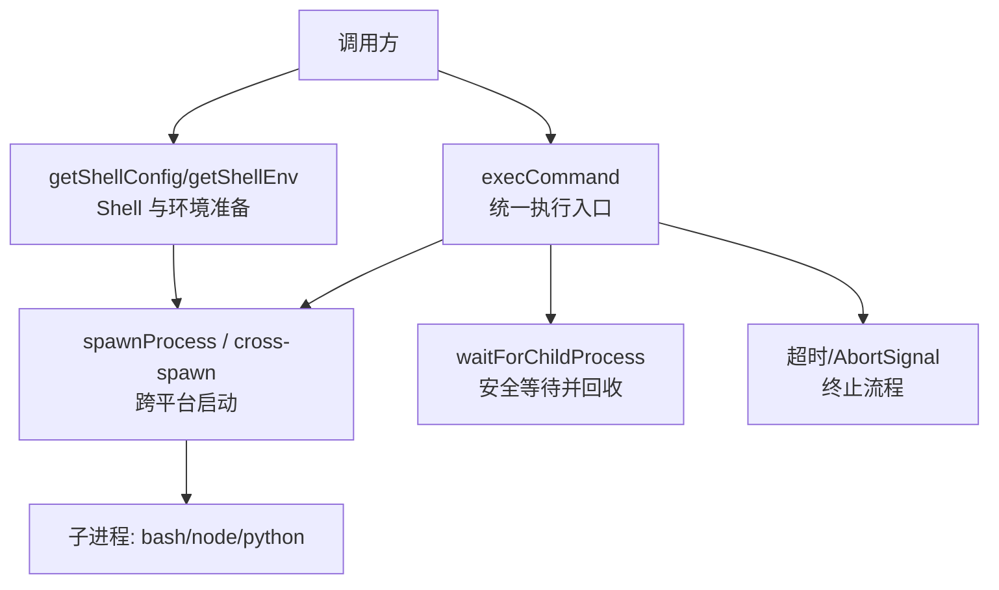
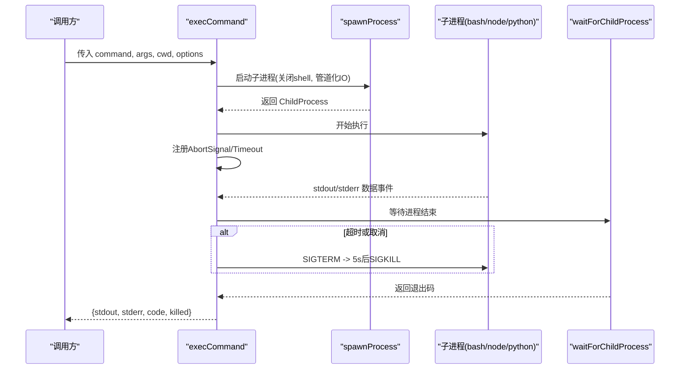
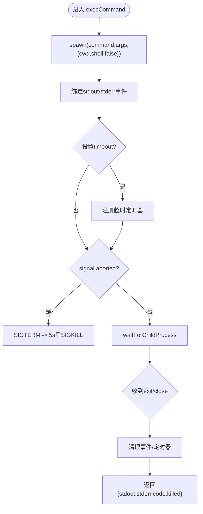
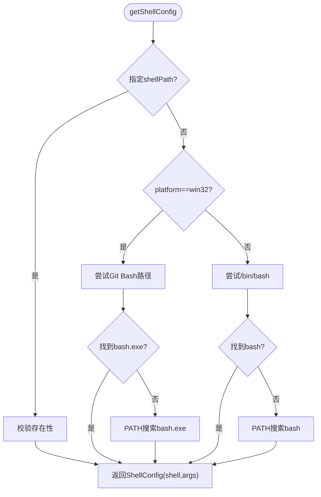
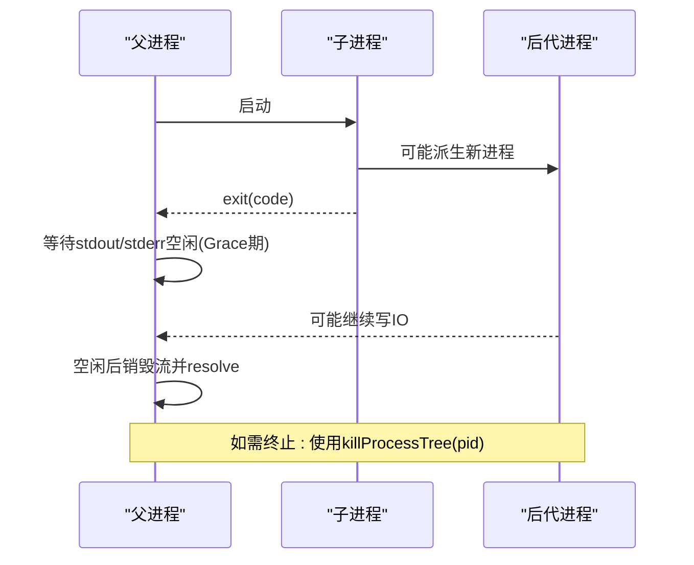
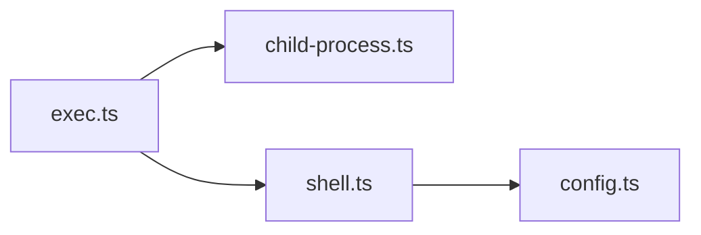

# 代码执行工具

<cite>
**本文引用的文件**
- [exec.ts](file://packages/coding-agent/src/core/exec.ts)
- [shell.ts](file://packages/coding-agent/src/utils/shell.ts)
- [child-process.ts](file://packages/coding-agent/src/utils/child-process.ts)
- [config.ts](file://packages/coding-agent/src/config.ts)
</cite>

## 目录
1. [简介](#简介)
2. [项目结构](#项目结构)
3. [核心组件](#核心组件)
4. [架构总览](#架构总览)
5. [详细组件分析](#详细组件分析)
6. [依赖关系分析](#依赖关系分析)
7. [性能考虑](#性能考虑)
8. [故障排除指南](#故障排除指南)
9. [结论](#结论)
10. [附录：使用示例与最佳实践](#附录使用示例与最佳实践)

## 简介
本文件面向“代码执行工具”的使用与维护，聚焦于在 Node.js 环境中安全、可控地执行外部命令（如 bash、node、python 等）。文档涵盖：
- 命令执行参数与环境变量配置
- 超时控制与取消机制
- 沙箱隔离策略与资源限制建议
- 常见工作流示例（运行测试脚本、执行构建命令、调试代码片段）
- 性能优化技巧与故障排除

## 项目结构
代码执行能力集中在 coding-agent 包中，关键文件职责如下：
- exec.ts：提供统一的命令执行接口，封装子进程生命周期、输出收集、超时与取消。
- shell.ts：跨平台 Shell 解析与查找（bash/sh），环境变量注入，二进制输出清洗，以及进程树清理。
- child-process.ts：跨平台 spawn/spawnSync 封装，以及安全的子进程等待逻辑，避免继承句柄导致的悬挂。
- config.ts：应用路径、用户配置目录、可执行目录（bin）等，为命令执行提供 PATH 注入点。

图表来源
- [exec.ts:34-107](file://packages/coding-agent/src/core/exec.ts#L34-L107)
- [child-process.ts:18-36](file://packages/coding-agent/src/utils/child-process.ts#L18-L36)
- [child-process.ts:49-137](file://packages/coding-agent/src/utils/child-process.ts#L49-L137)
- [shell.ts:67-134](file://packages/coding-agent/src/utils/shell.ts#L67-L134)

章节来源
- [exec.ts:1-108](file://packages/coding-agent/src/core/exec.ts#L1-L108)
- [shell.ts:1-226](file://packages/coding-agent/src/utils/shell.ts#L1-L226)
- [child-process.ts:1-138](file://packages/coding-agent/src/utils/child-process.ts#L1-L138)
- [config.ts:514-551](file://packages/coding-agent/src/config.ts#L514-L551)

## 核心组件
- execCommand
  - 功能：以非 shell 模式直接执行命令与参数数组，收集 stdout/stderr，返回退出码与是否被杀。
  - 特性：支持 AbortSignal 取消；支持 timeout 毫秒级超时；强制 SIGTERM 后 5 秒 SIGKILL 兜底。
  - 安全要点：不使用系统 shell，避免命令注入风险；stdio 仅管道化 stdout/stderr。
- getShellConfig / getShellEnv
  - 功能：跨平台定位 bash/sh，构造执行参数；合并自定义 bin 目录到 PATH，确保优先使用受管工具。
  - 特性：Windows 下优先 Git Bash，其次 PATH 中的 bash；Unix 下优先 /bin/bash，否则 PATH，最后回退 sh。
  - 环境变量：自动将“受管 bin 目录”插入 PATH，便于调用 fd、rg 等内置工具。
- waitForChildProcess
  - 功能：等待子进程结束，同时处理继承的 stdio 句柄，避免父进程卡死或丢失尾部输出。
  - 特性：exit 后继续读取直到空闲，再释放流；优雅清理监听器与定时器。
- killProcessTree
  - 功能：跨平台终止进程及其子进程树（Windows 用 taskkill /T，Unix 用进程组 SIGKILL）。
  - 用途：配合超时/取消时，确保完整清理后台任务。

章节来源
- [exec.ts:34-107](file://packages/coding-agent/src/core/exec.ts#L34-L107)
- [shell.ts:67-134](file://packages/coding-agent/src/utils/shell.ts#L67-L134)
- [child-process.ts:49-137](file://packages/coding-agent/src/utils/child-process.ts#L49-L137)
- [shell.ts:200-225](file://packages/coding-agent/src/utils/shell.ts#L200-L225)

## 架构总览
下图展示一次命令执行的端到端流程，包括环境准备、进程启动、输出收集、超时/取消、结果返回。

图表来源
- [exec.ts:34-107](file://packages/coding-agent/src/core/exec.ts#L34-L107)
- [child-process.ts:49-137](file://packages/coding-agent/src/utils/child-process.ts#L49-L137)

## 详细组件分析

### 命令执行 execCommand
- 输入参数
  - command: 要执行的程序名（如 node、python、bash）
  - args: 参数数组（避免 shell 拼接）
  - cwd: 工作目录
  - options.signal: AbortSignal 用于外部取消
  - options.timeout: 超时毫秒数
- 行为
  - 使用非 shell 模式启动，降低注入风险
  - 仅捕获 stdout/stderr，不暴露 stdin
  - 超时触发先发送 SIGTERM，5 秒未退出则 SIGKILL
  - 通过 waitForChildProcess 安全回收，避免继承句柄导致阻塞
- 返回值
  - stdout/stderr 字符串
  - code 退出码
  - killed 是否因超时/取消被杀

图表来源
- [exec.ts:34-107](file://packages/coding-agent/src/core/exec.ts#L34-L107)

章节来源
- [exec.ts:34-107](file://packages/coding-agent/src/core/exec.ts#L34-L107)

### Shell 与环境配置
- Shell 选择策略
  - Windows：优先 Git Bash，其次 PATH 中的 bash.exe；找不到则抛出明确错误提示
  - Unix：优先 /bin/bash，其次 PATH 中的 bash，最后回退 sh
- 环境变量注入
  - 自动将“受管 bin 目录”加入 PATH，保证优先使用内置工具
  - 保留原有 PATH，避免覆盖用户配置
- 输出清洗
  - sanitizeBinaryOutput 过滤控制字符与异常 Unicode，防止显示崩溃

图表来源
- [shell.ts:67-120](file://packages/coding-agent/src/utils/shell.ts#L67-L120)

章节来源
- [shell.ts:67-134](file://packages/coding-agent/src/utils/shell.ts#L67-L134)
- [shell.ts:144-174](file://packages/coding-agent/src/utils/shell.ts#L144-L174)
- [config.ts:514-551](file://packages/coding-agent/src/config.ts#L514-L551)

### 子进程等待与清理
- waitForChildProcess
  - 解决“子进程 exit 但后代仍持有 stdio 句柄”导致的悬挂问题
  - 在 exit 后继续读取直到空闲，再销毁流并 resolve
- killProcessTree
  - Windows：taskkill /F /T /PID pid
  - Unix/Linux/Mac：进程组 SIGKILL，失败回退单进程 SIGKILL

图表来源
- [child-process.ts:49-137](file://packages/coding-agent/src/utils/child-process.ts#L49-L137)
- [shell.ts:200-225](file://packages/coding-agent/src/utils/shell.ts#L200-L225)

章节来源
- [child-process.ts:49-137](file://packages/coding-agent/src/utils/child-process.ts#L49-L137)
- [shell.ts:200-225](file://packages/coding-agent/src/utils/shell.ts#L200-L225)

## 依赖关系分析
- exec.ts 依赖 child-process.ts 的 waitForChildProcess，实现安全等待
- shell.ts 依赖 config.ts 获取 bin 目录，用于 PATH 注入
- 三者共同构成“环境准备 → 进程启动 → 输出收集 → 清理回收”的闭环

图表来源
- [exec.ts:1-108](file://packages/coding-agent/src/core/exec.ts#L1-L108)
- [shell.ts:1-226](file://packages/coding-agent/src/utils/shell.ts#L1-L226)
- [child-process.ts:1-138](file://packages/coding-agent/src/utils/child-process.ts#L1-L138)
- [config.ts:514-551](file://packages/coding-agent/src/config.ts#L514-L551)

章节来源
- [exec.ts:1-108](file://packages/coding-agent/src/core/exec.ts#L1-L108)
- [shell.ts:1-226](file://packages/coding-agent/src/utils/shell.ts#L1-L226)
- [child-process.ts:1-138](file://packages/coding-agent/src/utils/child-process.ts#L1-L138)
- [config.ts:514-551](file://packages/coding-agent/src/config.ts#L514-L551)

## 性能考虑
- 避免 shell 层开销：execCommand 默认不使用系统 shell，减少解析与注入成本
- 合理设置超时：对长耗时任务设置 timeout，避免资源长期占用
- 及时取消：使用 AbortSignal 在 UI/请求取消时快速终止子进程
- 输出缓冲：stdout/stderr 以字符串累积，注意大输出场景下的内存占用
- 进程树清理：使用 killProcessTree 确保后台任务完全终止，避免僵尸进程
- PATH 优化：将受管 bin 目录置于 PATH 前部，减少外部依赖冲突

[本节为通用指导，无需具体文件引用]

## 故障排除指南
- 找不到 bash
  - 现象：启动时报错提示未找到 bash
  - 排查：确认已安装 Git for Windows 或将 bash 加入 PATH；或在设置中指定 shellPath
  - 参考：[shell.ts:67-120](file://packages/coding-agent/src/utils/shell.ts#L67-L120)
- 命令无响应/卡住
  - 现象：长时间无输出或无法结束
  - 排查：检查是否存在后台进程继承了 stdio；确认 waitForChildProcess 正常工作；必要时手动终止进程树
  - 参考：[child-process.ts:49-137](file://packages/coding-agent/src/utils/child-process.ts#L49-L137), [shell.ts:200-225](file://packages/coding-agent/src/utils/shell.ts#L200-L225)
- 输出乱码或显示崩溃
  - 现象：终端显示异常或宽度计算崩溃
  - 排查：使用 sanitizeBinaryOutput 清洗输出，过滤控制字符与非法 Unicode
  - 参考：[shell.ts:144-174](file://packages/coding-agent/src/utils/shell.ts#L144-L174)
- 权限不足
  - 现象：写入全局目录失败或无法更新
  - 排查：确认安装位置可写；若由包管理器管理，需提升权限或使用管理员模式
  - 参考：[config.ts:293-326](file://packages/coding-agent/src/config.ts#L293-L326)

章节来源
- [shell.ts:67-120](file://packages/coding-agent/src/utils/shell.ts#L67-L120)
- [child-process.ts:49-137](file://packages/coding-agent/src/utils/child-process.ts#L49-L137)
- [shell.ts:144-174](file://packages/coding-agent/src/utils/shell.ts#L144-L174)
- [config.ts:293-326](file://packages/coding-agent/src/config.ts#L293-L326)

## 结论
该代码执行工具以“最小信任面”设计，通过非 shell 模式、严格的超时/取消、安全的子进程等待与进程树清理，提供了稳定可靠的命令执行能力。结合 PATH 注入与 Shell 自动发现，可在多平台上一致地运行 bash/node/python 等命令。建议在生产环境中结合沙箱与资源限制策略，进一步提升安全性与稳定性。

[本节为总结，无需具体文件引用]

## 附录：使用示例与最佳实践
以下为典型工作流的步骤说明（不包含具体代码内容）：
- 运行测试脚本（例如 pytest 或 npm test）
  - 使用 execCommand 传入解释器与脚本路径，设置 cwd 为项目根
  - 设置 timeout 防止挂起；必要时传入 AbortSignal 以便中断
  - 参考：[exec.ts:34-107](file://packages/coding-agent/src/core/exec.ts#L34-L107)
- 执行构建命令（例如 node build.js 或 python setup.py）
  - 通过 getShellEnv 注入 PATH，确保优先使用受管工具
  - 根据平台选择合适的解释器与参数
  - 参考：[shell.ts:122-134](file://packages/coding-agent/src/utils/shell.ts#L122-L134), [config.ts:514-551](file://packages/coding-agent/src/config.ts#L514-L551)
- 调试代码片段
  - 使用 bash -c 或直接调用 node/python 执行片段
  - 收集 stdout/stderr 进行诊断；必要时开启更详细的日志
  - 参考：[shell.ts:67-120](file://packages/coding-agent/src/utils/shell.ts#L67-L120), [exec.ts:34-107](file://packages/coding-agent/src/core/exec.ts#L34-L107)

安全与隔离建议（通用实践）：
- 始终使用参数数组而非拼接字符串，避免命令注入
- 限制工作目录（cwd）到必要范围，避免越权访问
- 为每个任务设置合理的超时与取消机制
- 在受限环境中结合操作系统级沙箱（如容器、seccomp、SELinux/AppArmor）与资源限制（ulimit、cgroups）进一步约束 CPU/内存/磁盘/网络

[本节为概念性指导，无需具体文件引用]