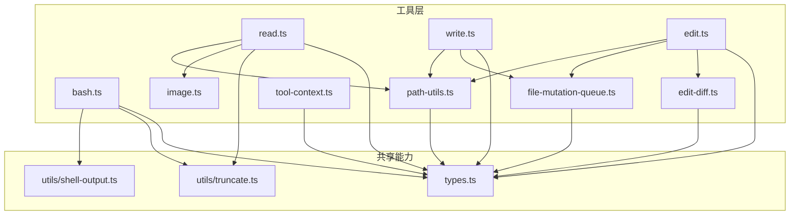
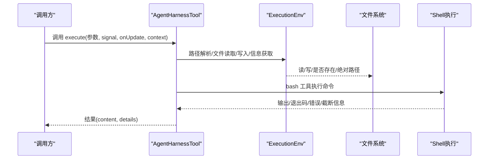
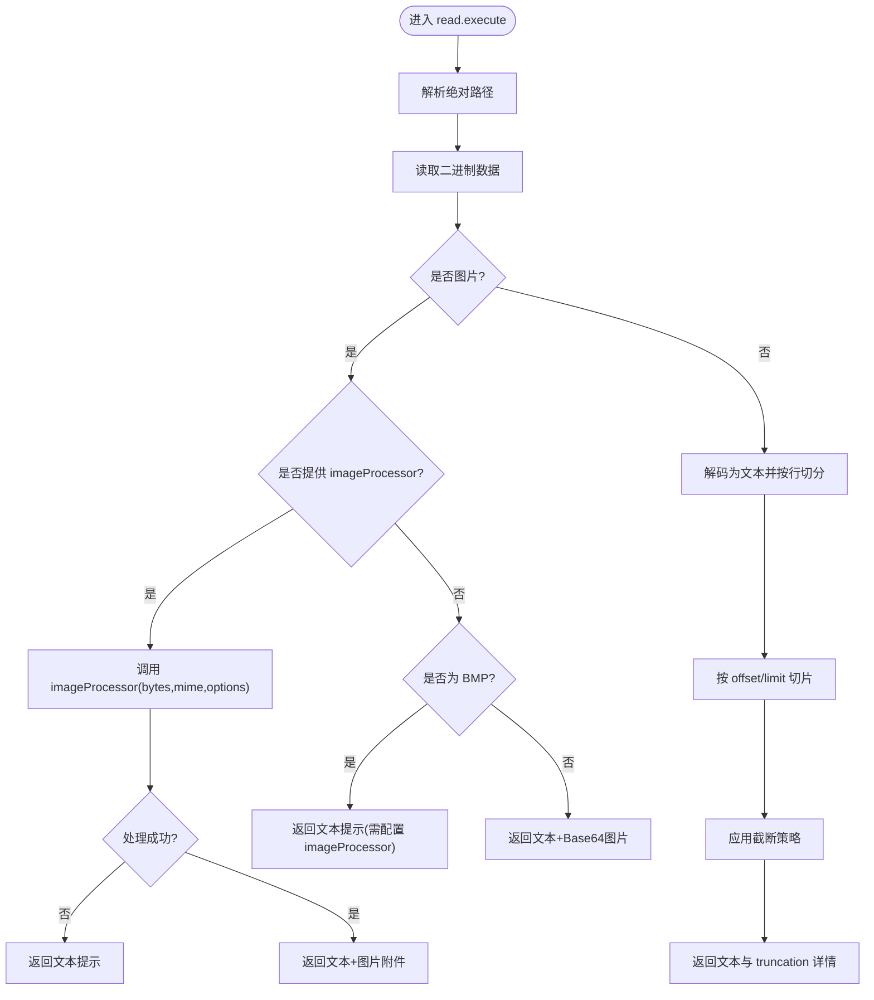
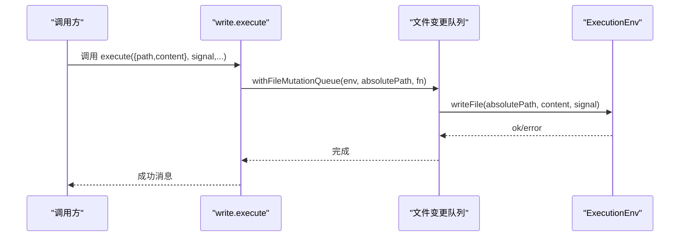
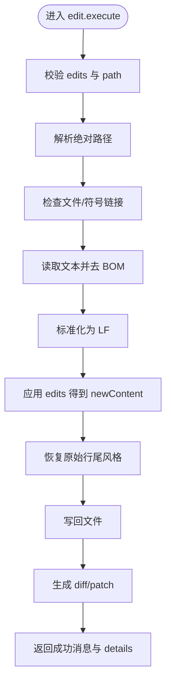
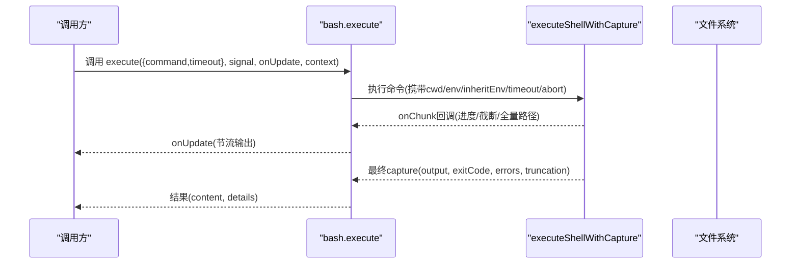
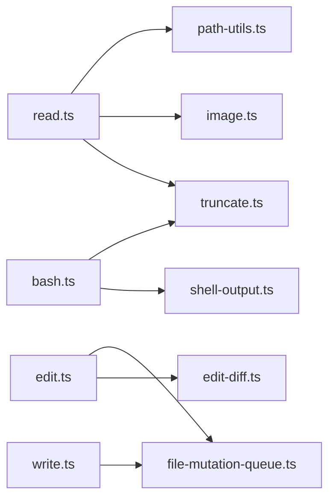

# 内置工具集

<cite>
**本文引用的文件**
- [packages/agent/src/harness/tools/index.ts](file://packages/agent/src/harness/tools/index.ts)
- [packages/agent/src/harness/tools/read.ts](file://packages/agent/src/harness/tools/read.ts)
- [packages/agent/src/harness/tools/write.ts](file://packages/agent/src/harness/tools/write.ts)
- [packages/agent/src/harness/tools/edit.ts](file://packages/agent/src/harness/tools/edit.ts)
- [packages/agent/src/harness/tools/bash.ts](file://packages/agent/src/harness/tools/bash.ts)
- [packages/agent/src/harness/tools/image.ts](file://packages/agent/src/harness/tools/image.ts)
- [packages/agent/src/harness/tools/path-utils.ts](file://packages/agent/src/harness/tools/path-utils.ts)
- [packages/agent/src/harness/tools/tool-context.ts](file://packages/agent/src/harness/tools/tool-context.ts)
- [packages/agent/src/harness/tools/file-mutation-queue.ts](file://packages/agent/src/harness/tools/file-mutation-queue.ts)
- [packages/agent/src/harness/tools/edit-diff.ts](file://packages/agent/src/harness/tools/edit-diff.ts)
- [packages/agent/src/harness/types.ts](file://packages/agent/src/harness/types.ts)
- [packages/agent/src/utils/shell-output.ts](file://packages/agent/src/utils/shell-output.ts)
- [packages/agent/src/utils/truncate.ts](file://packages/agent/src/utils/truncate.ts)
</cite>

## 目录
1. [简介](#简介)
2. [项目结构](#项目结构)
3. [核心组件](#核心组件)
4. [架构总览](#架构总览)
5. [详细组件分析](#详细组件分析)
6. [依赖关系分析](#依赖关系分析)
7. [性能考量](#性能考量)
8. [故障排查指南](#故障排查指南)
9. [结论](#结论)
10. [附录](#附录)

## 简介
本文件为编码代理的“内置工具系统”提供完整、可操作的文档。内容覆盖：
- 文件读写与编辑工具：read、write、edit
- 代码执行工具：bash（可扩展用于 node 等命令）
- 搜索与查找：通过 bash 调用 grep/find
- Git 操作：通过 bash 调用 git
- 网络请求：通过 bash 调用 curl/wget 等
- 安全限制与执行环境说明
- 参数格式、返回值结构、错误处理机制
- 实际工作流示例：代码审查、Bug 修复、测试编写、文档生成
- 工具组合最佳实践与性能优化技巧
- 自定义工具开发接口规范

## 项目结构
内置工具位于 agent harness 的工具目录中，采用“按功能拆分 + 统一导出”的组织方式：
- 工具实现：read、write、edit、bash、image 辅助、路径解析、上下文、文件变更队列、diff 计算
- 统一导出：index.ts 暴露所有工具的创建函数与类型
- 共享能力：shell 输出捕获、截断策略、类型定义等

图表来源
- [packages/agent/src/harness/tools/index.ts:1-24](file://packages/agent/src/harness/tools/index.ts#L1-L24)
- [packages/agent/src/harness/tools/read.ts:1-145](file://packages/agent/src/harness/tools/read.ts#L1-L145)
- [packages/agent/src/harness/tools/write.ts:1-40](file://packages/agent/src/harness/tools/write.ts#L1-L40)
- [packages/agent/src/harness/tools/edit.ts:1-128](file://packages/agent/src/harness/tools/edit.ts#L1-L128)
- [packages/agent/src/harness/tools/bash.ts:1-162](file://packages/agent/src/harness/tools/bash.ts#L1-L162)
- [packages/agent/src/harness/tools/image.ts:1-105](file://packages/agent/src/harness/tools/image.ts#L1-L105)
- [packages/agent/src/harness/tools/path-utils.ts:1-31](file://packages/agent/src/harness/tools/path-utils.ts#L1-L31)
- [packages/agent/src/harness/tools/tool-context.ts:1-7](file://packages/agent/src/harness/tools/tool-context.ts#L1-L7)
- [packages/agent/src/harness/tools/file-mutation-queue.ts](file://packages/agent/src/harness/tools/file-mutation-queue.ts)
- [packages/agent/src/harness/tools/edit-diff.ts](file://packages/agent/src/harness/tools/edit-diff.ts)
- [packages/agent/src/harness/types.ts](file://packages/agent/src/harness/types.ts)
- [packages/agent/src/utils/shell-output.ts](file://packages/agent/src/utils/shell-output.ts)
- [packages/agent/src/utils/truncate.ts](file://packages/agent/src/utils/truncate.ts)

章节来源
- [packages/agent/src/harness/tools/index.ts:1-24](file://packages/agent/src/harness/tools/index.ts#L1-L24)

## 核心组件
- read：读取文本或图片文件，支持分页 offset/limit、自动截断、图片附件返回
- write：写入文本到文件，自动创建父目录，原子化写入（通过文件变更队列）
- edit：精确替换片段，生成 diff/patch，保留行尾风格与 BOM
- bash：执行 shell 命令，支持超时、中断、实时输出节流、截断与全量输出落盘
- image：图片格式检测与 Base64 编码，供 read 使用
- path-utils：路径规范化与存在性探测，兼容 Unicode 空格与字符归一化
- tool-context：工具执行上下文（包含 ExecutionEnv）
- file-mutation-queue：文件写操作的并发控制与互斥
- edit-diff：编辑差异计算、统一补丁生成、行尾恢复

章节来源
- [packages/agent/src/harness/tools/read.ts:1-145](file://packages/agent/src/harness/tools/read.ts#L1-L145)
- [packages/agent/src/harness/tools/write.ts:1-40](file://packages/agent/src/harness/tools/write.ts#L1-L40)
- [packages/agent/src/harness/tools/edit.ts:1-128](file://packages/agent/src/harness/tools/edit.ts#L1-L128)
- [packages/agent/src/harness/tools/bash.ts:1-162](file://packages/agent/src/harness/tools/bash.ts#L1-L162)
- [packages/agent/src/harness/tools/image.ts:1-105](file://packages/agent/src/harness/tools/image.ts#L1-L105)
- [packages/agent/src/harness/tools/path-utils.ts:1-31](file://packages/agent/src/harness/tools/path-utils.ts#L1-L31)
- [packages/agent/src/harness/tools/tool-context.ts:1-7](file://packages/agent/src/harness/tools/tool-context.ts#L1-L7)
- [packages/agent/src/harness/tools/file-mutation-queue.ts](file://packages/agent/src/harness/tools/file-mutation-queue.ts)
- [packages/agent/src/harness/tools/edit-diff.ts](file://packages/agent/src/harness/tools/edit-diff.ts)

## 架构总览
工具以统一的 AgentHarnessTool 形式注册并执行，由上层调度器编排调用。每个工具通过 createXxxTool 工厂函数创建，声明 name、label、description、parameters，并提供 execute 方法。执行时通过 ExecutionToolContext.env 访问文件系统与 Shell 能力。

图表来源
- [packages/agent/src/harness/tools/read.ts:45-145](file://packages/agent/src/harness/tools/read.ts#L45-L145)
- [packages/agent/src/harness/tools/write.ts:15-39](file://packages/agent/src/harness/tools/write.ts#L15-L39)
- [packages/agent/src/harness/tools/edit.ts:77-128](file://packages/agent/src/harness/tools/edit.ts#L77-L128)
- [packages/agent/src/harness/tools/bash.ts:51-162](file://packages/agent/src/harness/tools/bash.ts#L51-L162)
- [packages/agent/src/harness/tools/tool-context.ts:1-7](file://packages/agent/src/harness/tools/tool-context.ts#L1-L7)

## 详细组件分析

### 文件读取工具：read
- 功能：读取文本或图片；文本支持 offset/limit 分页；大文件自动截断；图片以附件形式返回或通过 imageProcessor 转换
- 参数
  - path: 字符串，相对或绝对路径
  - offset: 可选，起始行号（1 基）
  - limit: 可选，最大读取行数
- 返回值
  - content: 文本或图文混合内容
  - details: 可选，包含 truncation 信息（如被截断的行数/字节数）
- 行为要点
  - 图片检测：优先识别 JPEG/PNG/GIF/WebP/BMP；BMP 需配置 imageProcessor
  - 文本截断：超过默认行/字节阈值会提示继续使用 offset 翻页
  - 路径解析：兼容 Unicode 空格与字符归一化变体
- 错误处理
  - 超出文件末尾的 offset 抛出错误
  - 图片处理器失败返回文本提示
- 典型用法
  - 分页阅读大日志：先 read(path, {offset:1, limit:200})，再根据提示继续 offset
  - 读取图片：直接 read(path)，若需要压缩/转码则注入 imageProcessor

图表来源
- [packages/agent/src/harness/tools/read.ts:45-145](file://packages/agent/src/harness/tools/read.ts#L45-L145)
- [packages/agent/src/harness/tools/image.ts:1-105](file://packages/agent/src/harness/tools/image.ts#L1-L105)
- [packages/agent/src/harness/tools/path-utils.ts:12-31](file://packages/agent/src/harness/tools/path-utils.ts#L12-L31)
- [packages/agent/src/utils/truncate.ts](file://packages/agent/src/utils/truncate.ts)

章节来源
- [packages/agent/src/harness/tools/read.ts:1-145](file://packages/agent/src/harness/tools/read.ts#L1-L145)
- [packages/agent/src/harness/tools/image.ts:1-105](file://packages/agent/src/harness/tools/image.ts#L1-L105)
- [packages/agent/src/harness/tools/path-utils.ts:1-31](file://packages/agent/src/harness/tools/path-utils.ts#L1-L31)

### 文件写入工具：write
- 功能：将文本写入文件，不存在则创建，自动创建父目录
- 参数
  - path: 字符串，相对或绝对路径
  - content: 字符串，要写入的内容
- 返回值
  - content: 成功消息（包含写入字节数与目标路径）
  - details: 无
- 行为要点
  - 通过文件变更队列保证同一文件的并发写入互斥
  - 支持 AbortSignal 中断
- 错误处理
  - 底层写入失败抛出错误（含 cause）
  - 中止时抛出“操作已中止”
- 典型用法
  - 生成配置文件/模板文件
  - 批量生成测试桩文件

图表来源
- [packages/agent/src/harness/tools/write.ts:15-39](file://packages/agent/src/harness/tools/write.ts#L15-L39)
- [packages/agent/src/harness/tools/file-mutation-queue.ts](file://packages/agent/src/harness/tools/file-mutation-queue.ts)

章节来源
- [packages/agent/src/harness/tools/write.ts:1-40](file://packages/agent/src/harness/tools/write.ts#L1-L40)

### 文件编辑工具：edit
- 功能：对单个文件进行精确文本替换，支持多段 edits；生成 diff 与 unified patch；保留 BOM 与原始行尾风格
- 参数
  - path: 字符串，相对或绝对路径
  - edits: 数组，每项包含 oldText/newText；要求唯一且不重叠
- 返回值
  - content: 成功消息
  - details: 包含 diff、patch、首次变更行号
- 行为要点
  - 预处理：兼容旧版 oldText/newText 单条替换
  - 校验：edits 至少一项；oldText 必须唯一且不重叠
  - 路径与权限：检查目标为文件或符号链接
  - 内容处理：去 BOM -> 标准化 LF -> 应用编辑 -> 恢复行尾 -> 写回
- 错误处理
  - 文件不可访问/非文件路径/写入失败均抛出错误（附带 FileError）
  - 中止时抛出“操作已中止”
- 典型用法
  - 精准修改函数签名/导入语句
  - 批量替换常量/配置键名

图表来源
- [packages/agent/src/harness/tools/edit.ts:77-128](file://packages/agent/src/harness/tools/edit.ts#L77-L128)
- [packages/agent/src/harness/tools/edit-diff.ts](file://packages/agent/src/harness/tools/edit-diff.ts)

章节来源
- [packages/agent/src/harness/tools/edit.ts:1-128](file://packages/agent/src/harness/tools/edit.ts#L1-L128)

### 命令执行工具：bash
- 功能：在当前工作目录下执行 bash 命令，捕获 stdout/stderr，支持超时、中断、实时输出节流、输出截断与全量落盘
- 参数
  - command: 字符串，要执行的命令
  - timeout: 可选，秒数；必须为正有限数且不超过上限
- 返回值
  - content: 文本输出（可能包含截断提示）
  - details: 可选，包含 truncation 与 fullOutputPath（完整输出路径）
- 行为要点
  - 可通过 options.commandPrefix 在命令前追加前缀
  - 可通过 options.prepare 在执行前调整 cwd/env/inheritEnv 等
  - 输出节流：每 100ms 最多推送一次进度更新
  - 截断：仅保留最后若干行或一定字节数，其余保存到临时文件
- 错误处理
  - 超时：抛出“命令超时”
  - 取消：抛出“命令已中止”
  - 非零退出码：抛出“命令以退出码 X 结束”
  - 其他执行错误：透传 cause
- 典型用法
  - 运行构建/测试脚本
  - 执行 grep/find 搜索
  - 调用 git 进行版本操作
  - 通过 curl/wget 发起网络请求

图表来源
- [packages/agent/src/harness/tools/bash.ts:51-162](file://packages/agent/src/harness/tools/bash.ts#L51-L162)
- [packages/agent/src/utils/shell-output.ts](file://packages/agent/src/utils/shell-output.ts)

章节来源
- [packages/agent/src/harness/tools/bash.ts:1-162](file://packages/agent/src/harness/tools/bash.ts#L1-L162)

### 图片处理辅助：image
- 功能：检测受支持的图片 MIME 类型（JPEG/PNG/GIF/WebP/BMP），并将二进制转为 Base64
- 用途：被 read 工具用于图片识别与内联展示
- 注意：BMP 需外部 imageProcessor 进行转换

章节来源
- [packages/agent/src/harness/tools/image.ts:1-105](file://packages/agent/src/harness/tools/image.ts#L1-L105)

### 路径解析：path-utils
- 功能：规范化路径（去除特殊空格、处理 @ 前缀）、解析绝对路径、针对 read 的路径存在性变体探测（Unicode 空格、NFD 归一化、弯引号）
- 用途：确保跨平台/跨编码环境下路径稳定匹配

章节来源
- [packages/agent/src/harness/tools/path-utils.ts:1-31](file://packages/agent/src/harness/tools/path-utils.ts#L1-L31)

### 上下文与环境：tool-context 与 types
- ExecutionToolContext：提供 env（ExecutionEnv），用于文件系统与 Shell 访问
- ExecutionEnv：抽象了绝对路径、文件读写、存在性检查、文件信息等能力

章节来源
- [packages/agent/src/harness/tools/tool-context.ts:1-7](file://packages/agent/src/harness/tools/tool-context.ts#L1-L7)
- [packages/agent/src/harness/types.ts](file://packages/agent/src/harness/types.ts)

## 依赖关系分析
- 工具间耦合度低，主要通过 ExecutionEnv 与共享工具模块交互
- 关键依赖
  - truncate：统一截断策略与格式化
  - shell-output：统一 Shell 执行与输出捕获
  - edit-diff：编辑差异与补丁生成
  - file-mutation-queue：文件写入互斥
- 潜在循环依赖：无（工具之间不互相 import）
- 外部集成点：ExecutionEnv 的具体实现由宿主环境提供

图表来源
- [packages/agent/src/harness/tools/read.ts:1-145](file://packages/agent/src/harness/tools/read.ts#L1-L145)
- [packages/agent/src/harness/tools/write.ts:1-40](file://packages/agent/src/harness/tools/write.ts#L1-L40)
- [packages/agent/src/harness/tools/edit.ts:1-128](file://packages/agent/src/harness/tools/edit.ts#L1-L128)
- [packages/agent/src/harness/tools/bash.ts:1-162](file://packages/agent/src/harness/tools/bash.ts#L1-L162)
- [packages/agent/src/utils/truncate.ts](file://packages/agent/src/utils/truncate.ts)
- [packages/agent/src/utils/shell-output.ts](file://packages/agent/src/utils/shell-output.ts)

章节来源
- [packages/agent/src/harness/tools/index.ts:1-24](file://packages/agent/src/harness/tools/index.ts#L1-L24)

## 性能考量
- 大文件读取：优先使用 offset/limit 分页；避免一次性加载超大文件
- 输出截断：bash 输出默认只保留尾部若干行/字节，必要时通过 fullOutputPath 下载完整输出
- 节流更新：bash 输出每 100ms 推送一次，避免 UI 抖动
- 写入互斥：write/edit 通过文件变更队列串行化同一文件的写操作，避免竞争
- 图片处理：启用 imageProcessor 时可自动缩放/转码，减少传输体积
- 路径解析：read 支持多种 Unicode 变体，降低因编码导致的重复 IO

[本节为通用指导，无需具体文件引用]

## 故障排查指南
- read
  - 现象：提示“偏移超出文件末尾”
    - 原因：offset 大于文件总行数
    - 处理：减小 offset 或使用 limit 分段读取
  - 现象：图片未显示
    - 原因：BMP 或未配置的 imageProcessor
    - 处理：提供 imageProcessor 或将图片转换为 JPEG/PNG/GIF/WebP
- write
  - 现象：写入失败
    - 原因：权限不足/磁盘空间不足/路径无效
    - 处理：检查权限与路径；确认父目录可创建
- edit
  - 现象：找不到匹配块或报错“edits 无效”
    - 原因：oldText 不唯一/重叠/大小写不一致
    - 处理：合并相邻改动、确保 oldText 唯一且不重叠
  - 现象：行尾风格变化
    - 原因：内部标准化后恢复；确认 originalEnding 正确
- bash
  - 现象：命令超时
    - 原因：timeout 设置过小或命令卡住
    - 处理：增大 timeout 或优化命令；使用 Ctrl+C 中断
  - 现象：输出被截断
    - 原因：默认截断策略
    - 处理：查看 details.fullOutputPath 获取完整输出
  - 现象：非零退出码
    - 原因：命令执行失败
    - 处理：检查命令逻辑与依赖环境

章节来源
- [packages/agent/src/harness/tools/read.ts:97-145](file://packages/agent/src/harness/tools/read.ts#L97-L145)
- [packages/agent/src/harness/tools/write.ts:26-39](file://packages/agent/src/harness/tools/write.ts#L26-L39)
- [packages/agent/src/harness/tools/edit.ts:89-128](file://packages/agent/src/harness/tools/edit.ts#L89-L128)
- [packages/agent/src/harness/tools/bash.ts:108-162](file://packages/agent/src/harness/tools/bash.ts#L108-L162)

## 结论
内置工具集围绕“安全可控的文件与命令执行”设计，提供：
- 稳定的参数与返回结构
- 完善的截断、节流与互斥机制
- 丰富的错误信息与可观测性（details、fullOutputPath）
- 可扩展的图片处理与命令前缀/准备钩子
结合这些工具，可以高效完成代码审查、Bug 修复、测试编写与文档生成等工作流。

[本节为总结性内容，无需具体文件引用]

## 附录

### 工具参数与返回值速查
- read
  - 参数：{ path, offset?, limit? }
  - 返回：content(text|image), details.truncation?
- write
  - 参数：{ path, content }
  - 返回：content(成功消息), details=undefined
- edit
  - 参数：{ path, edits[] }
  - 返回：content(成功消息), details.diff/patch/firstChangedLine
- bash
  - 参数：{ command, timeout? }
  - 返回：content(输出), details.truncation?/fullOutputPath?

章节来源
- [packages/agent/src/harness/tools/read.ts:16-26](file://packages/agent/src/harness/tools/read.ts#L16-L26)
- [packages/agent/src/harness/tools/write.ts:8-13](file://packages/agent/src/harness/tools/write.ts#L8-L13)
- [packages/agent/src/harness/tools/edit.ts:17-46](file://packages/agent/src/harness/tools/edit.ts#L17-L46)
- [packages/agent/src/harness/tools/bash.ts:11-21](file://packages/agent/src/harness/tools/bash.ts#L11-L21)

### 安全限制与执行环境
- 工作目录：bash 默认在 env.cwd 下执行
- 环境变量：默认继承宿主环境；可通过 prepare 定制
- 超时与中断：支持 timeout 与 AbortSignal
- 输出限制：默认截断，防止大输出阻塞
- 文件写入：通过队列串行化，避免并发冲突
- 路径安全：统一解析绝对路径并进行存在性探测

章节来源
- [packages/agent/src/harness/tools/bash.ts:51-68](file://packages/agent/src/harness/tools/bash.ts#L51-L68)
- [packages/agent/src/harness/tools/write.ts:26-39](file://packages/agent/src/harness/tools/write.ts#L26-L39)
- [packages/agent/src/harness/tools/path-utils.ts:12-31](file://packages/agent/src/harness/tools/path-utils.ts#L12-L31)

### 实际工作流示例
- 代码审查
  - 使用 read 分页查看大文件
  - 使用 bash 运行 linter/test
  - 使用 edit 精准修正问题
- Bug 修复
  - 使用 bash 定位问题（grep/find）
  - 使用 edit 修改源码
  - 使用 bash 运行测试验证
- 测试编写
  - 使用 write 生成测试桩
  - 使用 bash 运行测试套件
  - 使用 read 查看测试输出
- 文档生成
  - 使用 bash 调用文档生成工具
  - 使用 write/edit 更新文档
  - 使用 read 预览生成的内容

[本节为概念性示例，无需具体文件引用]

### 工具组合最佳实践
- 先读后改：read 分页确认范围，再用 edit 精准替换
- 小步快跑：多次小 edit 优于单次大 edit
- 输出管理：bash 输出过大时使用 fullOutputPath 下载
- 并发控制：对同一文件连续写操作尽量合并或排队
- 图片优化：配置 imageProcessor 自动缩放/转码

[本节为通用指导，无需具体文件引用]

### 自定义工具开发接口规范
- 工具类型：AgentHarnessTool<TContext, ParametersSchema, DetailsType>
- 必需字段
  - name: 工具名称
  - label: 显示标签
  - description: 工具描述
  - parameters: JSON Schema（TypeBox）
  - execute: (toolCallId, input, signal, onUpdate, context) => Promise<{content, details}>
- 可选字段
  - prepareArguments: 参数预处理（如兼容旧版输入）
- 上下文
  - context.env: ExecutionEnv，提供文件系统与 Shell 能力
- 建议
  - 使用 withFileMutationQueue 保护写操作
  - 使用 truncate 策略限制输出
  - 使用 shell-output 执行命令
  - 明确错误信息，便于调试

章节来源
- [packages/agent/src/harness/tools/index.ts:1-24](file://packages/agent/src/harness/tools/index.ts#L1-L24)
- [packages/agent/src/harness/tools/tool-context.ts:1-7](file://packages/agent/src/harness/tools/tool-context.ts#L1-L7)
- [packages/agent/src/harness/types.ts](file://packages/agent/src/harness/types.ts)