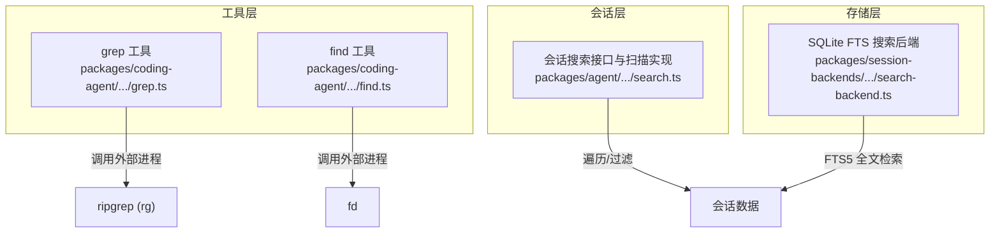
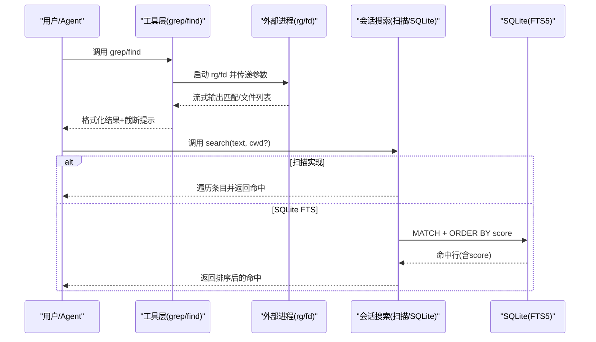
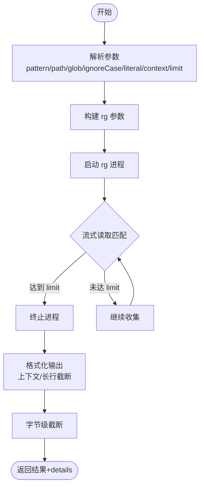
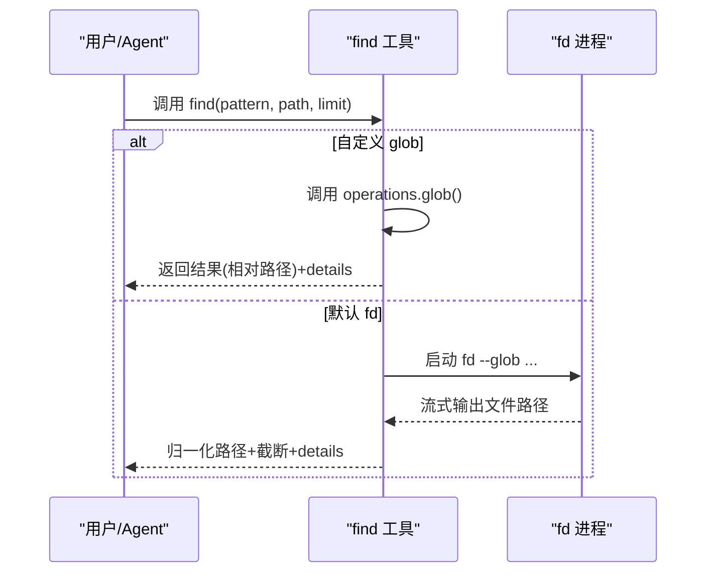
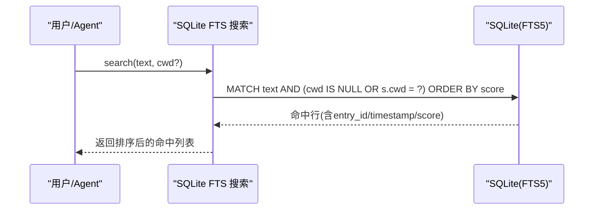
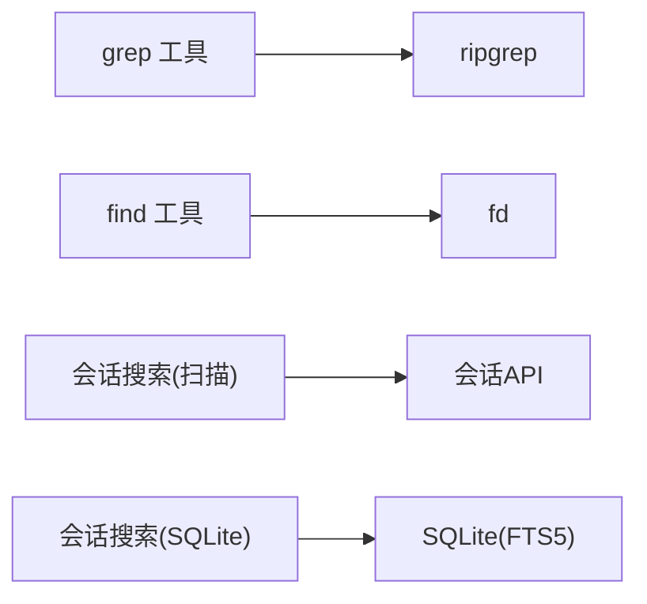

# 搜索工具

<cite>
**本文引用的文件**
- [grep.ts](file://packages/coding-agent/src/core/tools/grep.ts)
- [find.ts](file://packages/coding-agent/src/core/tools/find.ts)
- [search.ts](file://packages/agent/src/harness/session/search.ts)
- [search-backend.ts](file://packages/session-backends/sqlite-node/src/sqlite/search-backend.ts)
</cite>

## 目录
1. [简介](#简介)
2. [项目结构](#项目结构)
3. [核心组件](#核心组件)
4. [架构总览](#架构总览)
5. [详细组件分析](#详细组件分析)
6. [依赖关系分析](#依赖关系分析)
7. [性能与优化](#性能与优化)
8. [故障排查指南](#故障排查指南)
9. [结论](#结论)
10. [附录：常用查询模板与工作流](#附录：常用查询模板与工作流)

## 简介
本文件面向“搜索工具”的完整文档，覆盖以下能力：
- 内容搜索：基于 ripgrep 的 grep 工具，支持正则/字面量、大小写不敏感、上下文行、匹配数限制、输出截断。
- 文件查找：基于 fd 的 find 工具，支持 glob 模式、路径规范化、结果限制与截断。
- 会话检索：提供扫描式与 SQLite FTS 两种实现，用于在历史会话条目中检索文本片段并排序打分。
- 性能与大文件处理：通过外部工具流式读取、匹配计数上限、字节级截断、长行截断等策略保障稳定与高效。
- 使用示例与工作流：定位代码定义、快速定位 Bug、分析依赖关系等高频场景。

## 项目结构
搜索相关代码分布在三个层次：
- 工具层（coding-agent）：对外暴露的 Agent Tool，封装 ripgrep 与 fd 调用，统一参数校验、渲染与截断。
- 会话层（agent harness）：提供通用的 SessionSearch 接口与扫描实现。
- 存储层（session-backends/sqlite-node）：基于 SQLite FTS5 的高性能会话检索后端。

图表来源
- [grep.ts:128-385](file://packages/coding-agent/src/core/tools/grep.ts#L128-L385)
- [find.ts:123-375](file://packages/coding-agent/src/core/tools/find.ts#L123-L375)
- [search.ts:35-71](file://packages/agent/src/harness/session/search.ts#L35-L71)
- [search-backend.ts:62-135](file://packages/session-backends/sqlite-node/src/sqlite/search-backend.ts#L62-L135)

章节来源
- [grep.ts:1-391](file://packages/coding-agent/src/core/tools/grep.ts#L1-L391)
- [find.ts:1-381](file://packages/coding-agent/src/core/tools/find.ts#L1-L381)
- [search.ts:1-72](file://packages/agent/src/harness/session/search.ts#L1-L72)
- [search-backend.ts:1-141](file://packages/session-backends/sqlite-node/src/sqlite/search-backend.ts#L1-L141)

## 核心组件
- grep 工具
  - 功能：按模式搜索文件内容，返回匹配行及上下文；尊重 .gitignore；支持大小写不敏感、字面量模式、上下文行数、匹配数量限制。
  - 关键参数：pattern、path、glob、ignoreCase、literal、context、limit。
  - 输出：相对路径:行号:内容 或 带上下文的块；自动截断超长行与总输出字节。
  - 外部依赖：ripgrep（rg）。
- find 工具
  - 功能：按 glob 模式查找文件；返回相对路径；尊重 .gitignore；支持结果限制与截断。
  - 关键参数：pattern、path、limit。
  - 外部依赖：fd（默认），或通过自定义 operations.glob 替换为远程/替代实现。
- 会话搜索
  - 扫描实现：遍历会话元数据并打开会话，逐条序列化条目进行子串匹配，适合小规模或无索引场景。
  - SQLite FTS 实现：利用 FTS5 对 entries 建立全文索引，支持 BM25 评分与按 cwd 过滤，适合大规模检索。

章节来源
- [grep.ts:24-36, 128-385:24-36](file://packages/coding-agent/src/core/tools/grep.ts#L24-L36)
- [find.ts:29-35, 123-375:29-35](file://packages/coding-agent/src/core/tools/find.ts#L29-L35)
- [search.ts:5-20, 35-71:5-20](file://packages/agent/src/harness/session/search.ts#L5-L20)
- [search-backend.ts:27-31, 62-135:27-31](file://packages/session-backends/sqlite-node/src/sqlite/search-backend.ts#L27-L31)

## 架构总览

图表来源
- [grep.ts:175-368](file://packages/coding-agent/src/core/tools/grep.ts#L175-L368)
- [find.ts:224-353](file://packages/coding-agent/src/core/tools/find.ts#L224-L353)
- [search.ts:42-61](file://packages/agent/src/harness/session/search.ts#L42-L61)
- [search-backend.ts:100-135](file://packages/session-backends/sqlite-node/src/sqlite/search-backend.ts#L100-L135)

## 详细组件分析

### grep 工具
- 输入参数
  - pattern：搜索模式（正则或字面量）
  - path：搜索目录或文件（默认当前目录）
  - glob：按 glob 过滤文件
  - ignoreCase：忽略大小写
  - literal：将 pattern 作为字面量字符串
  - context：匹配行前后显示的行数
  - limit：最大匹配数（默认 100）
- 执行流程
  - 解析参数并构建 rg 命令；根据是否包含路径分隔符决定 full-path 行为（由 find 工具体现，grep 直接传 pattern 与 path）。
  - 以 JSON 模式流式消费 rg 输出，收集 match 事件。
  - 达到 limit 时主动终止子进程，避免不必要开销。
  - 对每行进行长行截断；最终输出进行字节级截断并附加提示信息。
- 输出与细节
  - 返回文本内容与 details：matchLimitReached、truncation、linesTruncated。
  - 渲染器会折叠多余行并在需要时提示展开。
- 错误处理
  - 找不到 rg、路径不存在、子进程异常、被中止等均会抛出明确错误。

图表来源
- [grep.ts:175-368](file://packages/coding-agent/src/core/tools/grep.ts#L175-L368)

章节来源
- [grep.ts:24-36, 128-385:24-36](file://packages/coding-agent/src/core/tools/grep.ts#L24-L36)

### find 工具
- 输入参数
  - pattern：glob 模式（如 *.ts、src/**/*.spec.ts）
  - path：搜索目录（默认当前目录）
  - limit：最大结果数（默认 1000）
- 执行流程
  - 若提供自定义 operations.glob，则直接调用该实现；否则使用 fd。
  - 检测是否在 Git 仓库内，决定是否添加 --no-require-git。
  - 当 pattern 包含路径分隔符时启用 --full-path，并对 Windows 平台进行分隔符兼容处理。
  - 流式收集结果，归一化为相对路径并按 limit 截断。
- 输出与细节
  - 返回文件路径列表与 details：resultLimitReached、truncation。
- 错误处理
  - 找不到 fd、路径不存在、子进程异常、被中止等均有明确错误。

图表来源
- [find.ts:123-375](file://packages/coding-agent/src/core/tools/find.ts#L123-L375)

章节来源
- [find.ts:29-35, 123-375:29-35](file://packages/coding-agent/src/core/tools/find.ts#L29-L35)

### 会话搜索（扫描实现）
- 目标：在不依赖外部索引的情况下，遍历会话元数据并打开会话，逐条检查条目 JSON 是否包含目标文本。
- 特点：简单可靠，适合小数据集；时间复杂度近似 O(N)，N 为条目总数。
- 适用：临时检索、开发调试、无索引环境。

章节来源
- [search.ts:35-71](file://packages/agent/src/harness/session/search.ts#L35-L71)

### 会话搜索（SQLite FTS 实现）
- 目标：通过 FTS5 对 entries 建立全文索引，支持 MATCH 查询与 BM25 评分排序。
- 特性：
  - 自动维护触发器，保证 entries 增删改同步到 FTS。
  - 支持按 cwd 过滤，便于限定工作区范围。
  - 返回 score 字段，便于前端排序展示。
- 适用：大规模会话检索、频繁查询、需要高召回与排序的场景。

图表来源
- [search-backend.ts:100-135](file://packages/session-backends/sqlite-node/src/sqlite/search-backend.ts#L100-L135)

章节来源
- [search-backend.ts:21-60, 100-135:21-60](file://packages/session-backends/sqlite-node/src/sqlite/search-backend.ts#L21-L60)

## 依赖关系分析
- 工具层依赖外部二进制：
  - grep 依赖 ripgrep（rg），用于高性能内容搜索。
  - find 依赖 fd，用于高性能文件查找。
- 会话搜索依赖：
  - 扫描实现仅依赖会话 API。
  - SQLite 实现依赖 SQLite 数据库与 FTS5 扩展。

图表来源
- [grep.ts:175-368](file://packages/coding-agent/src/core/tools/grep.ts#L175-L368)
- [find.ts:224-353](file://packages/coding-agent/src/core/tools/find.ts#L224-L353)
- [search.ts:42-61](file://packages/agent/src/harness/session/search.ts#L42-L61)
- [search-backend.ts:100-135](file://packages/session-backends/sqlite-node/src/sqlite/search-backend.ts#L100-L135)

章节来源
- [grep.ts:175-368](file://packages/coding-agent/src/core/tools/grep.ts#L175-L368)
- [find.ts:224-353](file://packages/coding-agent/src/core/tools/find.ts#L224-L353)
- [search.ts:42-61](file://packages/agent/src/harness/session/search.ts#L42-L61)
- [search-backend.ts:100-135](file://packages/session-backends/sqlite-node/src/sqlite/search-backend.ts#L100-L135)

## 性能与优化
- 流式处理与早停
  - grep 与 find 均通过子进程管道流式读取结果，达到 limit 后立即终止进程，减少 I/O 与 CPU 消耗。
- 输出截断
  - 长行截断：单行过长会被截断，避免 UI 卡顿与内存膨胀。
  - 字节级截断：对最终输出进行整体字节限制，防止超大响应。
- 索引与排序
  - SQLite FTS 使用 FTS5 与 BM25 评分，显著降低全表扫描成本，并提供相关性排序。
- 路径与忽略规则
  - 两者均尊重 .gitignore；find 在 Git 仓库外显式禁用 require-git 以提升兼容性。
- 可插拔后端
  - grep 与 find 均支持自定义 operations，便于迁移至远程系统（如 SSH）或替换底层引擎。

[本节为通用性能建议，无需特定文件引用]

## 故障排查指南
- 找不到外部工具
  - grep：确保 ripgrep（rg）可用；不可用时会报错并提示无法下载。
  - find：确保 fd 可用；不可用时会报错并提示无法下载。
- 路径不存在
  - 传入的 path 必须存在，否则会抛出路径不存在错误。
- 子进程异常
  - 捕获 rg/fd 的错误输出并转换为明确错误信息。
- 操作被中止
  - 支持 AbortSignal，收到中止信号后清理资源并返回中止错误。
- 结果为空
  - grep 返回“未找到匹配”；find 返回“未找到文件”。

章节来源
- [grep.ts:175-368](file://packages/coding-agent/src/core/tools/grep.ts#L175-L368)
- [find.ts:141-361](file://packages/coding-agent/src/core/tools/find.ts#L141-L361)

## 结论
本项目提供了完善且高性能的搜索能力：
- grep 与 find 通过外部工具实现极致性能，并通过流式处理、截断与限制保障稳定性。
- 会话搜索提供扫描与 SQLite FTS 两种方案，兼顾易用性与可扩展性。
- 统一的参数模型、渲染与错误处理机制，使工具易于集成与维护。

[本节为总结性内容，无需特定文件引用]

## 附录：常用查询模板与工作流

- 查找代码定义
  - 使用 grep：以类名/函数名为 pattern，设置 context=3 查看上下文，limit 控制结果规模。
  - 使用 find：以 **/*.ts 或 src/** 等 glob 缩小范围，再配合 grep 精确定位。
- 定位 Bug
  - 使用 grep：搜索错误关键字或堆栈片段，结合 ignoreCase 提升召回。
  - 使用 find：先定位测试文件或日志文件，再用 grep 进一步筛选。
- 分析依赖关系
  - 使用 find：查找 import/require 的目标文件（如 **/index.ts、**/package.json）。
  - 使用 grep：搜索模块名或包名，确认引用位置。
- 高频查询模板
  - 内容搜索：grep(pattern="class Foo", path="src", context=2, limit=50)
  - 文件查找：find(pattern="*.test.ts", path="tests", limit=200)
  - 会话检索：search(text="Error: X", cwd="project-root")

[本节为概念性指导，无需特定文件引用]