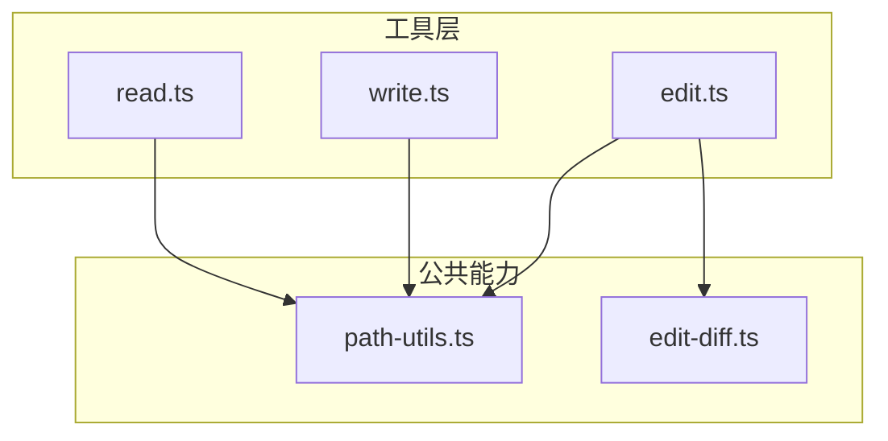
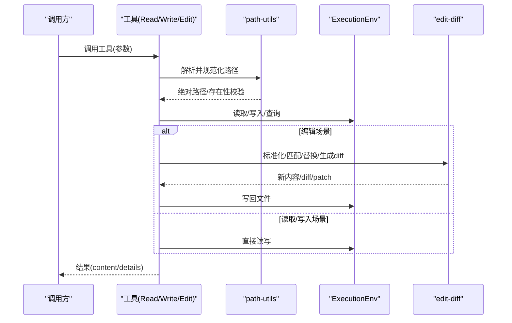
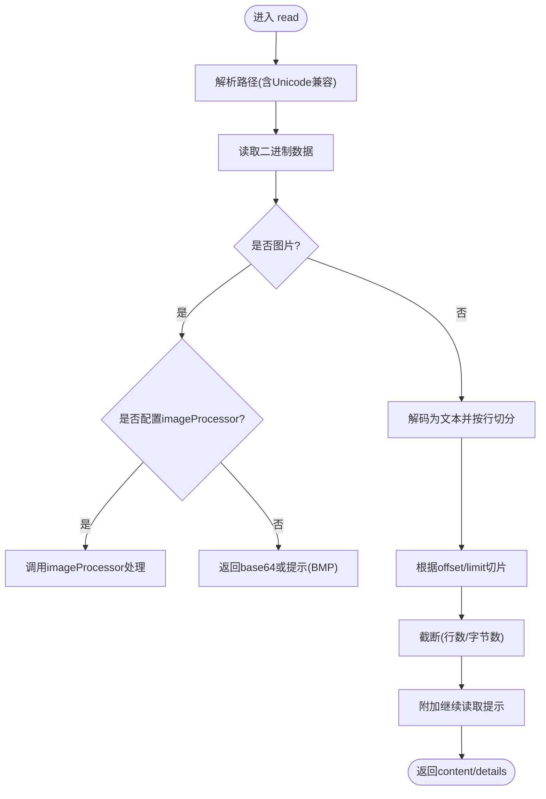
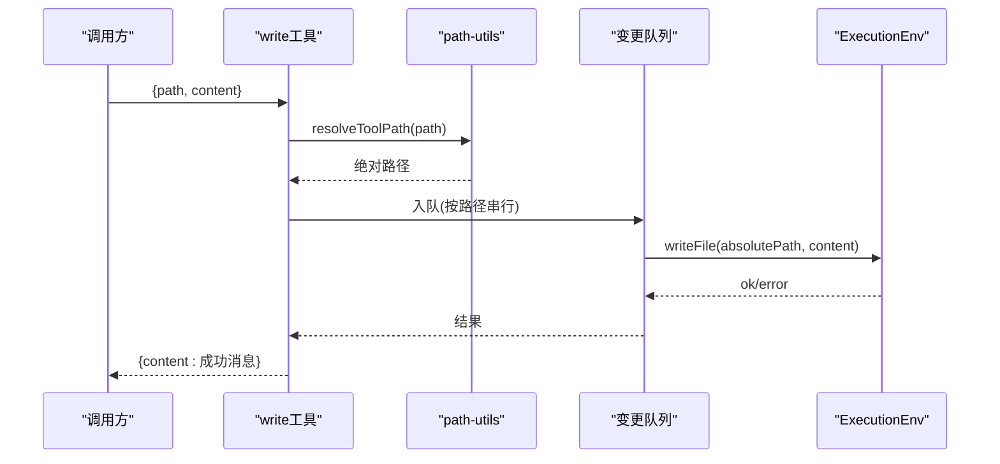
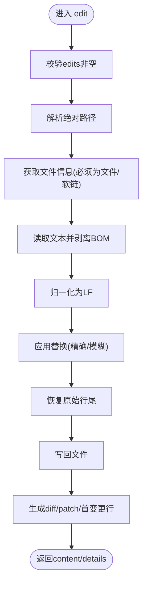
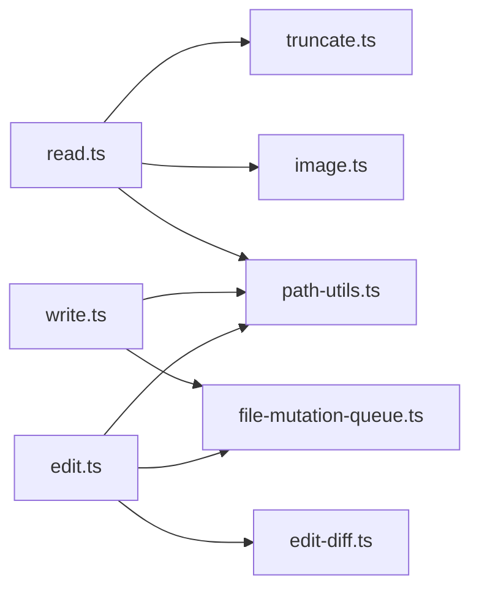

# 文件操作工具

<cite>
**本文引用的文件**
- [packages/agent/src/harness/tools/read.ts](file://packages/agent/src/harness/tools/read.ts)
- [packages/agent/src/harness/tools/write.ts](file://packages/agent/src/harness/tools/write.ts)
- [packages/agent/src/harness/tools/edit.ts](file://packages/agent/src/harness/tools/edit.ts)
- [packages/agent/src/harness/tools/edit-diff.ts](file://packages/agent/src/harness/tools/edit-diff.ts)
- [packages/agent/src/harness/tools/path-utils.ts](file://packages/agent/src/harness/tools/path-utils.ts)
- [packages/agent/src/harness/tools/index.ts](file://packages/agent/src/harness/tools/index.ts)
</cite>

## 目录
1. [简介](#简介)
2. [项目结构](#项目结构)
3. [核心组件](#核心组件)
4. [架构总览](#架构总览)
5. [详细组件分析](#详细组件分析)
6. [依赖关系分析](#依赖关系分析)
7. [性能考量](#性能考量)
8. [故障排查指南](#故障排查指南)
9. [结论](#结论)
10. [附录：使用示例与最佳实践](#附录：使用示例与最佳实践)

## 简介
本文件为“文件操作工具”的完整技术文档，覆盖读取、写入、编辑等核心能力。重点说明 read、write、edit 工具的参数格式、使用方法与返回值结构；解释路径处理规则、编码与换行符支持、权限与错误处理机制；并提供常见工作流示例（读取配置、修改代码、批量操作）与最佳实践建议。

## 项目结构
文件操作工具位于 agent harness 的工具集中，主要包含以下模块：
- read.ts：实现 read 工具，支持文本与图片读取、分页与截断提示。
- write.ts：实现 write 工具，支持创建与覆盖写入，自动创建父目录。
- edit.ts：实现 edit 工具，基于精确或模糊匹配进行文本替换，生成 diff 与 patch。
- edit-diff.ts：提供差异计算、行尾归一化、BOM 处理、模糊匹配与替换等通用算法。
- path-utils.ts：统一路径解析与存在性探测，兼容多种 Unicode 变体。
- index.ts：对外导出工具构造器与类型。

图表来源
- [packages/agent/src/harness/tools/read.ts:1-145](file://packages/agent/src/harness/tools/read.ts#L1-L145)
- [packages/agent/src/harness/tools/write.ts:1-40](file://packages/agent/src/harness/tools/write.ts#L1-L40)
- [packages/agent/src/harness/tools/edit.ts:1-128](file://packages/agent/src/harness/tools/edit.ts#L1-L128)
- [packages/agent/src/harness/tools/edit-diff.ts:1-501](file://packages/agent/src/harness/tools/edit-diff.ts#L1-L501)
- [packages/agent/src/harness/tools/path-utils.ts:1-31](file://packages/agent/src/harness/tools/path-utils.ts#L1-L31)

章节来源
- [packages/agent/src/harness/tools/index.ts:1-24](file://packages/agent/src/harness/tools/index.ts#L1-L24)

## 核心组件
- read 工具：读取文件或图片，支持 offset/limit 分页；对文本内容按行数与字节数限制进行截断并给出继续读取提示；图片可返回 base64 或通过自定义处理器转换。
- write 工具：写入文本到文件，不存在则创建，存在则覆盖；自动创建父目录；通过队列保证并发安全。
- edit 工具：对单文件执行多段精确替换；支持模糊匹配以容忍空白与 Unicode 差异；输出 diff 与 unified patch，并标注首个变更行号。

章节来源
- [packages/agent/src/harness/tools/read.ts:16-145](file://packages/agent/src/harness/tools/read.ts#L16-L145)
- [packages/agent/src/harness/tools/write.ts:8-39](file://packages/agent/src/harness/tools/write.ts#L8-L39)
- [packages/agent/src/harness/tools/edit.ts:17-128](file://packages/agent/src/harness/tools/edit.ts#L17-L128)

## 架构总览
工具通过统一的上下文 env 访问文件系统能力（读/写/绝对路径/存在性等），并通过路径工具与差异工具完成具体逻辑。edit 流程会先标准化内容与行尾，再应用替换，最后恢复原始行尾并持久化。

图表来源
- [packages/agent/src/harness/tools/read.ts:45-145](file://packages/agent/src/harness/tools/read.ts#L45-L145)
- [packages/agent/src/harness/tools/write.ts:15-39](file://packages/agent/src/harness/tools/write.ts#L15-L39)
- [packages/agent/src/harness/tools/edit.ts:77-128](file://packages/agent/src/harness/tools/edit.ts#L77-L128)
- [packages/agent/src/harness/tools/path-utils.ts:7-30](file://packages/agent/src/harness/tools/path-utils.ts#L7-L30)
- [packages/agent/src/harness/tools/edit-diff.ts:7-21](file://packages/agent/src/harness/tools/edit-diff.ts#L7-L21)

## 详细组件分析

### read 工具
- 功能要点
  - 支持文本与图片读取；图片优先识别 MIME 类型，可选择内置 base64 返回或经 imageProcessor 处理。
  - 文本读取支持 offset（从第几行开始，1 起始）与 limit（最多读取的行数）。
  - 自动截断：按默认最大行数与最大字节数限制，并在输出中提示继续使用 offset 翻页。
  - 首行超长时给出专用提示，便于通过 shell 命令精准截取。
- 参数
  - path：字符串，相对或绝对路径。
  - offset：可选，数字，起始行号（1 起始）。
  - limit：可选，数字，最大读取行数。
- 返回值
  - content：文本或图文混合内容数组。
  - details：可选，包含 truncation 信息（是否被截断、原因等）。
- 行为细节
  - 图片：若未配置 imageProcessor，BMP 将仅返回文本提示；其他图片返回 base64。
  - 文本：内部按行分割，结合 truncateHead 控制输出大小；当用户指定 limit 且未读完时，提示剩余行数与下一页 offset。

图表来源
- [packages/agent/src/harness/tools/read.ts:45-145](file://packages/agent/src/harness/tools/read.ts#L45-L145)
- [packages/agent/src/harness/tools/path-utils.ts:12-30](file://packages/agent/src/harness/tools/path-utils.ts#L12-L30)

章节来源
- [packages/agent/src/harness/tools/read.ts:16-145](file://packages/agent/src/harness/tools/read.ts#L16-L145)

### write 工具
- 功能要点
  - 写入文本到文件；不存在则创建，存在则覆盖；自动创建父目录。
  - 通过文件变更队列保证同一文件的并发写入有序。
- 参数
  - path：字符串，相对或绝对路径。
  - content：字符串，要写入的内容。
- 返回值
  - content：成功消息（包含写入字节数与目标路径）。
  - details：无。
- 行为细节
  - 路径解析与存在性检查由 path-utils 负责。
  - 写入失败抛出异常，上层捕获后转为工具错误。

图表来源
- [packages/agent/src/harness/tools/write.ts:15-39](file://packages/agent/src/harness/tools/write.ts#L15-L39)
- [packages/agent/src/harness/tools/path-utils.ts:12-14](file://packages/agent/src/harness/tools/path-utils.ts#L12-L14)

章节来源
- [packages/agent/src/harness/tools/write.ts:8-39](file://packages/agent/src/harness/tools/write.ts#L8-L39)

### edit 工具
- 功能要点
  - 对单文件执行多段精确替换；每个 edits[].oldText 必须在原文件中唯一且不重叠。
  - 支持模糊匹配：在忽略尾部空白、智能引号/破折号/特殊空格等差异的情况下进行匹配，同时尽量保留未改动行的原始字节。
  - 输出 diff 与 unified patch，并返回首个变更行号。
- 参数
  - path：字符串，相对或绝对路径。
  - edits：数组，每项包含 oldText 与 newText。
- 返回值
  - content：成功消息（替换块数量与路径）。
  - details：包含 diff、patch、firstChangedLine。
- 行为细节
  - 读取后剥离 BOM，检测并归一化行尾为 LF，应用替换后再恢复原始行尾。
  - 严格校验：空 oldText、重复匹配、重叠编辑、无变化等情况均会报错。

图表来源
- [packages/agent/src/harness/tools/edit.ts:77-128](file://packages/agent/src/harness/tools/edit.ts#L77-L128)
- [packages/agent/src/harness/tools/edit-diff.ts:7-21](file://packages/agent/src/harness/tools/edit-diff.ts#L7-L21)
- [packages/agent/src/harness/tools/edit-diff.ts:301-363](file://packages/agent/src/harness/tools/edit-diff.ts#L301-L363)

章节来源
- [packages/agent/src/harness/tools/edit.ts:17-128](file://packages/agent/src/harness/tools/edit.ts#L17-L128)
- [packages/agent/src/harness/tools/edit-diff.ts:171-363](file://packages/agent/src/harness/tools/edit-diff.ts#L171-L363)

### 路径处理规则
- 统一规范化：去除不可见空格、移除前导 @ 标记。
- 读取路径兼容：尝试多种 Unicode 等价形式（如窄不换行空格、NFD 规范化、弯引号替换），只要任一存在即视为有效。
- 绝对路径：所有工具最终都转换为绝对路径再进行 IO。

章节来源
- [packages/agent/src/harness/tools/path-utils.ts:7-30](file://packages/agent/src/harness/tools/path-utils.ts#L7-L30)

## 依赖关系分析
- read.ts 依赖 path-utils.ts 进行路径解析；依赖 image.ts 进行图片 MIME 识别与 base64 编码；依赖 truncate.ts 进行内容截断。
- write.ts 依赖 path-utils.ts 与变更队列。
- edit.ts 依赖 edit-diff.ts 进行差异与替换；依赖 path-utils.ts 与变更队列。
- edit-diff.ts 依赖第三方 diff 库进行差异计算。

图表来源
- [packages/agent/src/harness/tools/read.ts:1-15](file://packages/agent/src/harness/tools/read.ts#L1-L15)
- [packages/agent/src/harness/tools/write.ts:1-7](file://packages/agent/src/harness/tools/write.ts#L1-L7)
- [packages/agent/src/harness/tools/edit.ts:1-15](file://packages/agent/src/harness/tools/edit.ts#L1-L15)

章节来源
- [packages/agent/src/harness/tools/index.ts:1-24](file://packages/agent/src/harness/tools/index.ts#L1-L24)

## 性能考量
- 大文件读取：使用 offset/limit 分页读取，避免一次性加载导致内存压力；注意首行超长时的特殊提示。
- 文本截断：按行数与字节数双重限制，减少传输与显示开销。
- 编辑效率：edit 工具在模糊匹配模式下尽量保留未改动行的原始字节，降低不必要的数据重写。
- 并发写入：通过文件变更队列对同一文件进行串行写入，避免竞态条件。

## 故障排查指南
- 路径问题
  - 现象：找不到文件或路径不合法。
  - 排查：确认路径是否已正确解析为绝对路径；读取路径支持多种 Unicode 变体，确保实际文件名一致。
- 权限问题
  - 现象：无法读取/写入/编辑。
  - 排查：检查进程对目标路径的读写权限；必要时提升权限或使用具有足够权限的运行环境。
- 编辑失败
  - 现象：找不到 oldText、重复匹配、重叠编辑、无变化。
  - 排查：确保 oldText 在原文件中唯一且不重叠；如需模糊匹配，请提供足够的上下文；避免空 oldText；确认确实产生了变更。
- 截断与分页
  - 现象：内容被截断或未显示完整。
  - 排查：根据返回的 details 中的 truncation 信息，使用更大的 limit 或调整 offset 继续读取。

章节来源
- [packages/agent/src/harness/tools/edit.ts:66-75](file://packages/agent/src/harness/tools/edit.ts#L66-L75)
- [packages/agent/src/harness/tools/edit-diff.ts:248-363](file://packages/agent/src/harness/tools/edit-diff.ts#L248-L363)
- [packages/agent/src/harness/tools/read.ts:97-141](file://packages/agent/src/harness/tools/read.ts#L97-L141)

## 结论
该文件操作工具集提供了稳定可靠的读、写、编辑能力，具备完善的边界处理与错误反馈。通过路径规范化、行尾与 BOM 处理、模糊匹配与差异输出，能够在复杂环境下保持高可用性与可观测性。配合分页读取与变更队列，适合大规模与并发场景下的自动化文件操作。

## 附录：使用示例与最佳实践

- 读取配置文件
  - 步骤：调用 read，传入配置文件路径；若文件较大，使用 offset/limit 分段读取；若返回截断提示，继续用下一页 offset 读取直至完整。
  - 参考：[packages/agent/src/harness/tools/read.ts:16-145](file://packages/agent/src/harness/tools/read.ts#L16-L145)

- 修改代码文件
  - 步骤：准备 edits 列表，确保每条 oldText 唯一且不重叠；调用 edit；查看返回的 diff/patch 与 firstChangedLine 定位变更。
  - 参考：[packages/agent/src/harness/tools/edit.ts:17-128](file://packages/agent/src/harness/tools/edit.ts#L17-L128)
  - 参考：[packages/agent/src/harness/tools/edit-diff.ts:301-363](file://packages/agent/src/harness/tools/edit-diff.ts#L301-L363)

- 批量文件操作
  - 步骤：遍历目标文件集合，依次调用 read/write/edit；对于同一文件的多轮写入，利用变更队列保证顺序；遇到错误及时记录并跳过或重试。
  - 参考：[packages/agent/src/harness/tools/write.ts:15-39](file://packages/agent/src/harness/tools/write.ts#L15-L39)

- 最佳实践
  - 始终使用相对路径或工作区内的绝对路径，避免跨盘符或系统目录误操作。
  - 编辑前先读取并缓存原内容，以便对比与回滚。
  - 对大文件优先使用分页读取；对长行使用 shell 命令辅助截取。
  - 谨慎使用模糊匹配，仅在确有必要时启用，并确保 oldText 有足够上下文以避免误替换。
  - 关注返回的 details 字段，依据 truncation 与 diff 信息进行后续处理。