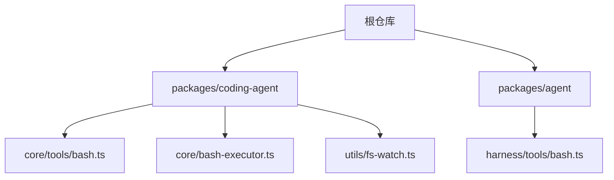
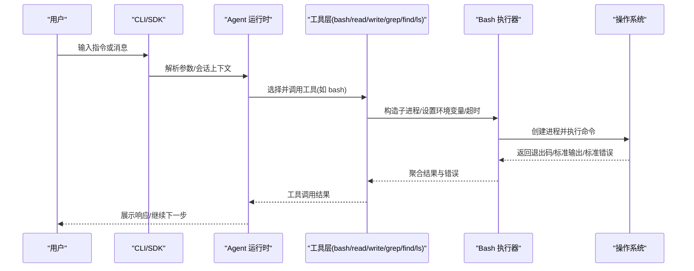
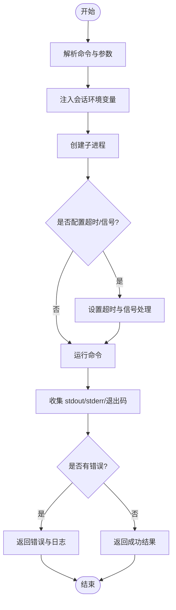
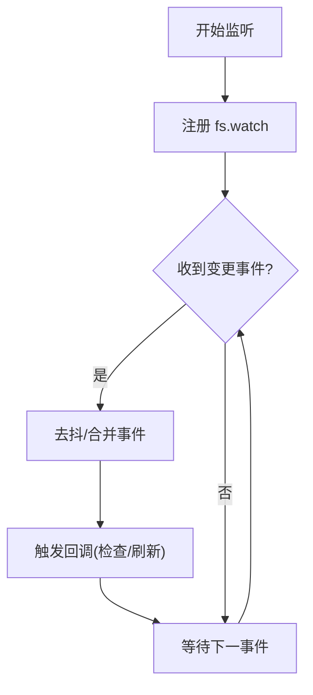
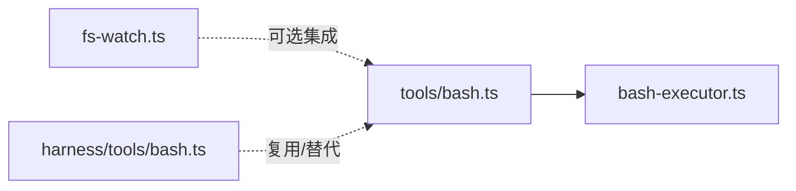

# 系统工具

<cite>
**本文引用的文件**
- [README.md](file://README.md)
- [package.json](file://package.json)
- [packages/coding-agent/README.md](file://packages/coding-agent/README.md)
- [packages/coding-agent/src/core/tools/bash.ts](file://packages/coding-agent/src/core/tools/bash.ts)
- [packages/coding-agent/src/core/bash-executor.ts](file://packages/coding-agent/src/core/bash-executor.ts)
- [packages/coding-agent/src/utils/fs-watch.ts](file://packages/coding-agent/src/utils/fs-watch.ts)
- [packages/agent/src/harness/tools/bash.ts](file://packages/agent/src/harness/tools/bash.ts)
</cite>

## 目录
1. [简介](#简介)
2. [项目结构](#项目结构)
3. [核心组件](#核心组件)
4. [架构总览](#架构总览)
5. [详细组件分析](#详细组件分析)
6. [依赖关系分析](#依赖关系分析)
7. [性能与资源监控](#性能与资源监控)
8. [故障排除指南](#故障排除指南)
9. [结论](#结论)
10. [附录：使用示例与工作流](#附录使用示例与工作流)

## 简介
本文件面向“系统工具”能力，聚焦进程管理、文件系统检查、系统信息获取等系统级功能。该仓库以 Pi Agent Harness 为核心，提供可扩展的 CLI 与运行时，内置工具（如 bash、read、write、edit、grep、find、ls）可用于执行命令、读写文件、搜索与列出目录等。默认情况下，Pi 以启动用户的权限运行，不内置细粒度权限控制；如需更强隔离，可通过容器化或沙箱模式运行。

## 项目结构
- 顶层为 monorepo，包含多个工作区包：agent、ai、client、server、coding-agent、telemetry、tui 等。
- 系统工具主要位于 coding-agent 包的 core 与 utils 中，bash 工具负责进程执行，fs-watch 提供文件系统监听能力。
- agent 包也提供 harness 层的 bash 工具实现，供不同运行时复用。

图表来源
- [package.json:1-20](file://package.json#L1-L20)
- [packages/coding-agent/README.md:578-588](file://packages/coding-agent/README.md#L578-L588)

章节来源
- [package.json:1-20](file://package.json#L1-L20)
- [packages/coding-agent/README.md:578-588](file://packages/coding-agent/README.md#L578-L588)

## 核心组件
- Bash 工具：用于在受控环境中执行 shell 命令，支持输出捕获、超时、环境变量注入（会话元数据）。
- Bash 执行器：封装进程创建、生命周期管理、信号处理、I/O 管道与错误聚合。
- 文件系统监听：基于 fs.watch 的文件变更事件监听，便于构建增量式检查与热更新流程。
- 内置工具集：read、write、edit、grep、find、ls，配合 bash 工具形成完整的系统操作面。

章节来源
- [packages/coding-agent/README.md:578-588](file://packages/coding-agent/README.md#L578-L588)
- [packages/coding-agent/src/core/tools/bash.ts](file://packages/coding-agent/src/core/tools/bash.ts)
- [packages/coding-agent/src/core/bash-executor.ts](file://packages/coding-agent/src/core/bash-executor.ts)
- [packages/coding-agent/src/utils/fs-watch.ts](file://packages/coding-agent/src/utils/fs-watch.ts)
- [packages/agent/src/harness/tools/bash.ts](file://packages/agent/src/harness/tools/bash.ts)

## 架构总览
下图展示了从用户输入到系统工具执行的端到端流程，包括交互式模式、RPC 模式以及工具调用链。

图表来源
- [packages/coding-agent/README.md:514-663](file://packages/coding-agent/README.md#L514-L663)
- [packages/coding-agent/src/core/tools/bash.ts](file://packages/coding-agent/src/core/tools/bash.ts)
- [packages/coding-agent/src/core/bash-executor.ts](file://packages/coding-agent/src/core/bash-executor.ts)

## 详细组件分析

### Bash 工具与执行器（进程管理）
- 职责
  - 接收命令字符串、工作目录、超时、环境变量等参数。
  - 通过执行器创建子进程，绑定 stdin/stdout/stderr，处理信号与超时。
  - 将命令输出、错误与退出码结构化返回给上层。
- 关键行为
  - 注入会话元数据环境变量（如会话 ID、模型、推理级别），便于审计与追踪。
  - 支持限制工具白名单/黑名单，结合 CLI 选项启用或禁用内置工具。
  - 错误路径统一收集 stderr 与异常堆栈，便于诊断。
- 复杂度与性能
  - 进程创建与 I/O 为 O(n) 输入输出处理；超时与信号处理增加常数开销。
  - 在高并发场景下建议限制并行度，避免系统负载过高。

图表来源
- [packages/coding-agent/src/core/tools/bash.ts](file://packages/coding-agent/src/core/tools/bash.ts)
- [packages/coding-agent/src/core/bash-executor.ts](file://packages/coding-agent/src/core/bash-executor.ts)

章节来源
- [packages/coding-agent/src/core/tools/bash.ts](file://packages/coding-agent/src/core/tools/bash.ts)
- [packages/coding-agent/src/core/bash-executor.ts](file://packages/coding-agent/src/core/bash-executor.ts)
- [packages/coding-agent/README.md:665-690](file://packages/coding-agent/README.md#L665-L690)

### 文件系统检查与监听（fs-watch）
- 职责
  - 监听指定路径的文件/目录变化，触发回调以执行增量检查或刷新缓存。
- 典型用法
  - 配合 grep/find/ls 进行变更检测后的快速扫描。
  - 在开发工作流中实现“保存即检查”的自动化。
- 注意事项
  - 不同平台对 fs.watch 的事件语义存在差异，需考虑去抖与重试策略。
  - 大量文件变更时注意节流，避免频繁触发昂贵操作。

图表来源
- [packages/coding-agent/src/utils/fs-watch.ts](file://packages/coding-agent/src/utils/fs-watch.ts)

章节来源
- [packages/coding-agent/src/utils/fs-watch.ts](file://packages/coding-agent/src/utils/fs-watch.ts)

### 内置工具集（read/write/edit/grep/find/ls）
- read/write/edit：用于读取、写入与编辑文件，适合代码生成与文档维护。
- grep/find/ls：用于搜索与列举文件内容/路径/目录，常用于环境诊断与定位问题。
- 组合使用：例如先 ls 发现目标，再用 grep 检索关键字，最后用 read 查看上下文。

章节来源
- [packages/coding-agent/README.md:578-588](file://packages/coding-agent/README.md#L578-L588)

## 依赖关系分析
- 模块耦合
  - tools/bash 依赖 bash-executor 完成进程管理。
  - fs-watch 独立于工具层，可被任意需要文件变更感知的模块复用。
  - agent 包的 harness/tools/bash 提供跨运行时复用的 bash 工具实现。
- 外部依赖
  - Node.js 运行时提供的 child_process、fs 等原生 API。
  - 平台相关行为（Windows/Unix）由底层系统决定。

图表来源
- [packages/coding-agent/src/core/tools/bash.ts](file://packages/coding-agent/src/core/tools/bash.ts)
- [packages/coding-agent/src/core/bash-executor.ts](file://packages/coding-agent/src/core/bash-executor.ts)
- [packages/coding-agent/src/utils/fs-watch.ts](file://packages/coding-agent/src/utils/fs-watch.ts)
- [packages/agent/src/harness/tools/bash.ts](file://packages/agent/src/harness/tools/bash.ts)

章节来源
- [packages/coding-agent/src/core/tools/bash.ts](file://packages/coding-agent/src/core/tools/bash.ts)
- [packages/coding-agent/src/core/bash-executor.ts](file://packages/coding-agent/src/core/bash-executor.ts)
- [packages/coding-agent/src/utils/fs-watch.ts](file://packages/coding-agent/src/utils/fs-watch.ts)
- [packages/agent/src/harness/tools/bash.ts](file://packages/agent/src/harness/tools/bash.ts)

## 性能与资源监控
- 进程执行
  - 合理设置超时与内存限制，避免长时间阻塞或资源泄漏。
  - 对批量命令执行采用队列与并发上限控制。
- 文件监听
  - 对高频变更目录进行去抖与批处理，减少重复计算。
- 指标采集
  - 利用工具调用结果中的耗时、退出码、输出大小等信息，汇总为性能基线。
  - 结合 RPC/JSON 模式导出事件流，便于离线分析与可视化。

[本节为通用指导，不直接分析具体文件]

## 故障排除指南
- 权限与隔离
  - 默认以当前用户权限运行，无内置细粒度权限控制；如需强隔离，请使用容器或沙箱。
- 常见错误
  - 命令超时：检查命令是否挂起或死锁，调整超时参数。
  - 权限不足：确认当前用户对目标路径/命令有执行权限。
  - 平台差异：Windows 与 Unix 的命令与路径分隔符不同，必要时使用跨平台兼容写法。
- 调试技巧
  - 使用 JSON/RPC 模式导出完整事件，便于定位问题。
  - 借助 grep/find/ls 快速定位问题文件与日志位置。

章节来源
- [README.md:38-47](file://README.md#L38-L47)
- [packages/coding-agent/README.md:514-663](file://packages/coding-agent/README.md#L514-L663)

## 结论
本仓库提供了以 bash 工具为核心的系统级能力，结合 read/write/edit/grep/find/ls 等内置工具，可满足进程管理、文件系统检查与系统信息获取等常见需求。通过 CLI 与 SDK 的多模式支持，可在交互、脚本与集成场景中灵活使用。安全方面建议采用容器化/沙箱隔离，并结合工具白名单与环境变量注入实现最小权限原则。

[本节为总结性内容，不直接分析具体文件]

## 附录：使用示例与工作流

### 环境诊断
- 列出目录与查找文件
  - 使用 ls/find 快速定位目标目录与文件。
- 搜索关键字
  - 使用 grep 在日志或配置中检索关键字，结合 read 查看上下文。
- 执行系统命令
  - 使用 bash 工具执行系统命令（如查询磁盘、网络状态），注意设置超时与权限。

章节来源
- [packages/coding-agent/README.md:578-588](file://packages/coding-agent/README.md#L578-L588)
- [packages/coding-agent/README.md:665-690](file://packages/coding-agent/README.md#L665-L690)

### 性能调优
- 限制并发与超时
  - 对批量 bash 任务设置并发上限与超时，避免系统过载。
- 增量检查
  - 使用 fs-watch 监听关键目录，仅在变更时执行检查，降低开销。
- 指标导出
  - 使用 JSON/RPC 模式导出事件，统计工具调用耗时与失败率。

章节来源
- [packages/coding-agent/src/core/bash-executor.ts](file://packages/coding-agent/src/core/bash-executor.ts)
- [packages/coding-agent/src/utils/fs-watch.ts](file://packages/coding-agent/src/utils/fs-watch.ts)
- [packages/coding-agent/README.md:514-663](file://packages/coding-agent/README.md#L514-L663)

### 系统维护
- 备份与清理
  - 使用 read/write/edit 修改配置文件，bash 执行系统维护命令（如清理临时文件）。
- 变更监控
  - 使用 fs-watch 监控关键路径，自动触发维护脚本。
- 安全实践
  - 使用容器化/沙箱隔离执行环境；通过工具白名单限制可用工具。

章节来源
- [README.md:38-47](file://README.md#L38-L47)
- [packages/coding-agent/src/utils/fs-watch.ts](file://packages/coding-agent/src/utils/fs-watch.ts)
- [packages/coding-agent/README.md:578-588](file://packages/coding-agent/README.md#L578-L588)