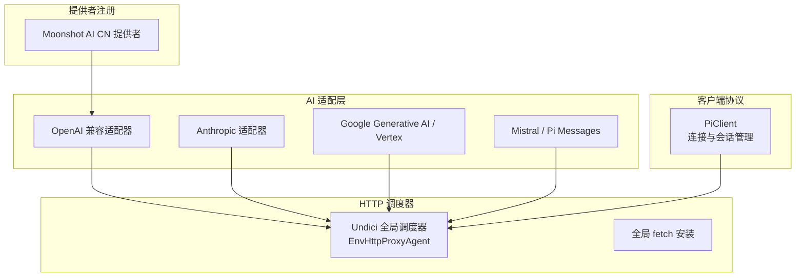
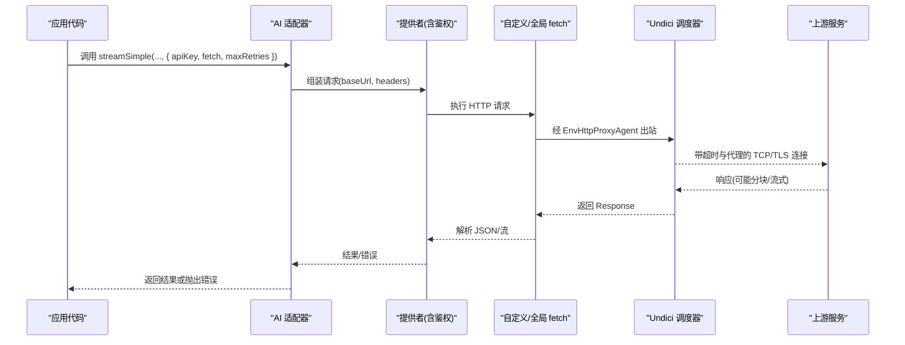
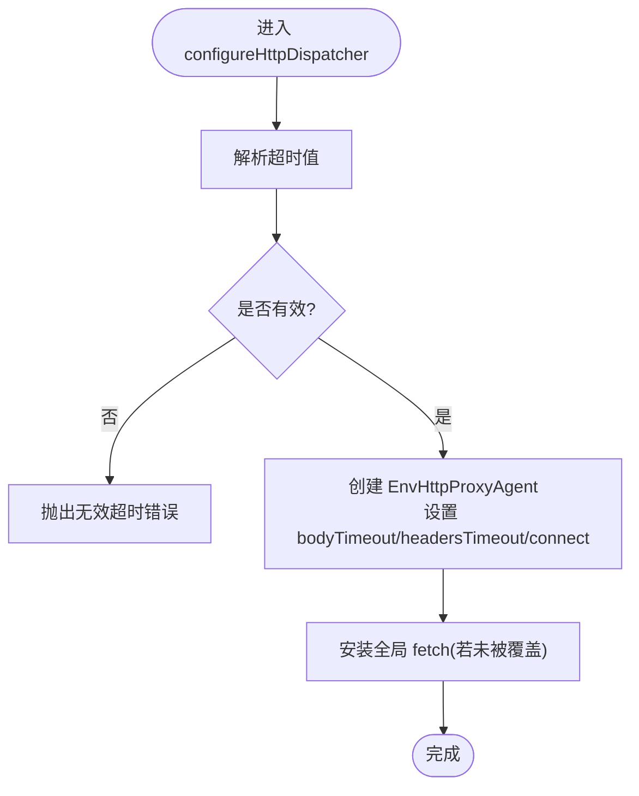
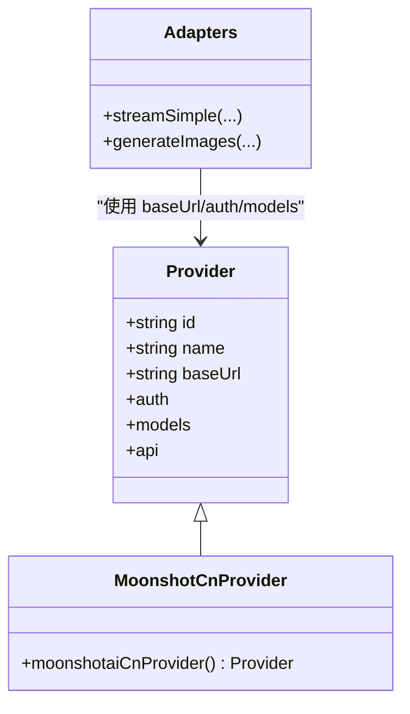
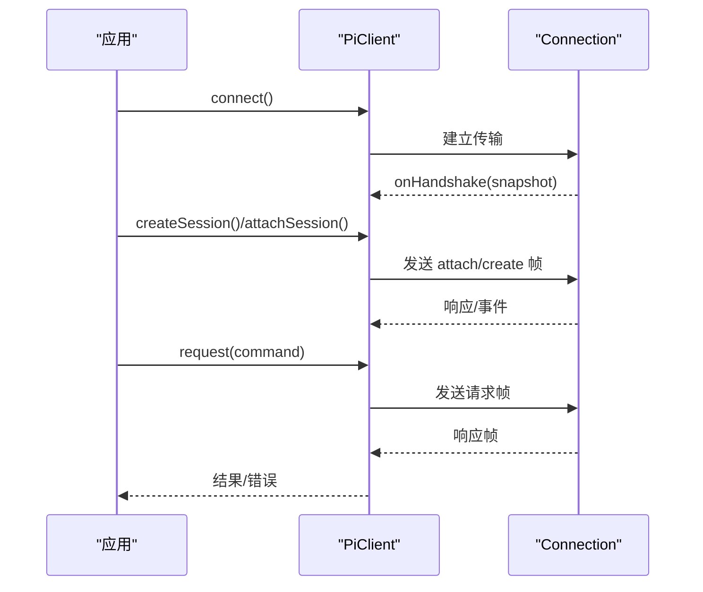
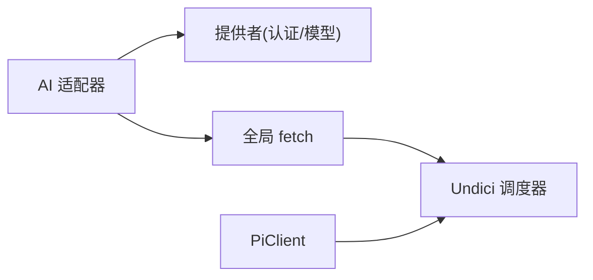

# 网络请求工具

<cite>
**本文引用的文件**
- [http-dispatcher.ts](file://packages/coding-agent/src/core/http-dispatcher.ts)
- [http-dispatcher.test.ts](file://packages/coding-agent/test/http-dispatcher.test.ts)
- [fetch-option.test.ts](file://packages/ai/test/fetch-option.test.ts)
- [client.ts](file://packages/client/src/client.ts)
- [moonshotai-cn.ts](file://packages/ai/src/providers/moonshotai-cn.ts)
</cite>

## 目录
1. [简介](#简介)
2. [项目结构](#项目结构)
3. [核心组件](#核心组件)
4. [架构总览](#架构总览)
5. [详细组件分析](#详细组件分析)
6. [依赖关系分析](#依赖关系分析)
7. [性能考虑](#性能考虑)
8. [故障排查指南](#故障排查指南)
9. [结论](#结论)
10. [附录：使用示例与最佳实践](#附录使用示例与最佳实践)

## 简介
本仓库提供了跨模块的网络请求能力，涵盖 HTTP 客户端配置、代理支持、超时控制、认证注入以及可插拔的 fetch 实现。通过统一的调度器与提供者抽象，上层 API（如 AI 模型调用）可以以一致的方式发起请求、处理流式响应与错误。本文聚焦于以下能力：
- HTTP 请求与 API 调用的统一入口与配置
- 请求头设置与认证方式（API Key 等）
- 超时配置与连接行为
- 重试机制（在适配器层）
- 代理服务器支持与网络安全策略
- 实际工作流示例：调用外部 API、获取远程数据、监控服务状态
- 错误处理与性能优化建议

## 项目结构
与网络请求相关的关键位置：
- 底层 HTTP 调度器：负责全局 undici 调度器安装、代理环境变量注入、超时与连接参数配置
- AI 适配器与提供者：封装不同上游服务的 API 调用，支持自定义 fetch、重试次数等选项
- 客户端协议层：基于连接与消息帧的会话管理，间接依赖底层网络栈进行通信

图表来源
- [http-dispatcher.ts:81-111](file://packages/coding-agent/src/core/http-dispatcher.ts#L81-L111)
- [fetch-option.test.ts:61-179](file://packages/ai/test/fetch-option.test.ts#L61-L179)
- [moonshotai-cn.ts:6-14](file://packages/ai/src/providers/moonshotai-cn.ts#L6-L14)
- [client.ts:96-111](file://packages/client/src/client.ts#L96-L111)

章节来源
- [http-dispatcher.ts:1-112](file://packages/coding-agent/src/core/http-dispatcher.ts#L1-L112)
- [fetch-option.test.ts:1-179](file://packages/ai/test/fetch-option.test.ts#L1-L179)
- [moonshotai-cn.ts:1-15](file://packages/ai/src/providers/moonshotai-cn.ts#L1-L15)
- [client.ts:1-433](file://packages/client/src/client.ts#L1-L433)

## 核心组件
- HTTP 调度器（undici）
  - 提供 EnvHttpProxyAgent 支持代理环境变量
  - 配置 bodyTimeout、headersTimeout 与连接尝试超时
  - 安装全局 fetch 并保留用户覆盖
- 适配器与提供者
  - 各上游 API 适配器通过 streamSimple 或类似接口发起请求
  - 支持传入自定义 fetch 与 maxRetries 等选项
  - 提供者集中声明 baseUrl、auth（apiKey）与模型信息
- 客户端协议
  - 管理连接生命周期、会话租约与事件分发
  - 将高层命令编码为帧并通过连接发送

章节来源
- [http-dispatcher.ts:19-111](file://packages/coding-agent/src/core/http-dispatcher.ts#L19-L111)
- [fetch-option.test.ts:61-179](file://packages/ai/test/fetch-option.test.ts#L61-L179)
- [moonshotai-cn.ts:6-14](file://packages/ai/src/providers/moonshotai-cn.ts#L6-L14)
- [client.ts:96-111](file://packages/client/src/client.ts#L96-L111)

## 架构总览
下图展示了从上层 API 到 HTTP 调度器的调用链，包括认证注入、代理与超时配置、以及可选的重试逻辑。

图表来源
- [fetch-option.test.ts:61-179](file://packages/ai/test/fetch-option.test.ts#L61-L179)
- [http-dispatcher.ts:81-111](file://packages/coding-agent/src/core/http-dispatcher.ts#L81-L111)
- [moonshotai-cn.ts:6-14](file://packages/ai/src/providers/moonshotai-cn.ts#L6-L14)

## 详细组件分析

### HTTP 调度器（undici）
- 代理支持
  - 通过 applyHttpProxySettings 将 httpProxy 写入 HTTP_PROXY/HTTPS_PROXY（不覆盖已有值）
  - 调度器使用 EnvHttpProxyAgent 自动读取这些环境变量
- 超时与连接
  - bodyTimeout、headersTimeout 由配置的 idle timeout 决定
  - autoSelectFamilyAttemptTimeout 设置为 2000ms，避免高延迟路由误杀连接
- 全局 fetch 安装
  - 仅在未被用户覆盖时安装，确保与 dispatcher 一致，避免压缩响应解压问题

图表来源
- [http-dispatcher.ts:81-111](file://packages/coding-agent/src/core/http-dispatcher.ts#L81-L111)

章节来源
- [http-dispatcher.ts:19-111](file://packages/coding-agent/src/core/http-dispatcher.ts#L19-L111)
- [http-dispatcher.test.ts:34-57](file://packages/coding-agent/test/http-dispatcher.test.ts#L34-L57)
- [http-dispatcher.test.ts:92-112](file://packages/coding-agent/test/http-dispatcher.test.ts#L92-L112)

### 适配器与认证（AI 模块）
- 认证方式
  - 提供者通过 envApiKeyAuth 注入 apiKey，例如 Moonshot AI CN 提供者
- 自定义 fetch
  - 测试覆盖了多种适配器（Anthropic、OpenAI、Azure OpenAI、Google、Mistral、Pi Messages、OpenRouter Images），验证自定义 fetch 能正确透传
  - Google 系列适配器对自定义 fetch 有明确限制（不支持则报错），但允许显式传入 globalThis.fetch
- 重试机制
  - 多个适配器支持 maxRetries 选项，用于控制重试次数

图表来源
- [moonshotai-cn.ts:6-14](file://packages/ai/src/providers/moonshotai-cn.ts#L6-L14)
- [fetch-option.test.ts:61-179](file://packages/ai/test/fetch-option.test.ts#L61-L179)

章节来源
- [moonshotai-cn.ts:1-15](file://packages/ai/src/providers/moonshotai-cn.ts#L1-L15)
- [fetch-option.test.ts:1-179](file://packages/ai/test/fetch-option.test.ts#L1-L179)

### 客户端协议（连接与会话）
- 连接管理
  - connect/reconnect/dispose 管理连接生命周期
  - 监听连接状态变化，断开时清理会话与拒绝挂起请求
- 会话租约
  - 支持共享/独占模式，维护租约计数与失效机制
- 消息编解码
  - 将命令编码为帧并通过连接发送，接收响应后匹配请求并回调

图表来源
- [client.ts:96-111](file://packages/client/src/client.ts#L96-L111)
- [client.ts:141-187](file://packages/client/src/client.ts#L141-L187)
- [client.ts:189-207](file://packages/client/src/client.ts#L189-L207)
- [client.ts:294-328](file://packages/client/src/client.ts#L294-L328)

章节来源
- [client.ts:96-111](file://packages/client/src/client.ts#L96-L111)
- [client.ts:141-187](file://packages/client/src/client.ts#L141-L187)
- [client.ts:189-207](file://packages/client/src/client.ts#L189-L207)
- [client.ts:294-328](file://packages/client/src/client.ts#L294-L328)

## 依赖关系分析
- 适配器依赖提供者提供的 baseUrl、auth、models
- 所有 HTTP 出站流量经由全局 undici 调度器，受代理与超时策略约束
- 客户端协议层通过 Connection 与传输交互，最终仍依赖底层网络栈

图表来源
- [fetch-option.test.ts:61-179](file://packages/ai/test/fetch-option.test.ts#L61-L179)
- [http-dispatcher.ts:81-111](file://packages/coding-agent/src/core/http-dispatcher.ts#L81-L111)
- [client.ts:96-111](file://packages/client/src/client.ts#L96-L111)

章节来源
- [fetch-option.test.ts:61-179](file://packages/ai/test/fetch-option.test.ts#L61-L179)
- [http-dispatcher.ts:81-111](file://packages/coding-agent/src/core/http-dispatcher.ts#L81-L111)
- [client.ts:96-111](file://packages/client/src/client.ts#L96-L111)

## 性能考虑
- 连接复用与池化
  - 通过 Pool/Client 工厂创建，减少握手开销
- 超时与空闲连接
  - 合理设置 bodyTimeout 与 headersTimeout，避免长连接过早关闭或资源泄露
- 自动选择地址族尝试超时
  - 提高在高延迟场景下的连接成功率
- 压缩响应处理
  - 保持 fetch 与 dispatcher 一致性，避免解压失败导致响应解析异常
- 重试策略
  - 根据上游稳定性与幂等性设置 maxRetries，避免雪崩

[本节为通用指导，无需特定文件引用]

## 故障排查指南
- 代理相关问题
  - 确认已调用 applyHttpProxySettings 且未覆盖已有环境变量
  - 检查 HTTP_PROXY/HTTPS_PROXY 是否正确设置
- 超时与连接失败
  - 调整 idle timeout；观察是否因默认 250ms 导致连接被终止
  - 关注 autoSelectFamilyAttemptTimeout 是否生效
- 自定义 fetch 未生效
  - 某些适配器（如 Google）不支持自定义 fetch，需改用全局 fetch 或遵循其限制
- 客户端断连
  - 监听连接状态变化，及时释放会话租约并重建连接

章节来源
- [http-dispatcher.test.ts:34-57](file://packages/coding-agent/test/http-dispatcher.test.ts#L34-L57)
- [http-dispatcher.test.ts:92-112](file://packages/coding-agent/test/http-dispatcher.test.ts#L92-L112)
- [fetch-option.test.ts:123-158](file://packages/ai/test/fetch-option.test.ts#L123-L158)
- [client.ts:321-328](file://packages/client/src/client.ts#L321-L328)

## 结论
该网络请求体系通过统一的调度器与适配器抽象，实现了灵活的代理、超时、认证与重试能力。上层 API 可通过最小配置快速接入多种上游服务，同时保持对底层网络的细粒度控制。结合客户端协议层的连接与会话管理，可在复杂场景中保证可靠性与可观测性。

[本节为总结，无需特定文件引用]

## 附录：使用示例与最佳实践

- 调用外部 API（文本生成）
  - 步骤
    - 初始化提供者（包含 baseUrl 与 apiKey 认证）
    - 调用适配器方法，传入自定义 fetch 与 maxRetries
    - 处理流式响应或一次性结果
  - 参考路径
    - [moonshotai-cn.ts:6-14](file://packages/ai/src/providers/moonshotai-cn.ts#L6-L14)
    - [fetch-option.test.ts:61-100](file://packages/ai/test/fetch-option.test.ts#L61-L100)

- 获取远程数据（图片生成）
  - 步骤
    - 使用图像生成适配器，传入 fetch 与重试次数
    - 处理二进制或 URL 返回
  - 参考路径
    - [fetch-option.test.ts:160-177](file://packages/ai/test/fetch-option.test.ts#L160-L177)

- 监控服务状态（SSE/流式）
  - 步骤
    - 使用支持 SSE 的适配器，开启 transport 选项
    - 订阅事件流，记录状态变更
  - 参考路径
    - [fetch-option.test.ts:102-121](file://packages/ai/test/fetch-option.test.ts#L102-L121)

- 请求头设置与认证
  - 通过提供者注入 apiKey；适配器会在请求头中携带必要凭证
  - 参考路径
    - [moonshotai-cn.ts:6-14](file://packages/ai/src/providers/moonshotai-cn.ts#L6-L14)

- 超时配置
  - 使用 configureHttpDispatcher 设置 idle timeout，影响 bodyTimeout 与 headersTimeout
  - 参考路径
    - [http-dispatcher.ts:81-111](file://packages/coding-agent/src/core/http-dispatcher.ts#L81-L111)

- 重试机制
  - 在适配器调用处设置 maxRetries，按上游特性调整
  - 参考路径
    - [fetch-option.test.ts:61-100](file://packages/ai/test/fetch-option.test.ts#L61-L100)

- 代理服务器支持
  - 调用 applyHttpProxySettings 设置代理，或通过环境变量配置
  - 参考路径
    - [http-dispatcher.ts:45-50](file://packages/coding-agent/src/core/http-dispatcher.ts#L45-L50)
    - [http-dispatcher.test.ts:34-57](file://packages/coding-agent/test/http-dispatcher.test.ts#L34-L57)

- 网络安全策略
  - 仅启用必要的 TLS 版本与加密套件（由运行时与上游决定）
  - 谨慎使用自定义 fetch，确保符合安全策略（证书校验、重定向限制等）

[本节为实践指引，无需特定文件引用]