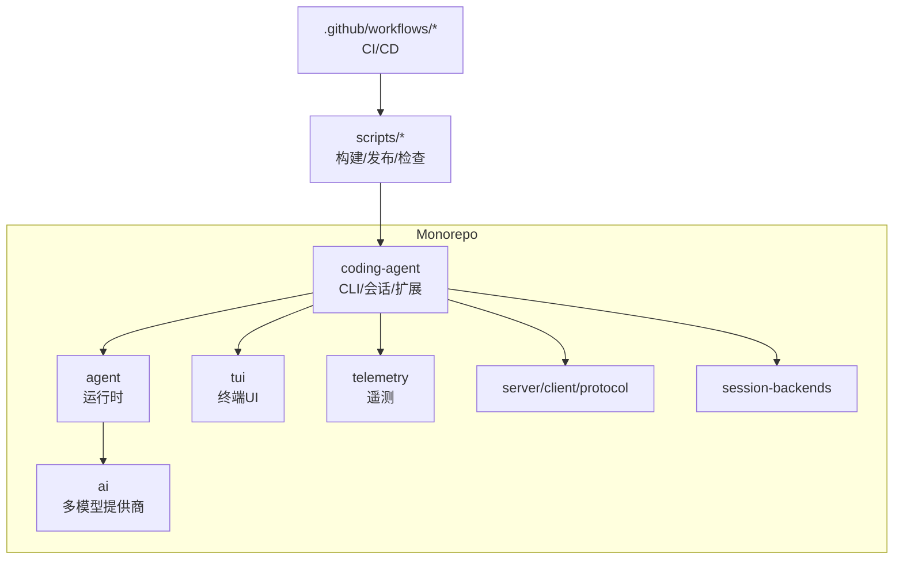
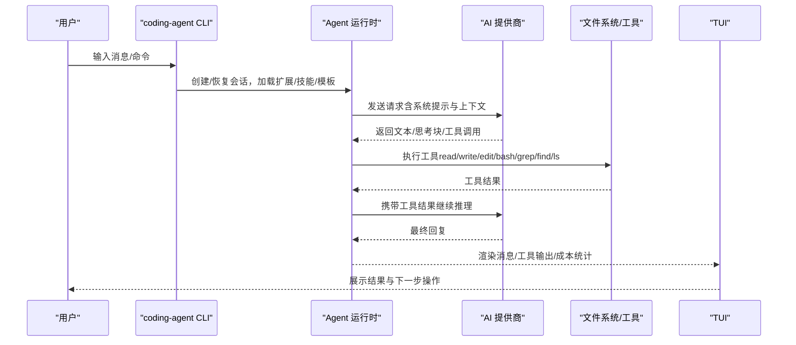
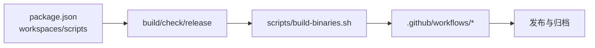

# 工作流与示例

<cite>
**本文引用的文件**
- [README.md](file://README.md)
- [AGENTS.md](file://AGENTS.md)
- [package.json](file://package.json)
- [packages/coding-agent/README.md](file://packages/coding-agent/README.md)
- [scripts/build-binaries.sh](file://scripts/build-binaries.sh)
- [.github/workflows/ci.yml](file://.github/workflows/ci.yml)
- [.github/workflows/build-binaries.yml](file://.github/workflows/build-binaries.yml)
- [.github/workflows/npm-audit.yml](file://.github/workflows/npm-audit.yml)
- [.github/workflows/pr-gate.yml](file://.github/workflows/pr-gate.yml)
</cite>

## 目录
1. [简介](#简介)
2. [项目结构](#项目结构)
3. [核心组件](#核心组件)
4. [架构总览](#架构总览)
5. [详细组件分析](#详细组件分析)
6. [依赖分析](#依赖分析)
7. [性能考虑](#性能考虑)
8. [故障排查指南](#故障排查指南)
9. [结论](#结论)
10. [附录](#附录)

## 简介
本文件面向编码代理（Pi）的使用者与团队，提供一套可落地的实用工作流与示例，覆盖代码审查、Bug 修复、新功能开发、测试用例生成、文档更新等常见任务；并给出多语言（JavaScript、Python、TypeScript、Go）的特定工作流建议。同时介绍如何组合内置工具完成复杂任务、编写批量处理与自动化脚本、进行性能优化、企业级部署与安全策略，以及与 CI/CD、IDE、监控系统的集成方案。

## 项目结构
仓库采用 monorepo 组织，核心包包括：
- coding-agent：交互式 CLI、会话管理、扩展/技能/提示模板/主题体系
- agent：Agent 运行时（工具调用与状态管理）
- ai：统一的多提供商 LLM API
- tui：终端 UI 库
- telemetry：遥测契约与参考实现
- server/client/protocol/session-backends/evals：服务端、客户端、协议、会话后端与评测

顶层 scripts 提供构建、发布、检查与本地化脚本；.github/workflows 提供 CI/CD 流水线。

图表来源
- [package.json:14-49](file://package.json#L14-L49)
- [README.md:26-36](file://README.md#L26-L36)

章节来源
- [README.md:26-36](file://README.md#L26-L36)
- [package.json:14-49](file://package.json#L14-L49)

## 核心组件
- 交互模式与命令：支持 /login、/model、/compact、/export/import、/fork/clone 等，便于会话管理与上下文控制
- 会话与分支：JSONL 树形会话，支持分支、回溯、压缩以节省上下文
- 扩展/技能/提示模板/主题：通过 TypeScript 扩展、Skills、Prompt Templates、Themes 定制能力
- 程序化使用：SDK 与 RPC 模式，便于嵌入应用或与其他进程集成
- 提供商与模型：统一管理多家 LLM 提供商与模型列表，支持订阅与 API Key

章节来源
- [packages/coding-agent/README.md:147-233](file://packages/coding-agent/README.md#L147-L233)
- [packages/coding-agent/README.md:236-280](file://packages/coding-agent/README.md#L236-L280)
- [packages/coding-agent/README.md:320-456](file://packages/coding-agent/README.md#L320-L456)
- [packages/coding-agent/README.md:460-490](file://packages/coding-agent/README.md#L460-L490)
- [packages/coding-agent/README.md:97-143](file://packages/coding-agent/README.md#L97-L143)

## 架构总览
下图展示从用户输入到模型响应与工具调用的端到端流程，以及会话、扩展、提供商之间的协作关系。

图表来源
- [packages/coding-agent/README.md:147-233](file://packages/coding-agent/README.md#L147-L233)
- [packages/coding-agent/README.md:460-490](file://packages/coding-agent/README.md#L460-L490)
- [README.md:26-36](file://README.md#L26-L36)

## 详细组件分析

### 代码审查工作流（Code Review）
目标：对 PR 或分支进行系统化审查，聚焦安全性、性能与可读性。

步骤建议
- 准备上下文
  - 将相关代码文件作为参数传入，或使用 @ 语法引用
  - 指定关注点（如安全、性能、可维护性），可通过提示模板复用
- 运行只读模式
  - 限制工具为 read/grep/find/ls，避免误改
- 生成审查报告
  - 让模型输出结构化问题清单与建议
  - 导出会话为 HTML/JSONL 存档
- 迭代与确认
  - 在交互模式中逐步讨论，必要时用 /compact 压缩历史

关键要点
- 使用只读工具集降低风险
- 利用会话树与分支对比不同版本
- 通过提示模板标准化审查维度

章节来源
- [packages/coding-agent/README.md:578-587](file://packages/coding-agent/README.md#L578-L587)
- [packages/coding-agent/README.md:620-663](file://packages/coding-agent/README.md#L620-L663)
- [packages/coding-agent/README.md:236-280](file://packages/coding-agent/README.md#L236-L280)

### Bug 修复工作流（Bug Fix）
目标：定位根因、最小化改动、回归验证。

步骤建议
- 复现与收集信息
  - 使用 bash 工具执行最小复现命令，捕获日志
  - 使用 grep/find 快速定位可疑范围
- 分析与修改
  - 使用 edit/write 进行小步修改，保持变更最小
  - 结合 /compact 控制上下文长度
- 验证与回归
  - 运行测试套件（按包或单测）
  - 导出会话，记录复现步骤与修复思路
- 提交与说明
  - 遵循仓库提交规范，附复现与修复说明

章节来源
- [AGENTS.md:31-39](file://AGENTS.md#L31-L39)
- [packages/coding-agent/README.md:578-587](file://packages/coding-agent/README.md#L578-L587)
- [packages/coding-agent/README.md:236-280](file://packages/coding-agent/README.md#L236-L280)

### 新功能开发工作流（Feature Development）
目标：从需求到可运行的功能，包含设计、实现、测试与文档。

步骤建议
- 设计与规划
  - 使用提示模板生成设计草案与接口定义
  - 在会话中维护计划与里程碑
- 实现
  - 分模块增量实现，频繁运行 check 与单测
  - 使用 SDK/RPC 模式集成到自有应用或服务
- 测试
  - 编写单元测试与集成测试，确保边界条件
  - 使用 /export 保存测试会话以便复盘
- 文档与发布
  - 更新 README/CHANGELOG，遵循发布流程

章节来源
- [packages/coding-agent/README.md:460-490](file://packages/coding-agent/README.md#L460-L490)
- [AGENTS.md:110-164](file://AGENTS.md#L110-L164)
- [package.json:14-49](file://package.json#L14-L49)

### 测试用例生成（Test Generation）
目标：基于现有代码自动生成高质量测试。

步骤建议
- 选择被测单元与边界场景
- 使用只读工具读取源码与依赖
- 让模型生成测试骨架与断言
- 运行测试并迭代修复失败用例
- 将测试纳入 CI 与覆盖率门禁

章节来源
- [AGENTS.md:31-39](file://AGENTS.md#L31-L39)
- [packages/coding-agent/README.md:578-587](file://packages/coding-agent/README.md#L578-L587)

### 文档更新工作流（Documentation Update）
目标：同步代码变更到文档，保持一致性与可发现性。

步骤建议
- 识别变更影响范围（API、配置、行为）
- 更新对应包的 CHANGELOG 与 README
- 使用提示模板生成变更摘要与迁移指南
- 通过 /export 导出变更记录，便于评审

章节来源
- [AGENTS.md:110-125](file://AGENTS.md#L110-L125)
- [packages/coding-agent/README.md:236-280](file://packages/coding-agent/README.md#L236-L280)

### 多语言特定工作流
- JavaScript/TypeScript
  - 使用 npm 脚本与 tsgo/typecheck 保证类型正确
  - 通过 SDK 集成到 Node 应用或浏览器环境
- Python
  - 通过 bash 工具调用 Python 脚本与虚拟环境
  - 使用 pip 安装依赖，结合 pytest 运行测试
- Go
  - 使用 go build/test 命令，结合 go mod 管理依赖
  - 通过 bash 工具执行构建与测试，产出二进制
- 通用
  - 借助 Skills 与 Extensions 封装语言特定的工具链
  - 使用 RPC 模式与外部进程通信

章节来源
- [packages/coding-agent/README.md:460-490](file://packages/coding-agent/README.md#L460-L490)
- [packages/coding-agent/README.md:578-603](file://packages/coding-agent/README.md#L578-L603)

### 批量处理与自动化脚本
目标：对大量文件或任务进行批处理与编排。

实践建议
- 使用 bash 工具循环处理文件集合
- 结合 grep/find 筛选目标，read 读取内容，write/edit 批量改写
- 将重复流程封装为 Skills 或扩展，统一入口
- 通过 --mode json/rpc 接入 CI 或其他编排器

章节来源
- [packages/coding-agent/README.md:578-603](file://packages/coding-agent/README.md#L578-L603)
- [packages/coding-agent/README.md:460-490](file://packages/coding-agent/README.md#L460-L490)

### 性能优化案例与最佳实践
- 会话压缩：长会话使用 /compact 主动压缩，减少上下文占用
- 模型选择：根据任务复杂度选择合适模型与思考级别
- 工具裁剪：仅启用必要工具，减少开销
- 缓存与离线：合理使用缓存与离线模式，降低网络与解析成本

章节来源
- [packages/coding-agent/README.md:272-280](file://packages/coding-agent/README.md#L272-L280)
- [packages/coding-agent/README.md:555-564](file://packages/coding-agent/README.md#L555-L564)

### 企业级部署与安全策略
- 容器化与沙箱：使用 Docker/OpenShell/Gondolin 隔离执行环境
- 权限最小化：默认无内置权限系统，需自行约束文件系统/进程/网络/凭据访问
- 供应链加固：依赖精确版本锁定、审计与签名检查
- 信任机制：项目信任决策与资源加载控制，避免意外执行

章节来源
- [README.md:38-47](file://README.md#L38-L47)
- [README.md:76-88](file://README.md#L76-L88)
- [packages/coding-agent/README.md:295-317](file://packages/coding-agent/README.md#L295-L317)

### 与 CI/CD、IDE、监控系统集成
- CI/CD
  - 使用 GitHub Actions 构建二进制、运行检查与发布
  - 在 PR Gate 中执行 lint/typecheck/test
  - 使用 npm audit 扫描依赖风险
- IDE
  - 通过 RPC 模式与编辑器插件集成，实现实时对话与工具调用
  - 使用 SDK 嵌入 IDE 内部流程
- 监控
  - 启用遥测与更新检查（可按需关闭）
  - 导出会话用于事后审计与分析

章节来源
- [.github/workflows/ci.yml](file://.github/workflows/ci.yml)
- [.github/workflows/build-binaries.yml](file://.github/workflows/build-binaries.yml)
- [.github/workflows/npm-audit.yml](file://.github/workflows/npm-audit.yml)
- [.github/workflows/pr-gate.yml](file://.github/workflows/pr-gate.yml)
- [packages/coding-agent/README.md:309-317](file://packages/coding-agent/README.md#L309-L317)

## 依赖分析
- Monorepo 工作区：顶层 package.json 声明 workspaces，统一构建与发布脚本
- 构建与检查：biome、tsgo、npm 脚本串联各包构建与校验
- 二进制构建：scripts/build-binaries.sh 负责跨平台编译与打包
- CI/CD：GitHub Actions 流水线驱动构建、审计与发布

图表来源
- [package.json:14-49](file://package.json#L14-L49)
- [scripts/build-binaries.sh:1-285](file://scripts/build-binaries.sh#L1-L285)

章节来源
- [package.json:14-49](file://package.json#L14-L49)
- [scripts/build-binaries.sh:1-285](file://scripts/build-binaries.sh#L1-L285)

## 性能考虑
- 会话压缩与上下文管理：合理设置压缩阈值与指令，避免上下文溢出
- 模型与思考级别：根据任务复杂度选择模型与 thinking level，平衡质量与成本
- 工具集裁剪：按需启用工具，减少不必要的 I/O 与计算
- 缓存与离线：利用缓存策略与离线模式提升稳定性与速度
- 构建与发布：使用离线模型数据与精简依赖，缩短构建时间

章节来源
- [packages/coding-agent/README.md:272-280](file://packages/coding-agent/README.md#L272-L280)
- [packages/coding-agent/README.md:555-564](file://packages/coding-agent/README.md#L555-L564)
- [scripts/build-binaries.sh:136-146](file://scripts/build-binaries.sh#L136-L146)

## 故障排查指南
- 启动与网络
  - 若遇到更新检查或遥测问题，可使用环境变量禁用网络操作
  - 检查代理与密钥配置是否正确
- 会话与上下文
  - 使用 /compact 压缩历史，解决上下文超限
  - 通过 /tree 回溯与分支切换，定位问题起点
- 工具与权限
  - 使用只读工具集进行诊断，避免误改
  - 在容器/沙箱中运行，限制权限与网络
- 构建与发布
  - 使用脚本选项跳过安装/依赖/构建，定位问题阶段
  - 检查锁文件与 shrinkwrap，确保依赖一致

章节来源
- [packages/coding-agent/README.md:309-317](file://packages/coding-agent/README.md#L309-L317)
- [packages/coding-agent/README.md:236-280](file://packages/coding-agent/README.md#L236-L280)
- [scripts/build-binaries.sh:1-285](file://scripts/build-binaries.sh#L1-L285)

## 结论
本工作流文档提供了从日常开发到企业级部署的全链路实践，涵盖代码审查、Bug 修复、新功能开发、测试生成、文档更新、批量处理与自动化、性能优化与安全策略，以及与 CI/CD、IDE、监控系统的集成。借助 Pi 的可扩展性与多模式能力，团队可以灵活定制工作流，提升效率与一致性。

## 附录

### 常用命令速查
- 交互模式与命令：/login、/model、/compact、/export/import、/fork/clone
- 会话管理：--continue、--resume、--session、--fork、--no-session
- 工具集：--tools、--exclude-tools、--no-builtin-tools、--no-tools
- 资源加载：--extension、--skill、--prompt-template、--theme、--no-context-files
- 模型选项：--provider、--model、--api-key、--thinking、--models、--list-models

章节来源
- [packages/coding-agent/README.md:173-204](file://packages/coding-agent/README.md#L173-L204)
- [packages/coding-agent/README.md:514-617](file://packages/coding-agent/README.md#L514-L617)

### 构建与发布参考
- 本地构建与检查：npm run build、npm run check
- 构建独立二进制：scripts/build-binaries.sh
- CI/CD：.github/workflows 中的构建、审计与发布流程

章节来源
- [README.md:52-74](file://README.md#L52-L74)
- [scripts/build-binaries.sh:1-285](file://scripts/build-binaries.sh#L1-L285)
- [.github/workflows/build-binaries.yml](file://.github/workflows/build-binaries.yml)