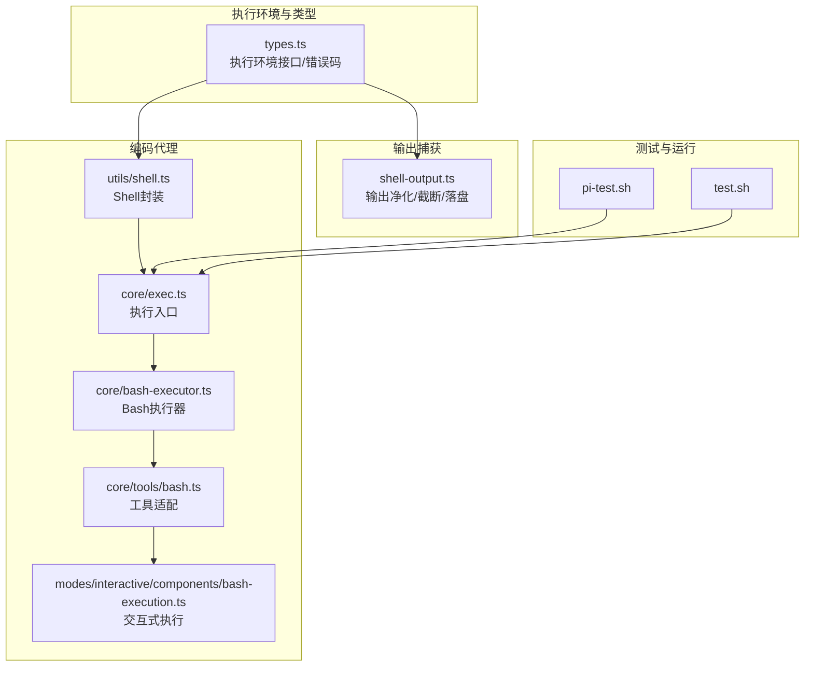
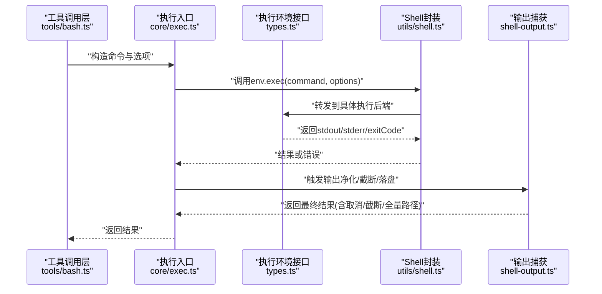
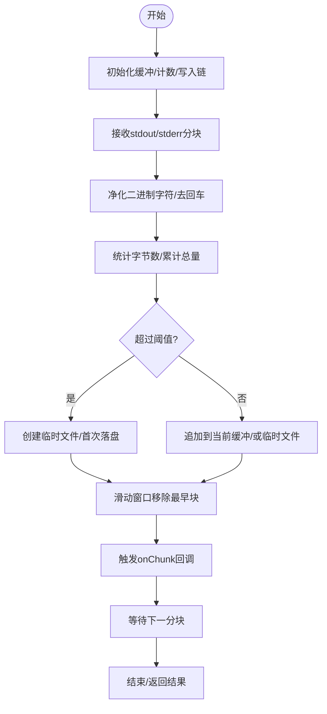
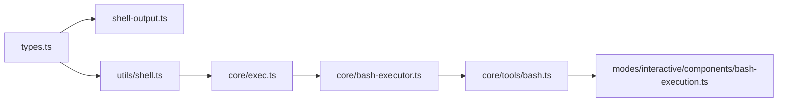

# Shell执行工具

<cite>
**本文引用的文件**
- [packages/agent/src/harness/utils/shell-output.ts](file://packages/agent/src/harness/utils/shell-output.ts)
- [packages/agent/src/harness/types.ts](file://packages/agent/src/harness/types.ts)
- [packages/coding-agent/src/utils/shell.ts](file://packages/coding-agent/src/utils/shell.ts)
- [packages/coding-agent/src/core/exec.ts](file://packages/coding-agent/src/core/exec.ts)
- [packages/coding-agent/src/core/bash-executor.ts](file://packages/coding-agent/src/core/bash-executor.ts)
- [packages/coding-agent/src/core/tools/bash.ts](file://packages/coding-agent/src/core/tools/bash.ts)
- [packages/coding-agent/src/modes/interactive/components/bash-execution.ts](file://packages/coding-agent/src/modes/interactive/components/bash-execution.ts)
- [pi-test.sh](file://pi-test.sh)
- [test.sh](file://test.sh)
</cite>

## 目录
1. [简介](#简介)
2. [项目结构](#项目结构)
3. [核心组件](#核心组件)
4. [架构总览](#架构总览)
5. [详细组件分析](#详细组件分析)
6. [依赖关系分析](#依赖关系分析)
7. [性能考量](#性能考量)
8. [故障排除指南](#故障排除指南)
9. [结论](#结论)
10. [附录](#附录)

## 简介
本文件面向Pi编码代理中的Shell执行工具，系统化阐述其设计与实现：包括命令执行流程、进程管理、输出捕获与截断、错误处理、安全机制（二进制输出净化、可选全量日志落盘）、以及与操作系统和Shell环境的兼容性要求。文档同时提供实际使用场景的示例路径与调试、性能监控、故障排除方法，帮助开发者在保证安全的前提下高效使用Shell工具。

## 项目结构
围绕Shell执行的关键模块主要分布在以下位置：
- 执行环境与类型定义：packages/agent/src/harness/types.ts
- 输出捕获与截断：packages/agent/src/harness/utils/shell-output.ts
- 编码代理侧Shell封装与执行入口：packages/coding-agent/src/utils/shell.ts、packages/coding-agent/src/core/exec.ts
- Bash执行器与交互式执行组件：packages/coding-agent/src/core/bash-executor.ts、packages/coding-agent/src/modes/interactive/components/bash-execution.ts
- 工具调用适配层：packages/coding-agent/src/core/tools/bash.ts
- 测试与运行脚本：pi-test.sh、test.sh

图表来源
- [packages/agent/src/harness/types.ts](file://packages/agent/src/harness/types.ts)
- [packages/agent/src/harness/utils/shell-output.ts](file://packages/agent/src/harness/utils/shell-output.ts)
- [packages/coding-agent/src/utils/shell.ts](file://packages/coding-agent/src/utils/shell.ts)
- [packages/coding-agent/src/core/exec.ts](file://packages/coding-agent/src/core/exec.ts)
- [packages/coding-agent/src/core/bash-executor.ts](file://packages/coding-agent/src/core/bash-executor.ts)
- [packages/coding-agent/src/core/tools/bash.ts](file://packages/coding-agent/src/core/tools/bash.ts)
- [packages/coding-agent/src/modes/interactive/components/bash-execution.ts](file://packages/coding-agent/src/modes/interactive/components/bash-execution.ts)
- [pi-test.sh](file://pi-test.sh)
- [test.sh](file://test.sh)

章节来源
- [packages/agent/src/harness/types.ts](file://packages/agent/src/harness/types.ts)
- [packages/agent/src/harness/utils/shell-output.ts](file://packages/agent/src/harness/utils/shell-output.ts)
- [packages/coding-agent/src/utils/shell.ts](file://packages/coding-agent/src/utils/shell.ts)
- [packages/coding-agent/src/core/exec.ts](file://packages/coding-agent/src/core/exec.ts)
- [packages/coding-agent/src/core/bash-executor.ts](file://packages/coding-agent/src/core/bash-executor.ts)
- [packages/coding-agent/src/core/tools/bash.ts](file://packages/coding-agent/src/core/tools/bash.ts)
- [packages/coding-agent/src/modes/interactive/components/bash-execution.ts](file://packages/coding-agent/src/modes/interactive/components/bash-execution.ts)
- [pi-test.sh](file://pi-test.sh)
- [test.sh](file://test.sh)

## 核心组件
- 执行环境与错误模型
  - 定义了统一的执行环境接口、执行选项、错误码与错误类型，确保跨平台一致的错误语义与可中断能力。
- 输出捕获与截断
  - 提供二进制输出净化、流式分块回调、内存窗口滑动、超阈值落盘到临时文件、尾部截断等能力，兼顾性能与可观测性。
- Shell封装与执行入口
  - 在编码代理侧对执行环境进行封装与调用，暴露统一的执行接口，并支持工作目录、环境变量覆盖、超时与中止信号。
- Bash执行器与交互式组件
  - 将工具调用与交互式执行解耦，便于在不同模式下复用执行逻辑。
- 测试与运行脚本
  - 提供无API密钥运行、参数透传、测试清理等辅助能力，保障开发与CI稳定性。

章节来源
- [packages/agent/src/harness/types.ts](file://packages/agent/src/harness/types.ts)
- [packages/agent/src/harness/utils/shell-output.ts](file://packages/agent/src/harness/utils/shell-output.ts)
- [packages/coding-agent/src/utils/shell.ts](file://packages/coding-agent/src/utils/shell.ts)
- [packages/coding-agent/src/core/exec.ts](file://packages/coding-agent/src/core/exec.ts)
- [packages/coding-agent/src/core/bash-executor.ts](file://packages/coding-agent/src/core/bash-executor.ts)
- [packages/coding-agent/src/core/tools/bash.ts](file://packages/coding-agent/src/core/tools/bash.ts)
- [packages/coding-agent/src/modes/interactive/components/bash-execution.ts](file://packages/coding-agent/src/modes/interactive/components/bash-execution.ts)
- [pi-test.sh](file://pi-test.sh)
- [test.sh](file://test.sh)

## 架构总览
下图展示了从工具调用到命令执行、输出捕获与落盘的端到端流程：

图表来源
- [packages/coding-agent/src/core/tools/bash.ts](file://packages/coding-agent/src/core/tools/bash.ts)
- [packages/coding-agent/src/core/exec.ts](file://packages/coding-agent/src/core/exec.ts)
- [packages/agent/src/harness/types.ts](file://packages/agent/src/harness/types.ts)
- [packages/coding-agent/src/utils/shell.ts](file://packages/coding-agent/src/utils/shell.ts)
- [packages/agent/src/harness/utils/shell-output.ts](file://packages/agent/src/harness/utils/shell-output.ts)

## 详细组件分析

### 组件A：输出捕获与截断（shell-output.ts）
- 功能要点
  - 二进制输出净化：过滤不可见字符与保留必要的控制字符，避免污染日志。
  - 流式分块：逐块处理stdout/stderr，实时更新内存窗口与字节计数。
  - 内存窗口滑动：超过最大缓冲阈值时，移除最早块以维持内存上限。
  - 超阈值落盘：当总字节数超过阈值且尚未落盘时，创建临时文件并顺序追加。
  - 尾部截断：对最终输出进行尾部截断，确保单次结果可控。
  - 取消与错误：支持AbortSignal取消、写入链路错误聚合与统一转换为执行错误。
- 关键数据结构
  - ShellCaptureOptions：扩展执行选项，新增分块回调与可选全量输出路径。
  - ShellCaptureResult：输出文本、退出码、是否取消、是否截断、可选全量日志路径。
- 复杂度与性能
  - 时间复杂度：O(n)，n为输出长度；分块处理与滑动窗口均摊O(1)。
  - 空间复杂度：受内存窗口与阈值控制，落盘后内存峰值下降。
- 错误处理
  - 统一转换未知异常为执行错误；写入失败与捕获异常分别记录并返回。

图表来源
- [packages/agent/src/harness/utils/shell-output.ts](file://packages/agent/src/harness/utils/shell-output.ts)

章节来源
- [packages/agent/src/harness/utils/shell-output.ts](file://packages/agent/src/harness/utils/shell-output.ts)

### 组件B：执行环境与错误模型（types.ts）
- 功能要点
  - 统一的执行环境接口：cwd、exec、文件系统能力、清理接口。
  - 执行选项：cwd、env覆盖、timeout、AbortSignal、stdout/stderr回调。
  - 错误码：aborted、timeout、shell_unavailable、spawn_error、callback_error、unknown。
  - 结果类型：Result<TValue, TError>与ok/err辅助函数，确保非抛出式错误传播。
- 安全与健壮性
  - 所有操作返回Result，避免异常穿透；错误码稳定，便于上层策略处理。
  - 支持AbortSignal，允许外部取消执行。

章节来源
- [packages/agent/src/harness/types.ts](file://packages/agent/src/harness/types.ts)

### 组件C：Shell封装与执行入口（utils/shell.ts、core/exec.ts）
- 功能要点
  - Shell封装：在编码代理侧对执行环境进行适配与调用，屏蔽底层差异。
  - 执行入口：统一接收命令字符串与选项，调用env.exec并处理返回。
  - 与输出捕获协作：通过回调将stdout/stderr交由输出捕获模块处理。
- 使用建议
  - 明确cwd与env覆盖，避免污染全局环境。
  - 合理设置timeout与AbortSignal，防止长时间阻塞。

章节来源
- [packages/coding-agent/src/utils/shell.ts](file://packages/coding-agent/src/utils/shell.ts)
- [packages/coding-agent/src/core/exec.ts](file://packages/coding-agent/src/core/exec.ts)

### 组件D：Bash执行器与交互式组件（bash-executor.ts、bash-execution.ts）
- 功能要点
  - Bash执行器：负责具体Bash命令的启动、参数拼接、环境注入与结果汇总。
  - 交互式执行：在交互模式下渲染输出、处理用户输入与取消信号。
- 集成方式
  - 通过工具适配层调用执行器，再由执行入口完成统一处理。

章节来源
- [packages/coding-agent/src/core/bash-executor.ts](file://packages/coding-agent/src/core/bash-executor.ts)
- [packages/coding-agent/src/modes/interactive/components/bash-execution.ts](file://packages/coding-agent/src/modes/interactive/components/bash-execution.ts)

### 组件E：工具调用适配（tools/bash.ts）
- 功能要点
  - 将工具调用输入标准化为命令字符串与执行选项。
  - 与执行入口对接，统一错误与结果格式。
- 兼容性
  - 通过env覆盖与cwd设置，适配不同工作空间与权限需求。

章节来源
- [packages/coding-agent/src/core/tools/bash.ts](file://packages/coding-agent/src/core/tools/bash.ts)

## 依赖关系分析
- 模块耦合
  - shell-output.ts依赖types.ts中的错误模型与结果类型。
  - utils/shell.ts与core/exec.ts共同构成执行入口，向上游工具层提供统一接口。
  - bash-executor.ts与bash-execution.ts依赖工具层与执行入口。
- 外部依赖
  - 通过AbortSignal与超时配置，实现跨平台的取消与超时控制。
  - 通过临时文件落盘，缓解大输出带来的内存压力。

图表来源
- [packages/agent/src/harness/types.ts](file://packages/agent/src/harness/types.ts)
- [packages/agent/src/harness/utils/shell-output.ts](file://packages/agent/src/harness/utils/shell-output.ts)
- [packages/coding-agent/src/utils/shell.ts](file://packages/coding-agent/src/utils/shell.ts)
- [packages/coding-agent/src/core/exec.ts](file://packages/coding-agent/src/core/exec.ts)
- [packages/coding-agent/src/core/bash-executor.ts](file://packages/coding-agent/src/core/bash-executor.ts)
- [packages/coding-agent/src/core/tools/bash.ts](file://packages/coding-agent/src/core/tools/bash.ts)
- [packages/coding-agent/src/modes/interactive/components/bash-execution.ts](file://packages/coding-agent/src/modes/interactive/components/bash-execution.ts)

章节来源
- [packages/agent/src/harness/types.ts](file://packages/agent/src/harness/types.ts)
- [packages/agent/src/harness/utils/shell-output.ts](file://packages/agent/src/harness/utils/shell-output.ts)
- [packages/coding-agent/src/utils/shell.ts](file://packages/coding-agent/src/utils/shell.ts)
- [packages/coding-agent/src/core/exec.ts](file://packages/coding-agent/src/core/exec.ts)
- [packages/coding-agent/src/core/bash-executor.ts](file://packages/coding-agent/src/core/bash-executor.ts)
- [packages/coding-agent/src/core/tools/bash.ts](file://packages/coding-agent/src/core/tools/bash.ts)
- [packages/coding-agent/src/modes/interactive/components/bash-execution.ts](file://packages/coding-agent/src/modes/interactive/components/bash-execution.ts)

## 性能考量
- 输出处理
  - 分块净化与滑动窗口降低峰值内存占用；超阈值落盘避免OOM风险。
  - 尾部截断确保单次结果大小可控，适合后续展示与存储。
- 执行控制
  - 合理设置timeout与AbortSignal，避免长时间阻塞与僵尸进程。
  - 通过env覆盖最小化环境变量数量，减少启动开销。
- I/O优化
  - 优先使用内存缓冲，仅在必要时落盘；写入链路串行化以保证一致性。

## 故障排除指南
- 常见问题与定位
  - 命令未执行或立即退出：检查cwd与env覆盖是否正确；确认shell可用性与权限。
  - 输出缺失或乱码：检查二进制净化逻辑与编码器使用；确认stdout/stderr回调是否被正确传递。
  - 大输出导致内存飙升：确认阈值配置与落盘逻辑是否生效；检查写入链路错误。
  - 执行被取消：检查AbortSignal状态；确认上层取消时机。
- 调试技巧
  - 开启全量日志：利用临时文件路径查看完整输出，便于定位问题。
  - 分步验证：先在独立环境中验证命令与环境变量，再集成到工具链。
  - 使用测试脚本：参考pi-test.sh与test.sh的无密钥运行方式，隔离外部依赖干扰。
- 性能监控
  - 记录执行耗时、输出字节数、落盘次数与取消比例，用于评估与优化。

章节来源
- [packages/agent/src/harness/utils/shell-output.ts](file://packages/agent/src/harness/utils/shell-output.ts)
- [packages/agent/src/harness/types.ts](file://packages/agent/src/harness/types.ts)
- [pi-test.sh](file://pi-test.sh)
- [test.sh](file://test.sh)

## 结论
Pi编码代理的Shell执行工具通过统一的执行环境接口、稳健的错误模型与高效的输出捕获机制，实现了在安全与性能之间平衡的命令执行方案。结合落盘与截断策略、AbortSignal与超时控制，能够在复杂场景下保持稳定与可观测性。建议在生产使用中明确cwd与env覆盖、合理设置超时与缓冲阈值，并通过测试脚本与全量日志进行持续验证。

## 附录

### 实际使用示例（路径指引）
- 管道操作
  - 在工具调用层构造包含管道的命令字符串，交由执行入口与Shell封装处理。
  - 参考路径：[packages/coding-agent/src/core/tools/bash.ts](file://packages/coding-agent/src/core/tools/bash.ts)
- 环境变量设置
  - 通过env选项覆盖特定变量，避免全局污染。
  - 参考路径：[packages/agent/src/harness/types.ts](file://packages/agent/src/harness/types.ts)
- 权限控制
  - 在执行前校验工作目录与文件系统权限；必要时通过临时文件落盘规避直接写入受限目录。
  - 参考路径：[packages/agent/src/harness/types.ts](file://packages/agent/src/harness/types.ts)
- 取消与超时
  - 通过AbortSignal与timeout选项实现可控的执行生命周期。
  - 参考路径：[packages/agent/src/harness/types.ts](file://packages/agent/src/harness/types.ts)

### 安全与兼容性
- 安全机制
  - 二进制输出净化：过滤不可见字符，保留必要控制字符。
  - 可选全量日志落盘：避免内存溢出与敏感信息驻留。
  - 统一错误模型：稳定错误码与非抛出式结果，便于上层策略处理。
- 兼容性要求
  - 需要可用的Shell与执行后端；支持AbortSignal与超时控制。
  - 文件系统需支持临时文件创建与顺序追加。

章节来源
- [packages/agent/src/harness/utils/shell-output.ts](file://packages/agent/src/harness/utils/shell-output.ts)
- [packages/agent/src/harness/types.ts](file://packages/agent/src/harness/types.ts)