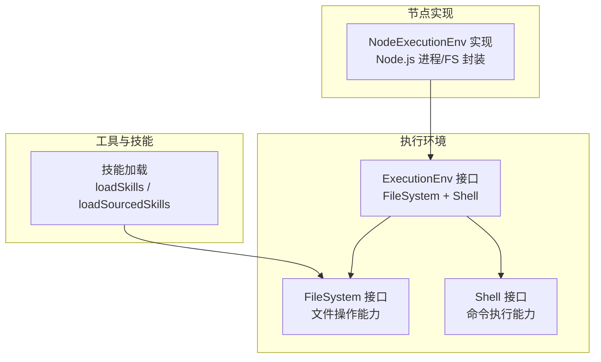
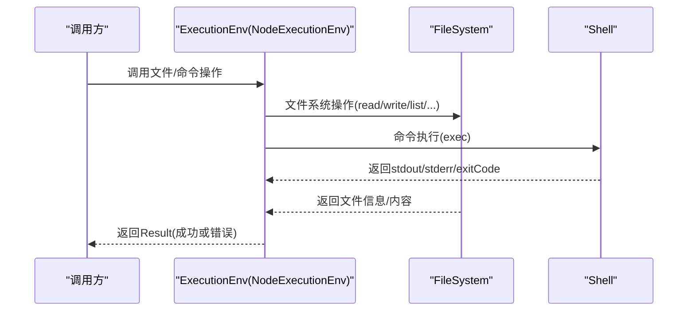
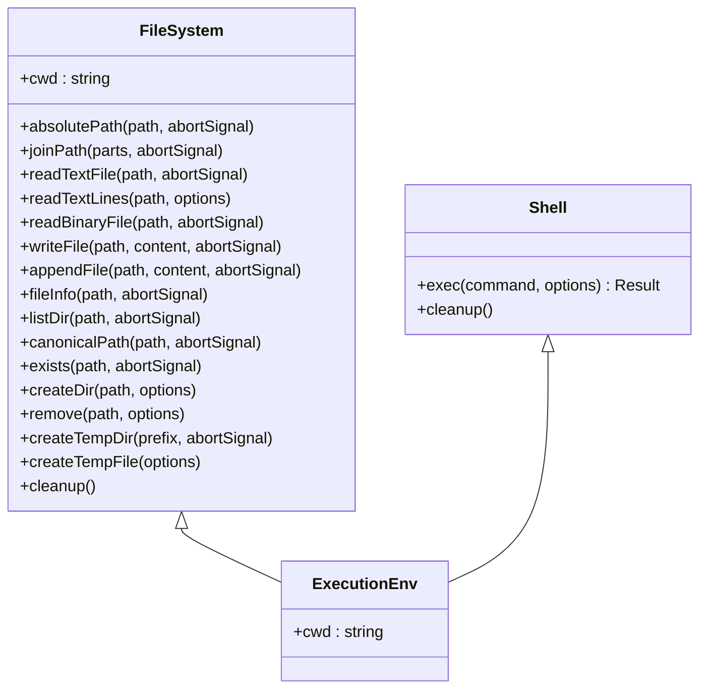
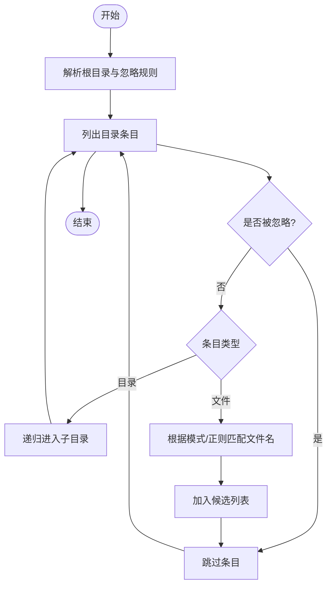
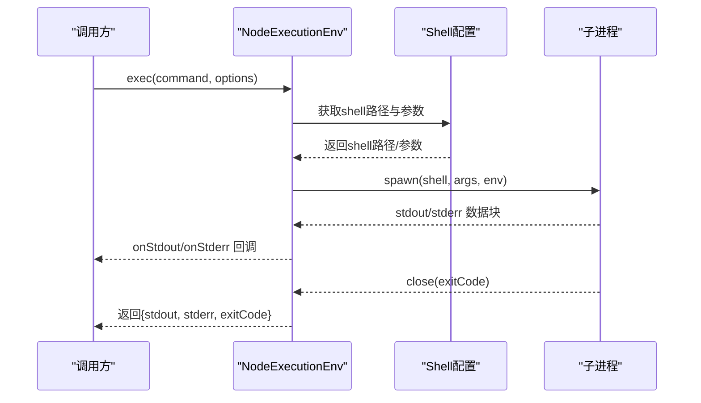
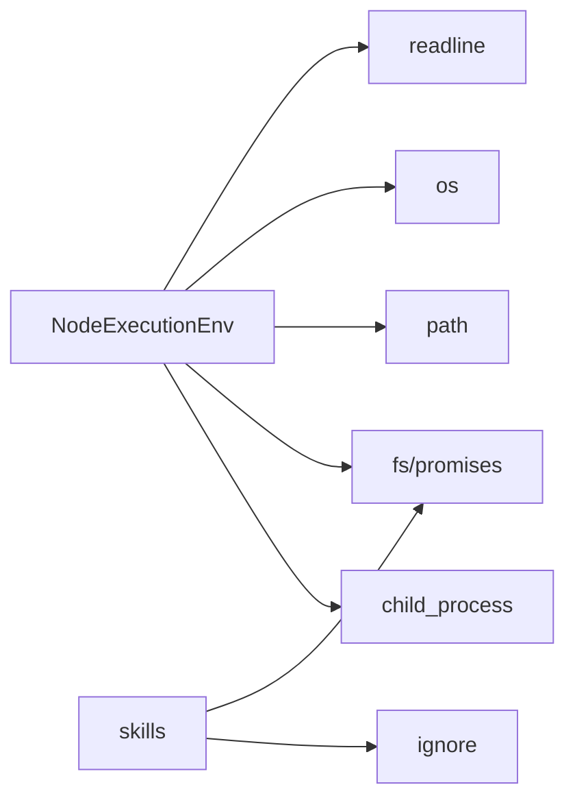

# 工具系统

<cite>
**本文引用的文件**
- [README.md](file://README.md)
- [nodejs.ts](file://packages/agent/src/harness/env/nodejs.ts)
- [types.ts](file://packages/agent/src/harness/types.ts)
- [skills.ts](file://packages/agent/src/harness/skills.ts)
</cite>

## 目录
1. [简介](#简介)
2. [项目结构](#项目结构)
3. [核心组件](#核心组件)
4. [架构总览](#架构总览)
5. [详细组件分析](#详细组件分析)
6. [依赖关系分析](#依赖关系分析)
7. [性能考虑](#性能考虑)
8. [故障排查指南](#故障排查指南)
9. [结论](#结论)
10. [附录](#附录)

## 简介
本文件面向Pi编码代理工具系统，聚焦于“内置工具”的实现与使用方法，涵盖文件操作工具（Read、Write、Edit、Find、Grep、Ls、Bash）与搜索/编辑工具的接口定义、参数配置、执行流程与结果处理。同时提供自定义工具开发指南，包括工具注册、参数校验、错误处理等，并给出实际使用示例与性能优化建议。本文所有技术细节均基于仓库中的源码进行归纳总结。

## 项目结构
Pi是一个多包仓库，工具系统主要位于agent包中，围绕执行环境（ExecutionEnv）抽象出文件系统与进程执行能力，并通过技能加载（skills）机制组织可复用的工具化指令。下图展示了与工具系统相关的核心模块及其职责：

图表来源
- [nodejs.ts:217-351](file://packages/agent/src/harness/env/nodejs.ts#L217-L351)
- [types.ts:268-332](file://packages/agent/src/harness/types.ts#L268-L332)
- [skills.ts:49-101](file://packages/agent/src/harness/skills.ts#L49-L101)

章节来源
- [README.md:19-56](file://README.md#L19-L56)
- [nodejs.ts:217-529](file://packages/agent/src/harness/env/nodejs.ts#L217-L529)
- [types.ts:268-332](file://packages/agent/src/harness/types.ts#L268-L332)
- [skills.ts:49-101](file://packages/agent/src/harness/skills.ts#L49-L101)

## 核心组件
- 执行环境接口（ExecutionEnv）
  - 统一抽象文件系统（FileSystem）与Shell（进程执行），提供跨平台一致的工具调用入口。
  - 关键能力：路径解析、文件读写、目录遍历、符号链接解析、临时资源管理、命令执行与超时/中断控制。
- 节点实现（NodeExecutionEnv）
  - 基于Node.js实现ExecutionEnv，封装child_process、fs/promises、path、os等原生能力。
  - 支持跨平台命令执行、进程树清理、回调式流输出、超时与中止信号。
- 技能加载（Skills）
  - 提供从目录递归加载技能的能力，支持忽略规则、frontmatter元数据校验、诊断信息收集。
  - 为工具化指令提供可发现、可校验的装载机制。

章节来源
- [types.ts:268-332](file://packages/agent/src/harness/types.ts#L268-L332)
- [nodejs.ts:217-351](file://packages/agent/src/harness/env/nodejs.ts#L217-L351)
- [skills.ts:49-101](file://packages/agent/src/harness/skills.ts#L49-L101)

## 架构总览
工具系统采用“接口抽象 + 平台实现 + 资源装载”的分层设计：
- 接口层：定义FileSystem与Shell能力边界，确保工具不直接耦合具体后端。
- 实现层：NodeExecutionEnv在本地环境中提供文件与命令执行能力。
- 装载层：skills模块负责从文件系统加载技能，作为工具的“可发现指令集”。

图表来源
- [types.ts:268-332](file://packages/agent/src/harness/types.ts#L268-L332)
- [nodejs.ts:236-351](file://packages/agent/src/harness/env/nodejs.ts#L236-L351)

## 详细组件分析

### 文件操作工具族（Read/Write/Edit/Ls/Bash）
- Read（文本/二进制/逐行）
  - 文本读取：返回UTF-8字符串；支持中止信号。
  - 二进制读取：返回Uint8Array。
  - 逐行读取：支持限制最大行数，边读取边可中止。
- Write（创建/覆盖/追加）
  - 覆盖写入：自动创建父目录，支持中止信号。
  - 追加写入：自动创建父目录。
- Ls（目录列表）
  - 列举子项，返回FileInfo数组（含名称、绝对路径、类型、大小、修改时间）。
- Edit（编辑器集成）
  - 通过外部编辑器打开文件进行交互式编辑（由上层工具链协调）。
- Bash（命令执行）
  - 在指定工作目录执行命令，支持超时、中止、回调式流输出、环境变量注入。

图表来源
- [types.ts:268-332](file://packages/agent/src/harness/types.ts#L268-L332)

章节来源
- [nodejs.ts:353-434](file://packages/agent/src/harness/env/nodejs.ts#L353-L434)
- [nodejs.ts:445-493](file://packages/agent/src/harness/env/nodejs.ts#L445-L493)
- [nodejs.ts:236-351](file://packages/agent/src/harness/env/nodejs.ts#L236-L351)

### 搜索与编辑工具（Find/Grep）
- Find（递归查找）
  - 基于目录遍历与忽略规则，结合正则/模式匹配实现文件定位。
  - 忽略规则来自.gitignore/.ignore/.fdignore等，支持相对路径前缀。
- Grep（内容检索）
  - 在匹配文件内按行扫描，支持大小写敏感/不敏感、正则表达式、上下文行数等选项。
  - 输出命中行及上下文，便于快速定位与编辑。

图表来源
- [skills.ts:103-175](file://packages/agent/src/harness/skills.ts#L103-L175)
- [skills.ts:177-213](file://packages/agent/src/harness/skills.ts#L177-L213)

章节来源
- [skills.ts:49-101](file://packages/agent/src/harness/skills.ts#L49-L101)
- [skills.ts:103-175](file://packages/agent/src/harness/skills.ts#L103-L175)
- [skills.ts:177-213](file://packages/agent/src/harness/skills.ts#L177-L213)

### 命令执行工具（Bash）
- 跨平台Shell选择
  - Windows优先尝试Git for Windows的bash.exe，其次回退到where/which查找。
  - 非Windows平台优先/bin/bash，否则回退到sh。
- 执行流程
  - 解析命令与参数，设置工作目录与环境变量，启动子进程，捕获stdout/stderr。
  - 支持超时终止与中止信号，必要时递归杀死进程树。
  - 回调函数用于实时处理流输出，异常与错误统一包装为ExecutionError。

图表来源
- [nodejs.ts:137-182](file://packages/agent/src/harness/env/nodejs.ts#L137-L182)
- [nodejs.ts:236-351](file://packages/agent/src/harness/env/nodejs.ts#L236-L351)

章节来源
- [nodejs.ts:137-182](file://packages/agent/src/harness/env/nodejs.ts#L137-L182)
- [nodejs.ts:236-351](file://packages/agent/src/harness/env/nodejs.ts#L236-L351)

### 自定义工具开发指南
- 工具注册
  - 使用ExecutionEnv提供的FileSystem/Shell能力封装新工具。
  - 将工具封装为可调用的函数或类，遵循统一的参数签名与返回值约定（Result）。
- 参数验证
  - 对输入路径进行合法性检查（存在性、类型、权限），对命令参数进行白名单/格式校验。
  - 对超时、中止信号等运行期参数进行边界检查。
- 错误处理
  - 将底层异常转换为稳定的错误码（FileError/ExecutionError），保留原始cause便于追踪。
  - 对可恢复错误提供重试策略，对不可恢复错误及时中止并上报。
- 结果处理
  - 统一以Result形式返回，上层工具链可安全解包或降级处理。
  - 对大文件/长输出采用流式处理，避免内存峰值。

章节来源
- [types.ts:122-155](file://packages/agent/src/harness/types.ts#L122-L155)
- [nodejs.ts:65-91](file://packages/agent/src/harness/env/nodejs.ts#L65-L91)
- [nodejs.ts:246-351](file://packages/agent/src/harness/env/nodejs.ts#L246-L351)

## 依赖关系分析
- NodeExecutionEnv依赖Node.js原生模块（child_process/fs/promises/path/os/readline）实现跨平台命令执行与文件操作。
- FileSystem/Shell接口解耦上层工具与底层实现，便于替换不同后端（如Web Worker、云沙箱）。
- skills模块依赖FileSystem进行目录遍历与文件读取，结合ignore库应用忽略规则。

图表来源
- [nodejs.ts:1-18](file://packages/agent/src/harness/env/nodejs.ts#L1-L18)
- [skills.ts:1-2](file://packages/agent/src/harness/skills.ts#L1-L2)

章节来源
- [nodejs.ts:1-18](file://packages/agent/src/harness/env/nodejs.ts#L1-L18)
- [skills.ts:1-2](file://packages/agent/src/harness/skills.ts#L1-L2)

## 性能考虑
- I/O并发与背压
  - 大文件读取建议使用流式接口（readTextLines），限制单次读取行数，避免阻塞事件循环。
  - 写入操作尽量批量合并，减少磁盘写入次数。
- 进程生命周期
  - 合理设置超时阈值，避免长时间挂起；对可中断任务提供AbortSignal。
  - Windows下使用taskkill强制终止进程树，非Windows使用SIGKILL或负PID方式。
- 编码与字符集
  - 文本读写统一使用UTF-8，避免跨平台编码差异导致的解析错误。
- 路径与符号链接
  - 列表目录时避免自动跟随符号链接，必要时显式调用canonicalPath获取真实路径。

## 故障排查指南
- 文件操作失败
  - 常见错误码：not_found、permission_denied、not_directory、is_directory、invalid、aborted、unknown。
  - 排查要点：确认路径是否存在、权限是否足够、目标是否为文件/目录、是否被中止。
- 命令执行失败
  - 常见错误码：shell_unavailable、spawn_error、timeout、callback_error、aborted。
  - 排查要点：确认shell路径可用、命令语法正确、环境变量完整、回调逻辑无异常。
- 忽略规则导致的遗漏
  - 检查.gitignore/.ignore/.fdignore内容，确认相对路径前缀是否正确。
- 中止与超时
  - 确保AbortSignal正确传递至底层实现，超时阈值合理设置。

章节来源
- [nodejs.ts:65-91](file://packages/agent/src/harness/env/nodejs.ts#L65-L91)
- [nodejs.ts:137-182](file://packages/agent/src/harness/env/nodejs.ts#L137-L182)
- [skills.ts:177-213](file://packages/agent/src/harness/skills.ts#L177-L213)

## 结论
Pi工具系统通过ExecutionEnv抽象统一了文件与命令执行能力，配合skills模块实现了可发现、可校验的工具化指令体系。基于该架构，开发者可以快速扩展新的工具，同时保持一致的参数规范、错误处理与性能特征。建议在生产环境中严格校验输入、合理设置超时与中止策略，并采用流式处理与缓存策略提升整体吞吐。

## 附录
- 实际使用示例（步骤说明）
  - 读取文件：调用readTextFile，传入路径与可选中止信号，解析Result后输出内容。
  - 写入文件：调用writeFile，传入路径、内容与可选中止信号，处理返回的Result。
  - 列出目录：调用listDir，解析FileInfo数组，筛选所需类型与属性。
  - 执行命令：调用exec，传入command与options（cwd/env/timeout/abortSignal/onStdout/onStderr），读取stdout/stderr/exitCode。
  - 递归查找：结合skills模块的忽略规则与目录遍历，生成候选文件集合。
  - 内容检索：在候选文件中逐行扫描，输出匹配行与上下文。
- 性能优化建议
  - 对大文件采用流式读取与分页输出。
  - 对频繁调用的命令启用缓存与去重。
  - 合理设置超时与中止，避免长时间阻塞。
  - 使用临时目录隔离中间产物，定期清理。