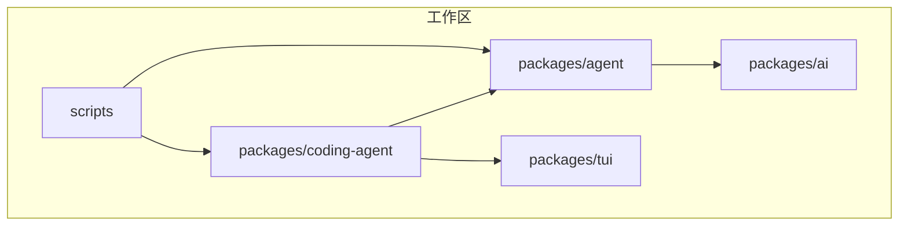
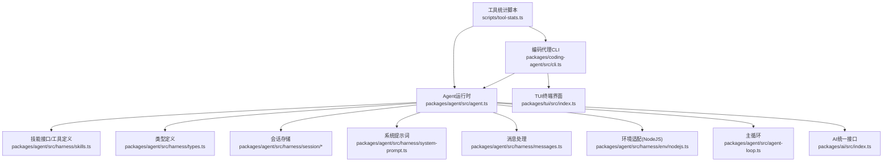
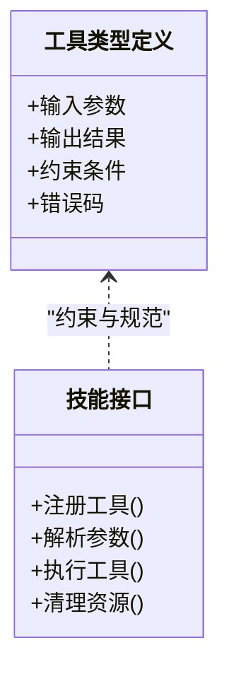
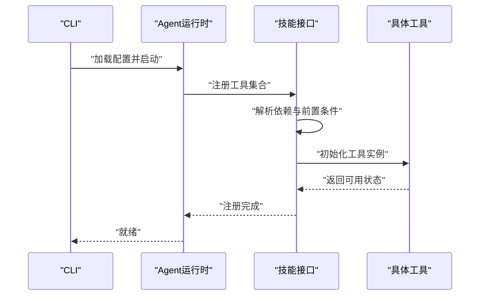
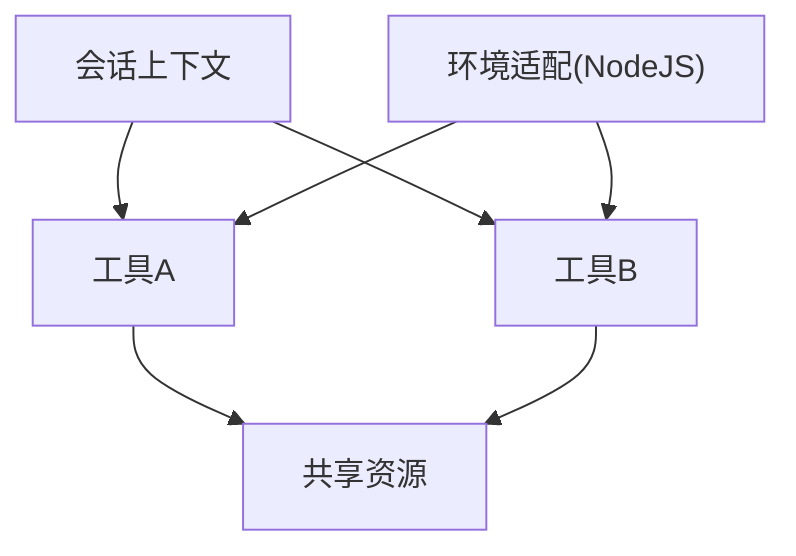
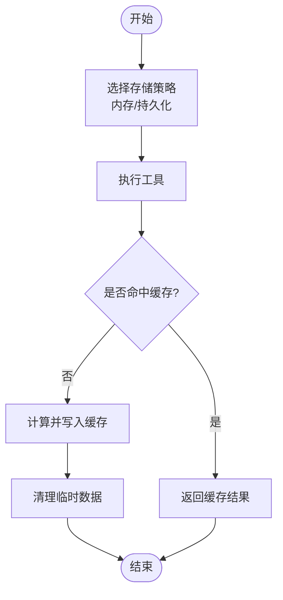
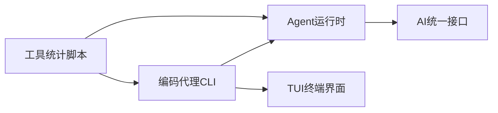

# 工具配置和管理

<cite>
**本文引用的文件**
- [README.md](file://README.md)
- [package.json](file://package.json)
- [packages/agent/src/harness/types.ts](file://packages/agent/src/harness/types.ts)
- [packages/agent/src/harness/skills.ts](file://packages/agent/src/harness/skills.ts)
- [packages/agent/src/harness/env/nodejs.ts](file://packages/agent/src/harness/env/nodejs.ts)
- [packages/agent/src/harness/session/session.ts](file://packages/agent/src/harness/session/session.ts)
- [packages/agent/src/harness/session/memory-storage.ts](file://packages/agent/src/harness/session/memory-storage.ts)
- [packages/agent/src/harness/session/jsonl-storage.ts](file://packages/agent/src/harness/session/jsonl-storage.ts)
- [packages/agent/src/harness/system-prompt.ts](file://packages/agent/src/harness/system-prompt.ts)
- [packages/agent/src/harness/messages.ts](file://packages/agent/src/harness/messages.ts)
- [packages/agent/src/agent.ts](file://packages/agent/src/agent.ts)
- [packages/agent/src/agent-loop.ts](file://packages/agent/src/agent-loop.ts)
- [packages/ai/src/index.ts](file://packages/ai/src/index.ts)
- [packages/coding-agent/src/cli.ts](file://packages/coding-agent/src/cli.ts)
- [packages/coding-agent/src/main.ts](file://packages/coding-agent/src/main.ts)
- [packages/tui/src/index.ts](file://packages/tui/src/index.ts)
- [scripts/tool-stats.ts](file://scripts/tool-stats.ts)
- [scripts/read-tool-stats.mjs](file://scripts/read-tool-stats.mjs)
- [scripts/edit-tool-stats.mjs](file://scripts/edit-tool-stats.mjs)
</cite>

## 目录
1. [简介](#简介)
2. [项目结构](#项目结构)
3. [核心组件](#核心组件)
4. [架构总览](#架构总览)
5. [详细组件分析](#详细组件分析)
6. [依赖分析](#依赖分析)
7. [性能考虑](#性能考虑)
8. [故障排除指南](#故障排除指南)
9. [结论](#结论)
10. [附录](#附录)

## 简介
本文件面向Pi编码代理的“工具配置与管理系统”，聚焦于工具定义接口、参数配置、生命周期管理、注册机制、依赖关系与初始化流程，并提供最佳实践、性能调优、工具协作与资源共享、状态管理与缓存策略、内存优化、扩展接口与自定义工具开发方法，以及实际配置示例与常见问题解决方案。该系统以多包工作区组织，核心能力由Agent运行时、AI统一接口、TUI终端界面与编码代理CLI构成。

## 项目结构
仓库采用monorepo结构，通过工作区聚合多个包，其中与工具配置和管理直接相关的模块包括：
- packages/agent：Agent运行时与工具调用、状态管理
- packages/ai：统一多提供商LLM API（OpenAI、Anthropic、Google等）
- packages/coding-agent：交互式编码代理CLI
- packages/tui：终端UI库与差异化渲染
- 脚本scripts：工具统计与发布辅助脚本

图表来源
- [package.json:1-60](file://package.json#L1-L60)

章节来源
- [README.md:19-58](file://README.md#L19-L58)
- [package.json:1-60](file://package.json#L1-L60)

## 核心组件
- Agent运行时与工具调用：负责工具注册、参数解析、执行调度与状态管理
- AI统一接口：抽象多提供商模型，为工具链路提供推理能力
- 编码代理CLI：命令行入口，承载工具配置与会话管理
- TUI终端界面：提供差异化渲染与交互体验
- 工具统计脚本：记录与读取工具使用统计数据，辅助优化与审计

章节来源
- [packages/agent/src/agent.ts](file://packages/agent/src/agent.ts)
- [packages/agent/src/agent-loop.ts](file://packages/agent/src/agent-loop.ts)
- [packages/agent/src/harness/types.ts](file://packages/agent/src/harness/types.ts)
- [packages/agent/src/harness/skills.ts](file://packages/agent/src/harness/skills.ts)
- [packages/ai/src/index.ts](file://packages/ai/src/index.ts)
- [packages/coding-agent/src/cli.ts](file://packages/coding-agent/src/cli.ts)
- [packages/coding-agent/src/main.ts](file://packages/coding-agent/src/main.ts)
- [packages/tui/src/index.ts](file://packages/tui/src/index.ts)
- [scripts/tool-stats.ts](file://scripts/tool-stats.ts)

## 架构总览
Pi工具配置与管理系统围绕Agent运行时展开，通过统一的工具类型定义与技能接口实现工具注册与调用；AI接口为工具链路提供推理支持；CLI负责用户交互与配置下发；TUI提供终端渲染；工具统计脚本贯穿开发与发布流程。

图表来源
- [packages/coding-agent/src/cli.ts](file://packages/coding-agent/src/cli.ts)
- [packages/agent/src/agent.ts](file://packages/agent/src/agent.ts)
- [packages/agent/src/harness/skills.ts](file://packages/agent/src/harness/skills.ts)
- [packages/agent/src/harness/types.ts](file://packages/agent/src/harness/types.ts)
- [packages/agent/src/harness/session/session.ts](file://packages/agent/src/harness/session/session.ts)
- [packages/agent/src/harness/system-prompt.ts](file://packages/agent/src/harness/system-prompt.ts)
- [packages/agent/src/harness/messages.ts](file://packages/agent/src/harness/messages.ts)
- [packages/agent/src/harness/env/nodejs.ts](file://packages/agent/src/harness/env/nodejs.ts)
- [packages/agent/src/agent-loop.ts](file://packages/agent/src/agent-loop.ts)
- [packages/ai/src/index.ts](file://packages/ai/src/index.ts)
- [packages/tui/src/index.ts](file://packages/tui/src/index.ts)
- [scripts/tool-stats.ts](file://scripts/tool-stats.ts)

## 详细组件分析

### 工具定义接口与参数配置
- 类型与约束：通过统一的类型定义模块，规范工具输入输出、参数校验与错误处理
- 参数配置：支持结构化参数传递、默认值与必填项声明，便于在不同工具间复用
- 生命周期：工具具备初始化、执行、清理阶段，确保资源可控释放

图表来源
- [packages/agent/src/harness/types.ts](file://packages/agent/src/harness/types.ts)
- [packages/agent/src/harness/skills.ts](file://packages/agent/src/harness/skills.ts)

章节来源
- [packages/agent/src/harness/types.ts](file://packages/agent/src/harness/types.ts)
- [packages/agent/src/harness/skills.ts](file://packages/agent/src/harness/skills.ts)

### 工具注册机制、依赖关系与初始化流程
- 注册机制：通过技能接口集中注册工具，建立名称到实现的映射
- 依赖关系：工具可声明前置依赖（如环境变量、外部服务），在初始化阶段进行校验
- 初始化流程：加载配置、验证依赖、构建上下文、准备执行环境

图表来源
- [packages/coding-agent/src/cli.ts](file://packages/coding-agent/src/cli.ts)
- [packages/agent/src/agent.ts](file://packages/agent/src/agent.ts)
- [packages/agent/src/harness/skills.ts](file://packages/agent/src/harness/skills.ts)

章节来源
- [packages/agent/src/agent.ts](file://packages/agent/src/agent.ts)
- [packages/agent/src/harness/skills.ts](file://packages/agent/src/harness/skills.ts)

### 工具配置最佳实践
- 明确参数边界：使用类型定义约束输入输出，避免隐式转换带来的风险
- 分离配置与实现：将工具配置集中管理，便于版本控制与审计
- 可观测性优先：为工具添加日志与指标采集，便于定位问题与性能分析
- 安全与权限：最小权限原则，限制工具对系统资源的访问范围

章节来源
- [packages/agent/src/harness/types.ts](file://packages/agent/src/harness/types.ts)
- [packages/agent/src/harness/system-prompt.ts](file://packages/agent/src/harness/system-prompt.ts)

### 工具间的协作模式、资源共享与冲突解决
- 协作模式：通过会话上下文共享状态，工具间通过消息与事件进行解耦协作
- 资源共享：统一的环境适配层提供跨平台资源抽象（如NodeJS环境）
- 冲突解决：基于优先级与互斥锁策略，避免并发写入与资源竞争

图表来源
- [packages/agent/src/harness/session/session.ts](file://packages/agent/src/harness/session/session.ts)
- [packages/agent/src/harness/env/nodejs.ts](file://packages/agent/src/harness/env/nodejs.ts)

章节来源
- [packages/agent/src/harness/session/session.ts](file://packages/agent/src/harness/session/session.ts)
- [packages/agent/src/harness/env/nodejs.ts](file://packages/agent/src/harness/env/nodejs.ts)

### 工具状态管理、缓存策略与内存优化
- 状态管理：会话存储支持内存与持久化两种模式，按需选择以平衡性能与可靠性
- 缓存策略：针对频繁调用的工具结果进行短期缓存，减少重复计算
- 内存优化：及时释放非必要的中间结果，避免长会话中的内存泄漏

图表来源
- [packages/agent/src/harness/session/memory-storage.ts](file://packages/agent/src/harness/session/memory-storage.ts)
- [packages/agent/src/harness/session/jsonl-storage.ts](file://packages/agent/src/harness/session/jsonl-storage.ts)

章节来源
- [packages/agent/src/harness/session/memory-storage.ts](file://packages/agent/src/harness/session/memory-storage.ts)
- [packages/agent/src/harness/session/jsonl-storage.ts](file://packages/agent/src/harness/session/jsonl-storage.ts)

### 工具扩展接口、自定义工具开发与集成方法
- 扩展接口：通过技能接口提供的注册与解析能力，实现自定义工具的无缝接入
- 开发流程：定义工具类型、实现执行逻辑、编写测试与文档、提交配置
- 集成方法：在CLI中配置工具清单，在Agent运行时中启用相应功能

章节来源
- [packages/agent/src/harness/skills.ts](file://packages/agent/src/harness/skills.ts)
- [packages/coding-agent/src/cli.ts](file://packages/coding-agent/src/cli.ts)

### 实际配置示例与常见问题解决方案
- 配置示例：在CLI中指定工具清单与参数，结合会话存储与系统提示词，形成完整的工具链路
- 常见问题：
  - 工具依赖缺失：检查环境变量与外部服务连通性
  - 性能瓶颈：启用缓存、优化参数、拆分任务
  - 内存占用过高：定期清理临时数据、缩短会话生命周期

章节来源
- [packages/coding-agent/src/cli.ts](file://packages/coding-agent/src/cli.ts)
- [packages/agent/src/harness/system-prompt.ts](file://packages/agent/src/harness/system-prompt.ts)
- [packages/agent/src/harness/messages.ts](file://packages/agent/src/harness/messages.ts)

## 依赖分析
- 包间依赖：编码代理CLI依赖Agent运行时与TUI；Agent运行时依赖AI统一接口；脚本工具贯穿开发与发布流程
- 外部依赖：通过锁定文件与发布脚本保证依赖一致性与安全性

图表来源
- [package.json:1-60](file://package.json#L1-L60)
- [packages/coding-agent/src/cli.ts](file://packages/coding-agent/src/cli.ts)
- [packages/agent/src/agent.ts](file://packages/agent/src/agent.ts)
- [packages/ai/src/index.ts](file://packages/ai/src/index.ts)
- [packages/tui/src/index.ts](file://packages/tui/src/index.ts)
- [scripts/tool-stats.ts](file://scripts/tool-stats.ts)

章节来源
- [package.json:1-60](file://package.json#L1-L60)

## 性能考虑
- 并发与限流：对高开销工具设置并发上限与队列策略，避免阻塞主循环
- 结果缓存：对稳定且昂贵的工具调用结果进行短期缓存，提升响应速度
- 会话压缩：对历史会话进行压缩与归档，降低存储与传输成本
- 资源隔离：在沙箱或容器环境中运行高风险工具，防止资源滥用

## 故障排除指南
- 工具注册失败：检查工具名称唯一性与依赖声明，确认初始化流程无异常
- 执行超时：调整超时阈值与重试策略，必要时拆分任务
- 存储异常：切换存储后端或清理损坏文件，确保路径权限正确
- 日志与诊断：利用系统提示词与消息处理模块增强可观测性，快速定位问题根因

章节来源
- [packages/agent/src/harness/system-prompt.ts](file://packages/agent/src/harness/system-prompt.ts)
- [packages/agent/src/harness/messages.ts](file://packages/agent/src/harness/messages.ts)

## 结论
Pi工具配置与管理系统通过统一的类型定义、技能接口与会话存储，实现了工具的标准化注册、参数化配置与生命周期管理。结合AI统一接口与CLI/TUI，系统在可扩展性、可观测性与性能方面取得平衡。遵循本文的最佳实践与排障建议，可有效提升工具链路的稳定性与效率。

## 附录
- 工具统计脚本：用于记录与读取工具使用统计数据，辅助优化与审计
- 发布与校验：通过脚本生成shrinkwrap与执行本地发布测试，保障依赖一致性

章节来源
- [scripts/tool-stats.ts](file://scripts/tool-stats.ts)
- [scripts/read-tool-stats.mjs](file://scripts/read-tool-stats.mjs)
- [scripts/edit-tool-stats.mjs](file://scripts/edit-tool-stats.mjs)