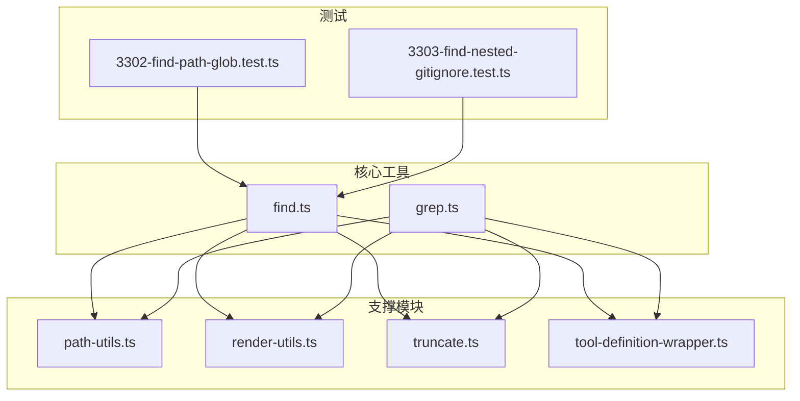
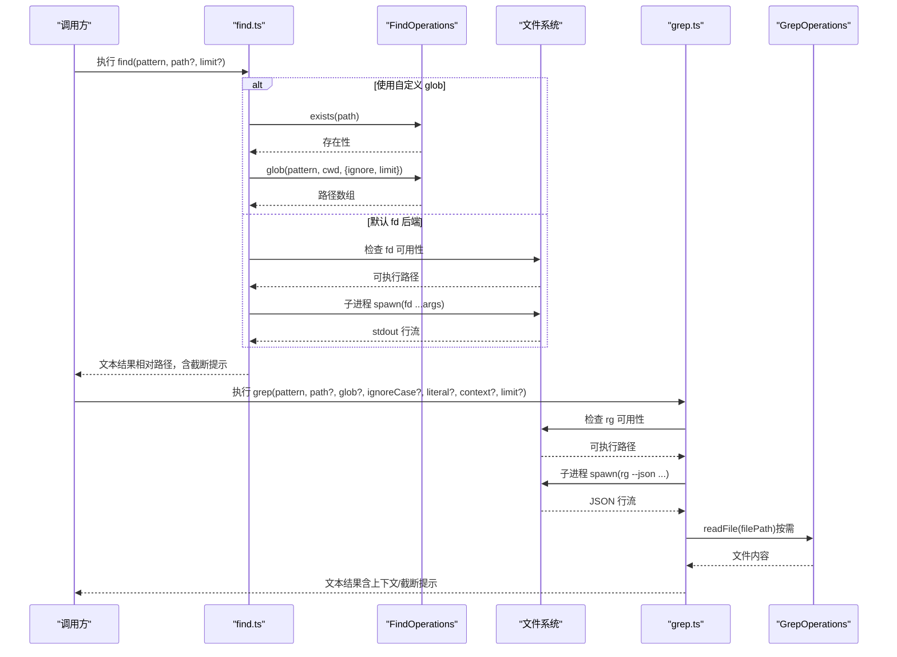
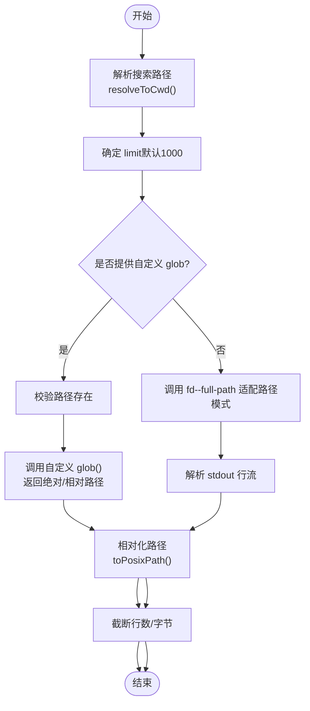
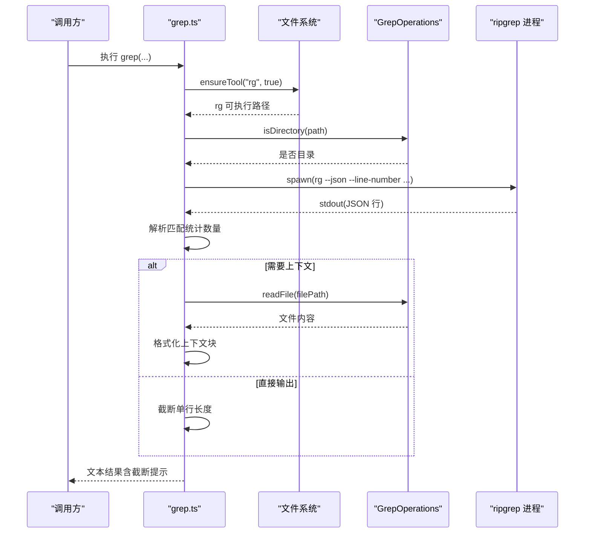
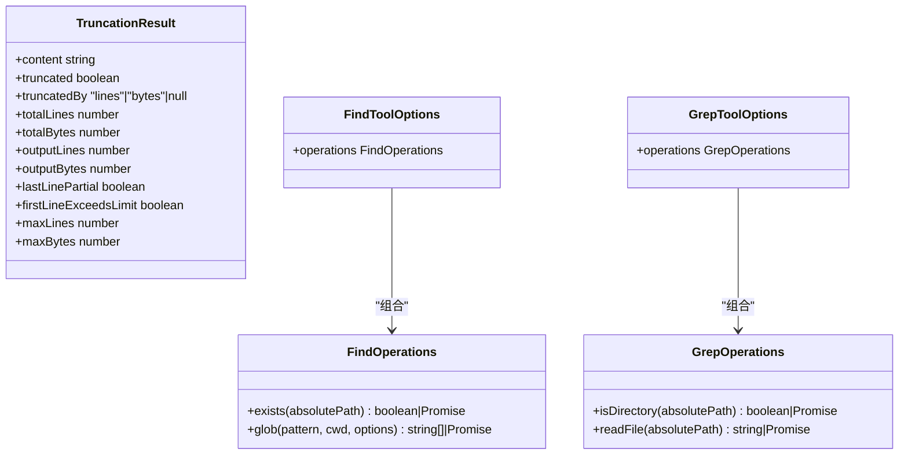
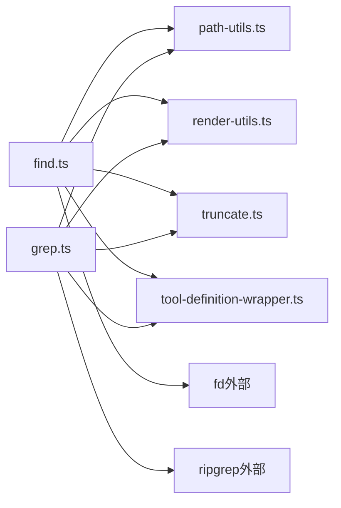

# 搜索和查找工具

<cite>
**本文引用的文件**
- [find.ts](file://packages/coding-agent/src/core/tools/find.ts)
- [grep.ts](file://packages/coding-agent/src/core/tools/grep.ts)
- [path-utils.ts](file://packages/coding-agent/src/core/tools/path-utils.ts)
- [render-utils.ts](file://packages/coding-agent/src/core/tools/render-utils.ts)
- [truncate.ts](file://packages/coding-agent/src/core/tools/truncate.ts)
- [tool-definition-wrapper.ts](file://packages/coding-agent/src/core/tools/tool-definition-wrapper.ts)
- [3302-find-path-glob.test.ts](file://packages/coding-agent/test/suite/regressions/3302-find-path-glob.test.ts)
- [3303-find-nested-gitignore.test.ts](file://packages/coding-agent/test/suite/regressions/3303-find-nested-gitignore.test.ts)
</cite>

## 目录
1. [简介](#简介)
2. [项目结构](#项目结构)
3. [核心组件](#核心组件)
4. [架构总览](#架构总览)
5. [详细组件分析](#详细组件分析)
6. [依赖关系分析](#依赖关系分析)
7. [性能考虑](#性能考虑)
8. [故障排查指南](#故障排查指南)
9. [结论](#结论)
10. [附录](#附录)

## 简介
本文件为 Pi 编码代理中的“搜索与查找”工具提供全面技术文档，重点覆盖以下能力：
- 文件名搜索工具（Find）：基于通配符/路径模式进行文件名匹配，尊重 .gitignore，支持结果数量与输出大小限制。
- 内容搜索工具（Grep）：基于 ripgrep 的内容检索，支持正则/字面量、大小写不敏感、上下文行、文件过滤等，具备流式解析与截断控制。
- 实际使用场景：文件搜索、内容查找、模式匹配示例；性能优化、索引策略与大文件处理；结果排序、去重与格式化；与文件系统的交互与权限要求。

## 项目结构
搜索与查找工具位于 coding-agent 包的核心工具模块中，围绕统一的工具定义包装器与渲染/截断工具协同工作：
- 工具定义与执行：find.ts、grep.ts
- 路径解析与存在性检查：path-utils.ts
- 输出渲染与文本处理：render-utils.ts
- 截断与格式化：truncate.ts
- 工具包装器：tool-definition-wrapper.ts
- 行为回归测试：3302-find-path-glob.test.ts、3303-find-nested-gitignore.test.ts

图表来源
- [find.ts:1-370](file://packages/coding-agent/src/core/tools/find.ts#L1-L370)
- [grep.ts:1-385](file://packages/coding-agent/src/core/tools/grep.ts#L1-L385)
- [path-utils.ts:1-119](file://packages/coding-agent/src/core/tools/path-utils.ts#L1-L119)
- [render-utils.ts:1-65](file://packages/coding-agent/src/core/tools/render-utils.ts#L1-L65)
- [truncate.ts:1-277](file://packages/coding-agent/src/core/tools/truncate.ts#L1-L277)
- [tool-definition-wrapper.ts:1-46](file://packages/coding-agent/src/core/tools/tool-definition-wrapper.ts#L1-L46)
- [3302-find-path-glob.test.ts:1-73](file://packages/coding-agent/test/suite/regressions/3302-find-path-glob.test.ts#L1-L73)
- [3303-find-nested-gitignore.test.ts:1-84](file://packages/coding-agent/test/suite/regressions/3303-find-nested-gitignore.test.ts#L1-L84)

章节来源
- [find.ts:1-370](file://packages/coding-agent/src/core/tools/find.ts#L1-L370)
- [grep.ts:1-385](file://packages/coding-agent/src/core/tools/grep.ts#L1-L385)
- [path-utils.ts:1-119](file://packages/coding-agent/src/core/tools/path-utils.ts#L1-L119)
- [render-utils.ts:1-65](file://packages/coding-agent/src/core/tools/render-utils.ts#L1-L65)
- [truncate.ts:1-277](file://packages/coding-agent/src/core/tools/truncate.ts#L1-L277)
- [tool-definition-wrapper.ts:1-46](file://packages/coding-agent/src/core/tools/tool-definition-wrapper.ts#L1-L46)
- [3302-find-path-glob.test.ts:1-73](file://packages/coding-agent/test/suite/regressions/3302-find-path-glob.test.ts#L1-L73)
- [3303-find-nested-gitignore.test.ts:1-84](file://packages/coding-agent/test/suite/regressions/3303-find-nested-gitignore.test.ts#L1-L84)

## 核心组件
- Find 工具
  - 功能：按通配符/路径模式搜索文件名，尊重 .gitignore，支持自定义操作后端与默认本地 + fd 后端。
  - 关键参数：pattern（必填，glob 模式）、path（可选，默认当前目录）、limit（可选，默认 1000）。
  - 结果：相对路径列表，自动去重与截断，带限制提示。
- Grep 工具
  - 功能：在文件内容中搜索模式，支持正则/字面量、大小写不敏感、上下文行、文件过滤，流式解析 JSON 输出。
  - 关键参数：pattern（必填）、path（可选，默认当前目录）、glob（可选，文件过滤）、ignoreCase、literal、context、limit。
  - 结果：每条匹配包含文件路径、行号与截断后的行文本，带限制提示。
- 路径工具
  - 提供路径解析、存在性检查、跨平台兼容（macOS 名称变体处理）等。
- 渲染工具
  - 文本输出标准化、ANSI 去除、二进制安全、图像占位等。
- 截断工具
  - 统一的行数/字节截断策略，保证不切半行，支持 grep 单行长度截断。
- 工具包装器
  - 将工具定义包装为 AgentTool，注入执行上下文。

章节来源
- [find.ts:19-370](file://packages/coding-agent/src/core/tools/find.ts#L19-L370)
- [grep.ts:23-385](file://packages/coding-agent/src/core/tools/grep.ts#L23-L385)
- [path-utils.ts:40-119](file://packages/coding-agent/src/core/tools/path-utils.ts#L40-L119)
- [render-utils.ts:30-65](file://packages/coding-agent/src/core/tools/render-utils.ts#L30-L65)
- [truncate.ts:11-277](file://packages/coding-agent/src/core/tools/truncate.ts#L11-L277)
- [tool-definition-wrapper.ts:5-46](file://packages/coding-agent/src/core/tools/tool-definition-wrapper.ts#L5-L46)

## 架构总览
Find 与 Grep 均通过子进程调用外部工具（fd/ripgrep），并在 Node 侧进行流式解析、缓存与截断，最终以统一的文本内容返回给调用方。

图表来源
- [find.ts:122-370](file://packages/coding-agent/src/core/tools/find.ts#L122-L370)
- [grep.ts:122-385](file://packages/coding-agent/src/core/tools/grep.ts#L122-L385)
- [path-utils.ts:31-38](file://packages/coding-agent/src/core/tools/path-utils.ts#L31-L38)
- [path-utils.ts:52-84](file://packages/coding-agent/src/core/tools/path-utils.ts#L52-L84)

## 详细组件分析

### Find 工具（文件名搜索）
- 参数与行为
  - pattern：glob 模式，如 "*.ts"、"**/*.json"、"src/**/*.spec.ts"。
  - path：搜索根目录，默认当前目录。
  - limit：最大结果数，默认 1000。
  - .gitignore：通过 fd 的 --no-require-git 实现分层规则，避免全局 ignore 导致的规则泄漏。
- 执行流程
  - 解析搜索路径，应用 limit。
  - 若提供自定义 glob 实现，则直接调用并相对化路径。
  - 否则调用 fd，必要时启用 --full-path 并前置 "**/" 以适配包含 "/" 的模式。
  - 对输出行进行相对化、去重与截断，生成带限制提示的结果。
- 结果格式
  - 文本行，每行一个相对路径；若达到 limit 或输出大小上限，追加提示信息。
- 关键实现要点
  - 路径相对化与 POSIX 分隔符转换，确保跨平台一致性。
  - 截断策略：先按行数，再按字节数，保证不切半行。
  - 回归保障：针对路径型 glob 与 .gitignore 层级规则的测试用例。

图表来源
- [find.ts:150-342](file://packages/coding-agent/src/core/tools/find.ts#L150-L342)
- [path-utils.ts:48-50](file://packages/coding-agent/src/core/tools/path-utils.ts#L48-L50)
- [truncate.ts:78-160](file://packages/coding-agent/src/core/tools/truncate.ts#L78-L160)

章节来源
- [find.ts:19-370](file://packages/coding-agent/src/core/tools/find.ts#L19-L370)
- [path-utils.ts:48-50](file://packages/coding-agent/src/core/tools/path-utils.ts#L48-L50)
- [truncate.ts:78-160](file://packages/coding-agent/src/core/tools/truncate.ts#L78-L160)
- [3302-find-path-glob.test.ts:19-72](file://packages/coding-agent/test/suite/regressions/3302-find-path-glob.test.ts#L19-L72)
- [3303-find-nested-gitignore.test.ts:17-82](file://packages/coding-agent/test/suite/regressions/3303-find-nested-gitignore.test.ts#L17-L82)

### Grep 工具（内容搜索）
- 参数与行为
  - pattern：搜索模式，支持正则或字面量。
  - path：搜索范围（文件或目录），默认当前目录。
  - glob：文件过滤的 glob 模式。
  - ignoreCase/literal：大小写不敏感或字面量匹配。
  - context：匹配前后显示的上下文行数。
  - limit：最大匹配数，默认 100。
- 执行流程
  - 确认 ripgrep 可用，解析搜索路径并判断是否目录。
  - 构造 rg 参数（--json、--line-number、--hidden、--ignore-case/--fixed-strings/--glob 等）。
  - 流式解析 rg 的 JSON 行，统计匹配数并按 limit 截断。
  - 若需要上下文，按需从缓存读取文件内容并格式化块。
  - 对单行进行长度截断，统一输出格式并追加截断提示。
- 结果格式
  - 每条匹配一行，形如 "路径:行号: 文本"；有上下文时输出块，匹配行与非匹配行区分显示。
- 关键实现要点
  - 文件内容缓存（Map）减少重复读取。
  - 单行长度截断（默认 500 字符），避免输出膨胀。
  - 截断策略：先达匹配数限制，再达字节限制，最后单行超长截断。

图表来源
- [grep.ts:122-385](file://packages/coding-agent/src/core/tools/grep.ts#L122-L385)
- [path-utils.ts:52-84](file://packages/coding-agent/src/core/tools/path-utils.ts#L52-L84)
- [truncate.ts:268-277](file://packages/coding-agent/src/core/tools/truncate.ts#L268-L277)

章节来源
- [grep.ts:23-385](file://packages/coding-agent/src/core/tools/grep.ts#L23-L385)
- [truncate.ts:11-277](file://packages/coding-agent/src/core/tools/truncate.ts#L11-L277)

### 类与接口概览
- FindOperations/GrepOperations
  - 可插拔的后端接口，允许替换为远程系统（如 SSH）。
- FindToolOptions/GrepToolOptions
  - 注入自定义操作实现，便于扩展。
- TruncationResult
  - 统一的截断结果结构，包含原始/输出统计与截断原因。

图表来源
- [find.ts:40-56](file://packages/coding-agent/src/core/tools/find.ts#L40-L56)
- [grep.ts:50-65](file://packages/coding-agent/src/core/tools/grep.ts#L50-L65)
- [truncate.ts:15-38](file://packages/coding-agent/src/core/tools/truncate.ts#L15-L38)

章节来源
- [find.ts:40-56](file://packages/coding-agent/src/core/tools/find.ts#L40-L56)
- [grep.ts:50-65](file://packages/coding-agent/src/core/tools/grep.ts#L50-L65)
- [truncate.ts:15-38](file://packages/coding-agent/src/core/tools/truncate.ts#L15-L38)

## 依赖关系分析
- 外部工具
  - Find：fd（文件名搜索，支持 --glob、--full-path、--hidden、--no-require-git、--max-results）。
  - Grep：ripgrep（JSON 输出、行号、隐藏文件、忽略大小写/字面量、glob 过滤）。
- 内部模块
  - path-utils：路径解析、存在性检查、跨平台兼容。
  - render-utils：文本输出标准化、ANSI 去除、图像占位。
  - truncate：统一截断策略（行数/字节/单行长度）。
  - tool-definition-wrapper：工具定义到 AgentTool 的包装。

图表来源
- [find.ts:122-370](file://packages/coding-agent/src/core/tools/find.ts#L122-L370)
- [grep.ts:122-385](file://packages/coding-agent/src/core/tools/grep.ts#L122-L385)
- [path-utils.ts:1-119](file://packages/coding-agent/src/core/tools/path-utils.ts#L1-L119)
- [render-utils.ts:1-65](file://packages/coding-agent/src/core/tools/render-utils.ts#L1-L65)
- [truncate.ts:1-277](file://packages/coding-agent/src/core/tools/truncate.ts#L1-L277)
- [tool-definition-wrapper.ts:1-46](file://packages/coding-agent/src/core/tools/tool-definition-wrapper.ts#L1-L46)

章节来源
- [find.ts:122-370](file://packages/coding-agent/src/core/tools/find.ts#L122-L370)
- [grep.ts:122-385](file://packages/coding-agent/src/core/tools/grep.ts#L122-L385)
- [path-utils.ts:1-119](file://packages/coding-agent/src/core/tools/path-utils.ts#L1-L119)
- [render-utils.ts:1-65](file://packages/coding-agent/src/core/tools/render-utils.ts#L1-L65)
- [truncate.ts:1-277](file://packages/coding-agent/src/core/tools/truncate.ts#L1-L277)
- [tool-definition-wrapper.ts:1-46](file://packages/coding-agent/src/core/tools/tool-definition-wrapper.ts#L1-L46)

## 性能考虑
- 外部工具选择
  - fd：轻量、快速、支持分层 .gitignore，适合大规模文件系统扫描。
  - ripgrep：专为内容搜索优化，JSON 输出利于流式解析与上下文提取。
- 限制与截断
  - Find：默认最多 1000 条结果与 50KB 输出大小，避免内存与网络开销。
  - Grep：默认最多 100 条匹配与 50KB 输出大小，单行最长 500 字符，防止大行拖垮 UI。
- 缓存与去重
  - Grep：文件内容缓存（Map）减少重复 IO；路径相对化避免重复字符串拼接。
- I/O 与并发
  - 流式解析 stdout，边读边处理，降低峰值内存占用。
  - 通过 AbortSignal 支持取消，及时终止子进程。
- 大文件处理
  - 截断优先：先按匹配数/输出大小截断，再按单行长度截断。
  - 上下文读取按需触发，仅在需要时读取文件内容。

章节来源
- [find.ts:29,153,226-248](file://packages/coding-agent/src/core/tools/find.ts#L29,L153,L226-L248)
- [grep.ts:38,188,214-218](file://packages/coding-agent/src/core/tools/grep.ts#L38,L188,L214-L218)
- [truncate.ts:11-13,78-160,268-277](file://packages/coding-agent/src/core/tools/truncate.ts#L11-L13,L78-L160,L268-L277)

## 故障排查指南
- 外部工具不可用
  - 症状：报错提示 fd/rg 不可用且无法下载。
  - 处理：安装 fd（find）或 ripgrep（grep），确保 PATH 可发现。
- 路径不存在
  - 症状：路径不存在或无访问权限。
  - 处理：确认路径正确，检查权限；Find 在自定义 glob 模式下会显式校验路径存在。
- .gitignore 规则异常
  - 症状：兄弟目录被错误过滤或规则泄漏。
  - 处理：使用 --no-require-git 实现分层规则，避免全局 ignore 导致的泄漏。
- 路径型 glob 无结果
  - 症状：包含 "/" 的模式（如 "src/**/*.spec.ts"）无结果。
  - 处理：启用 --full-path 并前置 "**/"，使 fd 在绝对候选路径上匹配。
- 输出过大或行过长
  - 症状：UI 显示截断提示。
  - 处理：增大 limit 或减少上下文；必要时改用“读取文件”工具查看完整内容。

章节来源
- [find.ts:226-248,343-351](file://packages/coding-agent/src/core/tools/find.ts#L226-L248,L343-L351)
- [grep.ts:293-307,356-362](file://packages/coding-agent/src/core/tools/grep.ts#L293-L307,L356-L362)
- [3302-find-path-glob.test.ts:19-72](file://packages/coding-agent/test/suite/regressions/3302-find-path-glob.test.ts#L19-L72)
- [3303-find-nested-gitignore.test.ts:17-82](file://packages/coding-agent/test/suite/regressions/3303-find-nested-gitignore.test.ts#L17-L82)

## 结论
Find 与 Grep 工具通过外部高效工具与内部流式处理相结合，提供了稳定、可扩展、可截断的搜索体验。其设计强调：
- 与文件系统深度集成（尊重 .gitignore、跨平台路径处理）。
- 可插拔后端（FindOperations/GrepOperations）以适配远程/特殊环境。
- 统一的截断与渲染策略，兼顾性能与可读性。
- 详尽的测试用例保障关键行为（路径型 glob 与 .gitignore 层级规则）。

## 附录
- 使用示例（步骤说明）
  - 文件名搜索（Find）
    - 示例：在 src 目录下搜索所有 .spec.ts 文件，限制为 2000 条。
    - 步骤：设置 pattern="src/**/*.spec.ts"，path="src"，limit=2000；执行后查看相对路径列表与截断提示。
  - 内容搜索（Grep）
    - 示例：在项目根目录搜索包含 "TODO" 的行，忽略大小写，显示上下文 2 行，限制为 50 条。
    - 步骤：设置 pattern="TODO"，ignoreCase=true，context=2，limit=50；执行后查看每条匹配的路径、行号与截断后的行文本。
- 排序、去重与格式化
  - Find：相对化路径后去重，按出现顺序输出；截断后追加提示。
  - Grep：按匹配顺序输出；单行截断与上下文格式化；按匹配数与输出大小双重限制。
- 与文件系统的关系与权限
  - 需要对搜索路径具有读取权限；Find 在自定义 glob 模式下会先校验路径存在；Grep 在需要上下文时按需读取文件内容。

章节来源
- [find.ts:119,174-213,317-342](file://packages/coding-agent/src/core/tools/find.ts#L119,L174-L213,L317-L342)
- [grep.ts:130,314-330,332-362](file://packages/coding-agent/src/core/tools/grep.ts#L130,L314-L330,L332-L362)