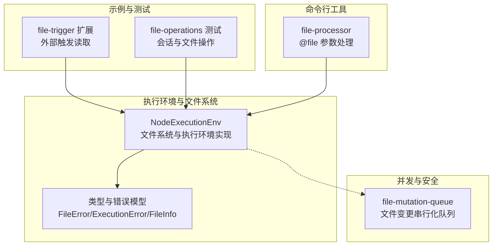
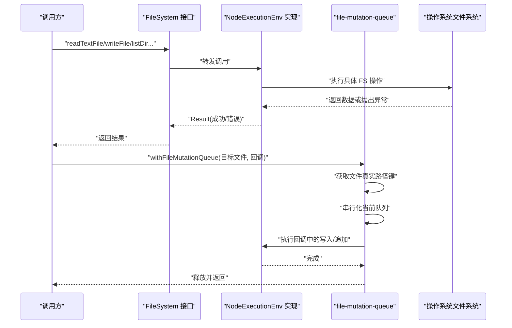
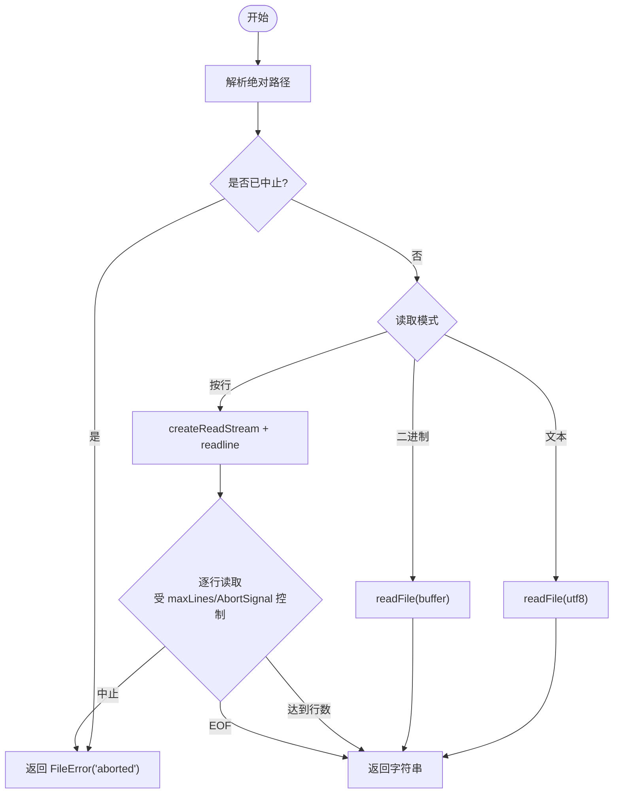
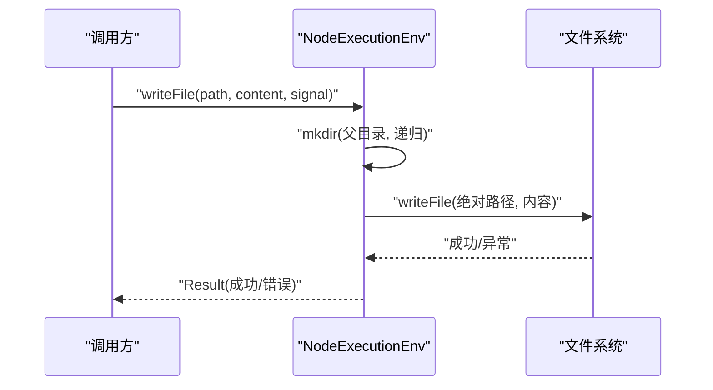
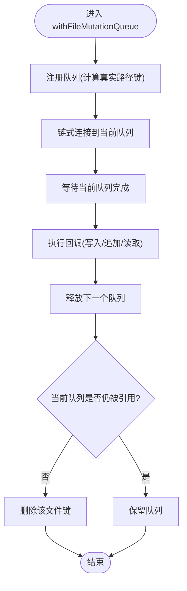
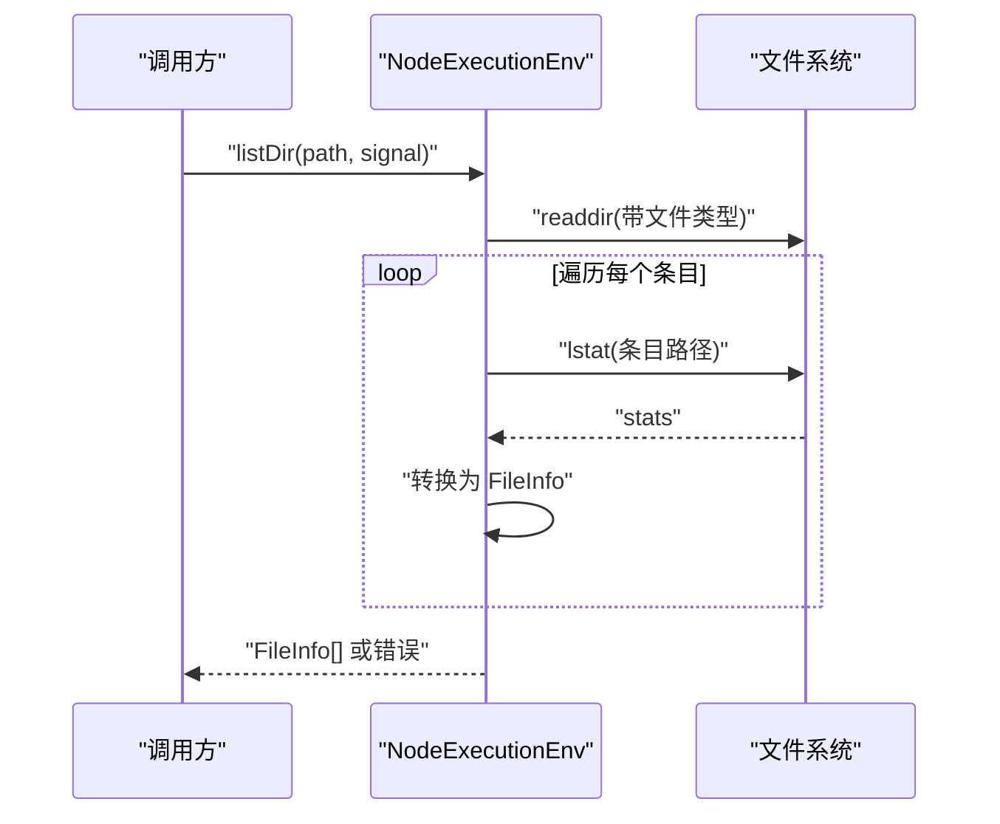
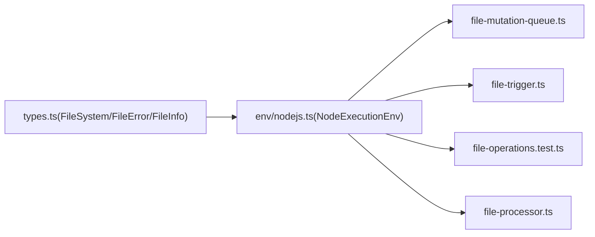

# 文件操作工具

<cite>
**本文引用的文件**
- [packages/agent/src/harness/env/nodejs.ts](file://packages/agent/src/harness/env/nodejs.ts)
- [packages/agent/src/harness/types.ts](file://packages/agent/src/harness/types.ts)
- [packages/coding-agent/src/core/tools/file-mutation-queue.ts](file://packages/coding-agent/src/core/tools/file-mutation-queue.ts)
- [packages/coding-agent/examples/extensions/file-trigger.ts](file://packages/coding-agent/examples/extensions/file-trigger.ts)
- [packages/coding-agent/test/session-manager/file-operations.test.ts](file://packages/coding-agent/test/session-manager/file-operations.test.ts)
- [packages/coding-agent/src/cli/file-processor.ts](file://packages/coding-agent/src/cli/file-processor.ts)
</cite>

## 目录
1. [简介](#简介)
2. [项目结构](#项目结构)
3. [核心组件](#核心组件)
4. [架构总览](#架构总览)
5. [详细组件分析](#详细组件分析)
6. [依赖关系分析](#依赖关系分析)
7. [性能考量](#性能考量)
8. [故障排查指南](#故障排查指南)
9. [结论](#结论)
10. [附录](#附录)

## 简介
本文件面向 Pi 编码代理中的“文件操作工具”，系统性梳理并解释以下能力与实现要点：
- Read：文本读取、二进制读取、按行读取（支持最大行数与中断）
- Write：写入与追加（自动创建父目录）
- Edit：通过“变更串行化队列”保障对同一文件的并发安全
- Ls：列出目录项并返回文件元信息（名称、路径、类型、大小、修改时间）

文档同时覆盖参数配置、执行流程、权限控制、错误处理、大小限制、截断处理、性能优化与安全最佳实践，并给出实际使用示例与参考路径。

## 项目结构
围绕文件操作的核心代码分布在如下模块中：
- 执行环境与文件系统抽象：Node 执行环境实现文件系统接口，统一错误模型与结果封装
- 文件变更串行化：针对同一文件的并发写入/追加以队列串行化，避免竞态
- 示例与测试：触发器扩展、会话管理与文件操作的测试用例，体现真实使用场景
- 命令行文件处理器：将 @file 参数解析为文本与图片附件，演示读取与尺寸处理

**图表来源**
- [packages/agent/src/harness/env/nodejs.ts:217-529](file://packages/agent/src/harness/env/nodejs.ts#L217-L529)
- [packages/agent/src/harness/types.ts:107-332](file://packages/agent/src/harness/types.ts#L107-L332)
- [packages/coding-agent/src/core/tools/file-mutation-queue.ts:1-62](file://packages/coding-agent/src/core/tools/file-mutation-queue.ts#L1-L62)
- [packages/coding-agent/examples/extensions/file-trigger.ts:1-42](file://packages/coding-agent/examples/extensions/file-trigger.ts#L1-L42)
- [packages/coding-agent/test/session-manager/file-operations.test.ts:1-289](file://packages/coding-agent/test/session-manager/file-operations.test.ts#L1-L289)
- [packages/coding-agent/src/cli/file-processor.ts:1-100](file://packages/coding-agent/src/cli/file-processor.ts#L1-L100)

**章节来源**
- [packages/agent/src/harness/env/nodejs.ts:217-529](file://packages/agent/src/harness/env/nodejs.ts#L217-L529)
- [packages/agent/src/harness/types.ts:107-332](file://packages/agent/src/harness/types.ts#L107-L332)
- [packages/coding-agent/src/core/tools/file-mutation-queue.ts:1-62](file://packages/coding-agent/src/core/tools/file-mutation-queue.ts#L1-L62)
- [packages/coding-agent/examples/extensions/file-trigger.ts:1-42](file://packages/coding-agent/examples/extensions/file-trigger.ts#L1-L42)
- [packages/coding-agent/test/session-manager/file-operations.test.ts:1-289](file://packages/coding-agent/test/session-manager/file-operations.test.ts#L1-L289)
- [packages/coding-agent/src/cli/file-processor.ts:1-100](file://packages/coding-agent/src/cli/file-processor.ts#L1-L100)

## 核心组件
- 文件系统接口与实现
  - 接口定义：提供绝对路径、路径拼接、文本/二进制读取、写入/追加、文件信息、目录列表、符号链接解析、存在性检查、目录创建、删除、临时目录/文件、清理等能力
  - 实现：NodeExecutionEnv 将 Node FS API 包装为统一的 Result 错误模型，支持可中断读取（AbortSignal），并进行 Node 错误到 FileError 的映射
- 错误模型
  - FileError：统一的文件操作错误码（如未找到、权限不足、不是目录、是目录、无效、中止、未知等），携带路径与原因
  - ExecutionError：执行环境错误码（中止、超时、Shell 不可用、进程启动失败、回调异常、未知）
- 并发与安全
  - file-mutation-queue：以文件真实路径为键，串行化同一文件的变更操作；不同文件仍可并行，降低锁粒度
- 示例与测试
  - file-trigger：监听触发文件，读取内容后清空，注入消息到会话
  - file-operations 测试：验证会话文件加载、最近会话查找、损坏文件恢复与截断重写
- 命令行文件处理器
  - 将 @file 参数解析为文本与图片附件，自动检测 MIME 类型、可选缩放、输出引用标签

**章节来源**
- [packages/agent/src/harness/types.ts:107-332](file://packages/agent/src/harness/types.ts#L107-L332)
- [packages/agent/src/harness/env/nodejs.ts:65-91](file://packages/agent/src/harness/env/nodejs.ts#L65-L91)
- [packages/coding-agent/src/core/tools/file-mutation-queue.ts:1-62](file://packages/coding-agent/src/core/tools/file-mutation-queue.ts#L1-L62)
- [packages/coding-agent/examples/extensions/file-trigger.ts:1-42](file://packages/coding-agent/examples/extensions/file-trigger.ts#L1-L42)
- [packages/coding-agent/test/session-manager/file-operations.test.ts:1-289](file://packages/coding-agent/test/session-manager/file-operations.test.ts#L1-L289)
- [packages/coding-agent/src/cli/file-processor.ts:1-100](file://packages/coding-agent/src/cli/file-processor.ts#L1-L100)

## 架构总览
下图展示了“文件操作工具”的关键交互：调用方通过 FileSystem 接口发起操作，NodeExecutionEnv 负责具体实现与错误转换；并发写入通过 file-mutation-queue 串行化；示例与测试在真实场景中验证行为。

**图表来源**
- [packages/agent/src/harness/env/nodejs.ts:217-529](file://packages/agent/src/harness/env/nodejs.ts#L217-L529)
- [packages/agent/src/harness/types.ts:268-332](file://packages/agent/src/harness/types.ts#L268-L332)
- [packages/coding-agent/src/core/tools/file-mutation-queue.ts:32-61](file://packages/coding-agent/src/core/tools/file-mutation-queue.ts#L32-L61)

## 详细组件分析

### Read：文本/二进制/按行读取
- 功能
  - 文本读取：UTF-8 字符串
  - 二进制读取：Uint8Array
  - 按行读取：支持 maxLines 限制与逐行迭代，中途可由 AbortSignal 中断
- 关键点
  - 统一路径解析：相对路径基于 cwd 解析为绝对路径
  - 可中断：所有读取支持 AbortSignal，遇到中止立即返回 FileError("aborted")
  - 行读取流式处理：使用 readline 接口逐行累积，避免一次性加载大文件
- 典型使用
  - 读取配置文件、日志片段、小文本
  - 大文件分段读取：设置 maxLines 或使用流式处理
- 错误处理
  - 常见错误映射：ENOENT→not_found，EACCES/EPERM→permission_denied，ENOTDIR→not_directory，EISDIR→is_directory，EINVAL→invalid，其他→unknown
  - 中止：返回 FileError("aborted")

**图表来源**
- [packages/agent/src/harness/env/nodejs.ts:353-404](file://packages/agent/src/harness/env/nodejs.ts#L353-L404)
- [packages/agent/src/harness/env/nodejs.ts:364-393](file://packages/agent/src/harness/env/nodejs.ts#L364-L393)

**章节来源**
- [packages/agent/src/harness/env/nodejs.ts:353-404](file://packages/agent/src/harness/env/nodejs.ts#L353-L404)
- [packages/agent/src/harness/env/nodejs.ts:364-393](file://packages/agent/src/harness/env/nodejs.ts#L364-L393)
- [packages/agent/src/harness/types.ts:111-134](file://packages/agent/src/harness/types.ts#L111-L134)

### Write：写入与追加
- 功能
  - 写入：创建或覆盖文件，自动递归创建父目录
  - 追加：在文件末尾追加内容
- 关键点
  - 自动创建目录：写入前确保父目录存在
  - 可中断：写入支持 AbortSignal
  - 追加：无需前置创建目录，直接追加
- 典型使用
  - 生成日志、配置、中间产物
  - 多步骤流水线：先写入，再读取校验
- 错误处理
  - 权限不足、磁盘空间、路径非法等均映射为 FileError

**图表来源**
- [packages/agent/src/harness/env/nodejs.ts:406-423](file://packages/agent/src/harness/env/nodejs.ts#L406-L423)

**章节来源**
- [packages/agent/src/harness/env/nodejs.ts:406-423](file://packages/agent/src/harness/env/nodejs.ts#L406-L423)

### Edit：文件变更串行化
- 目标
  - 防止多个并发写入/追加同时作用于同一文件导致的数据竞争
- 实现
  - 以文件真实路径为键，维护每个文件的串行队列
  - 注册阶段计算键并串联队列，执行阶段仅允许当前队列完成后再释放
- 性能
  - 同一文件串行，不同文件并行，降低锁粒度
  - 对于频繁小写入的场景，显著减少冲突与重试成本

**图表来源**
- [packages/coding-agent/src/core/tools/file-mutation-queue.ts:32-61](file://packages/coding-agent/src/core/tools/file-mutation-queue.ts#L32-L61)

**章节来源**
- [packages/coding-agent/src/core/tools/file-mutation-queue.ts:1-62](file://packages/coding-agent/src/core/tools/file-mutation-queue.ts#L1-L62)

### Ls：目录列表与元信息
- 功能
  - 列出目录直接子项，返回 FileInfo（名称、路径、类型、大小、修改时间）
  - 支持可中断遍历
- 关键点
  - 使用 lstat 获取对象类型与大小，不跟随符号链接
  - 对每个条目单独查询状态并聚合结果
- 典型使用
  - 展示项目结构、筛选特定类型文件、构建索引

**图表来源**
- [packages/agent/src/harness/env/nodejs.ts:445-467](file://packages/agent/src/harness/env/nodejs.ts#L445-L467)

**章节来源**
- [packages/agent/src/harness/env/nodejs.ts:445-467](file://packages/agent/src/harness/env/nodejs.ts#L445-L467)

### 文件大小限制、截断处理与性能优化
- 大小限制
  - 按行读取支持 maxLines 限制，避免内存膨胀
  - 二进制读取一次性加载，需谨慎用于超大文件
- 截断处理
  - 会话文件损坏或无头部时，打开时会截断并重写有效头部，保证后续一致性
- 性能优化
  - 串行化写入：通过 file-mutation-queue 降低竞态与冲突
  - 流式读取：readTextLines 使用 readline 逐行处理
  - 自动创建目录：写入前确保父目录存在，减少失败重试
  - 并发隔离：不同文件并行，同一文件串行

**章节来源**
- [packages/coding-agent/test/session-manager/file-operations.test.ts:221-239](file://packages/coding-agent/test/session-manager/file-operations.test.ts#L221-L239)
- [packages/coding-agent/test/session-manager/file-operations.test.ts:241-263](file://packages/coding-agent/test/session-manager/file-operations.test.ts#L241-L263)
- [packages/coding-agent/src/core/tools/file-mutation-queue.ts:32-61](file://packages/coding-agent/src/core/tools/file-mutation-queue.ts#L32-L61)
- [packages/agent/src/harness/env/nodejs.ts:364-393](file://packages/agent/src/harness/env/nodejs.ts#L364-L393)
- [packages/agent/src/harness/env/nodejs.ts:406-423](file://packages/agent/src/harness/env/nodejs.ts#L406-L423)

### 权限控制与错误处理机制
- 权限控制
  - 读取：权限不足返回 FileError("permission_denied")
  - 写入：权限不足返回 FileError("permission_denied")
  - 删除：权限不足返回 FileError("permission_denied")
- 错误映射
  - ENOENT→not_found；EACCES/EPERM→permission_denied；ENOTDIR→not_directory；EISDIR→is_directory；EINVAL→invalid；其他→unknown
  - 中止：AbortSignal 触发返回 FileError("aborted")
- 异常兜底
  - 所有底层异常经 toError 规范化，作为 cause 传递，便于调试

**章节来源**
- [packages/agent/src/harness/env/nodejs.ts:65-91](file://packages/agent/src/harness/env/nodejs.ts#L65-L91)
- [packages/agent/src/harness/env/nodejs.ts:353-423](file://packages/agent/src/harness/env/nodejs.ts#L353-L423)
- [packages/agent/src/harness/types.ts:111-134](file://packages/agent/src/harness/types.ts#L111-L134)

### 实际使用示例与参考路径
- 读取文本文件
  - 参考：[packages/agent/src/harness/env/nodejs.ts:353-362](file://packages/agent/src/harness/env/nodejs.ts#L353-L362)
- 按行读取（限制行数）
  - 参考：[packages/agent/src/harness/env/nodejs.ts:364-393](file://packages/agent/src/harness/env/nodejs.ts#L364-L393)
- 二进制读取
  - 参考：[packages/agent/src/harness/env/nodejs.ts:395-404](file://packages/agent/src/harness/env/nodejs.ts#L395-L404)
- 写入文件（自动创建父目录）
  - 参考：[packages/agent/src/harness/env/nodejs.ts:406-423](file://packages/agent/src/harness/env/nodejs.ts#L406-L423)
- 追加写入
  - 参考：[packages/agent/src/harness/env/nodejs.ts:425-434](file://packages/agent/src/harness/env/nodejs.ts#L425-L434)
- 列出目录并获取元信息
  - 参考：[packages/agent/src/harness/env/nodejs.ts:445-467](file://packages/agent/src/harness/env/nodejs.ts#L445-L467)
- 串行化编辑同一文件
  - 参考：[packages/coding-agent/src/core/tools/file-mutation-queue.ts:32-61](file://packages/coding-agent/src/core/tools/file-mutation-queue.ts#L32-L61)
- 外部触发读取并注入消息
  - 参考：[packages/coding-agent/examples/extensions/file-trigger.ts:15-40](file://packages/coding-agent/examples/extensions/file-trigger.ts#L15-L40)
- @file 参数处理（文本/图片）
  - 参考：[packages/coding-agent/src/cli/file-processor.ts:24-99](file://packages/coding-agent/src/cli/file-processor.ts#L24-L99)

## 依赖关系分析
- NodeExecutionEnv 实现 FileSystem 接口，提供统一的文件操作能力
- file-mutation-queue 依赖 Node FS 的 realpath 与 resolve，确保同一文件的串行化
- 示例与测试依赖 Node FS 与 Node Path，验证真实行为
- 命令行文件处理器依赖 Node FS 与 MIME 检测，实现 @file 的多格式处理

**图表来源**
- [packages/agent/src/harness/types.ts:268-332](file://packages/agent/src/harness/types.ts#L268-L332)
- [packages/agent/src/harness/env/nodejs.ts:217-529](file://packages/agent/src/harness/env/nodejs.ts#L217-L529)
- [packages/coding-agent/src/core/tools/file-mutation-queue.ts:1-62](file://packages/coding-agent/src/core/tools/file-mutation-queue.ts#L1-L62)
- [packages/coding-agent/examples/extensions/file-trigger.ts:1-42](file://packages/coding-agent/examples/extensions/file-trigger.ts#L1-L42)
- [packages/coding-agent/test/session-manager/file-operations.test.ts:1-289](file://packages/coding-agent/test/session-manager/file-operations.test.ts#L1-L289)
- [packages/coding-agent/src/cli/file-processor.ts:1-100](file://packages/coding-agent/src/cli/file-processor.ts#L1-L100)

**章节来源**
- [packages/agent/src/harness/types.ts:268-332](file://packages/agent/src/harness/types.ts#L268-L332)
- [packages/agent/src/harness/env/nodejs.ts:217-529](file://packages/agent/src/harness/env/nodejs.ts#L217-L529)
- [packages/coding-agent/src/core/tools/file-mutation-queue.ts:1-62](file://packages/coding-agent/src/core/tools/file-mutation-queue.ts#L1-L62)
- [packages/coding-agent/examples/extensions/file-trigger.ts:1-42](file://packages/coding-agent/examples/extensions/file-trigger.ts#L1-L42)
- [packages/coding-agent/test/session-manager/file-operations.test.ts:1-289](file://packages/coding-agent/test/session-manager/file-operations.test.ts#L1-L289)
- [packages/coding-agent/src/cli/file-processor.ts:1-100](file://packages/coding-agent/src/cli/file-processor.ts#L1-L100)

## 性能考量
- 串行化写入
  - 通过 file-mutation-queue 将同一文件的写入串行化，避免竞态与多次重试
- 流式读取
  - 按行读取使用 readline，逐行累积，适合大文件与受限内存场景
- 自动创建目录
  - 写入前确保父目录存在，减少因目录缺失导致的失败重试
- 并发隔离
  - 不同文件并行，同一文件串行，平衡吞吐与一致性

[本节为通用指导，无需列出具体文件来源]

## 故障排查指南
- 常见错误定位
  - not_found：路径不存在或权限不足导致无法访问
  - permission_denied：用户无权读取/写入/删除
  - not_directory/is_directory：传入路径类型与期望不符
  - invalid：参数非法或平台不支持
  - aborted：调用方主动中止
- 定位建议
  - 检查路径解析：确认相对路径是否正确解析为绝对路径
  - 检查权限：确认运行用户对目标路径具有相应权限
  - 检查并发：若出现竞态，使用 file-mutation-queue 包裹写入/追加
  - 检查中断：确保 AbortSignal 正确传递并在上层处理返回值
- 会话文件损坏恢复
  - 若文件为空或无有效头部，打开时会截断并重写有效头部，保证后续一致性

**章节来源**
- [packages/agent/src/harness/env/nodejs.ts:65-91](file://packages/agent/src/harness/env/nodejs.ts#L65-L91)
- [packages/coding-agent/test/session-manager/file-operations.test.ts:221-239](file://packages/coding-agent/test/session-manager/file-operations.test.ts#L221-L239)
- [packages/coding-agent/test/session-manager/file-operations.test.ts:241-263](file://packages/coding-agent/test/session-manager/file-operations.test.ts#L241-L263)

## 结论
Pi 编码代理的文件操作工具以 FileSystem 接口为核心，NodeExecutionEnv 提供统一实现与错误模型，结合 file-mutation-queue 的串行化策略，在保证安全性的同时兼顾性能。通过按行读取、自动创建目录、可中断操作与严格的错误映射，工具能够稳定地支撑各类文件读取、写入、编辑与列表展示场景。配合示例与测试，开发者可以快速理解并正确使用这些能力。

[本节为总结性内容，无需列出具体文件来源]

## 附录
- 安全最佳实践
  - 严格控制路径来源，避免路径穿越
  - 限制写入范围，优先限定在工作目录内
  - 对外部输入进行白名单校验，避免写入敏感文件
  - 使用 AbortSignal 控制长时间操作，防止资源占用
  - 在高并发场景使用 file-mutation-queue 串行化同一文件的写入
- 参考路径
  - 读取：[packages/agent/src/harness/env/nodejs.ts:353-404](file://packages/agent/src/harness/env/nodejs.ts#L353-L404)
  - 写入/追加：[packages/agent/src/harness/env/nodejs.ts:406-434](file://packages/agent/src/harness/env/nodejs.ts#L406-L434)
  - 列表：[packages/agent/src/harness/env/nodejs.ts:445-467](file://packages/agent/src/harness/env/nodejs.ts#L445-L467)
  - 串行化：[packages/coding-agent/src/core/tools/file-mutation-queue.ts:32-61](file://packages/coding-agent/src/core/tools/file-mutation-queue.ts#L32-L61)
  - 触发器示例：[packages/coding-agent/examples/extensions/file-trigger.ts:15-40](file://packages/coding-agent/examples/extensions/file-trigger.ts#L15-L40)
  - @file 处理：[packages/coding-agent/src/cli/file-processor.ts:24-99](file://packages/coding-agent/src/cli/file-processor.ts#L24-L99)

[本节为补充内容，无需列出具体文件来源]