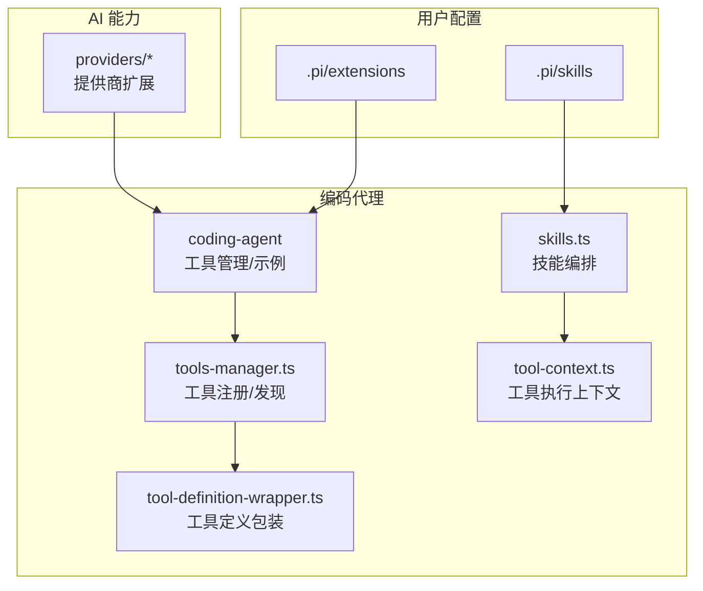
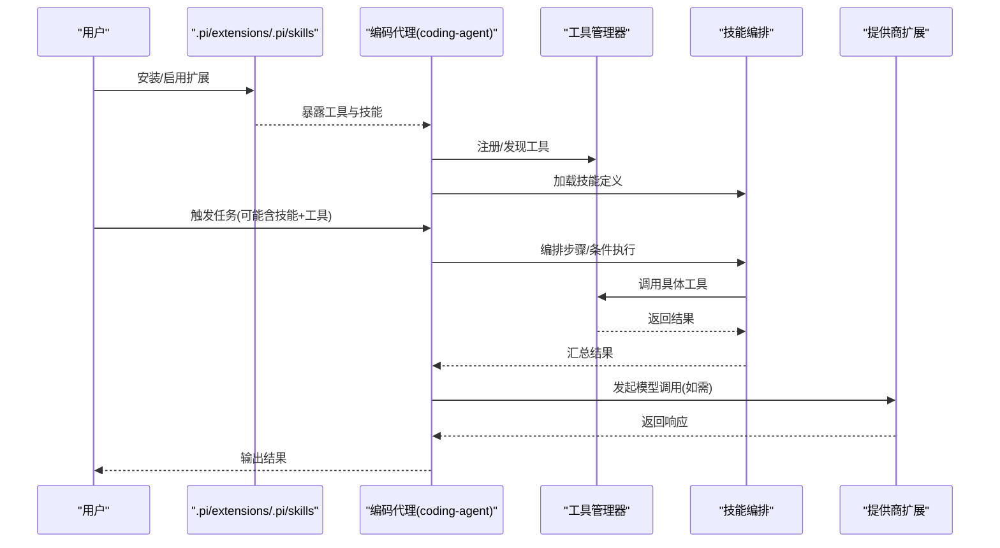
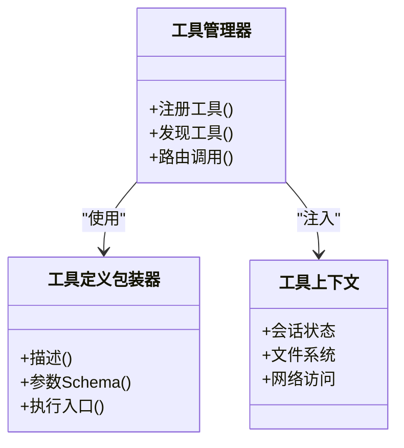
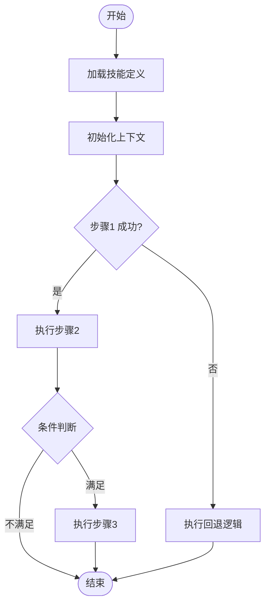
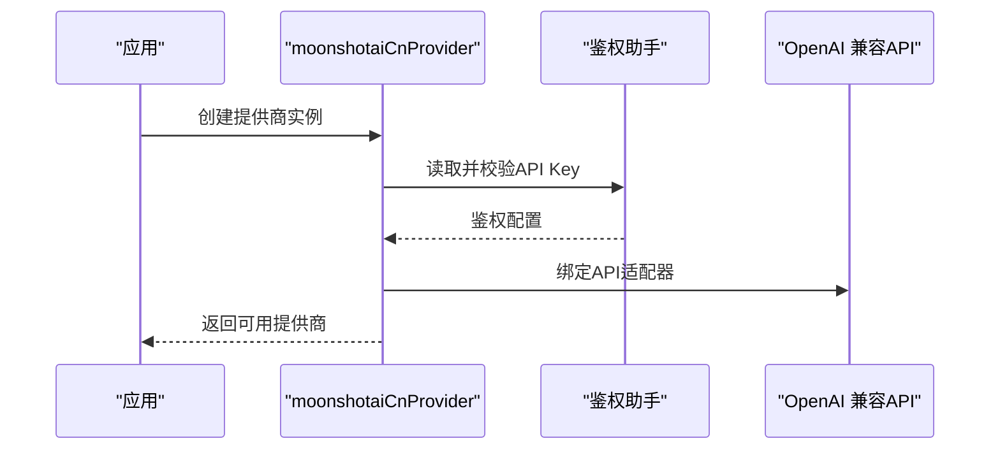
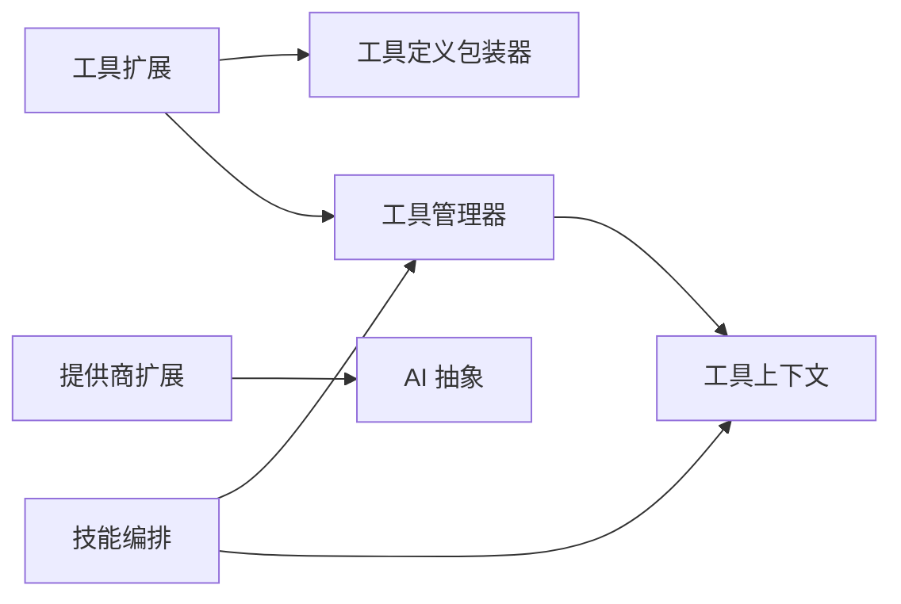

# 扩展开发

<cite>
**本文引用的文件**
- [README.md](file://README.md)
- [packages/agent/src/harness/skills.ts](file://packages/agent/src/harness/skills.ts)
- [packages/coding-agent/src/core/skills.ts](file://packages/coding-agent/src/core/skills.ts)
- [packages/coding-agent/examples/extensions/tools.ts](file://packages/coding-agent/examples/extensions/tools.ts)
- [packages/coding-agent/examples/extensions/tool-override.ts](file://packages/coding-agent/examples/extensions/tool-override.ts)
- [packages/coding-agent/src/utils/tools-manager.ts](file://packages/coding-agent/src/utils/tools-manager.ts)
- [packages/coding-agent/src/core/tools/tool-definition-wrapper.ts](file://packages/coding-agent/src/core/tools/tool-definition-wrapper.ts)
- [packages/agent/src/harness/tools/tool-context.ts](file://packages/agent/src/harness/tools/tool-context.ts)
- [packages/ai/src/providers/moonshotai-cn.ts](file://packages/ai/src/providers/moonshotai-cn.ts)
- [packages/ai/src/models.ts](file://packages/ai/src/models.ts)
</cite>

## 目录
1. [简介](#简介)
2. [项目结构](#项目结构)
3. [核心组件](#核心组件)
4. [架构总览](#架构总览)
5. [详细组件分析](#详细组件分析)
6. [依赖关系分析](#依赖关系分析)
7. [性能考虑](#性能考虑)
8. [故障排查指南](#故障排查指南)
9. [结论](#结论)
10. [附录](#附录)

## 简介
本指南面向希望为编码代理（Pi Coding Agent）开发扩展的开发者，覆盖工具扩展、技能扩展与提供商扩展三类扩展机制。文档从系统架构出发，逐步深入到接口定义、参数校验、错误处理、测试编写、工作流编排、条件执行、发布分发、调试技巧、性能优化与安全权限控制等主题，并提供从简单到复杂的完整示例路径指引。

## 项目结构
仓库采用多包（monorepo）组织，与扩展相关的关键位置如下：
- 用户级扩展与技能目录：.pi/extensions、.pi/skills（用于存放本地扩展与技能）
- 工具扩展与示例：packages/coding-agent/examples/extensions（包含工具与覆盖示例）
- 工具管理与定义包装：packages/coding-agent/src/utils/tools-manager.ts、packages/coding-agent/src/core/tools/tool-definition-wrapper.ts
- 技能系统与编排：packages/agent/src/harness/skills.ts、packages/coding-agent/src/core/skills.ts
- 工具上下文与执行环境：packages/agent/src/harness/tools/tool-context.ts
- 提供商扩展：packages/ai/src/providers/*（以 moonshotai-cn.ts 为例）

图表来源
- [packages/coding-agent/examples/extensions/tools.ts:1-200](file://packages/coding-agent/examples/extensions/tools.ts#L1-L200)
- [packages/coding-agent/src/utils/tools-manager.ts:1-200](file://packages/coding-agent/src/utils/tools-manager.ts#L1-L200)
- [packages/coding-agent/src/core/tools/tool-definition-wrapper.ts:1-200](file://packages/coding-agent/src/core/tools/tool-definition-wrapper.ts#L1-L200)
- [packages/agent/src/harness/skills.ts:1-200](file://packages/agent/src/harness/skills.ts#L1-L200)
- [packages/coding-agent/src/core/skills.ts:1-200](file://packages/coding-agent/src/core/skills.ts#L1-L200)
- [packages/agent/src/harness/tools/tool-context.ts:1-200](file://packages/agent/src/harness/tools/tool-context.ts#L1-L200)
- [packages/ai/src/providers/moonshotai-cn.ts:1-15](file://packages/ai/src/providers/moonshotai-cn.ts#L1-L15)

章节来源
- [README.md:13-36](file://README.md#L13-L36)

## 核心组件
- 工具扩展：通过工具定义与包装器进行声明式描述，由工具管理器统一注册与调度；示例位于 examples/extensions。
- 技能扩展：在 harness 与 core 层提供技能定义与工作流编排能力，支持条件执行与步骤组合。
- 提供商扩展：通过 createProvider 工厂函数创建新的 LLM 提供商实现，封装鉴权、模型列表与 API 适配。

章节来源
- [packages/coding-agent/examples/extensions/tools.ts:1-200](file://packages/coding-agent/examples/extensions/tools.ts#L1-L200)
- [packages/coding-agent/src/core/tools/tool-definition-wrapper.ts:1-200](file://packages/coding-agent/src/core/tools/tool-definition-wrapper.ts#L1-L200)
- [packages/coding-agent/src/utils/tools-manager.ts:1-200](file://packages/coding-agent/src/utils/tools-manager.ts#L1-L200)
- [packages/agent/src/harness/skills.ts:1-200](file://packages/agent/src/harness/skills.ts#L1-L200)
- [packages/coding-agent/src/core/skills.ts:1-200](file://packages/coding-agent/src/core/skills.ts#L1-L200)
- [packages/ai/src/providers/moonshotai-cn.ts:1-15](file://packages/ai/src/providers/moonshotai-cn.ts#L1-L15)

## 架构总览
下图展示了“用户扩展 -> 编码代理 -> AI 提供商”的整体调用链：用户在 .pi 下放置自定义工具与技能，编码代理在运行时加载并编排；当需要调用外部模型时，通过提供商扩展完成鉴权与请求。

图表来源
- [packages/coding-agent/src/utils/tools-manager.ts:1-200](file://packages/coding-agent/src/utils/tools-manager.ts#L1-L200)
- [packages/agent/src/harness/skills.ts:1-200](file://packages/agent/src/harness/skills.ts#L1-L200)
- [packages/coding-agent/src/core/skills.ts:1-200](file://packages/coding-agent/src/core/skills.ts#L1-L200)
- [packages/ai/src/providers/moonshotai-cn.ts:1-15](file://packages/ai/src/providers/moonshotai-cn.ts#L1-L15)

## 详细组件分析

### 工具扩展：接口、验证、错误与测试
- 工具定义与包装：通过工具定义包装器对工具的输入/输出、描述、元数据进行标准化，便于统一注册与展示。
- 工具注册与发现：工具管理器负责扫描、注册、去重与路由，确保扩展工具可被代理识别与调用。
- 执行上下文：工具在执行时获得统一的上下文对象，包含会话状态、文件系统访问、网络访问等能力边界。
- 示例参考：examples/extensions/tools.ts 提供了工具扩展的基本用法；tool-override.ts 演示如何覆盖内置工具行为。

图表来源
- [packages/coding-agent/src/core/tools/tool-definition-wrapper.ts:1-200](file://packages/coding-agent/src/core/tools/tool-definition-wrapper.ts#L1-L200)
- [packages/coding-agent/src/utils/tools-manager.ts:1-200](file://packages/coding-agent/src/utils/tools-manager.ts#L1-L200)
- [packages/agent/src/harness/tools/tool-context.ts:1-200](file://packages/agent/src/harness/tools/tool-context.ts#L1-L200)

开发与最佳实践要点
- 接口定义：明确输入参数 Schema 与返回值结构，保证类型安全与可序列化。
- 参数验证：在工具入口处进行严格校验，失败时返回结构化错误信息。
- 错误处理：区分业务错误与系统错误，记录必要日志但不泄露敏感信息。
- 测试编写：基于工具上下文构造最小可用环境，覆盖正常路径与异常分支。

章节来源
- [packages/coding-agent/examples/extensions/tools.ts:1-200](file://packages/coding-agent/examples/extensions/tools.ts#L1-L200)
- [packages/coding-agent/examples/extensions/tool-override.ts:1-200](file://packages/coding-agent/examples/extensions/tool-override.ts#L1-L200)
- [packages/coding-agent/src/core/tools/tool-definition-wrapper.ts:1-200](file://packages/coding-agent/src/core/tools/tool-definition-wrapper.ts#L1-L200)
- [packages/coding-agent/src/utils/tools-manager.ts:1-200](file://packages/coding-agent/src/utils/tools-manager.ts#L1-L200)
- [packages/agent/src/harness/tools/tool-context.ts:1-200](file://packages/agent/src/harness/tools/tool-context.ts#L1-L200)

### 技能系统：定义、编排与条件执行
- 技能定义：在 harness 与 core 层提供技能的结构化定义方式，包括步骤、条件、资源与副作用说明。
- 工作流编排：技能可组合多个工具调用，按顺序或并行执行，支持分支与重试策略。
- 条件执行：根据上下文状态或工具返回结果动态决定后续步骤。

图表来源
- [packages/agent/src/harness/skills.ts:1-200](file://packages/agent/src/harness/skills.ts#L1-L200)
- [packages/coding-agent/src/core/skills.ts:1-200](file://packages/coding-agent/src/core/skills.ts#L1-L200)

章节来源
- [packages/agent/src/harness/skills.ts:1-200](file://packages/agent/src/harness/skills.ts#L1-L200)
- [packages/coding-agent/src/core/skills.ts:1-200](file://packages/coding-agent/src/core/skills.ts#L1-L200)

### 提供商扩展：新增 LLM 提供商
- 工厂函数：通过 createProvider 创建新提供商实例，指定 id、名称、基础 URL、鉴权方式、模型列表与 API 适配器。
- 鉴权：使用 envApiKeyAuth 等辅助函数读取环境变量并注入鉴权头。
- 模型列表：集中声明支持的模型，便于 UI 与调度层选择。

图表来源
- [packages/ai/src/providers/moonshotai-cn.ts:1-15](file://packages/ai/src/providers/moonshotai-cn.ts#L1-L15)
- [packages/ai/src/models.ts:1-200](file://packages/ai/src/models.ts#L1-L200)

章节来源
- [packages/ai/src/providers/moonshotai-cn.ts:1-15](file://packages/ai/src/providers/moonshotai-cn.ts#L1-L15)
- [packages/ai/src/models.ts:1-200](file://packages/ai/src/models.ts#L1-L200)

### 完整开发示例路径
- 简单文件处理工具：参考 examples/extensions/tools.ts，实现一个读取/写入文件的工具，包含参数校验与错误处理。
- 复杂自动化工作流：基于 skills.ts 定义多步骤流程，结合工具调用与条件分支，实现端到端自动化任务。
- 提供商接入：参照 moonshotai-cn.ts，为新模型服务添加提供商，完成鉴权与模型清单配置。

章节来源
- [packages/coding-agent/examples/extensions/tools.ts:1-200](file://packages/coding-agent/examples/extensions/tools.ts#L1-L200)
- [packages/agent/src/harness/skills.ts:1-200](file://packages/agent/src/harness/skills.ts#L1-L200)
- [packages/coding-agent/src/core/skills.ts:1-200](file://packages/coding-agent/src/core/skills.ts#L1-L200)
- [packages/ai/src/providers/moonshotai-cn.ts:1-15](file://packages/ai/src/providers/moonshotai-cn.ts#L1-L15)

## 依赖关系分析
- 工具扩展依赖工具定义包装器与工具管理器，二者解耦了“描述”和“调度”。
- 技能编排依赖工具管理器提供的工具能力，并通过上下文共享状态。
- 提供商扩展独立于工具与技能，仅通过统一的 AI 抽象被上层调用。

图表来源
- [packages/coding-agent/src/core/tools/tool-definition-wrapper.ts:1-200](file://packages/coding-agent/src/core/tools/tool-definition-wrapper.ts#L1-L200)
- [packages/coding-agent/src/utils/tools-manager.ts:1-200](file://packages/coding-agent/src/utils/tools-manager.ts#L1-L200)
- [packages/agent/src/harness/skills.ts:1-200](file://packages/agent/src/harness/skills.ts#L1-L200)
- [packages/agent/src/harness/tools/tool-context.ts:1-200](file://packages/agent/src/harness/tools/tool-context.ts#L1-L200)
- [packages/ai/src/providers/moonshotai-cn.ts:1-15](file://packages/ai/src/providers/moonshotai-cn.ts#L1-L15)

章节来源
- [packages/coding-agent/src/utils/tools-manager.ts:1-200](file://packages/coding-agent/src/utils/tools-manager.ts#L1-L200)
- [packages/agent/src/harness/skills.ts:1-200](file://packages/agent/src/harness/skills.ts#L1-L200)
- [packages/ai/src/providers/moonshotai-cn.ts:1-15](file://packages/ai/src/providers/moonshotai-cn.ts#L1-L15)

## 性能考虑
- 工具执行：避免阻塞主线程，合理拆分大任务；对 I/O 密集操作使用异步与批处理。
- 技能编排：尽量将可并行的步骤并行执行；对长耗时步骤加入超时与重试策略。
- 提供商调用：缓存模型元数据与鉴权结果；限制并发请求数，避免触发限流。
- 内存与日志：控制中间结果大小，及时释放；精简日志级别，避免过多 I/O。

[本节为通用指导，不直接分析具体文件]

## 故障排查指南
- 工具未生效：检查工具是否已正确注册并被管理器发现；确认工具定义包装器的元数据完整。
- 技能执行中断：查看步骤返回码与错误信息；确认条件判断逻辑与上下文状态一致。
- 提供商调用失败：核对鉴权环境变量与基础 URL；检查模型列表与实际服务是否匹配。
- 权限问题：默认以当前进程权限运行，如需隔离请参考容器化方案。

章节来源
- [README.md:38-47](file://README.md#L38-L47)
- [packages/coding-agent/src/utils/tools-manager.ts:1-200](file://packages/coding-agent/src/utils/tools-manager.ts#L1-L200)
- [packages/agent/src/harness/skills.ts:1-200](file://packages/agent/src/harness/skills.ts#L1-L200)
- [packages/ai/src/providers/moonshotai-cn.ts:1-15](file://packages/ai/src/providers/moonshotai-cn.ts#L1-L15)

## 结论
本指南梳理了 Pi 编码代理的扩展体系：工具扩展通过定义与注册机制实现能力增强；技能系统提供灵活的工作流编排与条件执行；提供商扩展让多模型接入变得统一且可扩展。遵循本文的接口规范、错误处理、测试与安全建议，可以快速构建稳定可靠的自定义扩展，并在生产环境中安全部署与分发。

## 附录
- 本地扩展与技能存放位置：.pi/extensions、.pi/skills
- 示例与参考：packages/coding-agent/examples/extensions
- 构建与测试：参考根 README 中的开发命令

章节来源
- [README.md:52-61](file://README.md#L52-L61)