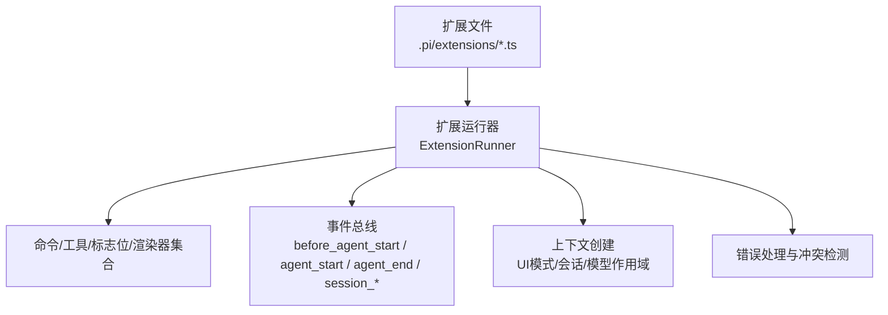
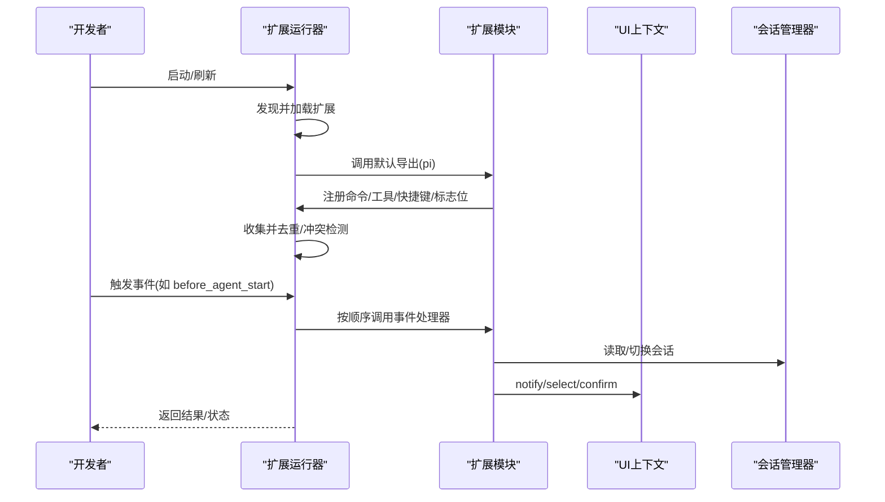
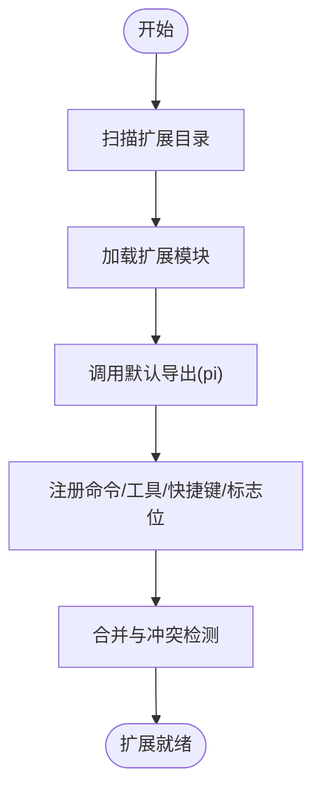
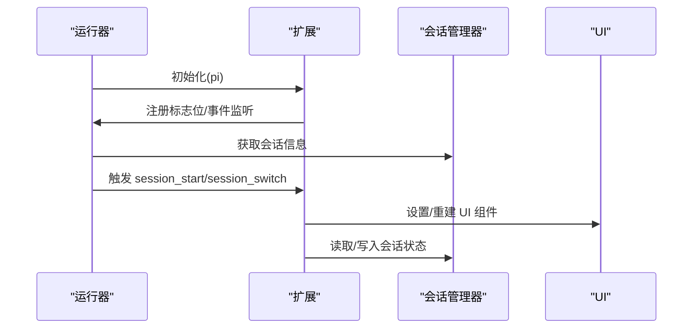
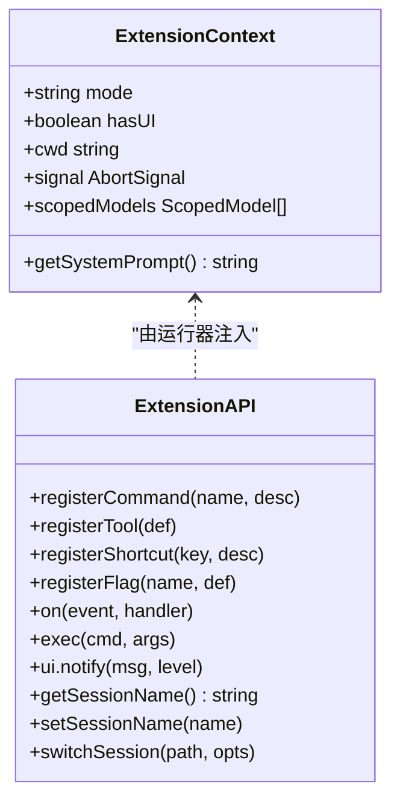
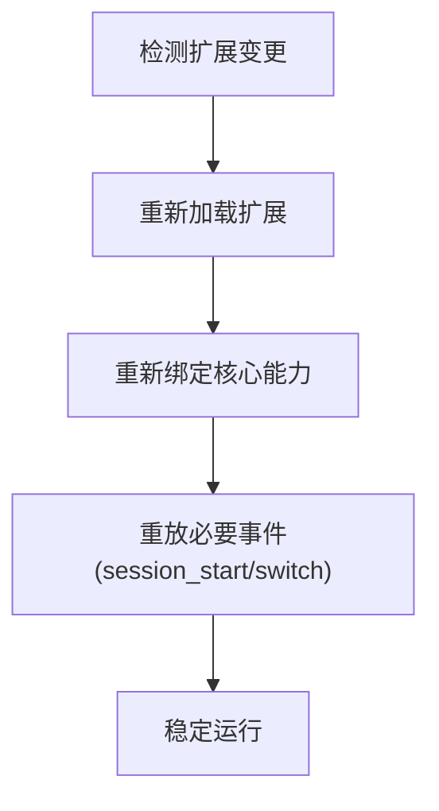
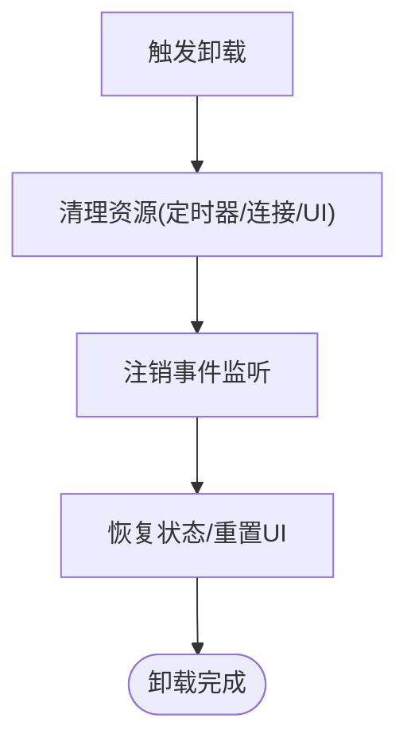
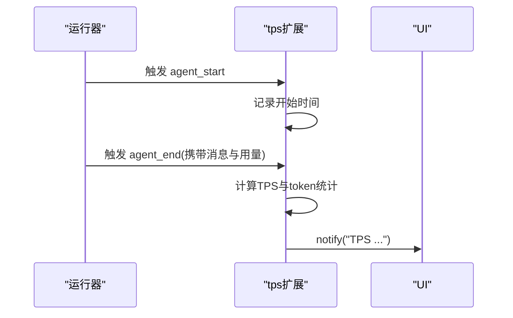
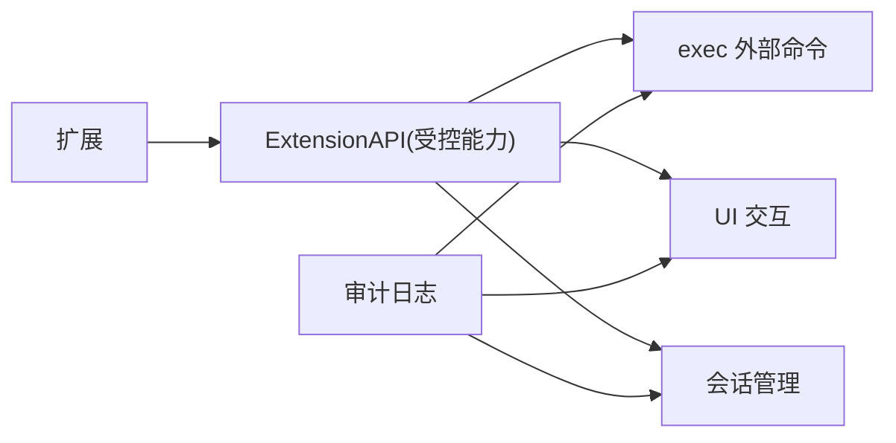
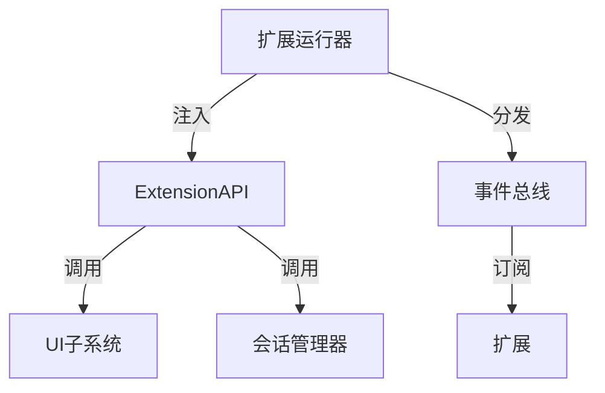

# 扩展生命周期管理

<cite>
**本文引用的文件**
- [extensions-runner.test.ts](file://packages/coding-agent/test/extensions-runner.test.ts)
- [import-repro.ts](file://.pi/extensions/import-repro.ts)
- [prompt-url-widget.ts](file://.pi/extensions/prompt-url-widget.ts)
- [redraws.ts](file://.pi/extensions/redraws.ts)
- [tps.ts](file://.pi/extensions/tps.ts)
</cite>

## 目录
1. [简介](#简介)
2. [项目结构](#项目结构)
3. [核心组件](#核心组件)
4. [架构总览](#架构总览)
5. [详细组件分析](#详细组件分析)
6. [依赖关系分析](#依赖关系分析)
7. [性能考虑](#性能考虑)
8. [故障排查指南](#故障排查指南)
9. [结论](#结论)
10. [附录](#附录)

## 简介
本文件围绕“扩展生命周期管理”展开，系统化说明扩展的加载机制、初始化流程、执行上下文、热重载、卸载清理、监控诊断与安全沙箱。内容基于仓库中扩展运行器与示例扩展的实现与测试用例进行归纳，帮助读者理解从发现、加载、绑定到事件驱动执行的完整生命周期，以及如何在安全边界内扩展系统能力。

## 项目结构
- 扩展位于 .pi/extensions 目录下，每个扩展以默认导出函数形式暴露，接收 ExtensionAPI 并注册命令、工具、快捷键、消息渲染器等能力。
- 扩展运行器（ExtensionRunner）负责：
  - 发现与加载扩展
  - 收集命令、工具、标志位、渲染器、快捷键等
  - 创建扩展上下文（含 UI 模式、会话、模型作用域等）
  - 分发事件（如 before_agent_start、agent_start/end、session_* 等）
  - 错误处理与冲突检测（如快捷键冲突、命令重复）
- 测试覆盖了运行器的关键行为：命令/工具收集、快捷键冲突、上下文创建、错误监听、事件链式处理等。

**章节来源**
- [extensions-runner.test.ts:10-22](file://packages/coding-agent/test/extensions-runner.test.ts#L10-L22)
- [extensions-runner.test.ts:105-118](file://packages/coding-agent/test/extensions-runner.test.ts#L105-L118)
- [extensions-runner.test.ts:503-564](file://packages/coding-agent/test/extensions-runner.test.ts#L503-L564)

## 核心组件
- 扩展运行器（ExtensionRunner）
  - 职责：统一编排扩展的发现、加载、注册、事件分发、上下文构建与错误处理。
  - 关键点：支持命令/工具/标志位/渲染器的收集；提供 getCommand/getMessageRenderer/getEntryRenderer 等查询接口；维护快捷键映射并检测冲突；通过 bindCore 注入核心能力（如模型作用域、信号、系统提示等）。
- 扩展 API（ExtensionAPI）
  - 职责：向扩展暴露的能力集，包括 registerCommand/registerTool/registerShortcut/registerFlag、on 事件订阅、exec 外部命令调用、UI 交互（notify/select/confirm）、会话管理（getSessionName/setSessionName、switchSession）等。
- 扩展上下文（ExtensionContext）
  - 职责：为扩展提供运行时环境，包含 UI 模式（print/rpc/tui）、是否具备 UI、当前工作目录、会话管理器、模型作用域、中断信号、系统提示读取等。

**章节来源**
- [extensions-runner.test.ts:105-118](file://packages/coding-agent/test/extensions-runner.test.ts#L105-L118)
- [extensions-runner.test.ts:503-564](file://packages/coding-agent/test/extensions-runner.test.ts#L503-L564)
- [extensions-runner.test.ts:567-593](file://packages/coding-agent/test/extensions-runner.test.ts#L567-L593)

## 架构总览
下图展示扩展从加载到执行的典型流程，以及运行器如何协调事件与上下文。

**图表来源**
- [extensions-runner.test.ts:105-118](file://packages/coding-agent/test/extensions-runner.test.ts#L105-L118)
- [extensions-runner.test.ts:503-564](file://packages/coding-agent/test/extensions-runner.test.ts#L503-L564)
- [extensions-runner.test.ts:716-758](file://packages/coding-agent/test/extensions-runner.test.ts#L716-L758)

## 详细组件分析

### 扩展加载机制
- 动态模块加载
  - 运行器在指定目录发现扩展文件并加载，随后调用其默认导出函数完成初始化。
  - 测试覆盖多扩展同时加载、命令/工具/标志位的合并与冲突处理。
- 依赖解析
  - 扩展通过 import 引入类型与工具（如 TUI 组件、AI 消息类型），由宿主环境提供运行时依赖。
  - 运行器将核心能力（如 exec、UI、会话管理）通过 ExtensionAPI 注入，避免扩展直接耦合内部实现。
- 版本兼容性检查
  - 当前代码未显式实现扩展版本约束；建议通过扩展元数据或约定命名/版本号进行兼容治理。

**图表来源**
- [extensions-runner.test.ts:105-118](file://packages/coding-agent/test/extensions-runner.test.ts#L105-L118)
- [extensions-runner.test.ts:368-428](file://packages/coding-agent/test/extensions-runner.test.ts#L368-L428)
- [extensions-runner.test.ts:430-500](file://packages/coding-agent/test/extensions-runner.test.ts#L430-L500)
- [extensions-runner.test.ts:645-713](file://packages/coding-agent/test/extensions-runner.test.ts#L645-L713)

**章节来源**
- [extensions-runner.test.ts:105-118](file://packages/coding-agent/test/extensions-runner.test.ts#L105-L118)
- [extensions-runner.test.ts:368-428](file://packages/coding-agent/test/extensions-runner.test.ts#L368-L428)
- [extensions-runner.test.ts:430-500](file://packages/coding-agent/test/extensions-runner.test.ts#L430-L500)
- [extensions-runner.test.ts:645-713](file://packages/coding-agent/test/extensions-runner.test.ts#L645-L713)

### 扩展初始化流程
- 配置验证
  - 扩展可通过 registerFlag 声明可配置项，运行器收集并在运行时提供值。
- 资源准备
  - 扩展可在初始化阶段建立必要的缓存或订阅事件（如 TPS 统计、TUI 重绘统计）。
- 状态同步
  - 通过 on("session_start"/"session_switch") 重建 UI 或恢复状态（如 prompt-url-widget 根据会话消息重建提示面板）。

**图表来源**
- [extensions-runner.test.ts:645-713](file://packages/coding-agent/test/extensions-runner.test.ts#L645-L713)
- [prompt-url-widget.ts:220-269](file://.pi/extensions/prompt-url-widget.ts#L220-L269)

**章节来源**
- [extensions-runner.test.ts:645-713](file://packages/coding-agent/test/extensions-runner.test.ts#L645-L713)
- [prompt-url-widget.ts:220-269](file://.pi/extensions/prompt-url-widget.ts#L220-L269)

### 扩展执行上下文
- 作用域隔离
  - 每个扩展在独立模块上下文中执行，通过 ExtensionAPI 访问共享能力，避免全局污染。
- 内存管理
  - 扩展通过事件订阅与回调持有引用；应确保在适当时机注销监听以避免泄漏。
- 事件监听
  - 支持 before_agent_start、agent_start、agent_end、session_start、session_switch、project_trust 等事件；支持链式修改（如 systemPrompt、tool_result 内容拼接）。

**图表来源**
- [extensions-runner.test.ts:503-564](file://packages/coding-agent/test/extensions-runner.test.ts#L503-L564)
- [extensions-runner.test.ts:716-758](file://packages/coding-agent/test/extensions-runner.test.ts#L716-L758)

**章节来源**
- [extensions-runner.test.ts:503-564](file://packages/coding-agent/test/extensions-runner.test.ts#L503-L564)
- [extensions-runner.test.ts:716-758](file://packages/coding-agent/test/extensions-runner.test.ts#L716-L758)

### 扩展的热重载机制
- 代码更新检测
  - 运行器在刷新时重新发现并加载扩展，替换旧实例。
- 状态迁移
  - 通过 session_start/session_switch 事件重建 UI 与状态，保证新实例无缝接管。
- 无缝切换
  - 命令/工具/快捷键在合并阶段去重与冲突检测，避免重复注册导致的行为异常。

**图表来源**
- [extensions-runner.test.ts:105-118](file://packages/coding-agent/test/extensions-runner.test.ts#L105-L118)
- [prompt-url-widget.ts:220-269](file://.pi/extensions/prompt-url-widget.ts#L220-L269)

**章节来源**
- [extensions-runner.test.ts:105-118](file://packages/coding-agent/test/extensions-runner.test.ts#L105-L118)
- [prompt-url-widget.ts:220-269](file://.pi/extensions/prompt-url-widget.ts#L220-L269)

### 扩展的卸载与清理流程
- 资源释放
  - 扩展应在不再需要时主动释放定时器、关闭连接、移除 UI 组件等。
- 事件注销
  - 通过停止监听或取消订阅来避免残留回调。
- 状态恢复
  - 在 session_switch 或卸载前恢复 UI 与状态，避免脏数据残留。

[本节为通用流程说明，不直接分析具体文件]

### 扩展的监控与诊断
- 性能指标收集
  - tps 扩展在 agent_start/agent_end 之间计算输出速率与 token 用量，并通过 UI 通知。
  - redraws 扩展通过自定义 UI 回调获取全量重绘次数，辅助定位渲染瓶颈。
- 错误追踪
  - 运行器提供 onError 钩子，捕获扩展处理器抛出的异常，便于集中上报与调试。
- 日志分析
  - 扩展可使用 ctx.ui.notify 输出结构化信息，结合运行期日志进行分析。

**图表来源**
- [tps.ts:10-47](file://.pi/extensions/tps.ts#L10-L47)
- [extensions-runner.test.ts:567-593](file://packages/coding-agent/test/extensions-runner.test.ts#L567-L593)

**章节来源**
- [tps.ts:10-47](file://.pi/extensions/tps.ts#L10-L47)
- [extensions-runner.test.ts:567-593](file://packages/coding-agent/test/extensions-runner.test.ts#L567-L593)

### 扩展的安全沙箱
- 权限控制
  - 扩展通过 ExtensionAPI 受限访问系统能力（如 exec 外部命令、UI 交互、会话操作），避免直接访问敏感 API。
- 资源限制
  - 建议在运行器层面对 CPU/内存/网络请求进行配额与超时控制，防止恶意或低质量扩展影响稳定性。
- 访问审计
  - 对关键操作（exec、switchSession、setSessionName）进行审计日志记录，便于追溯与合规。

[本节为通用安全设计说明，不直接分析具体文件]

## 依赖关系分析
- 扩展与运行器
  - 扩展通过 ExtensionAPI 与运行器解耦；运行器负责生命周期管理与能力注入。
- 扩展与 UI/会话
  - 扩展通过 ctx.ui 与 ctx.sessionManager 与 UI 和会话子系统交互。
- 事件流
  - 运行器在关键节点触发事件，扩展通过 pi.on 订阅并参与处理链。

**图表来源**
- [extensions-runner.test.ts:503-564](file://packages/coding-agent/test/extensions-runner.test.ts#L503-L564)
- [prompt-url-widget.ts:220-269](file://.pi/extensions/prompt-url-widget.ts#L220-L269)

**章节来源**
- [extensions-runner.test.ts:503-564](file://packages/coding-agent/test/extensions-runner.test.ts#L503-L564)
- [prompt-url-widget.ts:220-269](file://.pi/extensions/prompt-url-widget.ts#L220-L269)

## 性能考虑
- 事件处理链应避免阻塞主线程，必要时采用异步与批处理。
- 减少不必要的 UI 重绘，利用 redraws 扩展定位热点。
- 合理拆分扩展功能，降低单扩展复杂度，提升可维护性与性能。

[本节为通用性能建议，不直接分析具体文件]

## 故障排查指南
- 常见问题
  - 快捷键冲突：运行器会发出警告并阻止冲突键注册，需调整键位或扩展名。
  - 命令重复：同名命令会被追加序号，注意调用方式。
  - 处理器异常：通过 onError 捕获并定位抛出异常的扩展与事件。
- 定位步骤
  - 使用 run 的 onError 钩子收集错误堆栈。
  - 借助 UI notify 输出中间状态与参数。
  - 通过 session 事件与消息渲染器定位状态不一致问题。

**章节来源**
- [extensions-runner.test.ts:160-366](file://packages/coding-agent/test/extensions-runner.test.ts#L160-L366)
- [extensions-runner.test.ts:567-593](file://packages/coding-agent/test/extensions-runner.test.ts#L567-L593)

## 结论
本仓库通过扩展运行器实现了可扩展、可观测、可治理的扩展生命周期管理。扩展以最小权限接入系统，通过事件驱动与上下文隔离保障稳定性；运行器提供统一的发现、加载、注册、冲突检测与错误处理能力。配合示例扩展（tps、redraws、prompt-url-widget、import-repro），展示了监控、诊断与用户交互的最佳实践。未来可在版本兼容、资源限制与审计方面进一步增强，以提升安全性与可运维性。

## 附录
- 示例扩展概览
  - import-repro：导入并切换 CI 分享会话，演示会话管理与 UI 交互。
  - prompt-url-widget：解析 GitHub PR/Issue/Advisory 链接，动态显示元数据并自动设置会话名。
  - redraws：统计 TUI 全量重绘次数，辅助性能优化。
  - tps：统计代理响应速度与 token 用量，提供实时反馈。

**章节来源**
- [import-repro.ts:283-351](file://.pi/extensions/import-repro.ts#L283-L351)
- [prompt-url-widget.ts:172-269](file://.pi/extensions/prompt-url-widget.ts#L172-L269)
- [redraws.ts:10-24](file://.pi/extensions/redraws.ts#L10-L24)
- [tps.ts:10-47](file://.pi/extensions/tps.ts#L10-L47)