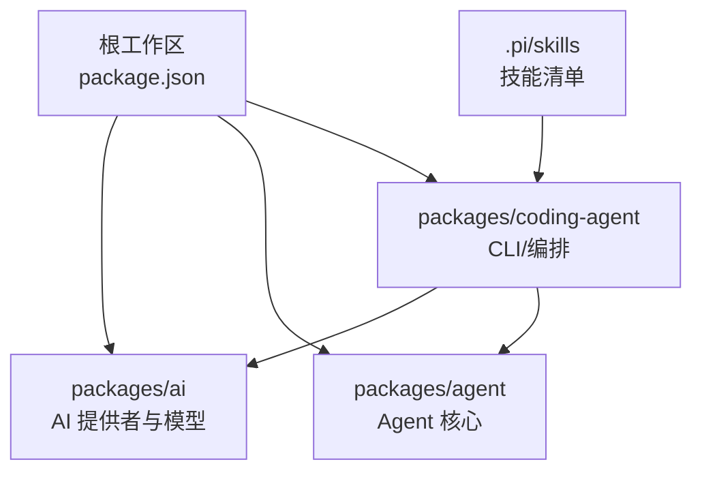
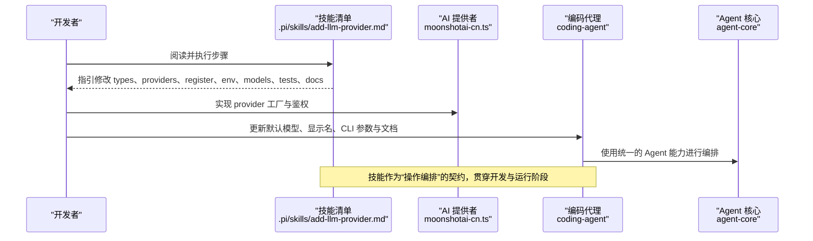
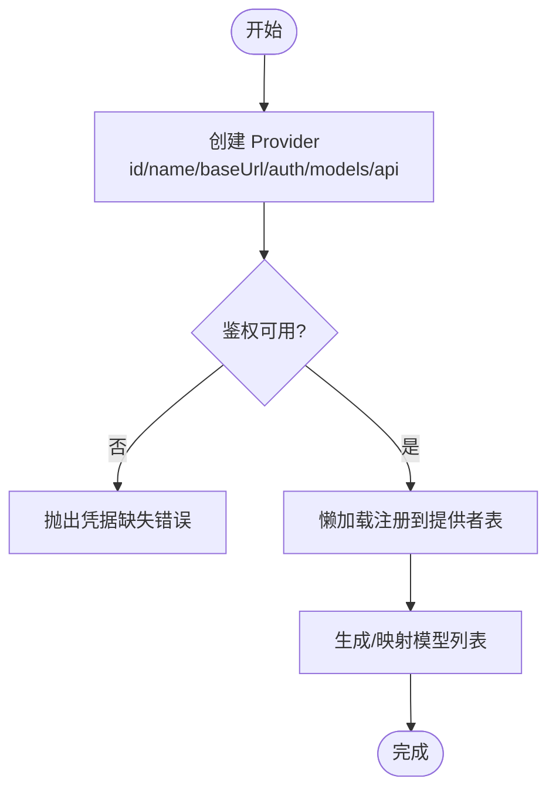
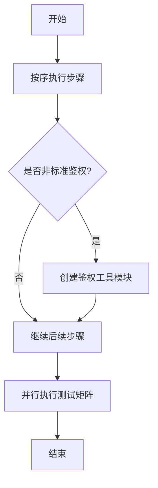
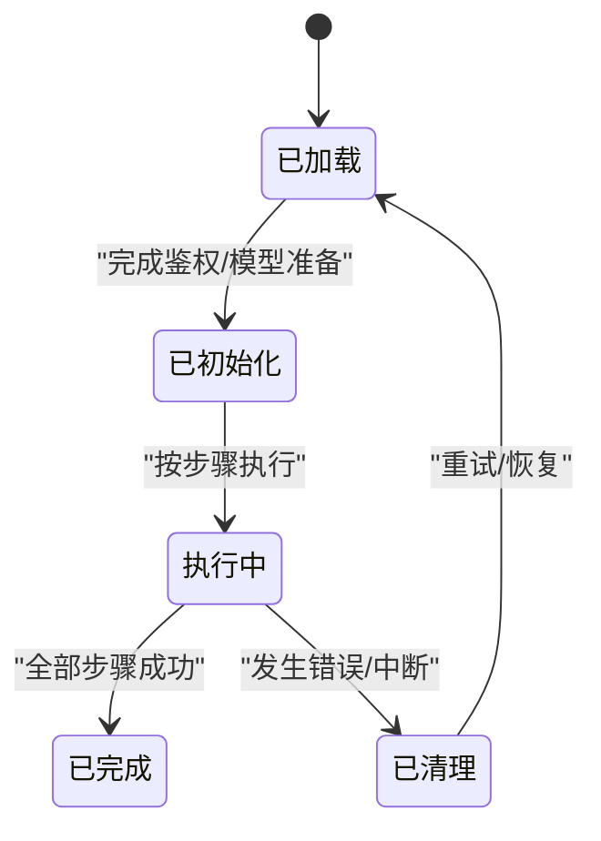
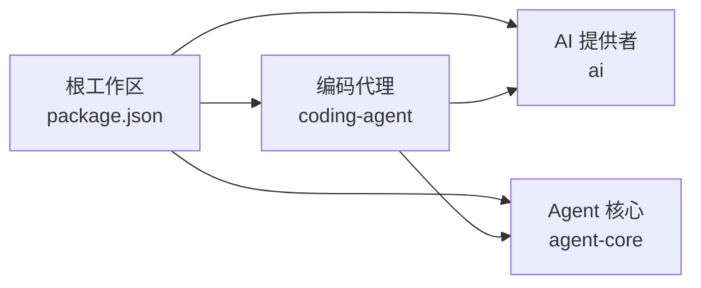

# 技能系统

<cite>
**本文引用的文件**
- [根包配置 package.json](file://package.json)
- [AI 提供者实现 moonshotai-cn.ts](file://packages/ai/src/providers/moonshotai-cn.ts)
- [添加 LLM 提供者的技能清单 add-llm-provider.md](file://.pi/skills/add-llm-provider.md)
- [Agent 核心包配置 agent/package.json](file://packages/agent/package.json)
- [编码代理包配置 coding-agent/package.json](file://packages/coding-agent/package.json)
</cite>

## 目录
1. [简介](#简介)
2. [项目结构](#项目结构)
3. [核心组件](#核心组件)
4. [架构总览](#架构总览)
5. [详细组件分析](#详细组件分析)
6. [依赖关系分析](#依赖关系分析)
7. [性能考量](#性能考量)
8. [故障排查指南](#故障排查指南)
9. [结论](#结论)
10. [附录](#附录)

## 简介
本文件为“技能系统”的权威文档，聚焦于技能的定义格式、工作流编排机制、生命周期管理、开发最佳实践、示例场景、测试验证方法以及发布分发机制。该仓库采用多包（monorepo）组织，技能以 Markdown/YAML 清单形式存在，并通过编码代理与 AI 能力进行编排执行。

## 项目结构
- 根级 monorepo 通过 workspaces 聚合多个子包，统一构建、测试与发布流程。
- 技能位于 .pi/skills 目录下，当前包含一个用于“新增 LLM 提供者”的技能清单，定义了从类型到注册、模型生成、测试矩阵、编码代理集成与文档更新的完整步骤。
- 关键包职责：
  - packages/ai：LLM 提供者抽象与实现、模型注册、鉴权与流式调用。
  - packages/agent：通用 Agent 核心，负责状态管理、传输抽象与附件支持。
  - packages/coding-agent：CLI 与模式编排入口，承载技能加载与执行上下文。

**图示来源**
- [根包配置 package.json:1-13](file://package.json#L1-L13)
- [编码代理包配置 coding-agent/package.json:6-11](file://packages/coding-agent/package.json#L6-L11)

**章节来源**
- [根包配置 package.json:1-13](file://package.json#L1-L13)
- [.pi/skills/add-llm-provider.md:1-58](file://.pi/skills/add-llm-provider.md#L1-L58)

## 核心组件
- 技能清单（YAML front matter + Markdown 步骤）：描述技能名称、描述与可执行步骤，作为人类或智能体遵循的操作手册。
- 提供者工厂与注册：通过 createProvider 构造 Provider，并在注册表中懒加载注册，避免冷启动开销。
- 鉴权与模型：集中处理 API Key 等凭据检测；模型列表由脚本生成并映射为标准 Model 接口。
- 编码代理集成：在 CLI 层暴露登录、模型解析、环境变量说明与文档更新点。

**章节来源**
- [.pi/skills/add-llm-provider.md:10-52](file://.pi/skills/add-llm-provider.md#L10-L52)
- [AI 提供者实现 moonshotai-cn.ts:1-15](file://packages/ai/src/providers/moonshotai-cn.ts#L1-L15)

## 架构总览
下图展示了“新增 LLM 提供者”这一典型技能在工作流中的角色与交互：技能清单驱动开发者完成类型、实现、注册、模型生成、测试与文档更新；编码代理在运行时加载技能并引导执行。

**图示来源**
- [.pi/skills/add-llm-provider.md:10-52](file://.pi/skills/add-llm-provider.md#L10-L52)
- [AI 提供者实现 moonshotai-cn.ts:1-15](file://packages/ai/src/providers/moonshotai-cn.ts#L1-L15)
- [编码代理包配置 coding-agent/package.json:6-11](file://packages/coding-agent/package.json#L6-L11)

## 详细组件分析

### 技能清单（YAML/JSON 配置文件结构与元数据）
- 位置与格式：位于 .pi/skills 下的 Markdown 文件，首段 YAML front matter 包含 name、description 等元数据。
- 作用：作为“技能”的可读规范，指导开发者按步骤完成新增 LLM 提供者的全部变更。
- 扩展性：可通过增加新的 Markdown 技能文件来覆盖不同领域的工作流（如代码审查、自动化部署、测试生成）。

**章节来源**
- [.pi/skills/add-llm-provider.md:1-8](file://.pi/skills/add-llm-provider.md#L1-L8)

### 提供者实现与注册（依赖声明与懒加载）
- 提供者工厂：通过 createProvider 返回 Provider，声明 id、name、baseUrl、auth、models、api 等元数据与依赖。
- 鉴权：使用 envApiKeyAuth 读取环境变量，确保凭据安全注入。
- 懒注册：在注册表中使用懒加载包装器，避免静态导入带来的冷启动成本。
- 模型生成：通过脚本拉取并标准化模型信息，便于 UI 与工具链消费。

**图示来源**
- [AI 提供者实现 moonshotai-cn.ts:1-15](file://packages/ai/src/providers/moonshotai-cn.ts#L1-L15)
- [.pi/skills/add-llm-provider.md:17-37](file://.pi/skills/add-llm-provider.md#L17-L37)

**章节来源**
- [AI 提供者实现 moonshotai-cn.ts:1-15](file://packages/ai/src/providers/moonshotai-cn.ts#L1-L15)
- [.pi/skills/add-llm-provider.md:17-37](file://.pi/skills/add-llm-provider.md#L17-L37)

### 工作流编排机制（任务序列、条件分支、并行能力）
- 任务序列：技能清单以有序步骤组织复杂任务，保证变更顺序正确。
- 条件分支：根据环境差异（如非标准鉴权）引入分支逻辑（例如创建专用工具模块）。
- 并行能力：在测试矩阵中，可对多种模型/提供者组合并行执行用例，提升覆盖率与回归速度。

**图示来源**
- [.pi/skills/add-llm-provider.md:39-44](file://.pi/skills/add-llm-provider.md#L39-L44)

**章节来源**
- [.pi/skills/add-llm-provider.md:39-44](file://.pi/skills/add-llm-provider.md#L39-L44)

### 生命周期管理（加载、初始化、执行、清理）
- 加载：编码代理在启动时扫描 .pi/skills 下的技能清单，建立可执行索引。
- 初始化：按需加载提供者与模型，完成鉴权校验与环境准备。
- 执行：依据技能步骤驱动开发者或智能体完成变更，必要时调用 Agent 核心能力。
- 清理：在失败或中断时回滚临时变更，保持仓库一致性。

[本节为概念性说明，不直接分析具体文件]

### 技能开发最佳实践
- 模块化设计：将类型、提供者、注册、模型生成、测试与文档更新拆分为独立步骤，降低耦合。
- 错误处理：对鉴权失败、网络异常、模型缺失等场景给出明确提示与修复建议。
- 日志记录：在关键路径输出结构化日志，便于定位问题。
- 性能优化：使用懒加载、增量构建与缓存策略减少冷启动与重复计算。

**章节来源**
- [.pi/skills/add-llm-provider.md:10-52](file://.pi/skills/add-llm-provider.md#L10-L52)

### 实际应用场景示例
- 代码审查技能：定义 PR 检查清单、规则集与报告模板，驱动自动化审查流程。
- 自动化部署技能：编排构建、打包、镜像推送、灰度发布与回滚步骤。
- 测试生成技能：基于变更范围自动生成单测骨架与断言，纳入测试矩阵并行执行。

[本节为概念性说明，不直接分析具体文件]

## 依赖关系分析
- 根工作区通过 workspaces 统一管理依赖与构建脚本。
- 编码代理依赖 AI 与 Agent 核心，形成“编排—能力—执行”的分层依赖。
- 技能清单作为“契约”，约束各包的变更边界与协作方式。

**图示来源**
- [根包配置 package.json:1-13](file://package.json#L1-L13)
- [编码代理包配置 coding-agent/package.json:45-66](file://packages/coding-agent/package.json#L45-L66)
- [Agent 核心包配置 agent/package.json:37-44](file://packages/agent/package.json#L37-L44)

**章节来源**
- [根包配置 package.json:1-13](file://package.json#L1-L13)
- [编码代理包配置 coding-agent/package.json:45-66](file://packages/coding-agent/package.json#L45-L66)
- [Agent 核心包配置 agent/package.json:37-44](file://packages/agent/package.json#L37-L44)

## 性能考量
- 懒加载提供者：避免不必要的模块加载，缩短启动时间。
- 模型数据生成：集中化生成与缓存，减少重复网络请求与解析开销。
- 测试矩阵并行：利用并发执行提升回归效率，同时控制并发度以避免资源争用。
- 构建产物裁剪：仅发布必要文件，减小包体积。

[本节为通用性能建议，不直接分析具体文件]

## 故障排查指南
- 鉴权失败：检查环境变量与凭据注入逻辑，确认 envApiKeyAuth 的配置项是否正确。
- 模型未生效：确认模型生成脚本是否运行成功，且注册表已刷新。
- 步骤执行中断：查看技能清单中的分支逻辑，定位失败步骤并回滚临时变更。
- 依赖冲突：使用根级脚本进行依赖锁定与一致性检查，避免版本漂移。

**章节来源**
- [.pi/skills/add-llm-provider.md:27-33](file://.pi/skills/add-llm-provider.md#L27-L33)
- [根包配置 package.json:18-28](file://package.json#L18-L28)

## 结论
技能系统将“操作编排”与“代码实现”解耦，通过标准化的清单与提供者抽象，使新增能力（如 LLM 提供者）具备可追溯、可测试、可发布的工程化能力。结合编码代理与 Agent 核心，可实现从开发到运行的全链路自动化。

[本节为总结性内容，不直接分析具体文件]

## 附录
- 快速上手：
  - 阅读 .pi/skills/add-llm-provider.md，按步骤完成新增提供者。
  - 在编码代理中执行相关命令，验证模型与鉴权。
- 扩展技能：
  - 在 .pi/skills 下新增 Markdown 技能文件，定义目标、步骤与验收标准。
  - 在编码代理中注册新技能入口，完善 CLI 帮助与文档。

[本节为补充说明，不直接分析具体文件]