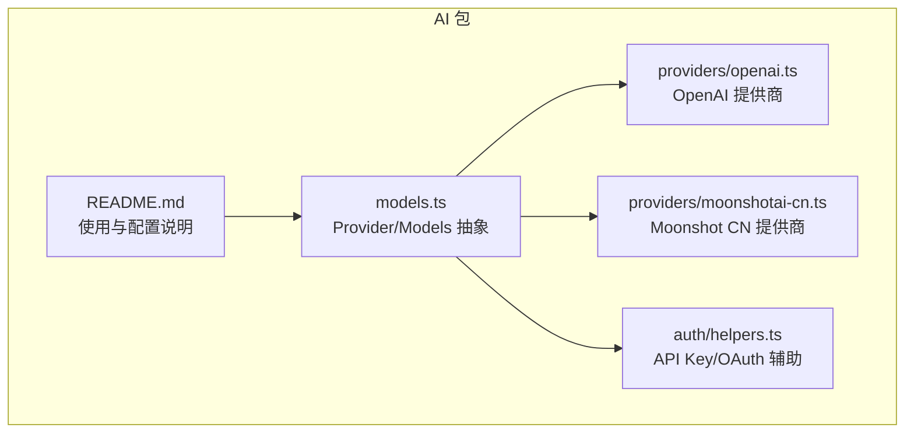
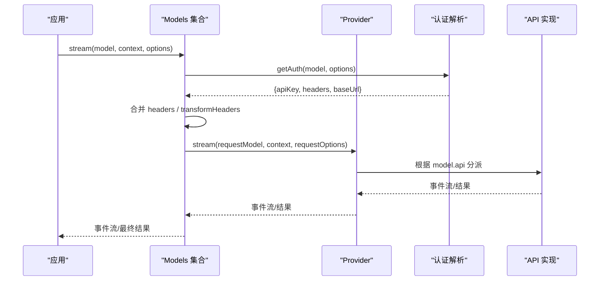
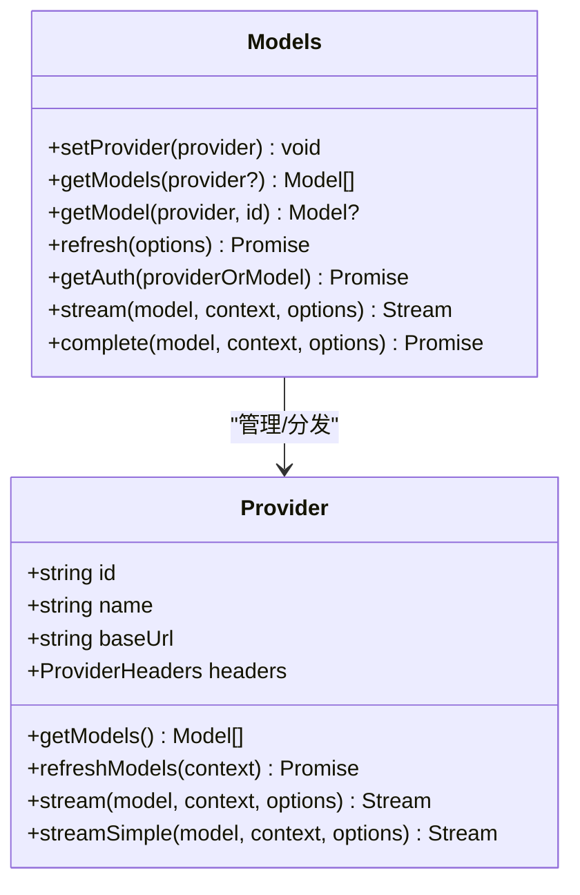
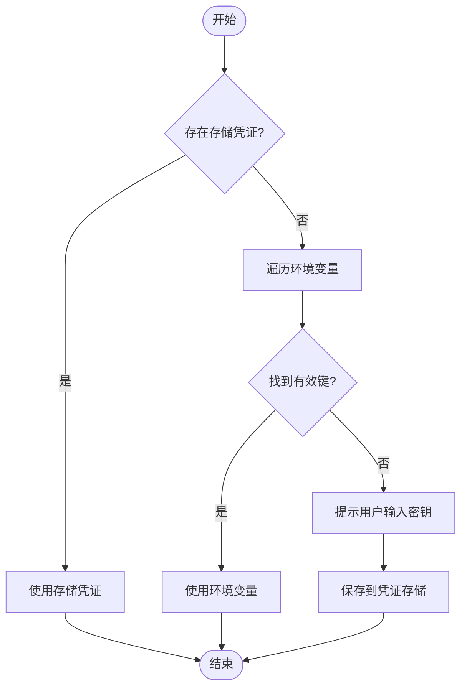
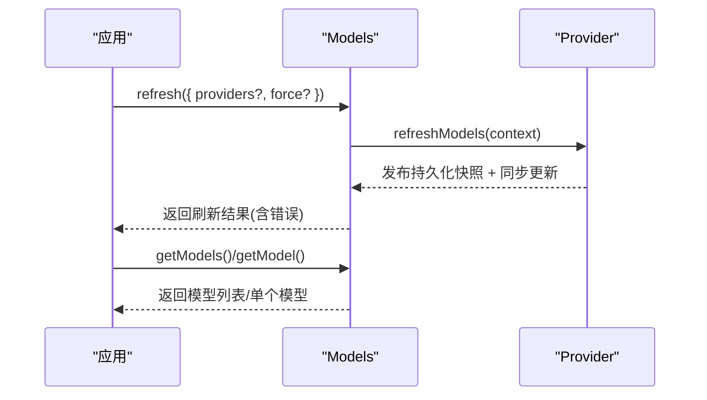
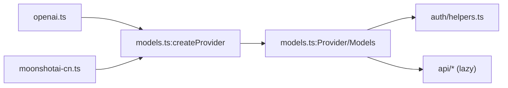

# 提供商集成

<cite>
**本文引用的文件**
- [README.md](file://packages/ai/README.md)
- [models.ts](file://packages/ai/src/models.ts)
- [openai.ts](file://packages/ai/src/providers/openai.ts)
- [moonshotai-cn.ts](file://packages/ai/src/providers/moonshotai-cn.ts)
- [helpers.ts](file://packages/ai/src/auth/helpers.ts)
</cite>

## 目录
1. [简介](#简介)
2. [项目结构](#项目结构)
3. [核心组件](#核心组件)
4. [架构总览](#架构总览)
5. [详细组件分析](#详细组件分析)
6. [依赖关系分析](#依赖关系分析)
7. [性能考虑](#性能考虑)
8. [故障排除指南](#故障排除指南)
9. [结论](#结论)
10. [附录：从零实现新提供商的完整步骤](#附录从零实现新提供商的完整步骤)

## 简介
本指南面向希望为系统接入新的 AI 服务提供商的开发者。内容围绕统一接口抽象、连接与认证管理、模型发现与选择、错误映射、安全与性能优化，以及调试与故障排除展开。通过阅读本指南，你将理解提供商适配器的设计原则，并掌握从零开始集成一个新提供商的完整流程。

## 项目结构
本项目采用多包（monorepo）组织，AI 能力集中在 packages/ai 中，提供统一的 LLM 调用抽象、提供商集合、认证解析、流式事件与工具调用等能力。内置多个提供商工厂，每个工厂负责其模型目录、认证方式与 API 实现的分发。

图表来源
- [models.ts:88-149](file://packages/ai/src/models.ts#L88-L149)
- [openai.ts:1-16](file://packages/ai/src/providers/openai.ts#L1-L16)
- [moonshotai-cn.ts:1-15](file://packages/ai/src/providers/moonshotai-cn.ts#L1-L15)
- [helpers.ts:1-60](file://packages/ai/src/auth/helpers.ts#L1-L60)
- [README.md:230-322](file://packages/ai/README.md#L230-L322)

章节来源
- [README.md:230-322](file://packages/ai/README.md#L230-L322)

## 核心组件
- Provider 抽象：定义提供商的统一运行时单元，包含 id/name/baseUrl/headers、认证、模型列表、流式接口等。
- Models 集合：聚合多个 Provider，负责认证解析、请求头合并、分发到具体 Provider 执行。
- 认证辅助：提供标准 API Key 与环境变量解析、懒加载 OAuth 封装。
- 提供商工厂：以最小依赖注册一个提供商及其模型目录和 API 实现。

章节来源
- [models.ts:88-149](file://packages/ai/src/models.ts#L88-L149)
- [models.ts:254-737](file://packages/ai/src/models.ts#L254-L737)
- [helpers.ts:1-60](file://packages/ai/src/auth/helpers.ts#L1-L60)

## 架构总览
下图展示了从应用调用到提供商执行的端到端流程，包括认证解析、请求头合并、按模型 API 类型分发到具体实现。

图表来源
- [models.ts:636-737](file://packages/ai/src/models.ts#L636-L737)
- [openai.ts:1-16](file://packages/ai/src/providers/openai.ts#L1-L16)

## 详细组件分析

### 统一接口抽象与连接管理
- Provider 接口：集中声明提供商元数据、认证、模型列表、刷新策略与流式接口。
- Models 集合：维护 Provider 注册表、并发刷新、认证解析、请求头合并、分发到 Provider 执行。
- 动态模型刷新：支持 provider.refreshModels，结合持久化存储与同步更新回调，保证模型列表一致性。

图表来源
- [models.ts:88-149](file://packages/ai/src/models.ts#L88-L149)
- [models.ts:254-737](file://packages/ai/src/models.ts#L254-L737)

章节来源
- [models.ts:88-149](file://packages/ai/src/models.ts#L88-L149)
- [models.ts:254-737](file://packages/ai/src/models.ts#L254-L737)

### 认证处理
- 标准 API Key：优先使用已存储凭证，其次读取环境变量；支持交互式登录保存密钥。
- OAuth 懒加载：将 Node-only 的 OAuth 流程延迟到首次调用时加载，避免污染浏览器打包产物。
- 认证解析顺序：provider auth -> model.headers -> 显式 options.headers -> transformHeaders。

图表来源
- [helpers.ts:1-60](file://packages/ai/src/auth/helpers.ts#L1-L60)
- [models.ts:636-665](file://packages/ai/src/models.ts#L636-L665)

章节来源
- [helpers.ts:1-60](file://packages/ai/src/auth/helpers.ts#L1-L60)
- [models.ts:636-665](file://packages/ai/src/models.ts#L636-L665)

### 模型发现与选择机制
- 静态目录：提供商工厂在 models 字段提供基础模型清单。
- 动态覆盖：通过 fetchModels 获取最新模型列表，createProvider 会合并静态与动态模型。
- 可用模型过滤：filterModels 可根据凭证进一步筛选可用模型。
- 查询与刷新：getModels/getModel 同步读取最近已知列表；refresh 可并发刷新指定或全部提供商。

图表来源
- [models.ts:338-446](file://packages/ai/src/models.ts#L338-L446)
- [models.ts:762-800](file://packages/ai/src/models.ts#L762-L800)

章节来源
- [models.ts:338-446](file://packages/ai/src/models.ts#L338-L446)
- [models.ts:762-800](file://packages/ai/src/models.ts#L762-L800)

### 错误映射与异常路径
- 未配置提供商：抛出 ModelsError 指示未配置或未找到。
- 认证失败：OAuth 刷新失败或 API Key 解析失败，分别以不同代码区分。
- 无对应 API 实现：当模型 api 类型在提供商中没有实现时，返回流错误。
- 刷新失败：collect 各提供商错误但不中断整体刷新流程。

章节来源
- [models.ts:511-520](file://packages/ai/src/models.ts#L511-L520)
- [models.ts:628-665](file://packages/ai/src/models.ts#L628-L665)
- [models.ts:781-792](file://packages/ai/src/models.ts#L781-L792)
- [models.ts:386-446](file://packages/ai/src/models.ts#L386-L446)

### 新提供商集成步骤（概览）
- 创建提供商工厂：定义 id/name/baseUrl/auth/models/api。
- 封装 API 客户端：复用现有 API 实现或通过 createProvider 的 api 映射分派。
- 消息格式转换：由 API 实现负责将统一上下文转换为提供商协议。
- 错误映射：将提供商错误映射为统一错误类型，便于上层处理。
- 模型目录：提供静态模型清单，必要时实现动态刷新。
- 认证：使用 envApiKeyAuth 或自定义 ApiKeyAuth/OAuthAuth。

章节来源
- [openai.ts:1-16](file://packages/ai/src/providers/openai.ts#L1-L16)
- [moonshotai-cn.ts:1-15](file://packages/ai/src/providers/moonshotai-cn.ts#L1-L15)
- [models.ts:739-800](file://packages/ai/src/models.ts#L739-L800)

## 依赖关系分析
- 提供商工厂依赖：
  - 模型目录：如 openai.models.ts、moonshotai-cn.models.ts（仅引用）。
  - API 实现：如 openai-responses.lazy.ts、openai-completions.lazy.ts（通过 lazy 导入）。
  - 认证辅助：envApiKeyAuth、lazyOAuth。
  - 提供商构建：createProvider。
- Models 集合依赖：
  - 认证解析：resolveProviderAuth、CredentialStore、AuthContext。
  - 模型存储：InMemoryModelsStore 及 ModelsStore 接口。
  - 工具函数：AbortSignal 控制、lazyStream。

图表来源
- [openai.ts:1-16](file://packages/ai/src/providers/openai.ts#L1-L16)
- [moonshotai-cn.ts:1-15](file://packages/ai/src/providers/moonshotai-cn.ts#L1-L15)
- [models.ts:739-800](file://packages/ai/src/models.ts#L739-L800)
- [helpers.ts:1-60](file://packages/ai/src/auth/helpers.ts#L1-L60)

章节来源
- [openai.ts:1-16](file://packages/ai/src/providers/openai.ts#L1-L16)
- [moonshotai-cn.ts:1-15](file://packages/ai/src/providers/moonshotai-cn.ts#L1-L15)
- [models.ts:739-800](file://packages/ai/src/models.ts#L739-L800)
- [helpers.ts:1-60](file://packages/ai/src/auth/helpers.ts#L1-L60)

## 性能考虑
- 连接与请求：
  - 使用懒加载 API 实现，仅在首次请求到相关模型时加载 SDK，减少初始体积与冷启动开销。
  - 通过 Models.stream/complete 的流式接口，降低内存占用并提升响应速度。
- 模型刷新：
  - refresh 支持并发刷新多个提供商，且对每个提供商内部进行串行化发布，避免竞态。
  - 支持 allowNetwork=false 与 force 选项，便于离线缓存与强制刷新场景。
- 头部合并与转换：
  - transformHeaders 在认证后、分发前运行一次，避免重复解析与多次网络调用。
- 建议实践：
  - 合理设置超时与取消信号，避免长尾请求阻塞资源。
  - 对高频模型启用本地缓存（如模型能力、价格、配额信息），减少重复计算。
  - 批处理工具调用与消息组装，减少往返次数。

[本节为通用性能指导，不直接分析具体文件]

## 故障排除指南
- 认证问题：
  - 检查是否已正确设置环境变量或存储凭证；可通过 getAuth 查看来源与合并后的 headers。
  - OAuth 刷新失败会保留存储凭证以便重试；重新登录可修复。
- 模型不可用：
  - 使用 getAvailable 过滤出已配置认证的模型；若仍为空，检查 filterModels 逻辑。
  - 动态模型需调用 refresh 后再查询。
- 请求失败：
  - 关注 ModelsError 的错误码与原因；确认提供商是否实现了对应 model.api。
  - 使用 transformHeaders 添加调试头（如 X-Request-ID）追踪请求链路。
- 超时与取消：
  - 为请求传入 AbortSignal，确保在 UI 取消或页面卸载时及时释放资源。

章节来源
- [models.ts:511-520](file://packages/ai/src/models.ts#L511-L520)
- [models.ts:522-542](file://packages/ai/src/models.ts#L522-L542)
- [models.ts:636-665](file://packages/ai/src/models.ts#L636-L665)
- [models.ts:781-792](file://packages/ai/src/models.ts#L781-L792)

## 结论
本指南基于仓库中的统一抽象与提供商工厂模式，阐述了如何以最小成本接入新的 AI 服务提供商。通过标准化的认证、模型发现、错误映射与流式接口，开发者可以专注于业务逻辑，而无需关心底层差异。建议在集成过程中充分利用懒加载、并发刷新与头部转换等能力，以获得更好的性能与可维护性。

## 附录：从零实现新提供商的完整步骤

### 1. 准备模型目录
- 新建或编辑提供商模型清单文件，列出模型 ID、名称、能力（文本/图像/推理）、上下文窗口、计费信息等。
- 若需要动态模型列表，实现 fetchModels 并在 createProvider 中传入。

章节来源
- [models.ts:739-800](file://packages/ai/src/models.ts#L739-L800)

### 2. 实现认证
- 若提供商使用 API Key：使用 envApiKeyAuth，并配置环境变量名。
- 若提供商使用 OAuth：使用 lazyOAuth 包装 Node-only 的 OAuth 流程，实现 login/refresh/toAuth。
- 如需特殊环境或 IAM 解析，编写自定义 ApiKeyAuth。

章节来源
- [helpers.ts:1-60](file://packages/ai/src/auth/helpers.ts#L1-L60)
- [models.ts:636-665](file://packages/ai/src/models.ts#L636-L665)

### 3. 封装 API 客户端
- 若提供商兼容 OpenAI Responses/Completions 或 Anthropic Messages，可直接复用已有 API 实现并通过 createProvider 的 api 映射分派。
- 若为私有协议，需自行实现 ProviderStreams（stream/streamSimple/fetchDeferred/cancelDeferred），并将消息格式转换为提供商协议。

章节来源
- [openai.ts:1-16](file://packages/ai/src/providers/openai.ts#L1-L16)
- [moonshotai-cn.ts:1-15](file://packages/ai/src/providers/moonshotai-cn.ts#L1-L15)
- [models.ts:762-800](file://packages/ai/src/models.ts#L762-L800)

### 4. 创建提供商工厂
- 使用 createProvider 组合 id/name/baseUrl/auth/models/api。
- 可选：实现 filterModels 以按凭证过滤可用模型。

章节来源
- [openai.ts:1-16](file://packages/ai/src/providers/openai.ts#L1-L16)
- [moonshotai-cn.ts:1-15](file://packages/ai/src/providers/moonshotai-cn.ts#L1-L15)
- [models.ts:739-800](file://packages/ai/src/models.ts#L739-L800)

### 5. 注册并使用
- 在应用中通过 createModels/builtinModels 注册提供商。
- 使用 getModels/getModel 查询模型，使用 stream/complete 发起请求。
- 使用 refresh 刷新动态模型列表。

章节来源
- [README.md:230-322](file://packages/ai/README.md#L230-L322)
- [models.ts:254-737](file://packages/ai/src/models.ts#L254-L737)

### 6. 错误映射与调试
- 将提供商错误映射为统一错误类型，便于上层处理。
- 使用 transformHeaders 注入调试头，配合日志定位问题。
- 通过 getAuth 检查认证状态与合并后的请求头。

章节来源
- [models.ts:636-665](file://packages/ai/src/models.ts#L636-L665)
- [models.ts:781-792](file://packages/ai/src/models.ts#L781-L792)

### 7. 安全与合规
- 妥善保管 API Key 与 OAuth 令牌，优先使用凭证存储而非硬编码。
- 在浏览器环境中避免引入 Node-only 模块，使用懒加载隔离。
- 遵循提供商的使用条款与数据隐私要求。

[本节为通用安全指导，不直接分析具体文件]

### 8. 性能优化
- 使用流式接口减少内存占用与首字节延迟。
- 合理设置超时与取消信号，避免资源泄漏。
- 批量处理工具调用与消息，减少往返次数。
- 利用模型能力缓存与本地缓存减少重复计算。

[本节为通用性能指导，不直接分析具体文件]