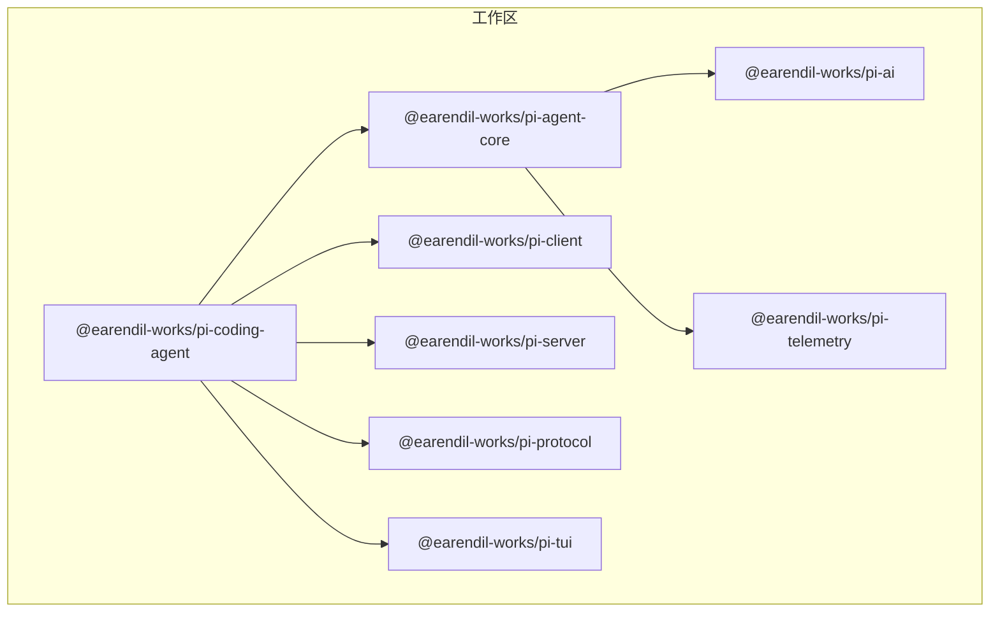
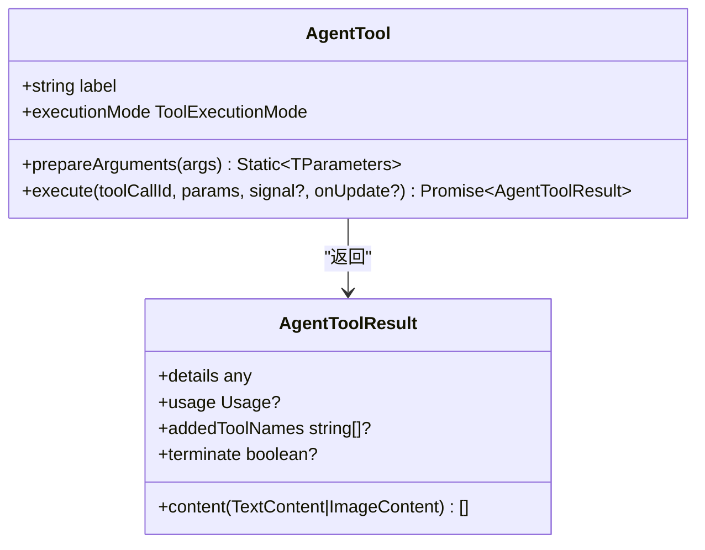
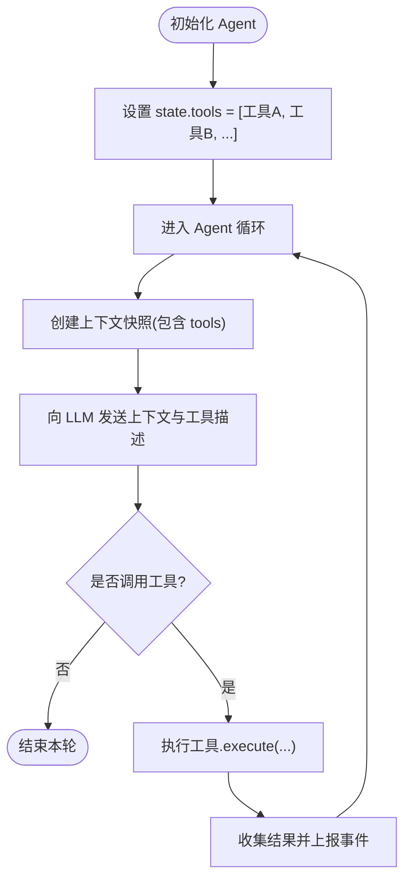
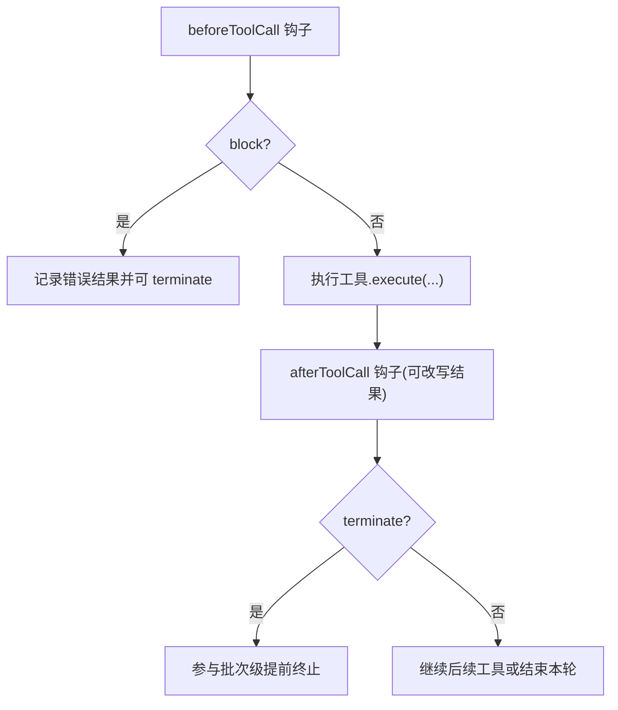
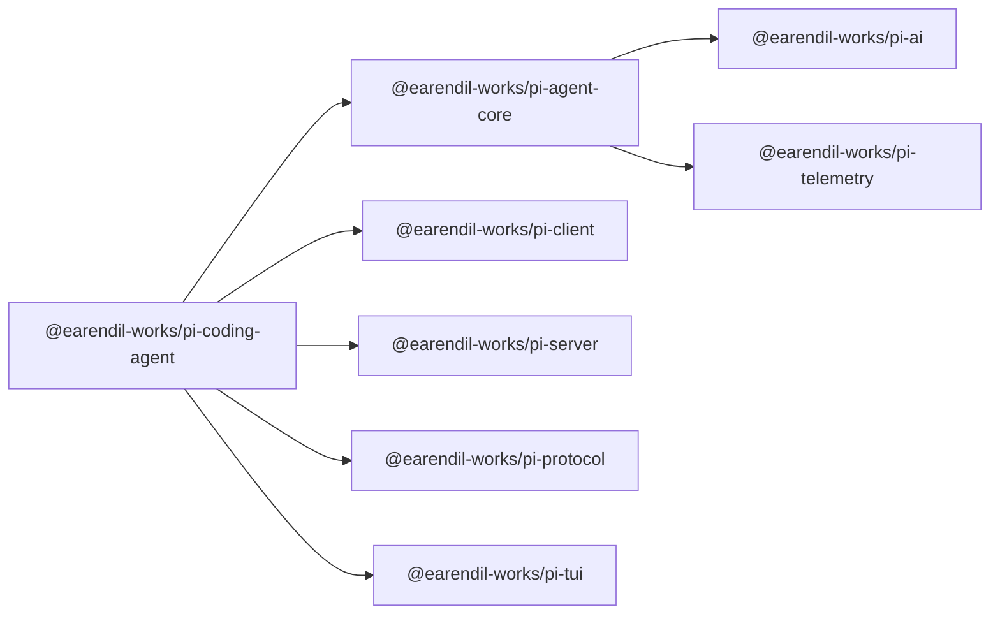

# 自定义工具开发

<cite>
**本文引用的文件**
- [README.md](file://README.md)
- [package.json](file://package.json)
- [packages/agent/src/index.ts](file://packages/agent/src/index.ts)
- [packages/agent/src/types.ts](file://packages/agent/src/types.ts)
- [packages/agent/src/agent.ts](file://packages/agent/src/agent.ts)
- [packages/coding-agent/package.json](file://packages/coding-agent/package.json)
</cite>

## 目录
1. [简介](#简介)
2. [项目结构](#项目结构)
3. [核心组件](#核心组件)
4. [架构总览](#架构总览)
5. [详细组件分析](#详细组件分析)
6. [依赖关系分析](#依赖关系分析)
7. [性能考虑](#性能考虑)
8. [故障排查指南](#故障排查指南)
9. [结论](#结论)
10. [附录](#附录)

## 简介
本指南面向希望在 Pi Agent Harness 中开发“自定义工具”的工程师，围绕以下目标展开：
- 接口定义规范：函数签名、参数类型、返回值格式、错误处理机制
- 工具注册与发现：如何在代理中注册自定义工具、工具元数据定义、权限控制配置
- 完整开发流程：从设计到测试部署的步骤
- 实战案例：文件操作工具、API 调用工具、数据处理工具
- 性能优化：缓存策略、异步处理、资源管理
- 调试与测试：单元测试、集成测试、性能分析

本项目采用多包工作区组织，Agent 运行时位于 packages/agent，编码客户端位于 packages/coding-agent。工具系统由 Agent 运行时统一编排，提供统一的工具执行模型、事件流和生命周期钩子。

**章节来源**
- [README.md:13-36](file://README.md#L13-L36)

## 项目结构
仓库根目录为 monorepo，关键包如下：
- @earendil-works/pi-agent-core：Agent 运行时，包含工具调用、状态管理、事件流
- @earendil-works/pi-coding-agent：交互式编码 CLI，内置常用工具（读、写、bash、编辑等）
- @earendil-works/pi-ai：统一 LLM 抽象
- @earendil-works/pi-client / @earendil-works/pi-server / @earendil-works/pi-protocol：客户端/服务端/协议
- @earendil-works/pi-telemetry：遥测契约与实现
- @earendil-works/pi-tui：终端 UI

构建与脚本在根 package.json 中集中管理，支持离线构建、检查、发布等。



**图表来源**
- [package.json:1-13](file://package.json#L1-L13)
- [packages/coding-agent/package.json:45-66](file://packages/coding-agent/package.json#L45-L66)

**章节来源**
- [package.json:1-75](file://package.json#L1-L75)
- [packages/coding-agent/package.json:1-109](file://packages/coding-agent/package.json#L1-L109)

## 核心组件
- Agent 类：封装会话、消息队列、事件订阅、工具执行模式、生命周期钩子
- AgentTool：工具定义接口，包含 label、prepareArguments、execute、executionMode
- AgentLoopConfig：循环配置，含 beforeToolCall、afterToolCall、toolExecution 等
- AgentState：公开状态，暴露 tools/messages/systemPrompt/model/thinkingLevel 等
- 事件体系：message_start/update/end、turn_start/end、tool_execution_start/update/end、agent_start/end

这些组件共同构成工具注册、发现、执行与结果回传的闭环。

**章节来源**
- [packages/agent/src/types.ts:385-409](file://packages/agent/src/types.ts#L385-L409)
- [packages/agent/src/types.ts:149-293](file://packages/agent/src/types.ts#L149-L293)
- [packages/agent/src/types.ts:327-375](file://packages/agent/src/types.ts#L327-L375)
- [packages/agent/src/types.ts:421-444](file://packages/agent/src/types.ts#L421-L444)
- [packages/agent/src/agent.ts:173-238](file://packages/agent/src/agent.ts#L173-L238)

## 架构总览
下图展示了用户输入经 Agent 进入循环，生成工具调用，再由 Agent 调度执行并返回结果的流程。

```mermaid
sequenceDiagram
participant U as "用户/上层应用"
participant AG as "Agent"
participant LOOP as "Agent 循环"
participant TOOL as "自定义工具"
participant LLM as "LLM(通过 StreamFn)"
U->>AG : prompt()/continue()
AG->>LOOP : runAgentLoop(...)
LOOP->>LLM : 发送上下文与工具描述
LLM-->>LOOP : 返回 assistant 消息(可能含 toolCalls)
LOOP->>AG : tool_execution_start(toolName,args)
AG->>TOOL : execute(toolCallId,params,signal,onUpdate)
TOOL-->>AG : AgentToolResult(content,details,usage,...)
AG->>LOOP : tool_execution_end(result,isError)
LOOP-->>U : turn_end/agent_end 事件
```

**图表来源**
- [packages/agent/src/agent.ts:347-435](file://packages/agent/src/agent.ts#L347-L435)
- [packages/agent/src/types.ts:421-444](file://packages/agent/src/types.ts#L421-L444)

## 详细组件分析

### 工具接口定义规范
- 工具定义（AgentTool）
  - label：人类可读标签，用于 UI 展示
  - prepareArguments（可选）：在 schema 校验前对原始参数做兼容转换，必须返回匹配 TParameters 的对象
  - execute：核心执行逻辑；失败应抛出异常而非在 content 中编码错误；支持 AbortSignal 与 onUpdate 回调以推送部分结果
  - executionMode（可选）：覆盖默认执行模式（sequential/parallel）
- 参数与返回
  - 参数类型：基于 TypeBox Schema 推导（TParameters），确保强类型校验
  - 返回格式：AgentToolResult<TDetails>，包含 content（文本/图片）、details（结构化详情）、usage（可选）、addedToolNames（可选）、terminate（可选）
- 错误处理
  - 工具内部异常直接抛出，由 Agent 捕获并转化为错误结果
  - 可通过 beforeToolCall/afterToolCall 钩子进行拦截或改写



**图表来源**
- [packages/agent/src/types.ts:385-409](file://packages/agent/src/types.ts#L385-L409)
- [packages/agent/src/types.ts:360-375](file://packages/agent/src/types.ts#L360-L375)

**章节来源**
- [packages/agent/src/types.ts:385-409](file://packages/agent/src/types.ts#L385-L409)
- [packages/agent/src/types.ts:360-375](file://packages/agent/src/types.ts#L360-L375)

### 工具注册与发现机制
- 注册方式：通过 Agent.state.tools 设置工具数组；赋值会拷贝顶层数组，保证线程安全
- 发现机制：Agent 将当前 tools 快照注入到每次循环上下文中，供 LLM 选择调用
- 元数据：label 作为工具名称的人类可读标识；Schema（来自底层 Tool 基类）决定参数校验
- 权限控制：
  - 默认无内置权限系统，运行于宿主进程权限下
  - 如需更强隔离，建议使用容器化/沙箱方案（见 README 中的三种模式）



**图表来源**
- [packages/agent/src/agent.ts:437-443](file://packages/agent/src/agent.ts#L437-L443)
- [packages/agent/src/agent.ts:445-484](file://packages/agent/src/agent.ts#L445-L484)
- [README.md:38-47](file://README.md#L38-L47)

**章节来源**
- [packages/agent/src/agent.ts:68-95](file://packages/agent/src/agent.ts#L68-L95)
- [packages/agent/src/agent.ts:437-484](file://packages/agent/src/agent.ts#L437-L484)
- [README.md:38-47](file://README.md#L38-L47)

### 执行模式与生命周期钩子
- 执行模式
  - sequential：逐个串行执行工具调用
  - parallel：预取工具调用后并发执行，按完成顺序发出 tool_execution_end
- 生命周期钩子
  - beforeToolCall：参数校验后、执行前，可阻止执行并返回终止提示
  - afterToolCall：执行后、事件发出前，可改写内容、详情、错误标志、用量、终止提示
- 停止策略
  - shouldStopAfterTurn：每轮结束后决定是否提前退出
  - prepareNextTurn：准备下一轮的上下文/模型/思考级别



**图表来源**
- [packages/agent/src/types.ts:260-293](file://packages/agent/src/types.ts#L260-L293)
- [packages/agent/src/types.ts:35-42](file://packages/agent/src/types.ts#L35-L42)

**章节来源**
- [packages/agent/src/types.ts:260-293](file://packages/agent/src/types.ts#L260-L293)
- [packages/agent/src/types.ts:35-42](file://packages/agent/src/types.ts#L35-L42)

### 事件系统与调试
- 事件类型：agent_start/end、turn_start/end、message_start/update/end、tool_execution_start/update/end
- 用途：UI 渲染、日志追踪、性能分析、断点定位
- 建议：在 before/after 钩子中结合事件输出诊断信息

**章节来源**
- [packages/agent/src/types.ts:421-444](file://packages/agent/src/types.ts#L421-L444)

## 依赖关系分析
- Agent 运行时依赖 pi-ai（模型/流式 API）、pi-telemetry（遥测）
- coding-agent 依赖 agent-core、client/server/protocol、tui 等
- 构建脚本与发布流程集中在根 package.json



**图表来源**
- [packages/coding-agent/package.json:45-66](file://packages/coding-agent/package.json#L45-L66)
- [packages/agent/package.json:37-44](file://packages/agent/package.json#L37-L44)

**章节来源**
- [packages/coding-agent/package.json:45-66](file://packages/coding-agent/package.json#L45-L66)
- [packages/agent/package.json:37-44](file://packages/agent/package.json#L37-L44)

## 性能考虑
- 执行模式选择
  - 并行执行适合 I/O 密集型工具，减少整体时延
  - 串行执行适合有共享状态或互斥资源的工具
- 流式更新
  - 使用 onUpdate 推送部分结果，提升交互体验与可观测性
- 资源管理
  - 遵循 AbortSignal 及时中断长耗时任务
  - 避免在工具内持有全局大对象，必要时复用连接/池化资源
- 上下文与令牌
  - 通过 transformContext 裁剪历史消息，控制上下文大小
  - 合理使用 thinkingLevel 与 thinkingBudgets 平衡质量与成本
- 缓存策略
  - 对外部 API 响应、计算结果进行缓存（注意失效策略）
  - 利用 provider/sessionId 启用缓存感知后端（如适用）

[本节为通用指导，不直接分析具体文件]

## 故障排查指南
- 常见错误
  - 重复启动：prompt/continue 在已有运行中调用会抛错
  - 非法继续：从 assistant 角色消息 continue 会抛错
  - 工具异常：工具内部抛错会被捕获并转为错误结果
- 定位方法
  - 订阅事件，观察 tool_execution_start/update/end 与 message_* 事件
  - 在 before/after 钩子中打印 args/result 与 usage
  - 使用 shouldStopAfterTurn/prepareNextTurn 控制流程与上下文
- 权限与隔离
  - 默认无权限限制，需通过容器/沙箱增强边界

**章节来源**
- [packages/agent/src/agent.ts:347-388](file://packages/agent/src/agent.ts#L347-L388)
- [packages/agent/src/agent.ts:511-527](file://packages/agent/src/agent.ts#L511-L527)
- [README.md:38-47](file://README.md#L38-L47)

## 结论
Pi 的工具系统以 AgentTool 为核心，配合 Agent 的状态管理、事件流与生命周期钩子，提供了高内聚、可扩展的工具开发与集成能力。通过合理的执行模式、钩子与事件，开发者可以构建高性能、可观测、易维护的自定义工具，并在需要时借助容器化/沙箱实现更强的权限隔离。

[本节为总结性内容，不直接分析具体文件]

## 附录

### 完整开发流程（从设计到部署）
- 设计阶段
  - 明确工具职责、输入输出、错误语义
  - 定义参数 Schema（TypeBox）与 label
- 实现阶段
  - 实现 execute：处理业务逻辑、资源申请与释放、AbortSignal 支持
  - 可选 prepareArguments：兼容旧版参数格式
  - 可选 executionMode：根据工具特性选择串行/并行
- 注册与集成
  - 通过 state.tools 注册工具
  - 在 before/after 钩子中加入鉴权、审计、限流等横切逻辑
- 测试阶段
  - 单元测试：模拟外部依赖，验证参数校验与返回结构
  - 集成测试：端到端验证工具在 Agent 循环中的行为
  - 性能测试：评估延迟、吞吐、内存占用
- 部署阶段
  - 构建与发布工作区包
  - 在容器中运行以获得更强隔离（参考 README）

[本节为流程性说明，不直接分析具体文件]

### 实战案例指引（代码片段路径）
- 文件操作工具
  - 示例位置：packages/coding-agent（内置 read/write/edit/bash 等工具的实现）
  - 参考路径：packages/coding-agent/src（查找与文件系统相关的工具实现）
- API 调用工具
  - 示例位置：packages/coding-agent（HTTP 请求封装与重试/超时处理）
  - 参考路径：packages/coding-agent/src（查找网络请求相关模块）
- 数据处理工具
  - 示例位置：packages/coding-agent（数据清洗、格式化、聚合等）
  - 参考路径：packages/coding-agent/src（查找数据处理相关模块）

[本节仅给出路径指引，不包含具体代码内容]

### 性能优化清单
- 优先使用并行执行模式（I/O 密集）
- 使用 onUpdate 推送增量结果
- 合理设置 thinkingLevel 与 thinkingBudgets
- 使用 transformContext 控制上下文大小
- 对昂贵计算/网络请求实施缓存
- 严格遵循 AbortSignal 及时释放资源

[本节为通用指导，不直接分析具体文件]