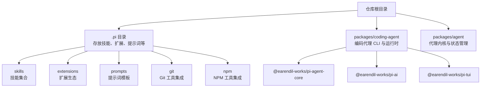
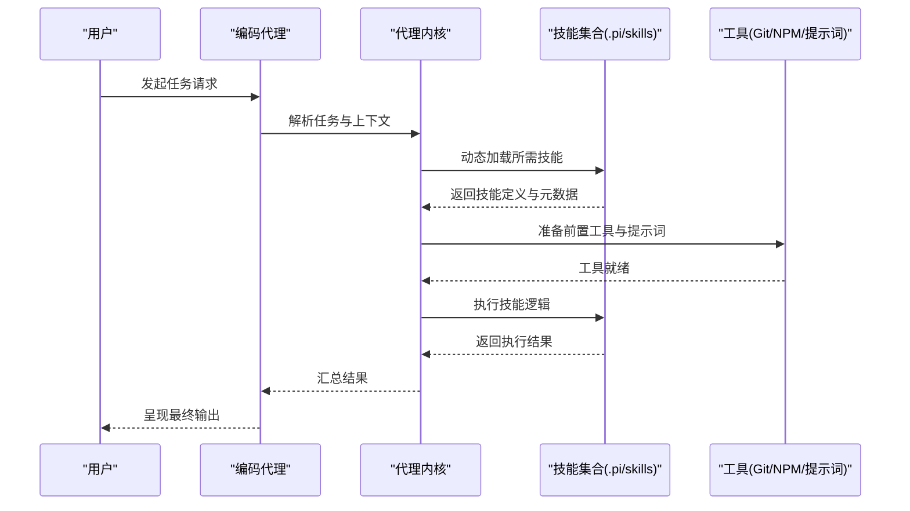
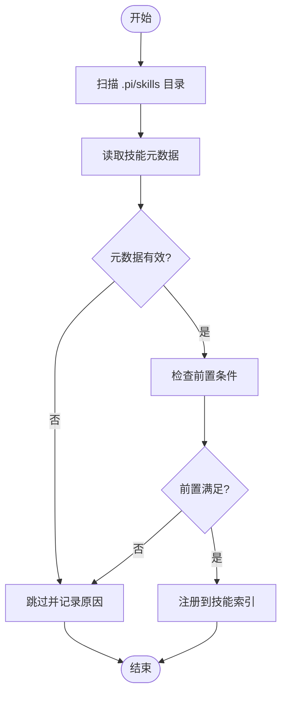
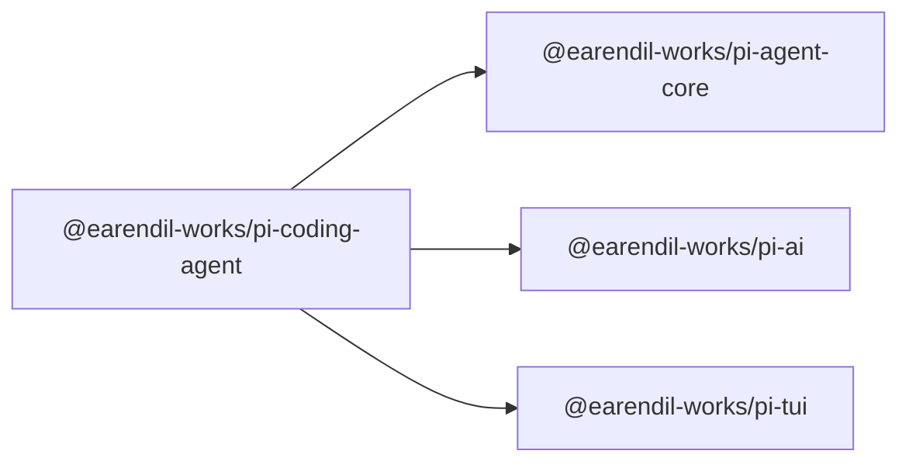

# 技能系统

<cite>
**本文引用的文件**
- [README.md](file://README.md)
- [CONTRIBUTING.md](file://CONTRIBUTING.md)
- [.pi 目录](file://.pi)
- [packages/coding-agent/package.json](file://packages/coding-agent/package.json)
- [packages/agent/package.json](file://packages/agent/package.json)
</cite>

## 目录
1. [引言](#引言)
2. [项目结构](#项目结构)
3. [核心组件](#核心组件)
4. [架构总览](#架构总览)
5. [详细组件分析](#详细组件分析)
6. [依赖分析](#依赖分析)
7. [性能考虑](#性能考虑)
8. [故障排查指南](#故障排查指南)
9. [结论](#结论)
10. [附录](#附录)

## 引言
本文件面向Pi编码代理的“技能系统”，目标是帮助开发者理解技能的概念、作用与组织方式，掌握技能文件格式、前言元数据结构、技能加载机制与动态加载能力，并提供技能开发指南（编写规范、参数定义、调用方式）、内置与自定义技能的使用方法以及实践建议。  
当前仓库中，技能系统的核心由“编码代理”和“代理内核”两个包协作实现：编码代理负责用户交互与工具调用编排，代理内核提供通用的状态管理、传输抽象与附件支持；技能作为可扩展的工具集合，通过配置化的前言元数据与动态加载机制融入整体工作流。

## 项目结构
Pi项目采用多包工作区布局，技能系统位于顶层“.pi”目录下，编码代理与代理内核分别在各自包中实现运行时与工具调用能力。下图展示与技能系统相关的关键位置与关系：

图表来源
- [.pi 目录](file://.pi)
- [packages/coding-agent/package.json](file://packages/coding-agent/package.json)
- [packages/agent/package.json](file://packages/agent/package.json)

章节来源
- [README.md: 19-31:19-31](file://README.md#L19-L31)
- [packages/coding-agent/package.json: 1-99:1-99](file://packages/coding-agent/package.json#L1-L99)
- [packages/agent/package.json: 1-61:1-61](file://packages/agent/package.json#L1-L61)

## 核心组件
- 编码代理（packages/coding-agent）
  - 负责CLI入口、会话管理、工具调用编排与交互模式渲染。
  - 通过依赖代理内核与AI服务，实现跨Provider的统一LLM接口与工具执行环境。
- 代理内核（packages/agent）
  - 提供通用的传输抽象、状态管理与附件支持，为技能系统提供运行时基础设施。
- 技能集合（.pi/skills）
  - 存放可动态加载的技能脚本与元数据，支持按需启用与版本化管理。
- 扩展生态（.pi/extensions）
  - 支持第三方扩展接入，与技能系统协同工作。
- 提示词与工具（.pi/prompts、.pi/git、.pi/npm）
  - 为技能提供上下文与辅助工具，增强任务完成能力。

章节来源
- [packages/coding-agent/package.json: 41-68:41-68](file://packages/coding-agent/package.json#L41-L68)
- [packages/agent/package.json: 31-36:31-36](file://packages/agent/package.json#L31-L36)
- [.pi 目录](file://.pi)

## 架构总览
技能系统在Pi中的运行路径如下：用户通过编码代理发起请求，代理内核根据任务类型选择合适的技能或工具，技能通过前言元数据声明其输入输出与行为约束，最终由编码代理执行并返回结果。下图展示了从用户到技能执行的关键节点与交互：

图表来源
- [packages/coding-agent/package.json: 41-68:41-68](file://packages/coding-agent/package.json#L41-L68)
- [packages/agent/package.json: 31-36:31-36](file://packages/agent/package.json#L31-L36)
- [.pi 目录](file://.pi)

## 详细组件分析

### 技能文件格式与前言元数据
- 文件命名与组织
  - 技能以独立脚本形式存在，位于“.pi/skills”目录下，便于版本化与分发。
  - 建议采用语义化命名，如“功能_场景_版本”，并配合README说明用途与依赖。
- 前言元数据（示例结构）
  - 元数据用于声明技能的名称、描述、作者、版本、输入输出参数、前置条件与错误处理策略。
  - 输入输出建议使用结构化定义，包含字段名、类型、是否必填、默认值与取值范围。
  - 前置条件可包括环境变量、外部命令可用性、权限要求等。
  - 错误处理策略应明确失败重试、降级方案与日志记录级别。
- 加载与校验流程
  - 启动时扫描“.pi/skills”目录，读取每个技能的元数据文件。
  - 校验元数据完整性与兼容性，过滤不满足前置条件的技能。
  - 将合法技能注册到技能索引，供后续动态调用。

图表来源
- [.pi 目录](file://.pi)

章节来源
- [.pi 目录](file://.pi)

### 技能分类管理
- 分类维度
  - 功能域：如“代码生成”“文件操作”“版本控制”“包管理”等。
  - 使用频度：高频、低频、一次性任务。
  - 安全等级：高风险（写入/删除）与低风险（只读/查询）。
- 管理策略
  - 通过目录层级或元数据标签实现分类存储与检索。
  - 提供“启用/禁用”开关与优先级排序，避免冲突与性能瓶颈。
  - 对高风险技能设置显式确认流程与审计日志。

章节来源
- [.pi 目录](file://.pi)

### 动态加载机制
- 加载策略
  - 按需加载：仅在任务需要时加载对应技能，减少启动开销。
  - 缓存策略：对已加载技能进行缓存，避免重复解析与校验。
  - 版本隔离：同一技能不同版本共存，按任务需求选择具体版本。
- 安全与稳定性
  - 限制技能执行时间与资源占用，超限自动终止。
  - 对外部命令与文件系统访问进行白名单控制。
  - 记录执行日志与错误堆栈，便于回溯与修复。

章节来源
- [packages/coding-agent/package.json: 41-68:41-68](file://packages/coding-agent/package.json#L41-L68)
- [packages/agent/package.json: 31-36:31-36](file://packages/agent/package.json#L31-L36)

### 技能开发指南
- 编写规范
  - 明确职责边界：每个技能专注单一任务，避免“大杂烩”式技能。
  - 参数最小化：仅暴露必要参数，其余通过元数据或默认值处理。
  - 文档即代码：在技能文件中附带简要说明与使用示例。
- 参数定义
  - 使用TypeBox等Schema工具定义输入输出结构，确保类型安全与一致性。
  - 为复杂参数提供示例值与约束条件，降低调用方理解成本。
- 调用方式
  - 通过代理内核统一调度，传递标准化上下文（任务ID、会话信息、权限令牌）。
  - 在调用前后记录日志，便于问题定位与性能分析。
- 最佳实践
  - 将高风险操作封装为独立技能，并提供撤销/回滚能力。
  - 对外部依赖进行容错处理，避免单点故障影响整体流程。
  - 定期审查与重构技能，保持简洁与可维护性。

章节来源
- [packages/coding-agent/package.json: 41-68:41-68](file://packages/coding-agent/package.json#L41-L68)
- [packages/agent/package.json: 31-36:31-36](file://packages/agent/package.json#L31-L36)

### 内置技能与自定义技能
- 内置技能
  - 由Pi官方提供，覆盖常见任务场景（如基础文件操作、版本控制、包管理等）。
  - 通过“.pi/skills”目录中的预置脚本实现，具备稳定版本与完善文档。
- 自定义技能
  - 开发者可在本地“.pi/skills”下新增自定义脚本，遵循统一元数据格式与调用约定。
  - 可通过扩展机制与第三方工具集成，形成更丰富的任务能力矩阵。
- 示例与实践
  - 示例：一个“生成README”技能，声明输入为项目路径与语言偏好，输出为Markdown文本。
  - 实践：将相似功能拆分为多个小技能，组合调用以完成复杂任务；对公共逻辑抽取为通用工具。

章节来源
- [.pi 目录](file://.pi)

## 依赖分析
编码代理与代理内核之间的依赖关系如下：

图表来源
- [packages/coding-agent/package.json: 41-68:41-68](file://packages/coding-agent/package.json#L41-L68)

章节来源
- [packages/coding-agent/package.json: 41-68:41-68](file://packages/coding-agent/package.json#L41-L68)
- [packages/agent/package.json: 31-36:31-36](file://packages/agent/package.json#L31-L36)

## 性能考虑
- 启动时延
  - 采用按需加载策略，仅加载当前任务所需的技能，减少冷启动时间。
- 执行效率
  - 对高耗时任务进行并发控制与队列管理，避免阻塞主线程。
  - 复用工具实例（如Git/NPM客户端），减少初始化开销。
- 资源占用
  - 限制技能执行时间与内存使用，超限时强制回收。
  - 对外部进程进行资源上限配置，防止意外泄漏。

## 故障排查指南
- 常见问题
  - 技能未被识别：检查“.pi/skills”目录是否存在、文件权限是否正确、元数据是否完整。
  - 前置条件不满足：确认环境变量、外部命令与权限配置是否符合要求。
  - 执行失败：查看技能日志与错误堆栈，定位具体失败步骤。
- 排查步骤
  - 验证技能元数据：字段齐全、类型匹配、默认值合理。
  - 检查工具链：Git/NPM/提示词等工具是否安装且可执行。
  - 回归测试：针对关键路径编写单元测试，确保变更不影响既有功能。
- 参考依据
  - 贡献指南强调“必须理解你的代码”，提交前务必通过检查与测试流程。

章节来源
- [CONTRIBUTING.md: 52-57:52-57](file://CONTRIBUTING.md#L52-L57)
- [CONTRIBUTING.md: 65-67:65-67](file://CONTRIBUTING.md#L65-L67)

## 结论
Pi的技能系统通过“可扩展的技能集合 + 统一的代理内核 + 动态加载机制”实现了灵活、安全与高性能的任务编排。开发者可基于本文档的规范与流程快速构建高质量技能，并将其纳入“.pi/skills”生态，持续提升Pi在真实编码任务中的表现。

## 附录
- 快速参考
  - 技能目录：.pi/skills
  - 扩展目录：.pi/extensions
  - 提示词目录：.pi/prompts
  - Git工具：.pi/git
  - NPM工具：.pi/npm
- 相关文档
  - 项目主页与文档：README.md 中的链接与说明
  - 贡献与质量门禁：CONTRIBUTING.md

章节来源
- [README.md: 27-31:27-31](file://README.md#L27-L31)
- [CONTRIBUTING.md: 13-26:13-26](file://CONTRIBUTING.md#L13-L26)