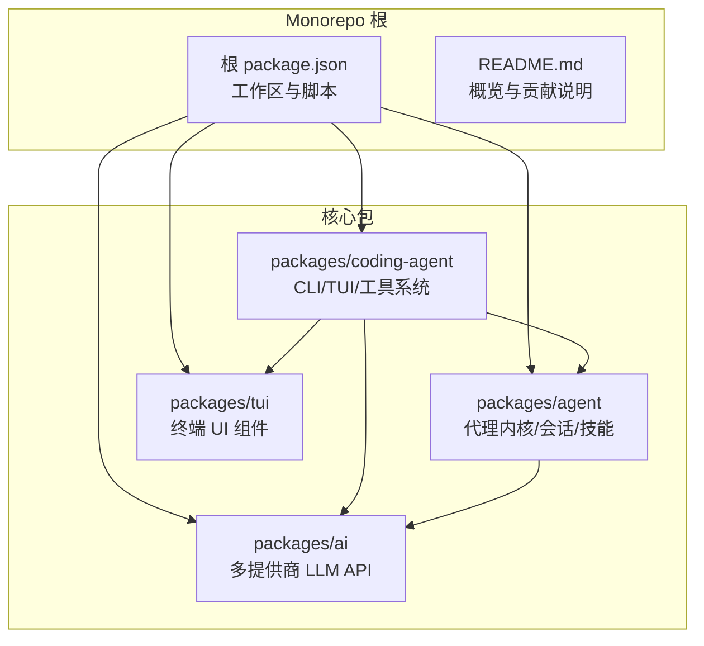
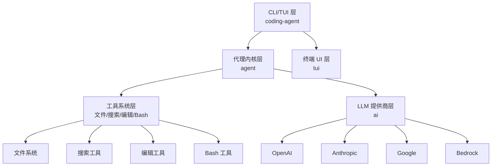
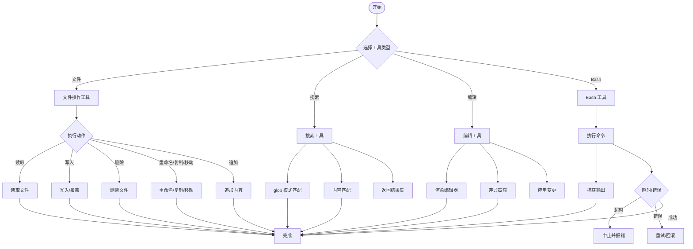
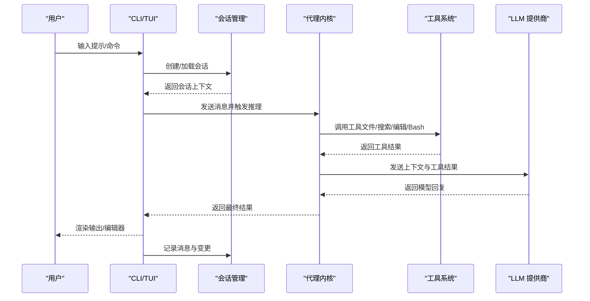
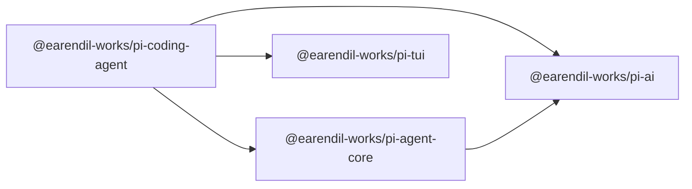

# 编码代理

<cite>
**本文引用的文件**
- [README.md](file://README.md)
- [AGENTS.md](file://AGENTS.md)
- [package.json](file://package.json)
- [packages/coding-agent/package.json](file://packages/coding-agent/package.json)
- [packages/agent/package.json](file://packages/agent/package.json)
- [packages/ai/package.json](file://packages/ai/package.json)
- [packages/tui/package.json](file://packages/tui/package.json)
- [packages/coding-agent/README.md](file://packages/coding-agent/README.md)
- [packages/coding-agent/examples/README.md](file://packages/coding-agent/examples/README.md)
- [packages/coding-agent/examples/sdk/README.md](file://packages/coding-agent/examples/sdk/README.md)
- [packages/coding-agent/docs/docs.json](file://packages/coding-agent/docs/docs.json)
- [packages/coding-agent/src/modes/interactive/theme/dark.json](file://packages/coding-agent/src/modes/interactive/theme/dark.json)
- [packages/coding-agent/src/modes/interactive/theme/light.json](file://packages/coding-agent/src/modes/interactive/theme/light.json)
- [packages/agent/src/harness/session/session.ts](file://packages/agent/src/harness/session/session.ts)
- [packages/agent/src/harness/session/jsonl-repo.ts](file://packages/agent/src/harness/session/jsonl-repo.ts)
- [packages/agent/src/harness/session/memory-repo.ts](file://packages/agent/src/harness/session/memory-repo.ts)
- [packages/agent/src/harness/skills.ts](file://packages/agent/src/harness/skills.ts)
- [packages/agent/src/harness/system-prompt.ts](file://packages/agent/src/harness/system-prompt.ts)
- [packages/agent/src/harness/types.ts](file://packages/agent/src/harness/types.ts)
- [packages/agent/src/harness/env/nodejs.ts](file://packages/agent/src/harness/env/nodejs.ts)
- [packages/agent/src/harness/messages.ts](file://packages/agent/src/harness/messages.ts)
- [packages/agent/src/agent.ts](file://packages/agent/src/agent.ts)
- [packages/ai/src/providers/openai-responses.ts](file://packages/ai/src/providers/openai-responses.ts)
- [packages/ai/src/providers/anthropic.ts](file://packages/ai/src/providers/anthropic.ts)
- [packages/ai/src/providers/google.ts](file://packages/ai/src/providers/google.ts)
- [packages/ai/src/providers/mistral.ts](file://packages/ai/src/providers/mistral.ts)
- [packages/ai/src/providers/bedrock-provider.ts](file://packages/ai/src/providers/bedrock-provider.ts)
- [packages/ai/src/oauth.ts](file://packages/ai/src/oauth.ts)
- [packages/ai/src/types.ts](file://packages/ai/src/types.ts)
- [packages/tui/src/index.ts](file://packages/tui/src/index.ts)
- [packages/tui/src/components/text-editor.ts](file://packages/tui/src/components/text-editor.ts)
- [packages/tui/src/components/diff-renderer.ts](file://packages/tui/src/components/diff-renderer.ts)
- [packages/tui/src/utils/keymap.ts](file://packages/tui/src/utils/keymap.ts)
</cite>

## 目录
1. [简介](#简介)
2. [项目结构](#项目结构)
3. [核心组件](#核心组件)
4. [架构总览](#架构总览)
5. [详细组件分析](#详细组件分析)
6. [依赖关系分析](#依赖关系分析)
7. [性能与可扩展性](#性能与可扩展性)
8. [故障排查指南](#故障排查指南)
9. [结论](#结论)
10. [附录](#附录)

## 简介
本文件面向使用者与开发者，系统化介绍 Pi 编码代理（Interactive Coding Agent）的使用方法、命令行接口设计、交互式与 RPC 模式差异、工具系统（文件操作、搜索、编辑、Bash）、会话管理、设置与技能系统，以及 SDK 集成指南与最佳实践。Pi 是一个可扩展的自解释型编码代理，支持多模型提供商统一调用，并提供终端内交互体验与可编程扩展能力。

## 项目结构
仓库采用 monorepo 结构，核心包如下：
- packages/coding-agent：交互式编码代理 CLI 与 TUI 集成
- packages/agent：通用代理运行时、状态管理、会话与技能框架
- packages/ai：统一多提供商 LLM API（OpenAI、Anthropic、Google、Bedrock 等）
- packages/tui：终端 UI 库，提供高效文本渲染与编辑器组件

图表来源
- [package.json:1-60](file://package.json#L1-L60)
- [packages/coding-agent/package.json:1-99](file://packages/coding-agent/package.json#L1-L99)
- [packages/agent/package.json:1-61](file://packages/agent/package.json#L1-L61)
- [packages/ai/package.json:1-107](file://packages/ai/package.json#L1-L107)
- [packages/tui/package.json:1-48](file://packages/tui/package.json#L1-L48)

章节来源
- [README.md:19-58](file://README.md#L19-L58)
- [package.json:5-11](file://package.json#L5-L11)

## 核心组件
- 命令行入口与二进制导出：coding-agent 包通过 bin 映射提供可执行命令，同时导出模块入口与 hooks 子路径，便于 SDK 集成与扩展。
- 代理内核：agent 包提供通用代理运行时、消息协议、环境抽象、会话存储与技能框架。
- 多提供商 LLM：ai 包统一封装 OpenAI、Anthropic、Google、Bedrock 等，提供一致的调用接口与响应处理。
- 终端 UI：tui 包提供文本编辑器、差异渲染等组件，支撑交互式模式的高效显示与编辑。

章节来源
- [packages/coding-agent/package.json:9-23](file://packages/coding-agent/package.json#L9-L23)
- [packages/agent/package.json:8-18](file://packages/agent/package.json#L8-L18)
- [packages/ai/package.json:8-53](file://packages/ai/package.json#L8-L53)
- [packages/tui/package.json:6-12](file://packages/tui/package.json#L6-L12)

## 架构总览
Pi 的整体架构由“CLI/TUI 层”、“代理内核层”、“工具系统层”、“LLM 提供商层”构成。CLI/TUI 层负责用户交互与界面渲染；代理内核层负责状态管理、消息编排与技能调度；工具系统层封装文件、搜索、编辑、Bash 等能力；LLM 提供商层统一对外部服务的访问。

图表来源
- [packages/coding-agent/package.json:41-59](file://packages/coding-agent/package.json#L41-L59)
- [packages/agent/package.json:31-36](file://packages/agent/package.json#L31-L36)
- [packages/ai/package.json:69-80](file://packages/ai/package.json#L69-L80)
- [packages/tui/package.json:39-46](file://packages/tui/package.json#L39-L46)

## 详细组件分析

### CLI 接口与命令行参数
- 可执行入口：通过 bin 映射提供命令名，构建后输出可执行文件。
- 模块导出：提供主入口与 hooks 子路径，便于外部应用以库方式集成。
- 典型参数（基于包导出与常见 CLI 设计）：
  - --help/-h：显示帮助信息
  - --version/-V：显示版本
  - --list-models：列出可用模型
  - -p/--prompt：直接传入提示词进入一次性推理
  - --config-dir：指定配置目录（如 .pi）
  - --theme：主题选择（如 dark/light）
  - --session-id：指定会话 ID 或新建会话
  - --provider：指定 LLM 提供商（如 openai、anthropic、google、bedrock）
  - --model：指定具体模型名称
  - --dry-run：仅预演不执行工具调用
  - --export-html：导出会话为 HTML 报告
  - --no-tui：禁用 TUI，走纯文本模式
  - --timeout：请求超时控制
  - --verbose/-v：日志级别提升
- 运行方式：
  - 交互式：直接运行命令启动 TUI
  - 批处理：配合 -p 使用进行一次性推理
  - RPC 模式：通过 SDK 调用或外部进程通信（见 SDK 章节）

章节来源
- [packages/coding-agent/package.json:6-8](file://packages/coding-agent/package.json#L6-L8)
- [packages/coding-agent/package.json:9-11](file://packages/coding-agent/package.json#L9-L11)
- [packages/coding-agent/package.json:14-23](file://packages/coding-agent/package.json#L14-L23)

### 交互式模式与 RPC 模式的区别与使用场景
- 交互式模式（TUI）：
  - 特点：实时对话、可视化编辑、主题切换、会话历史、工具调用反馈
  - 适用：日常开发、调试、探索性任务、需要即时反馈的协作
- RPC 模式：
  - 特点：通过 SDK 或进程间通信调用代理，适合嵌入到 IDE、编辑器、自动化流水线
  - 适用：自动化修复、批量任务、CI/CD 集成、第三方应用扩展
- 切换方式：
  - 交互式：直接运行 CLI 启动 TUI
  - RPC：通过 SDK 导入代理内核，按需调用推理与工具

章节来源
- [packages/coding-agent/package.json:41-59](file://packages/coding-agent/package.json#L41-L59)
- [packages/tui/package.json:39-46](file://packages/tui/package.json#L39-L46)

### 工具系统：文件操作、搜索、编辑、Bash
- 文件操作工具（FS）：
  - 功能：读取/写入/追加/删除/重命名/复制/移动、glob 模式匹配、忽略规则、锁文件保护
  - 场景：自动修复、重构、生成文件、批量替换
- 搜索工具：
  - 功能：基于 glob 的文件检索、内容匹配、忽略列表、结果去重
  - 场景：定位问题文件、查找特定代码片段、依赖分析
- 编辑工具：
  - 功能：基于 TUI 文本编辑器的增量修改、差异高亮、撤销/重做、键位映射
  - 场景：交互式编辑、补丁生成、格式化
- Bash 工具：
  - 功能：安全执行 shell 命令、输出捕获、错误处理、超时控制
  - 场景：构建脚本、依赖安装、系统诊断、Git 操作

图表来源
- [packages/coding-agent/package.json:41-59](file://packages/coding-agent/package.json#L41-L59)
- [packages/tui/src/components/text-editor.ts](file://packages/tui/src/components/text-editor.ts)
- [packages/tui/src/components/diff-renderer.ts](file://packages/tui/src/components/diff-renderer.ts)

章节来源
- [packages/coding-agent/package.json:41-59](file://packages/coding-agent/package.json#L41-L59)
- [packages/tui/src/components/text-editor.ts](file://packages/tui/src/components/text-editor.ts)
- [packages/tui/src/components/diff-renderer.ts](file://packages/tui/src/components/diff-renderer.ts)

### 会话管理系统
- 会话存储：
  - 内存存储：适合临时测试与快速迭代
  - JSONL 存储：持久化记录，便于导出与复盘
- 会话生命周期：
  - 创建：初始化会话上下文、加载系统提示、设置环境变量
  - 运行：接收用户输入，调度代理与工具，记录消息与变更
  - 关闭：保存状态、清理资源、生成报告
- 会话标识与并发：
  - UUID 标识，避免多会话冲突
  - 支持多会话并行运行，隔离状态与文件

图表来源
- [packages/agent/src/harness/session/session.ts](file://packages/agent/src/harness/session/session.ts)
- [packages/agent/src/harness/session/jsonl-repo.ts](file://packages/agent/src/harness/session/jsonl-repo.ts)
- [packages/agent/src/harness/session/memory-repo.ts](file://packages/agent/src/harness/session/memory-repo.ts)
- [packages/agent/src/harness/messages.ts](file://packages/agent/src/harness/messages.ts)

章节来源
- [packages/agent/src/harness/session/session.ts](file://packages/agent/src/harness/session/session.ts)
- [packages/agent/src/harness/session/jsonl-repo.ts](file://packages/agent/src/harness/session/jsonl-repo.ts)
- [packages/agent/src/harness/session/memory-repo.ts](file://packages/agent/src/harness/session/memory-repo.ts)
- [packages/agent/src/harness/messages.ts](file://packages/agent/src/harness/messages.ts)

### 设置管理与主题系统
- 配置目录：默认位于 .pi，可通过命令行参数覆盖
- 主题：内置深色/浅色主题，支持自定义主题 JSON
- 键位映射：可配置编辑器快捷键，适配不同操作系统与偏好

章节来源
- [packages/coding-agent/package.json:6-8](file://packages/coding-agent/package.json#L6-L8)
- [packages/coding-agent/src/modes/interactive/theme/dark.json](file://packages/coding-agent/src/modes/interactive/theme/dark.json)
- [packages/coding-agent/src/modes/interactive/theme/light.json](file://packages/coding-agent/src/modes/interactive/theme/light.json)
- [packages/tui/src/utils/keymap.ts](file://packages/tui/src/utils/keymap.ts)

### 技能系统（Skills）
- 技能定义：以可组合的函数形式封装复杂流程（如“修复 Bug”、“生成单元测试”）
- 调度机制：代理根据上下文与目标动态选择技能，传递参数与上下文
- 扩展方式：新增技能文件，注册到技能索引，即可被代理识别与调用

章节来源
- [packages/agent/src/harness/skills.ts](file://packages/agent/src/harness/skills.ts)
- [packages/agent/src/harness/system-prompt.ts](file://packages/agent/src/harness/system-prompt.ts)
- [packages/agent/src/harness/types.ts](file://packages/agent/src/harness/types.ts)

### LLM 提供商与统一 API
- 提供商封装：OpenAI、Anthropic、Google、Bedrock 等，统一请求与响应格式
- OAuth/凭据：支持 OAuth 流程与环境变量注入
- 类型安全：提供 TypeScript 类型定义，确保调用一致性

章节来源
- [packages/ai/package.json:13-53](file://packages/ai/package.json#L13-L53)
- [packages/ai/src/providers/openai-responses.ts](file://packages/ai/src/providers/openai-responses.ts)
- [packages/ai/src/providers/anthropic.ts](file://packages/ai/src/providers/anthropic.ts)
- [packages/ai/src/providers/google.ts](file://packages/ai/src/providers/google.ts)
- [packages/ai/src/providers/mistral.ts](file://packages/ai/src/providers/mistral.ts)
- [packages/ai/src/providers/bedrock-provider.ts](file://packages/ai/src/providers/bedrock-provider.ts)
- [packages/ai/src/oauth.ts](file://packages/ai/src/oauth.ts)
- [packages/ai/src/types.ts](file://packages/ai/src/types.ts)

### 终端 UI 与编辑器组件
- 文本编辑器：支持增量编辑、语法高亮、差异渲染
- 差异渲染：高效对比前后内容，仅更新变化区域
- 键位映射：跨平台键位配置，提升编辑效率

章节来源
- [packages/tui/src/index.ts](file://packages/tui/src/index.ts)
- [packages/tui/src/components/text-editor.ts](file://packages/tui/src/components/text-editor.ts)
- [packages/tui/src/components/diff-renderer.ts](file://packages/tui/src/components/diff-renderer.ts)
- [packages/tui/src/utils/keymap.ts](file://packages/tui/src/utils/keymap.ts)

### SDK 使用指南（在应用中集成编码代理）
- 安装与导入：
  - 通过包管理器安装编码代理相关包
  - 在应用中导入代理内核与 hooks
- 初始化：
  - 配置提供商与模型、设置会话上下文
  - 加载系统提示与技能
- 推理与工具调用：
  - 将用户输入转换为消息，发送给代理内核
  - 代理内核调度工具与 LLM，返回结果
- 集成方式：
  - 作为库引入：在 Node.js 中直接调用
  - 作为 RPC 服务：通过进程间通信或 HTTP 接口暴露

章节来源
- [packages/coding-agent/package.json:14-23](file://packages/coding-agent/package.json#L14-L23)
- [packages/agent/src/agent.ts](file://packages/agent/src/agent.ts)
- [packages/agent/src/harness/env/nodejs.ts](file://packages/agent/src/harness/env/nodejs.ts)

## 依赖关系分析
- 包依赖：
  - coding-agent 依赖 agent、ai、tui
  - agent 依赖 ai
- 运行时依赖：
  - chalk、diff、glob、yaml、typebox、undici 等
- 开发与构建：
  - esbuild、vitest、biome、husky 等工具链

图表来源
- [packages/coding-agent/package.json:41-59](file://packages/coding-agent/package.json#L41-L59)
- [packages/agent/package.json:31-36](file://packages/agent/package.json#L31-L36)
- [packages/ai/package.json:69-80](file://packages/ai/package.json#L69-L80)

章节来源
- [package.json:37-59](file://package.json#L37-L59)
- [packages/coding-agent/package.json:41-68](file://packages/coding-agent/package.json#L41-L68)
- [packages/agent/package.json:31-59](file://packages/agent/package.json#L31-L59)
- [packages/ai/package.json:69-106](file://packages/ai/package.json#L69-L106)
- [packages/tui/package.json:39-46](file://packages/tui/package.json#L39-L46)

## 性能与可扩展性
- 性能优化建议：
  - 使用内存存储进行快速迭代，JSONL 存储用于生产复盘
  - 合理设置超时与重试策略，避免阻塞
  - 工具调用前先进行预检（如文件存在性、权限），减少无效调用
  - 使用差异渲染减少 UI 重绘开销
- 可扩展性：
  - 新增工具：遵循工具接口规范，注册到工具索引
  - 新增提供商：在 ai 包中添加新提供商适配层
  - 新增技能：在 agent 包中扩展技能集合

## 故障排查指南
- 常见问题与解决：
  - 无法启动/卡死：检查 Node 版本与依赖安装，确认无锁文件冲突
  - LLM 调用失败：检查凭据与网络代理配置，验证提供商可用性
  - 工具执行异常：查看工具返回码与输出，确认权限与路径正确
  - TUI 显示异常：切换主题或禁用 TUI，确认终端兼容性
- 调试技巧：
  - 使用 --verbose 提升日志级别
  - 使用 --dry-run 预演工具调用，避免破坏性操作
  - 导出会话为 JSONL/HTML，离线复盘

章节来源
- [AGENTS.md:37-44](file://AGENTS.md#L37-L44)
- [AGENTS.md:90-101](file://AGENTS.md#L90-L101)

## 结论
Pi 编码代理通过清晰的分层架构与可插拔的工具系统，为开发者提供了强大而灵活的编码助手。交互式模式适合日常开发与探索，RPC 模式便于深度集成到各类应用与流水线。依托统一的 LLM 提供商接口与丰富的终端 UI 组件，Pi 能够在保证易用性的同时满足专业开发需求。

## 附录
- 示例与文档：
  - examples 目录包含扩展示例与 SDK 使用说明
  - docs.json 提供内部文档索引
- 最佳实践：
  - 使用会话导出功能沉淀经验
  - 通过技能系统封装重复性任务
  - 在 CI 中使用 --dry-run 与 --no-tui 进行自动化校验

章节来源
- [packages/coding-agent/examples/README.md](file://packages/coding-agent/examples/README.md)
- [packages/coding-agent/examples/sdk/README.md](file://packages/coding-agent/examples/sdk/README.md)
- [packages/coding-agent/docs/docs.json](file://packages/coding-agent/docs/docs.json)