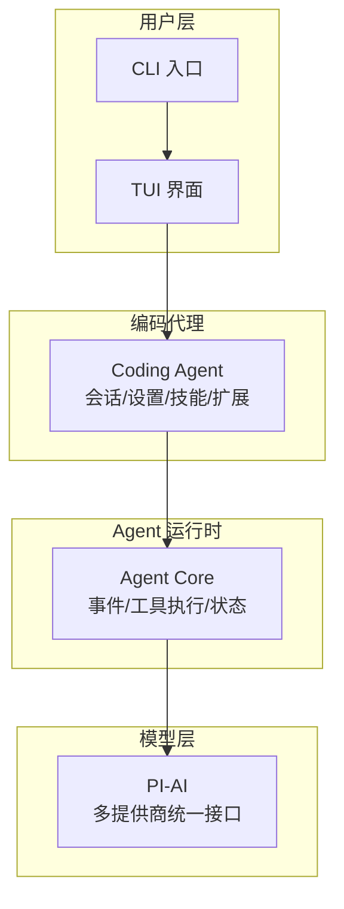
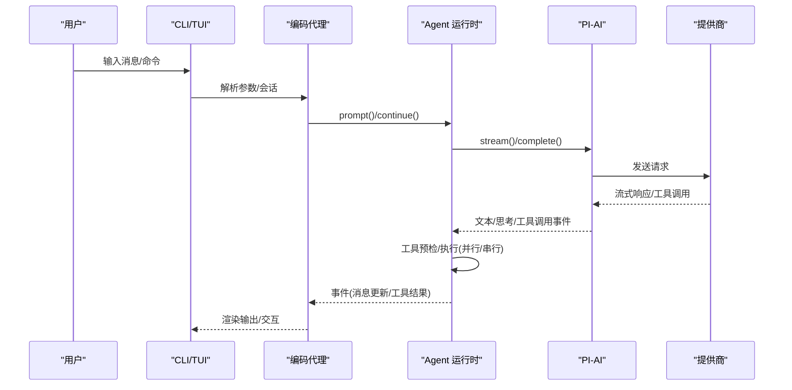
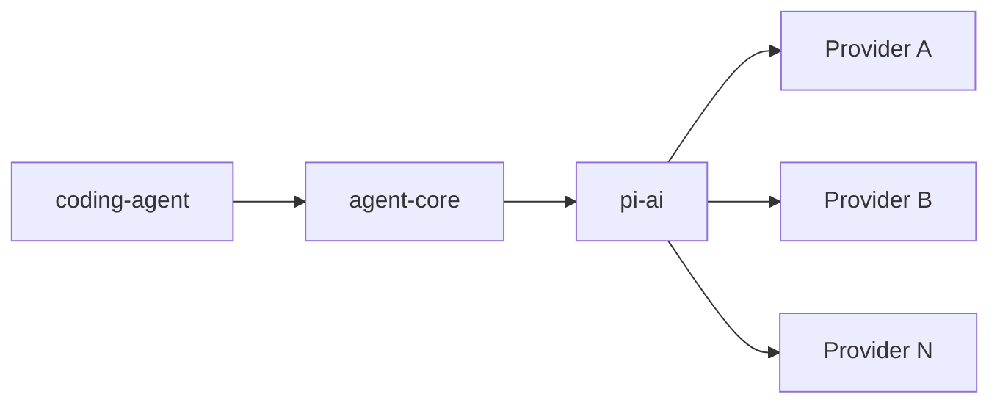

# 编码代理

<cite>
**本文引用的文件**
- [README.md](file://README.md)
- [package.json](file://package.json)
- [packages/coding-agent/README.md](file://packages/coding-agent/README.md)
- [packages/coding-agent/docs/settings.md](file://packages/coding-agent/docs/settings.md)
- [packages/coding-agent/docs/skills.md](file://packages/coding-agent/docs/skills.md)
- [packages/coding-agent/docs/extensions.md](file://packages/coding-agent/docs/extensions.md)
- [packages/coding-agent/docs/containerization.md](file://packages/coding-agent/docs/containerization.md)
- [packages/agent/README.md](file://packages/agent/README.md)
- [packages/ai/README.md](file://packages/ai/README.md)
- [.pi/skills/add-llm-provider.md](file://.pi/skills/add-llm-provider.md)
</cite>

## 目录
1. [简介](#简介)
2. [项目结构](#项目结构)
3. [核心组件](#核心组件)
4. [架构总览](#架构总览)
5. [详细组件分析](#详细组件分析)
6. [依赖关系分析](#依赖关系分析)
7. [性能考虑](#性能考虑)
8. [故障排查指南](#故障排查指南)
9. [结论](#结论)
10. [附录](#附录)

## 简介
本文件为“编码代理”（Pi Coding Agent）的使用与配置文档，面向希望以 CLI 交互、会话管理、工具调用、技能与扩展机制进行代码开发、调试、测试和部署的工程师。内容覆盖：
- CLI 界面与命令选项
- 交互式会话（对话模式、文件操作、命令执行）
- 内置工具集能力概览（读/写/编辑/终端/搜索/列出等）
- 配置文件格式与自定义项
- 扩展机制（自定义工具、技能系统）
- 常见工作流示例（代码审查、Bug 修复、功能开发、测试编写）
- 性能调优建议与最佳实践
- 容器化与安全沙箱配置

## 项目结构
仓库采用多包 monorepo 组织，核心包括：
- coding-agent：交互式 CLI、会话、设置、技能、扩展、主题、提示模板等
- agent：带工具调用与会话状态管理的 Agent 运行时
- ai：统一的多提供商 LLM API（OpenAI、Anthropic、Google 等）
- tui：终端 UI 库
- telemetry：遥测契约与参考实现
- protocol/client/server：RPC 与协议相关

```mermaid
graph TB
subgraph "用户层"
CLI["CLI 入口"]
TUI["TUI 界面"]
end
subgraph "编码代理"
CA["Coding Agent<br/>会话/设置/技能/扩展"]
end
subgraph "Agent 运行时"
AG["Agent Core<br/>事件/工具执行/状态"]
end
subgraph "模型层"
AI["PI-AI<br/>多提供商统一接口"]
end
CLI --> TUI
TUI --> CA
CA --> AG
AG --> AI
```

图表来源
- [packages/coding-agent/README.md:14-35](file://packages/coding-agent/README.md#L14-L35)
- [packages/agent/README.md:1-43](file://packages/agent/README.md#L1-L43)
- [packages/ai/README.md:1-10](file://packages/ai/README.md#L1-L10)

章节来源
- [README.md:13-35](file://README.md#L13-L35)
- [package.json:1-13](file://package.json#L1-L13)

## 核心组件
- 编码代理 CLI：提供交互式、打印、JSON、RPC 四种模式；支持会话分支、压缩、导出/导入、快捷键、消息队列等。
- Agent 运行时：封装消息流、工具执行（并行/串行）、事件订阅、上下文转换、重试与停止策略。
- 统一 LLM 接口：聚合多家提供商，自动鉴权、令牌与成本统计、上下文序列化与跨模型交接。
- 技能系统：按需加载的能力包，遵循 Agent Skills 标准，支持 /skill:name 命令与渐进式披露。
- 扩展系统：TypeScript 模块，可注册工具、命令、快捷键、事件拦截、自定义 UI、状态持久化等。
- 设置与信任：全局与项目级 JSON 设置；项目信任控制是否加载本地资源与扩展。

章节来源
- [packages/coding-agent/README.md:147-233](file://packages/coding-agent/README.md#L147-L233)
- [packages/agent/README.md:45-124](file://packages/agent/README.md#L45-L124)
- [packages/ai/README.md:230-322](file://packages/ai/README.md#L230-L322)
- [packages/coding-agent/docs/skills.md:20-71](file://packages/coding-agent/docs/skills.md#L20-L71)
- [packages/coding-agent/docs/extensions.md:9-29](file://packages/coding-agent/docs/extensions.md#L9-L29)
- [packages/coding-agent/docs/settings.md:12-22](file://packages/coding-agent/docs/settings.md#L12-L22)

## 架构总览
编码代理通过 CLI/TUI 接收用户输入，交由 Agent 运行器编排 LLM 调用与工具执行；LLM 请求经 PI-AI 路由到具体提供商；技能与扩展在启动或会话生命周期中注入能力与行为。

```mermaid
sequenceDiagram
participant U as "用户"
participant CLI as "CLI/TUI"
participant CA as "编码代理"
participant AG as "Agent 运行时"
participant AI as "PI-AI"
participant P as "提供商"
U->>CLI : 输入消息/命令
CLI->>CA : 解析参数/会话
CA->>AG : prompt()/continue()
AG->>AI : stream()/complete()
AI->>P : 发送请求
P-->>AI : 流式响应/工具调用
AI-->>AG : 文本/思考/工具调用事件
AG->>AG : 工具预检/执行(并行/串行)
AG-->>CA : 事件(消息更新/工具结果)
CA-->>CLI : 渲染输出/交互
```

图表来源
- [packages/agent/README.md:65-124](file://packages/agent/README.md#L65-L124)
- [packages/ai/README.md:100-228](file://packages/ai/README.md#L100-L228)
- [packages/coding-agent/README.md:147-233](file://packages/coding-agent/README.md#L147-L233)

## 详细组件分析

### CLI 与交互式会话
- 模式：默认交互、打印(-p/--print)、JSON(--mode json)、RPC(--mode rpc)
- 会话：继续最近会话(-c/-resume)、命名(--name)、指定会话(--session)、分叉(--fork)、临时模式(--no-session)
- 模型：--provider、--model、--api-key、--thinking、--models、--list-models
- 工具：--tools、--exclude-tools、--no-builtin-tools、--no-tools
- 资源：-e/--extension、--no-extensions、--skill、--no-skills、--prompt-template、--no-prompt-templates、--theme、--no-themes、--no-context-files
- 其他：--system-prompt、--append-system-prompt、--tui-mode、--verbose、--approve/--no-approve、-h/-v
- 文件参数：@file 将文件内容附加到消息
- 环境变量：PI_CODING_AGENT_DIR、PI_OFFLINE、PI_SKIP_VERSION_CHECK、PI_TELEMETRY、VISUAL/EDITOR 等

交互式编辑器特性：
- 文件引用 @ 模糊搜索、路径补全 Tab、多行 Shift+Enter
- 外部编辑器 Ctrl+G、粘贴图片/文本 Ctrl+V
- Bash 命令 !command 发送输出给 LLM，!!command 仅本地执行
- 消息队列：Enter 提交引导消息，Alt+Enter 提交后续消息，Esc 取消/恢复

章节来源
- [packages/coding-agent/README.md:514-691](file://packages/coding-agent/README.md#L514-L691)
- [packages/coding-agent/README.md:160-233](file://packages/coding-agent/README.md#L160-L233)

#### 会话管理与分支
- 会话以 JSONL 树形结构存储，支持就地分支与回溯
- /tree 导航任意历史点并继续；/fork 从某条用户消息创建新会话；/clone 复制当前活跃分支到新会话
- 压缩：/compact 手动触发；自动压缩在接近或超出上下文限制时触发，保留完整历史以便回溯

章节来源
- [packages/coding-agent/README.md:236-280](file://packages/coding-agent/README.md#L236-L280)

#### 设置与项目信任
- 全局设置 ~/.pi/agent/settings.json，项目设置 .pi/settings.json（覆盖全局）
- 项目信任：首次进入含本地资源的项目会询问是否信任；非交互模式使用 defaultProjectTrust 控制
- 信任决策写入 ~/.pi/agent/trust.json；/trust 保存决策后需重启生效

章节来源
- [packages/coding-agent/docs/settings.md:1-22](file://packages/coding-agent/docs/settings.md#L1-L22)
- [packages/coding-agent/README.md:295-308](file://packages/coding-agent/README.md#L295-L308)

### 内置工具集概览
- 可用内置工具：read、bash、edit、write、grep、find、ls
- 可通过 --tools 白名单启用，或通过 --exclude-tools 禁用特定工具
- 可在扩展中替换或增强内置工具行为（如权限门控、路径保护）

章节来源
- [packages/coding-agent/README.md:578-587](file://packages/coding-agent/README.md#L578-L587)
- [packages/coding-agent/docs/extensions.md:9-29](file://packages/coding-agent/docs/extensions.md#L9-L29)

### 技能系统（Skills）
- 位置：全局 ~/.pi/agent/skills、~/.agents/skills；项目级 .pi/skills、.agents/skills（需信任）；包内 skills/；settings.skills；CLI --skill
- 发现规则：根 .md 文件或包含 SKILL.md 的目录；不同位置对根 .md 的处理不同
- 工作方式：启动扫描名称与描述，系统提示中以 XML 形式暴露；按需读取完整说明，相对路径引用脚本与资源
- 命令：/skill:name 直接执行；enableSkillCommands 开关
- 结构：SKILL.md + scripts/references/assets；Frontmatter 字段 name/description/license/compatibility/metadata/allowed-tools/disable-model-invocation
- 验证：遵循 Agent Skills 规范，缺失 description 不加载；名称冲突警告并保留首个

章节来源
- [packages/coding-agent/docs/skills.md:20-71](file://packages/coding-agent/docs/skills.md#L20-L71)
- [packages/coding-agent/docs/skills.md:73-189](file://packages/coding-agent/docs/skills.md#L73-L189)

### 扩展系统（Extensions）
- 作用：注册自定义工具、命令、快捷键、事件拦截、自定义 UI、状态持久化、会话钩子等
- 位置：~/.pi/agent/extensions、.pi/extensions；settings.extensions；CLI -e
- 生命周期事件：project_trust、session_start、resources_discover、before_agent_start、turn_*、message_*、tool_execution_*、context、before_provider_headers/request/response、model_select、thinking_level_select、session_before_switch/fork/compact/tree、session_shutdown 等
- 工具执行：支持 beforeToolCall/afterToolCall 钩子，终止信号 terminate，顺序/并行执行模式
- 安全：扩展拥有完整系统权限，仅安装可信来源

章节来源
- [packages/coding-agent/docs/extensions.md:9-29](file://packages/coding-agent/docs/extensions.md#L9-L29)
- [packages/coding-agent/docs/extensions.md:109-153](file://packages/coding-agent/docs/extensions.md#L109-L153)
- [packages/coding-agent/docs/extensions.md:273-348](file://packages/coding-agent/docs/extensions.md#L273-L348)
- [packages/agent/README.md:113-146](file://packages/agent/README.md#L113-L146)

### 配置与自定义
- 设置项类别：模型与思考级别、UI 显示、网络代理、压缩策略、重试策略、消息投递、终端与图像、Shell、会话目录、模型循环、Markdown、资源路径等
- 项目覆盖：.pi/settings.json 合并覆盖全局设置
- 环境变量：PI_CODING_AGENT_DIR、PI_OFFLINE、PI_SKIP_VERSION_CHECK、PI_TELEMETRY、VISUAL/EDITOR、PI_CACHE_RETENTION 等

章节来源
- [packages/coding-agent/docs/settings.md:24-324](file://packages/coding-agent/docs/settings.md#L24-L324)
- [packages/coding-agent/README.md:665-691](file://packages/coding-agent/README.md#L665-L691)

### 程序化使用与 RPC
- SDK：createAgentSession、ModelRuntime、SessionManager.inMemory() 等
- RPC：--mode rpc 基于 stdin/stdout 的严格 LF 分隔 JSONL 帧

章节来源
- [packages/coding-agent/README.md:460-490](file://packages/coding-agent/README.md#L460-L490)

## 依赖关系分析
- coding-agent 依赖 agent 运行时与 pi-ai 统一接口
- agent 运行时依赖 pi-ai 进行模型流式调用与工具调用处理
- pi-ai 聚合多家提供商，提供认证、模型目录、工具定义与流事件

```mermaid
graph LR
CA["coding-agent"] --> AG["agent-core"]
AG --> AI["pi-ai"]
AI --> P1["Provider A"]
AI --> P2["Provider B"]
AI --> Pn["Provider N"]
```

图表来源
- [packages/coding-agent/README.md:14-35](file://packages/coding-agent/README.md#L14-L35)
- [packages/agent/README.md:1-43](file://packages/agent/README.md#L1-L43)
- [packages/ai/README.md:57-90](file://packages/ai/README.md#L57-L90)

章节来源
- [package.json:14-17](file://package.json#L14-L17)
- [packages/ai/README.md:230-322](file://packages/ai/README.md#L230-L322)

## 性能考虑
- 思考级别与预算：通过 thinkingLevel 与 thinkingBudgets 控制深度与 token 预算
- 压缩策略：compaction.enabled/reserveTokens/keepRecentTokens 控制自动压缩阈值与保留范围
- 重试策略：retry.enabled/maxRetries/baseDelayMs/provider.* 控制代理级与提供商级重试
- 传输与超时：transport、httpIdleTimeoutMs、websocketConnectTimeoutMs
- 缓存：PI_CACHE_RETENTION 延长提示缓存（Anthropic 1h、OpenAI 24h）
- 工具执行模式：parallel（默认）提升吞吐；sequential 保证顺序一致性
- 模型选择：--models 限定循环范围，减少切换开销

章节来源
- [packages/coding-agent/docs/settings.md:26-165](file://packages/coding-agent/docs/settings.md#L26-L165)
- [packages/agent/README.md:113-146](file://packages/agent/README.md#L113-L146)
- [packages/coding-agent/README.md:665-691](file://packages/coding-agent/README.md#L665-L691)

## 故障排查指南
- 项目信任问题：非交互模式未提示时使用 --approve/--no-approve；检查 ~/.pi/agent/trust.json 与 defaultProjectTrust
- 工具被阻止：扩展 tool_call 钩子可能返回 block/terminate；检查扩展日志与工具白名单
- 会话溢出：启用自动压缩或使用 /compact；查看 compaction 设置
- 网络/代理：设置 httpProxy；离线模式 PI_OFFLINE=1 关闭所有启动网络操作
- 提供商鉴权：确认环境变量或凭据存储；使用 getAuth 诊断鉴权来源
- 传输问题：调整 transport、httpIdleTimeoutMs、websocketConnectTimeoutMs

章节来源
- [packages/coding-agent/docs/settings.md:12-22](file://packages/coding-agent/docs/settings.md#L12-L22)
- [packages/coding-agent/docs/extensions.md:749-791](file://packages/coding-agent/docs/extensions.md#L749-L791)
- [packages/ai/README.md:324-380](file://packages/ai/README.md#L324-L380)

## 结论
编码代理提供了高度可扩展的 CLI 与 Agent 运行时，结合统一的 LLM 接口、技能系统与扩展机制，能够灵活适配多种开发与运维场景。通过合理的设置与性能调优，可以在保证安全与可控的前提下获得高效的智能辅助体验。

## 附录

### 常见工作流示例
- 代码审查：使用 read/grep/find/ls 浏览代码，必要时 bash 执行 lint/test；通过 skill 或 prompt template 标准化审查要点
- Bug 修复：定位问题（grep/find），编辑文件（edit/write），运行测试（bash），必要时 fork 会话尝试不同修复方案
- 功能开发：规划步骤（可借助 skill），逐步实现与测试，使用 /tree 回溯与分支对比
- 测试编写：生成测试骨架（write/edit），运行用例（bash），根据失败信息迭代修复

[本节为概念性指导，不直接分析具体文件]

### 容器化与安全沙箱
- 无内置权限系统：默认以启动用户权限运行
- 三种隔离模式：
  - Gondolin 扩展：主机保留 pi 与提供商认证，内置工具与 ! 命令路由到本地 Linux 微虚拟机
  - 普通 Docker：整个 pi 进程运行在容器中
  - OpenShell：在策略控制的沙箱中运行
- 安全注意：扩展与技能可执行任意代码，使用前务必审阅源码

章节来源
- [README.md:38-47](file://README.md#L38-L47)
- [packages/coding-agent/docs/containerization.md](file://packages/coding-agent/docs/containerization.md)
- [packages/coding-agent/docs/extensions.md:109-113](file://packages/coding-agent/docs/extensions.md#L109-L113)
- [packages/coding-agent/docs/skills.md:20-23](file://packages/coding-agent/docs/skills.md#L20-L23)

### 添加新提供商（技能指引）
- 涉及类型定义、提供商实现、懒注册、模型生成、测试矩阵、编码代理集成与文档更新
- 按步骤完成核心类型、providers、注册、模型生成、测试、编码代理配置与文档补充

章节来源
- [.pi/skills/add-llm-provider.md:1-58](file://.pi/skills/add-llm-provider.md#L1-L58)