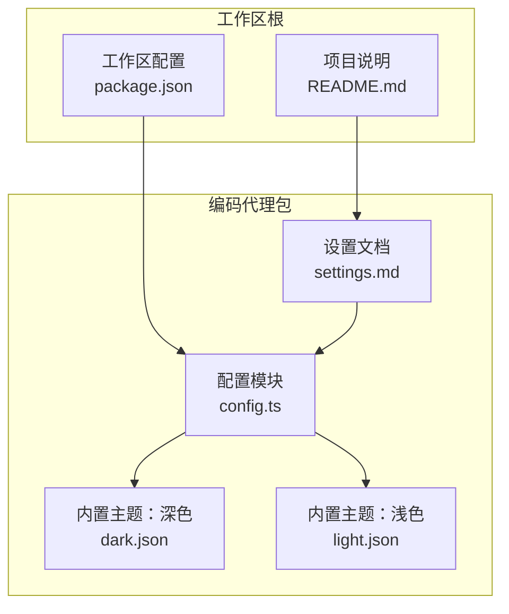
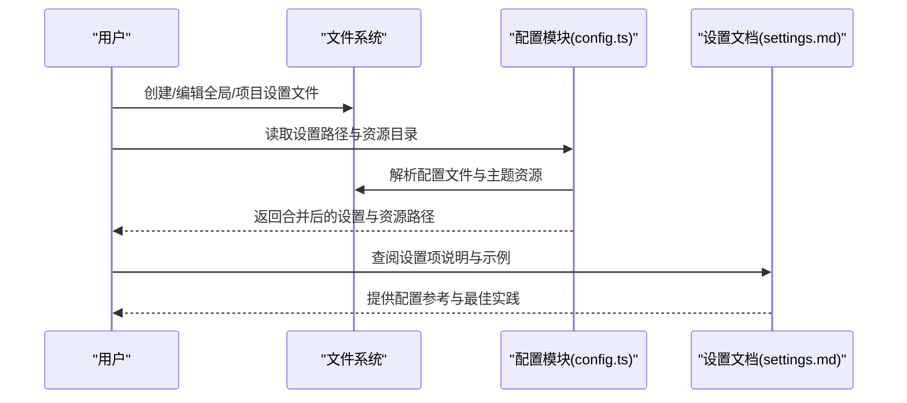
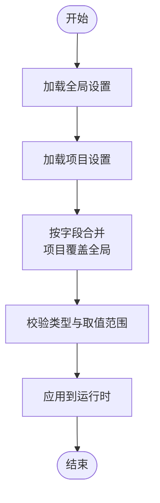
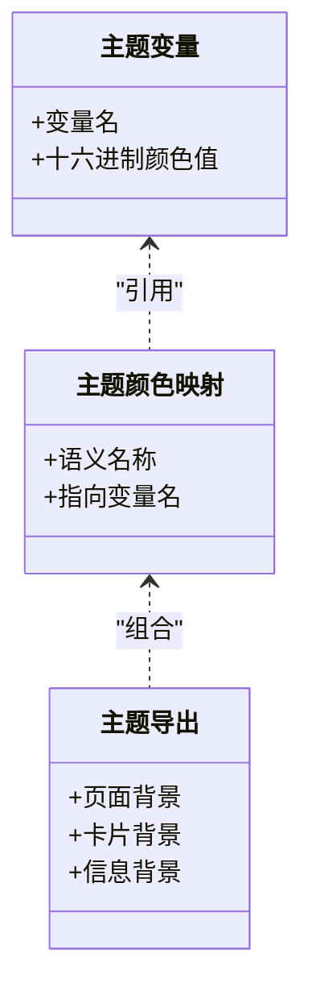
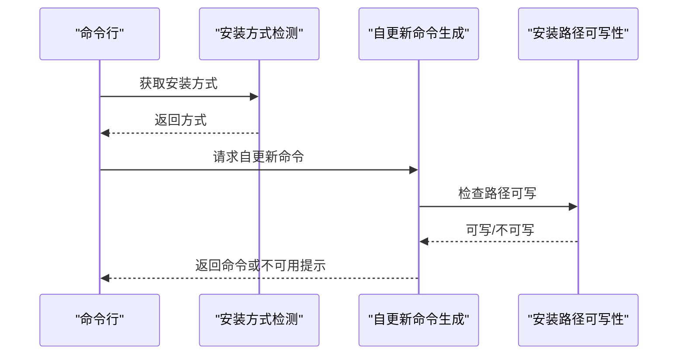
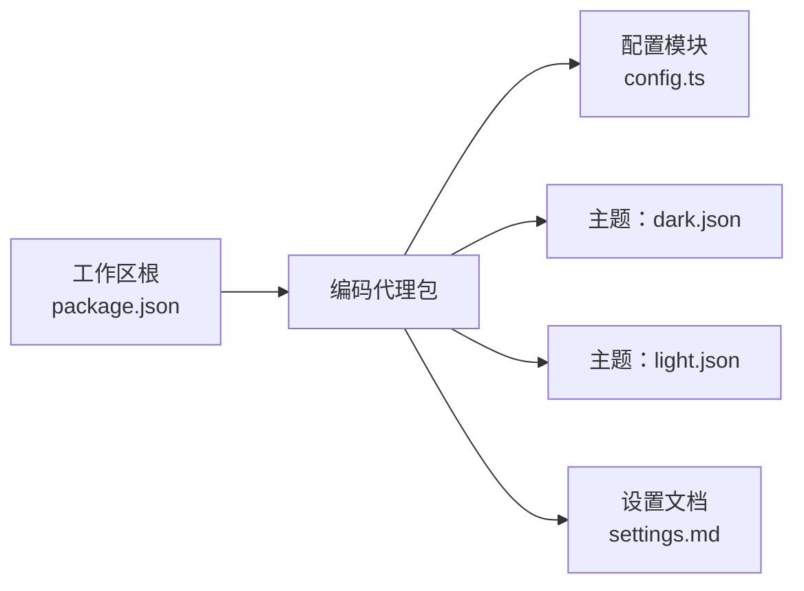

# 设置配置

<cite>
**本文引用的文件**
- [settings.md](file://packages/coding-agent/docs/settings.md)
- [config.ts](file://packages/coding-agent/src/config.ts)
- [config.test.ts](file://packages/coding-agent/test/config.test.ts)
- [dark.json](file://packages/coding-agent/src/modes/interactive/theme/dark.json)
- [light.json](file://packages/coding-agent/src/modes/interactive/theme/light.json)
- [package.json](file://package.json)
- [README.md](file://README.md)
</cite>

## 目录
1. [简介](#简介)
2. [项目结构](#项目结构)
3. [核心组件](#核心组件)
4. [架构总览](#架构总览)
5. [详细组件分析](#详细组件分析)
6. [依赖关系分析](#依赖关系分析)
7. [性能考量](#性能考量)
8. [故障排查指南](#故障排查指南)
9. [结论](#结论)
10. [附录](#附录)

## 简介
本文件面向Pi编码代理的“设置配置”系统，系统性说明设置管理器的架构与功能，覆盖以下方面：
- 配置文件结构：全局与项目级设置的层级关系、合并策略与优先级
- 默认设置与用户自定义设置：如何通过JSON配置项控制模型、主题、行为偏好等
- 配置选项详解：逐项解释关键设置的作用、取值范围与影响
- 配置创建与修改指南：如何安全地编辑配置、进行验证与错误处理
- 常见配置场景与推荐设置：针对不同使用场景给出建议与最佳实践

## 项目结构
Pi采用多包工作区（monorepo）组织，设置配置主要位于编码代理包中，同时涉及主题资源与安装/路径检测逻辑：
- 编码代理包：提供设置文件路径、资源目录解析、安装方式检测与更新指令生成
- 主题资源：内置深色/浅色主题，支持自定义主题扩展
- 文档：设置项的完整说明与示例

图表来源
- [config.ts:1-537](file://packages/coding-agent/src/config.ts#L1-L537)
- [settings.md:1-282](file://packages/coding-agent/docs/settings.md#L1-L282)
- [dark.json:1-87](file://packages/coding-agent/src/modes/interactive/theme/dark.json#L1-L87)
- [light.json:1-86](file://packages/coding-agent/src/modes/interactive/theme/light.json#L1-L86)
- [package.json:1-60](file://package.json#L1-L60)
- [README.md:1-90](file://README.md#L1-L90)

章节来源
- [package.json:1-60](file://package.json#L1-L60)
- [README.md:1-90](file://README.md#L1-L90)

## 核心组件
- 设置文件与作用域
  - 全局设置：位于用户主目录下的特定配置目录中，适用于所有项目
  - 项目设置：位于当前项目的配置目录中，仅影响当前项目
  - 合并规则：项目设置覆盖全局设置；嵌套对象按字段合并
- 路径解析与资源定位
  - 解析全局配置目录、设置文件、模型配置、认证文件、工具与会话目录
  - 支持环境变量覆盖路径前缀，便于容器/Nix等特殊运行环境
- 安装方式检测与自更新
  - 检测当前安装方式（npm/pnpm/yarn/bun/二进制），生成对应自更新命令
  - 在可写且由全局包管理器管理的前提下，提供自更新指令或不可用提示
- 主题与UI
  - 内置深色/浅色主题，支持自定义主题扩展
  - 主题颜色与变量在主题JSON中集中定义，供终端UI渲染使用

章节来源
- [settings.md:3-282](file://packages/coding-agent/docs/settings.md#L3-L282)
- [config.ts:484-537](file://packages/coding-agent/src/config.ts#L484-L537)
- [config.ts:343-440](file://packages/coding-agent/src/config.ts#L343-L440)
- [dark.json:1-87](file://packages/coding-agent/src/modes/interactive/theme/dark.json#L1-L87)
- [light.json:1-86](file://packages/coding-agent/src/modes/interactive/theme/light.json#L1-L86)

## 架构总览
设置配置系统围绕“配置文件 + 资源解析 + 安装检测”的架构展开，形成如下交互：

图表来源
- [config.ts:484-537](file://packages/coding-agent/src/config.ts#L484-L537)
- [settings.md:1-282](file://packages/coding-agent/docs/settings.md#L1-L282)

## 详细组件分析

### 组件A：设置文件与合并策略
- 文件位置与作用域
  - 全局设置：用于所有项目的通用配置
  - 项目设置：用于当前项目的覆盖与定制
- 合并策略
  - 项目设置覆盖全局设置
  - 嵌套对象按字段合并，非对象键直接覆盖
- 示例与验证
  - 文档提供了合并示例，展示如何叠加配置
  - 推荐先在项目设置中最小化变更，再逐步迁移到全局设置

图表来源
- [settings.md:260-282](file://packages/coding-agent/docs/settings.md#L260-L282)

章节来源
- [settings.md:3-282](file://packages/coding-agent/docs/settings.md#L3-L282)

### 组件B：配置项详解与影响
以下为关键配置项的分类与说明（基于文档内容）：
- 模型与思考
  - 默认提供方与模型ID：决定默认推理服务与模型
  - 思考级别与预算：控制思维块输出与Token预算
- UI与显示
  - 主题：深色/浅色或自定义主题
  - 启动静默、变更日志折叠、双击动作、树视图过滤等
- 遥测与更新检查
  - 安装遥测开关与版本检查开关
  - 离线模式与环境变量控制
- 警告
  - 提供方用量警告（如付费额外用量）
- 压缩与摘要
  - 自动压缩开关、保留Token数、最近保留Token数
- 分支摘要
  - 分支摘要保留Token与是否跳过提示
- 重试机制
  - 代理级重试次数与指数退避、提供方超时与最大延迟
- 消息投递
  - 引导消息与后续消息发送模式、传输协议选择、空闲超时
- 终端与图片
  - 终端内图片显示、宽度、收缩清屏；图片自动缩放与屏蔽
- Shell与包管理
  - 自定义Shell路径、命令前缀、npm命令argv
- 会话
  - 会话目录优先级：CLI参数 > 环境变量 > 配置文件
- 模型轮换
  - Ctrl+P轮换的模型模式列表
- Markdown
  - 代码块缩进
- 资源
  - 扩展、技能、提示、主题的本地路径或包来源
  - 包管理：支持字符串与对象形式，支持通配与排除

章节来源
- [settings.md:14-282](file://packages/coding-agent/docs/settings.md#L14-L282)

### 组件C：主题系统与自定义
- 内置主题
  - 深色与浅色主题，定义了颜色变量与渲染映射
- 自定义主题
  - 可在用户配置目录下放置自定义主题，遵循主题Schema
  - 主题JSON中定义变量名与颜色映射，供UI渲染使用

图表来源
- [dark.json:1-87](file://packages/coding-agent/src/modes/interactive/theme/dark.json#L1-L87)
- [light.json:1-86](file://packages/coding-agent/src/modes/interactive/theme/light.json#L1-L86)

章节来源
- [dark.json:1-87](file://packages/coding-agent/src/modes/interactive/theme/dark.json#L1-L87)
- [light.json:1-86](file://packages/coding-agent/src/modes/interactive/theme/light.json#L1-L86)

### 组件D：安装方式检测与自更新
- 安装方式识别
  - 通过执行路径与包管理器脚本位置判断
- 自更新命令生成
  - 在满足条件（全局包管理器管理、路径可写）时，生成对应更新命令
  - 不满足时返回不可用提示，指导用户手动更新
- 测试覆盖
  - 单元测试覆盖多种安装场景与重命名包的更新流程

图表来源
- [config.ts:61-331](file://packages/coding-agent/src/config.ts#L61-L331)
- [config.test.ts:148-414](file://packages/coding-agent/test/config.test.ts#L148-L414)

章节来源
- [config.ts:61-331](file://packages/coding-agent/src/config.ts#L61-L331)
- [config.test.ts:148-414](file://packages/coding-agent/test/config.test.ts#L148-L414)

## 依赖关系分析
- 工作区根配置
  - 工作区脚本与引擎要求，影响构建与运行环境
- 编码代理包
  - 通过配置模块解析设置路径与资源目录
  - 依赖Node标准库与内部工具模块
- 文档与主题
  - 设置文档为配置项权威说明
  - 主题JSON为UI渲染提供数据

图表来源
- [package.json:1-60](file://package.json#L1-L60)
- [config.ts:1-537](file://packages/coding-agent/src/config.ts#L1-L537)
- [settings.md:1-282](file://packages/coding-agent/docs/settings.md#L1-L282)
- [dark.json:1-87](file://packages/coding-agent/src/modes/interactive/theme/dark.json#L1-L87)
- [light.json:1-86](file://packages/coding-agent/src/modes/interactive/theme/light.json#L1-L86)

章节来源
- [package.json:1-60](file://package.json#L1-L60)
- [config.ts:1-537](file://packages/coding-agent/src/config.ts#L1-L537)

## 性能考量
- 配置读取与解析
  - 仅在启动阶段读取与合并配置，避免频繁IO
- 资源路径解析
  - 使用缓存与标准化路径，减少重复计算
- 主题渲染
  - 主题变量与映射集中定义，降低渲染开销
- 网络操作
  - 更新检查与遥测可通过离线模式禁用，减少启动时间

## 故障排查指南
- 配置文件无法读取或合并异常
  - 检查文件格式与路径权限
  - 确认项目设置正确覆盖全局设置
- 主题不生效
  - 确认主题文件符合Schema，变量名拼写正确
  - 检查主题目录是否在用户配置目录下
- 安装方式检测失败或无法自更新
  - 确认运行环境与包管理器脚本可用
  - 检查安装路径是否可写
  - 参考单元测试中的场景，定位具体问题
- 离线模式与网络限制
  - 使用离线开关或环境变量禁用网络请求
  - 验证代理级重试与超时配置是否合理

章节来源
- [config.test.ts:148-414](file://packages/coding-agent/test/config.test.ts#L148-L414)
- [settings.md:51-56](file://packages/coding-agent/docs/settings.md#L51-L56)

## 结论
Pi编码代理的设置配置系统以清晰的文件结构、明确的合并策略与完善的资源解析为核心，辅以安装方式检测与自更新能力，既保证了灵活性，又确保了可维护性。通过本文档的配置项详解与常见场景建议，用户可以高效地完成个性化配置并稳定运行。

## 附录

### 常见配置场景与推荐设置
- 开发日常
  - 设置默认提供方与模型ID，启用适度的思考级别
  - 启用深色主题，开启自动压缩与保留最近Token
  - 启用会话目录，便于复盘与分享
- 团队协作
  - 将团队常用技能与提示加入packages数组
  - 统一主题风格，关闭不必要的遥测
- 离线开发
  - 使用离线开关禁用网络请求
  - 预先下载所需资源，调整超时与重试策略

章节来源
- [settings.md:14-282](file://packages/coding-agent/docs/settings.md#L14-L282)