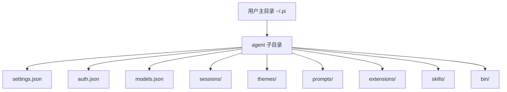
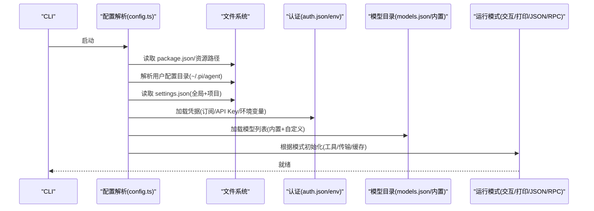
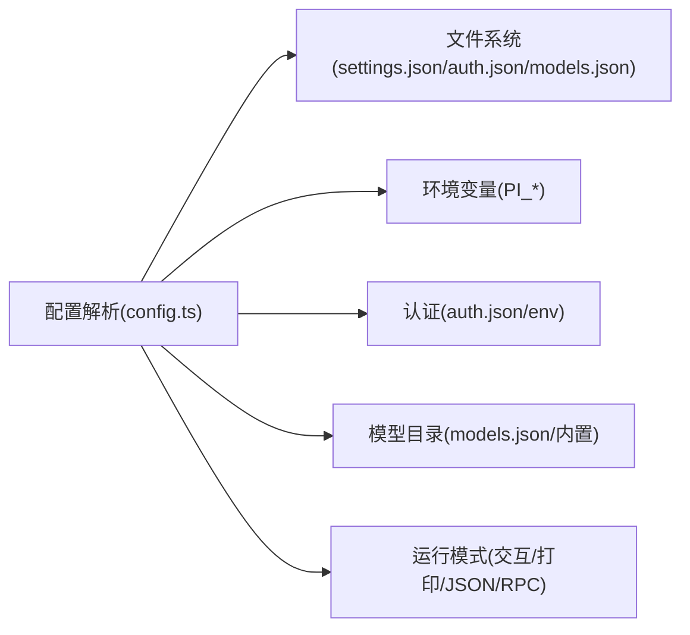

# 配置管理

<cite>
**本文引用的文件**
- [config.ts](file://packages/coding-agent/src/config.ts)
- [README.md](file://packages/coding-agent/README.md)
- [moonshotai-cn.ts](file://packages/ai/src/providers/moonshotai-cn.ts)
- [settings.md](file://packages/coding-agent/docs/settings.md)
- [providers.md](file://packages/coding-agent/docs/providers.md)
- [environment-variables.md](file://packages/coding-agent/docs/environment-variables.md)
- [containerization.md](file://packages/coding-agent/docs/containerization.md)
- [custom-provider.md](file://packages/coding-agent/docs/custom-provider.md)
</cite>

## 目录
1. [简介](#简介)
2. [项目结构](#项目结构)
3. [核心组件](#核心组件)
4. [架构总览](#架构总览)
5. [详细组件分析](#详细组件分析)
6. [依赖关系分析](#依赖关系分析)
7. [性能考虑](#性能考虑)
8. [故障排查指南](#故障排查指南)
9. [结论](#结论)
10. [附录](#附录)

## 简介
本文件为编码代理的配置系统提供完整、可操作的文档，覆盖以下主题：
- 配置文件位置与格式：.pi 目录结构、settings.json 配置项、环境变量设置
- 配置选项详解：AI 提供商与模型选择、API 密钥管理、安全与信任策略、性能调优参数
- 运行模式差异：交互模式、批处理（打印/JSON/RPC）模式、容器化部署配置
- 配置优先级与继承机制：全局与项目级配置合并规则
- 常用模板与最佳实践：开箱即用模板、推荐实践清单
- 配置验证、错误诊断与迁移指南
- 自定义模式与主题配置方法

## 项目结构
编码代理将用户配置与运行时资源集中在 .pi 目录中，并通过 settings.json 进行统一开关与参数控制。关键路径由代码在启动时解析并加载。

- 用户配置根目录
  - 默认路径：~/.pi/agent
  - 可通过环境变量 PI_CODING_AGENT_DIR 或 PI_CODING_AGENT_SESSION_DIR 覆盖
- 重要子目录与文件
  - settings.json：全局/项目级设置（行为、工具、传输、缓存等）
  - auth.json：认证凭据存储（如订阅登录后的令牌）
  - models.json：自定义模型注册表（OpenAI/Anthropic/Google 兼容接口）
  - sessions：会话 JSONL 存储（按工作目录组织）
  - themes：自定义主题
  - prompts：提示词模板
  - extensions/skills：扩展与技能包
  - bin：托管的二进制工具（如 fd、rg）
- 内置资源路径
  - 主题、导出模板、交互式资源等由运行时根据安装方式（Bun 二进制/Node dist/tsx）动态定位

图表来源
- [config.ts:514-566](file://packages/coding-agent/src/config.ts#L514-L566)

章节来源
- [config.ts:514-566](file://packages/coding-agent/src/config.ts#L514-L566)
- [README.md:284-317](file://packages/coding-agent/README.md#L284-L317)

## 核心组件
- 配置路径解析器
  - 负责解析用户配置目录、会话目录、主题目录、模型/认证/设置文件路径
  - 支持通过环境变量覆盖默认路径
- 应用元数据与包资源定位
  - 从 package.json 读取名称、版本、配置目录名
  - 根据运行环境（Bun/Node/tsx）定位主题、HTML 导出模板、交互式资源
- 安装方式检测与自更新指令生成
  - 自动识别 npm/pnpm/yarn/bun/bun-binary 安装方式，生成自更新命令
  - 校验全局包根与写权限，给出不可更新时的提示

章节来源
- [config.ts:15-94](file://packages/coding-agent/src/config.ts#L15-L94)
- [config.ts:315-355](file://packages/coding-agent/src/config.ts#L315-L355)
- [config.ts:367-464](file://packages/coding-agent/src/config.ts#L367-L464)
- [config.ts:470-508](file://packages/coding-agent/src/config.ts#L470-L508)

## 架构总览
配置系统在启动阶段完成如下流程：
- 解析应用元数据与包资源路径
- 确定用户配置目录与文件路径
- 加载 settings.json（全局与项目级合并）
- 初始化认证（auth.json 或环境变量）
- 加载模型目录（内置 + models.json 自定义）
- 根据运行模式（交互/打印/JSON/RPC）启用不同能力

图表来源
- [config.ts:470-508](file://packages/coding-agent/src/config.ts#L470-L508)
- [config.ts:514-566](file://packages/coding-agent/src/config.ts#L514-L566)
- [README.md:284-317](file://packages/coding-agent/README.md#L284-L317)

## 详细组件分析

### 配置文件位置与格式
- 全局设置：~/.pi/agent/settings.json
- 项目设置：.pi/settings.json（覆盖全局）
- 会话存储：~/.pi/agent/sessions（JSONL 树形结构）
- 认证信息：~/.pi/agent/auth.json
- 自定义模型：~/.pi/agent/models.json
- 主题/提示/扩展/技能：对应目录位于 agent 下

章节来源
- [config.ts:523-566](file://packages/coding-agent/src/config.ts#L523-L566)
- [README.md:284-317](file://packages/coding-agent/README.md#L284-L317)

### 环境变量设置
- 配置目录与会话目录
  - PI_CODING_AGENT_DIR：覆盖配置目录
  - PI_CODING_AGENT_SESSION_DIR：覆盖会话目录
- 网络与遥测
  - PI_OFFLINE：禁用所有启动网络操作（更新检查、包更新检查、遥测）
  - PI_SKIP_VERSION_CHECK：跳过版本更新检查
  - PI_TELEMETRY：控制安装/更新遥测与供应商归属头
- 缓存与编辑器
  - PI_CACHE_RETENTION：延长提示缓存保留时间
  - VISUAL/EDITOR：外部编辑器回退
- 包目录
  - PI_PACKAGE_DIR：覆盖包目录（适用于 Nix/Guix 等场景）

章节来源
- [config.ts:494-508](file://packages/coding-agent/src/config.ts#L494-L508)
- [README.md:665-690](file://packages/coding-agent/README.md#L665-L690)

### AI 提供商配置与模型选择
- 内置提供商与模型目录自动刷新；可通过 /login 使用订阅或 API Key 认证
- 支持的提供商包括 Anthropic、OpenAI、Google、Azure OpenAI、DeepSeek、NVIDIA NIM、Mistral、Groq、Cerebras、Cloudflare AI Gateway、Cloudflare Workers AI、xAI、OpenRouter、Vercel AI Gateway、ZAI Coding Plan（全球/中国）、OpenCode Zen/Go、Hugging Face、Fireworks、Together AI、Baseten、Kimi For Coding、MiniMax、Xiaomi MiMo 系列等
- 本地 llama.cpp 路由服务器：通过 /login llama.cpp 管理下载与加载模型，再用 /model 选择
- 自定义模型：在 ~/.pi/agent/models.json 中添加符合 OpenAI/Anthropic/Google 接口的模型；自定义 API/OAuth 需通过扩展实现

章节来源
- [README.md:97-143](file://packages/coding-agent/README.md#L97-L143)
- [providers.md](file://packages/coding-agent/docs/providers.md)
- [custom-provider.md](file://packages/coding-agent/docs/custom-provider.md)

### API 密钥管理与安全设置
- 认证方式
  - 订阅登录：/login 后选择提供商
  - API Key：通过环境变量或命令行 --api-key 传入
- 示例：Moonshot AI CN 提供商通过环境变量 MOONSHOT_API_KEY 注入密钥
- 项目信任策略
  - 首次进入含项目设置/资源的目录会询问是否信任
  - 非交互模式默认使用 defaultProjectTrust（ask/always/never），可用 --approve/--no-approve 单次覆盖
  - 信任决策保存在 ~/.pi/agent/trust.json

章节来源
- [README.md:77-91](file://packages/coding-agent/README.md#L77-L91)
- [README.md:295-308](file://packages/coding-agent/README.md#L295-L308)
- [moonshotai-cn.ts:6-14](file://packages/ai/src/providers/moonshotai-cn.ts#L6-L14)

### 性能调优参数
- 消息队列与传输
  - steeringMode/followUpMode：控制消息投递策略（逐个/全部）
  - transport：SSE/WebSocket/Auto 传输偏好
- 上下文压缩
  - 自动压缩：在接近上下文限制时主动触发，溢出时恢复并重试
  - 手动压缩：/compact 或 /compact <自定义指令>
  - 压缩为有损过程，完整历史仍保存在 JSONL 中
- 缓存保留
  - PI_CACHE_RETENTION=long 延长提示缓存（Anthropic 1h、OpenAI 24h）

章节来源
- [README.md:221-233](file://packages/coding-agent/README.md#L221-L233)
- [README.md:272-281](file://packages/coding-agent/README.md#L272-L281)
- [README.md:665-690](file://packages/coding-agent/README.md#L665-L690)

### 运行模式配置差异
- 交互模式
  - 默认模式，提供 TUI、命令、快捷键、消息队列、会话管理等
- 批处理模式
  - 打印模式：-p/--print 输出响应后退出
  - JSON 模式：--mode json 输出事件流（JSONL）
  - RPC 模式：--mode rpc 通过 stdin/stdout 的严格 LF 分隔 JSONL 协议集成
- 容器化部署
  - 参考 containerization.md 了解容器内配置要点（离线、只读卷、最小权限等）

章节来源
- [README.md:539-603](file://packages/coding-agent/README.md#L539-L603)
- [README.md:665-690](file://packages/coding-agent/README.md#L665-L690)
- [containerization.md](file://packages/coding-agent/docs/containerization.md)

### 配置优先级与继承机制
- 全局设置：~/.pi/agent/settings.json
- 项目设置：.pi/settings.json（覆盖全局）
- 命令行参数：最高优先级（如 --provider、--model、--thinking、--tools、--no-* 等）
- 环境变量：覆盖默认行为（如 PI_OFFLINE、PI_SKIP_VERSION_CHECK、PI_TELEMETRY、PI_CACHE_RETENTION）
- 项目信任：trust.json 决定项目资源加载范围；非交互模式受 defaultProjectTrust 控制

章节来源
- [README.md:284-317](file://packages/coding-agent/README.md#L284-L317)
- [README.md:539-617](file://packages/coding-agent/README.md#L539-L617)
- [README.md:665-690](file://packages/coding-agent/README.md#L665-L690)

### 常用配置模板与最佳实践
- 模板建议
  - 全局 settings.json：开启必要工具、设置默认传输、关闭遥测、设置缓存保留
  - 项目 settings.json：限定工具白名单、指定模型/思考级别、启用/禁用扩展与技能
  - 环境变量：CI/CD 中使用 PI_OFFLINE=1、PI_SKIP_VERSION_CHECK=1、PI_TELEMETRY=0
- 最佳实践
  - 使用项目信任策略避免误加载敏感资源
  - 通过 --tools/--exclude-tools 精确控制可用工具
  - 使用 --models 限制模型循环范围，提升切换效率
  - 在容器中固定镜像与只读配置，结合离线模式减少网络依赖

章节来源
- [README.md:539-617](file://packages/coding-agent/README.md#L539-L617)
- [README.md:665-690](file://packages/coding-agent/README.md#L665-L690)

### 配置验证、错误诊断与迁移指南
- 验证
  - 使用 /reload 重新加载键绑定、扩展、技能、提示、主题与上下文文件
  - 使用 /session 查看当前会话信息与 ID
- 诊断
  - 调试日志路径：~/.pi/agent/pi-debug.log
  - 网络问题：设置 PI_OFFLINE=1 排除网络干扰；检查 PI_SKIP_VERSION_CHECK/PI_TELEMETRY
  - 认证失败：确认 /login 状态或环境变量 API Key；检查 auth.json 权限
- 迁移
  - 从旧版迁移到新版的设置项请参考 settings.md
  - 自定义模型/提供商请遵循 providers.md 与 custom-provider.md

章节来源
- [config.ts:563-566](file://packages/coding-agent/src/config.ts#L563-L566)
- [README.md:197-200](file://packages/coding-agent/README.md#L197-L200)
- [settings.md](file://packages/coding-agent/docs/settings.md)
- [providers.md](file://packages/coding-agent/docs/providers.md)
- [custom-provider.md](file://packages/coding-agent/docs/custom-provider.md)

### 自定义模式与主题配置
- 主题
  - 内置 dark/light；热重载生效
  - 放置于 ~/.pi/agent/themes/ 或 .pi/themes/ 或通过 pi 包分发
- 自定义模式
  - 通过扩展（TypeScript 模块）注册工具、命令、键盘快捷键、事件处理器与 UI 组件
  - 可在启动前异步执行一次性初始化（如拉取远程模型列表）
- 提示模板与技能
  - 提示模板：~/.pi/agent/prompts/ 或 .pi/prompts/
  - 技能：~/.pi/agent/skills/ 或 .pi/skills/，遵循 Agent Skills 标准

章节来源
- [README.md:339-405](file://packages/coding-agent/README.md#L339-L405)
- [themes.md](file://packages/coding-agent/docs/themes.md)
- [extensions.md](file://packages/coding-agent/docs/extensions.md)
- [prompt-templates.md](file://packages/coding-agent/docs/prompt-templates.md)
- [skills.md](file://packages/coding-agent/docs/skills.md)

## 依赖关系分析
- 配置解析依赖文件系统访问与环境变量
- 认证依赖 auth.json 与提供商 SDK（通过环境变量注入 API Key）
- 模型目录依赖内置模型与 models.json 自定义模型
- 运行模式依赖 CLI 参数与 settings.json 中的传输/工具/缓存设置

图表来源
- [config.ts:470-508](file://packages/coding-agent/src/config.ts#L470-L508)
- [config.ts:514-566](file://packages/coding-agent/src/config.ts#L514-L566)

章节来源
- [config.ts:470-566](file://packages/coding-agent/src/config.ts#L470-L566)

## 性能考虑
- 合理设置 thinking level 与模型范围，降低不必要的高成本调用
- 使用消息队列策略（steeringMode/followUpMode）避免阻塞
- 启用缓存保留（PI_CACHE_RETENTION=long）以减少重复计算
- 在长会话中利用自动/手动压缩控制上下文大小
- 容器化部署中关闭网络更新与遥测，减少启动开销

[本节为通用指导，不直接分析具体文件]

## 故障排查指南
- 无法加载项目设置
  - 检查项目信任策略与 trust.json；非交互模式使用 --approve/--no-approve
- 认证失败
  - 确认 /login 状态或环境变量 API Key；检查 auth.json 权限与内容
- 网络相关错误
  - 设置 PI_OFFLINE=1 排除网络；检查 PI_SKIP_VERSION_CHECK/PI_TELEMETRY
- 模型不可用
  - 使用 /list-models 查看可用模型；确认 models.json 与提供商配置
- 调试日志
  - 查看 ~/.pi/agent/pi-debug.log 获取详细错误堆栈

章节来源
- [README.md:295-317](file://packages/coding-agent/README.md#L295-L317)
- [config.ts:563-566](file://packages/coding-agent/src/config.ts#L563-L566)

## 结论
本配置系统以 .pi/agent 为核心，通过 settings.json、auth.json、models.json 与环境变量实现灵活、可扩展的配置管理。支持多提供商、多模式运行与容器化部署，具备完善的信任策略、性能调优与诊断能力。建议在生产环境中采用项目级最小权限与离线模式，结合自定义扩展与主题满足特定需求。

[本节为总结性内容，不直接分析具体文件]

## 附录
- 环境变量参考：environment-variables.md
- 提供商配置参考：providers.md
- 自定义提供商参考：custom-provider.md
- 容器化部署参考：containerization.md
- 设置项参考：settings.md

[本节为索引性内容，不直接分析具体文件]