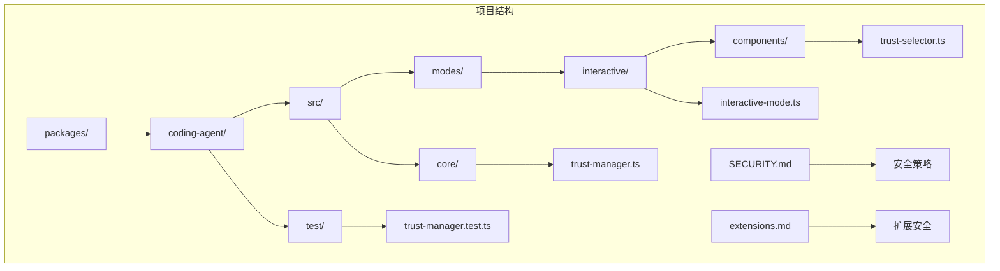
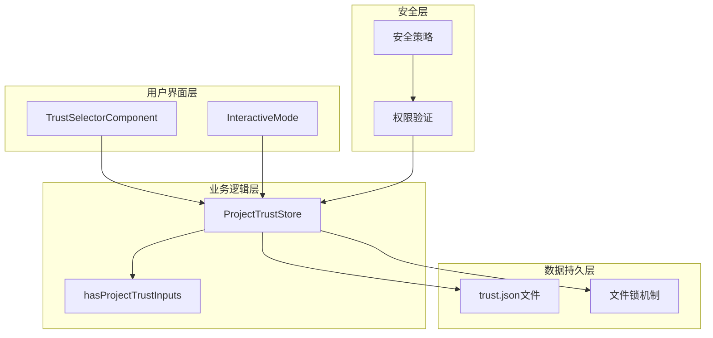
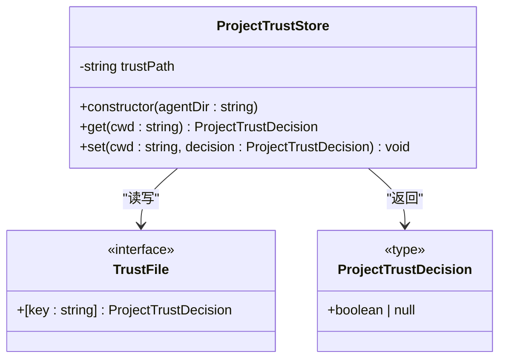
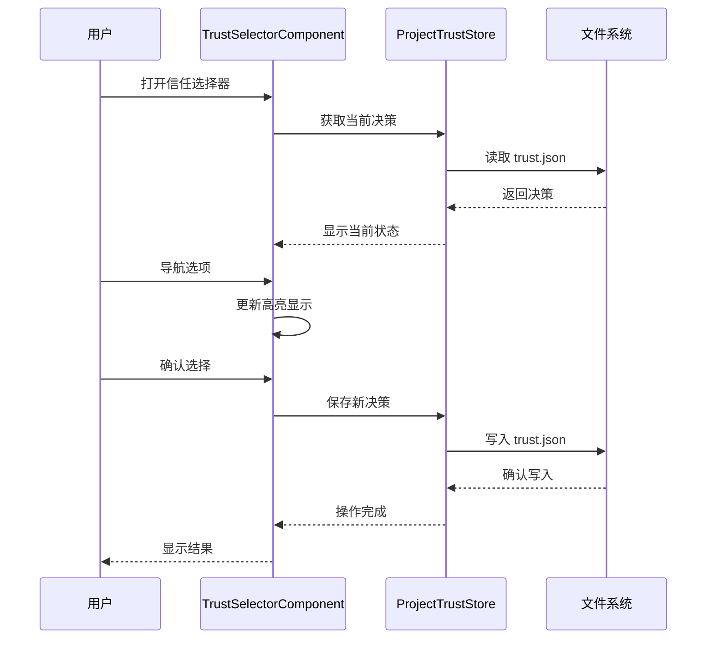
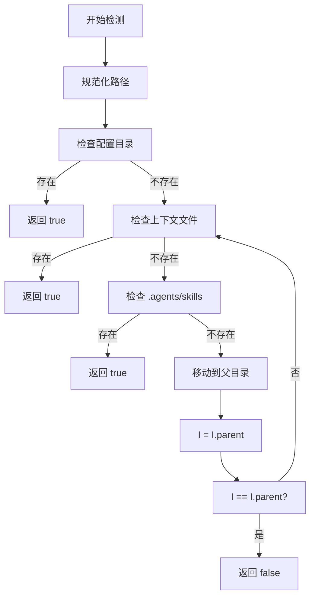

# 项目信任管理

<cite>
**本文档引用的文件**
- [packages/coding-agent/src/core/trust-manager.ts](file://packages/coding-agent/src/core/trust-manager.ts)
- [packages/coding-agent/src/modes/interactive/interactive-mode.ts](file://packages/coding-agent/src/modes/interactive/interactive-mode.ts)
- [packages/coding-agent/src/modes/interactive/components/trust-selector.ts](file://packages/coding-agent/src/modes/interactive/components/trust-selector.ts)
- [packages/coding-agent/test/trust-manager.test.ts](file://packages/coding-agent/test/trust-manager.test.ts)
- [SECURITY.md](file://SECURITY.md)
- [packages/coding-agent/docs/extensions.md](file://packages/coding-agent/docs/extensions.md)
</cite>

## 目录
1. [简介](#简介)
2. [项目结构](#项目结构)
3. [核心组件](#核心组件)
4. [架构概览](#架构概览)
5. [详细组件分析](#详细组件分析)
6. [依赖关系分析](#依赖关系分析)
7. [性能考虑](#性能考虑)
8. [故障排除指南](#故障排除指南)
9. [结论](#结论)

## 简介

项目信任管理是 Pi 编码代理系统中的一个关键安全机制，用于管理用户对不同项目目录的信任决策。该系统通过持久化的信任存储、交互式选择器和严格的锁定机制，确保用户能够明确控制代理在各个项目中的权限范围。

信任管理系统的核心目标是在提供便利的同时维护安全性，允许用户为不同的项目目录设置独立的信任级别，并通过可视化界面进行决策确认。

## 项目结构

Pi 项目采用模块化架构，信任管理功能主要集中在编码代理包中：



**图表来源**
- [packages/coding-agent/src/core/trust-manager.ts:1-148](file://packages/coding-agent/src/core/trust-manager.ts#L1-L148)
- [packages/coding-agent/src/modes/interactive/interactive-mode.ts:4166-4189](file://packages/coding-agent/src/modes/interactive/interactive-mode.ts#L4166-L4189)

**章节来源**
- [packages/coding-agent/src/core/trust-manager.ts:1-148](file://packages/coding-agent/src/core/trust-manager.ts#L1-L148)
- [packages/coding-agent/src/modes/interactive/interactive-mode.ts:4166-4189](file://packages/coding-agent/src/modes/interactive/interactive-mode.ts#L4166-L4189)

## 核心组件

### 信任存储系统

信任存储系统是整个信任管理的核心，负责持久化用户的信任决策。它提供了以下关键功能：

- **项目级信任决策**：为每个项目目录保存独立的信任状态
- **原子性操作**：通过文件锁定确保并发访问的安全性
- **数据验证**：自动清理和验证存储的数据格式
- **路径规范化**：统一处理不同形式的项目路径

### 交互式信任选择器

交互式选择器为用户提供直观的图形界面来管理信任决策：

- **可视化决策界面**：清晰显示当前项目的信任状态
- **键盘导航支持**：支持方向键和确认键进行操作
- **即时反馈**：操作后立即显示结果和状态变化
- **历史记录显示**：展示之前的信任决策和当前会话状态

### 安全边界定义

系统明确定义了安全边界，指导用户如何正确使用和配置信任管理：

- **本地用户账户信任**：用户主目录和可写文件被视为可信边界
- **扩展安装限制**：仅从可信源安装扩展
- **仓库信任要求**：仅在可信仓库中使用 Pi
- **配置文件风险**：避免在配置文件中注入恶意内容

**章节来源**
- [packages/coding-agent/src/core/trust-manager.ts:97-148](file://packages/coding-agent/src/core/trust-manager.ts#L97-L148)
- [packages/coding-agent/src/modes/interactive/components/trust-selector.ts:1-118](file://packages/coding-agent/src/modes/interactive/components/trust-selector.ts#L1-L118)
- [SECURITY.md:1-88](file://SECURITY.md#L1-L88)

## 架构概览

信任管理系统采用分层架构设计，确保各组件职责清晰且相互协作：



**图表来源**
- [packages/coding-agent/src/modes/interactive/components/trust-selector.ts:35-118](file://packages/coding-agent/src/modes/interactive/components/trust-selector.ts#L35-L118)
- [packages/coding-agent/src/core/trust-manager.ts:121-148](file://packages/coding-agent/src/core/trust-manager.ts#L121-L148)
- [packages/coding-agent/src/modes/interactive/interactive-mode.ts:4166-4189](file://packages/coding-agent/src/modes/interactive/interactive-mode.ts#L4166-L4189)

系统架构的关键特点包括：

- **分层设计**：界面层、业务逻辑层和数据持久层分离
- **锁机制**：防止并发修改导致的数据不一致
- **路径标准化**：统一处理各种路径格式
- **错误处理**：优雅处理文件系统异常

## 详细组件分析

### ProjectTrustStore 类分析

ProjectTrustStore 是信任管理的核心类，实现了完整的 CRUD 操作：



**图表来源**
- [packages/coding-agent/src/core/trust-manager.ts:121-148](file://packages/coding-agent/src/core/trust-manager.ts#L121-L148)

#### 核心方法实现

**get 方法**：
- 使用文件锁确保线程安全
- 读取并解析 trust.json 文件
- 返回指定目录的信任决策或 null
- 支持布尔值和 null 值的类型检查

**set 方法**：
- 获取文件锁后执行写入操作
- 更新指定目录的信任状态
- 删除键值对以重置决策
- 自动排序和格式化 JSON 数据

**章节来源**
- [packages/coding-agent/src/core/trust-manager.ts:128-147](file://packages/coding-agent/src/core/trust-manager.ts#L128-L147)

### TrustSelectorComponent 组件分析

TrustSelectorComponent 提供了用户友好的交互界面：



**图表来源**
- [packages/coding-agent/src/modes/interactive/components/trust-selector.ts:101-117](file://packages/coding-agent/src/modes/interactive/components/trust-selector.ts#L101-L117)
- [packages/coding-agent/src/modes/interactive/interactive-mode.ts:4166-4189](file://packages/coding-agent/src/modes/interactive/interactive-mode.ts#L4166-L4189)

#### 交互流程

组件支持多种输入方式：
- 方向键上下导航（支持 k/j 键）
- 确认键保存选择
- 取消键退出操作
- 实时显示当前和保存的决策状态

**章节来源**
- [packages/coding-agent/src/modes/interactive/components/trust-selector.ts:101-118](file://packages/coding-agent/src/modes/interactive/components/trust-selector.ts#L101-L118)

### hasProjectTrustInputs 函数分析

该函数用于检测项目是否包含信任输入：



**图表来源**
- [packages/coding-agent/src/core/trust-manager.ts:97-119](file://packages/coding-agent/src/core/trust-manager.ts#L97-L119)

**章节来源**
- [packages/coding-agent/src/core/trust-manager.ts:97-119](file://packages/coding-agent/src/core/trust-manager.ts#L97-L119)

## 依赖关系分析

信任管理系统与其他组件的依赖关系如下：

```mermaid
graph LR
subgraph "外部依赖"
A[lockfile]
B[node:fs]
C[node:path]
D[node:os]
end
subgraph "内部组件"
E[ProjectTrustStore]
F[TrustSelectorComponent]
G[InteractiveMode]
H[hasProjectTrustInputs]
end
subgraph "UI框架"
I[@earendil-works/pi-tui]
end
E --> A
E --> B
E --> C
E --> D
F --> I
G --> E
H --> C
H --> B
```

**图表来源**
- [packages/coding-agent/src/core/trust-manager.ts:1-10](file://packages/coding-agent/src/core/trust-manager.ts#L1-L10)
- [packages/coding-agent/src/modes/interactive/components/trust-selector.ts:1-6](file://packages/coding-agent/src/modes/interactive/components/trust-selector.ts#L1-L6)

### 关键依赖说明

**lockfile 库**：
- 提供文件系统级别的锁机制
- 防止多个进程同时修改信任文件
- 支持超时和重试机制

**Node.js 核心模块**：
- fs：文件读写操作
- path：路径处理和规范化
- os：临时目录和平台相关功能

**TUI 框架**：
- @earendil-works/pi-tui：提供终端用户界面组件
- 支持键盘导航和实时渲染

**章节来源**
- [packages/coding-agent/src/core/trust-manager.ts:1-10](file://packages/coding-agent/src/core/trust-manager.ts#L1-L10)
- [packages/coding-agent/src/modes/interactive/components/trust-selector.ts:1-6](file://packages/coding-agent/src/modes/interactive/components/trust-selector.ts#L1-L6)

## 性能考虑

信任管理系统的性能优化策略：

### 文件锁优化
- **同步锁机制**：避免将现有调用改为异步，保持调用栈简洁
- **重试策略**：最多尝试 10 次，每次延迟 20ms
- **错误处理**：区分锁定失败和其他异常情况

### 数据序列化
- **按键排序**：确保 JSON 文件按键名排序，便于版本控制
- **增量更新**：只更新变更的键值对
- **内存缓存**：减少频繁的文件 I/O 操作

### 路径处理
- **规范化路径**：统一处理相对路径和绝对路径
- **缓存计算结果**：避免重复的路径解析操作

## 故障排除指南

### 常见问题及解决方案

**信任文件损坏**
- 症状：系统无法读取 trust.json 文件
- 解决方案：手动删除损坏文件，系统会重新创建
- 预防措施：避免手动编辑信任文件

**文件锁定冲突**
- 症状：并发操作时出现 ELOCKED 错误
- 解决方案：等待其他进程释放锁或重启应用
- 预防措施：避免同时运行多个 Pi 实例

**权限问题**
- 症状：无法写入信任文件
- 解决方案：检查 ~/.pi/agent 目录的写权限
- 预防措施：确保用户账户对配置目录有写权限

**路径识别问题**
- 症状：信任决策不按预期生效
- 解决方案：检查项目根目录的识别逻辑
- 预防措施：确保项目包含有效的配置文件或上下文文件

**章节来源**
- [packages/coding-agent/test/trust-manager.test.ts:1-39](file://packages/coding-agent/test/trust-manager.test.ts#L1-L39)

## 结论

项目信任管理系统通过精心设计的架构和严格的实现，为 Pi 编码代理提供了强大的安全控制能力。系统的主要优势包括：

**安全性保障**：
- 多层安全边界定义
- 严格的权限验证机制
- 并发访问的文件锁保护

**用户体验优化**：
- 直观的图形界面选择器
- 清晰的状态显示和反馈
- 简单的键盘导航操作

**技术实现稳健**：
- 分层架构设计
- 完善的错误处理
- 性能优化策略

该系统为开发者提供了一个平衡安全性和便利性的解决方案，既保护了用户环境免受潜在威胁，又保持了良好的使用体验。通过持续的安全审计和改进，信任管理系统将继续为 Pi 生态系统提供可靠的安全保障。