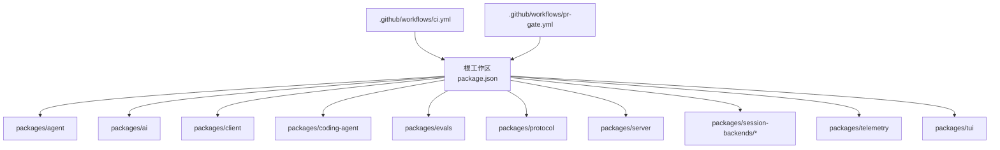
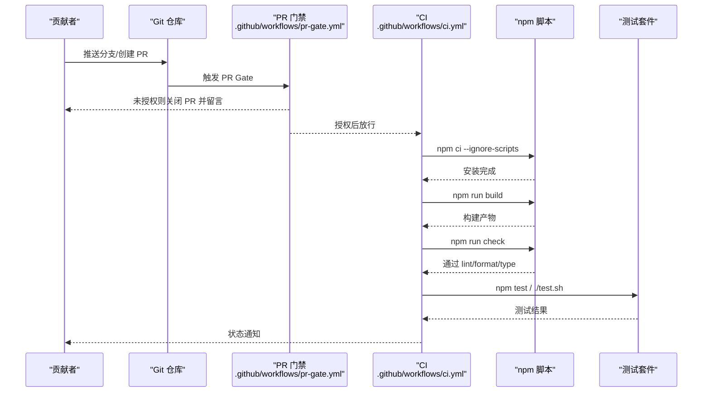
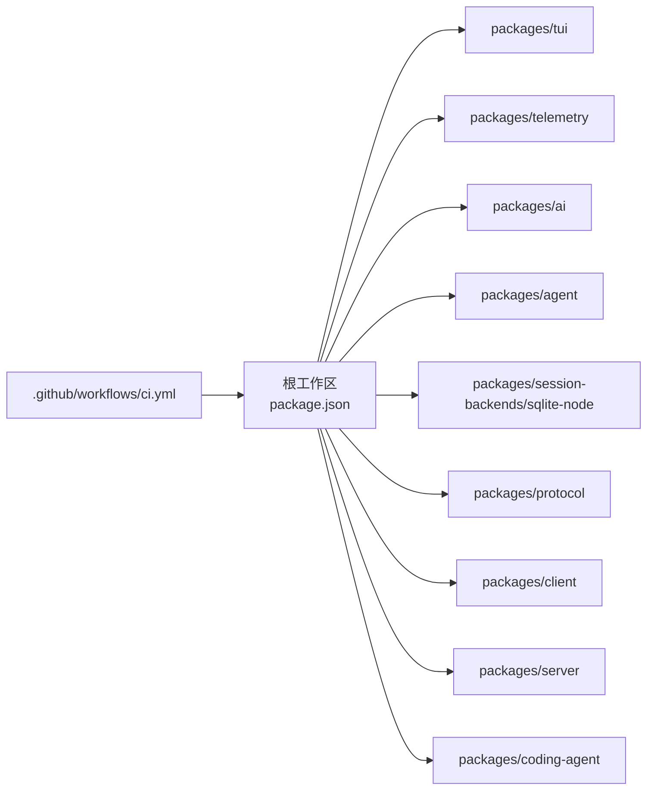

# 贡献指南

<cite>
**本文引用的文件**
- [CONTRIBUTING.md](file://CONTRIBUTING.md)
- [README.md](file://README.md)
- [AGENTS.md](file://AGENTS.md)
- [SECURITY.md](file://SECURITY.md)
- [package.json](file://package.json)
- [biome.json](file://biome.json)
- [tsconfig.base.json](file://tsconfig.base.json)
- [vitest.base.ts](file://vitest.base.ts)
- [test.sh](file://test.sh)
- [.github/workflows/ci.yml](file://.github/workflows/ci.yml)
- [.github/workflows/pr-gate.yml](file://.github/workflows/pr-gate.yml)
</cite>

## 目录
1. [简介](#简介)
2. [项目结构](#项目结构)
3. [核心组件](#核心组件)
4. [架构总览](#架构总览)
5. [详细组件分析](#详细组件分析)
6. [依赖关系分析](#依赖关系分析)
7. [性能注意事项](#性能注意事项)
8. [故障排查指南](#故障排查指南)
9. [结论](#结论)
10. [附录](#附录)

## 简介
本指南面向希望参与 pi 项目的贡献者，涵盖开发环境搭建、代码规范与风格、提交流程、测试要求、代码审查、文档贡献、工具与 IDE 配置、社区参与方式、许可证与安全事项，以及新贡献者入门与指导资源。目标是让不同背景的贡献者都能高效、安全地参与项目。

## 项目结构
pi 是一个多包（monorepo）工程，核心包包括 agent、ai、client、coding-agent、evals、protocol、server、session-backends、telemetry、tui 等。根目录提供统一的脚本、工作区配置、构建与检查命令，以及 CI/CD 工作流。

图表来源
- [package.json:1-75](file://package.json#L1-L75)
- [.github/workflows/ci.yml:1-43](file://.github/workflows/ci.yml#L1-L43)
- [.github/workflows/pr-gate.yml:1-129](file://.github/workflows/pr-gate.yml#L1-L129)

章节来源
- [package.json:1-75](file://package.json#L1-L75)
- [README.md:26-35](file://README.md#L26-L35)

## 核心组件
- 统一入口与脚本：根 package.json 定义了构建、检查、测试、发布等脚本，协调各子包的构建顺序与任务。
- 代码质量与格式：Biome 负责 lint/format，TypeScript 基础编译选项集中管理。
- 测试框架：Vitest 通过共享基础配置 vitest.base.ts 进行别名解析与工作区引用。
- 隔离测试执行：test.sh 在隔离环境中运行测试，避免污染用户环境与凭据。
- CI/PR 门禁：GitHub Actions 在 PR 阶段校验贡献者权限并执行构建、检查与测试。

章节来源
- [package.json:14-49](file://package.json#L14-L49)
- [biome.json:1-42](file://biome.json#L1-L42)
- [tsconfig.base.json:1-26](file://tsconfig.base.json#L1-L26)
- [vitest.base.ts:1-33](file://vitest.base.ts#L1-L33)
- [test.sh:1-80](file://test.sh#L1-L80)
- [.github/workflows/ci.yml:1-43](file://.github/workflows/ci.yml#L1-L43)
- [.github/workflows/pr-gate.yml:1-129](file://.github/workflows/pr-gate.yml#L1-L129)

## 架构总览
下图展示了从贡献者提交到 CI 门禁与测试执行的端到端流程，以及本地开发与检查的闭环。

图表来源
- [.github/workflows/pr-gate.yml:1-129](file://.github/workflows/pr-gate.yml#L1-L129)
- [.github/workflows/ci.yml:1-43](file://.github/workflows/ci.yml#L1-L43)
- [package.json:14-49](file://package.json#L14-L49)
- [test.sh:1-80](file://test.sh#L1-L80)

## 详细组件分析

### 开发环境与依赖安装
- Node.js 版本要求：>= 22.19.0（由 engines 字段约束）。
- 安装依赖：使用 npm install --ignore-scripts 或 CI 中的 npm ci --ignore-scripts。
- 构建：npm run build 会按顺序构建 tui、telemetry、ai、agent、session-backends/sqlite-node、protocol、client、server、coding-agent。
- 离线构建：npm run build:offline 复用已有模型数据，无需网络。
- 检查：npm run check 包含 Biome 检查、依赖锁定检查、TS 导入检查、shrinkwrap 检查、类型检查与浏览器冒烟测试。
- 测试：./test.sh 在隔离环境中运行测试；npm test 会同时运行脚本测试与工作区测试。

章节来源
- [package.json:63-65](file://package.json#L63-L65)
- [package.json:14-49](file://package.json#L14-L49)
- [README.md:52-61](file://README.md#L52-L61)
- [test.sh:1-80](file://test.sh#L1-L80)

### 代码规范与风格
- 语言与模块系统：TypeScript，目标 ES2022，模块 Node16，严格模式开启。
- 可擦除语法：仅使用可擦除的 TS 语法（无 enum/namespace/import= 等需要 JS emit 的特性）。
- 命名与导入：强制一致的文件名大小写，启用声明与映射，支持相对导入扩展重写。
- 格式化与 Lint：Biome 规则集启用推荐规则，缩进为 Tab、宽度 3、行宽 120；禁用非空断言与 any 的规则可按需调整。
- 工作区范围：对 packages/*/src、packages/*/test、session-backends 与 coding-agent examples 生效。

章节来源
- [tsconfig.base.json:1-26](file://tsconfig.base.json#L1-L26)
- [biome.json:1-42](file://biome.json#L1-L42)
- [AGENTS.md:15-28](file://AGENTS.md#L15-L28)

### 提交流程与分支管理
- 贡献门槛：新贡献者的 Issue/PR 默认自动关闭，需在 Issue 中获得维护者回复“lgtm”后才可提交 PR。
- 分支策略：CI 针对 main 分支触发；PR 目标分支为 main。
- 提交信息：遵循约定式提交格式，如 feat/fix/docs 前缀，并在必要时标注影响包。
- 预提交保护：husky 钩子与脚本限制锁文件随意提交，确保依赖变更受控。

章节来源
- [CONTRIBUTING.md:21-35](file://CONTRIBUTING.md#L21-L35)
- [CONTRIBUTING.md:56-69](file://CONTRIBUTING.md#L56-L69)
- [AGENTS.md:51-72](file://AGENTS.md#L51-L72)
- [.github/workflows/ci.yml:1-43](file://.github/workflows/ci.yml#L1-L43)
- [.github/workflows/pr-gate.yml:1-129](file://.github/workflows/pr-gate.yml#L1-L129)
- [package.json:49-49](file://package.json#L49-L49)

### Pull Request 流程
- 自动关闭机制：未获授权的 PR 将被自动关闭并附说明，引导先开 Issue 获取批准。
- 维护者审批：Issue 中回复“lgtmi”允许后续 Issue 保持打开，“lgtm”进一步允许 PR。
- 质量要求：Issue/PR 应简洁具体、可复现、符合模板与规范。

章节来源
- [CONTRIBUTING.md:21-35](file://CONTRIBUTING.md#L21-L35)
- [CONTRIBUTING.md:36-49](file://CONTRIBUTING.md#L36-L49)
- [.github/workflows/pr-gate.yml:1-129](file://.github/workflows/pr-gate.yml#L1-L129)

### 测试要求与用例编写指南
- 隔离执行：./test.sh 在隔离 home、临时目录与最小化环境变量下运行测试，避免外部凭据干扰。
- 跳过 LLM 相关测试：在无 API Key 环境下自动跳过依赖模型的测试。
- Vitest 别名：通过 vitest.base.ts 将 @earendil-works/* 包指向源码路径，便于本地调试与单测。
- 包级测试：每个包可有自己的 vitest.config.ts 与测试目录，遵循包内约定。

章节来源
- [test.sh:1-80](file://test.sh#L1-L80)
- [vitest.base.ts:1-33](file://vitest.base.ts#L1-L33)
- [package.json:33-34](file://package.json#L33-L34)

### 代码审查流程与标准
- 审查前置：提交前必须通过 npm run check 与 ./test.sh。
- 质量红线：不理解自身代码的改动不会被接受；AI 生成代码需理解后方可提交。
- 依赖安全：依赖与锁文件变更视为代码变更，需审阅；直接依赖固定版本，内部包保持范围版本。
- 发布前检查：prepublishOnly 会清理、构建并检查，确保发布质量。

章节来源
- [CONTRIBUTING.md:56-69](file://CONTRIBUTING.md#L56-L69)
- [AGENTS.md:42-50](file://AGENTS.md#L42-L50)
- [package.json:39-39](file://package.json#L39-L39)

### 文档贡献指南
- 文档位置：根 README 提供概览与开发指引；各包 README 与 docs 目录包含包级说明。
- 写作规范：保持简洁、技术导向、避免冗余；遵循 AGENTS.md 的对话与代码风格。
- 翻译流程：本项目未提供专用翻译流程；建议在 PR 中附带翻译后的文档并与原文保持一致更新。
- 变更日志：CHANGELOG 位于各包内，新增条目放入 [Unreleased] 对应小节，不修改已发布版本段。

章节来源
- [README.md:48-51](file://README.md#L48-L51)
- [AGENTS.md:110-125](file://AGENTS.md#L110-L125)
- [AGENTS.md:1-14](file://AGENTS.md#L1-L14)

### 开发工具与 IDE 配置建议
- 编辑器集成：启用 TypeScript 与 Biome 插件，设置 Tab 缩进、行宽 120。
- 类型检查：使用 tsconfig.base.json 作为基础配置，确保严格模式与模块解析一致。
- 测试运行：优先使用 ./test.sh 或在包内运行 Vitest；避免直接运行完整 e2e 套件。
- 依赖管理：安装时使用 --ignore-scripts；锁文件变更需显式允许并提交。

章节来源
- [biome.json:19-25](file://biome.json#L19-L25)
- [tsconfig.base.json:1-26](file://tsconfig.base.json#L1-L26)
- [AGENTS.md:29-40](file://AGENTS.md#L29-L40)
- [AGENTS.md:42-50](file://AGENTS.md#L42-L50)

### 社区讨论与项目规划
- 沟通渠道：Discord 用于快速问题与协作。
- 规划文档：RFC 页面公开部分长期计划与重大变更讨论。
- 反馈方式：Issue 模板与质量要求确保讨论聚焦与可行动。

章节来源
- [CONTRIBUTING.md:73-76](file://CONTRIBUTING.md#L73-L76)
- [CONTRIBUTING.md:99-103](file://CONTRIBUTING.md#L99-L103)
- [README.md:21-25](file://README.md#L21-L25)

### 许可证与法律相关事项
- 许可证：MIT。
- 安全边界：Pi 以运行用户的权限执行，建议使用容器或沙箱隔离；不受信任的扩展/技能风险不在本项目范围内。
- 漏洞报告：通过安全邮箱或 GitHub Security Advisories 私报，勿公开敏感问题。

章节来源
- [README.md:106-108](file://README.md#L106-L108)
- [SECURITY.md:1-17](file://SECURITY.md#L1-L17)
- [SECURITY.md:24-40](file://SECURITY.md#L24-L40)
- [SECURITY.md:42-68](file://SECURITY.md#L42-L68)

### 新贡献者入门与导师资源
- 入门步骤：阅读 CONTRIBUTING.md 与 AGENTS.md，了解质量门槛与提交前检查。
- 获得授权：在 Issue 中描述问题并请求维护者回复“lgtm”，之后方可提交 PR。
- 导师与社区：通过 Discord 提问与协作；关注 RFC 了解项目方向。

章节来源
- [CONTRIBUTING.md:21-35](file://CONTRIBUTING.md#L21-L35)
- [CONTRIBUTING.md:36-49](file://CONTRIBUTING.md#L36-L49)
- [CONTRIBUTING.md:73-76](file://CONTRIBUTING.md#L73-L76)
- [CONTRIBUTING.md:99-103](file://CONTRIBUTING.md#L99-L103)

## 依赖关系分析
下图展示根工作区与各包之间的构建与测试依赖关系，以及 CI 对工作区的调用。

图表来源
- [package.json:14-17](file://package.json#L14-L17)
- [.github/workflows/ci.yml:14-42](file://.github/workflows/ci.yml#L14-L42)

章节来源
- [package.json:14-17](file://package.json#L14-L17)
- [.github/workflows/ci.yml:14-42](file://.github/workflows/ci.yml#L14-L42)

## 性能注意事项
- 依赖安装：使用 npm ci --ignore-scripts 提升 CI 稳定性与速度。
- 构建优化：离线构建复用模型数据，减少网络开销。
- 测试隔离：./test.sh 隔离环境与最小化变量，避免外部因素导致的不稳定。
- 依赖锁定：直接依赖固定版本，降低升级带来的回归风险。

章节来源
- [README.md:76-88](file://README.md#L76-L88)
- [test.sh:1-80](file://test.sh#L1-L80)
- [package.json:63-65](file://package.json#L63-L65)

## 故障排查指南
- 构建失败：检查 Node 版本与系统依赖；确认 npm ci 与 npm run build 输出。
- 检查失败：查看 Biome 与类型检查错误，修复后再提交。
- 测试失败：确认 ./test.sh 是否因缺少 API Key 跳过了 LLM 相关测试；在包内定位失败用例。
- PR 被关：确认是否在 Issue 中获得“lgtm”授权；检查贡献者权限与自动化门禁。

章节来源
- [.github/workflows/ci.yml:14-42](file://.github/workflows/ci.yml#L14-L42)
- [test.sh:1-80](file://test.sh#L1-L80)
- [.github/workflows/pr-gate.yml:1-129](file://.github/workflows/pr-gate.yml#L1-L129)

## 结论
本指南总结了 pi 项目的贡献流程、开发环境、代码规范、测试与审查、文档与安全事项。遵循这些实践有助于提高贡献质量、降低维护成本，并确保项目持续稳定演进。

## 附录
- 常用命令速查：
  - 安装依赖：npm install --ignore-scripts
  - 构建：npm run build / npm run build:offline
  - 检查：npm run check
  - 测试：./test.sh / npm test
  - 发布：npm run release:*（维护者）
- 参考文件：
  - 贡献指南：CONTRIBUTING.md
  - 开发规则：AGENTS.md
  - 安全政策：SECURITY.md
  - 根配置：package.json、biome.json、tsconfig.base.json
  - 测试基础：vitest.base.ts、test.sh
  - CI 工作流：.github/workflows/ci.yml、.github/workflows/pr-gate.yml