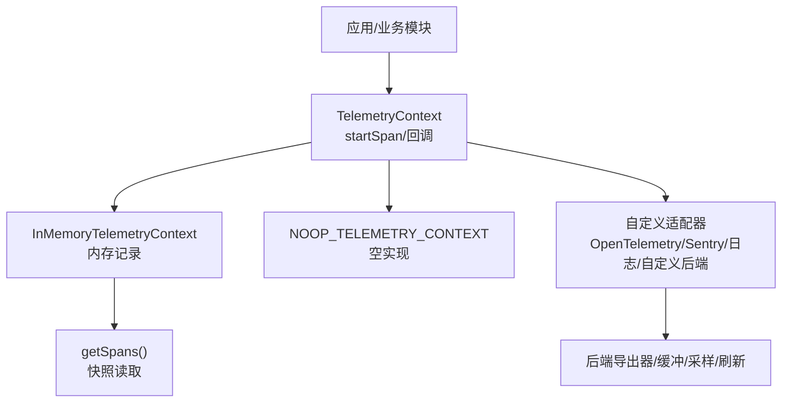
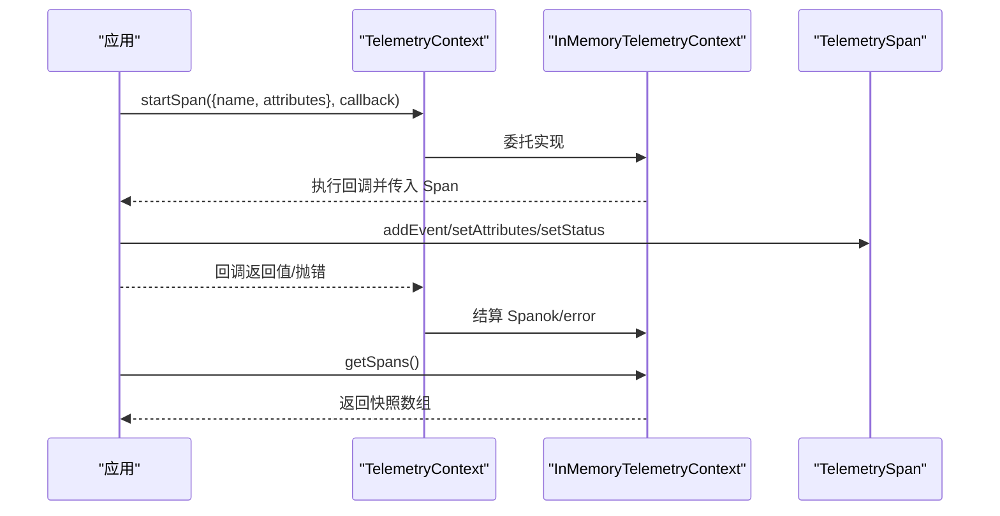
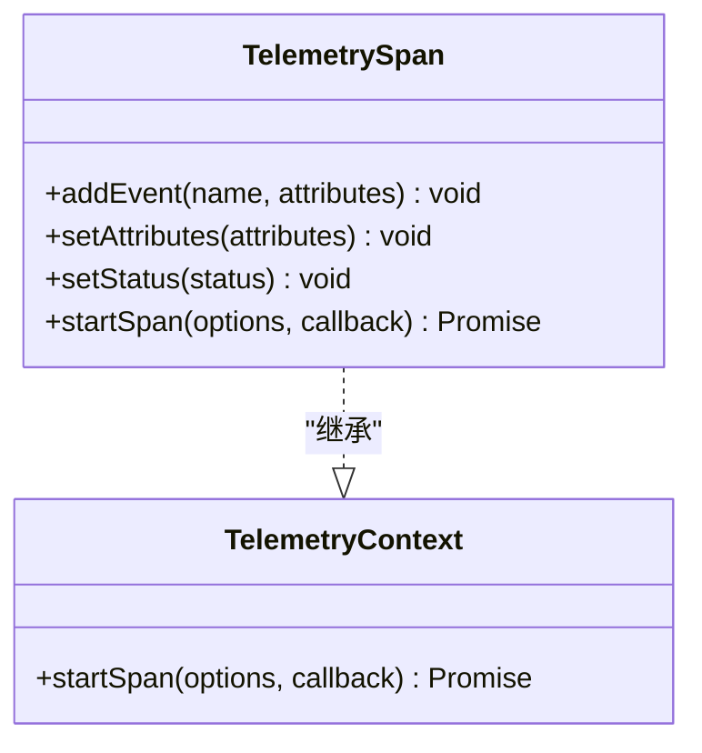
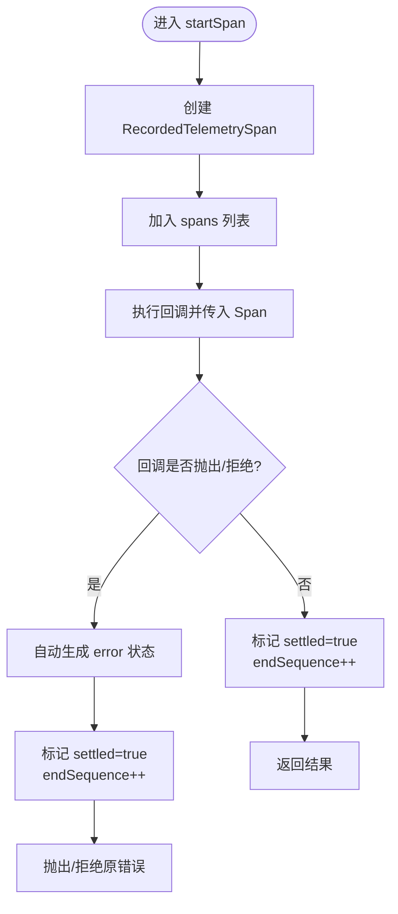
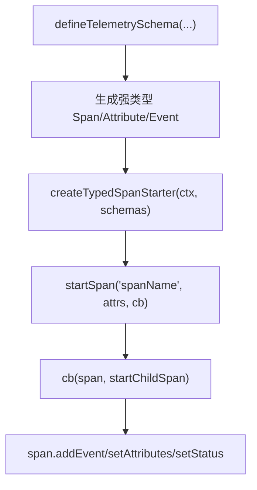
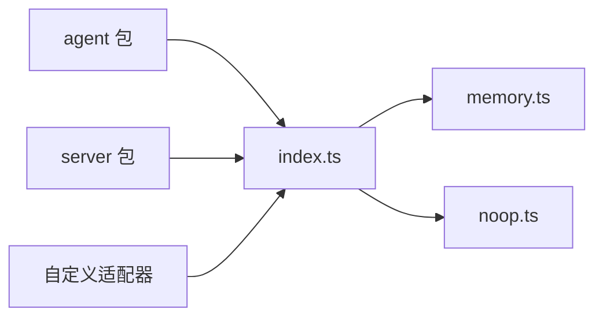

# 遥测系统

<cite>
**本文引用的文件**
- [packages/telemetry/README.md](file://packages/telemetry/README.md)
- [packages/telemetry/src/index.ts](file://packages/telemetry/src/index.ts)
- [packages/telemetry/src/memory.ts](file://packages/telemetry/src/memory.ts)
- [packages/telemetry/src/noop.ts](file://packages/telemetry/src/noop.ts)
- [packages/telemetry/package.json](file://packages/telemetry/package.json)
- [packages/agent/README.md](file://packages/agent/README.md)
- [packages/server/README.md](file://packages/server/README.md)
</cite>

## 目录
1. [简介](#简介)
2. [项目结构](#项目结构)
3. [核心组件](#核心组件)
4. [架构总览](#架构总览)
5. [详细组件分析](#详细组件分析)
6. [依赖关系分析](#依赖关系分析)
7. [性能考量](#性能考量)
8. [故障排查指南](#故障排查指南)
9. [结论](#结论)
10. [附录](#附录)

## 简介
本仓库中的遥测子系统以“供应商中立”的契约为核心，提供可插拔的上下文与跨度（Span）模型、类型安全的遥测模式定义、以及进程内参考实现。它不绑定任何后端导出器或全局状态，业务代码通过显式传递 TelemetryContext 来记录操作、事件、属性与状态，从而将“采集逻辑”和“存储/传输逻辑”解耦。这使得同一套采集代码可以对接 OpenTelemetry、Sentry、日志系统或自定义后端，同时保持跨运行时（Node.js、Bun、浏览器、Worker）的可移植性。

该设计强调：
- 明确的数据边界：仅允许标量与数组类型的属性值，避免在遥测中携带敏感数据。
- 强类型约束：通过模式定义与类型推断，确保 span 名称、事件名与属性键在编译期受控。
- 被动且幂等的记录：所有记录方法必须同步、非抛出、对已结算的 span 调用无效。
- 可测试性：内置 InMemoryTelemetryContext 与适配器一致性测试套件，便于验证行为。

**章节来源**
- [packages/telemetry/README.md:39-63](file://packages/telemetry/README.md#L39-L63)
- [packages/telemetry/README.md:385-392](file://packages/telemetry/README.md#L385-L392)

## 项目结构
遥测子系统位于 packages/telemetry，采用最小化、无外部依赖的设计：
- index.ts：暴露核心接口、类型与模式工具（TelemetryContext、TelemetrySpan、defineTelemetrySchema、createTypedSpanStarter 等）。
- memory.ts：进程内参考实现（InMemoryTelemetryContext），用于测试与本地诊断。
- noop.ts：空实现（NOOP_TELEMETRY_CONTEXT），用于禁用遥测时的零开销路径。
- testing：适配器一致性测试套件，用于验证第三方适配器的语义正确性。
- package.json：包元数据与导出配置。

**图表来源**
- [packages/telemetry/src/index.ts:14-22](file://packages/telemetry/src/index.ts#L14-L22)
- [packages/telemetry/src/memory.ts:192-219](file://packages/telemetry/src/memory.ts#L192-L219)
- [packages/telemetry/src/noop.ts:1-21](file://packages/telemetry/src/noop.ts#L1-L21)

**章节来源**
- [packages/telemetry/src/index.ts:1-22](file://packages/telemetry/src/index.ts#L1-L22)
- [packages/telemetry/src/memory.ts:1-26](file://packages/telemetry/src/memory.ts#L1-L26)
- [packages/telemetry/src/noop.ts:1-21](file://packages/telemetry/src/noop.ts#L1-L21)
- [packages/telemetry/package.json:1-48](file://packages/telemetry/package.json#L1-L48)

## 核心组件
- TelemetryContext：启动一个带回调的 Span，回调接收 TelemetrySpan 作为子上下文。
- TelemetrySpan：记录事件、合并属性、设置状态；自身也可作为父上下文继续创建子 Span。
- NOOP_TELEMETRY_CONTEXT：当遥测可选时使用的空实现，保证零开销。
- InMemoryTelemetryContext：进程内参考实现，返回按开始顺序的快照，适合测试与本地诊断。
- defineTelemetrySchema / createTypedSpanStarter：声明式模式与类型安全起点，约束 span 名称、事件与属性。

关键特性：
- 属性值限制为 string/number/boolean 及其数组形式。
- 属性合并策略：后定义的覆盖前者，undefined 被忽略。
- 状态默认 ok，异常或拒绝自动标记 error；显式 setStatus 优先。
- 记录方法必须同步、非抛出、对已结算 span 无效。

**章节来源**
- [packages/telemetry/src/index.ts:14-22](file://packages/telemetry/src/index.ts#L14-L22)
- [packages/telemetry/src/index.ts:26-69](file://packages/telemetry/src/index.ts#L26-L69)
- [packages/telemetry/src/index.ts:324-354](file://packages/telemetry/src/index.ts#L324-L354)
- [packages/telemetry/src/memory.ts:192-219](file://packages/telemetry/src/memory.ts#L192-L219)
- [packages/telemetry/src/noop.ts:1-21](file://packages/telemetry/src/noop.ts#L1-L21)

## 架构总览
遥测系统由“契约层 + 参考实现 + 模式工具 + 测试套件”组成，业务代码只依赖契约层，具体后端由应用侧注入适配器。

**图表来源**
- [packages/telemetry/src/index.ts:14-22](file://packages/telemetry/src/index.ts#L14-L22)
- [packages/telemetry/src/memory.ts:120-186](file://packages/telemetry/src/memory.ts#L120-L186)
- [packages/telemetry/src/memory.ts:192-219](file://packages/telemetry/src/memory.ts#L192-L219)

## 详细组件分析

### 组件A：TelemetryContext 与 TelemetrySpan
- 职责：封装 Span 生命周期管理，确保回调精确执行一次，并在回调完成时结算 Span。
- 设计要点：
  - 无公开 end()，由 startSpan 负责结算。
  - 属性合并与事件追加需幂等且不可抛出。
  - 状态最后写入生效，异常时自动标记 error。
- 复杂度：
  - 单次 startSpan 时间复杂度 O(1)，属性合并 O(k)（k 为新增属性数）。
  - 内存占用随 Span 数量线性增长（InMemoryTelemetryContext）。

**图表来源**
- [packages/telemetry/src/index.ts:14-22](file://packages/telemetry/src/index.ts#L14-L22)

**章节来源**
- [packages/telemetry/src/index.ts:14-22](file://packages/telemetry/src/index.ts#L14-L22)

### 组件B：InMemoryTelemetryContext（进程内参考实现）
- 职责：在进程内存中记录 Span 树、事件与状态，并提供快照读取。
- 关键点：
  - 每个 Span 有唯一 id 与 parentId，形成树形结构。
  - 自动错误状态推导：捕获 Error.name/message，失败则 fallback 到通用 error。
  - 记录方法包裹 try/catch，确保遥测失败不影响业务。
  - getSpans 返回深拷贝快照，避免外部修改内部状态。

**图表来源**
- [packages/telemetry/src/memory.ts:89-99](file://packages/telemetry/src/memory.ts#L89-L99)
- [packages/telemetry/src/memory.ts:120-186](file://packages/telemetry/src/memory.ts#L120-L186)

**章节来源**
- [packages/telemetry/src/memory.ts:11-48](file://packages/telemetry/src/memory.ts#L11-L48)
- [packages/telemetry/src/memory.ts:50-87](file://packages/telemetry/src/memory.ts#L50-L87)
- [packages/telemetry/src/memory.ts:120-186](file://packages/telemetry/src/memory.ts#L120-L186)
- [packages/telemetry/src/memory.ts:192-219](file://packages/telemetry/src/memory.ts#L192-L219)

### 组件C：NOOP 上下文
- 职责：在不需要遥测时提供零开销路径，直接执行回调并透传返回值/异常。
- 特点：共享冻结的 noop Span，嵌套调用仍保持单例。

**章节来源**
- [packages/telemetry/src/noop.ts:1-21](file://packages/telemetry/src/noop.ts#L1-L21)

### 组件D：类型化模式与 Typed Span Starter
- 职责：通过 defineTelemetrySchema 声明 span、事件、属性的类型与元数据；createTypedSpanStarter 绑定上下文并生成强类型入口。
- 能力：
  - 支持 string/number/boolean 及数组类型。
  - 支持 values/elementValues 闭集校验（编译期）。
  - 支持 required 标注（start/event 属性），end 属性始终可选。
  - 组合多个 schema 时，重复 span 名会在编译期报错。
- 注意：schema 仅用于类型推断，不做运行时校验。

**图表来源**
- [packages/telemetry/src/index.ts:26-69](file://packages/telemetry/src/index.ts#L26-L69)
- [packages/telemetry/src/index.ts:324-354](file://packages/telemetry/src/index.ts#L324-L354)

**章节来源**
- [packages/telemetry/README.md:211-339](file://packages/telemetry/README.md#L211-L339)
- [packages/telemetry/src/index.ts:26-69](file://packages/telemetry/src/index.ts#L26-L69)
- [packages/telemetry/src/index.ts:324-354](file://packages/telemetry/src/index.ts#L324-L354)

## 依赖关系分析
- 包内依赖：
  - index.ts 导出核心接口与模式工具。
  - memory.ts 依赖 index.ts 的类型与 noop.ts 的空实现。
  - noop.ts 仅依赖 index.ts 的类型。
- 包外使用：
  - 其他 pi 包（如 agent、server）可通过注入 TelemetryContext 接入遥测，无需感知后端细节。
  - 适配器可实现 TelemetryContext 并对接 OpenTelemetry、Sentry、日志或自定义后端。

**图表来源**
- [packages/telemetry/src/index.ts:1-22](file://packages/telemetry/src/index.ts#L1-L22)
- [packages/telemetry/src/memory.ts:1-9](file://packages/telemetry/src/memory.ts#L1-L9)
- [packages/telemetry/src/noop.ts:1-2](file://packages/telemetry/src/noop.ts#L1-L2)

**章节来源**
- [packages/telemetry/src/index.ts:1-22](file://packages/telemetry/src/index.ts#L1-L22)
- [packages/telemetry/src/memory.ts:1-9](file://packages/telemetry/src/memory.ts#L1-L9)
- [packages/telemetry/src/noop.ts:1-2](file://packages/telemetry/src/noop.ts#L1-L2)

## 性能考量
- 记录方法必须同步、非抛出，避免阻塞主流程。
- 属性合并与事件追加为 O(k)/O(1)，建议控制属性数量与事件频率。
- InMemoryTelemetryContext 存储无界，生产环境应替换为带缓冲/采样/批处理的适配器。
- 使用 NOOP_TELEMETRY_CONTEXT 可在开发/测试中关闭遥测以降低开销。
- 避免在属性中记录大对象或敏感信息，减少序列化与传输成本。

[本节为通用指导，不直接分析具体文件]

## 故障排查指南
- 常见问题定位：
  - 未看到 Span：确认是否正确传入 TelemetryContext，而非默认 NOOP。
  - 属性未合并：检查 setAttributes 多次调用是否覆盖相同 key，undefined 会被忽略。
  - 状态未更新：确认是否在回调结束前调用 setStatus；异常会触发自动 error。
  - 事件丢失：确认未在已结算的 span 上记录；记录方法对已结算 span 无效。
- 调试手段：
  - 使用 InMemoryTelemetryContext.getSpans() 获取快照进行断言与可视化。
  - 使用适配器一致性测试套件验证自定义适配器的行为是否符合契约。

**章节来源**
- [packages/telemetry/src/memory.ts:141-165](file://packages/telemetry/src/memory.ts#L141-L165)
- [packages/telemetry/src/memory.ts:188-219](file://packages/telemetry/src/memory.ts#L188-L219)
- [packages/telemetry/README.md:178-209](file://packages/telemetry/README.md#L178-L209)

## 结论
该遥测系统以最小契约与强类型模式为核心，提供了跨后端、跨运行时的可移植采集能力。通过显式上下文传递、严格的属性类型与命名约束、以及健壮的记录语义，既保证了可观测性的一致性，又降低了集成与维护成本。生产环境中建议结合适配器实现缓冲、采样与脱敏，以满足性能与合规要求。

[本节为总结，不直接分析具体文件]

## 附录

### 设计理念与隐私保护
- 设计理念：
  - 供应商中立：契约与实现分离，便于替换后端。
  - 显式传播：通过参数传递上下文，避免全局状态污染。
  - 类型驱动：用 schema 约束 span、事件与属性，降低误用风险。
- 隐私保护：
  - 属性值限制为标量与数组，避免无意泄露敏感数据。
  - 禁止持久化 Span/Context 对象，防止泄漏。
  - 使用 sensitive 元数据标记敏感字段，配合适配器策略进行过滤或脱敏。

**章节来源**
- [packages/telemetry/README.md:385-392](file://packages/telemetry/README.md#L385-L392)
- [packages/telemetry/src/index.ts:26-69](file://packages/telemetry/src/index.ts#L26-L69)

### 事件类型与数据结构规范
- 事件类型（示例分类）：
  - 性能指标：请求耗时、缓存命中、重试次数等（通过属性表达）。
  - 错误追踪：错误名称、消息、堆栈摘要（通过 setStatus 与属性表达）。
  - 使用统计：功能开关、用户动作、会话阶段（通过事件与属性表达）。
  - 成本分析：模型调用次数、token 用量、费用估算（通过属性表达）。
- 数据结构规范：
  - Span：name、attributes、events、status、parent/child 关系。
  - Event：name、attributes。
  - Attribute：string/number/boolean 及其数组；支持 values/elementValues 闭集。
  - Status：ok 或 error（含 name/message）。

**章节来源**
- [packages/telemetry/README.md:39-63](file://packages/telemetry/README.md#L39-L63)
- [packages/telemetry/README.md:292-322](file://packages/telemetry/README.md#L292-L322)
- [packages/telemetry/src/index.ts:1-12](file://packages/telemetry/src/index.ts#L1-L12)

### 第三方服务集成（Prometheus、Grafana、自定义后端）
- 集成方式：
  - 实现 TelemetryContext 接口，将 Span/Event/Status 映射到目标后端。
  - 对于 Prometheus/Grafana：可将计数器、直方图、仪表盘指标从属性/事件中聚合导出。
  - 对于 Sentry：可将错误状态与属性映射为事件/上下文。
  - 自定义后端：根据业务需求实现缓冲、采样、去重与批量发送。
- 注意事项：
  - 适配器需遵守契约：同步记录、非抛出、对已结算 span 无效、自动错误状态处理。
  - 使用适配器一致性测试套件验证行为。

**章节来源**
- [packages/telemetry/README.md:118-132](file://packages/telemetry/README.md#L118-L132)
- [packages/telemetry/README.md:178-209](file://packages/telemetry/README.md#L178-L209)

### 数据采集配置与过滤规则
- 配置项（概念层面）：
  - 启用/禁用遥测（使用 NOOP 或真实适配器）。
  - 采样率（适配器层实现）。
  - 属性白名单/黑名单（适配器层实现）。
  - 敏感字段脱敏（基于 schema 的 sensitive 标记）。
- 过滤规则：
  - 基于属性值闭集（values/elementValues）过滤非法值。
  - 基于事件名与属性键白名单过滤未知键。
  - 基于 cardinality（low/high）控制高基数属性的采样策略。

**章节来源**
- [packages/telemetry/README.md:340-363](file://packages/telemetry/README.md#L340-L363)
- [packages/telemetry/src/index.ts:26-69](file://packages/telemetry/src/index.ts#L26-L69)

### 数据分析与可视化方案
- 指标提取：
  - 从 Span 属性中提取数值型指标（如耗时、计数）。
  - 从事件中提取离散事件流（如重试、缓存命中）。
- 可视化：
  - 时序图：展示请求延迟分布与峰值。
  - 热力图：展示错误率与资源使用热点。
  - 拓扑图：展示 Span 父子关系与瓶颈定位。
- 工具建议：
  - Prometheus + Grafana：指标聚合与仪表盘。
  - 日志系统：结构化日志关联 Span ID。
  - 自定义看板：基于 InMemoryTelemetryContext 快照进行离线分析。

[本节为通用指导，不直接分析具体文件]

### 合规性与数据脱敏
- 合规要点：
  - 不记录提示词、工具输入/输出、文件内容、凭据与自由文本错误详情（除非 schema 与数据策略明确允许）。
  - 使用 sensitive 标记敏感字段，由适配器进行脱敏或丢弃。
  - 不持久化 Span/Context 对象，避免意外留存。
- 脱敏策略：
  - 适配器层对敏感属性进行哈希、截断或移除。
  - 基于 cardinality 与 values 限制高基数与枚举值范围。

**章节来源**
- [packages/telemetry/README.md:385-392](file://packages/telemetry/README.md#L385-L392)
- [packages/telemetry/src/index.ts:26-69](file://packages/telemetry/src/index.ts#L26-L69)

### API 参考与集成示例
- 核心 API：
  - TelemetryContext.startSpan：启动 Span 并执行回调。
  - TelemetrySpan.addEvent/setAttributes/setStatus：记录事件、属性与状态。
  - defineTelemetrySchema/createTypedSpanStarter：声明模式与类型安全入口。
  - InMemoryTelemetryContext.getSpans：获取快照用于测试与分析。
- 集成示例（概念步骤）：
  - 在应用启动时创建适配器实例（实现 TelemetryContext）。
  - 将适配器注入到需要采集的业务函数中。
  - 使用 createTypedSpanStarter 绑定 schema，获得强类型 startSpan。
  - 在关键路径记录属性与事件，必要时设置状态。
  - 在生产环境替换为带缓冲/采样的适配器。

**章节来源**
- [packages/telemetry/src/index.ts:14-22](file://packages/telemetry/src/index.ts#L14-L22)
- [packages/telemetry/src/index.ts:324-354](file://packages/telemetry/src/index.ts#L324-L354)
- [packages/telemetry/src/memory.ts:192-219](file://packages/telemetry/src/memory.ts#L192-L219)
- [packages/telemetry/README.md:393-445](file://packages/telemetry/README.md#L393-L445)