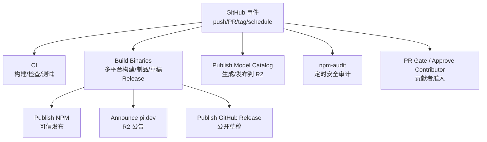
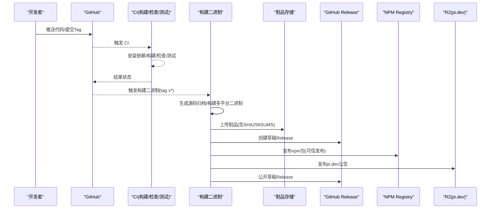
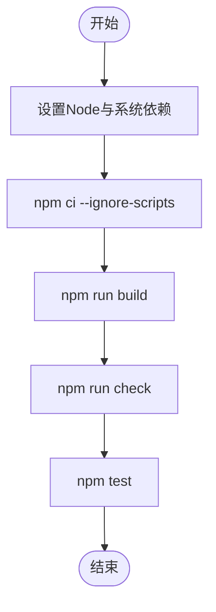
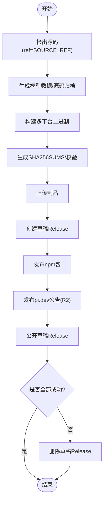
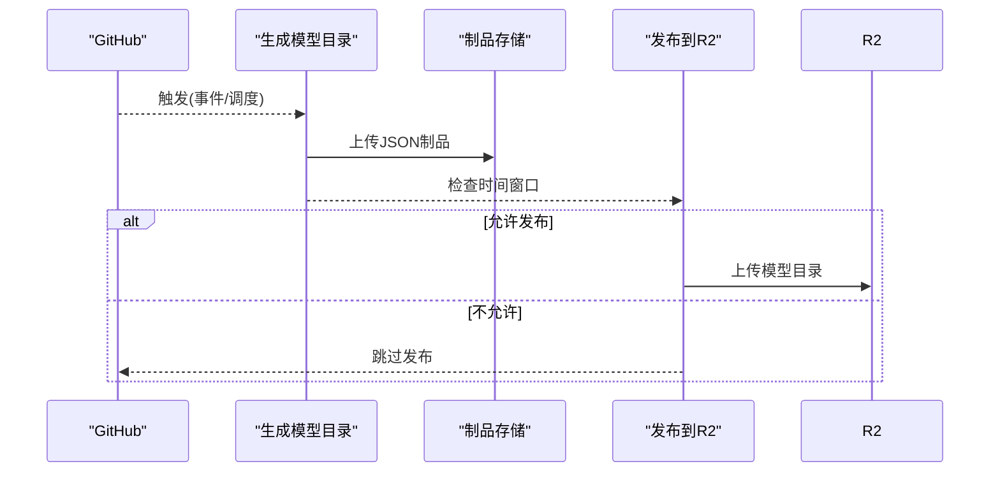
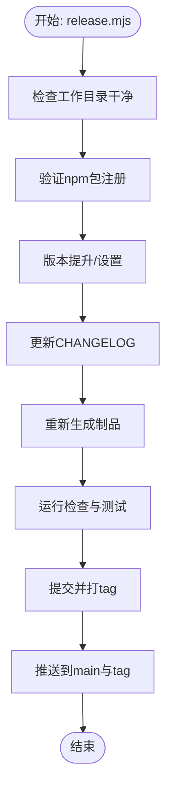
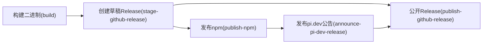

# CI/CD 配置

<cite>
**本文引用的文件**
- [ci.yml](file://.github/workflows/ci.yml)
- [build-binaries.yml](file://.github/workflows/build-binaries.yml)
- [pr-gate.yml](file://.github/workflows/pr-gate.yml)
- [approve-contributor.yml](file://.github/workflows/approve-contributor.yml)
- [publish-model-catalog.yml](file://.github/workflows/publish-model-catalog.yml)
- [npm-audit.yml](file://.github/workflows/npm-audit.yml)
- [package.json](file://package.json)
- [.npmrc](file://.npmrc)
- [README.md](file://README.md)
- [scripts/release.mjs](file://scripts/release.mjs)
- [scripts/publish.mjs](file://scripts/publish.mjs)
- [scripts/local-release.mjs](file://scripts/local-release.mjs)
</cite>

## 目录
1. [简介](#简介)
2. [项目结构](#项目结构)
3. [核心组件](#核心组件)
4. [架构总览](#架构总览)
5. [详细组件分析](#详细组件分析)
6. [依赖关系分析](#依赖关系分析)
7. [性能考虑](#性能考虑)
8. [故障排查指南](#故障排查指南)
9. [结论](#结论)
10. [附录](#附录)

## 简介
本仓库采用 GitHub Actions 实现完整的 CI/CD 流水线，覆盖代码质量检查、多平台构建、自动化发布与模型目录发布。CI 在 push/PR 到 main 分支时执行构建、检查与测试；Release 流程通过打 tag 触发，生成多平台二进制产物并创建草稿 Release，随后发布 npm 包与 pi.dev 公告，最终公开 GitHub Release。安全方面包含定时 npm audit 与签名校验；贡献者准入由 PR Gate 与 Approve Contributor 工作流协同控制。

## 项目结构
- 工作流位于 .github/workflows，分别负责：
  - CI：构建、检查、测试
  - Build Binaries：多平台二进制构建、制品打包、草稿 Release 与发布
  - Publish Model Catalog：生成并发布模型目录 JSON 到 R2
  - PR Gate：未授权 PR 自动关闭
  - Approve Contributor：维护者在 Issue 评论中批准贡献者权限
  - npm-audit：定时安全审计
- 脚本位于 scripts，提供版本管理、发布编排、本地发布验证等能力
- 根 package.json 定义 monorepo 工作区与统一脚本入口（构建、检查、测试、发布）

图表来源
- [ci.yml:1-43](file://.github/workflows/ci.yml#L1-L43)
- [build-binaries.yml:1-367](file://.github/workflows/build-binaries.yml#L1-L367)
- [publish-model-catalog.yml:1-147](file://.github/workflows/publish-model-catalog.yml#L1-L147)
- [npm-audit.yml:1-32](file://.github/workflows/npm-audit.yml#L1-L32)
- [pr-gate.yml:1-129](file://.github/workflows/pr-gate.yml#L1-L129)
- [approve-contributor.yml:1-224](file://.github/workflows/approve-contributor.yml#L1-L224)

章节来源
- [package.json:1-75](file://package.json#L1-L75)
- [README.md:52-88](file://README.md#L52-L88)

## 核心组件
- CI 流水线
  - 触发：push/PR 到 main
  - 步骤：安装系统依赖、Node 22、缓存 npm、安装依赖、构建、检查、测试
  - 并发：按 ref 分组，新任务取消进行中任务
- 构建与发布流水线
  - 触发：tag v* 或 workflow_dispatch
  - 步骤：Bun/Node 环境准备、生成源码归档、离线模型数据、构建多平台二进制、生成 SHA256SUMS、上传制品、创建草稿 Release、发布 npm、发布 pi.dev 公告、公开 Release、失败清理草稿
- 模型目录发布
  - 触发：CI 完成、schedule、workflow_dispatch
  - 步骤：生成模型目录 JSON、校验、上传制品、在允许时间窗口内发布到 R2
- 安全审计
  - 定时任务：生产依赖审计与注册表签名校验
- 贡献者准入
  - PR Gate：未授权 PR 自动关闭并留言
  - Approve Contributor：维护者在 Issue 评论中使用 lgtm/lgtmi 更新授权列表

章节来源
- [ci.yml:1-43](file://.github/workflows/ci.yml#L1-L43)
- [build-binaries.yml:1-367](file://.github/workflows/build-binaries.yml#L1-L367)
- [publish-model-catalog.yml:1-147](file://.github/workflows/publish-model-catalog.yml#L1-L147)
- [npm-audit.yml:1-32](file://.github/workflows/npm-audit.yml#L1-L32)
- [pr-gate.yml:1-129](file://.github/workflows/pr-gate.yml#L1-L129)
- [approve-contributor.yml:1-224](file://.github/workflows/approve-contributor.yml#L1-L224)

## 架构总览
下图展示从事件触发到制品发布的端到端流程，包括并行构建、制品校验、草稿 Release 与最终发布。

图表来源
- [build-binaries.yml:24-367](file://.github/workflows/build-binaries.yml#L24-L367)
- [ci.yml:13-43](file://.github/workflows/ci.yml#L13-L43)

## 详细组件分析

### CI 流水线（构建、检查、测试）
- 环境与缓存
  - Node 22，启用 npm 缓存
  - 安装系统依赖（图形库、fd-find、ripgrep 等）
- 执行顺序
  - npm ci --ignore-scripts
  - npm run build
  - npm run check（静态检查、类型检查、浏览器冒烟等）
  - npm test（脚本与所有工作区测试）
- 并发策略
  - 按 ref 分组，新任务取消旧任务，避免资源浪费

图表来源
- [ci.yml:13-43](file://.github/workflows/ci.yml#L13-L43)
- [package.json:14-49](file://package.json#L14-L49)

章节来源
- [ci.yml:1-43](file://.github/workflows/ci.yml#L1-L43)
- [package.json:14-49](file://package.json#L14-L49)

### 多平台构建与制品管理（Build Binaries）
- 触发条件
  - 推送 tag v* 或手动触发（可指定 tag/source_ref）
- 关键步骤
  - 使用 Bun 与 Node 22
  - 生成源码归档与离线模型数据
  - 构建多平台二进制（darwin/linux/windows，x64/arm64）
  - 生成 SHA256SUMS 并校验
  - 上传制品到 GitHub Artifacts
  - 创建草稿 Release 并校验资产集合
  - 发布 npm 包（启用可信发布）
  - 发布 pi.dev 公告（R2）
  - 公开草稿 Release
  - 失败时清理草稿 Release
- 并发与幂等
  - 按 tag/ref 分组并发
  - 对已存在的公开 Release 拒绝修改，确保不可变发布

图表来源
- [build-binaries.yml:24-367](file://.github/workflows/build-binaries.yml#L24-L367)

章节来源
- [build-binaries.yml:1-367](file://.github/workflows/build-binaries.yml#L1-L367)

### 模型目录发布（Publish Model Catalog）
- 触发方式
  - CI 完成后（仅 main）、变更路径匹配、定时（工作日特定时段）、手动触发
- 步骤
  - 生成模型目录 JSON 并校验
  - 上传为制品
  - 仅在允许的时间窗口内发布到 R2（周一到周五 10:00-15:00 欧洲/维也纳时间，且仅特定整点）
- 环境变量
  - AWS 访问密钥、R2 端点等通过 secrets 与环境注入

图表来源
- [publish-model-catalog.yml:37-147](file://.github/workflows/publish-model-catalog.yml#L37-L147)

章节来源
- [publish-model-catalog.yml:1-147](file://.github/workflows/publish-model-catalog.yml#L1-L147)

### 安全审计（npm-audit）
- 定时任务：每日固定时间运行
- 步骤
  - 安装依赖（忽略生命周期脚本，禁用审计与fund提示）
  - 审计生产依赖漏洞（阈值 moderate）
  - 校验注册表签名

章节来源
- [npm-audit.yml:1-32](file://.github/workflows/npm-audit.yml#L1-L32)

### 贡献者准入（PR Gate 与 Approve Contributor）
- PR Gate
  - 当 PR 打开时检查作者是否在授权列表或拥有写权限
  - 未授权则自动关闭并留言说明
- Approve Contributor
  - 维护者在 Issue 评论中使用 lgtm/lgtmi 更新授权列表
  - 支持提及多个用户，写入 .github/APPROVED_CONTRIBUTORS

章节来源
- [pr-gate.yml:1-129](file://.github/workflows/pr-gate.yml#L1-L129)
- [approve-contributor.yml:1-224](file://.github/workflows/approve-contributor.yml#L1-L224)

### 版本管理与发布脚本
- release.mjs
  - 检查未提交变更、验证 npm 包已注册
  - 版本号提升或显式设置、更新 CHANGELOG、重新生成制品、运行检查与测试、提交并打 tag、推送以触发 CI 发布
- publish.mjs
  - 校验各包 dist 存在、验证 pack、检测是否已发布、使用可信发布参数发布
- local-release.mjs
  - 在隔离目录构建、打包并安装 tarball，验证 npm 与 bun 安装可用性

图表来源
- [scripts/release.mjs:1-282](file://scripts/release.mjs#L1-L282)

章节来源
- [scripts/release.mjs:1-282](file://scripts/release.mjs#L1-L282)
- [scripts/publish.mjs:1-111](file://scripts/publish.mjs#L1-L111)
- [scripts/local-release.mjs:1-296](file://scripts/local-release.mjs#L1-L296)

## 依赖关系分析
- 工作流间依赖
  - Build Binaries 的 stage-github-release 依赖 build
  - publish-npm 依赖 stage-github-release
  - announce-pi-dev-release 依赖 publish-npm
  - publish-github-release 依赖 stage-github-release、publish-npm、announce-pi-dev-release
  - cleanup-draft-github-release 在所有阶段结束后清理失败草稿
- 脚本与工作区
  - 根 package.json 聚合各子包的构建与测试命令
  - 发布脚本依赖工作区元数据与 npm registry

图表来源
- [build-binaries.yml:131-367](file://.github/workflows/build-binaries.yml#L131-L367)

章节来源
- [build-binaries.yml:1-367](file://.github/workflows/build-binaries.yml#L1-L367)

## 性能考虑
- 构建缓存
  - CI 与发布流程均启用 npm 缓存，减少依赖安装时间
- 并行执行
  - 通过 concurrency 组限制同一 ref/tag 的并发，避免重复构建
- 增量构建
  - 使用 npm ci --ignore-scripts 保证快速稳定安装
  - 构建脚本按依赖顺序执行，避免不必要的重建
- 制品复用
  - 模型数据与二进制产物作为制品缓存，减少重复计算
- 建议
  - 将耗时任务拆分为独立 job 并使用 artifacts 共享中间产物
  - 对大体积依赖使用 actions/cache 自定义缓存键
  - 使用远程缓存（如 GitHub Actions Cache 或第三方）加速跨 runner 复用

[本节为通用优化建议，不直接分析具体文件]

## 故障排查指南
- 常见失败点
  - 系统依赖缺失：确认 apt 安装步骤成功（libcairo2-dev、libpango1.0-dev 等）
  - 构建失败：检查 Node/Bun 版本与缓存一致性
  - 制品校验失败：核对 SHA256SUMS 与实际产物是否一致
  - 草稿 Release 冲突：若已存在公开 Release，流程会拒绝修改
  - npm 发布失败：确认包名已注册、版本唯一、网络与凭据可用
  - R2 发布失败：检查 AWS 凭据、端点与时间窗口
- 诊断步骤
  - 查看对应 job 日志定位错误行
  - 本地复现：使用 scripts/local-release.mjs 在隔离目录验证
  - 安全审计：运行 npm-audit 与签名校验，修复高危漏洞
- 回滚与修复
  - 版本回退：撤销 tag 与发布，重新打 tag 触发发布
  - 热修复：创建 hotfix 分支，修复后走正常发布流程
  - 紧急修复：优先恢复服务，再补全文档与回归测试

章节来源
- [build-binaries.yml:175-222](file://.github/workflows/build-binaries.yml#L175-L222)
- [build-binaries.yml:312-367](file://.github/workflows/build-binaries.yml#L312-L367)
- [npm-audit.yml:24-32](file://.github/workflows/npm-audit.yml#L24-L32)
- [scripts/local-release.mjs:219-296](file://scripts/local-release.mjs#L219-L296)

## 结论
该仓库的 CI/CD 体系以 GitHub Actions 为核心，结合脚本化版本管理与制品校验，实现了从代码质量检查、多平台构建到自动化发布的完整闭环。通过并发控制、缓存优化与安全审计，保障了构建效率与发布可靠性。建议在后续迭代中引入更细粒度的缓存策略与监控告警，进一步提升流水线可观测性与稳定性。

[本节为总结性内容，不直接分析具体文件]

## 附录
- 环境变量与密钥
  - 构建与发布所需的环境变量通过 GitHub Environments 与 Secrets 注入（如 npm registry、AWS 凭据、R2 端点）
  - 敏感信息不得硬编码在工作流中
- 环境隔离
  - 使用 Environment 保护发布流程（如 npm-publish、pi-model-upload）
  - 本地发布脚本在隔离目录执行，避免污染工作区
- 最佳实践
  - 保持依赖锁定与最小权限原则
  - 定期运行安全审计与依赖升级
  - 对关键步骤增加重试与超时配置

[本节为通用指导，不直接分析具体文件]