# 容器化部署

<cite>
**本文引用的文件**
- [README.md](file://README.md)
- [package.json](file://package.json)
- [packages/coding-agent/README.md](file://packages/coding-agent/README.md)
- [packages/coding-agent/package.json](file://packages/coding-agent/package.json)
- [.github/workflows/ci.yml](file://.github/workflows/ci.yml)
- [.github/workflows/build-binaries.yml](file://.github/workflows/build-binaries.yml)
</cite>

## 目录
1. [简介](#简介)
2. [项目结构](#项目结构)
3. [核心组件](#核心组件)
4. [架构总览](#架构总览)
5. [详细组件分析](#详细组件分析)
6. [依赖关系分析](#依赖关系分析)
7. [性能考虑](#性能考虑)
8. [故障排查指南](#故障排查指南)
9. [结论](#结论)
10. [附录](#附录)

## 简介
本指南面向将 Pi 工程容器化的团队与个人，覆盖镜像构建（多阶段构建、优化与安全扫描）、Kubernetes 部署（Deployment/Service/ConfigMap/Secret）、编排策略（滚动更新、蓝绿、金丝雀）、网络与服务发现、存储卷管理、监控与日志、安全最佳实践以及多环境隔离策略。内容基于仓库现有脚本与工作流，结合通用容器化实践给出可操作建议。

## 项目结构
- 根级 monorepo 通过 npm workspaces 组织多个子包，包含 AI、Agent、Client、Server、Coding Agent、TUI、Telemetry 等。
- 构建与发布由 GitHub Actions 工作流驱动：CI 负责构建与测试；build-binaries 负责二进制产物与发布流程。
- 编码代理（coding-agent）提供 CLI、RPC 模式与 SDK，支持多种 LLM 提供商与本地工具调用。

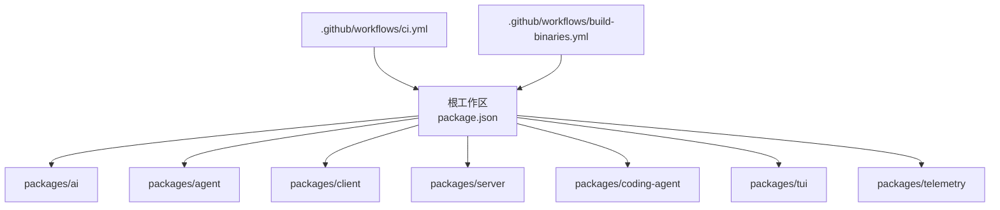

**图示来源**
- [package.json:1-75](file://package.json#L1-L75)
- [.github/workflows/ci.yml:1-43](file://.github/workflows/ci.yml#L1-L43)
- [.github/workflows/build-binaries.yml:1-367](file://.github/workflows/build-binaries.yml#L1-L367)

**章节来源**
- [package.json:1-75](file://package.json#L1-L75)
- [README.md:52-88](file://README.md#L52-L88)
- [.github/workflows/ci.yml:1-43](file://.github/workflows/ci.yml#L1-L43)
- [.github/workflows/build-binaries.yml:1-367](file://.github/workflows/build-binaries.yml#L1-L367)

## 核心组件
- 运行时入口与模式
  - CLI 入口位于 packages/coding-agent，提供交互、打印、JSON、RPC 四种模式。
  - RPC 模式适合进程集成与非 Node.js 客户端对接。
- 模型与提供商
  - 统一抽象层支持多家 LLM 提供商，可通过环境变量或配置注入密钥。
- 会话与持久化
  - 会话以 JSONL 形式保存至用户目录，支持分支、压缩与导出。
- 扩展与技能
  - 通过扩展与技能动态增强能力，可在容器中按需加载。

**章节来源**
- [packages/coding-agent/README.md:17-20](file://packages/coding-agent/README.md#L17-L20)
- [packages/coding-agent/README.md:480-490](file://packages/coding-agent/README.md#L480-L490)
- [packages/coding-agent/README.md:236-280](file://packages/coding-agent/README.md#L236-L280)
- [packages/coding-agent/README.md:369-456](file://packages/coding-agent/README.md#L369-L456)

## 架构总览
下图展示从 CI 到制品产出的关键路径，以及容器化所需的关键工件（二进制、安装锁、源码归档）。

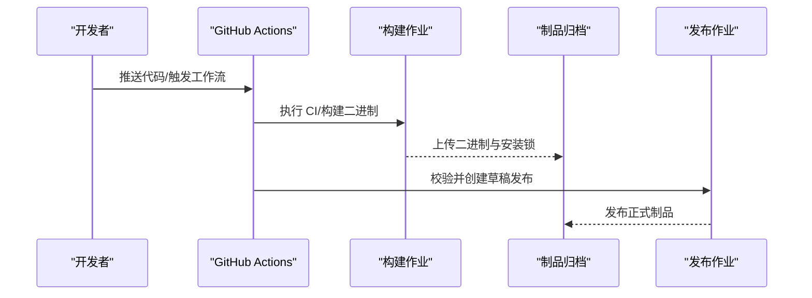

**图示来源**
- [.github/workflows/ci.yml:13-43](file://.github/workflows/ci.yml#L13-L43)
- [.github/workflows/build-binaries.yml:24-130](file://.github/workflows/build-binaries.yml#L24-L130)
- [.github/workflows/build-binaries.yml:131-222](file://.github/workflows/build-binaries.yml#L131-L222)
- [.github/workflows/build-binaries.yml:223-367](file://.github/workflows/build-binaries.yml#L223-L367)

## 详细组件分析

### 镜像构建：多阶段构建与优化
- 基础镜像选择
  - 使用官方 Node 镜像（满足 engines.node 要求），生产阶段仅拷贝构建产物与必要资源，避免携带源码与开发依赖。
- 多阶段构建要点
  - 构建阶段：安装依赖、生成模型数据、编译 TypeScript、复制静态资源。
  - 运行阶段：最小化镜像，仅包含运行时依赖与二进制/入口。
- 体积优化
  - 利用 npm ci --ignore-scripts 减少生命周期脚本开销。
  - 仅拷贝 dist 与必需文档/资源。
  - 使用 .dockerignore 排除 node_modules、测试与无关目录。
- 安全扫描
  - 在 CI 中集成镜像扫描（如 Trivy/Grype），阻断含高危漏洞的镜像进入流水线。
  - 对 npm 依赖进行审计（npm audit），并在发布前强制通过。

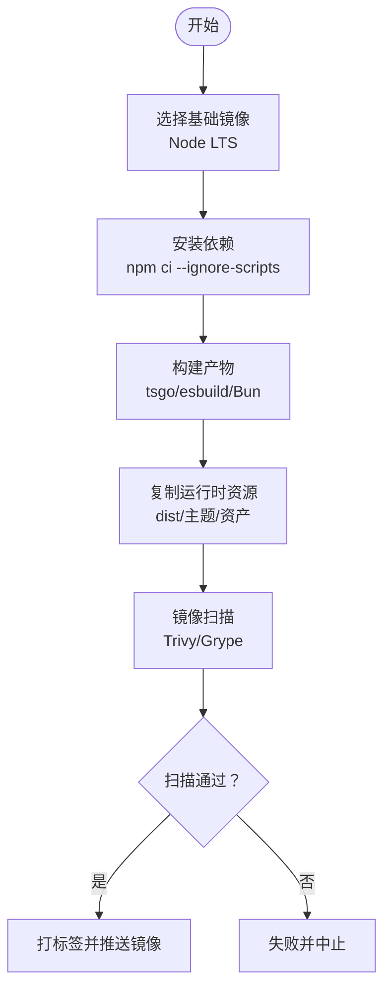

**章节来源**
- [package.json:63-73](file://package.json#L63-L73)
- [packages/coding-agent/package.json:35-43](file://packages/coding-agent/package.json#L35-L43)
- [README.md:76-88](file://README.md#L76-L88)
- [.github/workflows/ci.yml:26-43](file://.github/workflows/ci.yml#L26-L43)

### Kubernetes 部署：Deployment/Service/ConfigMap/Secret
- Deployment
  - 定义副本数、滚动更新策略、健康检查探针（liveness/readiness）。
  - 挂载 ConfigMap/Secret 到只读卷，设置环境变量注入敏感信息。
- Service
  - 暴露内部服务端口，配合 Ingress/Gateway 实现外部访问。
- ConfigMap
  - 存放非敏感配置（如模型列表、功能开关）。
- Secret
  - 存放 API Key、订阅令牌等敏感数据，通过环境变量或卷挂载方式注入。

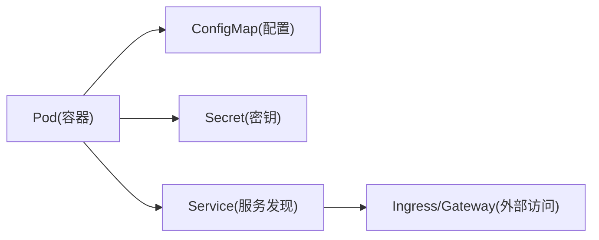

[本节为概念性说明，不直接引用具体文件]

### 编排策略：滚动更新、蓝绿、金丝雀
- 滚动更新
  - 默认策略，逐步替换旧版本实例，确保零停机。
- 蓝绿部署
  - 同时维护两套环境，通过切换流量快速回滚。
- 金丝雀发布
  - 先向小比例流量发布新版本，观察指标后全量推广。

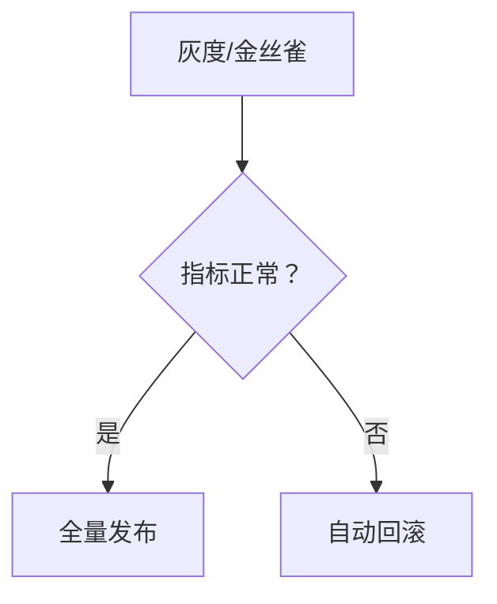

[本节为概念性说明，不直接引用具体文件]

### 容器网络：服务发现、负载均衡、外部访问
- 服务发现
  - 通过 Service DNS 名称在集群内访问后端服务。
- 负载均衡
  - Service 内置负载均衡，Ingress/Gateway 处理入站流量。
- 外部访问
  - 通过 Ingress/Gateway 暴露 HTTP/HTTPS，结合 TLS 终止与域名路由。

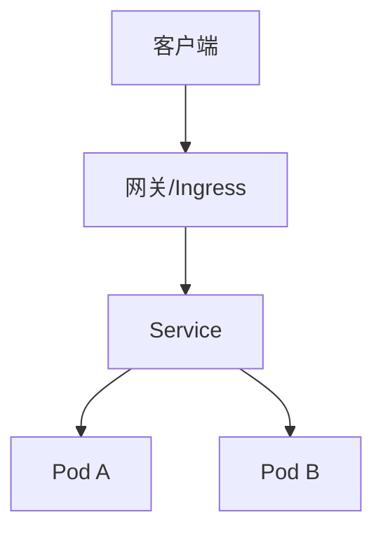

[本节为概念性说明，不直接引用具体文件]

### 存储卷管理：持久化、配置挂载、临时存储
- 数据持久化
  - 使用 PersistentVolumeClaim 挂载数据库或会话数据目录。
- 配置挂载
  - ConfigMap/Secret 以卷或环境变量形式注入。
- 临时存储
  - 使用 emptyDir 作为缓存或中间输出目录。

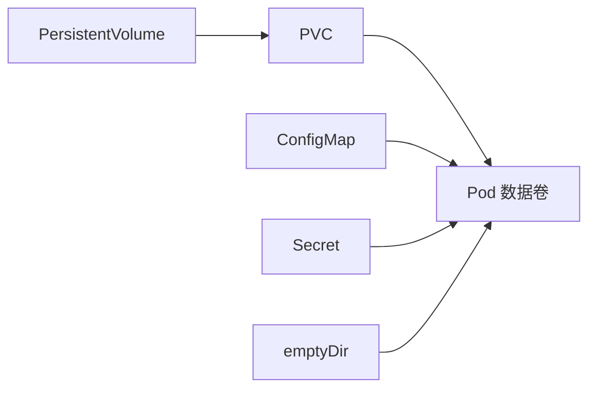

[本节为概念性说明，不直接引用具体文件]

### 监控与日志：指标导出、日志收集、健康检查
- 指标导出
  - 应用暴露 Prometheus 指标端点，由 kube-prometheus 抓取。
- 日志收集
  - 容器 stdout/stderr 由节点日志采集器聚合（如 Fluent Bit/Vector）。
- 健康检查
  - 配置 liveness/readiness 探针，保障自愈与流量切分。

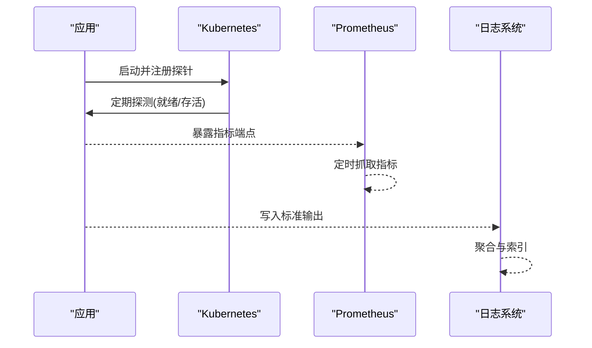

[本节为概念性说明，不直接引用具体文件]

### 安全最佳实践：最小权限、镜像签名、漏洞扫描
- 最小权限原则
  - 容器以非 root 用户运行，限制文件系统与网络权限。
- 镜像签名
  - 使用 Cosign 对镜像签名，部署时校验签名。
- 漏洞扫描
  - 在 CI 中对镜像与依赖进行扫描，阻断高危风险。

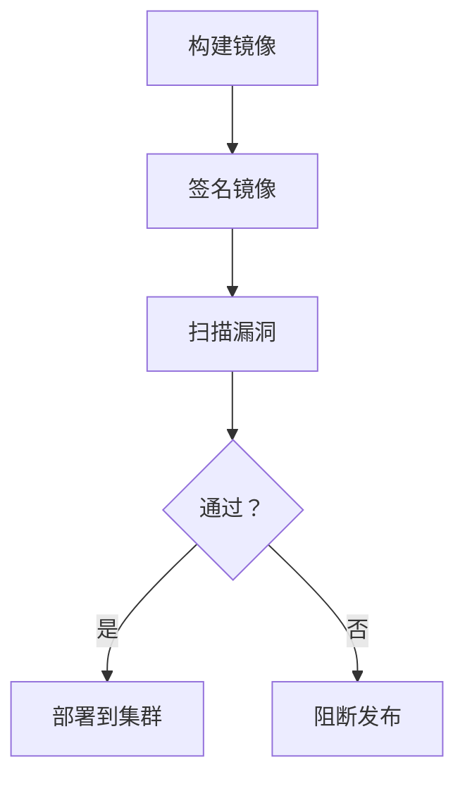

[本节为概念性说明，不直接引用具体文件]

### 多环境容器化策略：开发、测试、生产隔离
- 环境隔离
  - 不同命名空间、镜像仓库与凭据分离。
- 配置差异
  - 通过 ConfigMap/Secret 与环境变量区分。
- 发布流程
  - 开发/测试走 CI 自动构建，生产需人工审批与灰度。

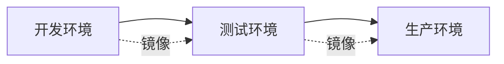

[本节为概念性说明，不直接引用具体文件]

## 依赖关系分析
- Monorepo 依赖
  - 根 package.json 声明 workspaces，统一构建顺序与脚本。
- 工作流依赖
  - CI 工作流依赖 Node 22 与系统库；二进制构建使用 Bun 与 Node 双栈。
- 发布依赖
  - 构建产物包含多平台二进制与安装锁，用于分发与验证。

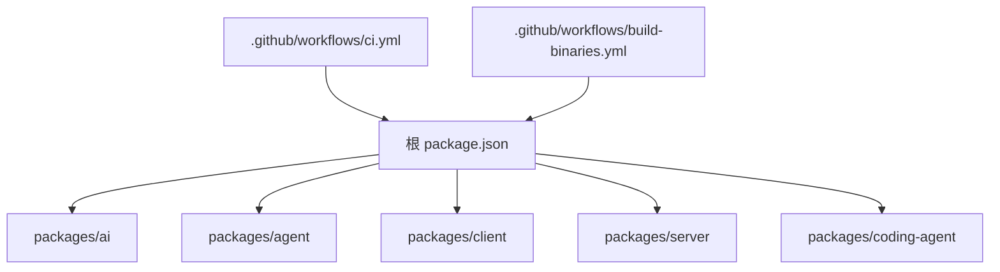

**图示来源**
- [package.json:1-75](file://package.json#L1-L75)
- [.github/workflows/ci.yml:1-43](file://.github/workflows/ci.yml#L1-L43)
- [.github/workflows/build-binaries.yml:1-367](file://.github/workflows/build-binaries.yml#L1-L367)

**章节来源**
- [package.json:1-75](file://package.json#L1-L75)
- [.github/workflows/ci.yml:13-43](file://.github/workflows/ci.yml#L13-L43)
- [.github/workflows/build-binaries.yml:24-130](file://.github/workflows/build-binaries.yml#L24-L130)

## 性能考虑
- 构建缓存
  - 利用 CI 缓存 npm 依赖与构建产物，缩短构建时间。
- 并行任务
  - 拆分构建与测试任务，提升吞吐。
- 镜像分层
  - 将稳定依赖层与应用代码层分离，提高缓存命中率。
- 资源限制
  - 为容器设置 CPU/内存请求与限制，避免资源争用。

[本节为通用指导，不直接引用具体文件]

## 故障排查指南
- 构建失败
  - 检查 Node 版本与系统依赖是否匹配；确认 npm ci 与构建脚本执行成功。
- 镜像扫描失败
  - 根据扫描报告升级或替换存在漏洞的依赖。
- 运行时错误
  - 查看容器日志与探针状态；核对 ConfigMap/Secret 是否正确挂载。
- 发布异常
  - 校验制品完整性（SHA256SUMS），确认草稿发布与正式发布流程。

**章节来源**
- [.github/workflows/ci.yml:26-43](file://.github/workflows/ci.yml#L26-L43)
- [.github/workflows/build-binaries.yml:147-174](file://.github/workflows/build-binaries.yml#L147-L174)
- [README.md:76-88](file://README.md#L76-L88)

## 结论
通过将 Pi 工程纳入标准化容器化流程，可实现可重复构建、安全可控的发布与稳定的集群部署。结合 CI/CD、镜像扫描、Kubernetes 编排与监控体系，能够支撑从开发到生产的完整交付链路。建议在团队内建立统一的镜像规范、安全基线与发布门禁，持续改进质量与效率。

## 附录
- 参考命令与脚本
  - 构建与检查：参见根脚本与 CI 步骤。
  - 二进制构建与发布：参见 build-binaries 工作流。
- 环境变量与配置
  - 编码代理支持大量环境变量控制行为，便于在容器中灵活配置。

**章节来源**
- [packages/coding-agent/README.md:665-690](file://packages/coding-agent/README.md#L665-L690)
- [.github/workflows/ci.yml:20-43](file://.github/workflows/ci.yml#L20-L43)
- [.github/workflows/build-binaries.yml:41-77](file://.github/workflows/build-binaries.yml#L41-L77)