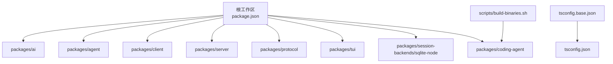
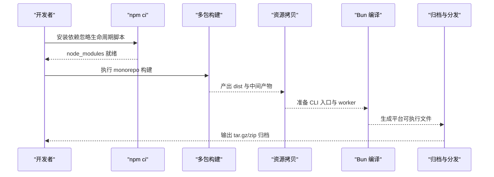
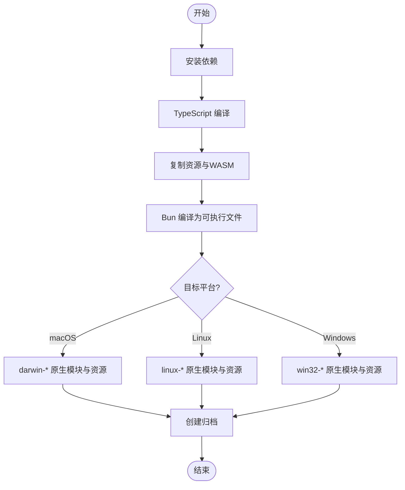
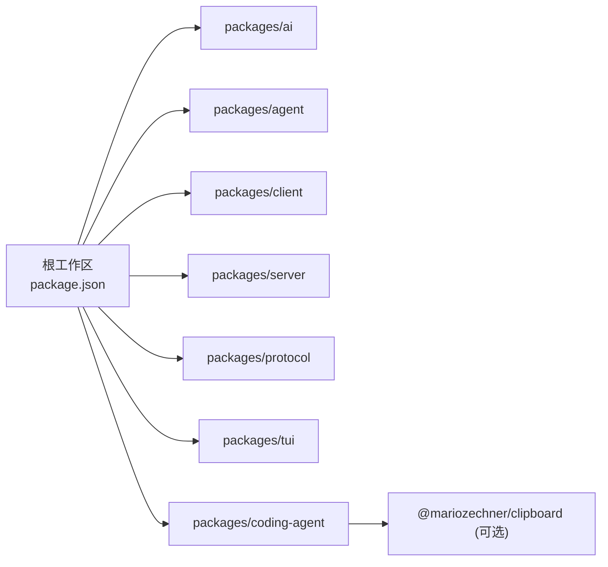

# 本地部署

<cite>
**本文引用的文件**
- [README.md](file://README.md)
- [package.json](file://package.json)
- [.npmrc](file://.npmrc)
- [tsconfig.json](file://tsconfig.json)
- [tsconfig.base.json](file://tsconfig.base.json)
- [scripts/build-binaries.sh](file://scripts/build-binaries.sh)
- [test.sh](file://test.sh)
- [pi-test.sh](file://pi-test.sh)
- [packages/coding-agent/package.json](file://packages/coding-agent/package.json)
- [packages/coding-agent/docs/containerization.md](file://packages/coding-agent/docs/containerization.md)
</cite>

## 目录
1. [简介](#简介)
2. [项目结构](#项目结构)
3. [核心组件](#核心组件)
4. [架构总览](#架构总览)
5. [详细组件分析](#详细组件分析)
6. [依赖关系分析](#依赖关系分析)
7. [性能考虑](#性能考虑)
8. [故障排除指南](#故障排除指南)
9. [结论](#结论)
10. [附录](#附录)

## 简介
本指南面向希望在本地完成开发、构建与部署的工程师，覆盖运行环境要求、依赖安装、原生模块编译、跨平台处理、TypeScript 编译与资源打包、二进制生成、环境变量与配置、权限与安全边界、调试与测试环境搭建，以及常见问题的排查方法。本项目为多包工作区（monorepo），通过 npm workspaces 管理，提供 Node.js 开发与 Bun 二进制产物两种使用方式。

## 项目结构
- 根级 package.json 定义了工作区、脚本与引擎版本约束；所有子包位于 packages/*。
- TypeScript 配置采用基础 tsconfig.base.json 并扩展至根 tsconfig.json，统一模块解析与类型检查规则。
- 构建与发布由根脚本与 scripts/* 中的专用脚本协同完成，其中 build-binaries.sh 负责多平台二进制打包。
- 测试与运行入口：
  - 测试：test.sh 在隔离环境中执行 npm test。
  - 源码运行：pi-test.sh 通过 tsx 直接运行 CLI 源码。
- 容器化与权限隔离参考 packages/coding-agent/docs/containerization.md。

图表来源
- [package.json:1-75](file://package.json#L1-L75)
- [scripts/build-binaries.sh:1-285](file://scripts/build-binaries.sh#L1-L285)
- [tsconfig.base.json:1-26](file://tsconfig.base.json#L1-L26)
- [tsconfig.json:1-41](file://tsconfig.json#L1-L41)

章节来源
- [package.json:1-75](file://package.json#L1-L75)
- [tsconfig.json:1-41](file://tsconfig.json#L1-L41)
- [tsconfig.base.json:1-26](file://tsconfig.base.json#L1-L26)

## 核心组件
- 运行时与环境
  - Node.js：根与子包均声明 engines.node >= 22.19.0，建议使用 LTS 或指定版本。
  - Bun：用于将 CLI 编译为独立可执行文件（含 worker 资源嵌入）。
- 包管理器与锁文件
  - 使用 npm workspaces；.npmrc 启用精确保存与最小发布年龄策略；根 package-lock.json 为权威依赖基线。
- 构建系统
  - TypeScript：tsgo + tsconfig.base.json 统一编译选项；各子包有各自构建脚本。
  - 资源打包：coding-agent 的 copy-assets 与 copy-binary-assets 复制主题、资产与 WASM 等。
  - 二进制：build-binaries.sh 支持 darwin、linux、windows 多目标，输出 tar.gz/zip 归档。
- 测试与运行
  - test.sh：隔离 HOME/TMP/NPM 缓存与 Git 配置，设置 PI_NO_LOCAL_LLM=1 等安全变量后执行测试。
  - pi-test.sh：通过 tsx 直接运行源码 CLI，支持 --no-env 清除敏感环境变量。

章节来源
- [package.json:63-65](file://package.json#L63-L65)
- [.npmrc:1-3](file://.npmrc#L1-L3)
- [scripts/build-binaries.sh:1-285](file://scripts/build-binaries.sh#L1-L285)
- [test.sh:1-80](file://test.sh#L1-L80)
- [pi-test.sh:1-58](file://pi-test.sh#L1-L58)
- [packages/coding-agent/package.json:35-43](file://packages/coding-agent/package.json#L35-L43)

## 架构总览
下图展示从源码到可执行产物的关键路径：Node 安装依赖 → 多包构建 → 资源拷贝 → Bun 编译 → 平台特定原生模块与资源打包 → 归档。

图表来源
- [scripts/build-binaries.sh:90-180](file://scripts/build-binaries.sh#L90-L180)
- [packages/coding-agent/package.json:35-43](file://packages/coding-agent/package.json#L35-L43)

## 详细组件分析

### 环境与依赖安装
- 前置条件
  - Node.js >= 22.19.0（见 engines 字段）。
  - 建议安装 Bun（用于二进制编译）。
  - 具备网络访问以拉取依赖；离线构建需提前准备模型数据。
- 安装步骤
  - 首次克隆仓库后，在项目根目录执行依赖安装。
  - 若需要跳过原生模块的生命周期脚本，可使用忽略脚本的安装方式。
- 原生模块与跨平台依赖
  - 构建脚本会单独安装跨平台可选依赖（如剪贴板原生绑定），并通过临时目录避免污染工作区依赖图。
  - 不同平台对应不同的 .node 原生文件，会在打包阶段复制到相应平台目录。

章节来源
- [package.json:63-65](file://package.json#L63-L65)
- [scripts/build-binaries.sh:90-134](file://scripts/build-binaries.sh#L90-L134)

### 构建流程
- TypeScript 编译
  - 根 tsconfig.base.json 定义统一编译目标与模块解析；根 tsconfig.json 扩展并配置别名映射。
  - 各子包通过各自的构建脚本进行编译，最终由根脚本协调顺序。
- 资源打包
  - coding-agent 的构建脚本会复制主题 JSON、静态资源、导出模板与 WASM 等必要资产。
- 二进制生成
  - 使用 Bun 将 CLI 入口与 worker 编译进单一可执行文件，并禁用自动加载 bunfig.toml 以避免启动前崩溃。
  - 根据平台选择目标三元组（darwin-arm64/x64、linux-x64/arm64、windows-x64/arm64），并输出对应归档。

图表来源
- [tsconfig.base.json:1-26](file://tsconfig.base.json#L1-L26)
- [tsconfig.json:1-41](file://tsconfig.json#L1-L41)
- [packages/coding-agent/package.json:35-43](file://packages/coding-agent/package.json#L35-L43)
- [scripts/build-binaries.sh:148-180](file://scripts/build-binaries.sh#L148-L180)
- [scripts/build-binaries.sh:182-244](file://scripts/build-binaries.sh#L182-L244)

章节来源
- [tsconfig.base.json:1-26](file://tsconfig.base.json#L1-L26)
- [tsconfig.json:1-41](file://tsconfig.json#L1-L41)
- [packages/coding-agent/package.json:35-43](file://packages/coding-agent/package.json#L35-L43)
- [scripts/build-binaries.sh:148-244](file://scripts/build-binaries.sh#L148-L244)

### 环境变量与配置
- 测试隔离
  - test.sh 会创建临时 HOME/TMP 与 NPM 缓存目录，屏蔽系统 Git 配置，并设置 PI_NO_LOCAL_LLM=1 等变量，确保测试不依赖外部密钥。
- 运行清理
  - pi-test.sh 支持 --no-env 参数，会清空各类 API Key、云厂商凭据与 GitHub/GitLab Token，便于在无凭据环境下运行。
- 容器化与权限
  - 默认以当前用户权限运行；如需更强隔离，可参考容器化文档，使用 Gondolin、Docker 或 OpenShell 模式限制文件系统、进程、网络与凭据访问。

章节来源
- [test.sh:1-80](file://test.sh#L1-L80)
- [pi-test.sh:1-58](file://pi-test.sh#L1-L58)
- [packages/coding-agent/docs/containerization.md:1-112](file://packages/coding-agent/docs/containerization.md#L1-L112)

### 常见平台部署配置
- macOS
  - 使用 build-binaries.sh 构建 darwin-arm64/darwin-x64 目标；产物包含对应的剪贴板原生模块与 TUI 原生辅助。
  - 可直接解压运行 pi 可执行文件。
- Linux
  - 构建 linux-x64/linux-arm64 目标；注意系统库依赖（如 glibc）与终端输入原生模块。
  - 可通过 Docker 镜像快速部署，挂载工作目录与持久化 ~/.pi/agent。
- Windows
  - 构建 windows-x64/windows-arm64 目标；产物为 zip 归档，内含 pi.exe 及原生模块。
  - 建议在受控沙箱中运行，或使用 OpenShell 进行策略控制。

章节来源
- [scripts/build-binaries.sh:70-81](file://scripts/build-binaries.sh#L70-L81)
- [scripts/build-binaries.sh:162-180](file://scripts/build-binaries.sh#L162-L180)
- [scripts/build-binaries.sh:198-243](file://scripts/build-binaries.sh#L198-L243)
- [packages/coding-agent/docs/containerization.md:45-77](file://packages/coding-agent/docs/containerization.md#L45-L77)

### 调试与测试环境搭建
- 源码运行
  - 使用 pi-test.sh 直接运行源码 CLI，支持传入任意参数；--no-env 可清空敏感环境变量。
- 单元测试与集成测试
  - 使用 test.sh 在隔离环境中执行 npm test，避免污染用户配置与缓存。
- 浏览器冒烟测试
  - 根脚本提供 check:browser-smoke 任务，用于验证浏览器相关入口。

章节来源
- [pi-test.sh:1-58](file://pi-test.sh#L1-L58)
- [test.sh:1-80](file://test.sh#L1-L80)
- [package.json:18-23](file://package.json#L18-L23)

## 依赖关系分析
- 工作区与脚本编排
  - 根 package.json 通过 scripts.build 串联多个子包的构建顺序，确保依赖先于消费者构建。
- 原生模块与可选依赖
  - coding-agent 将剪贴板能力作为 optionalDependencies；构建脚本会按平台注入对应 .node 文件。
- 锁定与一致性
  - .npmrc 启用 save-exact 与 min-release-age；根 package-lock.json 为权威依赖基线；CI 使用 npm ci --ignore-scripts。

图表来源
- [package.json:1-75](file://package.json#L1-L75)
- [packages/coding-agent/package.json:75-77](file://packages/coding-agent/package.json#L75-L77)
- [scripts/build-binaries.sh:97-134](file://scripts/build-binaries.sh#L97-L134)

章节来源
- [package.json:14-17](file://package.json#L14-L17)
- [packages/coding-agent/package.json:75-77](file://packages/coding-agent/package.json#L75-L77)
- [scripts/build-binaries.sh:97-134](file://scripts/build-binaries.sh#L97-L134)

## 性能考虑
- 依赖安装
  - 使用 npm ci 与 --ignore-scripts 提升安装稳定性与速度，避免不必要的原生编译。
- 构建优化
  - 离线构建时使用已生成的模型数据，减少网络请求与重复下载。
  - 仅构建目标平台以减少交叉编译开销。
- 运行时
  - 使用 Bun 编译的可执行文件内嵌 worker，减少冷启动时的动态加载成本。
  - 合理隔离 HOME/TMP 与 NPM 缓存，避免测试与生产环境的相互干扰。

[本节为通用指导，无需具体文件引用]

## 故障排除指南
- 依赖冲突或解析失败
  - 确认 Node.js 版本满足 engines 要求。
  - 删除 node_modules 与 package-lock.json 后重新执行依赖安装。
  - 若出现工作区依赖图变更导致的错误，优先使用脚本提供的跨平台原生依赖安装流程。
- 原生模块编译失败
  - 检查系统是否安装了必要的编译器与工具链（C/C++ 工具链、Python 等）。
  - 对于剪贴板模块，确保目标平台的 .node 文件存在且与 CPU/OS 匹配。
- 构建失败或资源缺失
  - 确认已执行完整的多包构建流程，特别是 tui、telemetry、ai、agent、protocol、client、server、coding-agent 的顺序。
  - 检查资源复制步骤是否成功（主题、资产、WASM 等）。
- 测试失败
  - 使用 test.sh 在隔离环境中运行，避免用户配置干扰。
  - 若涉及 LLM 调用，确保未误设本地 LLM 开关或提供正确的凭据。
- 权限与隔离问题
  - 如需限制文件系统/网络/凭据访问，请参考容器化文档选择合适的隔离模式。

章节来源
- [package.json:63-65](file://package.json#L63-L65)
- [scripts/build-binaries.sh:90-134](file://scripts/build-binaries.sh#L90-L134)
- [packages/coding-agent/docs/containerization.md:1-112](file://packages/coding-agent/docs/containerization.md#L1-L112)

## 结论
通过 Node.js 与 Bun 的组合，配合 monorepo 的构建编排与跨平台原生模块处理，本项目可在 macOS、Linux、Windows 上完成从源码到可执行文件的完整构建与部署。借助隔离测试与容器化方案，可在保证安全与一致性的前提下进行开发与发布。遵循本文的步骤与排错建议，可高效解决常见的依赖、编译与权限问题。

## 附录
- 常用命令速查
  - 安装依赖：在项目根目录执行依赖安装（必要时忽略生命周期脚本）。
  - 构建：执行根脚本以构建全部子包。
  - 离线构建：使用离线模型数据进行构建。
  - 检查：执行代码质量与类型检查。
  - 测试：在隔离环境中运行测试。
  - 源码运行：通过 tsx 运行 CLI 源码。
  - 构建二进制：使用脚本生成多平台归档。

章节来源
- [README.md:52-74](file://README.md#L52-L74)
- [package.json:14-49](file://package.json#L14-L49)
- [scripts/build-binaries.sh:1-285](file://scripts/build-binaries.sh#L1-L285)
- [test.sh:1-80](file://test.sh#L1-L80)
- [pi-test.sh:1-58](file://pi-test.sh#L1-L58)