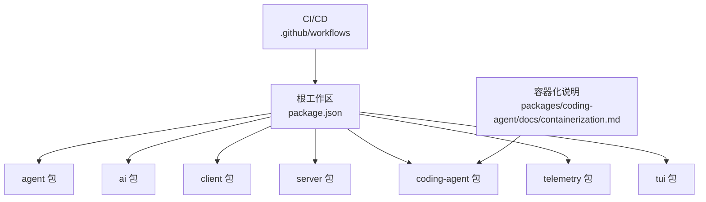
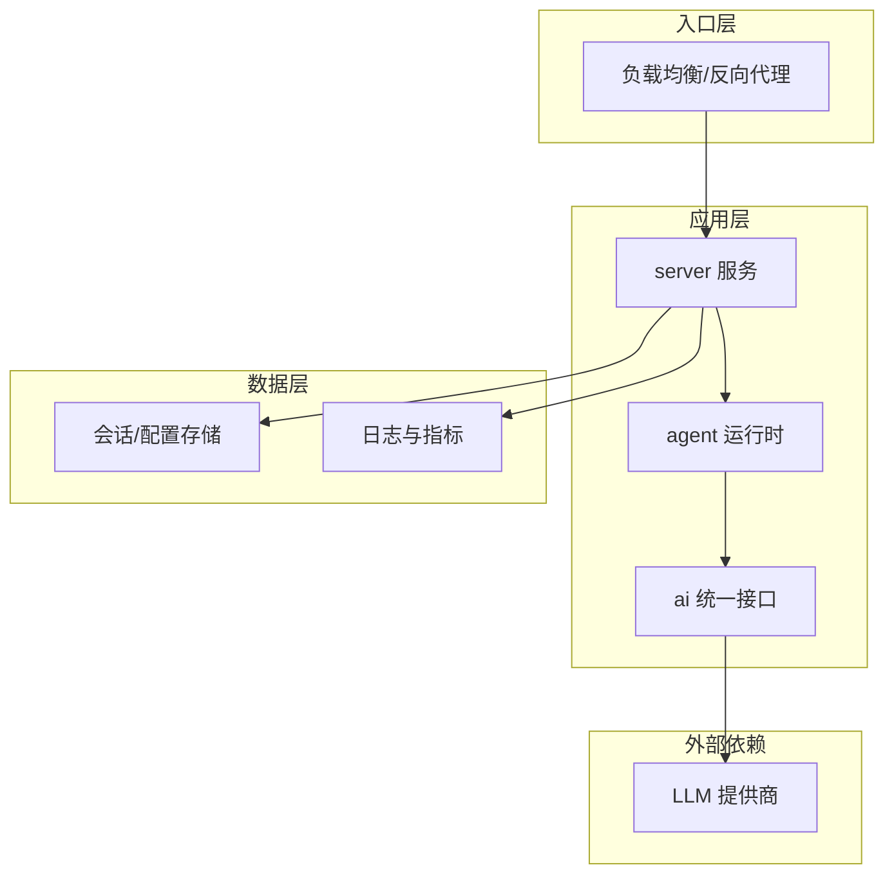
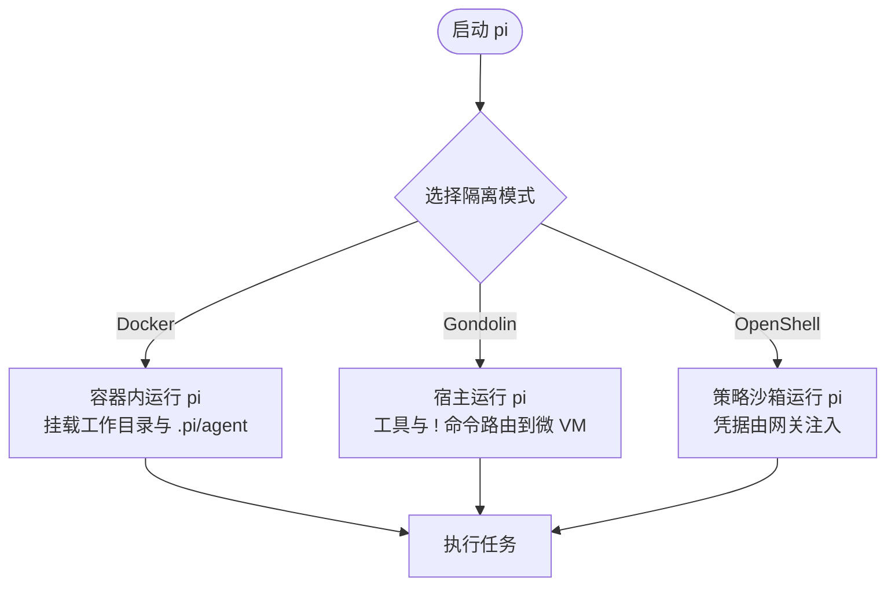
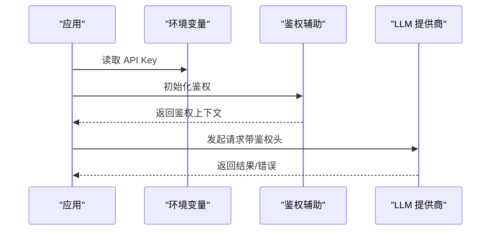
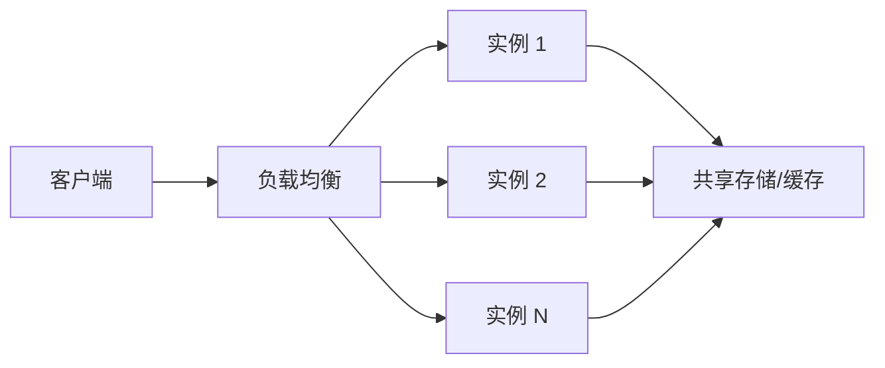
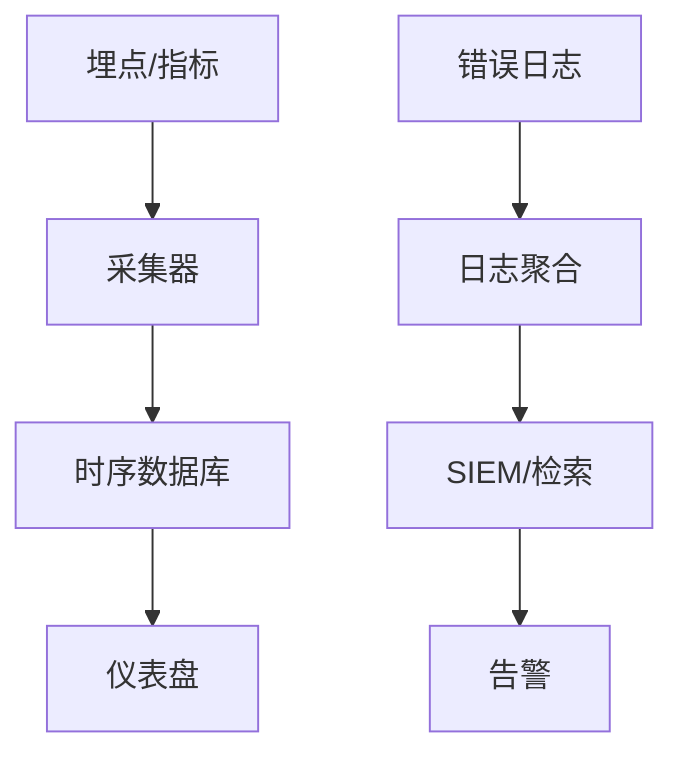
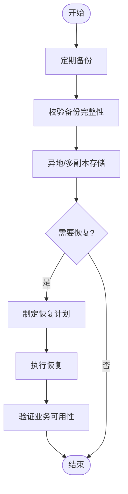
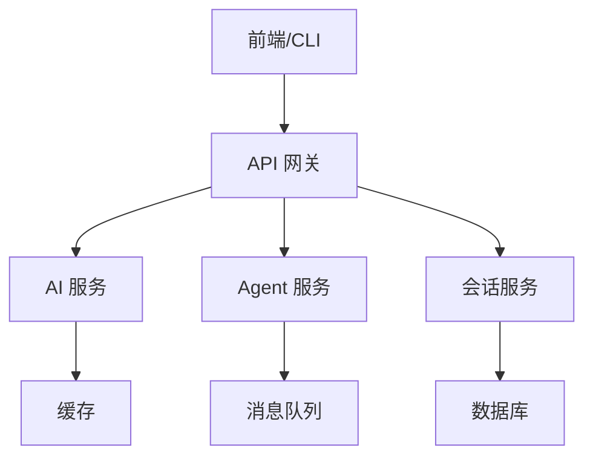
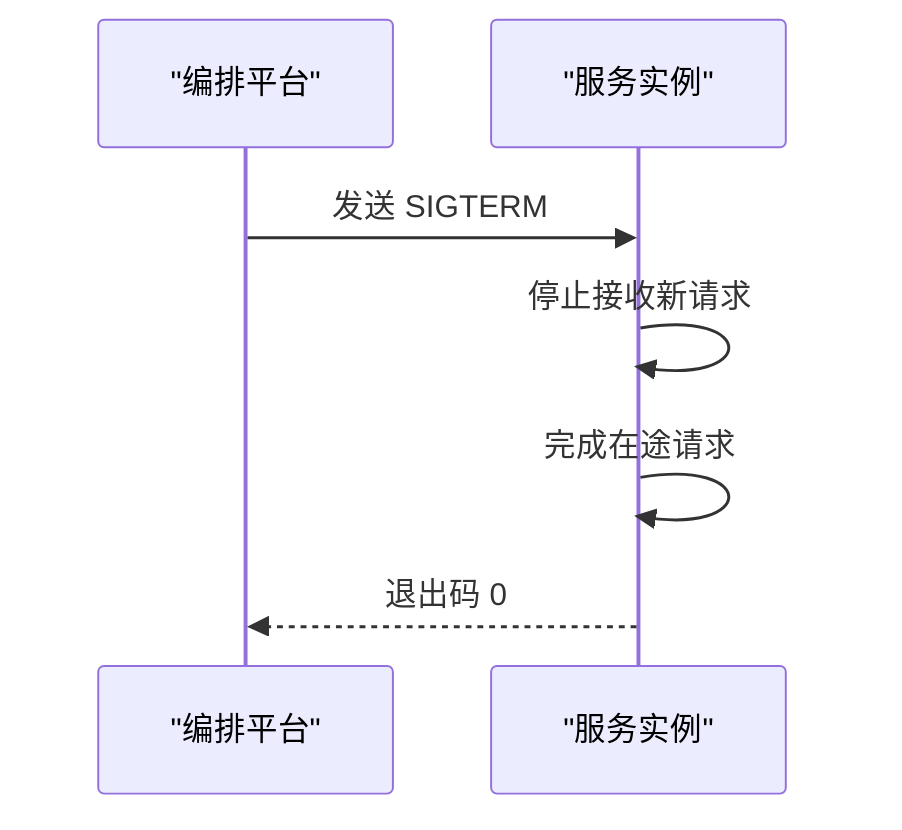
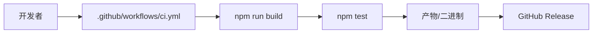

# 生产部署

<cite>
**本文引用的文件**
- [README.md](file://README.md)
- [package.json](file://package.json)
- [containerization.md](file://packages/coding-agent/docs/containerization.md)
- [ci.yml](file://.github/workflows/ci.yml)
- [build-binaries.yml](file://.github/workflows/build-binaries.yml)
- [moonshotai-cn.ts](file://packages/ai/src/providers/moonshotai-cn.ts)
</cite>

## 目录
1. [简介](#简介)
2. [项目结构](#项目结构)
3. [核心组件](#核心组件)
4. [架构总览](#架构总览)
5. [详细组件分析](#详细组件分析)
6. [依赖分析](#依赖分析)
7. [性能考虑](#性能考虑)
8. [故障排查指南](#故障排查指南)
9. [结论](#结论)
10. [附录](#附录)

## 简介
本文件面向生产环境，提供 Pi Agent Harness 的部署与运维指南。内容涵盖系统要求、资源规划（内存/CPU/磁盘）、安全加固（API Key、网络、访问控制）、多实例部署（负载均衡、会话共享、状态同步）、监控与日志、备份与恢复、扩展性设计以及运维最佳实践（健康检查、自动重启、优雅关闭）。文档基于仓库中的构建脚本、容器化说明、工作流与代码实现进行提炼，确保可落地执行。

## 项目结构
Pi 采用 Monorepo 组织，核心包包括 agent、ai、client、server、coding-agent、telemetry、tui 等。顶层 package.json 定义了工作区与统一构建脚本；GitHub Actions 负责 CI、二进制构建与发布；coding-agent 提供容器化与沙箱模式说明，便于在受限环境中运行。

**图表来源**
- [package.json:1-75](file://package.json#L1-L75)
- [ci.yml:1-43](file://.github/workflows/ci.yml#L1-L43)
- [build-binaries.yml:1-367](file://.github/workflows/build-binaries.yml#L1-L367)
- [containerization.md:1-112](file://packages/coding-agent/docs/containerization.md#L1-L112)

**章节来源**
- [package.json:1-75](file://package.json#L1-L75)
- [README.md:26-36](file://README.md#L26-L36)

## 核心组件
- 运行时与工具调用：agent 包提供 Agent 运行时、工具调用与状态管理。
- 模型接入：ai 包提供统一的多提供商 LLM API，支持通过环境变量注入 API Key。
- 服务端：server 包提供服务侧能力（如 RPC/HTTP 等），用于编排与对外暴露接口。
- 客户端与 TUI：client 与 tui 提供交互界面与终端 UI。
- 编码代理：coding-agent 提供 CLI 与扩展机制，并给出容器化与沙箱方案。
- 遥测：telemetry 提供厂商中立的遥测契约与参考适配器。

**章节来源**
- [README.md:26-36](file://README.md#L26-L36)
- [moonshotai-cn.ts:1-15](file://packages/ai/src/providers/moonshotai-cn.ts#L1-L15)

## 架构总览
下图展示典型的生产部署拓扑：外部流量经反向代理进入服务层，Agent 与 AI 模块协同完成推理与工具调用，持久化存储保存会话与配置，遥测数据上报至监控系统。

[此图为概念性架构图，不直接映射具体源码文件]

## 详细组件分析

### 容器化与隔离策略
- 三种模式可选：Gondolin 微 VM、Plain Docker、OpenShell 沙箱。
- Plain Docker 适合简单隔离；Gondolin 将内置工具与命令路由到本地微 VM；OpenShell 提供策略控制的沙箱，支持远程网关与凭据注入。
- 建议在生产中将 pi 进程放入容器或沙箱，限制文件系统、进程、网络与凭据访问范围。

**图表来源**
- [containerization.md:1-112](file://packages/coding-agent/docs/containerization.md#L1-L112)

**章节来源**
- [containerization.md:45-112](file://packages/coding-agent/docs/containerization.md#L45-L112)

### API Key 管理与网络安全
- 通过环境变量注入各提供商的 API Key，避免硬编码。示例中通过 envApiKeyAuth 读取指定环境变量。
- 生产建议：
  - 使用密钥管理服务（如 KMS、Secrets Manager）下发环境变量。
  - 最小权限原则：仅授予必要模型的访问权限。
  - 网络层：限制出站访问到受信任的 LLM 域名/IP，启用 TLS 与证书校验。
  - 审计：记录关键操作与失败尝试。

**图表来源**
- [moonshotai-cn.ts:1-15](file://packages/ai/src/providers/moonshotai-cn.ts#L1-L15)

**章节来源**
- [moonshotai-cn.ts:1-15](file://packages/ai/src/providers/moonshotai-cn.ts#L1-L15)

### 多实例部署：负载均衡、会话共享、状态同步
- 负载均衡：在入口层部署反向代理/负载均衡器，按健康检查结果分发流量。
- 会话共享：将会话与配置持久化到共享存储（如数据库/对象存储），避免绑定到单实例。
- 状态同步：若需分布式锁或事件广播，可使用消息队列或协调服务（如 Redis、Kafka、Zookeeper）。
- 无状态化：尽量保持服务无状态，便于水平扩展与滚动更新。

[此图为概念性架构图，不直接映射具体源码文件]

### 监控与日志收集
- 指标采集：在服务中暴露标准指标端点，或使用 telemetry 包上报自定义指标。
- 错误追踪：集中式日志与结构化错误码，结合链路 ID 关联请求。
- 性能分析：对热点路径进行采样与火焰图分析，定位瓶颈。
- 告警：基于阈值与异常模式设置告警规则。

[此图为概念性架构图，不直接映射具体源码文件]

### 备份与恢复策略
- 数据持久化：会话、配置与中间结果落盘或写入对象存储，定期快照。
- 配置管理：版本化管理配置文件，变更走审批与回滚流程。
- 灾难恢复：定义 RTO/RPO，演练恢复流程，验证备份有效性。
- 合规：敏感数据加密存储与传输，保留审计日志。

[此图为概念性流程图，不直接映射具体源码文件]

### 扩展性考虑
- 水平扩展：无状态服务 + 负载均衡 + 共享存储，快速扩容。
- 垂直扩展：提升 CPU/内存以应对突发负载，注意资源上限与降级策略。
- 微服务拆分：将 AI 调用、工具执行、会话管理等拆分为独立服务，解耦与弹性伸缩。
- 容量规划：压测与容量评估，预留冗余。

[此图为概念性架构图，不直接映射具体源码文件]

### 运维最佳实践
- 健康检查：实现 /health 与 /ready 探针，配合编排平台进行存活与就绪检测。
- 自动重启：配置重启策略与退避重试，避免雪崩。
- 优雅关闭：处理 SIGTERM，完成在途请求后退出。
- 灰度发布：蓝绿/金丝雀发布，逐步放量。
- 安全基线：镜像扫描、依赖漏洞修复、最小权限运行。

[此图为概念性序列图，不直接映射具体源码文件]

## 依赖分析
- Node.js 版本要求：>= 22.19.0（见 engines 字段）。
- 构建与测试：CI 使用 Node 22，安装系统依赖并执行 build/check/test。
- 二进制发布：通过 GitHub Actions 构建多平台二进制，生成 SHA256SUMS 并上传 Release。

**图表来源**
- [ci.yml:1-43](file://.github/workflows/ci.yml#L1-L43)
- [build-binaries.yml:1-367](file://.github/workflows/build-binaries.yml#L1-L367)
- [package.json:63-65](file://package.json#L63-L65)

**章节来源**
- [package.json:63-65](file://package.json#L63-L65)
- [ci.yml:1-43](file://.github/workflows/ci.yml#L1-L43)
- [build-binaries.yml:1-367](file://.github/workflows/build-binaries.yml#L1-L367)

## 性能考虑
- 资源规划：
  - 内存：根据并发与模型大小设定堆大小与容器内存上限，避免 OOM。
  - CPU：为推理与工具执行分配足够配额，必要时分离推理与 IO 线程。
  - 磁盘：为日志、临时文件与持久化数据预留空间，设置清理策略。
- 网络：复用连接池、超时与重试策略，减少外部调用延迟。
- 缓存：热点数据入缓存，降低重复计算与外部调用。
- 限流与熔断：保护下游服务，防止级联故障。

[本节为通用指导，不直接分析具体文件]

## 故障排查指南
- 常见问题：
  - API Key 缺失或无效：检查环境变量与密钥管理服务。
  - 网络连通性：确认防火墙与 DNS，测试到 LLM 域名的可达性。
  - 资源不足：观察 CPU/内存/磁盘使用率，调整配额或扩容。
  - 会话丢失：检查共享存储可用性与权限。
- 诊断步骤：
  - 查看服务日志与指标，定位错误栈与慢请求。
  - 复现问题并抓取上下文（请求 ID、参数、时间戳）。
  - 逐步隔离：禁用非必要依赖，缩小问题范围。
- 回滚与恢复：
  - 快速回滚到上一稳定版本。
  - 从备份恢复数据并验证一致性。

[本节为通用指导，不直接分析具体文件]

## 结论
本指南基于仓库中的构建、容器化与工作流信息，提供了生产部署的系统要求、资源与安全规划、多实例架构、监控日志、备份恢复、扩展性与运维实践。建议结合企业现有基础设施（容器平台、密钥管理、监控体系）落地实施，并通过压测与演练持续优化。

[本节为总结性内容，不直接分析具体文件]

## 附录
- 构建与发布：
  - 本地构建：npm run build
  - 离线构建：npm run build:offline
  - 二进制构建：遵循 scripts/build-binaries.sh 与 GitHub Actions 流程
- 容器化：
  - 参考 packages/coding-agent/docs/containerization.md 选择合适模式
- 安全：
  - 通过环境变量注入 API Key，最小权限与网络白名单

**章节来源**
- [README.md:52-88](file://README.md#L52-L88)
- [containerization.md:1-112](file://packages/coding-agent/docs/containerization.md#L1-L112)
- [build-binaries.yml:1-367](file://.github/workflows/build-binaries.yml#L1-L367)