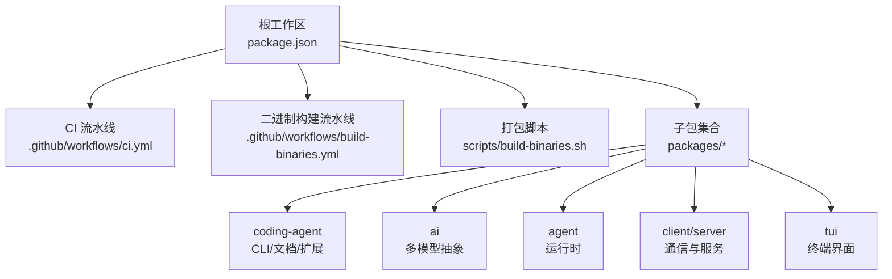
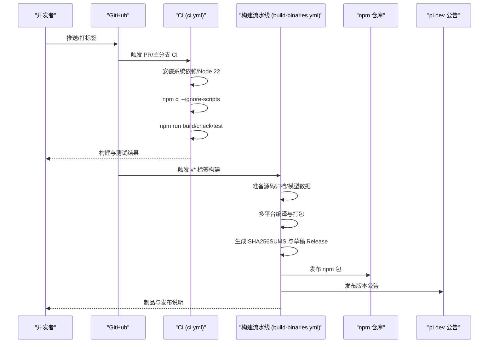
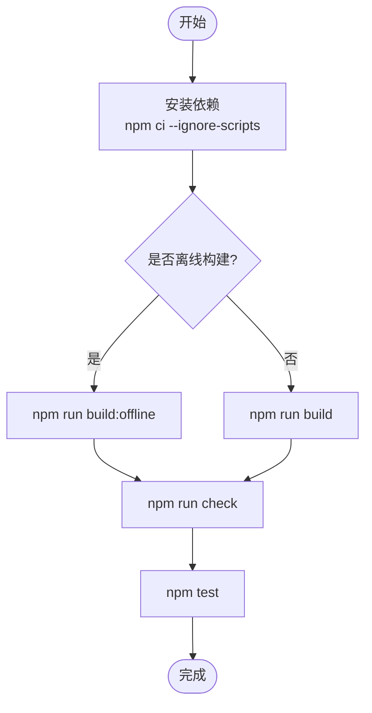
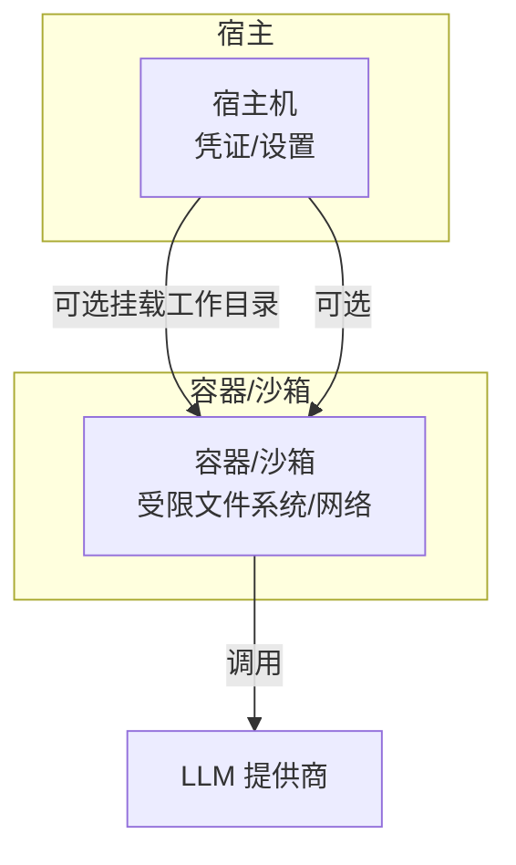
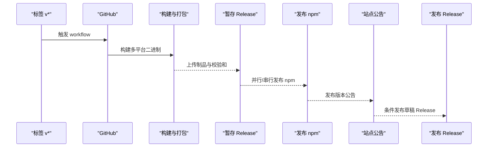
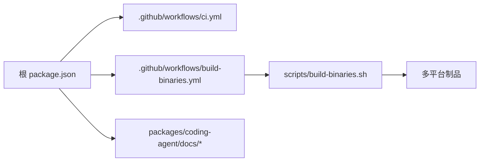

# 部署指南

<cite>
**本文引用的文件**
- [README.md](file://README.md)
- [package.json](file://package.json)
- [.github/workflows/ci.yml](file://.github/workflows/ci.yml)
- [.github/workflows/build-binaries.yml](file://.github/workflows/build-binaries.yml)
- [scripts/build-binaries.sh](file://scripts/build-binaries.sh)
- [packages/coding-agent/docs/containerization.md](file://packages/coding-agent/docs/containerization.md)
- [packages/coding-agent/docs/environment-variables.md](file://packages/coding-agent/docs/environment-variables.md)
- [packages/coding-agent/docs/security.md](file://packages/coding-agent/docs/security.md)
</cite>

## 目录
1. [简介](#简介)
2. [项目结构](#项目结构)
3. [核心组件](#核心组件)
4. [架构总览](#架构总览)
5. [详细组件分析](#详细组件分析)
6. [依赖关系分析](#依赖关系分析)
7. [性能考虑](#性能考虑)
8. [故障排除指南](#故障排除指南)
9. [结论](#结论)
10. [附录](#附录)

## 简介
本指南面向本地开发、生产部署、容器化与微服务、CI/CD 流水线、性能优化、监控日志、安全加固以及多环境管理，提供端到端的落地方案。本项目为 Node.js 工作区（Monorepo），包含多个包：AI 抽象层、Agent 运行时、编码 Agent CLI、TUI、协议与客户端/服务端等。构建产物支持多平台二进制分发，并提供容器化与沙箱模式以增强隔离性。

## 项目结构
- 根级 package.json 定义工作区与脚本，统一构建、检查、测试、发布流程。
- .github/workflows 提供 CI、二进制构建与发布流水线。
- scripts 提供跨平台二进制打包脚本，封装构建、归档与校验步骤。
- packages 下按功能划分子包，其中 coding-agent 提供 CLI、文档与扩展机制。
- 文档集中在 packages/coding-agent/docs，涵盖容器化、环境变量与安全策略。

图表来源
- [package.json:1-75](file://package.json#L1-L75)
- [.github/workflows/ci.yml:1-43](file://.github/workflows/ci.yml#L1-L43)
- [.github/workflows/build-binaries.yml:1-367](file://.github/workflows/build-binaries.yml#L1-L367)
- [scripts/build-binaries.sh:1-285](file://scripts/build-binaries.sh#L1-L285)

章节来源
- [package.json:1-75](file://package.json#L1-L75)
- [README.md:52-88](file://README.md#L52-L88)

## 核心组件
- 工作区与脚本：统一构建顺序、离线构建、检查与测试入口。
- CI：在 Ubuntu 上安装系统依赖、Node 22、执行构建、检查与测试。
- 二进制构建：使用 Bun 编译可执行文件，收集资源并生成多平台压缩包；通过 GitHub Actions 创建草稿 Release 并发布 npm 包。
- 容器化：提供三种模式（Gondolin 微 VM、Plain Docker、OpenShell 沙箱）以满足不同隔离需求。
- 环境变量：进程配置、会话注入、代理与缓存控制等。
- 安全：无内置沙箱，强调最小权限、受控信任边界与容器/沙箱隔离。

章节来源
- [package.json:14-49](file://package.json#L14-L49)
- [.github/workflows/ci.yml:13-42](file://.github/workflows/ci.yml#L13-L42)
- [.github/workflows/build-binaries.yml:24-130](file://.github/workflows/build-binaries.yml#L24-L130)
- [scripts/build-binaries.sh:90-180](file://scripts/build-binaries.sh#L90-L180)
- [packages/coding-agent/docs/containerization.md:1-112](file://packages/coding-agent/docs/containerization.md#L1-L112)
- [packages/coding-agent/docs/environment-variables.md:1-89](file://packages/coding-agent/docs/environment-variables.md#L1-L89)
- [packages/coding-agent/docs/security.md:1-60](file://packages/coding-agent/docs/security.md#L1-L60)

## 架构总览
下图展示从代码提交到制品发布的整体流程，包括 CI 检查、二进制构建、Release 暂存、npm 发布与站点公告。

图表来源
- [.github/workflows/ci.yml:13-42](file://.github/workflows/ci.yml#L13-L42)
- [.github/workflows/build-binaries.yml:24-367](file://.github/workflows/build-binaries.yml#L24-L367)

## 详细组件分析

### 本地开发环境搭建
- 环境要求：Node.js 版本由工作区 engines 指定。
- 安装依赖：使用工作区命令安装依赖，跳过生命周期脚本以提升安全性与稳定性。
- 构建与离线构建：支持在线与离线两种构建模式，离线构建复用已有模型数据。
- 代码质量与测试：统一的 lint/format/type 检查与测试入口。

图表来源
- [package.json:14-49](file://package.json#L14-L49)
- [package.json:63-65](file://package.json#L63-L65)
- [README.md:52-61](file://README.md#L52-L61)

章节来源
- [package.json:63-65](file://package.json#L63-L65)
- [README.md:52-61](file://README.md#L52-L61)

### 生产环境部署要求
- 系统依赖：CI 中安装了图形与文本处理相关库，用于 TUI 与工具链；生产镜像应按需裁剪。
- 环境变量：
  - 进程配置：如 PI_OFFLINE、PI_SKIP_VERSION_CHECK、PI_TELEMETRY、HTTP_PROXY/HTTPS_PROXY 等。
  - 会话注入：PI_SESSION_ID、PI_PROVIDER、PI_MODEL、PI_REASONING_LEVEL 等。
  - 提供商密钥：各 LLM 提供商的 API Key 环境变量（详见提供商文档）。
- 安全配置：默认以启动用户权限运行；建议容器/沙箱隔离，仅挂载必要目录，限制网络与凭据访问。

章节来源
- [.github/workflows/ci.yml:26-30](file://.github/workflows/ci.yml#L26-L30)
- [packages/coding-agent/docs/environment-variables.md:11-89](file://packages/coding-agent/docs/environment-variables.md#L11-L89)
- [packages/coding-agent/docs/security.md:1-60](file://packages/coding-agent/docs/security.md#L1-L60)

### 容器化部署方案
- Gondolin 扩展：将内置工具与命令路由到本地微 VM，认证保留在宿主机。
- Plain Docker：将整个 pi 进程放入容器，简单隔离；注意挂载工作目录与持久化 ~/.pi/agent。
- OpenShell：策略化沙箱，支持本地或远程网关，适合更严格的隔离与审计。

图表来源
- [packages/coding-agent/docs/containerization.md:1-112](file://packages/coding-agent/docs/containerization.md#L1-L112)

章节来源
- [packages/coding-agent/docs/containerization.md:1-112](file://packages/coding-agent/docs/containerization.md#L1-L112)

### Kubernetes 部署与微服务模式
- 单进程应用：Pi 主要为 CLI/交互型应用，通常以 Pod 中的单个容器运行。
- 微服务模式：可将 AI 抽象层、Agent 运行时、TUI/CLI 拆分为独立服务并通过 RPC/HTTP 通信；结合 OpenAPI/Protobuf 契约进行集成。
- 配置与凭据：通过 ConfigMap/Secret 注入环境变量与提供商密钥；使用只读卷挂载静态资源。
- 存储与会话：如需持久化会话与设置，挂载命名卷至 /root/.pi/agent 或自定义路径。

[本节为概念性指导，不直接分析具体文件]

### CI/CD 流水线配置
- CI（PR/主分支）：安装系统依赖、Node 22、依赖缓存、构建、检查与测试。
- 二进制构建（v* 标签）：
  - 准备源码归档与模型数据。
  - 使用 Bun 编译多平台可执行文件，收集资源与原生模块。
  - 生成 SHA256SUMS，创建草稿 Release 并上传制品。
  - 发布 npm 包，并在 pi.dev 发布公告。
  - 成功后发布草稿 Release，失败时清理草稿。

图表来源
- [.github/workflows/build-binaries.yml:24-367](file://.github/workflows/build-binaries.yml#L24-L367)

章节来源
- [.github/workflows/ci.yml:13-42](file://.github/workflows/ci.yml#L13-L42)
- [.github/workflows/build-binaries.yml:24-367](file://.github/workflows/build-binaries.yml#L24-L367)

### 性能优化策略
- 资源限制：为容器/Pod 设置 CPU/内存请求与限制，避免争用。
- 缓存配置：启用 npm 缓存与 Node 缓存；利用 PI_CACHE_RETENTION 延长提示词缓存（若提供商支持）。
- 负载均衡：对无状态服务层（如推理网关）采用水平扩展与负载均衡；Pi 本身为交互型应用，通常单实例即可。
- 构建优化：使用离线构建减少网络开销；按需裁剪镜像层与依赖。

[本节为通用指导，不直接分析具体文件]

### 监控与日志收集
- 日志：将标准输出/错误输出重定向到容器日志；在生产环境中接入集中式日志系统（如 ELK/Loki）。
- 指标：可在上层服务暴露健康检查端点与基础指标；对于 Pi CLI 场景，可通过外部探针检测进程存活。
- 遥测：通过 PI_TELEMETRY 控制遥测行为；遵循最小化原则。

[本节为通用指导，不直接分析具体文件]

### 故障排除指南
- 构建失败：检查 Node 版本、系统依赖是否齐全；确认 npm ci --ignore-scripts 成功。
- 二进制缺失：确认多平台原生模块已正确复制；验证 bun 目标与资源拷贝路径。
- 容器运行异常：核对挂载目录、环境变量与网络策略；必要时启用调试日志。
- 权限问题：确保容器内用户对挂载目录有读写权限；谨慎挂载 ~/.pi/agent。

章节来源
- [.github/workflows/ci.yml:26-42](file://.github/workflows/ci.yml#L26-L42)
- [scripts/build-binaries.sh:90-180](file://scripts/build-binaries.sh#L90-L180)
- [packages/coding-agent/docs/containerization.md:45-78](file://packages/coding-agent/docs/containerization.md#L45-L78)

### 安全加固措施
- 权限控制：默认以启动用户权限运行；通过容器/沙箱限制文件系统、进程、网络与凭据访问。
- 网络安全：仅开放必要端口；使用 HTTPS 与证书；配置代理时注意安全。
- 数据加密：敏感信息通过 Secret 管理；传输层使用 TLS；落盘敏感数据加密。
- 信任边界：项目信任机制仅控制资源加载；不可信代码应在隔离环境中运行。

章节来源
- [packages/coding-agent/docs/security.md:1-60](file://packages/coding-agent/docs/security.md#L1-L60)
- [packages/coding-agent/docs/containerization.md:45-112](file://packages/coding-agent/docs/containerization.md#L45-L112)

### 多环境部署管理策略
- 环境区分：通过环境变量与配置文件区分 dev/staging/prod；避免硬编码。
- 配置管理：使用 ConfigMap/Secret 管理非敏感/敏感配置；版本化配置变更。
- 灰度发布：结合滚动更新与蓝绿/金丝雀策略降低风险。
- 回滚策略：保留历史镜像与配置快照，支持快速回滚。

[本节为通用指导，不直接分析具体文件]

## 依赖关系分析
- 工作区依赖：根 package.json 声明 workspaces，统一构建顺序与脚本。
- 构建依赖：CI 与二进制构建均依赖 Node 22、Bun、系统库；二进制构建还依赖原生模块与 WASM 资源。
- 外部依赖：LLM 提供商通过环境变量注入密钥；网络访问受代理与防火墙策略影响。

图表来源
- [package.json:1-75](file://package.json#L1-L75)
- [.github/workflows/ci.yml:13-42](file://.github/workflows/ci.yml#L13-L42)
- [.github/workflows/build-binaries.yml:24-130](file://.github/workflows/build-binaries.yml#L24-L130)
- [scripts/build-binaries.sh:148-180](file://scripts/build-binaries.sh#L148-L180)

章节来源
- [package.json:1-75](file://package.json#L1-L75)
- [.github/workflows/build-binaries.yml:24-130](file://.github/workflows/build-binaries.yml#L24-L130)

## 性能考虑
- 构建阶段：使用离线构建减少网络延迟；缓存 npm 与 Node 依赖。
- 运行阶段：合理设置容器资源限制；启用提示词缓存（若可用）；避免不必要的网络请求。
- 镜像优化：精简基础镜像，移除无关工具；分层缓存提升重建速度。

[本节为通用指导，不直接分析具体文件]

## 故障排除指南
- 常见构建问题：
  - 系统依赖缺失：参考 CI 中安装的 apt 包列表补齐。
  - 原生模块不匹配：确认目标平台与原生模块版本一致。
- 常见问题：
  - 权限不足：检查容器挂载目录权限与用户映射。
  - 网络问题：配置 HTTP_PROXY/HTTPS_PROXY；检查防火墙与代理。
- 调试技巧：
  - 启用详细日志；在容器中打印关键环境变量。
  - 使用最小化复现用例定位问题。

章节来源
- [.github/workflows/ci.yml:26-42](file://.github/workflows/ci.yml#L26-L42)
- [scripts/build-binaries.sh:90-180](file://scripts/build-binaries.sh#L90-L180)
- [packages/coding-agent/docs/environment-variables.md:70-89](file://packages/coding-agent/docs/environment-variables.md#L70-L89)

## 结论
本指南提供了从本地开发到生产部署的全链路方案，涵盖容器化、CI/CD、性能优化、监控日志、安全加固与多环境管理。建议在生产环境优先采用容器/沙箱隔离，严格管理环境变量与凭据，并结合 CI/CD 实现自动化构建、测试与发布。

## 附录
- 快速参考：
  - 本地构建与测试：参见根脚本与 README。
  - 容器化模式：参考 containerization 文档选择合适模式。
  - 环境变量：参考 environment-variables 文档配置进程与会话。
  - 安全策略：参考 security 文档实施最小权限与隔离。

章节来源
- [README.md:52-88](file://README.md#L52-L88)
- [packages/coding-agent/docs/containerization.md:1-112](file://packages/coding-agent/docs/containerization.md#L1-L112)
- [packages/coding-agent/docs/environment-variables.md:1-89](file://packages/coding-agent/docs/environment-variables.md#L1-L89)
- [packages/coding-agent/docs/security.md:1-60](file://packages/coding-agent/docs/security.md#L1-L60)