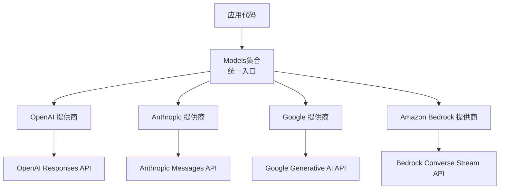
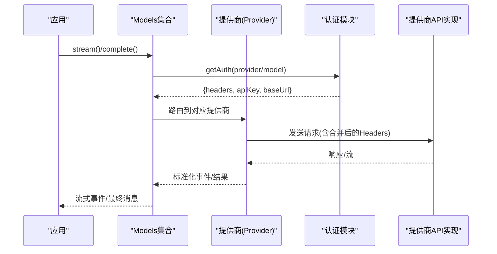
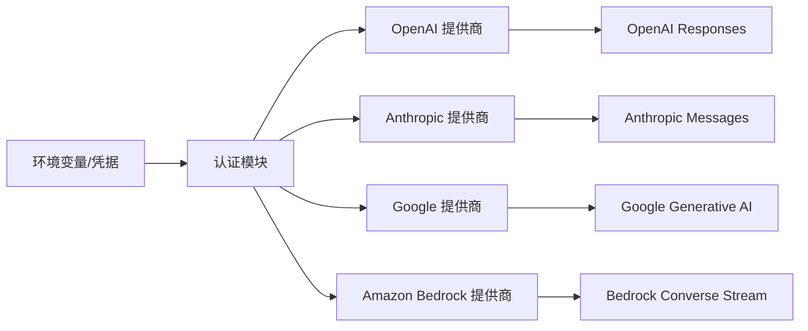

# AI提供商配置

<cite>
**本文引用的文件**
- [packages/ai/README.md](file://packages/ai/README.md)
- [packages/ai/src/providers/openai.ts](file://packages/ai/src/providers/openai.ts)
- [packages/ai/src/providers/anthropic.ts](file://packages/ai/src/providers/anthropic.ts)
- [packages/ai/src/providers/google.ts](file://packages/ai/src/providers/google.ts)
- [packages/ai/src/providers/amazon-bedrock.ts](file://packages/ai/src/providers/amazon-bedrock.ts)
- [packages/ai/src/env-api-keys.ts](file://packages/ai/src/env-api-keys.ts)
</cite>

## 目录
1. [简介](#简介)
2. [项目结构](#项目结构)
3. [核心组件](#核心组件)
4. [架构总览](#架构总览)
5. [详细组件分析](#详细组件分析)
6. [依赖关系分析](#依赖关系分析)
7. [性能考虑](#性能考虑)
8. [故障排除指南](#故障排除指南)
9. [结论](#结论)
10. [附录](#附录)

## 简介
本文件面向需要在应用中接入多家AI服务提供商（如 OpenAI、Anthropic、Google Gemini、AWS Bedrock 等）的开发者，提供统一的配置与最佳实践说明。内容涵盖：
- 支持的提供商与模型选择
- API密钥与环境变量设置
- 端点与认证方式
- 速率限制与并发控制建议
- 提供商切换与负载均衡策略
- 各提供商的性能优化选项
- 常见错误排查与解决方案

## 项目结构
本项目通过“提供商工厂”的方式注册并管理多个AI提供商，每个提供商包含：
- 唯一标识与名称
- 基础URL（端点）
- 认证策略（API Key、OAuth、或云厂商默认凭证链）
- 模型目录（静态或动态）
- 底层API实现（如 OpenAI Responses、Anthropic Messages、Google Generative AI、Bedrock Converse Stream）

图表来源
- [packages/ai/src/providers/openai.ts:6-14](file://packages/ai/src/providers/openai.ts#L6-L14)
- [packages/ai/src/providers/anthropic.ts:43-58](file://packages/ai/src/providers/anthropic.ts#L43-L58)
- [packages/ai/src/providers/google.ts:6-14](file://packages/ai/src/providers/google.ts#L6-L14)
- [packages/ai/src/providers/amazon-bedrock.ts:82-89](file://packages/ai/src/providers/amazon-bedrock.ts#L82-L89)

章节来源
- [packages/ai/README.md:230-264](file://packages/ai/README.md#L230-L264)

## 核心组件
- Models集合：统一管理所有已注册的提供商，负责路由请求到对应提供商，并提供流式/非流式调用接口。
- Provider工厂：每个提供商一个工厂函数，返回Provider对象，包含id、name、baseUrl、auth、models、api。
- 认证系统：支持API Key、OAuth、以及云厂商默认凭证链（如AWS）。
- 环境变量解析：内置对主流提供商的环境变量识别与优先级处理。

章节来源
- [packages/ai/README.md:324-357](file://packages/ai/README.md#L324-L357)
- [packages/ai/README.md:409-456](file://packages/ai/README.md#L409-L456)

## 架构总览
下图展示了从应用发起请求到具体提供商API调用的完整流程，包括认证解析、头信息转换与最终分发。

图表来源
- [packages/ai/README.md:324-380](file://packages/ai/README.md#L324-L380)
- [packages/ai/src/providers/openai.ts:6-14](file://packages/ai/src/providers/openai.ts#L6-L14)
- [packages/ai/src/providers/anthropic.ts:43-58](file://packages/ai/src/providers/anthropic.ts#L43-L58)
- [packages/ai/src/providers/google.ts:6-14](file://packages/ai/src/providers/google.ts#L6-L14)
- [packages/ai/src/providers/amazon-bedrock.ts:82-89](file://packages/ai/src/providers/amazon-bedrock.ts#L82-L89)

## 详细组件分析

### OpenAI 提供商
- 提供商ID与名称：openai / OpenAI
- 基础URL：https://api.openai.com/v1
- 认证方式：API Key，优先从环境变量 OPENAI_API_KEY 解析
- 模型目录：使用内置模型清单
- 底层API：OpenAI Responses

配置要点
- 设置环境变量 OPENAI_API_KEY
- 如需自定义端点或代理，可通过全局配置或请求级参数覆盖（参考通用头部与baseUrl机制）
- 模型选择：通过 models.getModel('openai', '<model-id>') 获取

最佳实践
- 在CI/CD中通过密钥管理服务注入 OPENAI_API_KEY
- 使用流式接口以获得更低首字节延迟
- 结合工具调用能力进行任务编排

章节来源
- [packages/ai/src/providers/openai.ts:6-14](file://packages/ai/src/providers/openai.ts#L6-L14)
- [packages/ai/README.md:409-456](file://packages/ai/README.md#L409-L456)

### Anthropic 提供商
- 提供商ID与名称：anthropic / Anthropic
- 基础URL：https://api.anthropic.com
- 认证方式：
  - API Key：ANTHROPIC_API_KEY
  - OAuth：ANTHROPIC_OAUTH_TOKEN（用于Claude Pro/Max订阅）
  - 存储凭据：可从本地凭据库读取
- 模型目录：使用内置模型清单
- 底层API：Anthropic Messages

配置要点
- 设置 ANTHROPIC_API_KEY 或配置 OAuth 令牌
- 支持通过交互登录流程输入密钥或选择OAuth
- 模型选择：通过 models.getModel('anthropic', '<model-id>') 获取

最佳实践
- 生产环境建议使用OAuth或受管密钥存储
- 启用thinking/reasoning相关选项以增强复杂推理任务表现
- 合理设置并发与重试策略，避免触发限流

章节来源
- [packages/ai/src/providers/anthropic.ts:9-58](file://packages/ai/src/providers/anthropic.ts#L9-L58)
- [packages/ai/README.md:409-456](file://packages/ai/README.md#L409-L456)

### Google Gemini 提供商
- 提供商ID与名称：google / Google
- 基础URL：https://generativelanguage.googleapis.com/v1beta
- 认证方式：API Key，来自环境变量 GEMINI_API_KEY
- 模型目录：使用内置模型清单
- 底层API：Google Generative AI

配置要点
- 设置 GEMINI_API_KEY
- 模型选择：通过 models.getModel('google', '<model-id>') 获取

最佳实践
- 对于高吞吐场景，采用批处理与缓存减少重复请求
- 注意Gemini的函数调用流式行为差异（部分场景不支持逐块函数调用）

章节来源
- [packages/ai/src/providers/google.ts:6-14](file://packages/ai/src/providers/google.ts#L6-L14)
- [packages/ai/README.md:409-456](file://packages/ai/README.md#L409-L456)

### Amazon Bedrock 提供商
- 提供商ID与名称：amazon-bedrock / Amazon Bedrock
- 认证方式：
  - Bearer Token：AWS_BEARER_TOKEN_BEDROCK
  - AWS Profile：AWS_PROFILE
  - 默认凭证链：访问密钥、ECS任务角色、Web Identity Token等
- 模型目录：使用内置模型清单
- 底层API：Bedrock Converse Stream

配置要点
- 无需显式设置API Key时，可依赖AWS SDK默认凭证链自动发现
- 支持交互式选择认证方式（Bearer Token/AWS Profile/现有凭证链）
- 模型选择：通过 models.getModel('amazon-bedrock', '<model-id>') 获取

最佳实践
- 在容器化部署中使用ECS任务角色或IAM角色，避免硬编码密钥
- 利用流式接口降低端到端延迟
- 根据区域与模型可用性选择合适的endpoint与配额

章节来源
- [packages/ai/src/providers/amazon-bedrock.ts:6-89](file://packages/ai/src/providers/amazon-bedrock.ts#L6-L89)
- [packages/ai/README.md:409-456](file://packages/ai/README.md#L409-L456)

## 依赖关系分析
- 提供商与API实现的解耦：每个Provider仅声明其使用的底层API实现，便于按需加载与树摇。
- 认证与环境变量：通过集中式环境变量映射与Provider内联的认证逻辑，确保多提供商统一体验。
- 模型目录：静态清单与动态刷新并存，保证查询同步、更新异步。

图表来源
- [packages/ai/src/env-api-keys.ts:31-177](file://packages/ai/src/env-api-keys.ts#L31-L177)
- [packages/ai/src/providers/openai.ts:6-14](file://packages/ai/src/providers/openai.ts#L6-L14)
- [packages/ai/src/providers/anthropic.ts:43-58](file://packages/ai/src/providers/anthropic.ts#L43-L58)
- [packages/ai/src/providers/google.ts:6-14](file://packages/ai/src/providers/google.ts#L6-L14)
- [packages/ai/src/providers/amazon-bedrock.ts:82-89](file://packages/ai/src/providers/amazon-bedrock.ts#L82-L89)

章节来源
- [packages/ai/src/env-api-keys.ts:31-177](file://packages/ai/src/env-api-keys.ts#L31-L177)

## 性能考虑
- 流式调用：优先使用流式接口以降低首字节延迟，提升用户体验。
- 并发与限流：
  - 按提供商配额设置最大并发请求数
  - 实现指数退避重试，避免雪崩
  - 对高频短文本请求做结果缓存
- 模型选择：
  - 简单任务选用轻量模型，复杂推理选用更强模型
  - 开启thinking/reasoning仅在需要时启用，以减少开销
- 网络与端点：
  - 就近选择区域端点（如Bedrock）
  - 合理使用代理与连接池

[本节为通用指导，不直接分析具体文件]

## 故障排除指南
常见问题与解决步骤
- 未配置API密钥
  - 现象：认证失败或getAuth返回未配置
  - 解决：设置对应环境变量（如 OPENAI_API_KEY、GEMINI_API_KEY），或在凭据库中保存密钥
- 认证源冲突
  - 现象：期望使用存储凭据却读取了环境变量
  - 解决：确认凭据库中是否已有该提供商的条目；移除冲突的环境变量
- OAuth令牌过期
  - 现象：请求被拒绝，提示token无效
  - 解决：重新执行登录流程刷新令牌；检查权限范围
- Bedrock凭证问题
  - 现象：无法找到有效AWS凭证
  - 解决：检查AWS_BEARER_TOKEN_BEDROCK、AWS_PROFILE或默认凭证链；在容器中配置任务角色
- 头部覆盖异常
  - 现象：自定义Header未生效或被覆盖
  - 解决：确认transformHeaders顺序与大小写合并规则；避免重复键名

章节来源
- [packages/ai/README.md:324-380](file://packages/ai/README.md#L324-L380)
- [packages/ai/README.md:409-456](file://packages/ai/README.md#L409-L456)

## 结论
通过统一的Provider抽象与认证体系，本仓库实现了跨多家AI提供商的一致接入体验。推荐在生产环境中：
- 使用受管密钥存储与OAuth
- 基于配额与成本选择合适模型
- 采用流式接口与合理的并发/重试策略
- 针对各提供商特性进行性能调优

[本节为总结性内容，不直接分析具体文件]

## 附录

### 提供商切换与负载均衡
- 提供商切换：通过Models集合注册多个Provider，按模型ID路由到不同提供商。
- 负载均衡：
  - 同功能模型在不同提供商间轮询或按权重分配
  - 结合健康检查与失败回退，提高可用性
  - 使用transformHeaders添加追踪标识以便观测

[本节为概念性内容，不直接分析具体文件]

### 各提供商配置示例路径
- OpenAI：设置 OPENAI_API_KEY，使用 openaiProvider()
- Anthropic：设置 ANTHROPIC_API_KEY 或配置 OAuth，使用 anthropicProvider()
- Google Gemini：设置 GEMINI_API_KEY，使用 googleProvider()
- Amazon Bedrock：配置 AWS 凭证链或 Bearer Token，使用 amazonBedrockProvider()

章节来源
- [packages/ai/src/providers/openai.ts:6-14](file://packages/ai/src/providers/openai.ts#L6-L14)
- [packages/ai/src/providers/anthropic.ts:43-58](file://packages/ai/src/providers/anthropic.ts#L43-L58)
- [packages/ai/src/providers/google.ts:6-14](file://packages/ai/src/providers/google.ts#L6-L14)
- [packages/ai/src/providers/amazon-bedrock.ts:82-89](file://packages/ai/src/providers/amazon-bedrock.ts#L82-L89)
- [packages/ai/README.md:409-456](file://packages/ai/README.md#L409-L456)