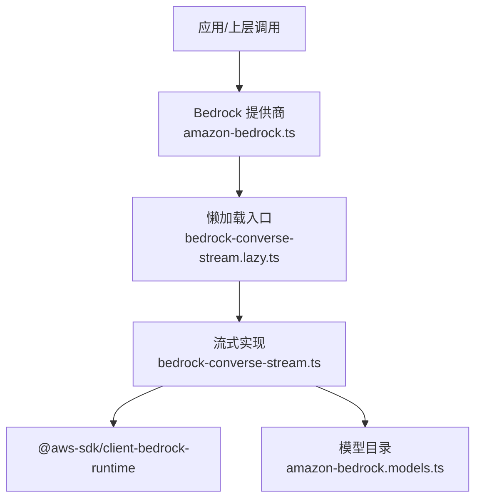
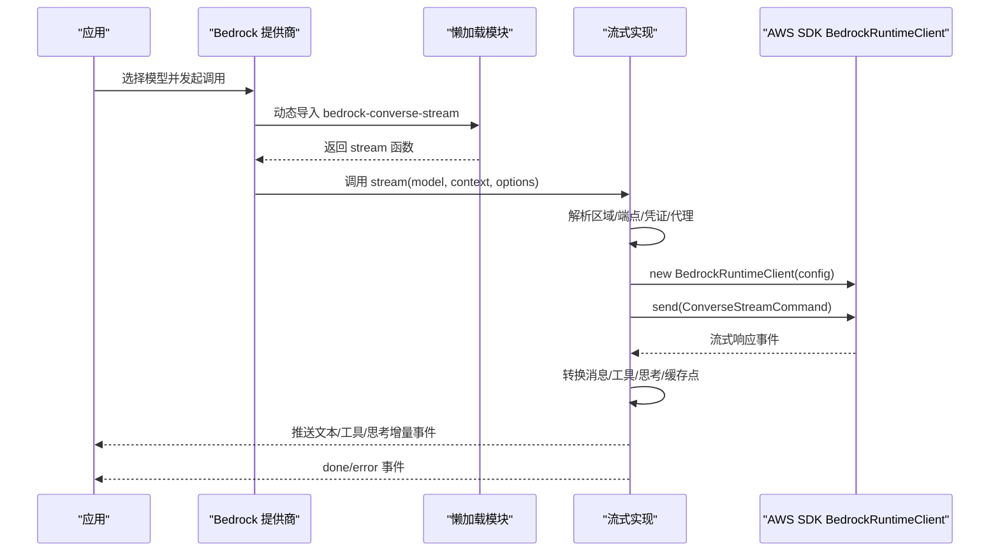
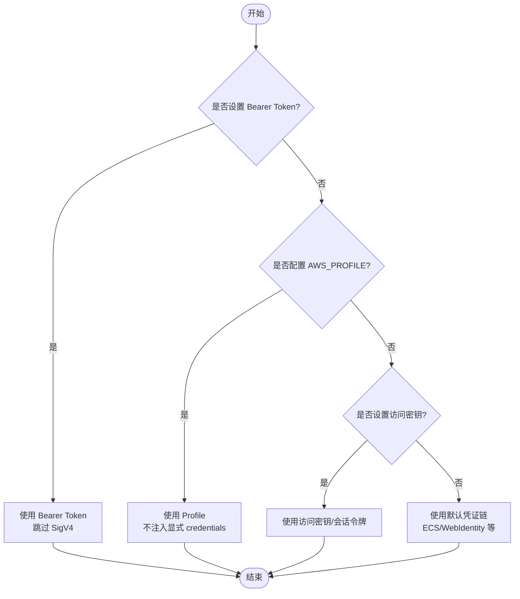
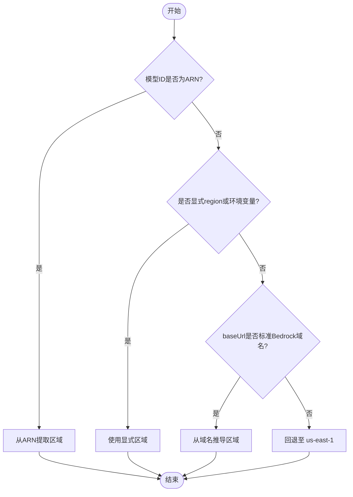
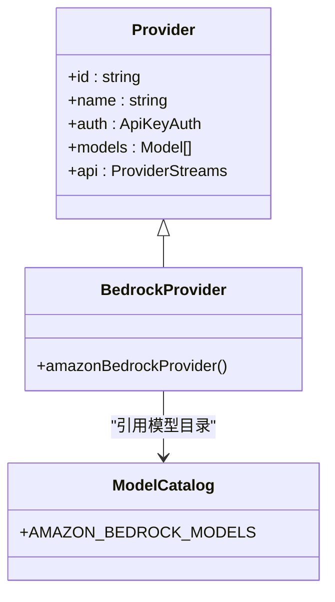
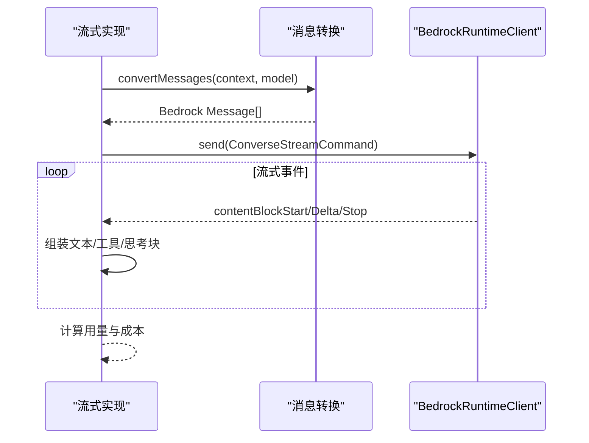
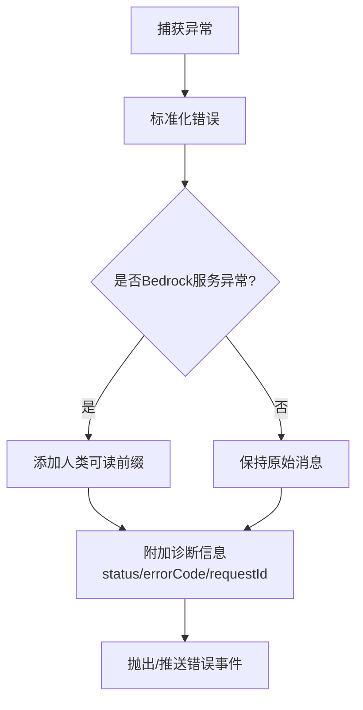
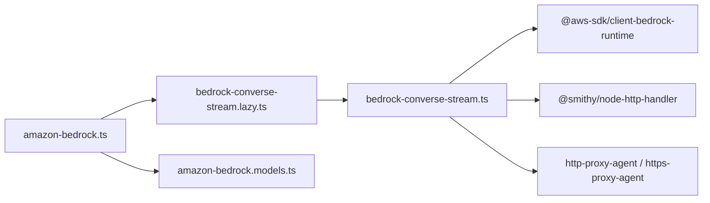

# AWS Bedrock 配置

<cite>
**本文引用的文件**
- [packages/ai/src/providers/amazon-bedrock.ts](file://packages/ai/src/providers/amazon-bedrock.ts)
- [packages/ai/src/api/bedrock-converse-stream.ts](file://packages/ai/src/api/bedrock-converse-stream.ts)
- [packages/ai/src/api/bedrock-converse-stream.lazy.ts](file://packages/ai/src/api/bedrock-converse-stream.lazy.ts)
- [packages/ai/src/providers/amazon-bedrock.models.ts](file://packages/ai/src/providers/amazon-bedrock.models.ts)
- [packages/ai/test/bedrock-credentials.test.ts](file://packages/ai/test/bedrock-credentials.test.ts)
- [packages/ai/scripts/generate-models.ts](file://packages/ai/scripts/generate-models.ts)
</cite>

## 目录
1. [简介](#简介)
2. [项目结构](#项目结构)
3. [核心组件](#核心组件)
4. [架构总览](#架构总览)
5. [详细组件分析](#详细组件分析)
6. [依赖关系分析](#依赖关系分析)
7. [性能与成本优化](#性能与成本优化)
8. [故障排查指南](#故障排查指南)
9. [结论](#结论)
10. [附录：配置示例与环境变量](#附录配置示例与环境变量)

## 简介
本文件面向在项目中集成 Amazon Bedrock 的开发者，提供从凭证、区域、模型到 IAM 权限、企业安全与成本优化的完整配置指南。内容基于代码库中的 Bedrock 提供商实现与流式 Converse API 调用逻辑，覆盖以下主题：
- AWS 凭证配置（访问密钥、会话令牌、Bearer Token、AWS Profile）
- 区域解析与端点选择（含 ARN 内嵌区域、标准端点、自定义端点）
- 模型 ARN 选择与应用推理配置文件
- IAM 权限要求与安全最佳实践
- Bedrock 特有功能：提示缓存、思考模式（thinking）、工具调用、请求元数据标记
- AWS SDK v3 集成、代理与 HTTP/1.1 强制开关
- 错误处理与诊断信息

## 项目结构
本项目将 Bedrock 作为独立提供商注册，并通过流式 Converse API 与 AWS SDK 交互。关键文件职责如下：
- 提供商定义：负责认证流程、模型目录与 API 绑定
- 流式 API 实现：封装 AWS SDK 客户端、区域/端点解析、消息转换、流事件处理、错误映射
- 模型目录：由脚本生成，包含可用模型清单与元信息
- 懒加载模块：按需引入 Bedrock 实现以减小包体积

图表来源
- [packages/ai/src/providers/amazon-bedrock.ts:1-91](file://packages/ai/src/providers/amazon-bedrock.ts#L1-L91)
- [packages/ai/src/api/bedrock-converse-stream.lazy.ts:1-30](file://packages/ai/src/api/bedrock-converse-stream.lazy.ts#L1-L30)
- [packages/ai/src/api/bedrock-converse-stream.ts:1-120](file://packages/ai/src/api/bedrock-converse-stream.ts#L1-L120)
- [packages/ai/src/providers/amazon-bedrock.models.ts:1-9](file://packages/ai/src/providers/amazon-bedrock.models.ts#L1-L9)

章节来源
- [packages/ai/src/providers/amazon-bedrock.ts:1-91](file://packages/ai/src/providers/amazon-bedrock.ts#L1-L91)
- [packages/ai/src/api/bedrock-converse-stream.lazy.ts:1-30](file://packages/ai/src/api/bedrock-converse-stream.lazy.ts#L1-L30)
- [packages/ai/src/api/bedrock-converse-stream.ts:1-120](file://packages/ai/src/api/bedrock-converse-stream.ts#L1-L120)
- [packages/ai/src/providers/amazon-bedrock.models.ts:1-9](file://packages/ai/src/providers/amazon-bedrock.models.ts#L1-L9)

## 核心组件
- 提供商注册与认证
  - 支持 Bearer Token、AWS Profile、默认凭证链（环境变量、ECS 任务角色、Web Identity 等）
  - 通过交互式登录引导用户选择认证方式，并记录来源
- 流式 Converse API
  - 使用 @aws-sdk/client-bedrock-runtime 的 ConverseStreamCommand
  - 自动处理消息转换、工具调用、系统提示、思考模式、提示缓存
  - 统一错误格式化与诊断信息注入
- 区域与端点解析
  - 优先从模型 ARN 提取区域；其次显式 region；再次从 baseUrl 推导；最后回退策略
  - 支持 GovCloud、中国区域域名识别
- 模型目录
  - 自动生成，按 provider 维度扁平化，供上层选择模型

章节来源
- [packages/ai/src/providers/amazon-bedrock.ts:6-91](file://packages/ai/src/providers/amazon-bedrock.ts#L6-L91)
- [packages/ai/src/api/bedrock-converse-stream.ts:107-327](file://packages/ai/src/api/bedrock-converse-stream.ts#L107-L327)
- [packages/ai/src/api/bedrock-converse-stream.ts:1036-1094](file://packages/ai/src/api/bedrock-converse-stream.ts#L1036-L1094)
- [packages/ai/src/providers/amazon-bedrock.models.ts:1-9](file://packages/ai/src/providers/amazon-bedrock.models.ts#L1-L9)

## 架构总览
下图展示一次完整的 Bedrock 流式调用链路，包括认证、区域/端点解析、消息转换、流事件处理与错误处理。

图表来源
- [packages/ai/src/providers/amazon-bedrock.ts:82-91](file://packages/ai/src/providers/amazon-bedrock.ts#L82-L91)
- [packages/ai/src/api/bedrock-converse-stream.lazy.ts:15-30](file://packages/ai/src/api/bedrock-converse-stream.lazy.ts#L15-L30)
- [packages/ai/src/api/bedrock-converse-stream.ts:107-327](file://packages/ai/src/api/bedrock-converse-stream.ts#L107-L327)
- [packages/ai/src/api/bedrock-converse-stream.ts:227-327](file://packages/ai/src/api/bedrock-converse-stream.ts#L227-L327)

## 详细组件分析

### 认证与凭证优先级
- 支持的认证方式
  - Bearer Token：通过环境变量或选项传入，跳过 SigV4 签名，需对应 IAM 权限
  - AWS Profile：通过 AWS_PROFILE 或存储凭据的环境变量指定
  - 默认凭证链：环境变量（访问密钥/会话令牌）、ECS 任务角色、Web Identity 等
- 优先级规则（测试验证）
  - 显式 profile 或 scoped AWS_PROFILE 优先于环境中的访问密钥
  - 未配置 profile 时，使用环境变量中的访问密钥
  - 当仅设置环境 profile 时，仍会读取访问密钥用于签名
- 特殊开关
  - AWS_BEDROCK_SKIP_AUTH=1：跳过认证（仅用于测试/代理场景），会注入占位凭证

图表来源
- [packages/ai/src/providers/amazon-bedrock.ts:11-79](file://packages/ai/src/providers/amazon-bedrock.ts#L11-L79)
- [packages/ai/src/api/bedrock-converse-stream.ts:160-221](file://packages/ai/src/api/bedrock-converse-stream.ts#L160-L221)
- [packages/ai/test/bedrock-credentials.test.ts:71-115](file://packages/ai/test/bedrock-credentials.test.ts#L71-L115)

章节来源
- [packages/ai/src/providers/amazon-bedrock.ts:11-79](file://packages/ai/src/providers/amazon-bedrock.ts#L11-L79)
- [packages/ai/src/api/bedrock-converse-stream.ts:160-221](file://packages/ai/src/api/bedrock-converse-stream.ts#L160-L221)
- [packages/ai/test/bedrock-credentials.test.ts:71-115](file://packages/ai/test/bedrock-credentials.test.ts#L71-L115)

### 区域与端点解析
- 区域解析顺序
  - 若模型 ID 为 ARN，则从中提取区域
  - 否则使用显式 region 或 AWS_REGION/AWS_DEFAULT_REGION
  - 若 baseUrl 为标准 Bedrock 运行时域名，可推导区域
  - 无配置且无环境 profile 时，回退至 us-east-1
- 端点选择
  - 仅在“无显式区域且无环境 profile”时，对标准 Bedrock 运行时域名进行端点固定
  - 支持 GovCloud（us-gov-*）与中国区域域名匹配
- 代理与 HTTP 版本
  - 支持 HTTP(S) 代理，必要时强制使用 HTTP/1.1 处理器

图表来源
- [packages/ai/src/api/bedrock-converse-stream.ts:171-183](file://packages/ai/src/api/bedrock-converse-stream.ts#L171-L183)
- [packages/ai/src/api/bedrock-converse-stream.ts:1036-1094](file://packages/ai/src/api/bedrock-converse-stream.ts#L1036-L1094)

章节来源
- [packages/ai/src/api/bedrock-converse-stream.ts:171-183](file://packages/ai/src/api/bedrock-converse-stream.ts#L171-L183)
- [packages/ai/src/api/bedrock-converse-stream.ts:1036-1094](file://packages/ai/src/api/bedrock-converse-stream.ts#L1036-L1094)

### 模型 ARN 选择与模型目录
- 模型目录由脚本生成，包含 Bedrock 可用模型及元信息
- 脚本中定义了 Bedrock 基础 URL 与模型处理逻辑，并将模型注册到 amazon-bedrock 提供商
- 应用推理配置文件（Inference Profiles）可通过 ARN 形式使用，区域从 ARN 提取

图表来源
- [packages/ai/src/providers/amazon-bedrock.ts:82-91](file://packages/ai/src/providers/amazon-bedrock.ts#L82-L91)
- [packages/ai/src/providers/amazon-bedrock.models.ts:1-9](file://packages/ai/src/providers/amazon-bedrock.models.ts#L1-L9)
- [packages/ai/scripts/generate-models.ts:1306-1343](file://packages/ai/scripts/generate-models.ts#L1306-L1343)

章节来源
- [packages/ai/src/providers/amazon-bedrock.models.ts:1-9](file://packages/ai/src/providers/amazon-bedrock.models.ts#L1-L9)
- [packages/ai/scripts/generate-models.ts:1306-1343](file://packages/ai/scripts/generate-models.ts#L1306-L1343)

### 流式调用与消息转换
- 消息转换
  - 将通用消息转换为 Bedrock Message，支持文本、图片、工具调用、思考内容
  - 对空内容进行过滤，避免 Bedrock 拒绝空数组
- 工具调用
  - 将工具规范转换为 Bedrock Tool，支持 strict 模式与 toolChoice 控制
- 思考模式（Thinking）
  - 自适应思考（部分 Claude 模型）与预算型思考（其他模型）
  - 支持 thinkingDisplay 控制输出摘要或省略
  - 非 Claude 模型不支持 signature 字段，会自动降级
- 提示缓存（Prompt Caching）
  - 对支持的 Claude 模型在系统提示与最后一条用户消息插入缓存点
  - 支持短/长 TTL 控制

图表来源
- [packages/ai/src/api/bedrock-converse-stream.ts:817-980](file://packages/ai/src/api/bedrock-converse-stream.ts#L817-L980)
- [packages/ai/src/api/bedrock-converse-stream.ts:982-1017](file://packages/ai/src/api/bedrock-converse-stream.ts#L982-L1017)
- [packages/ai/src/api/bedrock-converse-stream.ts:1096-1144](file://packages/ai/src/api/bedrock-converse-stream.ts#L1096-L1144)

章节来源
- [packages/ai/src/api/bedrock-converse-stream.ts:817-980](file://packages/ai/src/api/bedrock-converse-stream.ts#L817-L980)
- [packages/ai/src/api/bedrock-converse-stream.ts:982-1017](file://packages/ai/src/api/bedrock-converse-stream.ts#L982-L1017)
- [packages/ai/src/api/bedrock-converse-stream.ts:1096-1144](file://packages/ai/src/api/bedrock-converse-stream.ts#L1096-L1144)

### 错误处理与诊断
- 错误分类
  - 内部服务错误、模型流错误、校验错误、限流、服务不可用等
- 错误格式化
  - 保留原始 HTTP 状态码与响应体，便于网关级错误定位
  - 附加 Bedrock 特定诊断信息（状态码、错误码、请求 ID）
- 重试与上下文溢出
  - 下游重试逻辑匹配稳定前缀，便于区分错误类别

图表来源
- [packages/ai/src/api/bedrock-converse-stream.ts:335-422](file://packages/ai/src/api/bedrock-converse-stream.ts#L335-L422)

章节来源
- [packages/ai/src/api/bedrock-converse-stream.ts:335-422](file://packages/ai/src/api/bedrock-converse-stream.ts#L335-L422)

## 依赖关系分析
- 外部依赖
  - @aws-sdk/client-bedrock-runtime：Bedrock 运行时客户端与命令
  - @smithy/node-http-handler：HTTP 处理器（支持代理与 HTTP/1.1）
  - http-proxy-agent / https-proxy-agent：代理支持
- 内部依赖
  - 模型目录：amazon-bedrock.models.ts
  - 懒加载：bedrock-converse-stream.lazy.ts
  - 提供商：amazon-bedrock.ts

图表来源
- [packages/ai/src/providers/amazon-bedrock.ts:1-91](file://packages/ai/src/providers/amazon-bedrock.ts#L1-L91)
- [packages/ai/src/api/bedrock-converse-stream.lazy.ts:1-30](file://packages/ai/src/api/bedrock-converse-stream.lazy.ts#L1-L30)
- [packages/ai/src/api/bedrock-converse-stream.ts:1-65](file://packages/ai/src/api/bedrock-converse-stream.ts#L1-L65)
- [packages/ai/src/providers/amazon-bedrock.models.ts:1-9](file://packages/ai/src/providers/amazon-bedrock.models.ts#L1-L9)

章节来源
- [packages/ai/src/providers/amazon-bedrock.ts:1-91](file://packages/ai/src/providers/amazon-bedrock.ts#L1-L91)
- [packages/ai/src/api/bedrock-converse-stream.lazy.ts:1-30](file://packages/ai/src/api/bedrock-converse-stream.lazy.ts#L1-L30)
- [packages/ai/src/api/bedrock-converse-stream.ts:1-65](file://packages/ai/src/api/bedrock-converse-stream.ts#L1-L65)
- [packages/ai/src/providers/amazon-bedrock.models.ts:1-9](file://packages/ai/src/providers/amazon-bedrock.models.ts#L1-L9)

## 性能与成本优化
- 提示缓存（Prompt Caching）
  - 对支持的 Claude 模型启用缓存点，减少重复系统提示与历史消息的开销
  - 支持短/长 TTL，根据业务需求选择
- 思考模式（Thinking）
  - 自适应思考：针对部分 Claude 模型，自动调整思考深度与输出效率
  - 预算型思考：为其他模型设定 token 预算，平衡质量与成本
- 请求元数据标记（Cost Allocation Tags）
  - 通过 requestMetadata 为请求打上标签，便于在 AWS Cost Explorer 中进行成本分摊与分析
- 代理与网络
  - 合理配置代理与 HTTP/1.1 强制开关，避免不必要的连接问题与延迟

章节来源
- [packages/ai/src/api/bedrock-converse-stream.ts:769-787](file://packages/ai/src/api/bedrock-converse-stream.ts#L769-L787)
- [packages/ai/src/api/bedrock-converse-stream.ts:966-977](file://packages/ai/src/api/bedrock-converse-stream.ts#L966-L977)
- [packages/ai/src/api/bedrock-converse-stream.ts:1096-1144](file://packages/ai/src/api/bedrock-converse-stream.ts#L1096-L1144)
- [packages/ai/src/api/bedrock-converse-stream.ts:198-210](file://packages/ai/src/api/bedrock-converse-stream.ts#L198-L210)

## 故障排查指南
- 常见错误类型
  - 内部服务错误、模型流错误、校验错误、限流、服务不可用
- 错误信息增强
  - 保留 HTTP 状态码与响应体，便于网关级错误定位
  - 附加 Bedrock 诊断信息（状态码、错误码、请求 ID）
- 数据保留模式错误
  - 当出现数据保留模式相关错误时，参考 AWS 文档配置支持的模式
- 调试建议
  - 开启请求元数据标记，结合 Cost Explorer 分析
  - 检查区域与端点解析是否正确，避免跨域或 GovCloud 不兼容
  - 使用代理时确认 HTTP/1.1 强制开关与代理地址正确

章节来源
- [packages/ai/src/api/bedrock-converse-stream.ts:335-422](file://packages/ai/src/api/bedrock-converse-stream.ts#L335-L422)
- [packages/ai/src/api/bedrock-converse-stream.ts:343-349](file://packages/ai/src/api/bedrock-converse-stream.ts#L343-L349)

## 结论
本仓库提供了完善的 Bedrock 提供商实现，涵盖认证、区域/端点解析、模型目录、流式调用、错误处理与性能优化。通过合理的凭证管理、区域配置与 IAM 权限设置，可在企业环境中安全、高效地集成 Bedrock。建议在生产中启用提示缓存、思考模式与请求元数据标记，并结合代理与网络优化提升稳定性与成本效益。

## 附录：配置示例与环境变量
- 认证方式
  - Bearer Token：通过环境变量或选项传入，跳过 SigV4 签名
  - AWS Profile：设置 AWS_PROFILE 或在存储凭据中配置
  - 访问密钥：设置 AWS_ACCESS_KEY_ID 与 AWS_SECRET_ACCESS_KEY，可选 AWS_SESSION_TOKEN
  - 默认凭证链：ECS 任务角色、Web Identity 等
- 区域与端点
  - 显式 region 或 AWS_REGION/AWS_DEFAULT_REGION
  - 模型 ARN 中包含区域时自动提取
  - 标准 Bedrock 运行时域名可推导区域
- 模型选择
  - 使用模型 ID 或 ARN（应用推理配置文件）
  - 模型目录由脚本生成，确保最新可用模型
- IAM 权限（建议）
  - 使用最小权限原则，仅授予必要的 Bedrock 操作权限
  - 若使用 Bearer Token，确保身份具备相应调用权限
- 企业安全与成本
  - 启用请求元数据标记进行成本分摊
  - 合理使用提示缓存与思考模式，平衡质量与成本
  - 配置代理与网络策略，确保合规与稳定

章节来源
- [packages/ai/src/providers/amazon-bedrock.ts:11-79](file://packages/ai/src/providers/amazon-bedrock.ts#L11-L79)
- [packages/ai/src/api/bedrock-converse-stream.ts:160-221](file://packages/ai/src/api/bedrock-converse-stream.ts#L160-L221)
- [packages/ai/src/api/bedrock-converse-stream.ts:1036-1094](file://packages/ai/src/api/bedrock-converse-stream.ts#L1036-L1094)
- [packages/ai/scripts/generate-models.ts:1306-1343](file://packages/ai/scripts/generate-models.ts#L1306-L1343)