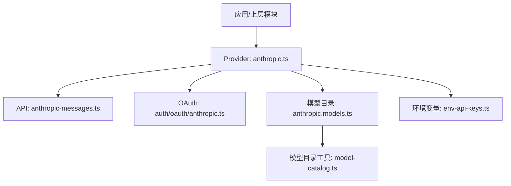
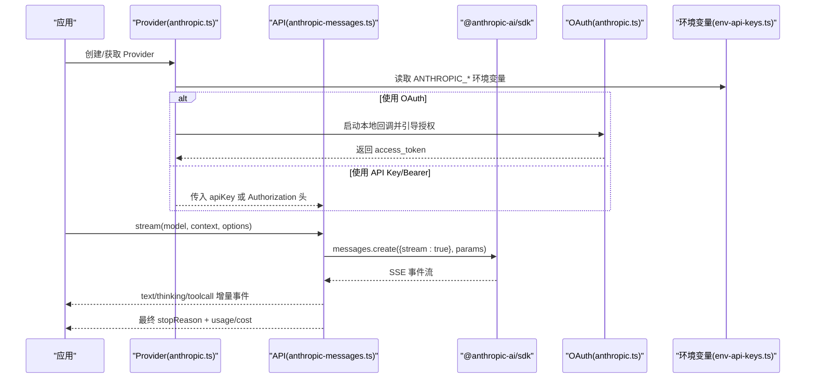
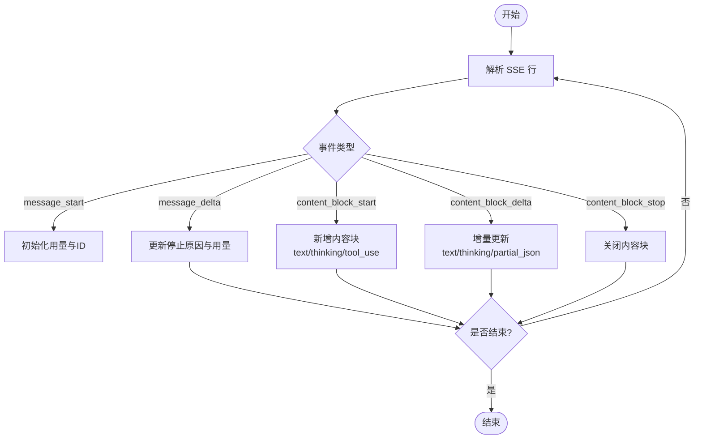
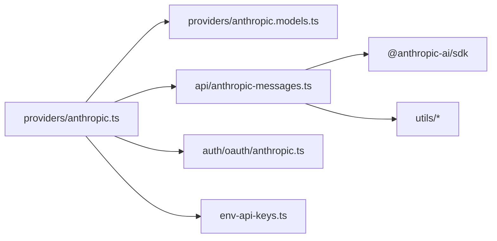

# Anthropic 配置

<cite>
**本文引用的文件**
- [packages/ai/src/providers/anthropic.ts](file://packages/ai/src/providers/anthropic.ts)
- [packages/ai/src/providers/anthropic.models.ts](file://packages/ai/src/providers/anthropic.models.ts)
- [packages/ai/src/api/anthropic-messages.ts](file://packages/ai/src/api/anthropic-messages.ts)
- [packages/ai/src/auth/oauth/anthropic.ts](file://packages/ai/src/auth/oauth/anthropic.ts)
- [packages/ai/src/env-api-keys.ts](file://packages/ai/src/env-api-keys.ts)
- [packages/ai/src/model-catalog.ts](file://packages/ai/src/model-catalog.ts)
</cite>

## 目录
1. [简介](#简介)
2. [项目结构](#项目结构)
3. [核心组件](#核心组件)
4. [架构总览](#架构总览)
5. [详细组件分析](#详细组件分析)
6. [依赖关系分析](#依赖关系分析)
7. [性能考虑](#性能考虑)
8. [故障排查指南](#故障排查指南)
9. [结论](#结论)
10. [附录](#附录)

## 简介
本文件提供 Anthropic Claude 提供商的完整配置与使用指南，涵盖：
- API 密钥与 OAuth 认证配置
- 模型版本选择（claude-3、claude-2、Opus/Sonnet/Fable 等）
- 系统提示词与消息格式设置
- 长上下文缓存、工具使用、思考模式（thinking/effort）等特性
- 请求参数、响应流式事件、成本与用量统计
- 安全与性能调优建议

## 项目结构
Anthropic 相关代码集中在 packages/ai 子包中，关键文件职责如下：
- providers/anthropic.ts：定义 Anthropic 提供商、基础 URL、认证方式（API Key/OAuth）、模型集合与 API 入口。
- api/anthropic-messages.ts：实现 Messages API 的请求构建、SSE 流解析、工具调用、思考内容、缓存控制、停止原因映射与成本计算。
- auth/oauth/anthropic.ts：实现 Claude Pro/Max 的 OAuth 流程（PKCE、回调服务、令牌交换与刷新）。
- env-api-keys.ts：集中管理环境变量键名及发现逻辑（ANTHROPIC_API_KEY、ANTHROPIC_AUTH_TOKEN、ANTHROPIC_OAUTH_TOKEN）。
- providers/anthropic.models.ts：由脚本生成的模型目录，用于注册可用模型 ID。
- model-catalog.ts：模型目录类型与扁平化工具。

图表来源
- [packages/ai/src/providers/anthropic.ts:43-59](file://packages/ai/src/providers/anthropic.ts#L43-L59)
- [packages/ai/src/api/anthropic-messages.ts:487-567](file://packages/ai/src/api/anthropic-messages.ts#L487-L567)
- [packages/ai/src/auth/oauth/anthropic.ts:234-312](file://packages/ai/src/auth/oauth/anthropic.ts#L234-L312)
- [packages/ai/src/providers/anthropic.models.ts:1-9](file://packages/ai/src/providers/anthropic.models.ts#L1-L9)
- [packages/ai/src/env-api-keys.ts:29-31](file://packages/ai/src/env-api-keys.ts#L29-L31)
- [packages/ai/src/model-catalog.ts:22-27](file://packages/ai/src/model-catalog.ts#L22-L27)

章节来源
- [packages/ai/src/providers/anthropic.ts:43-59](file://packages/ai/src/providers/anthropic.ts#L43-L59)
- [packages/ai/src/api/anthropic-messages.ts:487-567](file://packages/ai/src/api/anthropic-messages.ts#L487-L567)
- [packages/ai/src/auth/oauth/anthropic.ts:234-312](file://packages/ai/src/auth/oauth/anthropic.ts#L234-L312)
- [packages/ai/src/providers/anthropic.models.ts:1-9](file://packages/ai/src/providers/anthropic.models.ts#L1-L9)
- [packages/ai/src/env-api-keys.ts:29-31](file://packages/ai/src/env-api-keys.ts#L29-L31)
- [packages/ai/src/model-catalog.ts:22-27](file://packages/ai/src/model-catalog.ts#L22-L27)

## 核心组件
- 提供商注册与基础配置：定义 provider id、名称、baseUrl、auth、models、api。
- 认证机制：支持 API Key、Bearer Token（Authorization）、以及 Claude Pro/Max 的 OAuth。
- 模型目录：通过生成脚本维护模型清单，统一注入到 Provider。
- 消息流处理：基于 @anthropic-ai/sdk 的 messages 接口，封装 SSE 事件流，统一输出内部事件。
- 选项与兼容性：thinking/effort、toolChoice、cacheRetention、interleavedThinking、strict tools、tool references 等。

章节来源
- [packages/ai/src/providers/anthropic.ts:9-59](file://packages/ai/src/providers/anthropic.ts#L9-L59)
- [packages/ai/src/api/anthropic-messages.ts:202-262](file://packages/ai/src/api/anthropic-messages.ts#L202-L262)
- [packages/ai/src/providers/anthropic.models.ts:1-9](file://packages/ai/src/providers/anthropic.models.ts#L1-L9)

## 架构总览
下图展示从应用层发起一次 Claude 对话的端到端流程，包括认证、参数构建、流式事件处理与成本统计。

图表来源
- [packages/ai/src/providers/anthropic.ts:43-59](file://packages/ai/src/providers/anthropic.ts#L43-L59)
- [packages/ai/src/auth/oauth/anthropic.ts:234-312](file://packages/ai/src/auth/oauth/anthropic.ts#L234-L312)
- [packages/ai/src/api/anthropic-messages.ts:487-567](file://packages/ai/src/api/anthropic-messages.ts#L487-L567)
- [packages/ai/src/env-api-keys.ts:29-31](file://packages/ai/src/env-api-keys.ts#L29-L31)

## 详细组件分析

### 认证与密钥配置
- 支持的认证方式
  - API Key：通过环境变量 ANTHROPIC_API_KEY 或显式传入 apiKey。
  - Bearer Token：通过环境变量 ANTHROPIC_AUTH_TOKEN，作为 Authorization: Bearer 头发送。
  - OAuth（Claude Pro/Max）：通过 ANTHROPIC_OAUTH_TOKEN 或交互式登录获取 access_token。
- 环境变量优先级与用途
  - ANTHROPIC_AUTH_TOKEN：优先以 Bearer 形式注入请求头。
  - ANTHROPIC_OAUTH_TOKEN：以 OAuth 形状进行请求构造。
  - ANTHROPIC_API_KEY：标准 API Key。
- 交互登录流程
  - 启动本地回调服务，生成 PKCE challenge，引导浏览器完成授权，换取 access_token 与 refresh_token，支持刷新。

章节来源
- [packages/ai/src/providers/anthropic.ts:9-41](file://packages/ai/src/providers/anthropic.ts#L9-L41)
- [packages/ai/src/env-api-keys.ts:29-31](file://packages/ai/src/env-api-keys.ts#L29-L31)
- [packages/ai/src/env-api-keys.ts:73-77](file://packages/ai/src/env-api-keys.ts#L73-L77)
- [packages/ai/src/auth/oauth/anthropic.ts:234-312](file://packages/ai/src/auth/oauth/anthropic.ts#L234-L312)
- [packages/ai/src/auth/oauth/anthropic.ts:317-353](file://packages/ai/src/auth/oauth/anthropic.ts#L317-L353)

### 模型版本选择
- 模型来源：由生成脚本维护的模型目录，按 provider 扁平化后注入 Provider。
- 模型能力差异：不同模型对 temperature、tool references、long cache retention、adaptive thinking 的支持由 compat 字段决定。
- 常见模型族：claude-3、claude-2、Opus/Sonnet/Fable 系列；部分模型不支持 temperature 或 tool references。

章节来源
- [packages/ai/src/providers/anthropic.models.ts:1-9](file://packages/ai/src/providers/anthropic.models.ts#L1-L9)
- [packages/ai/src/model-catalog.ts:22-27](file://packages/ai/src/model-catalog.ts#L22-L27)
- [packages/ai/src/api/anthropic-messages.ts:173-200](file://packages/ai/src/api/anthropic-messages.ts#L173-L200)

### 系统提示词与消息格式
- 系统提示词：通过上下文中的 system 字段传递（由上层 transform 或调用方组装），在构建请求时合并至消息体。
- 消息格式：文本与图片混合内容会被转换为 Anthropic 的 content blocks；纯文本会拼接为字符串以提升效率。
- 工具调用：支持工具名称规范化（兼容 Claude Code 命名）、严格工具模式、工具引用（tool references）等。

章节来源
- [packages/ai/src/api/anthropic-messages.ts:114-164](file://packages/ai/src/api/anthropic-messages.ts#L114-L164)
- [packages/ai/src/api/anthropic-messages.ts:75-112](file://packages/ai/src/api/anthropic-messages.ts#L75-L112)
- [packages/ai/src/api/anthropic-messages.ts:173-200](file://packages/ai/src/api/anthropic-messages.ts#L173-L200)

### 流式事件与响应处理
- 事件类型：message_start、content_block_start/delta/stop、message_delta、message_stop 等。
- 内容块：text、thinking（含签名）、tool_use（含增量 JSON 解析）。
- 停止原因：将原始 stop_reason 与 stop_details 映射为统一 stopReason，错误信息透传。
- 用量与成本：从 message_start 与 message_delta 聚合 input/output/cache 用量，计算 totalTokens 与 cost。

图表来源
- [packages/ai/src/api/anthropic-messages.ts:307-485](file://packages/ai/src/api/anthropic-messages.ts#L307-L485)
- [packages/ai/src/api/anthropic-messages.ts:573-744](file://packages/ai/src/api/anthropic-messages.ts#L573-L744)

章节来源
- [packages/ai/src/api/anthropic-messages.ts:307-485](file://packages/ai/src/api/anthropic-messages.ts#L307-L485)
- [packages/ai/src/api/anthropic-messages.ts:573-744](file://packages/ai/src/api/anthropic-messages.ts#L573-L744)

### 长上下文与缓存
- 缓存保留策略：short/long/none，默认 short；可通过环境变量 PI_CACHE_RETENTION 设置为 long。
- 长期缓存 TTL：当模型支持且启用 long 时，使用 ephemeral 缓存并设置 ttl="1h"。
- 会话关联：在非 none 模式下，可传入 sessionId 以关联缓存会话。

章节来源
- [packages/ai/src/api/anthropic-messages.ts:46-73](file://packages/ai/src/api/anthropic-messages.ts#L46-L73)
- [packages/ai/src/api/anthropic-messages.ts:533-545](file://packages/ai/src/api/anthropic-messages.ts#L533-L545)

### 工具使用与名称规范化
- 工具名称规范化：兼容 Claude Code 的工具命名大小写，确保跨环境一致性。
- 工具选择：支持 toolChoice 为 auto/any/none 或强制指定某工具。
- 严格工具模式：部分模型支持 strict tools，提升工具调用稳定性。
- 工具引用：部分模型支持 client-side tool_reference blocks，默认行为根据模型版本判断。

章节来源
- [packages/ai/src/api/anthropic-messages.ts:75-112](file://packages/ai/src/api/anthropic-messages.ts#L75-L112)
- [packages/ai/src/api/anthropic-messages.ts:173-200](file://packages/ai/src/api/anthropic-messages.ts#L173-L200)
- [packages/ai/src/api/anthropic-messages.ts:251-255](file://packages/ai/src/api/anthropic-messages.ts#L251-L255)

### 思考模式（Thinking/Effort）
- 自适应思考：effort 控制推理深度（low/medium/high/xhigh/max），适配 Opus 4.7+/Fable 5 等模型。
- 预算型思考：旧模型可使用 thinkingBudgetTokens 控制思考 token 预算。
- 显示策略：thinkingDisplay 可选择 summarized 或 omitted，影响响应速度与 UI 呈现。
- 交错思考：interleavedThinking 为非自适应模型的 beta 功能开关。

章节来源
- [packages/ai/src/api/anthropic-messages.ts:202-249](file://packages/ai/src/api/anthropic-messages.ts#L202-L249)
- [packages/ai/src/api/anthropic-messages.ts:776-799](file://packages/ai/src/api/anthropic-messages.ts#L776-L799)

### 请求参数与响应格式
- 请求参数
  - 基础：model、messages、system、tools、tool_choice、temperature（视模型支持）、cache_control、thinking/effort/thinkingDisplay/interleavedThinking。
  - 流式：stream=true，使用 SDK 的 streaming 接口。
  - 重试与超时：maxRetries、timeoutMs、signal。
- 响应格式
  - 流式事件：包含文本、思考、工具调用增量数据。
  - 用量统计：input/output/cacheRead/cacheWrite/reasoning/totalTokens。
  - 停止原因：map 后的 stopReason 与可选 errorMessage。

章节来源
- [packages/ai/src/api/anthropic-messages.ts:487-567](file://packages/ai/src/api/anthropic-messages.ts#L487-L567)
- [packages/ai/src/api/anthropic-messages.ts:573-744](file://packages/ai/src/api/anthropic-messages.ts#L573-L744)

## 依赖关系分析
- Provider 依赖 API 实现与模型目录，并通过环境变量与 OAuth 模块完成认证。
- API 实现依赖 @anthropic-ai/sdk 与内部工具（JSON 解析、SSE 解码、重试、头部合并等）。
- OAuth 模块依赖 Node.js http 服务与 PKCE 工具，仅适用于 CLI 场景。

图表来源
- [packages/ai/src/providers/anthropic.ts:43-59](file://packages/ai/src/providers/anthropic.ts#L43-L59)
- [packages/ai/src/api/anthropic-messages.ts:1-43](file://packages/ai/src/api/anthropic-messages.ts#L1-L43)
- [packages/ai/src/auth/oauth/anthropic.ts:1-49](file://packages/ai/src/auth/oauth/anthropic.ts#L1-L49)

章节来源
- [packages/ai/src/providers/anthropic.ts:43-59](file://packages/ai/src/providers/anthropic.ts#L43-L59)
- [packages/ai/src/api/anthropic-messages.ts:1-43](file://packages/ai/src/api/anthropic-messages.ts#L1-L43)
- [packages/ai/src/auth/oauth/anthropic.ts:1-49](file://packages/ai/src/auth/oauth/anthropic.ts#L1-L49)

## 性能考虑
- 流式传输：使用 stream=true 与 SSE 事件逐步渲染，降低首字延迟。
- 缓存策略：合理选择 cacheRetention，必要时启用 long 缓存（ttl=1h）以降低重复输入成本。
- 思考模式：对简单任务使用 low/minimal effort，复杂推理使用 high/xhigh/max；必要时开启 interleavedThinking。
- 工具调用：启用 strict tools 与工具名称规范化，减少解析失败与重试。
- 超时与重试：设置合理的 timeoutMs 与 maxRetries，避免长时间阻塞。

[本节为通用指导，不直接分析具体文件]

## 故障排查指南
- 认证失败
  - 检查环境变量是否设置正确：ANTHROPIC_API_KEY、ANTHROPIC_AUTH_TOKEN、ANTHROPIC_OAUTH_TOKEN。
  - OAuth 登录失败：确认回调端口可达、state 校验通过、网络能访问授权与令牌端点。
- 流式中断
  - 若未收到 message_stop，可能为连接异常或代理问题；检查 signal/timeout 配置。
- 工具调用异常
  - 工具名称不一致：使用名称规范化；检查工具 schema 与 strict tools 设置。
- 成本与用量异常
  - 用量字段缺失：message_delta 可能省略某些字段，需回退到 message_start 的值；注意 reasoning tokens 的特殊处理。

章节来源
- [packages/ai/src/env-api-keys.ts:29-31](file://packages/ai/src/env-api-keys.ts#L29-L31)
- [packages/ai/src/auth/oauth/anthropic.ts:234-312](file://packages/ai/src/auth/oauth/anthropic.ts#L234-L312)
- [packages/ai/src/api/anthropic-messages.ts:446-485](file://packages/ai/src/api/anthropic-messages.ts#L446-L485)
- [packages/ai/src/api/anthropic-messages.ts:707-744](file://packages/ai/src/api/anthropic-messages.ts#L707-L744)

## 结论
本仓库提供了完整的 Anthropic Claude 提供商实现，覆盖认证、模型目录、消息流、工具与思考模式、缓存与成本统计等关键能力。通过合理配置环境变量与选项，可在不同模型上获得稳定、高效的对话体验。建议在生产环境中结合缓存、思考策略与工具严格模式进行优化，并建立完善的鉴权与监控机制。

[本节为总结性内容，不直接分析具体文件]

## 附录

### 环境变量参考
- ANTHROPIC_API_KEY：标准 API Key。
- ANTHROPIC_AUTH_TOKEN：以 Bearer 形式注入 Authorization 头。
- ANTHROPIC_OAUTH_TOKEN：OAuth 令牌，用于 Claude Pro/Max。
- PI_CACHE_RETENTION：缓存保留策略（short/long），默认 short。

章节来源
- [packages/ai/src/env-api-keys.ts:29-31](file://packages/ai/src/env-api-keys.ts#L29-L31)
- [packages/ai/src/env-api-keys.ts:73-77](file://packages/ai/src/env-api-keys.ts#L73-L77)

### 常用选项速查
- thinkingEnabled：启用扩展思考。
- thinkingBudgetTokens：旧模型思考预算。
- effort：自适应思考强度（low/medium/high/xhigh/max）。
- thinkingDisplay：thinking 内容展示策略（summarized/omitted）。
- interleavedThinking：非自适应模型的交错思考开关。
- toolChoice：auto/any/none 或强制指定工具。
- cacheRetention：short/long/none。

章节来源
- [packages/ai/src/api/anthropic-messages.ts:202-255](file://packages/ai/src/api/anthropic-messages.ts#L202-L255)