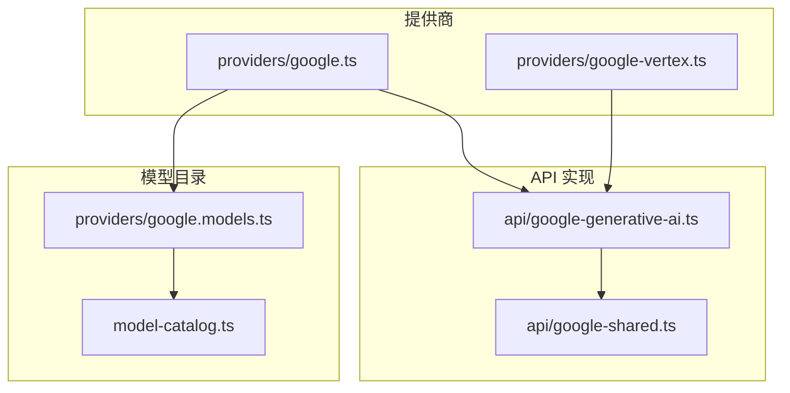
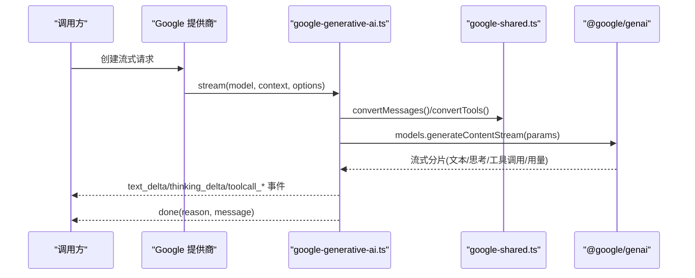
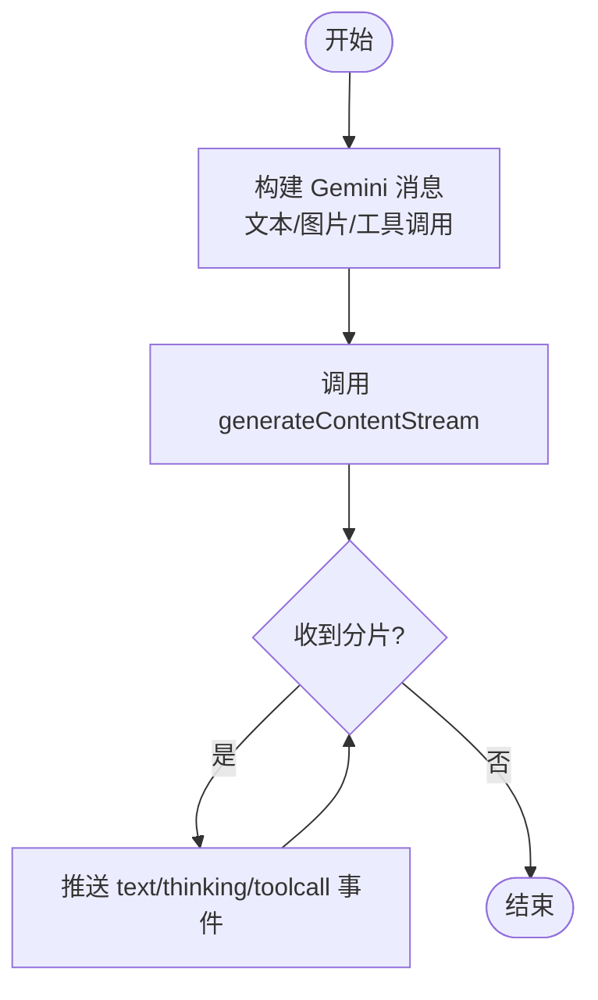
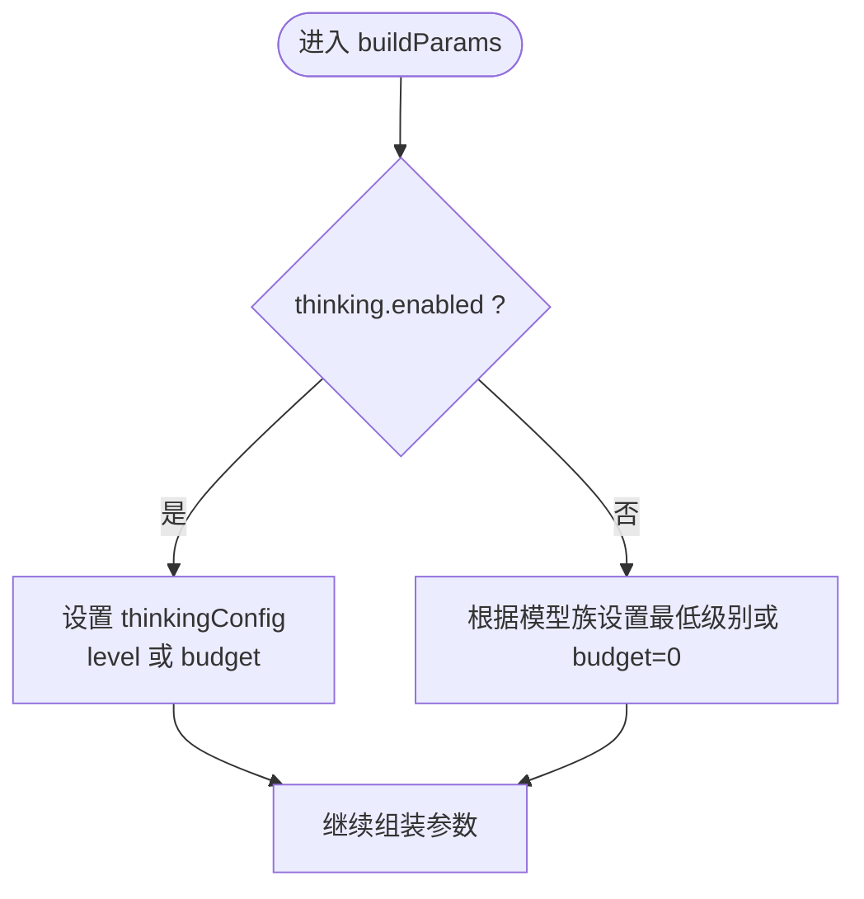
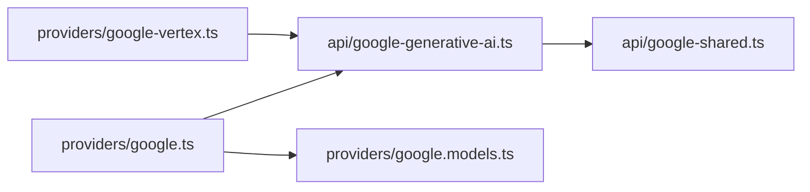

# Google Gemini 配置

<cite>
**本文引用的文件**
- [google.ts](file://packages/ai/src/providers/google.ts)
- [google.models.ts](file://packages/ai/src/providers/google.models.ts)
- [google-generative-ai.ts](file://packages/ai/src/api/google-generative-ai.ts)
- [google-shared.ts](file://packages/ai/src/api/google-shared.ts)
- [google-vertex.ts](file://packages/ai/src/providers/google-vertex.ts)
- [model-catalog.ts](file://packages/ai/src/model-catalog.ts)
</cite>

## 目录
1. [简介](#简介)
2. [项目结构](#项目结构)
3. [核心组件](#核心组件)
4. [架构总览](#架构总览)
5. [详细组件分析](#详细组件分析)
6. [依赖关系分析](#依赖关系分析)
7. [性能与配额管理](#性能与配额管理)
8. [故障排查指南](#故障排查指南)
9. [结论](#结论)
10. [附录：配置示例与最佳实践](#附录：配置示例与最佳实践)

## 简介
本文件面向在项目中集成并配置 Google Gemini 提供商的使用者与开发者，系统说明以下要点：
- API 密钥与环境变量配置（Gemini 与 Vertex）
- 模型选择与能力差异（如 gemini-pro、gemini-ultra、gemini-2.x/3.x 系列）
- 多模态输入处理（文本、图像）与响应格式
- 安全与合规（内容安全、图片安全等停止原因映射）
- 思考模式（thinking）与推理预算/级别控制
- 工具调用（函数调用）与严格采样模式
- 重试策略与错误处理
- 配额管理与成本计算

## 项目结构
Google Gemini 相关代码主要位于 ai 包的 providers 与 api 目录下：
- providers/google.ts：定义“Google”提供商，绑定 baseUrl、认证方式、模型目录与 API 实现
- providers/google.models.ts：从数据源生成模型目录（包含各模型的元信息）
- api/google-generative-ai.ts：实现流式调用、参数构建、思考模式、工具调用、用量与成本统计
- api/google-shared.ts：消息转换、工具声明转换、停止原因映射、重试封装、多模态函数响应等共享逻辑
- providers/google-vertex.ts：Vertex AI 提供商与认证流程（API Key / ADC / 服务账号）
- model-catalog.ts：模型目录类型与扁平化工具

图表来源
- [google.ts:6-14](file://packages/ai/src/providers/google.ts#L6-L14)
- [google-generative-ai.ts:52-108](file://packages/ai/src/api/google-generative-ai.ts#L52-L108)
- [google-shared.ts:98-248](file://packages/ai/src/api/google-shared.ts#L98-L248)
- [google.models.ts:4-8](file://packages/ai/src/providers/google.models.ts#L4-L8)
- [model-catalog.ts:15-27](file://packages/ai/src/model-catalog.ts#L15-L27)

章节来源
- [google.ts:6-14](file://packages/ai/src/providers/google.ts#L6-L14)
- [google.models.ts:4-8](file://packages/ai/src/providers/google.models.ts#L4-L8)
- [model-catalog.ts:15-27](file://packages/ai/src/model-catalog.ts#L15-L27)

## 核心组件
- 提供商注册与认证
  - “Google”提供商通过环境变量读取 Gemini API Key，并指向 Generative Language API 的 base URL。
  - “Google Vertex AI”提供商支持 API Key、Application Default Credentials（ADC）与服务账号三种认证路径，并在运行时解析 project/location/credentials。
- 模型目录
  - 模型元数据由脚本生成，统一以 ModelCatalog 形式暴露，供上层按 id 选择模型。
- 流式 API 适配层
  - 将内部上下文（消息、工具、系统提示）转换为 Gemini 请求参数；处理流式分片、思考块、工具调用、用量与成本统计。
- 共享工具
  - 消息与工具转换、多模态函数响应、停止原因映射、重试封装等。

章节来源
- [google.ts:6-14](file://packages/ai/src/providers/google.ts#L6-L14)
- [google-vertex.ts:8-90](file://packages/ai/src/providers/google-vertex.ts#L8-L90)
- [google-generative-ai.ts:52-108](file://packages/ai/src/api/google-generative-ai.ts#L52-L108)
- [google-shared.ts:98-248](file://packages/ai/src/api/google-shared.ts#L98-L248)

## 架构总览
下图展示一次流式生成的端到端流程：客户端调用 -> 提供商 -> API 适配层 -> 共享转换 -> 调用 SDK -> 流式事件回传。

图表来源
- [google-generative-ai.ts:52-108](file://packages/ai/src/api/google-generative-ai.ts#L52-L108)
- [google-shared.ts:98-248](file://packages/ai/src/api/google-shared.ts#L98-L248)

## 详细组件分析

### 提供商与认证
- Google（Generative Language API）
  - 使用环境变量读取 API Key，baseUrl 指向官方接口版本路径。
- Google Vertex AI
  - 支持交互式选择认证方式：API Key、ADC、服务账号；自动读取 project/location/credentials 环境变量或默认路径。

章节来源
- [google.ts:6-14](file://packages/ai/src/providers/google.ts#L6-L14)
- [google-vertex.ts:8-90](file://packages/ai/src/providers/google-vertex.ts#L8-L90)

### 模型选择与能力
- 模型目录由脚本生成，统一暴露为 ModelCatalog，可按 id 选择不同模型（例如 gemini-* 系列）。
- 针对 Gemini 3.x Pro/Flash 与 Gemma 4 等模型，思考模式的行为与可用级别存在差异，适配层会做兼容处理。

章节来源
- [google.models.ts:4-8](file://packages/ai/src/providers/google.models.ts#L4-L8)
- [google-generative-ai.ts:417-442](file://packages/ai/src/api/google-generative-ai.ts#L417-L442)

### 多模态输入与响应
- 用户消息支持纯文本或多部分（文本 + 内联图片），内部会转为 Gemini Content[] 的 parts。
- 工具结果可返回文本与图片；对 Gemini 3+ 支持在 functionResponse.parts 中嵌入图片；低版本则拆分为单独的用户消息。
- 响应流中包含文本、思考块、工具调用以及用量统计。

图表来源
- [google-shared.ts:98-248](file://packages/ai/src/api/google-shared.ts#L98-L248)
- [google-generative-ai.ts:98-213](file://packages/ai/src/api/google-generative-ai.ts#L98-L213)

章节来源
- [google-shared.ts:98-248](file://packages/ai/src/api/google-shared.ts#L98-L248)
- [google-generative-ai.ts:98-213](file://packages/ai/src/api/google-generative-ai.ts#L98-L213)

### 思考模式（Thinking）与推理预算
- 可通过 thinking.enabled 开启/关闭；支持 level（MINIMAL/LOW/MEDIUM/HIGH）或 budgetTokens。
- 针对不同模型族（Gemini 3.x Pro/Flash、Gemma 4、Gemini 2.x）采用不同的禁用/降级策略。
- 简单流式入口会根据 reasoning 级别自动映射到合适的 thinking 配置。

图表来源
- [google-generative-ai.ts:382-442](file://packages/ai/src/api/google-generative-ai.ts#L382-L442)

章节来源
- [google-generative-ai.ts:382-442](file://packages/ai/src/api/google-generative-ai.ts#L382-L442)

### 工具调用与严格采样
- 工具声明转换为 Gemini functionDeclarations，支持 JSON Schema 或 OpenAPI 兼容字段。
- 对于 Gemini 3+ 及特定场景启用 VALIDATED 严格模式，确保必填参数校验。
- 流式响应中的 functionCall 会被转换为统一的 toolCall 事件，必要时生成唯一 ID。

章节来源
- [google-shared.ts:285-336](file://packages/ai/src/api/google-shared.ts#L285-L336)
- [google-generative-ai.ts:166-213](file://packages/ai/src/api/google-generative-ai.ts#L166-L213)

### 安全与停止原因
- 将 Gemini 的 FinishReason 映射为内部 StopReason；涉及内容安全、图片安全、违规内容等都会归为 error。
- 流结束时若未检测到 finish reason，会抛出异常以确保状态一致。

章节来源
- [google-shared.ts:341-382](file://packages/ai/src/api/google-shared.ts#L341-L382)
- [google-generative-ai.ts:215-278](file://packages/ai/src/api/google-generative-ai.ts#L215-L278)

### 重试策略与错误处理
- 所有初始请求通过 retryGoogleRequest 包装，遵循通用重试策略（超时、冲突、限流、服务端错误等），并尊重 Retry-After。
- 错误会被标准化并格式化后放入输出对象的 errorMessage，便于上层统一处理。

章节来源
- [google-shared.ts:393-414](file://packages/ai/src/api/google-shared.ts#L393-L414)
- [google-generative-ai.ts:279-290](file://packages/ai/src/api/google-generative-ai.ts#L279-L290)

## 依赖关系分析
- google.ts 依赖 google-generative-ai.ts 提供的 API 实现与 google.models.ts 的模型目录。
- google-generative-ai.ts 依赖 google-shared.ts 的消息/工具转换、停止原因映射与重试封装。
- google-vertex.ts 复用同一 API 实现，但提供独立的认证流程。

图表来源
- [google.ts:6-14](file://packages/ai/src/providers/google.ts#L6-L14)
- [google-generative-ai.ts:52-108](file://packages/ai/src/api/google-generative-ai.ts#L52-L108)
- [google-vertex.ts:92-99](file://packages/ai/src/providers/google-vertex.ts#L92-L99)

章节来源
- [google.ts:6-14](file://packages/ai/src/providers/google.ts#L6-L14)
- [google-generative-ai.ts:52-108](file://packages/ai/src/api/google-generative-ai.ts#L52-L108)
- [google-vertex.ts:92-99](file://packages/ai/src/providers/google-vertex.ts#L92-L99)

## 性能与配额管理
- 用量统计：每次分片携带 usageMetadata，累计 input/output/cacheRead/reasoning/totalTokens，并计算 cost。
- 成本计算：基于模型定价进行累加，最终汇总至输出对象。
- 建议：
  - 合理设置 maxOutputTokens 与 thinking.budgetTokens/level，避免不必要的长推理。
  - 对高频调用启用缓存（如适用）以降低延迟与成本。
  - 结合业务峰值调整并发与重试上限，避免触发限流。

章节来源
- [google-generative-ai.ts:223-242](file://packages/ai/src/api/google-generative-ai.ts#L223-L242)

## 故障排查指南
- 无 API Key：会直接抛出“缺少 API Key”的错误。请检查环境变量或凭证注入。
- 流结束无 finish reason：视为异常，需检查上游网络或服务端状态。
- 内容/图片安全拦截：FinishReason 映射为 error，需审查输入内容或放宽策略。
- 工具调用失败：检查工具声明与参数是否符合 JSON Schema；必要时启用严格模式。
- 限流/超时：重试策略已内置，可调整 maxRetries/maxRetryDelayMs；关注 Retry-After 头。

章节来源
- [google-generative-ai.ts:79-85](file://packages/ai/src/api/google-generative-ai.ts#L79-L85)
- [google-generative-ai.ts:267-278](file://packages/ai/src/api/google-generative-ai.ts#L267-L278)
- [google-shared.ts:341-382](file://packages/ai/src/api/google-shared.ts#L341-L382)
- [google-shared.ts:393-414](file://packages/ai/src/api/google-shared.ts#L393-L414)

## 结论
本项目对 Google Gemini 提供了完整的提供商集成：涵盖认证、模型目录、多模态、工具调用、思考模式、安全与重试、用量与成本统计。通过统一的流式事件模型，上层应用可以稳定地消费文本、思考、工具调用与终止原因，并以最小代价接入 Gemini 的强大能力。

## 附录：配置示例与最佳实践
以下为常见配置项与最佳实践清单（不展示具体代码，仅列出关键键名与作用）：

- 认证与环境变量
  - Gemini API Key：通过环境变量注入，提供商会在启动时读取。
  - Vertex AI：支持 API Key、ADC、服务账号；需要 GOOGLE_CLOUD_PROJECT、GOOGLE_CLOUD_LOCATION、可选的 GOOGLE_APPLICATION_CREDENTIALS。
- 模型选择
  - 使用模型 id（如 gemini-* 系列）进行选择；不同模型族的思考模式行为不同。
- 多模态
  - 用户消息支持文本与内联图片；工具结果可返回文本与图片（Gemini 3+ 支持在 functionResponse.parts 中嵌入图片）。
- 安全
  - 注意内容安全与图片安全导致的停止原因；必要时调整输入或策略。
- 思考模式
  - 推荐为高价值任务开启 thinking，并根据模型族选择合适的 level 或 budgetTokens。
- 工具调用
  - 为复杂参数建议使用 JSON Schema；对 Gemini 3+ 可启用严格模式提升稳定性。
- 重试与配额
  - 合理设置 maxRetries 与 maxRetryDelayMs；监控用量与成本，结合缓存降低开销。

章节来源
- [google.ts:6-14](file://packages/ai/src/providers/google.ts#L6-L14)
- [google-vertex.ts:8-90](file://packages/ai/src/providers/google-vertex.ts#L8-L90)
- [google-generative-ai.ts:355-409](file://packages/ai/src/api/google-generative-ai.ts#L355-L409)
- [google-shared.ts:98-248](file://packages/ai/src/api/google-shared.ts#L98-L248)
- [google-shared.ts:393-414](file://packages/ai/src/api/google-shared.ts#L393-L414)