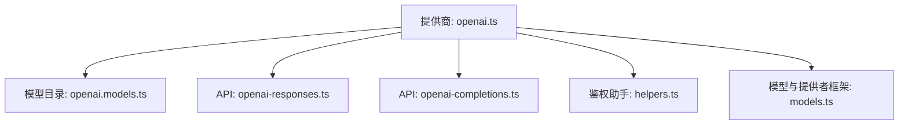
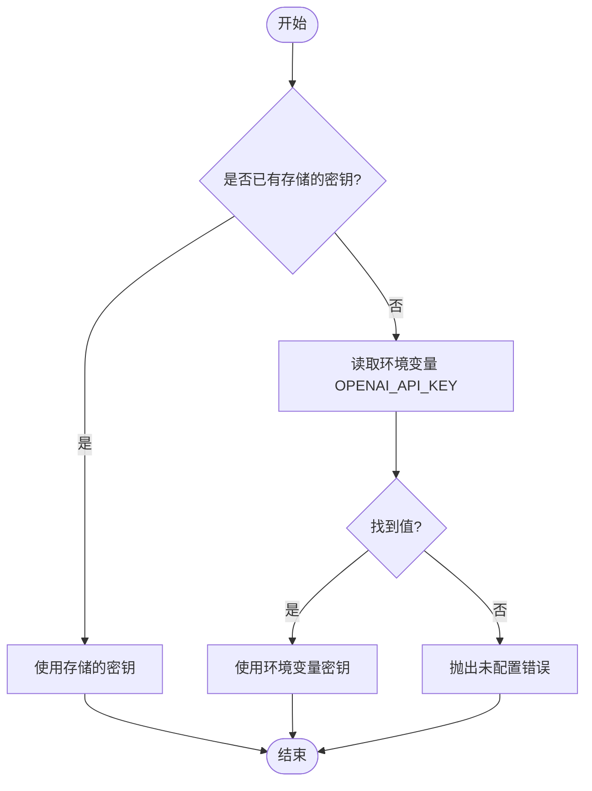
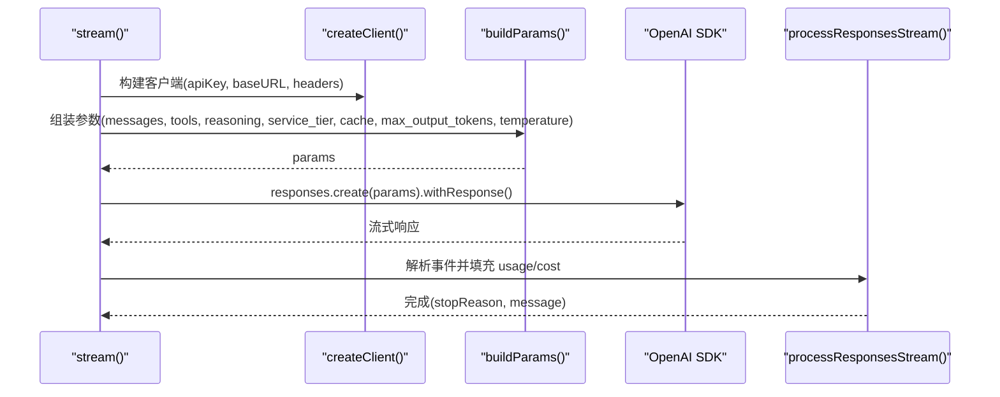
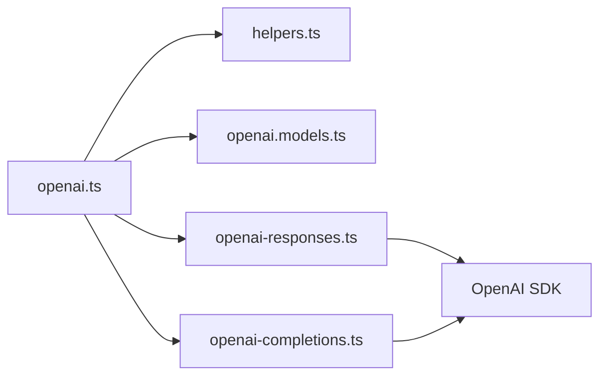

# OpenAI 配置

<cite>
**本文引用的文件**
- [openai.ts](file://packages/ai/src/providers/openai.ts)
- [openai.models.ts](file://packages/ai/src/providers/openai.models.ts)
- [openai-responses.ts](file://packages/ai/src/api/openai-responses.ts)
- [openai-completions.ts](file://packages/ai/src/api/openai-completions.ts)
- [helpers.ts](file://packages/ai/src/auth/helpers.ts)
- [models.ts](file://packages/ai/src/models.ts)
</cite>

## 目录
1. [简介](#简介)
2. [项目结构](#项目结构)
3. [核心组件](#核心组件)
4. [架构总览](#架构总览)
5. [详细组件分析](#详细组件分析)
6. [依赖关系分析](#依赖关系分析)
7. [性能与速率限制](#性能与速率限制)
8. [故障排查指南](#故障排查指南)
9. [结论](#结论)
10. [附录：配置清单与最佳实践](#附录配置清单与最佳实践)

## 简介
本文件面向需要在项目中集成 OpenAI 的开发者，系统说明如何配置 OpenAI 提供商、设置 API 密钥、选择模型、配置端点与请求参数（温度、最大令牌数等），并覆盖函数调用、图像输入、提示词缓存、服务等级、推理强度等高级特性。同时给出 Responses API 的认证方式、请求格式与响应处理要点，以及速率限制与错误处理的实践建议。

## 项目结构
OpenAI 在代码库中以“提供商 + API 实现”的方式组织：
- 提供商定义：负责 id、名称、baseUrl、鉴权、模型列表与 API 路由。
- API 实现：封装对 OpenAI SDK 的调用，构建请求参数、处理流式响应与错误。



图表来源
- [openai.ts:1-16](file://packages/ai/src/providers/openai.ts#L1-L16)
- [openai.models.ts:1-9](file://packages/ai/src/providers/openai.models.ts#L1-L9)
- [openai-responses.ts:1-373](file://packages/ai/src/api/openai-responses.ts#L1-L373)
- [openai-completions.ts:1-800](file://packages/ai/src/api/openai-completions.ts#L1-L800)
- [helpers.ts:1-60](file://packages/ai/src/auth/helpers.ts#L1-L60)
- [models.ts:739-800](file://packages/ai/src/models.ts#L739-L800)

章节来源
- [openai.ts:1-16](file://packages/ai/src/providers/openai.ts#L1-L16)
- [openai.models.ts:1-9](file://packages/ai/src/providers/openai.models.ts#L1-L9)
- [models.ts:739-800](file://packages/ai/src/models.ts#L739-L800)

## 核心组件
- 提供商注册：通过 createProvider 创建 OpenAI 提供商，指定 id、name、baseUrl、鉴权、模型列表与 API 实现。
- 鉴权：使用 envApiKeyAuth 从环境变量或已存储凭据解析 OPENAI_API_KEY。
- 模型目录：自动生成的模型清单，包含可用模型 ID、能力标记与定价信息。
- API 实现：
  - Responses API：基于 openai.responses.create 的流式接口，支持工具调用、推理强度、服务等级、提示词缓存等。
  - Completions API：兼容 Chat Completions 的流式接口，支持工具、思考模式、缓存控制等。

章节来源
- [openai.ts:1-16](file://packages/ai/src/providers/openai.ts#L1-L16)
- [helpers.ts:1-60](file://packages/ai/src/auth/helpers.ts#L1-L60)
- [openai.models.ts:1-9](file://packages/ai/src/providers/openai.models.ts#L1-L9)
- [openai-responses.ts:1-373](file://packages/ai/src/api/openai-responses.ts#L1-L373)
- [openai-completions.ts:1-800](file://packages/ai/src/api/openai-completions.ts#L1-L800)

## 架构总览
OpenAI 提供商将“提供商元数据 + 鉴权 + 模型目录 + API 实现”组合在一起，上层通过统一的 Models 框架进行调度与鉴权应用。

```mermaid
sequenceDiagram
participant App as "应用"
participant Models as "Models 框架"
participant Provider as "OpenAI 提供商"
participant API as "Responses API"
participant SDK as "OpenAI SDK"
participant End as "OpenAI 服务端"
App->>Models : 选择模型(如 gpt-4o-mini)
Models->>Provider : 获取鉴权与 baseUrl
Provider-->>Models : {apiKey, baseUrl}
Models->>API : stream(model, context, options)
API->>SDK : responses.create(params, withResponse)
SDK->>End : POST /v1/responses (携带 Authorization)
End-->>SDK : 流式响应
SDK-->>API : 事件流
API-->>Models : AssistantMessageEventStream
Models-->>App : 文本/工具/思考增量事件
```

图表来源
- [openai.ts:1-16](file://packages/ai/src/providers/openai.ts#L1-L16)
- [openai-responses.ts:102-195](file://packages/ai/src/api/openai-responses.ts#L102-L195)
- [models.ts:667-688](file://packages/ai/src/models.ts#L667-L688)

## 详细组件分析

### 提供商与鉴权
- 提供商定义：id="openai"，name="OpenAI"，baseUrl="https://api.openai.com/v1"，使用 envApiKeyAuth 读取 OPENAI_API_KEY。
- 鉴权流程：优先使用已存储的 API Key；否则按顺序读取环境变量；若均未提供则报错。
- 模型目录：由自动生成脚本生成，集中管理模型 ID、能力与定价。



图表来源
- [helpers.ts:9-31](file://packages/ai/src/auth/helpers.ts#L9-L31)
- [openai.ts:6-14](file://packages/ai/src/providers/openai.ts#L6-L14)

章节来源
- [openai.ts:1-16](file://packages/ai/src/providers/openai.ts#L1-L16)
- [helpers.ts:1-60](file://packages/ai/src/auth/helpers.ts#L1-L60)
- [openai.models.ts:1-9](file://packages/ai/src/providers/openai.models.ts#L1-L9)

### Responses API 集成
- 认证：通过 OpenAI SDK 客户端注入 apiKey 与 baseURL，默认使用 https://api.openai.com/v1。
- 请求构造：
  - 消息转换：将内部消息转换为 Responses 输入格式。
  - 工具调用：根据模型兼容性启用严格模式、语法约束、延迟工具等。
  - 推理强度：reasoning.effort 与 reasoning.summary，可包含加密推理内容。
  - 服务等级：service_tier 可选 flex/priority/default，影响优先级与成本。
  - 提示词缓存：prompt_cache_key、prompt_cache_retention、显式关闭隐式缓存。
  - 最大输出令牌：max_output_tokens，最小值受服务端限制。
  - 温度：temperature 直接透传。
- 流式处理：使用 withResponse 获取原始响应头与状态码，并通过 processResponsesStream 解析事件。
- 错误处理：统一格式化错误，区分中止与错误终止，清理临时字段。



图表来源
- [openai-responses.ts:102-195](file://packages/ai/src/api/openai-responses.ts#L102-L195)
- [openai-responses.ts:214-343](file://packages/ai/src/api/openai-responses.ts#L214-L343)

章节来源
- [openai-responses.ts:1-373](file://packages/ai/src/api/openai-responses.ts#L1-L373)

### Completions API 集成
- 适用场景：兼容 Chat Completions 的流式接口，适合需要细粒度控制消息与工具的旧有工作流。
- 关键选项：
  - 最大令牌：max_tokens 或 max_completion_tokens（取决于模型兼容性）。
  - 温度：temperature。
  - 工具：tools、tool_choice，支持严格模式与语法约束。
  - 思考模式：不同模型的 thinking/format 映射，支持 reasoning_effort。
  - 提示词缓存：prompt_cache_key、prompt_cache_retention。
  - 流式使用统计：include_usage。
- 错误处理：标准化错误，附加元数据，清理流式缓冲字段。

章节来源
- [openai-completions.ts:1-800](file://packages/ai/src/api/openai-completions.ts#L1-L800)

### 模型选择与能力
- 模型来源：OPENAI_MODELS 由脚本自动生成，包含模型 ID、能力标记（如 supportsDeveloperRole、supportsLongCacheRetention、supportsStrictMode 等）与定价。
- 选择建议：
  - 通用对话：gpt-4o、gpt-4o-mini、gpt-3.5-turbo（以实际目录为准）。
  - 高推理需求：开启 reasoning.effort 与 summary。
  - 成本控制：结合 service_tier=flex 降低费用，或使用较小模型。

章节来源
- [openai.models.ts:1-9](file://packages/ai/src/providers/openai.models.ts#L1-L9)
- [openai-responses.ts:67-78](file://packages/ai/src/api/openai-responses.ts#L67-L78)

## 依赖关系分析
- 提供商依赖：
  - 鉴权：envApiKeyAuth 提供标准化的 API Key 解析。
  - 模型：OPENAI_MODELS 提供静态模型清单。
  - API：openai-responses.lazy 与 openai-completions.lazy 按需加载。
- 运行时依赖：
  - OpenAI SDK：用于发起 HTTP 请求与流式处理。
  - 重试与错误处理：retryProviderRequest、error-body 工具。
  - 头部与会话亲和性：headersToRecord、session affinity 头拼接。



图表来源
- [openai.ts:1-16](file://packages/ai/src/providers/openai.ts#L1-L16)
- [helpers.ts:1-60](file://packages/ai/src/auth/helpers.ts#L1-L60)
- [openai-responses.ts:1-373](file://packages/ai/src/api/openai-responses.ts#L1-L373)
- [openai-completions.ts:1-800](file://packages/ai/src/api/openai-completions.ts#L1-L800)

章节来源
- [openai.ts:1-16](file://packages/ai/src/providers/openai.ts#L1-L16)
- [openai-responses.ts:1-373](file://packages/ai/src/api/openai-responses.ts#L1-L373)
- [openai-completions.ts:1-800](file://packages/ai/src/api/openai-completions.ts#L1-L800)

## 性能与速率限制
- 速率限制：
  - 通过 retryProviderRequest 的 maxRetries 与 maxRetryDelayMs 控制重试策略。
  - 建议在业务层实现指数退避与并发限流，避免触发 429。
- 成本优化：
  - 使用 service_tier=flex 降低成本（适用于非关键路径）。
  - 合理设置 max_output_tokens，避免过长输出。
  - 利用 prompt_cache_key 与 prompt_cache_retention 复用提示词上下文。
- 流式处理：
  - 使用 include_usage 统计 token 用量，便于监控与计费。
  - 及时中止无效请求（signal.aborted），减少资源浪费。

章节来源
- [openai-responses.ts:145-158](file://packages/ai/src/api/openai-responses.ts#L145-L158)
- [openai-completions.ts:241-254](file://packages/ai/src/api/openai-completions.ts#L241-L254)

## 故障排查指南
- 常见错误：
  - 未配置 API Key：检查 OPENAI_API_KEY 环境变量或存储凭据。
  - 流结束无停止原因：确认服务端返回 finish_reason 或 stopReason。
  - 工具调用失败：检查工具声明与 strict mode、语法约束是否匹配。
- 调试步骤：
  - 使用 onResponse 回调记录状态码与响应头。
  - 打印 onPayload 中的请求体，核对 messages、tools、reasoning、cache 等字段。
  - 捕获异常后查看 errorMessage 与 rawMetadata（如有）。

章节来源
- [openai-responses.ts:171-190](file://packages/ai/src/api/openai-responses.ts#L171-L190)
- [openai-completions.ts:571-610](file://packages/ai/src/api/openai-completions.ts#L571-L610)

## 结论
本项目通过清晰的提供商抽象与统一的鉴权机制，为 OpenAI 提供了稳定且可扩展的集成方案。Responses API 与 Completions API 分别满足现代与兼容型工作流需求。借助提示词缓存、服务等级、推理强度与工具调用等高级特性，可在性能、成本与功能之间取得平衡。建议在生产环境结合重试、限流与监控，确保稳定性与可观测性。

## 附录：配置清单与最佳实践

- 环境变量与鉴权
  - OPENAI_API_KEY：必须设置，用于鉴权。
  - PI_CACHE_RETENTION：可选，设置为 long 可启用长保留的提示词缓存（需模型支持）。
  - 存储凭据：可通过登录流程保存 API Key，优先于环境变量。

- 端点与基础配置
  - baseUrl：https://api.openai.com/v1（默认）。
  - 自定义请求头：可注入 x-session-id、x-client-request-id 等以实现会话亲和性。

- 模型选择
  - 常用模型：gpt-4o、gpt-4o-mini、gpt-3.5-turbo（以模型目录为准）。
  - 能力标记：supportsDeveloperRole、supportsLongCacheRetention、supportsStrictMode、supportsOpenAIGrammarTools、supportsToolSearch、supportsExplicitPromptCacheMode。

- 请求参数
  - temperature：控制随机性。
  - maxTokens/max_output_tokens：限制输出长度，注意服务端最小值限制。
  - toolChoice：控制工具调用策略。
  - reasoning.effort/summary：控制推理强度与摘要。
  - service_tier：flex/priority/default，影响优先级与成本。
  - prompt_cache_key/prompt_cache_retention：提示词缓存键与保留时长。
  - store=false：避免存储对话历史。

- 函数调用与图像
  - 函数调用：通过 tools 与 tool_choice 配置，支持严格模式与语法约束。
  - 图像输入：Completions API 支持图片内容块，Responses API 通过消息转换适配。

- 速率限制与错误处理
  - 重试：maxRetries、maxRetryDelayMs。
  - 错误：统一格式化，区分中止与错误，附加元数据。
  - 监控：onResponse 记录状态码与头；usage 统计 token 用量。

- 最佳实践
  - 使用短会话与缓存键提升命中率。
  - 根据任务重要性选择 service_tier。
  - 合理设置 temperature 与 maxTokens，避免过度消耗。
  - 对工具调用进行严格校验，减少幻觉。
  - 在生产环境启用日志与告警，关注 429 与超时。

章节来源
- [openai.ts:1-16](file://packages/ai/src/providers/openai.ts#L1-L16)
- [helpers.ts:1-60](file://packages/ai/src/auth/helpers.ts#L1-L60)
- [openai-responses.ts:57-78](file://packages/ai/src/api/openai-responses.ts#L57-L78)
- [openai-responses.ts:284-343](file://packages/ai/src/api/openai-responses.ts#L284-L343)
- [openai-completions.ts:681-746](file://packages/ai/src/api/openai-completions.ts#L681-L746)