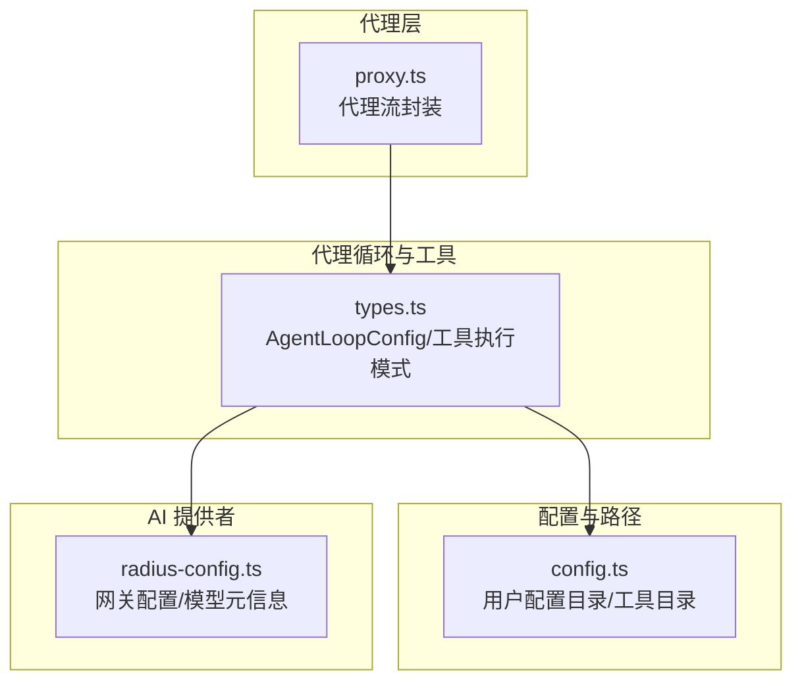
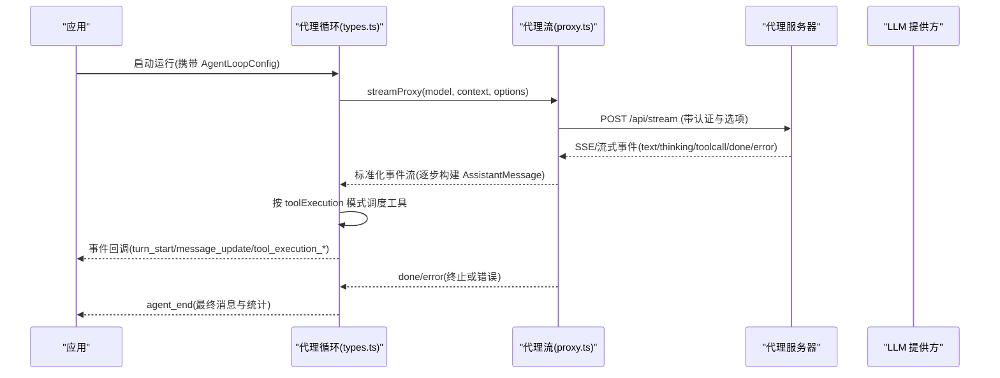
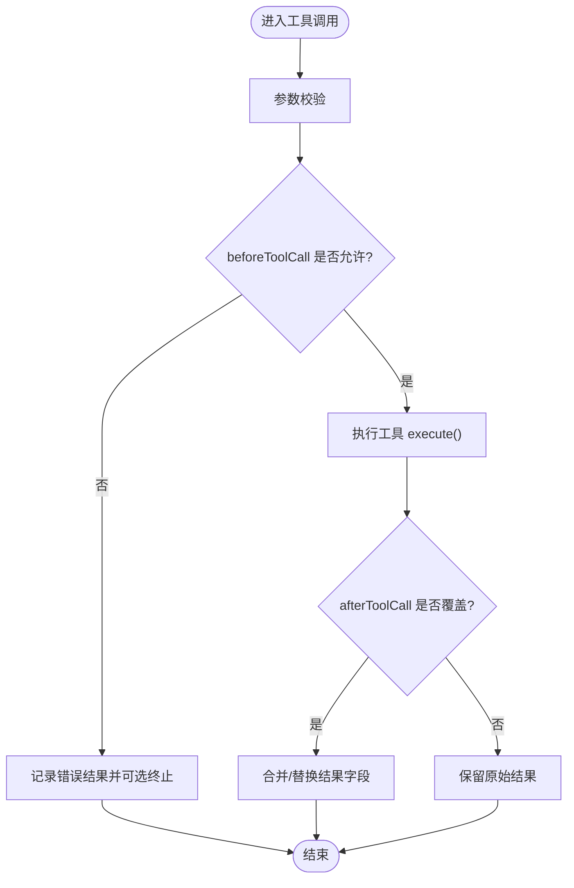
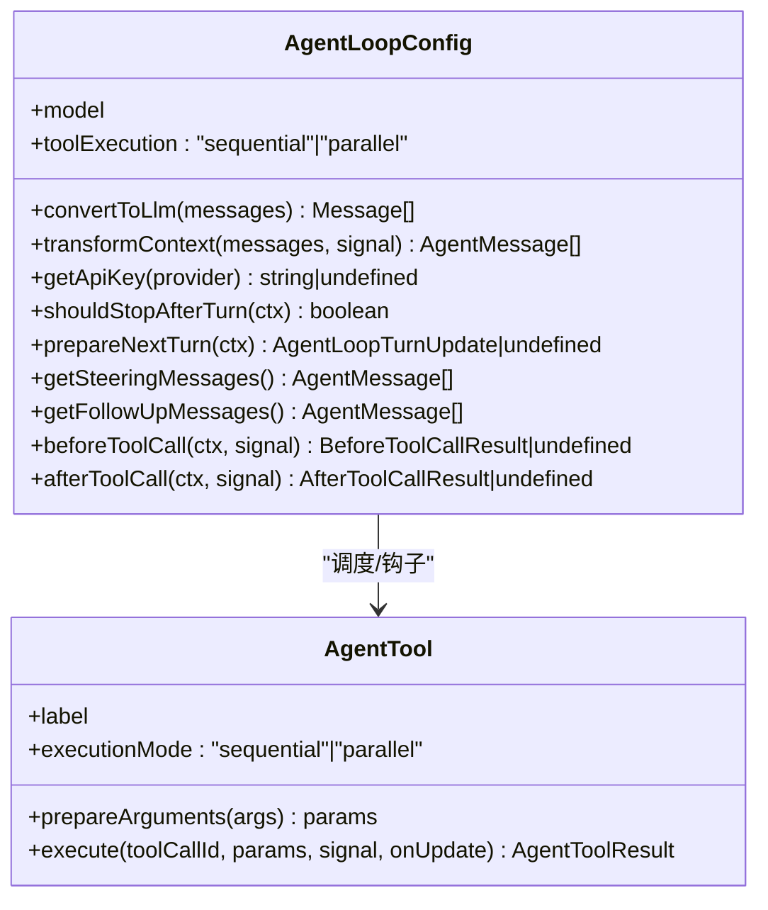
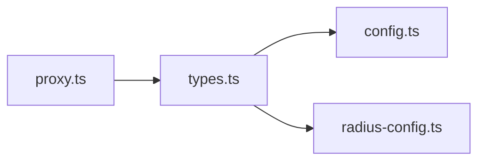

# 代理行为配置

<cite>
**本文引用的文件**
- [packages/agent/src/types.ts](file://packages/agent/src/types.ts)
- [packages/agent/src/proxy.ts](file://packages/agent/src/proxy.ts)
- [packages/coding-agent/src/config.ts](file://packages/coding-agent/src/config.ts)
- [packages/ai/src/providers/radius-config.ts](file://packages/ai/src/providers/radius-config.ts)
</cite>

## 目录
1. [简介](#简介)
2. [项目结构](#项目结构)
3. [核心组件](#核心组件)
4. [架构总览](#架构总览)
5. [详细组件分析](#详细组件分析)
6. [依赖关系分析](#依赖关系分析)
7. [性能考虑](#性能考虑)
8. [故障排查指南](#故障排查指南)
9. [结论](#结论)
10. [附录](#附录)

## 简介
本文件面向“代理行为”的配置与调优，覆盖以下方面：
- 工具管理配置：启用/禁用、自定义路径、权限控制
- 执行策略配置：超时、重试、并发、内存限制
- 缓存配置：策略、存储位置、过期时间、清理规则
- 场景化配置示例：快速响应模式、深度分析模式、批量处理模式
- 性能调优与资源管理

说明：本文严格基于仓库内现有代码与类型定义进行归纳，未出现的配置项将明确标注“未在代码中实现”，以避免误导。

## 项目结构
围绕代理行为的关键代码分布在以下模块：
- 代理流与请求转发：packages/agent/src/proxy.ts
- 代理循环与工具执行策略：packages/agent/src/types.ts
- 用户配置路径与工具目录：packages/coding-agent/src/config.ts
- 网关/模型配置加载（含缓存相关字段透传）：packages/ai/src/providers/radius-config.ts

图表来源
- [packages/agent/src/proxy.ts:118-235](file://packages/agent/src/proxy.ts#L118-L235)
- [packages/agent/src/types.ts:149-293](file://packages/agent/src/types.ts#L149-L293)
- [packages/coding-agent/src/config.ts:514-566](file://packages/coding-agent/src/config.ts#L514-L566)
- [packages/ai/src/providers/radius-config.ts:17-24](file://packages/ai/src/providers/radius-config.ts#L17-L24)

章节来源
- [packages/agent/src/proxy.ts:118-235](file://packages/agent/src/proxy.ts#L118-L235)
- [packages/agent/src/types.ts:149-293](file://packages/agent/src/types.ts#L149-L293)
- [packages/coding-agent/src/config.ts:514-566](file://packages/coding-agent/src/config.ts#L514-L566)
- [packages/ai/src/providers/radius-config.ts:17-24](file://packages/ai/src/providers/radius-config.ts#L17-L24)

## 核心组件
- 代理流（Proxy Stream）：通过 HTTP 流式接口转发 LLM 调用，支持中止信号、错误映射、增量事件组装。
- 代理循环配置（AgentLoopConfig）：定义消息转换、上下文变换、轮次控制、工具执行模式、前后置钩子等。
- 工具与执行模式：支持顺序/并行两种工具执行模式，并可在工具级别覆盖。
- 用户配置路径：提供 tools、bin、sessions、prompts 等目录解析，便于扩展工具链与二进制依赖。
- 网关/模型配置：从远程网关加载模型能力与成本、上下文窗口、最大输出等元数据。

章节来源
- [packages/agent/src/proxy.ts:118-235](file://packages/agent/src/proxy.ts#L118-L235)
- [packages/agent/src/types.ts:149-293](file://packages/agent/src/types.ts#L149-L293)
- [packages/coding-agent/src/config.ts:514-566](file://packages/coding-agent/src/config.ts#L514-L566)
- [packages/ai/src/providers/radius-config.ts:61-68](file://packages/ai/src/providers/radius-config.ts#L61-L68)

## 架构总览
下图展示了客户端通过代理流发起请求，服务端返回增量事件，代理层在本地重建消息并回传给上层；同时，代理循环根据配置决定工具执行策略与轮次控制。

图表来源
- [packages/agent/src/proxy.ts:118-235](file://packages/agent/src/proxy.ts#L118-L235)
- [packages/agent/src/types.ts:149-293](file://packages/agent/src/types.ts#L149-L293)

## 详细组件分析

### 工具管理配置
- 工具集合与生命周期
  - 工具列表由 AgentState.tools 暴露，可在运行时替换。
  - 工具定义包含 label、prepareArguments、execute、executionMode 等。
- 启用/禁用
  - 通过向 AgentState.tools 赋值不同数组来动态启用/禁用工具。
- 自定义工具路径
  - 用户工具目录位于 getToolsDir()，可在此放置外部工具脚本或二进制。
  - 受管二进制目录 getBinDir() 可用于存放 fd、rg 等依赖。
- 权限与安全
  - 可通过 beforeToolCall 钩子在参数校验后、执行前拦截或阻止工具执行，并可设置 terminate 提示提前结束批次。
  - afterToolCall 钩子可对结果进行覆盖（内容、详情、错误标志、用量、terminate）。

图表来源
- [packages/agent/src/types.ts:270-293](file://packages/agent/src/types.ts#L270-L293)
- [packages/agent/src/types.ts:385-409](file://packages/agent/src/types.ts#L385-L409)
- [packages/coding-agent/src/config.ts:543-551](file://packages/coding-agent/src/config.ts#L543-L551)

章节来源
- [packages/agent/src/types.ts:333-409](file://packages/agent/src/types.ts#L333-L409)
- [packages/coding-agent/src/config.ts:543-551](file://packages/coding-agent/src/config.ts#L543-L551)

### 执行策略配置
- 工具执行模式
  - sequential：逐个准备、执行、收尾后再下一个。
  - parallel：顺序预检后，允许的工具并发执行；tool_execution_end 按完成顺序发出，消息产物稍后按源顺序发出。
  - 工具级覆盖：每个工具可声明 executionMode 以覆盖默认策略。
- 轮次控制与上下文
  - shouldStopAfterTurn：在当前轮次结束后决定是否停止。
  - prepareNextTurn：在 turn_end 后注入新的上下文/模型/思考级别。
  - transformContext：在转换为 LLM 消息前对上下文做裁剪/注入。
  - convertToLlm：将内部消息转为 LLM 可理解的消息序列。
- 流式选项（来自 SimpleStreamOptions）
  - temperature、maxTokens、reasoning、thinkingBudgets、cacheRetention、sessionId、headers、metadata、transport、maxRetryDelayMs 等会在代理流中被序列化并下发到服务端。

图表来源
- [packages/agent/src/types.ts:149-293](file://packages/agent/src/types.ts#L149-L293)
- [packages/agent/src/types.ts:385-409](file://packages/agent/src/types.ts#L385-L409)

章节来源
- [packages/agent/src/types.ts:149-293](file://packages/agent/src/types.ts#L149-L293)
- [packages/agent/src/types.ts:385-409](file://packages/agent/src/types.ts#L385-L409)

### 缓存配置
- 透传字段
  - cacheRetention：在代理流选项中存在，用于控制与服务端的缓存保留策略。
  - sessionId：会话标识，有助于跨请求复用上下文或缓存。
- 模型元信息
  - 网关模型配置中包含 contextWindow、maxTokens、cost 等，可用于估算上下文与预算。
- 注意
  - 当前代码未提供本地缓存的存储位置、过期时间与清理规则的显式配置项；如需本地缓存，应在上层应用中自行实现，并结合 sessionId 与 cacheRetention 语义进行设计。

章节来源
- [packages/agent/src/proxy.ts:59-72](file://packages/agent/src/proxy.ts#L59-L72)
- [packages/agent/src/proxy.ts:102-116](file://packages/agent/src/proxy.ts#L102-L116)
- [packages/ai/src/providers/radius-config.ts:6-20](file://packages/ai/src/providers/radius-config.ts#L6-L20)

### 不同场景的配置示例
以下为基于现有类型的组合建议（不展示具体代码，仅给出字段与策略要点）：
- 快速响应模式
  - 降低 thinking 级别或关闭 reasoning
  - 限制 maxTokens
  - 使用 sequential 工具执行，减少并发开销
  - 合理设置 cacheRetention 与服务端会话复用
- 深度分析模式
  - 提高 thinking 级别或开启 reasoning
  - 放宽 maxTokens
  - 使用 parallel 工具执行，提升吞吐
  - 结合 transformContext 裁剪历史，避免上下文溢出
- 批量处理模式
  - 使用 parallel 工具执行
  - 为长任务设置合理的 shouldStopAfterTurn 阈值
  - 利用 prepareNextTurn 在轮次间调整模型/上下文
  - 结合 sessionId 与 cacheRetention 提升命中率

章节来源
- [packages/agent/src/types.ts:149-293](file://packages/agent/src/types.ts#L149-L293)
- [packages/agent/src/proxy.ts:59-72](file://packages/agent/src/proxy.ts#L59-L72)

## 依赖关系分析
- proxy.ts 依赖 SimpleStreamOptions 的部分字段，并将其序列化后通过 HTTP 发送到服务端。
- types.ts 定义了 AgentLoopConfig、AgentTool、AgentState 等核心类型，驱动工具执行与轮次控制。
- config.ts 提供用户配置目录与工具/二进制路径，便于扩展工具链。
- radius-config.ts 提供网关模型元数据加载，辅助上层进行上下文与预算规划。

图表来源
- [packages/agent/src/proxy.ts:59-72](file://packages/agent/src/proxy.ts#L59-L72)
- [packages/agent/src/types.ts:149-293](file://packages/agent/src/types.ts#L149-L293)
- [packages/coding-agent/src/config.ts:514-566](file://packages/coding-agent/src/config.ts#L514-L566)
- [packages/ai/src/providers/radius-config.ts:61-68](file://packages/ai/src/providers/radius-config.ts#L61-L68)

章节来源
- [packages/agent/src/proxy.ts:59-72](file://packages/agent/src/proxy.ts#L59-L72)
- [packages/agent/src/types.ts:149-293](file://packages/agent/src/types.ts#L149-L293)
- [packages/coding-agent/src/config.ts:514-566](file://packages/coding-agent/src/config.ts#L514-L566)
- [packages/ai/src/providers/radius-config.ts:61-68](file://packages/ai/src/providers/radius-config.ts#L61-L68)

## 性能考虑
- 工具执行模式选择
  - sequential：适合有状态或互斥的工具，避免竞态。
  - parallel：适合无副作用或幂等的工具，提升吞吐。
- 上下文管理
  - 使用 transformContext 定期裁剪旧消息，防止上下文过大导致延迟与成本上升。
- 流式与中断
  - 通过 AbortSignal 及时取消长时间任务，释放网络与计算资源。
- 缓存与会话
  - 合理使用 cacheRetention 与 sessionId，在服务端层面提升命中与复用。
- 资源边界
  - 通过 maxTokens、thinkingBudgets 限制单次请求的资源消耗。
  - 结合 shouldStopAfterTurn 与 prepareNextTurn 控制长任务的阶段推进。

[本节为通用指导，不直接分析具体文件]

## 故障排查指南
- 代理请求失败
  - 检查代理 URL、鉴权令牌与网络连通性。
  - 查看错误事件中的 reason 与 errorMessage。
- 工具执行异常
  - 在 beforeToolCall 中打印/记录参数与上下文，确认是否被拦截。
  - 在 afterToolCall 中捕获并修正结果（isError、content、details）。
- 上下文溢出或响应过慢
  - 调整 convertToLlm 与 transformContext，过滤不必要消息。
  - 降低 thinking 级别或 maxTokens。
- 缓存未命中
  - 确认 sessionId 一致性与 cacheRetention 设置是否符合预期。

章节来源
- [packages/agent/src/proxy.ts:153-235](file://packages/agent/src/proxy.ts#L153-L235)
- [packages/agent/src/types.ts:270-293](file://packages/agent/src/types.ts#L270-L293)

## 结论
- 代理行为的核心在于“流式转发 + 工具执行策略 + 上下文/轮次控制”。
- 工具管理可通过工具集合与钩子实现细粒度控制；路径与二进制依赖由用户配置目录管理。
- 缓存主要依赖服务端能力，并通过 cacheRetention 与 sessionId 进行协同。
- 针对不同场景，可通过 thinking/推理、maxTokens、工具执行模式与上下文裁剪进行组合优化。

[本节为总结，不直接分析具体文件]

## 附录
- 关键类型与字段速查
  - 工具执行模式：sequential | parallel（全局与工具级均可配置）
  - 轮次控制：shouldStopAfterTurn、prepareNextTurn
  - 上下文处理：transformContext、convertToLlm
  - 流式选项：temperature、maxTokens、reasoning、thinkingBudgets、cacheRetention、sessionId、headers、metadata、transport、maxRetryDelayMs
  - 用户路径：tools、bin、sessions、prompts

章节来源
- [packages/agent/src/types.ts:149-293](file://packages/agent/src/types.ts#L149-L293)
- [packages/agent/src/proxy.ts:59-72](file://packages/agent/src/proxy.ts#L59-L72)
- [packages/coding-agent/src/config.ts:514-566](file://packages/coding-agent/src/config.ts#L514-L566)