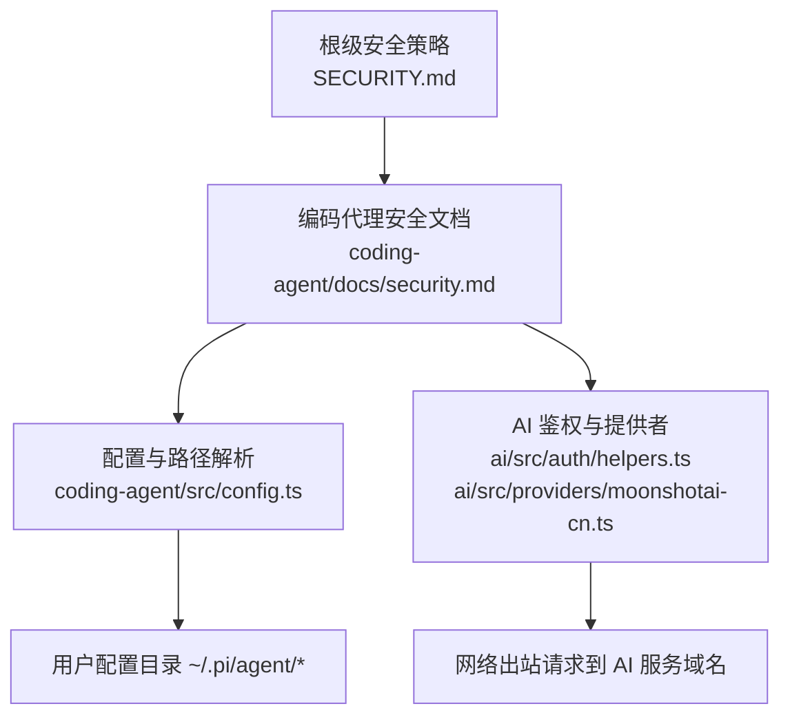
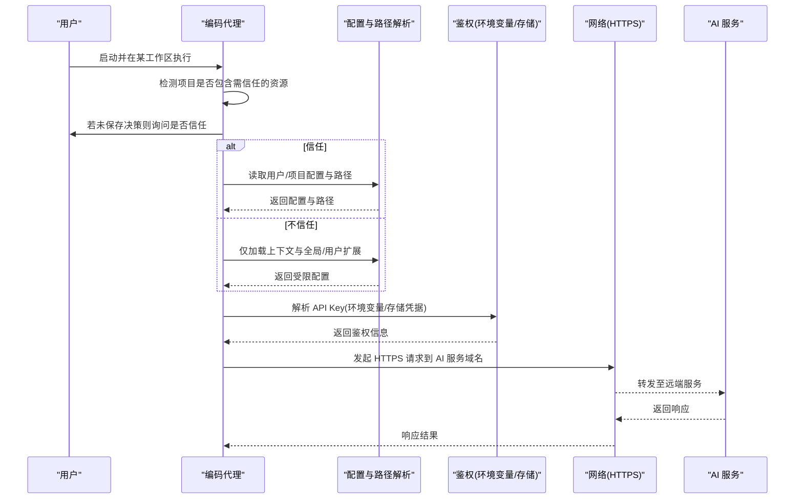
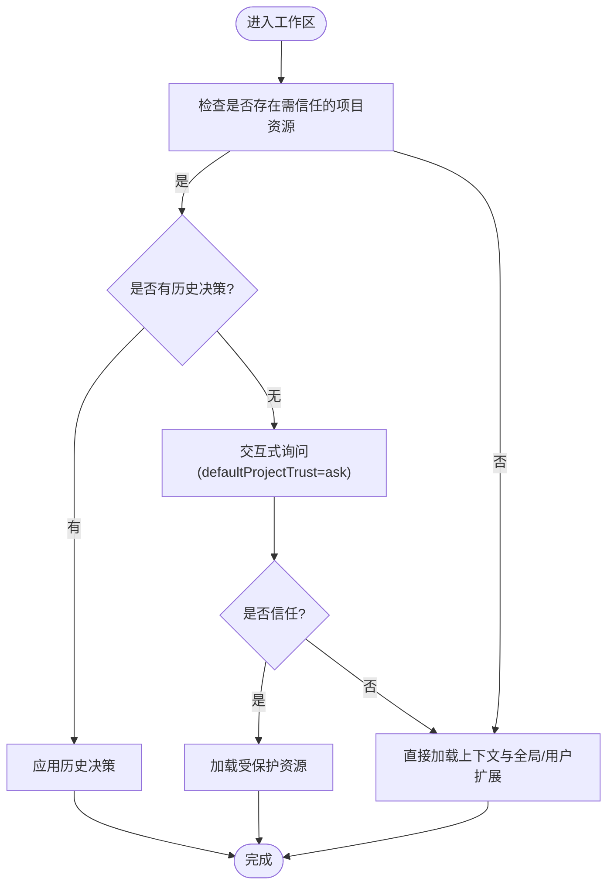
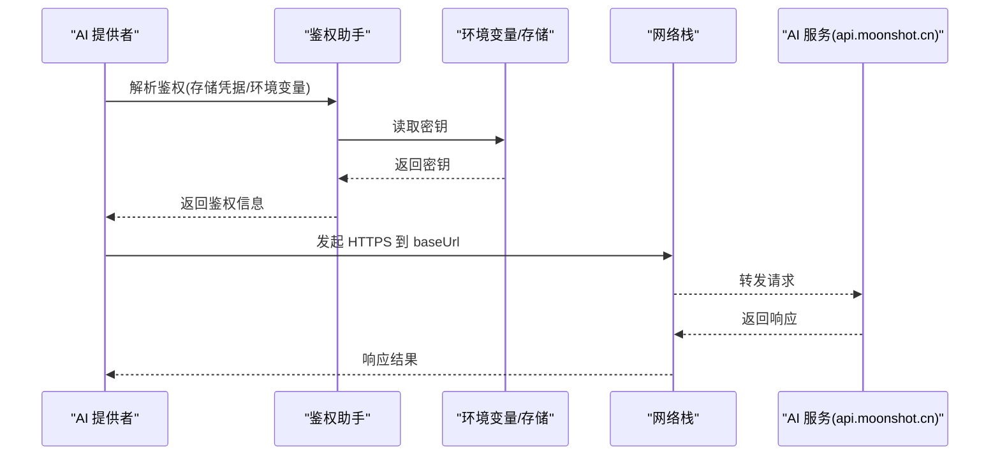
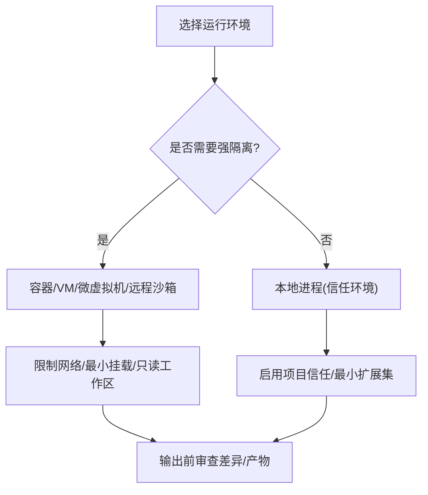
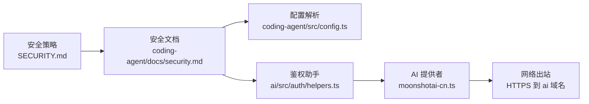

# 安全配置

<cite>
**本文引用的文件**
- [SECURITY.md](file://SECURITY.md)
- [packages/coding-agent/docs/security.md](file://packages/coding-agent/docs/security.md)
- [packages/coding-agent/src/config.ts](file://packages/coding-agent/src/config.ts)
- [packages/ai/src/auth/helpers.ts](file://packages/ai/src/auth/helpers.ts)
- [packages/ai/src/providers/moonshotai-cn.ts](file://packages/ai/src/providers/moonshotai-cn.ts)
</cite>

## 目录
1. [简介](#简介)
2. [项目结构](#项目结构)
3. [核心组件](#核心组件)
4. [架构总览](#架构总览)
5. [详细组件分析](#详细组件分析)
6. [依赖关系分析](#依赖关系分析)
7. [性能与安全权衡](#性能与安全权衡)
8. [故障排查指南](#故障排查指南)
9. [结论](#结论)
10. [附录：不同安全级别配置模板](#附录不同安全级别配置模板)

## 简介
本文件面向“安全配置”主题，结合仓库中的安全策略与实现，说明以下要点：
- 文件访问控制：信任边界、项目资源加载、路径与权限影响。
- 网络访问限制：API 域名、端口与代理的约束与注意事项。
- 沙箱环境：内置无沙箱的设计决策、隔离建议与外部容器化方案。
- 不同安全级别的配置模板：开发宽松、测试平衡、生产严格。
- 安全审计与日志记录：调试日志位置与可观测性建议。
- 最佳实践与常见漏洞防护：基于仓库安全策略的落地建议。

## 项目结构
该仓库采用多包（monorepo）组织，安全相关的关键内容分布在根级安全策略文档与编码代理模块中：
- 根级安全策略：定义安全边界、报告流程与范围。
- 编码代理安全文档：明确“无内置沙箱”、“项目信任”机制与运行建议。
- 配置与路径解析：提供用户配置目录、会话、模型、认证等路径解析能力。
- AI 提供者与鉴权：通过环境变量或存储凭据注入 API Key，并指向特定服务域名。

图表来源
- [SECURITY.md:1-88](file://SECURITY.md#L1-L88)
- [packages/coding-agent/docs/security.md:1-60](file://packages/coding-agent/docs/security.md#L1-L60)
- [packages/coding-agent/src/config.ts:514-566](file://packages/coding-agent/src/config.ts#L514-L566)
- [packages/ai/src/auth/helpers.ts:1-60](file://packages/ai/src/auth/helpers.ts#L1-L60)
- [packages/ai/src/providers/moonshotai-cn.ts:1-15](file://packages/ai/src/providers/moonshotai-cn.ts#L1-L15)

章节来源
- [SECURITY.md:1-88](file://SECURITY.md#L1-L88)
- [packages/coding-agent/docs/security.md:1-60](file://packages/coding-agent/docs/security.md#L1-L60)
- [packages/coding-agent/src/config.ts:514-566](file://packages/coding-agent/src/config.ts#L514-L566)
- [packages/ai/src/auth/helpers.ts:1-60](file://packages/ai/src/auth/helpers.ts#L1-L60)
- [packages/ai/src/providers/moonshotai-cn.ts:1-15](file://packages/ai/src/providers/moonshotai-cn.ts#L1-L15)

## 核心组件
- 安全策略与范围：明确 Pi 作为本地编码代理的信任边界、不在范围内的风险类型以及漏洞报告流程。
- 项目信任机制：决定是否加载项目内敏感资源（设置、扩展、技能、提示模板等），避免仓库静默改变代理行为。
- 配置与路径解析：统一解析用户配置目录、会话、模型、认证、工具、二进制、提示模板、调试日志等路径。
- 鉴权与网络：通过环境变量或存储凭据注入 API Key；AI 提供者声明目标域名（如 moonshot.cn）。

章节来源
- [SECURITY.md:1-88](file://SECURITY.md#L1-L88)
- [packages/coding-agent/docs/security.md:1-60](file://packages/coding-agent/docs/security.md#L1-L60)
- [packages/coding-agent/src/config.ts:514-566](file://packages/coding-agent/src/config.ts#L514-L566)
- [packages/ai/src/auth/helpers.ts:1-60](file://packages/ai/src/auth/helpers.ts#L1-L60)
- [packages/ai/src/providers/moonshotai-cn.ts:1-15](file://packages/ai/src/providers/moonshotai-cn.ts#L1-L15)

## 架构总览
下图展示从“项目信任”到“配置加载”，再到“网络调用”的安全链路。

图表来源
- [packages/coding-agent/docs/security.md:5-39](file://packages/coding-agent/docs/security.md#L5-L39)
- [packages/coding-agent/src/config.ts:514-566](file://packages/coding-agent/src/config.ts#L514-L566)
- [packages/ai/src/auth/helpers.ts:1-60](file://packages/ai/src/auth/helpers.ts#L1-L60)
- [packages/ai/src/providers/moonshotai-cn.ts:1-15](file://packages/ai/src/providers/moonshotai-cn.ts#L1-L15)

## 详细组件分析

### 文件访问控制与项目信任
- 信任边界：Pi 将本地用户账户及该账户可写的文件视为同一信任边界。若攻击者已能修改用户家目录、工作区、Shell 启动文件、环境变量或 Pi 配置，通常不构成 Pi 自身的安全漏洞。
- 项目资源与信任判定：当当前工作区或其祖先目录存在特定文件或目录时，视为需要信任的项目资源，包括 .pi/settings.json、.pi/extensions/.pi/skills/.pi/prompts/.pi/themes、.pi/SYSTEM.md 或 .pi/APPEND_SYSTEM.md、以及项目 .agents/skills。
- 默认策略与交互：交互式会话在首次遇到需信任资源且无历史决策时，遵循全局 defaultProjectTrust（默认 ask）。非交互模式不会弹出提示，由 --approve/--no-approve 覆盖单次行为。
- 允许与拒绝：信任后加载受保护资源；拒绝时跳过受保护资源，但上下文文件（如 AGENTS.md、AGENTS.override.md、CLAUDE.md）仍会加载，除非显式禁用上下文加载。

图表来源
- [packages/coding-agent/docs/security.md:5-39](file://packages/coding-agent/docs/security.md#L5-L39)

章节来源
- [SECURITY.md:11-22](file://SECURITY.md#L11-L22)
- [packages/coding-agent/docs/security.md:5-39](file://packages/coding-agent/docs/security.md#L5-L39)

### 网络访问限制与代理
- 允许的域名：AI 提供者通过配置声明目标域名，例如 Moonshot CN 使用 https://api.moonshot.cn/v1。其他提供商同理，需在各自提供者中声明 baseUrl。
- 端口限制：代码未对出站端口做白名单或黑名单控制；实际限制应由操作系统防火墙、企业代理或容器网络策略实施。
- 代理设置：仓库未提供统一的代理配置入口；如需代理，应在运行时环境层面（系统代理、HTTP_PROXY/HTTPS_PROXY 等）或通过容器/主机网络策略进行管控。
- 鉴权注入：API Key 优先来自存储凭据，其次按顺序读取环境变量；登录流程支持交互式输入密钥。

图表来源
- [packages/ai/src/providers/moonshotai-cn.ts:6-14](file://packages/ai/src/providers/moonshotai-cn.ts#L6-L14)
- [packages/ai/src/auth/helpers.ts:9-31](file://packages/ai/src/auth/helpers.ts#L9-L31)

章节来源
- [packages/ai/src/providers/moonshotai-cn.ts:6-14](file://packages/ai/src/providers/moonshotai-cn.ts#L6-L14)
- [packages/ai/src/auth/helpers.ts:9-31](file://packages/ai/src/auth/helpers.ts#L9-L31)

### 沙箱环境与隔离建议
- 内置沙箱：Pi 不包含内置沙箱；内置工具与扩展以进程所有者权限运行，具备读写文件、执行 Shell 命令的能力。
- 设计原因：Pi 旨在与本地开发环境深度集成，部分沙箱易被误解为安全边界，而实际仍依赖宿主 Shell、文件系统、包管理器与凭据。
- 推荐隔离：对不受信任的代码或未监控任务，建议在容器、虚拟机、微虚拟机或远程沙箱中运行；最小化挂载的工作区与凭据，必要时只读挂载工作区，避免反向写回宿主机。

图表来源
- [packages/coding-agent/docs/security.md:31-54](file://packages/coding-agent/docs/security.md#L31-L54)

章节来源
- [packages/coding-agent/docs/security.md:31-54](file://packages/coding-agent/docs/security.md#L31-L54)

### 配置与路径解析（用户态）
- 用户配置目录：~/.pi/agent（可通过环境变量覆盖），用于存放 models.json、auth.json、settings.json、tools、bin、prompts、sessions 等。
- 调试日志：位于用户配置目录下，便于问题定位与审计。
- 分享查看器 URL：可通过环境变量覆盖默认值。

章节来源
- [packages/coding-agent/src/config.ts:514-566](file://packages/coding-agent/src/config.ts#L514-L566)

## 依赖关系分析
- 模块耦合：
  - 编码代理安全文档定义了“项目信任”和“无沙箱”原则，驱动配置加载与网络调用前的决策。
  - 配置模块提供统一的用户态路径解析，确保凭据、模型、会话等集中管理。
  - AI 提供者依赖鉴权助手获取 API Key，并固定出站域名。
- 外部依赖：
  - 操作系统/容器网络策略负责实际的出站访问控制（域名、端口、代理）。
  - 第三方 AI 服务域名由提供者声明，需纳入网络白名单管理。

图表来源
- [SECURITY.md:1-88](file://SECURITY.md#L1-L88)
- [packages/coding-agent/docs/security.md:1-60](file://packages/coding-agent/docs/security.md#L1-L60)
- [packages/coding-agent/src/config.ts:514-566](file://packages/coding-agent/src/config.ts#L514-L566)
- [packages/ai/src/auth/helpers.ts:1-60](file://packages/ai/src/auth/helpers.ts#L1-L60)
- [packages/ai/src/providers/moonshotai-cn.ts:1-15](file://packages/ai/src/providers/moonshotai-cn.ts#L1-L15)

章节来源
- [SECURITY.md:1-88](file://SECURITY.md#L1-L88)
- [packages/coding-agent/docs/security.md:1-60](file://packages/coding-agent/docs/security.md#L1-L60)
- [packages/coding-agent/src/config.ts:514-566](file://packages/coding-agent/src/config.ts#L514-L566)
- [packages/ai/src/auth/helpers.ts:1-60](file://packages/ai/src/auth/helpers.ts#L1-L60)
- [packages/ai/src/providers/moonshotai-cn.ts:1-15](file://packages/ai/src/providers/moonshotai-cn.ts#L1-L15)

## 性能与安全权衡
- 项目信任减少不必要的加载开销，同时避免加载恶意资源；在生产环境建议预置信任决策以减少交互成本。
- 容器化隔离带来额外启动与通信开销，但显著提升安全性；建议按需启用并缓存镜像。
- 最小化扩展与技能可降低攻击面与启动时间；仅在必要时启用。

## 故障排查指南
- 无法加载项目资源：确认是否处于信任项目；检查是否存在需信任的文件/目录；在非交互模式下使用 --approve/--no-approve 控制。
- 鉴权失败：检查存储凭据与环境变量优先级；确认环境变量名与值正确；必要时使用交互式登录重新输入密钥。
- 网络不通：确认出站域名是否在白名单；检查代理设置；验证防火墙/安全组规则。
- 日志定位：查看用户配置目录下的调试日志文件，收集错误上下文与时间线。

章节来源
- [packages/coding-agent/docs/security.md:5-39](file://packages/coding-agent/docs/security.md#L5-L39)
- [packages/ai/src/auth/helpers.ts:9-31](file://packages/ai/src/auth/helpers.ts#L9-L31)
- [packages/coding-agent/src/config.ts:514-566](file://packages/coding-agent/src/config.ts#L514-L566)

## 结论
- Pi 的安全边界建立在“本地用户信任域”之上，并通过“项目信任”防止仓库静默篡改配置与扩展。
- 无内置沙箱意味着隔离必须来自操作系统或虚拟化层；生产环境应强制容器化与最小权限。
- 网络访问控制需由外部策略保障；AI 提供者域名需纳入白名单管理。
- 建议结合不同安全级别模板，逐步收紧配置，配合审计与日志，持续降低风险。

## 附录：不同安全级别配置模板

说明：以下为基于仓库安全策略与实践的配置模板建议，具体键值与默认值请结合实际部署调整。

- 开发宽松模式
  - 项目信任：defaultProjectTrust="ask"，保留交互提示以便快速迭代。
  - 扩展与技能：允许加载项目内扩展与技能，便于调试。
  - 网络：允许所有出站连接，便于联调第三方服务。
  - 日志：开启详细调试日志，便于定位问题。
  - 适用场景：本地开发、可信仓库。

- 测试平衡模式
  - 项目信任：defaultProjectTrust="never"，或在 CI 中预置信任决策，避免交互。
  - 扩展与技能：仅加载必要扩展，禁用非必要技能。
  - 网络：仅放行必要的 AI 服务域名与端口；通过代理或防火墙限制出站。
  - 日志：保留关键事件与错误日志，控制日志量。
  - 适用场景：自动化测试、CI/CD。

- 生产严格模式
  - 项目信任：defaultProjectTrust="never"，并预置白名单项目的信任决策。
  - 扩展与技能：仅启用经审批的扩展与技能，禁止动态加载。
  - 网络：严格白名单 AI 服务域名与端口；强制走企业代理；禁用不必要出站。
  - 隔离：容器/VM 运行，只读挂载工作区，最小凭据注入（短生命周期）。
  - 日志：集中采集审计日志，开启告警与留存策略。
  - 适用场景：对外服务、高合规要求环境。

章节来源
- [packages/coding-agent/docs/security.md:5-39](file://packages/coding-agent/docs/security.md#L5-L39)
- [SECURITY.md:1-88](file://SECURITY.md#L1-L88)