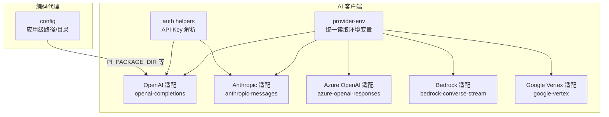
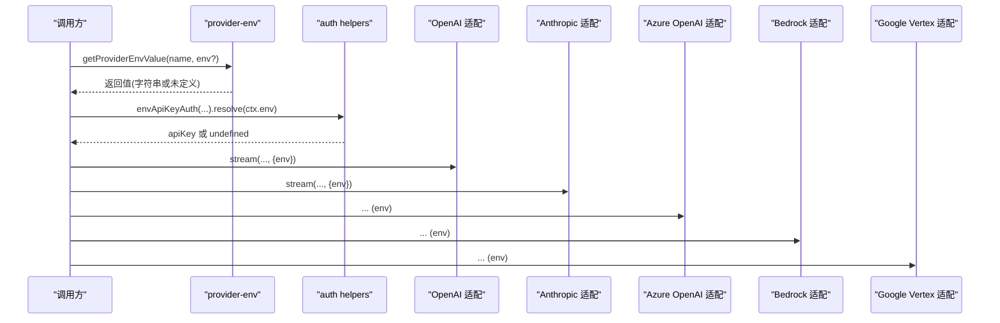
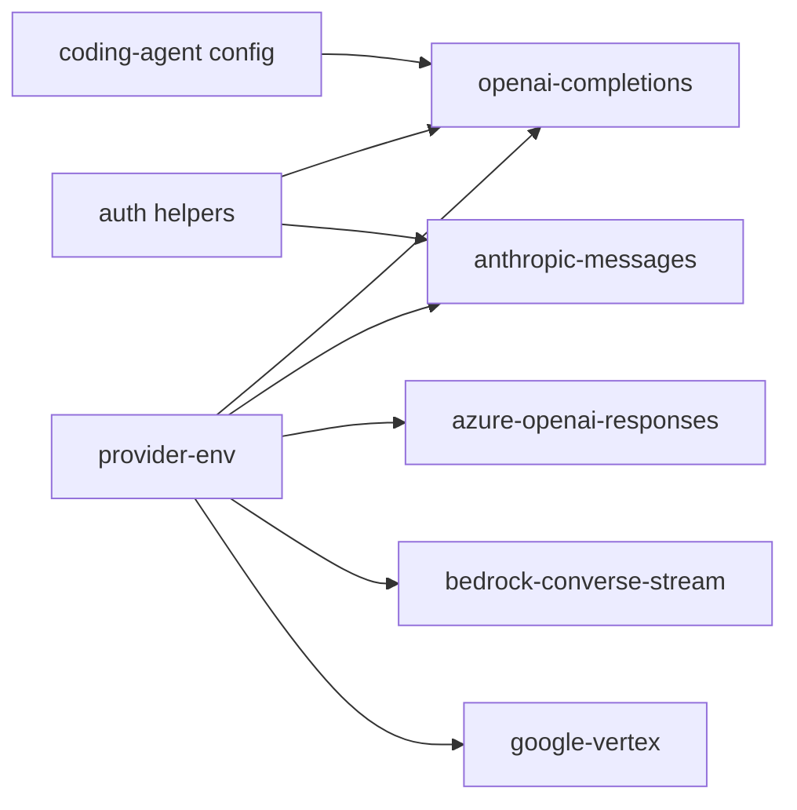

# 环境变量配置

<cite>
**本文引用的文件**
- [packages/ai/src/utils/provider-env.ts](file://packages/ai/src/utils/provider-env.ts)
- [packages/ai/src/auth/helpers.ts](file://packages/ai/src/auth/helpers.ts)
- [packages/ai/src/providers/moonshotai-cn.ts](file://packages/ai/src/providers/moonshotai-cn.ts)
- [packages/ai/src/api/openai-completions.ts](file://packages/ai/src/api/openai-completions.ts)
- [packages/ai/src/api/anthropic-messages.ts](file://packages/ai/src/api/anthropic-messages.ts)
- [packages/ai/src/api/azure-openai-responses.ts](file://packages/ai/src/api/azure-openai-responses.ts)
- [packages/ai/src/api/bedrock-converse-stream.ts](file://packages/ai/src/api/bedrock-converse-stream.ts)
- [packages/ai/src/api/google-vertex.ts](file://packages/ai/src/api/google-vertex.ts)
- [packages/coding-agent/src/config.ts](file://packages/coding-agent/src/config.ts)
</cite>

## 目录
1. [简介](#简介)
2. [项目结构](#项目结构)
3. [核心组件](#核心组件)
4. [架构总览](#架构总览)
5. [详细组件分析](#详细组件分析)
6. [依赖关系分析](#依赖关系分析)
7. [性能与可靠性考虑](#性能与可靠性考虑)
8. [故障排查指南](#故障排查指南)
9. [结论](#结论)
10. [附录：各环境配置示例](#附录各环境配置示例)

## 简介
本文件系统化梳理本项目支持的环境变量，覆盖 API 密钥、代理行为、缓存与重试、云厂商集成、沙箱与路径等。重点说明每个变量的作用、默认值、数据类型与取值范围；解释加载优先级与覆盖机制；提供开发、测试、生产环境的配置建议与安全注意事项。

## 项目结构
- AI 客户端层（packages/ai）：统一封装多家模型提供商的调用逻辑，集中读取并解析环境变量，负责鉴权、重试、缓存策略等。
- 编码代理层（packages/coding-agent）：提供应用级配置与路径解析，部分行为可通过环境变量覆盖（如包根目录、会话目录等）。
- 工具函数（packages/ai/src/utils）：提供跨运行时兼容的环境变量读取能力，确保在 Bun 沙箱等特殊环境下仍可正确获取环境变量。

图表来源
- [packages/ai/src/utils/provider-env.ts:1-53](file://packages/ai/src/utils/provider-env.ts#L1-L53)
- [packages/ai/src/auth/helpers.ts:1-60](file://packages/ai/src/auth/helpers.ts#L1-L60)
- [packages/ai/src/api/openai-completions.ts:1-800](file://packages/ai/src/api/openai-completions.ts#L1-L800)
- [packages/ai/src/api/anthropic-messages.ts:1-800](file://packages/ai/src/api/anthropic-messages.ts#L1-L800)
- [packages/ai/src/api/azure-openai-responses.ts:1-250](file://packages/ai/src/api/azure-openai-responses.ts#L1-L250)
- [packages/ai/src/api/bedrock-converse-stream.ts:1-250](file://packages/ai/src/api/bedrock-converse-stream.ts#L1-L250)
- [packages/ai/src/api/google-vertex.ts:1-450](file://packages/ai/src/api/google-vertex.ts#L1-L450)
- [packages/coding-agent/src/config.ts:360-567](file://packages/coding-agent/src/config.ts#L360-L567)

章节来源
- [packages/ai/src/utils/provider-env.ts:1-53](file://packages/ai/src/utils/provider-env.ts#L1-L53)
- [packages/coding-agent/src/config.ts:360-567](file://packages/coding-agent/src/config.ts#L360-L567)

## 核心组件
- 环境变量读取器：提供统一的 getProviderEnvValue，优先使用传入的 ProviderEnv 作用域，其次回退到 process.env，再回退到 Bun 沙箱专用读取路径。
- 鉴权助手：envApiKeyAuth 支持从“存储凭证”或“环境变量列表”中按顺序解析 API Key，未找到时提示登录输入。
- 提供商适配层：各提供商适配器通过 getProviderEnvValue 读取各自所需的环境变量，实现差异化配置。

章节来源
- [packages/ai/src/utils/provider-env.ts:1-53](file://packages/ai/src/utils/provider-env.ts#L1-L53)
- [packages/ai/src/auth/helpers.ts:1-60](file://packages/ai/src/auth/helpers.ts#L1-L60)

## 架构总览
下图展示环境变量在请求链路中的位置与作用点：从调用方传入 ProviderEnv，到 provider-env 统一读取，再到各提供商适配器进行鉴权与参数组装。

图表来源
- [packages/ai/src/utils/provider-env.ts:1-53](file://packages/ai/src/utils/provider-env.ts#L1-L53)
- [packages/ai/src/auth/helpers.ts:1-60](file://packages/ai/src/auth/helpers.ts#L1-L60)
- [packages/ai/src/api/openai-completions.ts:1-800](file://packages/ai/src/api/openai-completions.ts#L1-L800)
- [packages/ai/src/api/anthropic-messages.ts:1-800](file://packages/ai/src/api/anthropic-messages.ts#L1-L800)
- [packages/ai/src/api/azure-openai-responses.ts:1-250](file://packages/ai/src/api/azure-openai-responses.ts#L1-L250)
- [packages/ai/src/api/bedrock-converse-stream.ts:1-250](file://packages/ai/src/api/bedrock-converse-stream.ts#L1-L250)
- [packages/ai/src/api/google-vertex.ts:1-450](file://packages/ai/src/api/google-vertex.ts#L1-L450)

## 详细组件分析

### 环境变量读取与优先级（provider-env）
- 读取顺序：
  1) 显式传入的 ProviderEnv[name]（最高优先级）
  2) process.env[name]
  3) Bun 沙箱下从 /proc/self/environ 恢复的值（仅当 process.env 为空且运行于 Bun 时）
- 适用场景：所有提供商适配器均通过该函数读取环境变量，保证一致性与可测试性。

章节来源
- [packages/ai/src/utils/provider-env.ts:1-53](file://packages/ai/src/utils/provider-env.ts#L1-L53)

### API 密钥与环境变量（鉴权）
- 通用模式：envApiKeyAuth 接受一组环境变量名，按顺序查找非空值作为 API Key；若均未设置，则进入交互式登录流程。
- 示例：Moonshot CN 提供商通过 ["MOONSHOT_API_KEY"] 读取密钥。
- 注意：OpenAI/Anthropic 等适配器内部也会校验是否提供了 apiKey 或必要的授权头，缺失时会抛出错误。

章节来源
- [packages/ai/src/auth/helpers.ts:1-60](file://packages/ai/src/auth/helpers.ts#L1-L60)
- [packages/ai/src/providers/moonshotai-cn.ts:1-15](file://packages/ai/src/providers/moonshotai-cn.ts#L1-L15)
- [packages/ai/src/api/openai-completions.ts:72-76](file://packages/ai/src/api/openai-completions.ts#L72-L76)
- [packages/ai/src/api/anthropic-messages.ts:283-293](file://packages/ai/src/api/anthropic-messages.ts#L283-L293)

### OpenAI 兼容适配器（openai-completions）
- 关键环境变量：
  - PI_CACHE_RETENTION：控制缓存保留策略，取值为 "short"（默认）、"long"（长保留），用于开启更长的提示词缓存。
- 行为：
  - 当 PI_CACHE_RETENTION=long 且模型支持时，会启用更长 TTL 的缓存。
  - 请求失败时由上层重试包装处理，适配器自身不主动重试。

章节来源
- [packages/ai/src/api/openai-completions.ts:190-198](file://packages/ai/src/api/openai-completions.ts#L190-L198)

### Anthropic 适配器（anthropic-messages）
- 关键环境变量：
  - PI_CACHE_RETENTION：同上，控制缓存保留策略。
- 行为：
  - 当 PI_CACHE_RETENTION=long 且模型支持时，启用 1 小时临时缓存。
  - 缺少 API Key 或必要授权头时，会抛出明确错误。

章节来源
- [packages/ai/src/api/anthropic-messages.ts:45-57](file://packages/ai/src/api/anthropic-messages.ts#L45-L57)
- [packages/ai/src/api/anthropic-messages.ts:283-293](file://packages/ai/src/api/anthropic-messages.ts#L283-L293)

### Azure OpenAI 适配器（azure-openai-responses）
- 关键环境变量：
  - AZURE_OPENAI_BASE_URL：自定义基础 URL。
  - AZURE_OPENAI_RESOURCE_NAME：资源名称。
  - AZURE_OPENAI_DEPLOYMENT_NAME_MAP：部署名映射。
  - AZURE_OPENAI_API_VERSION：API 版本，未设置时使用内置默认值。
- 行为：
  - 通过 getProviderEnvValue 读取，允许以 ProviderEnv 覆盖。

章节来源
- [packages/ai/src/api/azure-openai-responses.ts:220-230](file://packages/ai/src/api/azure-openai-responses.ts#L220-L230)

### Bedrock 适配器（bedrock-converse-stream）
- 关键环境变量：
  - AWS_PROFILE：AWS 配置文件名。
  - AWS_BEDROCK_SKIP_AUTH：跳过认证（调试用，谨慎使用）。
  - AWS_BEARER_TOKEN_BEDROCK：Bearer Token。
  - AWS_BEDROCK_FORCE_HTTP1：强制 HTTP/1.1。
  - AWS_REGION / AWS_DEFAULT_REGION：区域。
  - AWS_ACCESS_KEY_ID / AWS_SECRET_ACCESS_KEY / AWS_SESSION_TOKEN：访问凭据。
  - PI_CACHE_RETENTION：缓存策略。
  - AWS_BEDROCK_FORCE_CACHE：强制缓存开关。
- 行为：
  - 根据环境变量组合选择认证方式与网络行为。
  - 对缓存策略与区域进行条件化生效。

章节来源
- [packages/ai/src/api/bedrock-converse-stream.ts:140-170](file://packages/ai/src/api/bedrock-converse-stream.ts#L140-L170)
- [packages/ai/src/api/bedrock-converse-stream.ts:200-210](file://packages/ai/src/api/bedrock-converse-stream.ts#L200-L210)
- [packages/ai/src/api/bedrock-converse-stream.ts:695-750](file://packages/ai/src/api/bedrock-converse-stream.ts#L695-L750)
- [packages/ai/src/api/bedrock-converse-stream.ts:1035-1055](file://packages/ai/src/api/bedrock-converse-stream.ts#L1035-L1055)

### Google Vertex 适配器（google-vertex）
- 关键环境变量：
  - GOOGLE_APPLICATION_CREDENTIALS：服务账号凭据文件路径。
  - GOOGLE_CLOUD_PROJECT / GCLOUD_PROJECT：项目 ID。
  - GOOGLE_CLOUD_LOCATION：区域。
- 行为：
  - 通过环境变量定位凭据与项目上下文，完成初始化。

章节来源
- [packages/ai/src/api/google-vertex.ts:410-450](file://packages/ai/src/api/google-vertex.ts#L410-L450)

### 编码代理应用级环境变量（coding-agent/config）
- 关键环境变量：
  - PI_PACKAGE_DIR：覆盖包根目录（便于 Nix/Guix 等不可写路径场景）。
  - PI_SHARE_VIEWER_URL：分享查看器基地址。
  - APP_NAME 派生的目录环境变量：如 PI_CODING_AGENT_DIR、PI_CODING_AGENT_SESSION_DIR（由代码动态拼接）。
- 行为：
  - 若设置了 PI_PACKAGE_DIR，将直接使用该路径解析资源。
  - 其他路径类函数基于应用名派生环境变量，便于在不同部署环境中隔离数据。

章节来源
- [packages/coding-agent/src/config.ts:360-388](file://packages/coding-agent/src/config.ts#L360-L388)
- [packages/coding-agent/src/config.ts:502-508](file://packages/coding-agent/src/config.ts#L502-L508)
- [packages/coding-agent/src/config.ts:494-567](file://packages/coding-agent/src/config.ts#L494-L567)

## 依赖关系分析
- 所有提供商适配器依赖 provider-env 的统一读取能力，确保在 Node/Bun 等不同运行时下行为一致。
- 鉴权模块为多个提供商提供通用的 API Key 解析流程，减少重复逻辑。
- 编码代理的路径相关功能独立于 AI 客户端，但同样受环境变量影响。

图表来源
- [packages/ai/src/utils/provider-env.ts:1-53](file://packages/ai/src/utils/provider-env.ts#L1-L53)
- [packages/ai/src/auth/helpers.ts:1-60](file://packages/ai/src/auth/helpers.ts#L1-L60)
- [packages/ai/src/api/openai-completions.ts:1-800](file://packages/ai/src/api/openai-completions.ts#L1-L800)
- [packages/ai/src/api/anthropic-messages.ts:1-800](file://packages/ai/src/api/anthropic-messages.ts#L1-L800)
- [packages/ai/src/api/azure-openai-responses.ts:1-250](file://packages/ai/src/api/azure-openai-responses.ts#L1-L250)
- [packages/ai/src/api/bedrock-converse-stream.ts:1-250](file://packages/ai/src/api/bedrock-converse-stream.ts#L1-L250)
- [packages/ai/src/api/google-vertex.ts:1-450](file://packages/ai/src/api/google-vertex.ts#L1-L450)
- [packages/coding-agent/src/config.ts:360-567](file://packages/coding-agent/src/config.ts#L360-L567)

## 性能与可靠性考虑
- 缓存策略：通过 PI_CACHE_RETENTION 控制缓存保留时长，合理设置可降低延迟与成本。
- 重试机制：适配器本身不主动重试，交由上层 retryProviderRequest 统一管理，避免重复计费与幂等问题。
- 网络协议：Bedrock 支持强制 HTTP/1.1，可在特定网络环境下提升稳定性。
- 沙箱兼容：Bun 沙箱下通过 /proc/self/environ 恢复环境变量，确保在受限环境中仍可读取配置。

[本节为通用指导，不直接分析具体文件]

## 故障排查指南
- 缺少 API Key：
  - 现象：抛出“无 API Key”的错误。
  - 排查：确认已设置对应提供商的环境变量或通过存储凭证注入；检查 ProviderEnv 是否正确传递。
  - 参考：OpenAI/Anthropic 适配器中的鉴权校验逻辑。
- 缓存未生效：
  - 现象：未获得预期缓存收益。
  - 排查：确认 PI_CACHE_RETENTION 设置为 "long"，且模型支持长缓存；检查 sessionId 是否稳定。
- Bedrock 认证失败：
  - 现象：无法连接或鉴权失败。
  - 排查：核对 AWS_* 系列环境变量；必要时启用 AWS_BEDROCK_SKIP_AUTH 进行本地验证（仅限调试）。
- Bun 沙箱环境变量为空：
  - 现象：process.env 为空导致配置丢失。
  - 排查：确认运行环境为 Bun 且启用了沙箱；系统会通过 /proc/self/environ 自动恢复。

章节来源
- [packages/ai/src/api/openai-completions.ts:72-76](file://packages/ai/src/api/openai-completions.ts#L72-L76)
- [packages/ai/src/api/anthropic-messages.ts:283-293](file://packages/ai/src/api/anthropic-messages.ts#L283-L293)
- [packages/ai/src/api/bedrock-converse-stream.ts:140-170](file://packages/ai/src/api/bedrock-converse-stream.ts#L140-L170)
- [packages/ai/src/utils/provider-env.ts:1-53](file://packages/ai/src/utils/provider-env.ts#L1-L53)

## 结论
本项目通过统一的 provider-env 抽象与标准化的鉴权流程，实现了多提供商的一致化环境变量管理。推荐在生产环境严格限定最小权限的环境变量集，结合缓存与重试策略优化性能与稳定性。对于特殊运行环境（如 Bun 沙箱），系统已内置兼容方案，但仍需关注安全边界与日志脱敏。

[本节为总结性内容，不直接分析具体文件]

## 附录：各环境配置示例
以下为不同环境的典型环境变量配置建议（示例形式，实际值请替换为真实值）：

- 开发环境
  - OPENAI_API_KEY="sk-..."
  - ANTHROPIC_API_KEY="sk-ant-..."
  - MOONSHOT_API_KEY="ms-..."
  - PI_CACHE_RETENTION="short"
  - AZURE_OPENAI_BASE_URL="https://.../openai/deployments/.../chat/completions?api-version=..."
  - AZURE_OPENAI_RESOURCE_NAME="my-resource"
  - AZURE_OPENAI_API_VERSION="v1"
  - AWS_PROFILE="dev"
  - GOOGLE_APPLICATION_CREDENTIALS="./service-account.json"
  - GOOGLE_CLOUD_PROJECT="dev-project"
  - PI_PACKAGE_DIR="/path/to/dev/package"

- 测试环境
  - OPENAI_API_KEY="${TEST_OPENAI_API_KEY}"
  - ANTHROPIC_API_KEY="${TEST_ANTHROPIC_API_KEY}"
  - PI_CACHE_RETENTION="short"
  - AWS_BEDROCK_SKIP_AUTH="1"（仅测试）
  - GOOGLE_CLOUD_PROJECT="test-project"

- 生产环境
  - OPENAI_API_KEY="${PROD_OPENAI_API_KEY}"
  - ANTHROPIC_API_KEY="${PROD_ANTHROPIC_API_KEY}"
  - MOONSHOT_API_KEY="${PROD_MOONSHOT_API_KEY}"
  - PI_CACHE_RETENTION="long"
  - AZURE_OPENAI_BASE_URL="${PROD_AZURE_BASE_URL}"
  - AZURE_OPENAI_RESOURCE_NAME="${PROD_AZURE_RESOURCE}"
  - AZURE_OPENAI_API_VERSION="v1"
  - AWS_PROFILE="prod"
  - AWS_REGION="us-east-1"
  - GOOGLE_APPLICATION_CREDENTIALS="/run/secrets/gcp-sa.json"
  - GOOGLE_CLOUD_PROJECT="prod-project"
  - PI_PACKAGE_DIR="/opt/pi/package"

安全注意事项
- 不要将密钥写入代码仓库；使用环境变量或密钥管理服务注入。
- 生产环境禁用 AWS_BEDROCK_SKIP_AUTH。
- 限制 PI_PACKAGE_DIR 指向只读、最小权限路径。
- 对日志中的敏感字段进行脱敏处理。

[本节为通用指导，不直接分析具体文件]