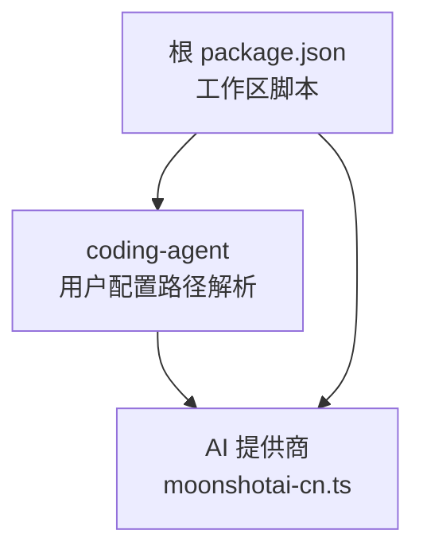
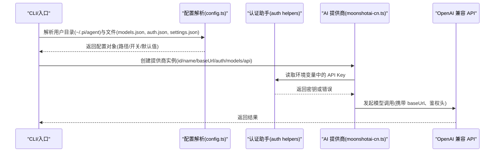
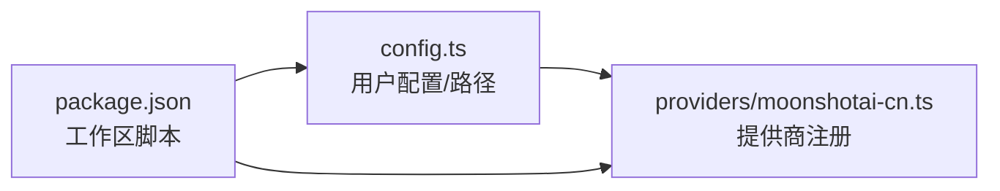

# 配置参考

<cite>
**本文引用的文件**
- [packages/coding-agent/src/config.ts](file://packages/coding-agent/src/config.ts)
- [packages/ai/src/providers/moonshotai-cn.ts](file://packages/ai/src/providers/moonshotai-cn.ts)
- [package.json](file://package.json)
</cite>

## 目录
1. [简介](#简介)
2. [项目结构](#项目结构)
3. [核心组件](#核心组件)
4. [架构总览](#架构总览)
5. [详细组件分析](#详细组件分析)
6. [依赖关系分析](#依赖关系分析)
7. [性能考虑](#性能考虑)
8. [故障排查指南](#故障排查指南)
9. [结论](#结论)
10. [附录](#附录)

## 简介
本配置参考文档面向开发者与运维人员，系统化说明本仓库中 AI 代理与编码代理的配置方式。内容覆盖：
- 环境变量、JSON/YAML 配置文件、命令行参数的作用域与优先级
- AI 提供商配置（API Key、模型选择、端点、认证）
- 代理行为配置（工具启用/禁用、超时、重试、缓存）
- 安全与权限（文件访问控制、网络限制、沙箱）
- 不同环境（开发、测试、生产）的配置示例
- 配置验证与默认值、继承机制
- 配置模板与最佳实践

注意：本文所有实现细节均基于仓库源码进行分析与归纳，未包含的代码将不在此处展开。

## 项目结构
本项目采用多包 monorepo 组织，关键与配置相关的代码集中在以下位置：
- packages/coding-agent：编码代理主逻辑与用户配置路径解析
- packages/ai：AI 提供商抽象与具体提供商实现（如 Moonshot AI CN）
- package.json：工作区脚本与构建流程（非运行时配置）

图表来源
- [packages/coding-agent/src/config.ts:467-566](file://packages/coding-agent/src/config.ts#L467-L566)
- [packages/ai/src/providers/moonshotai-cn.ts:1-15](file://packages/ai/src/providers/moonshotai-cn.ts#L1-L15)
- [package.json:14-49](file://package.json#L14-L49)

章节来源
- [package.json:1-75](file://package.json#L1-L75)
- [packages/coding-agent/src/config.ts:467-566](file://packages/coding-agent/src/config.ts#L467-L566)
- [packages/ai/src/providers/moonshotai-cn.ts:1-15](file://packages/ai/src/providers/moonshotai-cn.ts#L1-L15)

## 核心组件
- 用户配置目录与文件定位：通过应用名派生环境变量前缀，解析 ~/.pi/agent 下的 models.json、auth.json、settings.json、tools、prompts、sessions 等路径。
- 包资源路径：支持 Bun 二进制与 Node.js 两种运行模式，自动定位主题、HTML 导出模板、交互资源等。
- 安装方式检测与自更新指令：根据执行路径与包管理器（npm/pnpm/yarn/bun）推断安装方式并生成自更新命令。
- AI 提供商注册：以 createProvider 形式声明 id、name、baseUrl、auth、models、api 等字段，并通过 envApiKeyAuth 从环境变量读取 API Key。

章节来源
- [packages/coding-agent/src/config.ts:15-94](file://packages/coding-agent/src/config.ts#L15-L94)
- [packages/coding-agent/src/config.ts:357-464](file://packages/coding-agent/src/config.ts#L357-L464)
- [packages/coding-agent/src/config.ts:467-566](file://packages/coding-agent/src/config.ts#L467-L566)
- [packages/ai/src/providers/moonshotai-cn.ts:1-15](file://packages/ai/src/providers/moonshotai-cn.ts#L1-L15)

## 架构总览
下图展示了“配置加载与使用”的关键流程：应用启动时解析用户配置目录与文件，AI 模块按提供商定义加载认证与模型信息，最终在调用时组合为请求。

图表来源
- [packages/coding-agent/src/config.ts:514-566](file://packages/coding-agent/src/config.ts#L514-L566)
- [packages/ai/src/providers/moonshotai-cn.ts:1-15](file://packages/ai/src/providers/moonshotai-cn.ts#L1-L15)

## 详细组件分析

### 用户配置目录与文件
- 目录定位
  - 通过 APP_NAME 派生环境变量前缀，例如 PI_CODING_AGENT_DIR、PI_CODING_AGENT_SESSION_DIR。
  - 默认用户目录为 ~/.pi/agent；可通过环境变量覆盖。
- 关键文件
  - models.json：模型清单与选择
  - auth.json：认证凭据存储
  - settings.json：通用设置
  - tools：工具扩展目录
  - prompts：提示词模板
  - sessions：会话数据
  - bin：受管二进制（如 fd、rg）
- 其他路径
  - 调试日志、自定义主题、共享查看器 URL 等由配置模块提供。

章节来源
- [packages/coding-agent/src/config.ts:467-566](file://packages/coding-agent/src/config.ts#L467-L566)

### AI 提供商配置（以 Moonshot AI CN 为例）
- 提供商字段
  - id：唯一标识
  - name：显示名称
  - baseUrl：API 基础地址
  - auth：认证方式，当前通过环境变量注入 API Key
  - models：可用模型集合
  - api：底层 API 适配（此处为 OpenAI 兼容）
- 认证方式
  - 通过 envApiKeyAuth 从指定环境变量读取密钥（例如 Moonshot 的专用变量）。
- 模型选择
  - 通过 models 列表暴露可用模型，供上层选择。

章节来源
- [packages/ai/src/providers/moonshotai-cn.ts:1-15](file://packages/ai/src/providers/moonshotai-cn.ts#L1-L15)

### 包资源与运行模式
- 包根目录探测
  - 支持 Bun 二进制与 Node.js 两种模式，自动定位 package.json、主题、HTML 导出模板、交互资源等。
- 可覆盖项
  - 通过 PI_PACKAGE_DIR 环境变量覆盖包根目录，便于 Nix/Guix 等场景。

章节来源
- [packages/coding-agent/src/config.ts:357-464](file://packages/coding-agent/src/config.ts#L357-L464)

### 安装方式检测与自更新
- 安装方式检测
  - 根据执行路径与包管理器特征识别 npm/pnpm/yarn/bun/binary/unknown。
- 自更新指令生成
  - 针对不同包管理器生成合适的安装/卸载命令，并在不可写或未知安装方式时给出友好提示。
- 校验与回退
  - 若安装目录不可写或无法识别，则不提供自更新命令，仅输出指导信息。

章节来源
- [packages/coding-agent/src/config.ts:15-94](file://packages/coding-agent/src/config.ts#L15-L94)
- [packages/coding-agent/src/config.ts:315-355](file://packages/coding-agent/src/config.ts#L315-L355)

## 依赖关系分析
- coding-agent 负责用户配置路径与资源定位，向上层提供统一接口。
- ai 模块通过 createProvider 注册各提供商，依赖认证助手与环境变量注入。
- 根 package.json 管理工作区脚本与构建流程，不直接参与运行时配置。

图表来源
- [packages/coding-agent/src/config.ts:467-566](file://packages/coding-agent/src/config.ts#L467-L566)
- [packages/ai/src/providers/moonshotai-cn.ts:1-15](file://packages/ai/src/providers/moonshotai-cn.ts#L1-L15)
- [package.json:14-49](file://package.json#L14-L49)

章节来源
- [package.json:1-75](file://package.json#L1-L75)
- [packages/coding-agent/src/config.ts:467-566](file://packages/coding-agent/src/config.ts#L467-L566)
- [packages/ai/src/providers/moonshotai-cn.ts:1-15](file://packages/ai/src/providers/moonshotai-cn.ts#L1-L15)

## 性能考虑
- 配置加载
  - 用户配置目录与文件仅在需要时解析，避免不必要的 I/O。
- 包资源定位
  - 通过路径探测与缓存策略减少重复计算。
- 自更新检测
  - 仅在必要时执行包管理器命令，失败时快速回退到提示信息。

[本节为通用建议，不直接分析具体文件]

## 故障排查指南
- 无法找到用户配置目录
  - 检查是否设置了 PI_CODING_AGENT_DIR 或 PI_CODING_AGENT_SESSION_DIR。
  - 确认 ~/.pi/agent 是否存在且可读。
- 提供商认证失败
  - 确认对应环境变量已正确设置（例如 Moonshot 的 API Key 变量）。
  - 检查 baseUrl 与模型列表是否与提供商匹配。
- 自更新不可用
  - 当安装目录不可写或安装方式未知时，不会生成自更新命令，需手动更新。
  - 根据提示使用对应包管理器进行更新。

章节来源
- [packages/coding-agent/src/config.ts:315-355](file://packages/coding-agent/src/config.ts#L315-L355)
- [packages/ai/src/providers/moonshotai-cn.ts:1-15](file://packages/ai/src/providers/moonshotai-cn.ts#L1-L15)

## 结论
本仓库通过清晰的配置模块与提供商抽象，实现了灵活的 AI 能力接入与用户级配置管理。推荐在生产环境中：
- 使用环境变量集中管理敏感信息（如 API Key）
- 通过用户配置目录维护模型与工具集
- 结合包管理器与自更新机制保持版本一致

[本节为总结性内容，不直接分析具体文件]

## 附录

### 环境变量配置
- 包根目录覆盖
  - PI_PACKAGE_DIR：覆盖包根目录，便于特殊打包环境。
- 用户目录
  - PI_CODING_AGENT_DIR：覆盖用户配置目录（默认 ~/.pi/agent）。
  - PI_CODING_AGENT_SESSION_DIR：覆盖会话目录。
- 分享查看器
  - PI_SHARE_VIEWER_URL：自定义分享查看器基址。
- 提供商密钥
  - 各提供商通过各自的环境变量注入 API Key（例如 Moonshot 的专用变量）。

章节来源
- [packages/coding-agent/src/config.ts:357-464](file://packages/coding-agent/src/config.ts#L357-L464)
- [packages/coding-agent/src/config.ts:467-566](file://packages/coding-agent/src/config.ts#L467-L566)
- [packages/ai/src/providers/moonshotai-cn.ts:1-15](file://packages/ai/src/providers/moonshotai-cn.ts#L1-L15)

### JSON/YAML 配置文件
- 用户配置目录（~/.pi/agent）
  - models.json：模型清单与选择
  - auth.json：认证凭据存储
  - settings.json：通用设置
  - tools：工具扩展目录
  - prompts：提示词模板
  - sessions：会话数据
  - bin：受管二进制（如 fd、rg）

章节来源
- [packages/coding-agent/src/config.ts:514-566](file://packages/coding-agent/src/config.ts#L514-L566)

### 命令行参数
- 自更新相关
  - 通过包管理器命令完成更新（npm/pnpm/yarn/bun），具体命令由安装方式检测生成。
- 其他参数
  - 当前源码未展示更多 CLI 参数；如需扩展，可在入口层添加。

章节来源
- [packages/coding-agent/src/config.ts:315-355](file://packages/coding-agent/src/config.ts#L315-L355)

### AI 提供商配置选项
- 字段说明
  - id：提供商唯一标识
  - name：显示名称
  - baseUrl：API 基础地址
  - auth：认证方式（当前通过环境变量注入 API Key）
  - models：可用模型集合
  - api：底层 API 适配（如 OpenAI 兼容）
- 认证方式
  - 通过 envApiKeyAuth 从环境变量读取密钥。

章节来源
- [packages/ai/src/providers/moonshotai-cn.ts:1-15](file://packages/ai/src/providers/moonshotai-cn.ts#L1-L15)

### 代理行为配置
- 工具启用/禁用
  - 通过 tools 目录扩展工具；settings.json 可用于开关控制（具体键名由上层实现决定）。
- 超时与重试
  - 未在源码中显式暴露；建议在调用层或中间件层实现。
- 缓存
  - 未在源码中显式暴露；建议在调用层或中间件层实现。

[本节为通用建议，不直接分析具体文件]

### 安全与权限
- 文件访问控制
  - 用户配置目录位于 ~/.pi/agent，建议限制目录权限。
- 网络限制
  - 通过 baseUrl 与防火墙策略控制对外访问。
- 沙箱
  - 未在源码中显式暴露；可在执行工具时引入沙箱机制。

[本节为通用建议，不直接分析具体文件]

### 不同使用场景的配置示例
- 开发环境
  - 使用本地或测试提供商 baseUrl，开启更详细的日志。
  - 通过 PI_PACKAGE_DIR 指向开发包根。
- 测试环境
  - 固定模型与提供商，关闭非必要工具，限制网络访问。
- 生产环境
  - 使用稳定提供商与模型，严格限制权限与网络，启用审计日志。

[本节为通用建议，不直接分析具体文件]

### 配置验证与默认值
- 默认值
  - 用户目录默认 ~/.pi/agent；分享查看器默认 https://pi.dev/session/。
- 验证
  - 包根目录探测失败时会回退到 __dirname；自更新不可用时给出提示。

章节来源
- [packages/coding-agent/src/config.ts:357-464](file://packages/coding-agent/src/config.ts#L357-L464)
- [packages/coding-agent/src/config.ts:502-508](file://packages/coding-agent/src/config.ts#L502-L508)
- [packages/coding-agent/src/config.ts:315-355](file://packages/coding-agent/src/config.ts#L315-L355)

### 配置优先级与继承机制
- 优先级
  - 环境变量 > 用户配置目录（~/.pi/agent）> 内置默认值。
- 继承
  - 包资源路径在不同运行模式下自动适配；用户配置可覆盖默认行为。

章节来源
- [packages/coding-agent/src/config.ts:357-464](file://packages/coding-agent/src/config.ts#L357-L464)
- [packages/coding-agent/src/config.ts:467-566](file://packages/coding-agent/src/config.ts#L467-L566)

### 配置模板与最佳实践
- 模板
  - 在 ~/.pi/agent 下维护 models.json、auth.json、settings.json 的最小可用集合。
- 最佳实践
  - 敏感信息使用环境变量管理；定期轮换密钥；限制目录与文件权限；锁定模型与提供商版本。

[本节为通用建议，不直接分析具体文件]