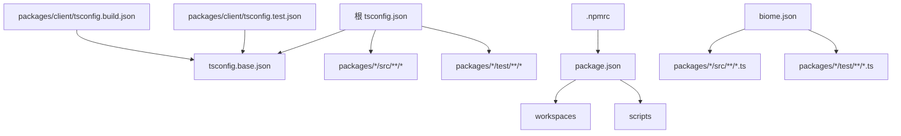
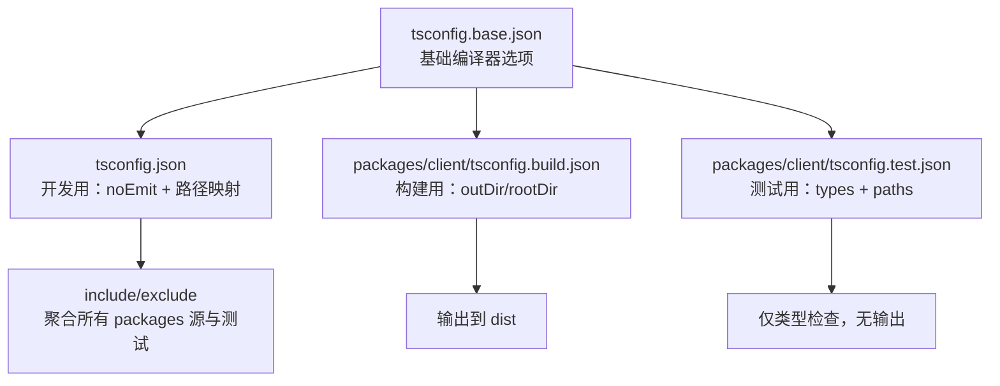

# 配置文件格式

<cite>
**本文引用的文件**
- [tsconfig.json](file://tsconfig.json)
- [tsconfig.base.json](file://tsconfig.base.json)
- [.npmrc](file://.npmrc)
- [biome.json](file://biome.json)
- [package.json](file://package.json)
- [packages/client/tsconfig.build.json](file://packages/client/tsconfig.build.json)
- [packages/client/tsconfig.test.json](file://packages/client/tsconfig.test.json)
</cite>

## 目录
1. [简介](#简介)
2. [项目结构](#项目结构)
3. [核心配置总览](#核心配置总览)
4. [架构与继承关系](#架构与继承关系)
5. [详细组件分析](#详细组件分析)
6. [依赖与合并策略](#依赖与合并策略)
7. [性能与可维护性建议](#性能与可维护性建议)
8. [故障排查指南](#故障排查指南)
9. [结论](#结论)
10. [附录：模板与示例](#附录模板与示例)

## 简介
本参考文档面向本仓库的配置文件体系，覆盖 TypeScript 编译配置（tsconfig.*）、NPM 工作区与脚本（package.json、.npmrc）、代码质量与格式化（biome.json）。文档将说明各配置文件的职责、关键选项、继承与合并规则、如何为不同环境创建独立配置，以及常见问题的定位方法。

## 项目结构
本项目采用 monorepo 结构，根目录集中管理全局构建与质量工具配置，子包各自维护自身的 package.json 与可选的 tsconfig 变体（如 build/test）。

图表来源
- [tsconfig.json:1-41](file://tsconfig.json#L1-L41)
- [tsconfig.base.json:1-26](file://tsconfig.base.json#L1-L26)
- [packages/client/tsconfig.build.json:1-13](file://packages/client/tsconfig.build.json#L1-L13)
- [packages/client/tsconfig.test.json:1-14](file://packages/client/tsconfig.test.json#L1-L14)
- [package.json:1-75](file://package.json#L1-L75)
- [.npmrc:1-3](file://.npmrc#L1-L3)
- [biome.json:1-42](file://biome.json#L1-L42)

章节来源
- [tsconfig.json:1-41](file://tsconfig.json#L1-L41)
- [package.json:1-75](file://package.json#L1-L75)
- [.npmrc:1-3](file://.npmrc#L1-L3)
- [biome.json:1-42](file://biome.json#L1-L42)

## 核心配置总览
- TypeScript 配置
  - 根级 tsconfig.json：用于开发时类型检查与路径映射，不生成输出；通过 extends 继承基础配置。
  - tsconfig.base.json：统一编译器目标、模块解析、严格模式、声明与源码映射等基础选项。
  - 子包 tsconfig.*：按场景拆分（如构建、测试），分别继承 base 并覆盖特定选项。
- NPM 配置
  - package.json：定义 workspaces、脚本、依赖、引擎版本、overrides 等。
  - .npmrc：设置安装行为（如精确保存版本、最小发布年龄限制）。
- 代码质量与格式化
  - biome.json：启用 linter/formatter，定义规则集、缩进/行宽、文件包含与排除。

章节来源
- [tsconfig.base.json:1-26](file://tsconfig.base.json#L1-L26)
- [tsconfig.json:1-41](file://tsconfig.json#L1-L41)
- [packages/client/tsconfig.build.json:1-13](file://packages/client/tsconfig.build.json#L1-L13)
- [packages/client/tsconfig.test.json:1-14](file://packages/client/tsconfig.test.json#L1-L14)
- [package.json:1-75](file://package.json#L1-L75)
- [.npmrc:1-3](file://.npmrc#L1-L3)
- [biome.json:1-42](file://biome.json#L1-L42)

## 架构与继承关系
TypeScript 配置的继承链如下：

图表来源
- [tsconfig.base.json:1-26](file://tsconfig.base.json#L1-L26)
- [tsconfig.json:1-41](file://tsconfig.json#L1-L41)
- [packages/client/tsconfig.build.json:1-13](file://packages/client/tsconfig.build.json#L1-L13)
- [packages/client/tsconfig.test.json:1-14](file://packages/client/tsconfig.test.json#L1-L14)

章节来源
- [tsconfig.base.json:1-26](file://tsconfig.base.json#L1-L26)
- [tsconfig.json:1-41](file://tsconfig.json#L1-L41)
- [packages/client/tsconfig.build.json:1-13](file://packages/client/tsconfig.build.json#L1-L13)
- [packages/client/tsconfig.test.json:1-14](file://packages/client/tsconfig.test.json#L1-L14)

## 详细组件分析

### TypeScript 配置（tsconfig.*）
- tsconfig.base.json
  - 统一目标与模块：ES2022 目标，Node16 模块与解析策略，开启严格模式与多种兼容性开关。
  - 输出与调试：生成声明与映射，内联源码以便调试。
  - 类型与环境：引入 node 类型，允许 JSON 导入与 TS 扩展名导入。
- tsconfig.json（开发）
  - 继承 base 并覆盖为 noEmit，适合 IDE 与 CI 的类型检查。
  - 使用 module/moduleResolution 为 NodeNext，适配现代模块解析。
  - 通过 paths 将多个内部包别名指向源码，便于开发与测试直接引用。
  - include/exclude 聚合多包源码与测试目录，并排除无关产物。
- 子包 tsconfig.build.json / tsconfig.test.json
  - 构建配置：指定 outDir/rootDir，paths 指向已构建的 d.ts 以进行跨包类型检查。
  - 测试配置：noEmit，module 与 types 针对测试环境调整，paths 指向源码以支持热更新与断言。

章节来源
- [tsconfig.base.json:1-26](file://tsconfig.base.json#L1-L26)
- [tsconfig.json:1-41](file://tsconfig.json#L1-L41)
- [packages/client/tsconfig.build.json:1-13](file://packages/client/tsconfig.build.json#L1-L13)
- [packages/client/tsconfig.test.json:1-14](file://packages/client/tsconfig.test.json#L1-L14)

### NPM 配置（package.json 与 .npmrc）
- package.json
  - workspaces：声明 monorepo 子包范围，使 npm 命令在 workspace 间联动执行。
  - scripts：封装 clean/build/check/test/publish/version 等常用流程，部分脚本调用自定义 mjs 工具。
  - engines：约束 Node 版本下限。
  - overrides：对第三方依赖进行版本强制，确保一致性。
  - type：设置为 module，启用 ESM。
- .npmrc
  - save-exact=true：安装依赖时默认保存精确版本，避免隐式升级。
  - min-release-age=2：限制新发布的包的最小可用时间，降低风险。

章节来源
- [package.json:1-75](file://package.json#L1-L75)
- [.npmrc:1-3](file://.npmrc#L1-L3)

### 代码质量与格式化（biome.json）
- linter
  - 启用推荐规则集，并对 style/suspicious 下的若干规则进行细粒度调整。
- formatter
  - 启用格式化，设置 tab 缩进、宽度与行宽等。
- files
  - includes：限定处理范围至各包的 src/test 与 examples，排除 node_modules、模型生成文件等。

章节来源
- [biome.json:1-42](file://biome.json#L1-L42)

## 依赖与合并策略
- TypeScript 配置合并
  - 继承顺序：子配置 extends 父配置，后出现的同名选项会覆盖前者。
  - 典型覆盖点：
    - noEmit：开发配置关闭输出，构建配置开启输出目录。
    - module/moduleResolution：开发使用 NodeNext，构建使用 Node16。
    - types：测试配置追加 vitest 类型。
    - paths：开发指向源码，构建指向 dist 的 d.ts。
- NPM 工作区与脚本
  - 根 package.json 的 scripts 通过 --workspaces 或显式 --prefix 驱动子包任务。
  - .npmrc 影响全局安装行为，与 package.json 的 dependencies/devDependencies 共同决定锁定与版本策略。
- Biome 文件匹配
  - 通过 includes 控制参与 lint/format 的文件集合，避免对生成文件或无关目录进行处理。

章节来源
- [tsconfig.json:1-41](file://tsconfig.json#L1-L41)
- [packages/client/tsconfig.build.json:1-13](file://packages/client/tsconfig.build.json#L1-L13)
- [packages/client/tsconfig.test.json:1-14](file://packages/client/tsconfig.test.json#L1-L14)
- [package.json:1-75](file://package.json#L1-L75)
- [.npmrc:1-3](file://.npmrc#L1-L3)
- [biome.json:1-42](file://biome.json#L1-L42)

## 性能与可维护性建议
- 保持 tsconfig.base.json 作为唯一“事实源”，子包仅做最小化覆盖，减少重复。
- 使用 paths 指向源码提升开发体验，但构建时切换为指向 dist 的 d.ts，保证类型稳定。
- 在 package.json 中集中声明 engines 与 overrides，配合 .npmrc 的精确版本策略，降低依赖漂移风险。
- 将 lint/format 规则收敛于 biome.json，并通过 includes 精准限定范围，提高运行效率。

[本节为通用建议，不直接分析具体文件]

## 故障排查指南
- TypeScript 相关
  - 现象：IDE 提示找不到模块或路径错误。
    - 检查 tsconfig.json 的 paths 是否指向正确的源码或 d.ts。
    - 确认当前使用的 tsconfig（开发 vs 构建 vs 测试）是否正确加载。
  - 现象：构建时报模块解析不一致。
    - 核对 base 与子配置的 module/moduleResolution 是否冲突。
- NPM 相关
  - 现象：依赖版本不符合预期。
    - 检查 .npmrc 的 save-exact 与 package.json 的 overrides 是否生效。
    - 使用根脚本 check:pinned-deps 校验依赖锁定情况。
  - 现象：新包无法安装。
    - 受 min-release-age 限制，等待最小可用时间后再尝试。
- Biome 相关
  - 现象：某些文件未被格式化或报错。
    - 检查 biome.json 的 includes/excludes 是否遗漏或误排除了目标文件。
    - 根据 rules 中的具体规则调整或关闭不适用的规则。

章节来源
- [tsconfig.json:1-41](file://tsconfig.json#L1-L41)
- [packages/client/tsconfig.build.json:1-13](file://packages/client/tsconfig.build.json#L1-L13)
- [packages/client/tsconfig.test.json:1-14](file://packages/client/tsconfig.test.json#L1-L14)
- [package.json:1-75](file://package.json#L1-L75)
- [.npmrc:1-3](file://.npmrc#L1-L3)
- [biome.json:1-42](file://biome.json#L1-L42)

## 结论
本项目的配置文件体系围绕“基础统一、场景细分”的原则设计：base 提供一致的基础能力，根级 tsconfig 服务于开发体验，子包 tsconfig 按需定制构建与测试；NPM 通过 workspaces 与脚本串联多包流程，.npmrc 保障依赖稳定性；Biome 集中管控代码风格与质量。遵循本文的合并策略与排查指南，可在多包协作中保持高效与稳定。

[本节为总结性内容，不直接分析具体文件]

## 附录：模板与示例
以下提供基于本项目实际配置的“模板化”要点，便于在其他环境中复用。请结合本仓库的具体文件路径进行对照。

- TypeScript 配置模板要点
  - 基础配置（参考 tsconfig.base.json）
    - target/lib/module/moduleResolution/strict/types 等基础项
    - declaration/sourceMap/inlineSources 等调试与输出项
  - 开发配置（参考 tsconfig.json）
    - noEmit、module/moduleResolution 设为 NodeNext
    - paths 映射内部包到源码
    - include/exclude 聚合多包源与测试
  - 构建配置（参考 packages/client/tsconfig.build.json）
    - outDir/rootDir、paths 指向 dist 的 d.ts
  - 测试配置（参考 packages/client/tsconfig.test.json）
    - noEmit、追加 vitest 类型、paths 指向源码

- NPM 配置模板要点
  - package.json
    - workspaces 声明子包范围
    - scripts 封装常用流程（clean/build/check/test/publish）
    - engines 约束 Node 版本
    - overrides 固定第三方依赖版本
  - .npmrc
    - save-exact=true
    - min-release-age=2

- Biome 配置模板要点
  - linter.rules.recommended 开启推荐规则集
  - 针对 style/suspicious 的规则进行微调
  - formatter 设置缩进与行宽
  - files.includes 限定处理范围，排除 node_modules 与生成文件

章节来源
- [tsconfig.base.json:1-26](file://tsconfig.base.json#L1-L26)
- [tsconfig.json:1-41](file://tsconfig.json#L1-L41)
- [packages/client/tsconfig.build.json:1-13](file://packages/client/tsconfig.build.json#L1-L13)
- [packages/client/tsconfig.test.json:1-14](file://packages/client/tsconfig.test.json#L1-L14)
- [package.json:1-75](file://package.json#L1-L75)
- [.npmrc:1-3](file://.npmrc#L1-L3)
- [biome.json:1-42](file://biome.json#L1-L42)